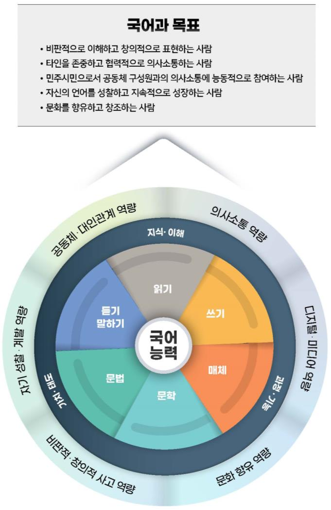

# 국어

# 국어

### 교육과정 설계의 개요

국어과 교육과정에서는 ‘비판적⋅창의적 사고 역량, 디지털⋅미디어 역량, 의사소통 역량, 공동체⋅대인 관계 역량, 문화 향유 역량, 자기 성찰⋅계발 역량’을 국어과 역량으로 설정하였다. 이는 2022 개정 교육과정 총론에서 미래 사회에 필요한 핵심역량으로 제시한 ‘자기 관리 역량, 지식정보처리 역량, 창의적 사고 역량, 심미적 감성 역량, 협력적 소통 역량, 공동체 역량’을 국어과 특성에 맞게 재구성한 것이다. 이 중 ‘비판적⋅창의적 사고 역량, 의사소통 역량, 공동체⋅대인 관계 역량, 문화 향유 역량, 자기 성찰⋅계발 역량’은 2015 개정 국어과 교육과정 역량을 유지한 것이고, ‘디지털⋅미디어 역량’은 디지털 다매체 시대로 변화한 언어 환경을 고려하여 2015 개정 교육과정에서 설정한 ‘자료⋅정보 활용 역량’을 수정한 것이다. 국어과의 여섯 역량은 비판적⋅창의적 이해와 표현, 협력적 의사소통과 공동체 문화, 언어생활에 대한 성찰과 개선, 문화 향유 등의 강조점을 중심으로 국어 과목의 성격과 목표에 반영하였다.

국어과 공통 교육과정은 ‘성격, 목표, 내용 체계, 성취기준, 교수⋅학습 및 평가’로 구성하였다. ‘성격’에는 국어과 학습의 필요성을, ‘목표’에는 핵심역량과의 연계성을 강조한 국어과 학습의 목표를 제시하였다. ‘내용 체계’에는 영역별로 ‘핵심 아이디어’를 밝히고 ‘지식⋅이해’, ‘과정⋅기능’, ‘가치⋅태도’의 세 범주와 그에 따른 학년군별 ‘내용 요소’를 제시하였다. ‘성취기준’은 학습자의 역량 함양을 위하여 내용 체계의 ‘내용 요소’를 유기적으로 결합하여 구성하였다. ‘성취기준’에 대한 이해와 소통을 위해 일부 성취기준에는 ‘성취기준 해설’을 제시하였고, 영역별로 성취기준을 지도할 때 유의할 사항을 ‘성취기준 적용 시 고려 사항’에 설명하였다. ‘교수⋅학습 및 평가’에서는 국어과 교수⋅학습 및 평가 시 강조할 사항을 중심으로 교수⋅학습 및 평가의 방향과 방법을 나누어 제시하였다.

국어과 공통 교육과정의 영역은 ‘듣기⋅말하기, 읽기, 쓰기, 문법, 문학, 매체’의 여섯 영역으로 설정하였다. ‘듣기⋅말하기’는 음성 언어 의사소통을 중심으로, ‘읽기’, ‘쓰기’는 문자 언어 의사소통을 중심으로, ‘문법’은 언어에 대한 이해와 탐구를 중심으로, ‘문학’은 문학에 대한 이해와 수용⋅창작을 중심으로 하여 내용을 구성해 온 전통적 영역이다. ‘매체’는 신설한 영역으로, 기존 영역에 부분적으로 반영해 온 매체 관련 내용 요소를 수정⋅보완하되, 디지털 매체를 기반으로 하여 새로운 의사소통 환경에서 중요하게 부각되고 있는 내용 요소를 교육 내용에 포함하였다. 국어과 여섯 영역은 언어 사용의 실제성과 학습의 유기성을 고려하여 영역 간 연계성이 확보되도록 내용을 구성하였다.

국어과 공통 교육과정의 ‘핵심 아이디어’는 국어과 영역을 아우르면서 영역의 학습을 통해 일반화할 수 있는 내용을 핵심적으로 진술한 것으로, 내용 체계의 설계를 위한 핵심 조직자이다. ‘핵심 아이디어’는 국어 학습을 통해 학습자들이 성취하기를 기대하는 결과이면서 교수⋅학습 과정에서 지속적으로 주목하여야 할 내용으로 구성하였다. 이러한 지향에 따라 학습자를 언어 주체로 보고 국어 활동을 수행하는 언어 주체의 역할에 주목하여 핵심 아이디어를 영역별로 3\~4개의 문장으로 기술하였다.

국어과 공통 교육과정의 ‘내용 체계’는 ‘지식⋅이해’, ‘과정⋅기능’, ‘가치⋅태도’의 세 범주로 구분하여 설정하였다. 듣기⋅말하기, 읽기, 쓰기, 매체 영역의 경우, ‘지식⋅이해’는 의사소통의 맥락과 유형, ‘과정⋅기능’은 의사소통의 과정과 전략, ‘가치⋅태도’는 흥미, 효능감 등과 같은 정의적 요소를 중심으로 내용 요소를 구성하였다. 문법 영역의 경우, ‘지식⋅이해’는 언어의 본질, 맥락, 규범 등, ‘과정⋅기능’은 국어의 분석, 활용, 성찰, 비판 등 탐구 활동 관련 요소, ‘가치⋅태도’는 국어에 대한 호기심, 민감성 등과 같은 정의적 요소를 중심으로 내용 요소를 구성하였다. 문학 영역의 경우, ‘지식⋅이해’는 문학의 갈래와 맥락, ‘과정⋅기능’은 문학 작품의 이해, 해석, 감상, 비평 등 문학 활동 관련 요소, ‘가치⋅태도’는 문학에 대한 흥미와 타자 이해, 가치 내면화 등과 같은 정의적 요소를 중심으로 내용 요소를 구성하였다.

이와 같은 국어과 공통 교육과정의 설계 개요는 다음 그림과 같이 나타낼 수 있다.

### 1. 성격 및 목표

가. 성격

국어는 대한민국의 공용어로서 사고와 의사소통의 도구이자 문화를 창조하고 전승하는 기반이다. 학습자는 음성 언어, 문자 언어, 시각 언어 등 다양한 양식의 기호와 매체가 활용되는 국어를 통하여 자아를 인식하고 타인과 교류하며 세계를 이해한다. 또한 다양한 국어 활동을 통해 지식과 정보를 교류하며 사회적 관계를 형성하고 문화를 향유하면서 민주시민의 소양을 기른다. 이러한 과정에서 건강하고 행복한 삶을 영위하기 위해서는 일상생활 및 사회생활에서 요구되는 높은 수준의 국어 능력을 갖추어야 한다. 특히 과학기술의 고도화로 급격하게 변화하고 있는 의사소통 환경에 능동적으로 대처하기 위해서는 학교생활을 통해 폭넓은 국어 경험을 쌓으면서 체계적인 국어 학습을 할 필요가 있다. 이를 바탕으로 학습자는 더 깊이 있게 사고하고 효율적으로 소통하면서 개인과 공동체가 직면하는 문제를 해결하고 나아가 국어문화를 향유하면서 삶의 행복과 공동체의 발전을 추구할 수 있을 것이다.

초등학교 및 중학교 ‘국어’는 국어를 정확하고 효과적으로 사용하는 능력을 기르고, 가치 있는 국어 활동을 통해 바람직한 인성과 공동체 의식을 함양하며, 비판적이고 창의적인 사고와 활동을 바탕으로 국어문화를 향유하도록 하는 교과이다. 학습자는 ‘국어’의 학습을 통해 국어 교과에서 추구하는 다양한 역량을 기를 수 있다. ‘국어’ 학습자는 다양한 매체를 효과적으로 사용함으로써 일상생활은 물론 학교생활을 포함한 사회생활에서 요구되는 지식과 정보를 수용하고 생산할 수 있다. 다양한 담화와 글, 국어 자료, 작품, 매체로 표현된 텍스트를 분석하면서 비판적 사고력을 함양하고, 자신의 생각을 창의적으로 표현할 수 있다. 의사소통 참여자를 존중하면서 개방적이고도 포용적인 자세로 협력적인 의사소통을 하는 것 또한 국어를 통하여 기를 수 있는 중요한 역량이다. 학습자는 자신이 속한 공동체의 언어문화에 관심을 가지고 이를 탐구하면서 자신의 언어생활을 성찰하고 개선하는 태도를 갖출 수 있다. 이와 함께 다양한 사상과 정서가 반영되어 있는 국어문화를 감상하고 향유할 수 있을 것이다.

나. 목표

국어 의사소통의 맥락과 요소를 이해하고 다양한 의사소통의 과정에 협력적으로 참여하면서 언어생활을 성찰하고 국어문화를 향유함으로써 미래 사회에서 요구되는 높은 수준의 국어 능력을 기른다.

(1) 다양한 유형의 담화, 글, 국어 자료, 작품, 복합 매체 자료를 비판적으로 이해하고 자신의 생각을 창의적으로 표현한다.

(2) 다양성에 대한 이해를 바탕으로 타인의 의견과 감정, 가치관을 존중하면서 협력적으로 의사소통한다.

(3) 민주시민으로서 의사소통에 적극적으로 참여하여 개인과 공동체의 문제를 해결한다.

(4) 공동체의 언어문화를 탐구하고 자신의 언어생활을 성찰하고 개선한다.

(5) 다양한 사상과 정서가 반영되어 있는 국어문화를 감상하고 향유한다.

### 2. 내용 체계 및 성취기준

가. 내용 체계

(1) 듣기⋅말하기

<table>
<tr><th colspan="2">핵심 아이디어</th><th colspan="4">⋅듣기⋅말하기는 언어, 준언어, 비언어, 매체 등을 활용하여 서로의 생각과 감정을 주고받는 행위이다. ⋅화자와 청자는 상황 맥락 및 사회⋅문화적 맥락 속에서 의사소통 목적을 달성하기 위하여 다양한 유형의 담화를 듣고 말한다. ⋅화자와 청자는 의사소통 과정에 협력적으로 참여하고 듣기⋅말하기 과정에서의 문제를 해결하기 위해 적절한 전략을 사용하여 듣고 말한다. ⋅화자와 청자는 듣기⋅말하기에 흥미를 가지고 적극적으로 참여하면서 담화 공동체 구성원으로 성장하고, 상호 존중하고 공감하는 소통 문화를 만들어 간다.</th></tr>
<tr><td colspan="2" rowspan="3">범주</td><td colspan="4">내용 요소</td></tr>
<tr><td colspan="3">초등학교</td><td>중학교</td></tr>
<tr><td>1∼2학년</td><td>3∼4학년</td><td>5∼6학년</td><td>1∼3학년</td></tr>
<tr><td rowspan="2">지식⋅ 이해</td><td>듣기⋅말하기 맥락</td><td colspan="2">⋅상황 맥락</td><td colspan="2">⋅상황 맥락 ⋅사회⋅문화적 맥락</td></tr>
<tr><td>담화 유형</td><td>⋅대화 ⋅발표</td><td>⋅대화 ⋅발표 ⋅토의</td><td>⋅대화 ⋅면담 ⋅발표 ⋅토의 ⋅토론</td><td>⋅대화 ⋅면담 ⋅발표 ⋅연설 ⋅토의 ⋅토론</td></tr>
<tr><td rowspan="4">과정⋅ 기능</td><td>내용 확인⋅추론⋅ 평가</td><td>⋅집중하기 ⋅중요한 내용 확인하기 ⋅일이 일어난 순서 파악하기</td><td>⋅중요한 내용과 주제 파악하기 ⋅내용 요약하기 ⋅원인과 결과 파악하기 ⋅내용 예측하기</td><td>⋅생략된 내용 추론하기 ⋅주장, 이유, 근거가 타당한지 평가하기</td><td>⋅의도와 관점 추론하기 ⋅논증이 타당한지 평가하기 ⋅설득 전략 평가하기</td></tr>
<tr><td>내용 생성⋅조직⋅ 표현과 전달</td><td>⋅경험과 배경지식 활용하기 ⋅일이 일어난 순서에 따라 조직하기 ⋅바르고 고운 말로 표현하기 ⋅바른 자세로 말하기</td><td>⋅목적과 주제 고려하기 ⋅자료 정리하기 ⋅원인과 결과 구조에 따라 조직하기 ⋅주제에 적절한 의견과 이유 제시하기 ⋅준언어⋅비언어적 표현 활용하기</td><td>⋅청자와 매체 고려하기 ⋅자료 선별하기 ⋅핵심 정보 중심으로 내용 구성하기 ⋅주장, 이유, 근거로 내용 구성하기 ⋅매체 활용하여 전달하기</td><td>⋅담화 공동체 고려하기 ⋅자료 재구성하기 ⋅체계적으로 내용 구성하기 ⋅반론 고려하여 논증 구성하기 ⋅상호 존중하며 표현하기 ⋅말하기 불안에 대처하기</td></tr>
<tr><td>상호 작용</td><td>⋅말차례 지키기 ⋅감정 나누기</td><td>⋅상황과 상대의 입장 이해하기 ⋅예의를 지키며 듣고 말하기 ⋅의견 교환하기</td><td>⋅궁금한 내용 질문하기 ⋅절차와 규칙 준수하기 ⋅협력적으로 참여하기 ⋅의견 비교하기 및 조정하기</td><td>⋅목적과 상대에 맞는 질문하기 ⋅듣기⋅말하기 방식의 다양성 고려하기 ⋅경청과 공감적 반응하기 ⋅대안 탐색하기 ⋅갈등 조정하기</td></tr>
<tr><td>점검과 조정</td><td></td><td colspan="3">⋅듣기⋅말하기 과정과 전략에 대해 점검⋅조정하기</td></tr>
<tr><td colspan="2">가치⋅태도</td><td>⋅듣기⋅말하기에 대한 흥미</td><td>⋅듣기⋅말하기 효능감</td><td>⋅듣기⋅말하기에 적극적 참여</td><td>⋅듣기⋅말하기에 대한 성찰 ⋅공감적 소통 문화 형성</td></tr>
</table>

(2) 읽기

<table>
<tr><th colspan="2">핵심 아이디어</th><th colspan="4">⋅읽기는 독자가 자신의 배경지식이나 경험을 활용하여 언어를 비롯한 다양한 기호나 매체로 표현된 글의 의미를 능동적으로 구성하는 행위이다. ⋅독자는 다양한 상황 맥락과 사회⋅문화적 맥락 속에서 자신의 읽기 목적을 달성하기 위하여 다양한 유형의 글을 읽는다. ⋅독자는 읽기 과정을 점검⋅조정하며 읽기 과정에서 부딪히는 문제를 해결하기 위해 적절한 읽기 전략을 사용하여 글을 읽는다. ⋅독자는 읽기 경험을 통해 읽기에 대한 긍정적 정서를 형성하고 삶과 공동체의 문제 해결을 위해 공동체 구성원과 함께 독서를 통해 소통함으로써 사회적 독서 문화를 만들어 간다.</th></tr>
<tr><td colspan="2" rowspan="3">범주</td><td colspan="4">내용 요소</td></tr>
<tr><td colspan="3">초등학교</td><td>중학교</td></tr>
<tr><td>1∼2학년</td><td>3∼4학년</td><td>5∼6학년</td><td>1∼3학년</td></tr>
<tr><td rowspan="2">지식⋅ 이해</td><td>읽기 맥락</td><td></td><td>⋅상황 맥락</td><td colspan="2">⋅상황 맥락 ⋅사회⋅문화적 맥락</td></tr>
<tr><td>글의 유형</td><td>⋅친숙한 화제의 글 ⋅설명 대상과 주제가 명시적인 글 ⋅생각이나 감정이 명시적으로 제시된 글</td><td>⋅친숙한 화제의 글 ⋅설명 대상과 주제가 명시적인 글 ⋅주장, 이유, 근거가 명시적인 글 ⋅생각이나 감정이 명시적으로 제시된 글</td><td>⋅일상적 화제나 사회⋅ 문화적 화제의 글 ⋅다양한 설명 방법을 활용하여 주제를 제시한 글 ⋅주장이 명시적이고 다양한 이유와 근거가 제시된 글 ⋅생각이나 감정이 함축적으로 제시된 글</td><td>⋅인문, 예술, 사회, 문화, 과학, 기술 등 다양한 분야의 글 ⋅다양한 설명 방법을 활용하여 주제를 제시한 글 ⋅다양한 논증 방법을 활용하여 주장을 제시한 글 ⋅생각과 감정이 함축적이고 복합적으로 제시된 글</td></tr>
<tr><td rowspan="4">과정⋅ 기능</td><td>읽기의 기초</td><td>⋅글자, 단어 읽기 ⋅문장, 짧은 글 소리 내어 읽기 ⋅알맞게 띄어 읽기</td><td>⋅유창하게 읽기</td><td></td><td></td></tr>
<tr><td>내용 확인과 추론</td><td>⋅글의 중심 내용 확인하기 ⋅인물의 마음이나 생각 짐작하기</td><td>⋅중심 생각 파악하기 ⋅내용 요약하기 ⋅단어의 의미나 내용 예측하기</td><td>⋅글의 구조를 파악하기 ⋅글의 주장이나 주제 파악하기 ⋅글의 구조 고려하며 내용 요약하기 ⋅생략된 내용과 함축된 의미 추론하기</td><td>⋅설명 방법과 논증 방법 파악하기 ⋅글의 관점이나 주제 파악하기 ⋅읽기 목적과 글의 구조를 고려하며 내용 요약하기 ⋅드러나지 않은 의도나 관점 추론하기</td></tr>
<tr><td>평가와 창의</td><td>⋅인물과 자신의 마음이나 생각 비교하기</td><td>⋅사실과 의견 구별하기 ⋅글이나 자료의 출처 신뢰성 평가하기 ⋅필자와 자신의 의견 비교하기</td><td>⋅글이나 자료의 내용과 표현 평가하기 ⋅다양한 글이나 자료 읽기를 통해 문제 해결하기</td><td>⋅복합양식의 글⋅자료의 내용과 표현 평가하기 ⋅설명 방법과 논증 방법의 타당성 평가하기 ⋅동일 화제에 대한 주제 통합적 읽기 ⋅진로나 관심 분야에 대한 자기 선택적 읽기</td></tr>
<tr><td>점검과 조정</td><td></td><td colspan="3">⋅읽기 과정과 전략에 대해 점검⋅조정하기</td></tr>
<tr><td colspan="2">가치⋅태도</td><td>⋅읽기에 대한 흥미</td><td>⋅읽기 효능감</td><td>⋅긍정적 읽기 동기 ⋅읽기에 적극적 참여</td><td>⋅읽기에 대한 성찰 ⋅사회적 독서 문화 형성</td></tr>
</table>

(3) 쓰기

<table>
<tr><th colspan="2">핵심 아이디어</th><th colspan="4">⋅쓰기는 언어를 비롯한 다양한 기호나 매체를 활용하여 인간의 생각과 감정을 글로 표현함으로써 의미를 구성하는 행위이다. ⋅필자는 상황 맥락 및 사회⋅문화적 맥락 속에서 자신의 의사소통 목적을 달성하기 위하여 다양한 유형의 글을 쓴다. ⋅필자는 쓰기 과정에서 부딪히는 문제를 해결하기 위하여 적절한 쓰기 전략을 사용하여 글을 쓴다. ⋅필자는 쓰기 경험을 통해 언어 공동체의 구성원으로 성장하고, 쓰기 윤리를 갖추어 독자와 소통함으로써 바람직한 의사소통 문화를 만들어 간다.</th></tr>
<tr><td colspan="2" rowspan="3">범주</td><td colspan="4">내용 요소</td></tr>
<tr><td colspan="3">초등학교</td><td>중학교</td></tr>
<tr><td>1∼2학년</td><td>3∼4학년</td><td>5∼6학년</td><td>1∼3학년</td></tr>
<tr><td rowspan="2">지식⋅ 이해</td><td>쓰기 맥락</td><td></td><td>⋅상황 맥락</td><td colspan="2">⋅상황 맥락 ⋅사회⋅문화적 맥락</td></tr>
<tr><td>글의 유형</td><td>⋅주변 소재에 대해 소개하는 글 ⋅겪은 일을 표현하는 글</td><td>⋅절차와 결과를 보고하는 글 ⋅이유를 들어 의견을 제시하는 글 ⋅독자에게 마음을 전하는 글</td><td>⋅대상의 특성이 나타나게 설명하는 글 ⋅적절한 근거를 들어 주장하는 글 ⋅체험에 대한 감상을 나타내는 글</td><td>⋅복수의 자료를 활용 하여 다양한 형식으로 쓴 글 ⋅대상에 적합한 설명 방법을 사용하여 쓴 글 ⋅타당한 근거를 들어 주장하는 글 ⋅의견 차이가 있는 사안에 대해 주장하는 글 ⋅자신의 정서를 표현하는 글</td></tr>
<tr><td rowspan="8">과정⋅ 기능</td><td>쓰기의 기초</td><td>⋅글자 쓰기 ⋅단어 쓰기 ⋅문장 쓰기</td><td>⋅문단 쓰기</td><td></td><td></td></tr>
<tr><td>계획하기</td><td></td><td>⋅목적, 주제 고려하기</td><td>⋅독자, 매체 고려하기</td><td>⋅언어 공동체 고려하기</td></tr>
<tr><td>내용 생성하기</td><td>⋅일상을 소재로 내용 생성하기</td><td>⋅목적, 주제에 따라 내용 생성하기</td><td>⋅독자, 매체를 고려하여 내용 생성하기</td><td>⋅복합양식 자료를 활용하여 내용 생성하기</td></tr>
<tr><td>내용 조직하기</td><td></td><td>⋅절차와 결과에 따라 내용 조직하기</td><td>⋅통일성을 고려하여 내용 조직하기</td><td>⋅글 유형을 고려하여 내용 조직하기</td></tr>
<tr><td>표현하기</td><td>⋅자유롭게 표현하기</td><td>⋅정확하게 표현하기</td><td>⋅독자를 고려하여 표현하기</td><td>⋅다양하게 표현하기</td></tr>
<tr><td>고쳐쓰기</td><td></td><td>⋅문장, 문단 수준 에서 고쳐쓰기</td><td>⋅글 수준에서 고쳐쓰기</td><td>⋅독자를 고려하여 고쳐쓰기</td></tr>
<tr><td>공유하기</td><td colspan="4">⋅쓴 글을 함께 읽고 반응하기</td></tr>
<tr><td>점검과 조정</td><td></td><td colspan="3">⋅쓰기 과정과 전략에 대해 점검⋅조정하기</td></tr>
<tr><td colspan="2">가치⋅태도</td><td>⋅쓰기에 대한 흥미</td><td>⋅쓰기 효능감</td><td>⋅쓰기에 적극적 참여 ⋅쓰기 윤리 준수</td><td>⋅쓰기에 대한 성찰 ⋅윤리적 소통 문화 형성</td></tr>
</table>

(4) 문법

<table>
<tr><th colspan="2">핵심 아이디어</th><th colspan="4">⋅문법은 국어의 형식과 내용을 이루는 틀로서 규칙과 원리로 구성⋅운영되며, 문법 탐구는 문법에 대해 사고하는 활동으로 국어에 대한 총체적 앎을 이끈다. ⋅국어는 체계와 구조를 갖춘 의미 생성 자원이자, 사회적으로 구성된 관습적 규약이며, 공동체의 사고와 가치를 표상하는 문화적 산물이다. ⋅국어 자료는 다양한 맥락에서 만들어지는 의사소통의 결과물로서, 국어 현상을 파악하고 국어 문제를 발견할 수 있는 문법 탐구의 대상이다. ⋅국어 사용자는 일상생활에서 국어 현상과 국어 문제를 탐구하고 성찰하면서 언어 주체로서의 정체성과 국어 의식을 형성한다.</th></tr>
<tr><td colspan="2" rowspan="3">범주</td><td colspan="4">내용 요소</td></tr>
<tr><td colspan="3">초등학교</td><td>중학교</td></tr>
<tr><td>1∼2학년</td><td>3∼4학년</td><td>5∼6학년</td><td>1∼3학년</td></tr>
<tr><td rowspan="3">지식⋅ 이해</td><td>언어의 본질과 맥락</td><td></td><td>⋅의사소통과 관계 형성 수단으로서의 언어 ⋅참여자 간 관계 및 장면에 따른 언어</td><td>⋅음성 언어 및 문자 언어의 특성과 매체 ⋅지역에 따른 언어와 표준어</td><td>⋅국어의 음운 체계와 문자 체계 ⋅세대⋅분야⋅매체에 따른 언어</td></tr>
<tr><td>언어 단위</td><td>⋅글자⋅단어⋅문장</td><td>⋅단어의 의미와 단어 간의 의미 관계 ⋅단어의 분류 ⋅문장의 기본 구조 ⋅글과 담화의 높임 표현과 지시⋅접속 표현</td><td>⋅어휘 체계와 고유어 ⋅관용 표현 ⋅문장 성분과 호응 ⋅글과 담화의 시간 표현</td><td>⋅단어의 형성 방법 ⋅품사의 종류와 특성 ⋅어휘의 양상과 쓰임 ⋅문장의 짜임과 확장 ⋅글과 담화의 피동⋅ 인용 표현</td></tr>
<tr><td>한글의 기초와 국어 규범</td><td>⋅한글 자모의 이름과 소리 ⋅단어의 발음과 표기 ⋅문장과 문장 부호</td><td>⋅단어의 정확한 발음과 표기</td><td>⋅단어와 문장의 정확한 표기와 사용</td><td>⋅한글 맞춤법의 원리와 내용</td></tr>
<tr><td rowspan="2">과정⋅ 기능</td><td>국어의 분석과 활용</td><td>⋅언어 단위 관찰하기</td><td>⋅언어 단위 관찰하고 분석하기 ⋅국어사전 활용하여 문제 해결하기 ⋅글과 담화에 적절한 표현 사용하기</td><td>⋅언어 표현의 특징 분석하기 ⋅글과 담화에 적절한 표현 사용하기</td><td>⋅기준에 따라 분류 하고 분석하기 ⋅원리 적용하여 표현 창안하기 ⋅글과 담화에 적절한 표현을 사용하고 효과 비교하기 ⋅자료를 해석하고 창의적으로 활용하기</td></tr>
<tr><td>국어 실천의 성찰과 비판</td><td>⋅소리와 표기의 차이 인식하기</td><td>⋅국어 규범 인지하고 수용하기</td><td>⋅국어생활 점검하고 실천하기 ⋅언어 표현의 효과 평가하기</td><td>⋅국어 규범의 원리 탐색하기 ⋅언어 표현의 의도 탐색하고 대안 모색하기 ⋅국어 문제 발견하고 실천 양상 비판하기</td></tr>
<tr><td colspan="2">가치⋅태도</td><td>⋅한글에 대한 호기심</td><td>⋅국어의 소중함 인식</td><td>⋅국어생활에 대한 민감성 ⋅집단⋅사회의 언어와 나의 언어의 관계 인식</td><td>⋅다양한 집단⋅사회의 언어에 대한 언어적 관용 ⋅언어로 구성되는 세계와 자아 인식</td></tr>
</table>

(5) 문학

<table>
<tr><th colspan="2">핵심 아이디어</th><th colspan="4">⋅문학은 인간의 삶을 언어로 형상화한 작품을 통해 즐거움과 깨달음을 얻고 타자와 소통하는 행위이다. ⋅문학 작품을 통한 소통은 작품의 갈래, 작가와 독자, 사회와 문화, 문학사의 영향 등을 고려하며 이루어진다. ⋅문학 수용⋅생산 능력은 문학의 해석, 감상, 비평, 창작 활동을 통해 향상된다. ⋅인간은 문학을 향유하면서 자아를 성찰하고 타자를 이해하며 공동체의 일원으로 성장한다.</th></tr>
<tr><td colspan="2" rowspan="3">범주</td><td colspan="4">내용 요소</td></tr>
<tr><td colspan="3">초등학교</td><td>중학교</td></tr>
<tr><td>1∼2학년</td><td>3∼4학년</td><td>5∼6학년</td><td>1∼3학년</td></tr>
<tr><td rowspan="2">지식⋅ 이해</td><td>갈래</td><td>⋅시, 노래 ⋅이야기, 그림책</td><td>⋅시 ⋅이야기 ⋅극</td><td>⋅시 ⋅소설 ⋅극 ⋅수필</td><td>⋅서정 ⋅서사 ⋅극 ⋅교술</td></tr>
<tr><td>맥락</td><td></td><td>⋅독자 맥락</td><td>⋅작가 맥락 ⋅독자 맥락</td><td>⋅작가 맥락 ⋅독자 맥락 ⋅사회⋅문화적 맥락</td></tr>
<tr><td rowspan="4">과정⋅ 기능</td><td>작품 읽기와 이해</td><td>⋅낭송하기, 말놀이하기 ⋅말의 재미 느끼기</td><td>⋅자신의 경험을 바탕으로 읽기 ⋅사실과 허구의 차이 이해하기</td><td>⋅작가의 의도를 생각하며 읽기 ⋅갈래의 기본 특성 이해하기</td><td>⋅사회⋅문화적 상황을 생각하며 읽기 ⋅연관된 작품들과의 관계 이해하기</td></tr>
<tr><td>해석과 감상</td><td>⋅작품 속 인물 상상하기 ⋅작품 읽고 느낀 점 말하기</td><td>⋅인물의 성격과 역할 파악하기 ⋅이야기의 흐름 생각하며 감상하기</td><td>⋅인물, 사건, 배경 파악하기 ⋅비유적 표현에 유의하여 감상하기</td><td>⋅근거를 바탕으로 작품 해석하기 ⋅갈등의 진행과 해결 과정 파악하기 ⋅보는 이, 말하는 이의 효과 파악하기 ⋅운율, 비유, 상징의 특성과 효과를 생각하며 감상하기</td></tr>
<tr><td>비평</td><td></td><td>⋅마음에 드는 작품 소개하기</td><td>⋅인상적인 부분을 중심으로 작품에 대해 의견 나누기</td><td>⋅다양한 해석 비교⋅평가하기</td></tr>
<tr><td>창작</td><td>⋅시, 노래, 이야기, 그림 등 다양한 형식으로 표현하기</td><td>⋅감각적 표현 활용하여 표현하기</td><td>⋅갈래 특성에 따라 표현하기</td><td>⋅개성적 발상과 표현으로 형상화하기</td></tr>
<tr><td colspan="2">가치⋅태도</td><td>⋅문학에 대한 흥미</td><td>⋅작품 감상의 즐거움</td><td>⋅문학을 통한 자아 성찰 ⋅문학 소통의 즐거움</td><td>⋅문학을 통한 타자 이해 ⋅문학을 통한 공동체 문제에의 참여 ⋅문학의 가치 내면화</td></tr>
</table>

(6) 매체

<table>
<tr><th colspan="2">핵심 아이디어</th><th colspan="4">⋅매체는 소통을 매개하는 도구, 기술, 환경으로 당대 사회의 소통 방식과 소통 문화에 영향을 미친다. ⋅매체 이용자는 매체 자료의 주체적인 수용과 생산을 통해 정체성을 형성하고 사회적 의미 구성 과정에 관여한다. ⋅매체 이용자는 매체 및 매체 소통의 영향력에 대한 이해와 자신과 타인의 권리를 지키기 위한 적극적인 노력을 통해 건강한 소통 공동체를 형성한다.</th></tr>
<tr><td colspan="2" rowspan="3">범주</td><td colspan="4">내용 요소</td></tr>
<tr><td colspan="3">초등학교</td><td>중학교</td></tr>
<tr><td>1∼2학년</td><td>3∼4학년</td><td>5∼6학년</td><td>1∼3학년</td></tr>
<tr><td rowspan="2">지식⋅ 이해</td><td>매체 소통 맥락</td><td></td><td>⋅상황 맥락</td><td colspan="2">⋅상황 맥락 ⋅사회⋅문화적 맥락</td></tr>
<tr><td>매체 자료 유형</td><td>⋅일상의 매체 자료</td><td>⋅인터넷의 학습 자료</td><td>⋅뉴스 및 각종 정보 매체 자료</td><td>⋅대중매체와 개인 인터넷 방송 ⋅광고⋅홍보물</td></tr>
<tr><td rowspan="4">과정⋅ 기능</td><td>접근과 선택</td><td>⋅매체 자료 접근하기</td><td>⋅인터넷 자료 탐색⋅선택하기</td><td>⋅목적에 맞는 정보 검색하기</td><td></td></tr>
<tr><td>해석과 평가</td><td></td><td>⋅매체 자료 의미 파악하기</td><td>⋅매체 자료의 신뢰성 평가하기</td><td>⋅매체의 특성과 영향력 비교하기 ⋅매체 자료의 재현 방식 분석하기 ⋅매체 자료의 공정성 평가하기</td></tr>
<tr><td>제작과 공유</td><td>⋅글과 그림으로 표현하기</td><td>⋅발표 자료 만들기 ⋅매체 자료 활용⋅공유하기</td><td>⋅복합양식 매체 자료 제작⋅공유하기</td><td>⋅영상 매체 자료 제작⋅공유하기</td></tr>
<tr><td>점검과 조정</td><td></td><td>⋅매체 소통의 목적 점검하기</td><td>⋅매체 이용 양상 점검하기</td><td>⋅상호 작용적 매체를 통한 소통 점검하기</td></tr>
<tr><td colspan="2">가치⋅태도</td><td>⋅매체 소통에 대한 흥미와 관심</td><td>⋅매체 소통 윤리</td><td>⋅매체 소통에 대한 성찰</td><td>⋅매체 소통의 권리와 책임</td></tr>
</table>

나. 성취기준

[중학교 1∼3학년]

(1) 듣기⋅말하기

[9국01-01] 화자의 의도와 관점을 추론하며 듣는다.
[9국01-02] 설득 전략을 비판적으로 분석하며 듣는다.
[9국01-03] 담화 공동체에 따른 듣기⋅말하기 방식의 다양성을 고려하여 듣고 말한다.
[9국01-04] 상대의 말을 경청하고 상대의 감정과 입장에 공감하는 반응을 보이며 대화한다.
[9국01-05] 면담의 다양한 목적과 상대를 고려하여 질문을 점검하고 효과적으로 면담한다.
[9국01-06] 다양한 자료를 재구성하여 내용을 체계적으로 조직하고 청중이 이해하기 쉽게 발표한다.
[9국01-07] 토의에서 다양한 의견을 교환하여 대안을 마련하고 문제를 해결한다.
[9국01-08] 토론에서 반론을 고려하여 타당한 논증을 구성하고 논리적으로 반박한다.
[9국01-09] 서로의 감정이나 바라는 바를 진솔하게 표현하면서 갈등을 조정한다.
[9국01-10] 언어폭력의 문제점을 성찰하고, 서로를 존중하는 표현을 사용하여 말한다.
[9국01-11] 듣기⋅말하기 과정을 점검하고 듣기⋅말하기의 어려움을 효과적으로 조정한다.

(가) 성취기준 해설

• [9국01-01] 이 성취기준은 담화의 맥락을 고려하여 담화에서 표면적으로 드러나지 않는 숨겨진 요소를 추론하며 들음으로써 담화의 내용을 깊이 이해하는 능력을 기르기 위해 설정하였다. 일상의 대화 상황에서 상대의 발화 의도 추론하기, 정보 전달이나 설득 등 다양한 목적의 담화에서 여러 가지 정보와 상황 맥락을 고려하여 화자의 숨겨진 의도와 관점, 가치관 추론하기 등을 학습한다.

• [9국01-03] 이 성취기준은 개인이 속해 있는 담화 공동체의 듣기⋅말하기 방식이 가진 다양성을 고려하여 구어 의사소통에 참여함으로써 사회⋅문화적 맥락에 맞는 의사소통 능력을 기르기 위해 설정하였다. 듣기⋅말하기 방식에 영향을 미치는 요인으로 세대, 성, 직업, 지역, 공동체의 관심사나 이해관계, 공동체의 언어문화와 관습 등이 있음을 이해하기, 개인이 속한 집단이나 공동체에 따라 듣기⋅말하기 방식이 다양할 수 있음을 이해하기, 듣기⋅말하기 방식의 다양성에 대한 존중이 긍정적인 관계 형성과 유지에 기여함을 이해하기, 서로 다른 듣기⋅말하기 방식을 이해하고 존중하는 태도 형성하기, 자신의 듣기⋅말하기 방식이 상황 맥락이나 자신이 속한 공동체에 적절한지를 지속적으로 점검하여 개선하기 등을 학습한다.

• [9국01-05] 이 성취기준은 효과적으로 면담을 수행함으로써 목적과 상대를 고려하는 의사소통 능력을 기르기 위해 설정하였다. 말하기나 글쓰기를 위한 자료 수집, 의사 결정, 상담, 선발 등 다양한 면담 목적과 상대를 고려하여 질문 마련하기, 구조화 면담 또는 반구조화 면담 등 면담 유형에 적절한 면담 수행 계획 세우기, 면담 대상자의 입장이나 반응 등에 따라 면담 질문의 내용이나 순서, 진행 방법 등을 조정하여 면담하기, 면담 중에 추가 질문하기, 면담 후 면담 계획이나 목적에 따라 면담이 원만하게 진행되었는지를 점검하기, 질문의 의도와 답변자의 의도를 고려하여 면담 내용을 정리하기 등을 학습한다.

• [9국01-06] 이 성취기준은 말할 내용을 체계적으로 조직하여 청중이 이해하기 쉽게 발표하는 능력을 함양하기 위해 설정하였다. 다양한 자료를 청자가 이해하기 쉬운 방향으로 재구성하기, 발표 내용을 도입부⋅전개부⋅정리부로 나누어 체계적으로 구성하기, 발표 목적이나 대상의 특성에 적절한 설명 방법 활용하기, 청중이 이해하기 쉽게 발표하기, 발표 준비와 실행 과정을 되돌아보고 수행의 적절성 점검하기 등을 학습한다.

• [9국01-08] 이 성취기준은 합리적이고 민주적인 의사 결정을 위한 토론 능력을 기르기 위해 설정하였다. 토론 논제에 대한 찬성과 반대 입장별로 각 입장을 뒷받침하는 이유와 근거 마련하기, 상대방이 제기할 수 있는 반론을 고려하여 논증 구성하기, 주장⋅이유⋅근거⋅반론에 대한 고려 등 논증 구성 요소들이 타당한지 비판적으로 분석하여 반박하기, 논증의 논리적 전개 과정에서 논리적 허점이나 오류가 없는지 분석하여 반박하기 등을 학습한다.

• [9국01-09] 이 성취기준은 갈등을 조정할 수 있는 대화 방법을 배움으로써 상대방과의 관계를 원만하게 유지할 수 있는 능력을 기르기 위해 설정하였다. 자신의 생각과 감정을 진솔하게 표현하는 것이 왜 중요한지 이해하기, 자신과 상대의 생각과 감정, 욕구 등을 정확히 파악하기, 어떠한 차이로 인해 갈등이 발생하게 되었는지 분석하기, 사건에 대한 주관적 해석을 배제하고 객관적으로 전달하기, 상황이나 사건에 대한 자신의 감정과 욕구를 진솔하게 표현하기, 자신이 상대에게 바라는 것이 무엇인지 구체적으로 요청하기 방법을 활용하여 갈등 조정하기, 갈등을 악화시킬 수 있는 표현 경계하기, 상대의 의견과 감정을 존중하기 등을 학습한다.

• [9국01-11] 이 성취기준은 듣기⋅말하기 전⋅중⋅후 과정을 점검하고 구어 의사소통 과정에서 발생하는 다양한 어려움을 효과적으로 조정하는 상위 인지 능력을 기르기 위해 설정하였다. 듣기⋅말하기 활동 후에 자신의 듣기⋅말하기 과정이 적절했는지 성찰하기, 듣기⋅말하기 과정에서 부딪히는 어려움 분석하기, 향후의 듣기⋅말하기를 효과적으로 수행하기 위해 조정해야 할 점을 찾아 개선 계획 세워보기, 말하기 불안을 느끼는 상황에서 이를 완화할 수 있는 방법을 연습하고 적용하기 등을 학습한다.

(나) 성취기준 적용 시 고려 사항

• 구어 의사소통을 효과적으로 수행하는 데 필요한 능력과 태도를 바탕으로, 교과 학습을 효과적으로 수행하고, 원만한 대인 관계를 형성⋅유지하며, 사회적 소통에 적극적으로 참여할 수 있는 능력을 갖출 수 있도록 한다. 일상의 친숙한 주제를 포함하여 지역사회 공동체와 관련된 주제를 다루는 상황, 사적이고 비격식적 담화를 포함하여 공적이고 격식적인 담화 상황에 필요한 듣기⋅말하기 과정과 전략, 태도를 학습하고, 자신의 듣기⋅말하기 과정을 지속적으로 점검하고 조정하는 상위 인지 활동도 수행하도록 한다.

• 전형적인 구어 담화 자료 이외에 학습자들이 일상에서 접할 수 있는 다양한 매체를 활용하여 디지털 소통 공간에서 필요한 능력과 태도를 기르도록 지도한다. 휴대전화의 문자 메시지나 사회 관계망 서비스(SNS)에서 차별적 표현이나 폭력적인 언어를 사용하지 않았는지 스스로 성찰하고, 서로를 존중하는 표현을 사용하도록 하여 디지털 기반의 소통 공간에서도 타인을 배려하고 공감하는 언어를 사용하도록 한다.

• 듣기⋅말하기의 상호 교섭성을 고려하여 듣기와 말하기를 효과적으로 통합하고, 읽기 및 쓰기 영역과도 상호 연계하여 국어 활동의 총체성을 구현하도록 한다. 공감하며 듣기는 자신의 감정을 진솔하게 표현하며 갈등 조정하기와 연계하여 지도할 수 있으며, 설득 전략을 분석하며 듣기는 토론에서 논리적으로 반박하기와 연계하여 지도할 수 있다. 말하기 방식의 다양성을 고려하여 듣고 말하기는 공감적 대화하기와 연계하여 지도할 수 있다. 논설문을 읽고 설득 전략을 비판적으로 분석하기, 면담 후 면담 보고서 작성하기 등과 같이 타 영역과 연계하여 지도할 수도 있다.

• 경청하기, 질문하기, 체계적으로 내용 구성하기, 문제 해결을 위한 대안 탐색하기, 논리적으로 반박하기 등의 기능은 대화, 면담, 발표, 토의, 토론 담화뿐만 아니라 다양한 담화를 듣고 말하는 데 두루 필요하므로, 일반적인 구어 의사소통 상황으로의 전이 가능성을 고려하여 지도한다.

• 설득 전략을 비판적으로 분석하며 듣기를 지도할 때는 연설을 비롯하여 일상에서 접할 수 있는 다양한 강연, 광고 등 생활 속 담화 자료를 활용함으로써, 비판적으로 사고하고 합리적으로 의사 결정 할 수 있는 능력을 갖추도록 한다.

• 공감적 대화하기를 지도할 때는 공감적 대화가 원만한 대인 관계를 형성하고 유지하는 데 필요할 뿐만 아니라, 듣기⋅말하기 활동에 협력적으로 참여하는 토대가 된다는 점을 안내한다. 나아가 다양한 사회⋅문화적 배경을 가진 상대의 상황과 처지에서 문제를 바라보고 상대의 생각과 감정을 보다 깊이 이해하기 위해 노력하는 포용적 태도를 함양할 수 있도록 한다.

• 면담하기를 지도할 때는 진로연계교육 차원에서 자신의 진로와 관련된 전문가와의 면담을 통해 학습자의 진로 탐색을 지원할 수 있다. 자신의 관심 진로 분야를 결정하거나 다양한 진로를 모색하기 위한 목적으로 관련 전문가와의 면담을 준비하되, 온라인상에서의 면담도 가능하므로 면담 대상자를 다각적으로 찾아보도록 지도한다. 진로에 대한 관심 분야가 유사한 동료 학습자들과 모둠을 이루어 면담을 수행하도록 지도할 수도 있다.

• 토론하기를 지도할 때는 반론이나 반박이 사람을 대상으로 하는 것이 아니라 상대의 논증을 대상으로 하는 것임을 안내한다. 상대를 존중하는 태도와 감정적으로 대응하지 않고 논리적으로 판단하고 대응하는 자세를 갖추도록 하여 민주시민으로서의 기초 소양을 함양하도록 한다.

• 듣기⋅말하기 태도의 내면화를 위해서 학습자 스스로 듣기⋅말하기 활동의 다양성을 존중하고 있는지, 상대를 존중하는 표현을 사용하고 공감적 대화를 실천하고 있는지 등을 지속적으로 점검하는 성찰 일지 작성하기 활동을 활용할 수 있다. 성찰 전⋅후에 어떤 차이가 있었는지, 또 어떤 점을 개선해 나갈 것인지도 생각해 보도록 한다.

• 듣기⋅말하기 활동의 적절성과 효과성에 대해 피드백을 나눌 때는 교사나 동료 학습자의 피드백을 열린 마음으로 수용하되 자신의 목표를 고려하여 타인의 피드백을 현명하게 받아들이는 방법에 대해서도 생각해 보도록 한다.

(2) 읽기

[9국02-01] 읽기는 사회⋅문화적 맥락에서 의미를 구성하는 과정임을 이해하며 사회적 독서에 참여하고 사회적 독서 문화 형성에 기여한다.
[9국02-02] 읽기 목적과 글의 구조를 고려하며 글을 효과적으로 요약한다.
[9국02-03] 독자의 배경지식과 글에 나타난 정보 등을 활용하여 글에 드러나지 않은 의도나 관점을 추론하며 읽는다.
[9국02-04] 복합양식으로 구성된 글이나 자료의 내용 타당성과 신뢰성, 표현 방법의 적절성을 평가하며 읽는다.
[9국02-05] 글에 사용된 다양한 설명 방법과 논증 방법을 파악하고, 그 타당성을 평가하며 읽는다.
[9국02-06] 동일한 화제를 다룬 여러 글이나 자료를 주제 통합적으로 읽는다.
[9국02-07] 진로나 관심 분야에 대한 다양한 책이나 자료를 스스로 찾아 읽는다.
[9국02-08] 자신의 독서 상황과 수준에 맞는 글을 선정하고 읽기 과정을 점검⋅조정하며 읽는다.

(가) 성취기준 해설

• [9국02-01] 이 성취기준은 읽기가 다양한 사회⋅문화적 맥락에 속한 공동체 구성원들이 상호 작용하며 의미를 구성하는 과정임을 이해하고 사회적 독서 문화 형성에 기여하도록 하기 위해 설정하였다. 독자는 자신이 처한 상황이나 사회⋅문화, 역사적 배경에 따라 의미를 형성해 간다. 또한 공동체 구성원들이 구성한 의미를 협력적으로 소통함에 따라 타인의 삶에 대한 이해나 공동체가 지향해야 할 가치를 발견할 수 있다. 사회⋅문화적으로 가치 있는 주제의 글을 선정하여 읽기, 사회⋅문화적 맥락을 고려하여 필자의 의도 파악하기, 독서 토론을 통해 구성원 간의 다양한 의미 교환하기, 사회⋅문화적 맥락에서 새로운 의미 발견하기, 사회적 독서 문화 형성하기 등을 학습한다.

• [9국02-04] 이 성취기준은 복합양식으로 구성된 글이나 자료를 내용과 형식의 측면에서 비판적으로 평가하며 읽을 수 있는 능력을 기르기 위해 설정하였다. 다양한 매체 환경에서는 문자 언어로만 이루어진 단일양식뿐만 아니라 문자, 소리, 그림, 사진, 동영상 등 다양한 기호가 함께 어우러진 복합양식의 글이나 자료를 비판적으로 읽을 수 있어야 한다. 단일양식과 복합양식의 글이나 자료 비교하기, 복합양식의 글이나 자료가 작성된 맥락 파악하기, 복합양식으로 구성된 글이나 자료의 내용 타당성과 신뢰성, 표현 방법의 적절성을 평가하며 읽기 등을 학습한다.

• [9국02-06] 이 성취기준은 동일한 화제를 다룬 여러 글이나 자료를 비판적으로 읽고 자신의 관점에 따라 의미를 재구성할 수 있는 주제 통합적 읽기 능력을 기르기 위해 설정하였다. 동일한 화제에 대해 서로 다른 관점을 지닌 글을 대조하며 읽거나 비슷한 주제를 담은 다양한 형식을 비교하며 읽으면서, 독자는 편견이나 선입견을 배제하고 합리적으로 판단할 수 있게 된다. 여러 글이나 자료를 비교하며 읽는 과정에서 독자는 화제와 관련된 쟁점에 대한 충분한 이해를 바탕으로 자신의 관점을 세울 수 있다. 관점이나 형식이 다른 다양한 글이나 자료를 비교⋅분석하기, 대상 화제에 대한 자신의 관점 수립하기, 서로 다른 관점과 형식의 글을 자신의 관점을 토대로 통합하기, 자신의 관점에 따라 의미를 구성하고 표현하기 등을 학습한다.

• [9국02-07] 이 성취기준은 자신의 진로나 관심 분야에 대한 책이나 자료 등을 스스로 탐색하고 선정하여 읽는 능력을 기르기 위해 설정하였다. 학습자가 다양한 글이나 자료를 자기 선택적으로 읽으며 주체적으로 자신의 진로나 관심 분야를 탐색할 수 있도록 한다. 학습자가 관심을 가지고 있는 진로나 관심 분야를 파악하기, 도서관이나 인터넷 등에서 자신의 진로 탐색이나 관심 분야에 대한 깊이 있는 이해를 위해 적합한 책이나 자료를 탐색하고 선정하기, 필요한 정보를 선별하며 읽기, 진로나 관심 분야가 유사한 학습자 간에 읽기 결과를 공유하기 등을 학습한다.

(나) 성취기준 적용 시 고려 사항

• 전통적인 문어 자료인 책이나 글 이외에도 학습자들이 일상에서 접할 수 있는 다양한 매체 자료를 대상으로 읽기 능력을 기르도록 지도한다. 글이나 자료의 내용 타당성 평가를 지도할 때는 내용의 신뢰성이나 타당성에 대한 평가를 중심으로 지도한다. 표현의 적절성을 평가할 때는 글의 의도나 목적에 따른 재현, 복합양식성 등의 요소에 대한 평가를 중심으로 지도한다. 예를 들어 신문의 경우는 표제나 기사 본문, 사진 등을 통해서, 광고의 경우는 배경, 이미지, 광고 문구, 구도나 배치 등을 통해서 필자의 의도나 목적이 드러나는데, 이를 바탕으로 필자의 의도나 관점이 지나치게 편향되지 않았는지, 전달 효과가 잘 드러나는지 등을 평가할 수 있다. 이때 특정한 성, 지역, 연령, 가정 배경, 인종, 장애 등에 대한 고정 관념이나 차별 등의 문제와 연계하여 글이나 자료를 비판적으로 살펴볼 수 있도록 지도한다.

• 주제 통합적 읽기를 지도할 때는 동일한 화제에 대해 서로 다른 관점을 지닌 글이나 자료를 단순히 비교⋅대조하며 읽는 활동에 머무르지 않고, 편견이나 선입견을 배제하고 합리적으로 비판하며 자신의 관점을 설정하고 이에 따라 종합하고 재구성하며 읽을 수 있도록 한다. 다양한 매체를 통해 접하게 되는 복합양식 글이나 자료에 대해 내용의 타당성과 신뢰성을 비판적으로 평가하며 읽는 활동, 글에 사용된 논증의 타당성을 평가하며 읽는 활동 등을 통해 무비판적으로 정보를 수용하지 않고 평가하는 자세, 편향되지 않은 관점으로 여러 자료를 참조하며 균형 있게 정보를 수용하는 자세 등을 지도하여 민주시민으로서의 소양을 함양할 수 있도록 한다.

• 읽기 목적과 글의 구조를 고려하여 요약하기를 지도할 때는 선택, 삭제, 일반화, 재구성 같은 요약의 규칙을 기계적으로 적용하여 중심 내용을 도출하기보다는 학습자의 읽기 목적을 고려하여 필요한 정보가 무엇인지를 확인한 후 이에 부합하는 중심 내용을 요약할 수 있도록 한다. 이때 글의 구조를 고려하여 중심 내용을 요약하도록 안내하면 효과적이다. 글 전체에 대한 요약인 경우 글의 거시적 구조를 고려한 요약이 이루어질 수 있고, 글 일부에 대한 요약인 경우 글의 미시적 구조 혹은 내용 전개 방식을 고려한 요약이 이루어질 수 있다. 글의 구조를 시각화하여 제시한 도해 조직자를 활용할 수 있고, 짝이나 모둠 활동을 연계하여 요약하기 과정과 결과를 공유하며 효과적으로 전략을 내면화할 수 있도록 지도한다. 해당 성취기준은 타 교과 학습을 위한 교과서 읽기, 학습 자료 읽기 등의 상황과 연계하여 지도함으로써 교과 학습 능력과 읽기 능력이 균형 있게 발달할 수 있도록 지도한다.

• 설명 방법과 논증 방법을 파악하고 타당성을 평가하며 읽기를 지도할 때는 정의, 예시, 비교와 대조, 분류와 구분, 인과, 분석 등의 설명 방법이나 연역과 귀납 등의 논증 방법에 대한 개념을 단순히 파악하는 데 머무르지 않고 설명 방법이나 논증 방법의 타당성을 평가하며 글을 읽을 수 있도록 지도한다. 설명 방법의 경우에는 이 글에서 사용한 설명 방법이 설명하려는 대상이나 개념에 적합한 것인지 판단한 후, 그 효과와 적절성을 평가하도록 한다. 논증 방법의 경우에는 주장과 주장을 뒷받침하는 주관적 요인인 이유, 객관적 자료인 근거, 예상되는 반론이나 이에 대한 반박 등의 논증 요소와 논증 요소 간의 관계, 글에 제시된 연역이나 귀납 등의 논증 방법이 타당한지를 판단한 후, 그 효과나 적절성을 평가하도록 한다.

• 학습자들이 글을 읽으면서 모르는 단어가 있는 경우 단어 자체의 요소나 문맥을 고려하여 단어의 의미를 추론하거나 국어사전을 활용하여 모르는 단어의 의미를 찾도록 지도할 수 있다. 또한 단어의 의미 관계를 중심으로 유의어나 반의어를 찾거나 연관 어휘를 익혀 어휘를 확장해 갈 수 있도록 지도한다. 학습자들이 글을 읽는 과정에서 새롭게 알게 된 단어나 교과 학습을 위한 목적으로 글을 읽으면서 새롭게 알게 된 개념어 등을 중심으로 나만의 단어 사전이나 단어 기록장 등을 만들어 학습자가 읽기 활동과 연계하여 자기주도적으로 어휘 학습을 하도록 지도한다. 이때 단순히 국어사전 등의 의미를 그대로 옮기기보다 본래의 의미가 드러나되 이를 자신의 말로 풀어 쓰거나 용례 등을 새롭게 떠올려 써보는 등의 활동을 통해 단어의 의미를 학습자가 내면화할 수 있도록 지도한다.

• 교육 기술의 발달에 따라 교육 현장의 여건과 학습자의 수준에 적절한 매체를 선정하여 학습 공간을 연결하고 확장하여 지도할 수 있다. 수업 상황에서는 학습관리시스템(LMS), 교육 기술 수업 도구, 실시간 쌍방향 수업 플랫폼, 메타버스 등을 활용하여 실시간과 비실시간으로 독서 토론, 대화, 발표, 질의응답 등을 수행하고 독서 과정과 결과에 대한 피드백을 나눌 수 있다. 또한 독서 과정과 결과를 인터넷 게시판, 누리집 등을 통해 공유할 수 있다. 독서 감상문이나 서평 쓰기, 책 쓰기 등의 독서 활동 이외에도 카드 뉴스 만들기, 책 소개 영상 등을 제작하고 공유하는 활동 등 매체를 활용하여 다채로운 독서 활동을 수행할 수 있도록 지도한다.

• 진로나 관심 분야에 관한 자기 선택적 읽기를 지도할 때는 진로나 관심 분야에 대한 다양한 독서 경험을 통해 관심 분야에 대해 더 깊이 이해하고 자신의 진로를 개발하고 탐색할 수 있도록 한다. 자신의 진로 탐색 및 진로 개발, 관심 분야에 대한 깊이 있는 이해 등의 읽기 목적을 설정하여 읽을거리를 스스로 찾아 한 학기 동안 적어도 한 편의 완결된 글을 읽을 수 있도록 독려한다. 자기 선택적 읽기는 학습자가 자신의 관심사나 흥미, 수준을 고려하여 스스로 책을 선정할 수 있도록 안내하고, 교사가 제공하거나 안내한 책들을 바탕으로 책 선정하기 전략을 실제 적용하여 책을 스스로 고를 수 있도록 지도할 수 있다. 학습자가 책 선정 과정과 결과를 공유하도록 하여 책 선정 시의 어려움을 진단하고 이를 해결하기 위한 방법 등을 피드백한다. 진로나 관심 분야가 유사한 학습자들 간에 모둠을 구성하여 자기 선택적 읽기를 지도할 수 있다. 가정, 학교 도서관이나 지역 도서관, 서점, 인터넷 등에서 책 선정하기 전략을 적용하여 책을 선정하도록 하되, 독서 상황과 학습자의 수준 등에 따라 짧지만 완결된 한 편의 글을 읽을 수 있고, 한 권의 책을 긴 호흡으로 읽을 수도 있으며, 여러 권의 책이나 자료에서 필요한 정보를 선별하여 읽을 수도 있다. 한 학기 동안 여러 차시에 걸친 읽기 수업을 두고 설정한 성취기준임을 고려하여 지나치게 짧은 글이나 자료는 지양한다.

(3) 쓰기

[9국03-01] 대상의 특성에 적합한 설명 방법을 활용하여 글을 쓴다.
[9국03-02] 복수의 자료를 활용하여 다양한 형식으로 정보를 전달하는 글을 쓴다.
[9국03-03] 주장을 뒷받침할 수 있는 타당한 근거를 들고 적절한 표현을 사용하여 주장하는 글을 쓴다.
[9국03-04] 의견 차이가 있는 사안에 대해 자료를 수집하고 사회⋅문화적 맥락을 고려하며 주장하는 글을 쓴다.
[9국03-05] 자신의 삶과 경험을 바탕으로 정서를 진솔하게 표현하는 글을 쓴다.
[9국03-06] 다양한 표현을 활용하여 자신의 생각과 느낌이 드러나는 글을 쓰고 독자와 공유한다.
[9국03-07] 복합양식 자료를 활용하여 내용을 생성하고 글의 유형을 고려하여 내용을 조직하며 글을 쓴다.
[9국03-08] 쓰기 과정과 전략을 점검⋅조정하며 글을 쓰고, 독자를 고려하여 글을 고쳐 쓴다.
[9국03-09] 언어 공동체의 구성원인 필자로서 자신에 대해 성찰하며, 윤리적 소통 문화를 형성하는 데에 기여한다.

(가) 성취기준 해설

• [9국03-01] 이 성취기준은 대상의 특성에 적합한 설명 방법을 활용하여 독자가 이해하기 쉬운 글을 쓰는 데에 필요한 능력을 기르기 위해 설정하였다. 대상과 관련한 독자의 배경지식 및 관심 고려하기, 정의, 인과, 분석, 분류 등 다양한 설명 방법을 익히고 전달하고자 하는 정보의 특성을 고려하여 설명 방법 활용하기, 대상의 특성을 효과적으로 전달하기 위한 글의 구조 및 표현 방법 이해하기 등을 학습한다.

• [9국03-02] 이 성취기준은 둘 이상의 자료를 활용하여 다양한 형식으로 보고서나 설명문을 쓰는 데에 필요한 능력을 기르기 위해 설정하였다. 객관적인 정보의 공유와 소통을 위해 다양한 정보를 담고 있는 복수의 자료 활용하기, 정보를 전달하는 글의 내용을 생성하는 과정에서 책, 신문, 인터넷 등 다양한 매체에서 정보 수집하기, 수집한 정보의 중요도 분석하기, 수집한 정보 통합하기, 쓰기 윤리를 지키며 자료 활용하기, 문자 언어와 함께 도표, 그림, 사진 등을 활용하여 정보를 전달하기 등을 학습한다.

• [9국03-04] 이 성취기준은 의견 차이가 있는 사안이 발생한 상황을 이해하고 쟁점을 분석하여 자신의 주장을 제시하는 글을 쓰는 데에 필요한 능력을 기르기 위해 설정하였다. 의견 차이가 있는 사안 찾기, 쟁점을 분석하고 쟁점에 대한 다양한 의견과 자료를 수집하기, 쟁점에 대한 자신의 관점을 수립하여 주장을 논리적으로 전개하기, 자신의 주장이 사회⋅문화적 맥락 내에서 수용될 수 있도록 제시하기 등을 학습한다.

• [9국03-07] 이 성취기준은 글을 쓸 때 복합양식 자료를 활용하여 내용을 생성하고 글의 유형을 고려하여 내용을 조직하는 능력을 기르기 위해 설정하였다. 문자, 소리, 그림, 사진, 동영상 등이 결합된 복합양식 자료의 특징 및 유형 이해하기, 복합양식 자료를 활용하여 내용 생성하기, 글의 유형을 고려하여 내용 조직하기 등을 학습한다.

• [9국03-08] 이 성취기준은 쓰기 과정과 전략을 점검⋅조정하며 글을 쓰고 독자를 고려하여 글을 고쳐 쓰는 데에 필요한 능력을 기르기 위해 설정하였다. 독자를 고려하여 글을 고쳐 쓰는 것은 글의 내용 차원, 조직 차원, 표현 차원에서 두루 이루어질 필요가 있다. 쓰기 과정과 전략을 점검⋅조정하기, 독자의 지식, 기대나 요구, 태도를 분석하기, 독자 분석의 결과를 반영하여 글을 고쳐쓰기 등을 학습한다.

• [9국03-09] 이 성취기준은 필자가 자신과 자신의 쓰기 과정 및 결과를 성찰하여 언어 공동체의 구성원으로 성장하는 데에 필요한 능력과 태도를 기르기 위해 설정하였다. 필자로서 자기 자신이 어떤 사람인지 필자 정체성 성찰하기, 언어 공동체의 개념 이해하기, 윤리적 소통 문화의 특성과 필요성 이해하기, 책임감 있게 글을 쓰는 태도 기르기 등을 학습한다.

(나) 성취기준 적용 시 고려 사항

• 정보 전달을 목적으로 하는 글을 쓸 때는 설명 대상의 특성을 분석하여 내용을 구성하고 이를 독자가 이해하기 쉽게 표현해야 한다. 정보 전달이라는 목적에 부합하는 정보를 선별하고, 정보를 체계적으로 구조화하며, 명료하게 표현해야 독자가 이해하기 쉬운 글을 쓸 수 있다. 설명문, 보고서, 안내문, 보도 기사문 등 정보 전달을 목적으로 하는 다양한 유형의 글을 쓰는 기회를 제공하여 학습자가 쓰기 경험을 확장할 수 있도록 지도한다.

• 설득을 목적으로 글을 쓸 때는 논리적 추론의 과정을 통해 자신의 주장을 독자에게 입증해야 한다. 주장을 명료하게 제시하고, 타당한 근거로 주장을 뒷받침하며, 논리적인 추론의 과정이 수반되어야 독자에게 설득력 있는 글을 쓸 수 있다. 논설문, 비평문, 연설문 등 설득을 목적으로 하는 다양한 유형의 글을 쓰는 기회를 제공하여 학습자가 논리적이고 비판적으로 사고하는 경험을 확장할 수 있도록 지도한다. 설득을 목적으로 하는 글을 지도할 때는 타당하고 신뢰할 만한 근거를 구체적으로 마련하고 적절한 표현을 사용하여 자신의 주장을 설득력 있게 펼치는 데에 중점을 둔다. 이를 바탕으로 의견 차이가 있는 사안들을 분석하여 자신의 관점을 확립하고 이에 따른 의견을 사회⋅문화적 맥락 안에서 수용 가능한 글로 제시하도록 지도한다.

• 자신의 경험을 토대로 진솔하게 정서를 글로 표현하는 과정이 필자에게는 건강한 자아를 형성하게 도와주고 그 글을 읽은 독자에게는 감동과 즐거움을 줄 수 있다. 정서를 표현하는 글을 지도할 때는 수필, 편지, 영상, 만화 등 다양한 유형을 활용하여 글을 쓸 수 있도록 지도하되, 학습자가 자신의 정서를 진솔하게 표현하도록 하는 데에 중점을 둔다. 또한, 다양한 표현을 활용하여 쓴 글을 독자와 공유하고 독자의 반응을 확인하는 경험을 통해 쓰기 능력의 향상을 도모하고 필자로서 성장할 수 있도록 지도한다. 필자의 경험에 바탕을 둔 글 쓰기를 지도할 때는 학습자가 타인에게 드러내고 싶어 하지 않는 개인적인 내용이 노출되지 않도록 유의하여 지도한다.

• 문자 언어로 된 전통적인 단일양식의 글뿐만 아니라 사진, 소리, 영상 등이 포함된 복합양식의 글을 쓸 수 있도록 지도한다. 복합양식의 특성을 고려하여 다양한 양식으로 표현할 수 있게 하되, 활용하려는 자료에서 적절한 내용을 선정하고 조직할 수 있도록 지도한다. 매체 영역 성취기준과 통합하여 다양한 매체에서 내용을 수집하여 글을 쓰는 과정은 디지털 기술을 이해하고 활용하는 디지털 소양의 함양과 밀접한 관련이 있음을 인식할 수 있도록 지도한다.

• 글을 쓰는 것은 상황 맥락과 사회⋅문화적 맥락 안에서 독자를 고려하여 문제를 해결하는 의미 구성 행위임을 이해하도록 지도한다. 이에 따라 필자가 독자의 이해를 돕고 독자의 기대나 요구에 부합하기 위해 단어, 문장, 글 전체 수준에서 다양한 방법으로 자신의 글을 고쳐 쓸 수 있도록 지도한다. 또한, 학습자가 언어 공동체의 구성원인 필자로서 자신을 성찰하며 글을 쓰고 이를 언어 공동체와 공유하는 과정에서 준수해야 하는 윤리적인 태도를 갖추도록 지도한다.

• 진로연계교육과 관련하여 자신의 관심과 진로를 탐색하는 글을 쓰고 이러한 경험을 성장의 계기로 삼도록 지도한다. 자신의 관심과 진로를 소개하고 이를 독자와 공유하는 과정을 통해 자신과 타인의 다양한 관심사와 세계를 이해할 수 있는 경험을 제공한다.

• 글의 유형에 따라 글을 쓸 때 특정한 글의 특성이나 쓰기 전략을 암기하도록 지도하는 것은 지양한다. 쓰기에 대한 지식을 갖추는 것만으로는 쓰기를 원활하게 수행하기가 어렵다. 글을 잘 쓰기 위해서는 상위 인지를 활성화하는 것이 필요하므로 학습자가 글을 썼던 경험을 바탕으로 자신이 특히 어려움을 겪었던 문제를 해결하고 자신의 쓰기 과정을 조정하며 글을 쓸 수 있도록 지도한다.

• 학습자의 수준과 관심을 고려한 쓰기 과제를 제시하여 학습자가 한 편의 글을 온전하게 쓸 수 있도록 한다. 학습자가 한 편의 글을 쓸 수 있는 시간을 보장하여 필자로서 성공 경험을 획득할 수 있도록 지도하고, 학습자가 쓴 글을 가능한 방법을 활용하여 발표하거나 출판하고 타인과 공유하여 그들의 반응을 접함으로써 필자로 성장할 수 있는 경험을 제공한다.

(4) 문법

[9국04-01] 국어의 음운 체계와 문자 체계를 이해하고 국어생활에 활용한다.
[9국04-02] 단어의 짜임을 분석하여 새말 형성의 원리를 이해한다.
[9국04-03] 품사의 종류와 특성을 이해하고 국어 자료를 분석한다.
[9국04-04] 문장의 짜임을 이해하고 표현 효과를 고려하여 문장을 구성한다.
[9국04-05] 피동 표현과 인용 표현의 의도와 효과를 분석하고 상황에 맞게 활용한다.
[9국04-06] 한글 맞춤법의 기본 원리와 내용을 이해하고 국어생활에 적용한다.
[9국04-07] 세대⋅분야⋅매체에 따른 어휘의 양상과 쓰임을 분석하고 다양한 집단과 사회의 언어에 관용적 태도를 지닌다.
[9국04-08] 자신과 주변의 다양한 국어 실천 양상을 비판적으로 분석하여 언어와 자아 및 세계 사이의 관계를 인식한다.

(가) 성취기준 해설

• [9국04-01] 이 성취기준은 국어의 음운 체계와 문자 체계를 종합적으로 탐구함으로써, 말소리와 문자의 관련성을 체계적으로 이해하도록 하기 위해 설정하였다. 말소리와 음운의 관계, 음운 체계에 대한 이해를 바탕으로 발음 및 표기를 정확하게 할 수 있도록 한다. 이와 관련지어 훈민정음 창제 정신과 원리를 중심으로 국어의 문자 체계를 탐구하고, 디지털⋅정보화 시대에 한글이 지니는 가치 및 발전 방향을 다각도로 탐색하도록 한다.

• [9국04-03] 이 성취기준은 품사의 종류와 특성을 이해하고 이를 바탕으로 다양한 국어 자료를 분석할 수 있는 능력을 기르기 위해 설정하였다. 품사 분류를 통해 우리말에 대한 이해의 폭을 넓힘은 물론 품사의 특성을 고려해 정확하고 적절하게 단어를 사용할 수 있도록 한다. 또한, 문장을 단어별로 나누어 문장 안에서의 쓰임을 분석하거나, 글이나 담화에 쓰인 단어의 정확성⋅적절성을 평가하거나, 단어 부류의 빈도나 분포에 따라 글이나 담화의 특성을 간략히 기술하는 등, 품사 지식을 활용해 국어 자료의 특성을 간단히 분석해 봄으로써 품사가 국어 탐구를 위한 기초적이고 유용한 도구임을 이해하도록 한다.

• [9국04-05] 이 성취기준은 피동 표현과 인용 표현을 활용해 의도를 정확하고 적절하게 표현하고, 그 효과를 분석하는 능력을 기르기 위해 설정하였다. 피동 표현과 인용 표현의 형식적 특성과 기능, 표현 효과를 학습하는 데 중점을 둔다. 피동 표현과 인용 표현의 사용을 표현 의도와 관련지어 이해하고, 그 효과를 분석하여 실제 국어생활에서 상황 맥락에 맞게 적절하게 활용할 수 있도록 한다.

• [9국04-06] 이 성취기준은 한글 맞춤법의 기본 원리를 이해하여 정확하고 교양 있는 국어생활을 영위하도록 하기 위해 설정하였다. ‘공통국어2’의 한글 맞춤법 관련 성취기준에서 내용이 심화⋅연계됨을 고려하여, ‘소리대로 적되 어법에 맞도록 함을 원칙으로 한다.’라는 한글 맞춤법 총칙을 중심으로 한글 맞춤법의 기본 원리를 탐구하는 데 중점을 두고, 음운 변동에 대한 지식을 필요로 하는 한글 맞춤법 조항 등은 다루지 않는다.

• [9국04-07] 이 성취기준은 세대⋅분야⋅매체에 따라 어휘가 변이되고 팽창하는 양상을 다양한 국어 자료를 바탕으로 탐구하고, 이를 바탕으로 다양한 집단과 사회의 언어에 대해 관용적 태도를 지니도록 하기 위해 설정하였다. 어휘는 언어 사용의 구체적인 맥락과 세대, 분야, 매체 등의 요인에 따라 다양한 양상으로 나타난다. 청소년어, 노인어, 전문어, 인터넷 언어, 새말 등을 대상으로 어휘의 특성과 쓰임, 변이와 생성 과정에 대한 탐구를 통해, 이들 어휘를 중심으로 한 언어 실천이 상황 맥락 및 사회⋅문화적 맥락을 고려한 사회적 행위임을 이해하고 다양한 집단과 사회의 언어에 대해 관용적 태도를 견지할 수 있도록 한다.

• [9국04-08] 이 성취기준은 다양한 국어 자료에 대한 분석과 성찰을 통해 언어의 본질과 힘을 인식하고, 언어 주체로서 능동적인 국어생활을 영위하도록 하기 위해 설정하였다. 욕설이나 부정적 표현 및 말투 등이 개인의 정체성 형성에 미치는 영향을 분석하고, 의도를 제대로 전달하지 못하는 표현, 편견 및 고정 관념을 유발하거나 사실을 왜곡하는 표현, 갈등을 조장하거나 강화하는 표현, 규범과 관습에 적절하지 않은 표현 등이 개인 간 관계 형성 및 언어 공동체에 미치는 영향을 성찰하고 비판하여, 언어가 자아 및 세계를 구성하는 핵심 자원임을 이해하도록 한다.

(나) 성취기준 적용 시 고려 사항

• 다양한 국어 자료를 활용하여 국어의 구조와 작용을 다각도로 분석하고 탐구할 수 있도록 학습 활동을 설계하되, 엄격한 절차 준수를 강조하기보다 문제를 포착하고 관련 자료를 능동적으로 수집⋅탐색하여 원리나 규칙을 발견하는 과정을 체험하는 데 중점을 둔다.

• 다양한 집단과 사회의 언어를 포함해 우리 주변의 다양한 국어 실천 양상을 다룰 때는, 특정 지식을 전달하는 데 치중하기보다 우리 주변의 다양한 국어 자료를 풍부하게 수집하고 비판적으로 분석하는 등 언어의 힘을 다각도로 탐색해 보는 활동에 중점을 둠으로써, 언어 주체로서 정체성을 형성해 나갈 수 있도록 이끈다. 또한, 학습자들의 다양한 언어적 배경과 교실 맥락을 고려하여 특정 집단이나 사회의 언어에 편견을 가지지 않는 관용적인 태도도 함께 갖출 수 있도록 학습 활동을 유연하고 균형적으로 설계한다.

• 피동 표현과 인용 표현을 지도할 때는, 이전 학교급에서 다룬 높임 표현, 지시⋅접속 표현, 시간 표현 등 문법 요소의 학습과 연계하되, 형식적 특성에만 주목하기보다는 다양한 매체 자료 및 담화 유형에 나타난 피동 표현과 인용 표현의 표현 효과를 비판적으로 평가하는 활동을 통해, 정보의 원천을 따져 사실과 의견을 구분하고 사태에 대한 필자의 입장과 태도를 읽어 내는 비판적 문식성과 민주시민 의식을 기를 수 있도록 안내한다.

• 단어의 짜임을 지도할 때는, 오늘날 국어 환경이 다변화됨에 따라 기존의 단어의 짜임에 부합하지 않는 새말들이 다양하게 만들어지고 있음을 이해하고, 국어 환경의 변화에 따라 단어의 형성 방법과 그에 따른 단어의 짜임이 달라질 수 있음을 함께 탐색해 볼 수 있도록 안내한다. 또한, 외국어에서 차용된 새말의 적절성을 평가하고 이를 단어의 짜임을 고려해 우리말로 다듬어 보는 등의 활동을 통해, 고유어의 가치를 탐색해 볼 수 있다. 한편, 품사를 지도할 때는 초등학교 3\~4학년에서 학습한 지식을 심화⋅확장하되, 품사가 우리 주변의 국어 자료를 분석하는 기초적이고 유용한 도구라는 점에 주목하여 그 실용성을 인식할 수 있도록 한다.

• 학습한 지식과 원리를 활용하여 자신과 주변의 국어생활을 민감하게 살필 수 있도록 구조화된 점검표나 관찰 기록표, 성찰 일지, 자기 보고서 등 다양한 평가 도구를 학습자에게 제공하여 일상의 국어생활을 개선하고 이러한 성찰을 생활화할 수 있도록 한다.

(5) 문학

[9국05-01] 운율, 비유, 상징의 특성과 효과에 유의하며 작품을 감상하고 창작한다.
[9국05-02] 갈등의 진행과 해결 과정을 파악하며 작품을 감상한다.
[9국05-03] 인간의 성장을 다룬 작품을 읽으며 문학의 가치를 내면화한다.
[9국05-04] 보는 이나 말하는 이의 특성과 효과를 파악하며 작품을 감상한다.
[9국05-05] 작품에 반영된 사회⋅문화적 상황을 이해하며 작품을 감상한다.
[9국05-06] 자신의 경험을 개성적인 발상과 표현으로 형상화한다.
[9국05-07] 연관성이 있는 다른 작품들과의 관계를 파악하며 작품을 감상한다.
[9국05-08] 근거를 바탕으로 작품을 해석하고, 다른 해석들과 비교하여 자신의 해석을 평가한다.
[9국05-09] 문학을 통해 타자를 이해하고 공동체의 문제에 참여하는 태도를 지닌다.

(가) 성취기준 해설

• [9국05-04] 이 성취기준은 시의 화자 또는 소설의 시점 및 서술자에 주목하여 작품을 깊이 있게 감상하는 능력을 기르게 하기 위해 설정하였다. 문학 작품에서 누가 보는가, 누가 말하는가에 따라 전달하는 내용이나 작품의 분위기가 크게 달라진다. 보는 이나 말하는 이가 누구인지, 어떤 특성을 가지고 있는지를 파악하고, 보는 이나 말하는 이의 특성이 작품 전체의 주제나 분위기에 어떤 효과를 미치는가에 주목하며 작품을 감상하도록 한다.

• [9국05-06] 이 성취기준은 학습자가 문학을 수용하는 데에 그치지 않고 자신의 삶의 경험을 창의적으로 표현하며 문학 문화를 향유할 수 있도록 하기 위해 설정하였다. 학습자로 하여금 여러 작품들의 개성적 발상과 표현을 참고하면서 반어, 역설, 풍자 등 다양한 문학적 표현 방식을 활용하여 자신의 경험을 개성적으로 형상화하도록 한다. 이 과정에서 학습자가 자신의 경험을 성찰하고 새롭게 의미를 부여하며 가치를 찾도록 하는 한편, 실제 작품 생산의 경험을 통해 개성적인 발상 및 표현에 대한 이해를 심화할 수 있도록 한다.

• [9국05-07] 이 성취기준은 작품들 간의 관계에 주목하며 작품을 감상할 수 있게 하기 위해 설정하였다. 다른 문학 작품들과의 관계 속에서 작품을 다각도로 살핀다면 독자는 작품에 대해 더 다양하고 깊이 있는 감상이 가능해진다. 통시적⋅공시적으로 유사한 주제나 형식을 가진 작품들, 서로 영향을 주고받은 작품들을 찾아보고, 작품 간의 공통점 및 차이점, 상호 간의 연관 관계를 파악하며 작품을 감상하도록 한다. 또한 학습자가 스스로 여러 작품 간의 관계를 찾아 새로운 의미 연관성의 맥락을 만들어 볼 수 있도록 한다.

• [9국05-08] 이 성취기준은 주체적인 관점에서 작품을 해석하며 평가할 수 있는 능력을 기르게 하기 위해 설정하였다. 작품을 해석할 때는 작품 속의 내용적⋅형식적 근거나 작품 밖의 맥락적 근거 등을 토대로 하여 작품을 해석하는 것이 필요하다. 작품 해석은 독자의 지식, 경험, 가치관 등을 바탕으로 이루어지는 과정이기 때문에 독자에 따라 얼마든지 달라질 수 있다. 다만 이때 작품을 잘못 이해하는 오독을 범하지 않으려면 작품 안과 밖의 여러 근거를 바탕으로 작품을 해석해야 한다. 적절한 근거를 들어 작품을 해석하고, 이를 다른 사람들의 해석과 비교하면서 자기 해석의 적절성을 검토하도록 한다.

• [9국05-09] 이 성취기준은 내가 아닌 다른 사람들, 그리고 다른 존재들을 이해하고, 그들에 공감하는 능력을 기르며, 그들과 어떻게 함께 살아갈 것인가를 공동체의 관점에서 고려하고, 공동체의 현안에 참여하는 태도를 가지게 하기 위해 설정하였다. 타자를 이해하는 능력은 평화로운 공존과 협력적 연대를 위한 핵심적 요인이다. 작품 속 인물들의 생각과 마음을 이해하고 다양한 삶을 간접적으로 체험하도록 함으로써 타자에 대한 이해와 공감의 폭을 넓힐 수 있도록 한다. 또한 가정, 학교, 이웃 사회, 생태환경 등 다양한 공동체의 문제와 그 해결 과정을 담은 작품을 읽고, 학습자가 속한 공동체의 문제에 대한 인식 능력과 실천적 참여 능력을 함양하도록 한다.

(나) 성취기준 적용 시 고려 사항

• 문학에 사용되는 다양한 장치나 요소들을 이해하고 그 효과에 유의하여 작품을 해석하고 감상하는 능력을 갖출 수 있게 한다. 또한 개별 작품에 대한 이해에 그치지 않고 문학과 사회의 영향 관계나 다른 작품들과의 관계 등 작품을 둘러싼 다양한 맥락을 고려하며 작품을 수용하고 생산하는 능력을 기르도록 한다.

• 문학 작품으로 형상화된 다양한 세계를 접하고, 작품 속 인물들의 생각과 행위를 만나는 과정에서 여러 형태의 간접 경험을 하며, 그 과정에서 세계에 대한 이해의 폭을 넓힘으로써 다양성을 존중하고 포용력 있는 사람으로 성장할 수 있게 한다.

• 자신의 경험을 개성적인 발상과 표현으로 형상화하고 이를 공유하는 활동을 할 때 문자 언어는 물론 그림이나 음악, 영상, 디지털 텍스트 등 다양한 형식 및 매체를 적극적으로 활용할 수 있도록 지도한다.

• 성취기준별로 강조되는 요소, 예를 들어 ‘운율, 비유, 상징의 특성과 효과’나 ‘개성적인 발상과 표현’ 등의 요소를 포함하여 창작을 하고자 할 경우, 의도한 요소가 충분히 반영되었는지 확인하며 창작을 수행할 수 있도록 적절한 단계에 점검과 조정 과정을 마련한다.

• 작품을 해석할 때는 작품의 안과 밖에서 적절한 근거를 찾아 해석하기 위해 노력하도록 하고, 여러 해석들을 비교하거나 평가할 때에도 적절한 근거에 기반하여 해석하고 있는지에 중점을 두어 활동할 수 있도록 지도한다.

• 창작 활동에 대한 평가의 경우 최종 결과물의 완성도만으로 평가하기보다 학습자가 단계별, 과정별로 나타내는 성취 정도를 평가할 수 있도록 하며, 평가의 과정이 학습자에게 환류되면서 창작을 수행하는 데 도움이 될 수 있도록 한다.

• 무분별한 개발과 자원 남용으로 인해 파괴되어 온 지구에 대한 이야기를 담은 작품들을 통해 생태 위기의 심각성을 인식하고, 공동체의 지속가능한 발전에 참여하는 태도를 기를 수 있게 지도한다.

• 인간이 누려야 할 기본적인 권리에 대해 함께 생각하고, 차별이나 불평등의 문제를 인식할 수 있는 작품들을 함께 읽는 가운데 민주적이고 평등한 사회를 만들어 가려는 적극적인 태도를 함양할 수 있도록 지도한다.

• 진로연계교육과 관련하여 학습자 자신의 적성과 미래 사회에 필요한 역량 등에 대해 생각하며 진로에 대한 고민을 담은 작품을 함께 읽고 미래 사회의 여러 진로들을 다양하게 탐색할 수 있게 한다. 읽기 영역의 진로 탐색을 목적으로 한 독서([9국02-07])와 연계하여 지도할 수 있다.

(6) 매체

[9국06-01] 대중매체와 개인 인터넷 방송의 특성과 영향력을 비교한다.
[9국06-02] 소통 맥락과 수용자 참여 양상을 고려하여 상호 작용적 매체를 분석한다.
[9국06-03] 복합양식성을 고려하여 영상 매체 자료를 제작하고 공유한다.
[9국06-04] 매체 소통에서의 권리와 책임을 이해하고, 수용자의 반응을 고려하며 매체 자료의 제작 과정을 성찰한다.
[9국06-05] 매체 자료의 재현 방식을 이해하고 광고나 홍보물을 분석한다.
[9국06-06] 사회⋅문화적 맥락을 고려하여 매체 자료의 공정성을 평가한다.

(가) 성취기준 해설

• [9국06-02] 이 성취기준은 상호 작용적 매체의 특성을 이해하고 상황 맥락과 사회⋅문화적 맥락에 맞게 소통하는 능력을 기르기 위해 설정하였다. 예를 들어 사회 관계망 서비스(SNS)는 생각, 의견, 관점 등을 비교적 자유롭게 공유할 수 있는 개방적인 공간이며, 학교나 학급의 누리집은 공적인 정보를 공유하는 데 초점을 둔 공간이다. 이처럼 소통 목적, 소통 공간의 특성에 따라 참여자들이 소통하는 방식이 어떻게 달라지는지 다양한 각도에서 분석해 보고 자신의 소통 방식의 적절성에 대해서도 점검해 보도록 한다.

• [9국06-05] 이 성취기준은 매체 텍스트가 현실을 재현하는 방식을 이해하는 능력을 기르기 위해 설정하였다. 매체 자료는 제작자의 의도와 관점이 반영된 재현물이라는 것에 대한 이해를 바탕으로 다양한 광고나 홍보물을 살펴보며 사건, 쟁점, 인물 등을 표현하기 위해 어떤 문구나 이미지가 선택되거나 배제되었는지를 탐구하고, 사회상이나 특정 집단에 대해 어떤 고정 관념이 반영되어 있는지 분석하도록 한다.

• [9국06-06] 이 성취기준은 매체 자료를 공정성의 측면에서 비판적으로 이해하는 능력을 기르기 위해 설정하였다. 타당하고 신뢰성 있는 정보라 하더라도 그것이 의도에 따라 과도하게 반복, 과장, 축소되어 전달되는 경우에는 공정한 매체 자료라고 보기 어렵다. 특정 사건이나 쟁점을 다루는 매체 자료를 비교하고, 그 매체 자료가 제작된 사회⋅문화적 맥락이 어떠한지 파악한다. 그리고 매체 자료가 특정 제품이나 업체를 홍보하고 있지는 않은지, 다양한 주장을 전달하지 않고 특정 입장을 지닌 주장을 전달하면서 한쪽으로 치우쳐 있지는 않은지, 피상적인 사실 전달에 그쳐 특정한 쟁점이나 사건에 대한 진실을 간과하거나 호도하고 있지는 않은지 등을 점검한다.

(나) 성취기준 적용 시 고려 사항

• 매체 자료 활용 시 학습자들의 관심사와 또래 문화를 적극적으로 반영하되, 흥미나 오락 위주의 자료, 특정 양식이나 장르의 자료, 특정 사회 구성원에 관한 자료 등에 국한되지 않도록 하며, 우리 사회의 여러 의제에도 적극적인 관심을 갖도록 안내한다.

• 매체 자료 제작을 위해 프로그램을 활용할 경우 학습자 간 프로그램 활용 수준을 고려하여 모둠 활동 형태의 수업을 운영할 수 있으며, 이때 각기 다른 역할을 분담하여 모든 학습자들이 주도적으로 제작 활동에 참여할 수 있도록 유도한다.

• 학습자 개인의 매체 소통 태도 및 우리 사회의 매체 소통 문화를 점검하거나 성찰할 때는 학습자 스스로 바람직한 매체 소통 태도 및 소통 문화의 필요성에 대해 탐구하고 개선의 방향을 제안해 보도록 안내하는 것도 가능하다.

• 영상 매체 자료를 제작하는 활동은 문학 영역에서 자신의 경험을 개성적인 발상과 표현으로 형상화하는 활동([9국05-06])과 연계하여 지도할 수도 있다. 카메라의 거리와 각도, 자막 등 시각적 요소와 배경 음악이나 효과음 등 청각적 요소의 특성을 이해하고, 내용에 맞게 장면을 구성하며, 주제와 목적에 맞게 편집하여 영상 매체 자료를 제작하도록 한다.

• 매체 소통 태도에 대한 학습에서, 소통 참여자는 자신의 생각을 표현하고 존중받을 권리가 있다는 점, 디지털 텍스트의 항존성(디지털 발자국), 디지털 공간에서 매체 자료가 청중에게 미치는 영향 등을 고려해야 함을 이해하도록 한다. 또한 매체 자료를 공유한 이후에도 수용자의 반응을 살펴 자신의 매체 자료 제작 및 공유 과정을 성찰하도록 한다.

• 매체 자료의 공정성을 평가하는 활동은 읽기 영역에서 복합양식으로 구성된 글이나 자료의 내용 타당성과 신뢰성, 표현 방법의 적절성을 평가하며 읽는 활동([9국02-04])과 연계 가능하다.

### 3. 교수⋅학습 및 평가

가. 교수⋅학습

(1) 교수⋅학습의 방향

(가) ‘국어’의 목표와 성취기준을 고려하여 미래 사회에서 요구하는 국어과 역량인 ‘비판적⋅창의적 사고 역량’, ‘디지털⋅미디어 역량’, ‘의사소통 역량’, ‘공동체⋅대인 관계 역량’, ‘문화 향유 역량’, ‘자기 성찰⋅계발 역량’을 기를 수 있도록 하고, 학습자의 실생활과 가까운 학습 맥락을 제공하여 흥미와 동기를 높이며, 학습자가 상호 협력적으로 문제를 해결할 수 있도록 교수⋅학습을 계획하고 운용한다.

(나) 학습자의 다양한 능력 수준, 관심과 흥미, 적성과 진로, 언어와 문화 배경 등 개인차를 고려하고, 학습자가 교수⋅학습의 과정에서 자신의 학습 방법이나 학습 소재 등을 주도적으로 선택할 수 있도록 함으로써 학습자 개개인의 발달과 성장을 지원할 수 있는 학습자 맞춤형 교수⋅학습 및 자기 선택적 교수⋅학습을 계획하고 운용한다.

(다) 디지털 환경에서의 의사소통 맥락을 고려하여 온오프라인 수업을 적절하게 활용하고 온라인 수업에서도 교사와 학생 간의 상호 작용 및 학생과 학생 간의 상호 작용을 촉진할 수 있도록 하며, 학습자가 실생활에서 활용할 수 있는 디지털 도구를 적극적으로 활용할 수 있도록 교수⋅학습을 계획하고 운용한다.

(라) 문자 기반의 국어 활동 외에도 디지털 기반의 음성, 시각, 영상, 복합양식 자료 등을 활용하여 새로운 정보와 지식을 창출하고, 공동체의 구성원과 적극적으로 소통하는 국어 활동 과정에서 자신과 사회의 문제를 적극적으로 해결할 수 있는 언어 소양과 디지털 소양을 기를 수 있도록 교수⋅학습을 계획하고 운용한다.

(마) 초등학교⋅중학교⋅고등학교 간의 교육 내용이 자연스럽게 연계되도록 하고, 진로연계교육과 관련하여 다양한 국어 활동을 통해 학습자가 자신의 적성과 소질을 탐색하여 스스로 미래를 설계하고 꾸준히 자신의 진로에 관심을 가지면서 진로를 탐색하는 습관이 형성될 수 있도록 교수⋅학습을 계획하고 운용한다.

(바) 국어의 학습 도구적 성격을 이해하고 타 교과와의 통합, 비교과 활동 및 학교 밖 생활과의 통합을 통해 학습자가 다양한 주제에 대해 비판적이고 창의적으로 국어 활동을 하는 데에 중점을 둔다. 또한 학습자가 다양한 담화, 글과 자료, 작품 등을 주제 통합적으로 이해하여 자신의 관점과 의견을 주도적으로 생성하며 이를 효과적으로 표현할 수 있도록 교수⋅학습을 계획하고 운용한다.

(사) ‘국어’ 성취기준에 대한 통합적이고 깊이 있는 학습을 위해 한 권 이상의 도서를 긴 호흡으로 읽을 수 있도록 선정하고, 이를 다양한 성취기준의 통합, 영역 간 통합, 교과 간 통합 수업에 활용할 수 있다. 이를 위해 개별 관심사와 진로를 고려하여 학습자가 자기 선택적으로 도서를 선정하도록 하고, 종이책이나 전자책 등 상황에 적합한 도서 준비와 충분한 독서 시간 확보 등의 물리적 여건을 조성한다.

(2) 교수⋅학습 방법

(가) ‘국어’를 통해 학습자의 자기주도적인 학습이 가능하도록 학습자가 적극적으로 자신의 학습 계획을 수립하고, 학습자 스스로 자신의 학습 상황을 점검 및 조정하는 개별화 수업을 활용할 수 있다.

• 개별화 수업을 활용할 때는 학습자의 준비도, 흥미, 학습 유형 등을 고려하여 학습 소재, 학습 과정, 학습 환경 등을 개별화함으로써 학습자 개개인이 최적의 학습을 진행할 수 있도록 지원하는 것에 초점을 둔다.

• 개별화 수업을 활용할 때는 학습자의 준비도를 고려하여 학습의 시작점이나 학습 속도를 계획하고, 학습자의 흥미와 동기를 고려하여 선호하는 학습 방법이나 학습 결과물을 산출하는 방식을 선택하도록 할 수 있다.

• 개별화 수업의 과정에서 학습자의 개별 학습 과정이 ‘국어’에서 목표로 하는 교육 내용과 범위를 넘어서지 않도록 하고, 학습자의 개별 학습 과정을 교사가 면밀하게 관찰하고 피드백하여 성장과 발달을 지원할 수 있도록 한다.

(나) ‘국어’를 통해 학습자가 실생활과 연계된 국어 학습 경험을 하게 하고, 학습한 내용을 자신의 언어생활에 적용하는 역량을 갖추게 하며, 학습자가 주도적으로 국어과 교수⋅학습에 참여하게 하기 위해서는 프로젝트 기반의 수업을 활용할 수 있다.

• 프로젝트 수업을 활용할 때는 학습자의 언어생활과 관련한 실제적인 맥락을 고려하여 학습자에게 보다 유의미한 학습 주제나 탐구 문제를 선정하고, 선정 과정에 학습자가 직접 참여하게 할 수 있다.

• 프로젝트 수행 과정에서 학습자가 스스로 문제의식을 가지고 주도적으로 문제를 탐구하도록 하고, 조사 및 연구, 발표 및 공유, 평가에 이르는 전 과정에 적극적으로 참여하는 것에 초점을 둔다.

• 프로젝트 수업을 구성할 때는 학습자의 개인별 활동과 협력적인 문제 해결 활동을 조화롭게 구성하고 프로젝트 수행 과정에서 적극적인 피드백을 통해 교사와 동료가 조력자의 역할을 할 수 있도록 한다.

(다) ‘국어’를 통해 다양한 정보를 분석⋅평가⋅종합하여 대안을 제시하는 문제 해결 능력을 신장하고 학습자의 적극적인 참여와 상호 작용을 독려하기 위해서는 토의⋅토론 및 협동 수업을 활용할 수 있다.

• 토의⋅토론 및 협동 수업을 활용할 때는 학습자가 개인별 언어 활동 외에도 토의⋅토론과 같은 협력적 활동을 통해 보다 효과적으로 문제를 해결할 수 있음을 인식하게 하고, 학습자 간의 적극적인 상호 작용을 지원하는 것에 초점을 둔다.

• 토의⋅토론 및 협동 수업의 주제로는 안전⋅건강 교육, 인성 교육, 진로 교육, 민주시민 교육, 인권 교육, 다문화 교육, 통일 교육, 독도 교육, 경제⋅금융 교육, 환경⋅지속가능발전 교육 등의 범교과 학습 주제를 고려하여 ‘국어’와 타 과목 간의 주제 통합적인 수업을 구성할 수 있다.

• 토의⋅토론 및 협동 수업 과정에서 개개인의 학습자가 책임감을 가지고 적극적으로 참여할 수 있도록 학습자 간의 협의를 통해서 적절한 역할을 부여하고, 이러한 역할 수행 과정을 교사가 주의 깊게 관찰하고 피드백함으로써 학습자 간의 협력적 수행을 독려한다.

(라) ‘국어’ 수업 환경 및 학습자의 실제적인 언어 사용 환경을 고려하여 온오프라인 연계 수업 및 디지털 도구를 적극적으로 활용할 수 있다.

• ‘국어’에서 온오프라인 연계 수업이나 디지털 도구를 활용할 때는 학습자의 발달 수준에 따른 디지털 기기 활용 능력을 고려하고, 학습을 효과적으로 지원할 수 있는 온라인 수업 및 디지털 도구 활용을 계획한다.

• ‘국어’ 수업에서 학습자의 언어 활동 과정과 결과를 공유 문서나 온라인 플랫폼을 활용하여 실시간으로 공유하고, 이를 교사나 동료와 상호 피드백하면서 학습을 개선할 수 있도록 한다.

• 학습자가 실제 언어생활에서 디지털 도구를 사용하는 맥락을 고려하여 필요한 디지털 도구를 자기 선택적으로 활용하도록 하되, 디지털 도구의 활용 과정에서 지켜야 하는 디지털 윤리 의식을 함양할 수 있도록 한다.

(마) ‘국어’의 교수⋅학습을 통해서 학습자가 최소 수준 이상의 학습 능력을 갖출 수 있도록 기초학력을 보장하고, 타 교과 학습의 기본이 되는 국어 능력을 신장시킬 수 있도록 지도한다.

• ‘국어’ 과목을 통해서 기초적인 국어 능력은 물론 타 교과의 내용을 이해하고 활용하는 데 필요한 듣기⋅말하기, 읽기, 쓰기 능력을 갖출 수 있도록 지도한다.

• ‘국어’를 통해 듣기⋅말하기, 읽기, 쓰기의 인지적 영역 외에 학습자의 흥미, 효능감 등의 정의적 영역에 대해서도 누적적으로 관찰하고 점검하여 학습자가 스스로 자신의 국어 능력에 관심을 가지고 이를 개선하고자 하는 긍정적인 태도를 형성할 수 있도록 지도한다.

(바) ‘국어’ 학습 과정에서 학습자의 깊이 있는 학습이 이루어질 수 있도록 영역별 성취기준의 특성을 고려하여 효과적인 교수⋅학습 방법을 적용한다.

• ‘듣기⋅말하기’ 영역에서는 듣기⋅말하기의 다양한 목적과 맥락을 반영하여 구어 의사소통 활동을 실제로 수행하는 경험을 강조한다. 구어 의사소통에 적극적으로 참여하는 과정에서 부딪히는 문제를 해결하기 위해 듣기⋅말하기의 전략을 점검⋅조정하도록 유도하고, 협력적인 태도로 상대와 상호 작용하며 삶의 문제를 해결하는 교수⋅학습 활동을 설계한다. 듣기와 말하기를 분리하지 않고 상호 통합하여 지도하여 구어 의사소통의 상호 교섭성을 구현하도록 하고, 국어과의 타 영역 성취기준, 타 교과 성취기준, 범교과 학습 주제를 참고하여 학습자가 경험하는 구체적인 삶의 맥락과 연계하여 담화의 상황을 설정함으로써 교수⋅학습의 실제성을 확보한다.

• ‘읽기’ 영역에서는 지엽적인 지식이나 세부적인 기능, 전략에 대한 분절적인 학습을 지양하고, 상황 맥락과 사회⋅문화적 맥락을 고려하여 다양한 유형의 글이나 자료를 토대로 적절한 읽기 전략을 적용하고 그 효과성을 점검⋅조정하며 읽는 활동을 강조한다. 학습자의 수준, 관심, 흥미, 적성, 진로 등을 고려한 자기 선택적 읽기 활동을 안내하고 특히, 읽기 상황과 학습자의 읽기 수준을 고려하여 읽을거리의 난도나 분량 등을 결정하되, 짧고 쉬운 글이나 자료에서 한 권 이상의 책 읽기로 심화할 수 있도록 지도한다. 또한 읽기 과정에서 학습자가 스스로 질문을 생성하고 학습자 간의 발표, 대화, 토론 등의 과정을 통해 다른 독자들의 다양한 반응을 공유함으로써 학습자가 개인적 읽기에 머무르지 않고 사회적 읽기에 참여하는 독자로 성장할 수 있도록 지도한다.

• ‘쓰기’ 영역에서는 쓰기의 상황 맥락 및 사회⋅문화적 맥락을 고려하여 실제로 글을 쓰는 활동을 강조한다. 글을 쓰는 과정에서 학습이 이루어질 수 있도록 적절한 쓰기 과제를 제시하고 학습자가 스스로 질문을 생성하며 쓰기 과정에서 부딪히는 문제를 능동적으로 해결할 수 있도록 안내한다. 또한 학습자가 생산한 글을 가능한 방법을 활용하여 발표하거나 출판하여 다양한 독자의 반응을 경험할 수 있도록 지원함으로써 학습자가 실제 삶의 맥락 속에서 적극적인 필자로 성장할 수 있도록 조력한다.

• ‘문법’ 영역에서는 우리 주변에서 쉽게 접할 수 있는 국어 자료에 나타난 다양한 국어 현상과 국어 문제를 탐구하여 언어 지식을 구성하고 언어의 힘과 가치를 인식하는 활동을 강조한다. 또한 문법 교육 내용이 위계적으로 반복⋅심화될 수 있도록 지도하되, 학습한 내용을 국어생활의 개선에 능동적으로 활용할 수 있도록 안내함으로써, 학습자가 자신과 주변의 국어생활을 민감하게 주시하고 성찰하는 언어 주체로 성장할 수 있도록 지도한다.

• ‘문학’ 영역에서는 학습자가 적극적이고 능동적으로 문학을 향유하는 주체로 성장할 수 있게 하는 활동을 강조한다. 학습자의 수준에 맞는 작품들을 다양하게 접하는 가운데 문학의 즐거움을 경험하게 하며, 학습자들이 작품을 접한 후에 각자 가지는 생각과 감정을 자유롭고 적극적으로 다른 학습자들과 공유하며 소통할 수 있게 한다. 나아가 학습자가 자신을 창의적이고 효과적으로 표현할 수 있는 능력을 기를 수 있도록 문학 창작의 경험을 충분히 쌓을 수 있게 한다. 이와 함께 온전한 작품 한 편, 또는 작품이 수록된 시집이나 작품집 한 권 등 긴 호흡으로 작품을 충분히 즐길 수 있는 기회와 여건을 제공하도록 한다. 제한된 분량의 교재, 한정된 시수 등으로 인해 수업 시간에는 작품을 일부만 발췌하여 읽는다 하더라도, 책 한 권 읽기나 작품 전체 읽기 활동 등을 통해 불완전한 문학 수업의 한계를 최소화할 수 있게 한다.

• ‘매체’ 영역에서는 매체 자료가 생산되고 소통되는 상황 맥락 및 사회⋅문화적 맥락을 고려하여 다양한 매체를 실제로 수용, 생산, 공유하는 활동과 자신과 우리 사회의 매체 소통 문화를 성찰하는 활동을 강조한다. 매체 영역의 학습 과정에서 지면을 통해 간접적으로 구현된 매체 자료를 일부 활용할 수 있으나, 되도록 디지털 기기를 활용하여 실제적인 매체 자료를 수용⋅생산할 수 있도록 하고, 학습자가 생산한 매체 자료를 다양한 온라인 플랫폼을 활용하여 공유할 수 있도록 안내한다. 또한 ‘매체’ 영역에서는 ‘국어’ 과목의 타 영역과 긴밀하게 연계함으로써, 학습자가 국어생활 전 영역에서 매체를 능동적이고 책임감 있게 사용할 수 있도록 지도한다.

나. 평가

(1) 평가의 방향

(가) ‘국어’의 성취기준을 고려하여 구체적인 평가 요소를 도출하고, 이들 평가 요소에 학습자가 도달한 수준을 정확하게 판단할 수 있도록 지필평가와 수행평가의 방법을 선정한다. 이때 성취기준과 관련하여 지엽적인 지식이나 분절적인 기능을 평가하기보다는 학습자가 실제적인 국어 활동 상황에서 지식과 기능을 통합하여 적용하는 능력을 평가할 수 있도록 평가를 계획하고 운용한다.

(나) 학습자의 수준과 관심사를 고려하여 평가의 난도, 과제 내용 등을 계획하고, 학습자가 평가에 참여하는 동안 흥미와 동기를 가지고 적극적으로 참여할 수 있도록 하며, 교사 주도의 평가 외에도 자기 평가나 동료 평가 등 학습자가 자기주도적으로 자신의 학습 상태를 점검하고 개선할 수 있도록 평가를 계획하고 운용한다.

(다) ‘국어’의 성취기준을 고려하여 평가하되, 실제 언어생활 맥락에서 학습한 내용을 적용할 수 있는 역량을 평가할 수 있도록 한다. 또한 인지적 영역 외에도 정의적 영역의 평가가 균형을 이루도록 하여 ‘국어’의 학습에 대한 흥미, 동기, 효능감 등의 정의적 영역을 체계적으로 점검하고 지원할 수 있도록 평가를 계획하고 운용한다.

(라) 결과 중심의 평가 외에도 수행평가와 형성평가 등 과정 중심의 평가를 적극적으로 활용하여 학습자가 성취기준에 도달해 가는 과정을 평가하고, 학습자가 성장할 수 있는 기회를 제공할 수 있도록 한다. 또한 지필평가나 수행평가 외에도 수업 중 관찰, 대화, 질의응답, 면담 등을 활용하여 학습자의 학습 상태를 점검하고 지원할 수 있도록 평가를 계획하고 운용한다.

(마) 오프라인 수업과 마찬가지로 온라인 수업 상황에서도 다양한 평가 방법을 활용하여 학습자의 ‘국어’ 학습 상태를 효과적으로 진단하고 피드백할 수 있도록 한다. 학습자의 발달 단계에 적합한 학습 플랫폼과 디지털 도구를 활용하여 학습자의 ‘국어’ 성취기준 도달 과정을 상시로 확인하고 학습을 개선하기 위한 적절한 피드백을 제공할 수 있도록 평가를 계획하고 운용한다.

(2) 평가 방법

(가) 학습자가 ‘국어’에서 학습한 내용을 실제 언어생활에 적용하는 역량을 평가하기 위해 다양한 방식의 수행평가를 활용할 수 있다.

• 수행평가 과제를 구성할 때는 학습자의 실제 언어생활 맥락과 연계된 상황을 제공하여 학습자가 학습한 내용이 실제 언어생활에서 어떻게 적용되는지를 경험할 수 있도록 한다. 또한 학습자의 관심과 흥미를 고려하고, 학습자가 국어 활동의 세부 주제나 소재를 선정하는 데에 직접 참여하게 할 수 있다.

• ‘듣기⋅말하기’, ‘읽기’, ‘쓰기’, ‘문법’, ‘문학’, ‘매체’ 각각의 하위 영역을 중심으로 세부적인 언어 수행 능력을 평가하도록 수행평가 과제를 구성할 수도 있고, 다양한 영역을 연계하여 통합적인 언어 수행 능력을 평가하도록 수행평가 과제를 구성할 수도 있다.

• ‘국어’의 정규 수업 과정을 벗어난 평가를 지양하고, 최종적인 산출물 외에도 포트폴리오나 성찰 일지 등을 활용하여 학습자의 학습 과정을 누적적으로 평가하는 과정 중심의 수행평가를 지향하여, 학습자의 수행 과정을 구체적으로 관찰하고 피드백할 수 있도록 한다. 이를 통해 학습자의 국어 능력의 성장과 발달을 지원하는 데에 초점을 둔다.

(나) 학습자가 ‘국어’의 학습 내용을 깊이 있게 이해하고 탐구하는 능력을 갖추었는지를 평가하기 위해 서⋅논술형 평가를 활용할 수 있다.

• ‘국어’에서 서⋅논술형 평가를 활용할 때는 선택형 지필평가의 한계를 보완하여 학습자가 가지고 있는 지식이나 의견을 자신의 언어로 직접 표현하게 함으로써 ‘국어’의 성취기준에서 요구하는 학습 내용에 대해 보다 심층적이고 종합적인 사고 능력을 평가하는 데에 초점을 둔다.

• ‘국어’의 성취기준을 분석하여 적합한 평가 요소를 도출하고, 이러한 평가 요소와 연계하여 서술형 평가에서는 중요한 지식이나 개념, 원리 등을 간략하게 설명하여 서술하도록 하고, 논술형 평가에서는 주어진 문제에 대해서 주장과 근거를 논리적으로 조직하여 작성하는 능력을 종합적으로 평가하도록 한다.

• 서⋅논술형 평가를 활용할 때는 발문, 보기(또는 자료), 조건 등의 구조를 고려하여 문항을 명료하게 작성함으로써 학습자가 문항을 해석하는 과정에서 혼란이 발생하지 않도록 유의하고, 채점 기준을 세부적으로 작성하여 평가의 타당도와 신뢰도를 확보할 수 있도록 한다.

(다) 교사 주도적인 평가 외에도 학습자가 평가의 주체가 되는 자기 평가나 동료 평가를 적극적으로 활용하고, 인지적 영역의 평가와 정의적 영역의 평가가 조화를 이룰 수 있도록 한다.

• 자기 평가나 동료 평가를 활용하여 학습자가 주도적으로 자신의 수행을 점검⋅조정할 수 있도록 한다. 이를 위해서 학생과 교사가 함께 협의하면서 평가기준을 마련하고, 학습자가 평가기준의 의도와 내용을 정확히 이해하도록 하여 자기 평가와 동료 평가가 학습자의 발전과 성장에 실질적으로 도움이 될 수 있도록 한다.

• 동료 평가를 활용할 때는 동료 학습자의 언어 수행에 대해서 단점을 위주로 평가하기보다는 장점과 개선점을 중심으로 평가하도록 하고, 동료의 피드백에 대해서 열린 마음으로 수용할 수 있도록 안내한다. 이를 통해 학습자가 동료들의 다양한 피드백을 긍정적으로 수용하면서 자신의 ‘국어’ 수행을 점검하고 조정할 수 있도록 한다.

• ‘국어’의 성취기준과 관련한 인지적 영역의 평가 외에 ‘국어’ 학습에 대한 학습자의 흥미, 동기, 효능감 등의 정의적 영역에 대해서도 자기 점검표, 성찰 일지 등의 방법을 활용하여 평가 및 피드백함으로써 학습자의 전인적 성장을 지원할 수 있도록 한다.

(라) 상시적이고 누적적인 평가를 통해서 기초학력에 도달하지 못할 가능성이 있는 학습자를 사전에 파악하여 적시에 지원하고, 평가의 과정과 결과에 대한 충분한 피드백을 제공한다.

• 수업 중, 학기 중에 상시 평가를 활용하여 학습자의 상태를 진단하고 이를 통해 추후 교수⋅학습을 수립하는 데에 적극적으로 활용할 수 있도록 한다. 학기 초에 진단평가를 시행하여 학습자의 준비도를 확인하고, 상시 형성평가를 시행하여 학습 성취 여부를 점검, 지원함으로써 기초학력에 도달하지 못한 학습자가 발생하지 않도록 사전에 예방한다.

• 특히 기초학력에 도달하기 어려울 것으로 예상되는 학습자의 경우 학습자의 개별 학습 상황을 점검하고 수준에 적합한 보충 학습 자료를 적극적으로 지원함으로써 ‘국어’ 과목의 평가를 통해 일상적인 언어생활 및 타 교과 학습의 바탕이 되는 기초 문식성을 점검하고 지원할 수 있도록 한다.

• ‘국어’의 기초학력 및 문식성 성취 정도를 누적적으로 점검하고 피드백하기 위해서는 진단평가나 형성평가 외에도 대화, 면담, 학습 일지 등 교사와 학생 간의 적극적인 상호 작용이 이루어질 수 있는 평가 방법을 활용할 수 있도록 한다. 이를 통해 학습자가 주도적으로 자신의 학습을 개선하고자 하는 동기가 형성될 수 있도록 한다.

(마) ‘국어’를 평가할 때는 영역별로 다음의 사항에 유의한다.

• ‘듣기⋅말하기’ 영역에서는 듣기와 말하기를 유기적으로 통합하여 구어 의사소통에 적극적이고 협력적으로 참여하는 데 필요한 능력과 상대를 배려하고 공감하는 소통 태도를 중점적으로 평가한다. 대화, 면담, 발표, 연설, 토의, 토론 등 담화 유형별 수행 능력을 평가할 때는, 각각의 담화를 수행하는 데 필요한 지식·기능·태도를 모두 평가하기보다 학년군별 내용 요소를 고려하여 해당 학년군의 성취기준에 부합하는 평가 기준을 설정한다. 구어 의사소통 활동을 직접 수행하는 과정을 평가하는 것이 중요하므로, 구체적이고 실제적인 담화 맥락을 조성하여 평가의 실제성을 확보하고, 직접 평가를 실시하도록 한다. 학습자 특성이나 학급 상황을 고려하여 녹화 기록법, 관찰 평가 등 다양한 방법을 활용할 수 있다. 태도를 평가할 때는 일상의 구어 의사소통을 개선하고 성찰적 태도를 형성하는 데 도움이 되도록 자기 점검표나 성찰 일지를 활용하여 태도 변화를 지속적으로 점검하고 그 결과를 누적하여 평가한다.

• ‘읽기’ 영역에서는 교과서의 제재뿐 아니라 교과서 밖의 적절한 제재도 활용하여 실제적인 읽기 능력과 읽기 태도, 다양한 독서 경험 등을 종합적으로 평가하는 데 중점을 둔다. 또한 읽기 영역의 단독 평가뿐만 아니라, 타 영역과 통합한 평가를 실시하되, 읽기 평가 요소를 명시하여 읽기에 대한 구체적인 진단과 피드백이 가능할 수 있도록 평가 도구를 구성한다. 기초 수준에 있는 학습자나 느린 학습자 등 읽기에 어려움을 겪는 학습자의 읽기 문제를 진단하고 효과적인 피드백을 제공하기 위해 해독, 유창성, 독해 기능과 관련된 평가를 실시할 수 있다. 세부적으로는 자유 회상 검사, 오독 분석, 빈칸 메우기법, 자율적 수정, 중요도 평정, 요약하기 등의 평가를 실시할 수 있다. 읽기 태도나 습관 등을 평가할 때는 일회적 평가보다 누적적 평가를 실시하여 지속적으로 점검하고 학습자의 향상을 지원할 수 있도록 한다.

• ‘쓰기’ 영역에서는 상황 맥락과 사회⋅문화적 맥락을 고려하여 글을 쓰는 능력과 긍정적이고 적극적인 쓰기 태도에 중점을 두어 평가한다. 기초 수준에 있는 학습자나 느린 학습자를 대상으로 평가할 때는 맞춤법 등의 형식적인 요소를 지나치게 강조하기보다 표현하고자 하는 의도와 내용을 얼마나 충실하게 표현했느냐에 주안점을 두어 평가함으로써 쓰기에 흥미를 느낄 수 있도록 평가 도구를 구성한다. 학습자가 작성한 한 편의 글을 평가할 때는 내용, 조직, 표현 등을 종합적으로 평가하되, 경우에 따라 특정한 평가 요소에 초점을 맞추어 평가 도구를 구성할 수도 있다. 태도와 같은 정의적 측면을 평가할 때는 일회적 평가보다 누적적으로 평가하고 지속적으로 피드백을 제공하여 쓰기 태도를 함양할 수 있도록 평가 도구를 구성한다. 학습자의 쓰기 과정과 결과물을 평가할 때는 교사 평가 이외에 자기 평가, 동료 평가를 적극적으로 활용하여, 학습자가 평가가 자신의 글쓰기 과정과 그 결과를 점검하고 보완할 수 있는 정보를 제공해 주는 학습 과정의 일부임을 이해하도록 유도한다.

• ‘문법’ 영역에서는 문법 지식을 단순 암기하는 데 그치지 않고 국어의 구조와 문법의 작동 원리를 파악하고 이를 생활 속에 적용, 실천할 수 있도록 문법 지식의 이해와 탐구 및 적용 능력에 중점을 두어 평가한다. 태도와 같은 정의적 측면을 평가할 때는 자기 점검표나 성찰 보고서 등의 도구를 제공하여 지속적으로 누적 평가가 가능하도록 지원한다. 평가의 실제성을 확보할 수 있도록 다양한 국어 자료를 활용해 탐구 및 적용 과제를 설계하되, 과제 수행 결과뿐 아니라 국어 자료를 수집, 분석하고 언어 지식을 구성해 나가는 과정을 함께 평가할 수 있도록 평가를 설계한다.

• ‘문학’ 영역의 평가는 문학 영역의 지식을 이해하고 문학 작품을 해석, 감상, 비평하며 문학 작품을 창작할 수 있는 능력에 중점을 두어 평가한다. 단편적인 개념이나 작품의 부분에 대한 이해를 확인하기보다는 상상력을 발휘하여 작품의 부분과 전체를 주체적으로 수용할 수 있는 능력의 수준을 확인하는 한편, 학습자의 문학 능력 가운데 부족한 부분을 정확히 진단할 수 있는 평가를 설계한다. 또한 작품에 대한 감상이나 비평, 작품 창작 활동을 누적적으로 기록해 나갈 수 있는 평가 방법을 개발하여 작품 수용과 생산의 결과뿐 아니라 과정을 함께 평가할 수 있게 한다. 이와 함께 교과서에 일부만 수록된 작품에 한정하지 않고 책 한 권 읽기나 작품 전체 읽기에 바탕을 둔 평가 활동을 통해 긴 호흡으로 작품을 즐겨 읽는 태도를 형성하는 데 도움이 되는 평가를 기획한다.

• ‘매체’ 영역에서는 상황 맥락과 사회⋅문화적 맥락을 고려하여 매체를 수용하고 생산하는 능력과 능동적인 태도에 중점을 두어 평가한다. 특히, 매체와 관련한 개념이나 지식의 단순 암기에 그치지 않고 실제 언어생활 맥락에서 매체를 수용하고 생산하는 능력에 중점을 두어 평가하되, 이 과정에서 ‘국어’의 타 영역과 긴밀하게 통합하여 평가 과제를 구성할 수 있도록 한다.

