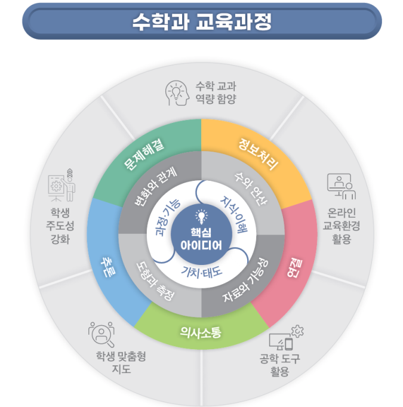

# 수학

# 수학

### 교육과정 설계의 개요

총론 교육과정에서는 교육 환경 변화에 대처하고 국가⋅사회적 요구를 반영하여 미래 사회가 요구하는 ‘포용성과 창의성을 갖춘 주도적인 사람’이라는 인간상을 제시하였다. 또한 학생의 삶과 성장을 지원하며 ‘자기 관리, 지식정보처리, 창의적 사고, 심미적 감성, 협력적 소통, 공동체’ 역량을 중점적으로 기르고, 수리 소양, 디지털 소양, 언어 소양의 기초 소양 함양도 강조하였다. 이에 수학과 교육과정은 총론의 핵심역량과 연계하여 ‘문제해결, 추론, 의사소통, 연결, 정보처리’ 역량을 수학 교과 역량으로 설정하고, 핵심 아이디어와 지식⋅이해, 과정⋅기능, 가치⋅태도의 세 범주로 내용 체계를 구성하여 수학 교과 역량 함양을 지원하도록 설계하였다. 아울러 기초 소양의 함양과 생태전환 교육, 민주 시민 교육, 학생 맞춤형 교육을 도모하는 교수⋅학습 및 평가 방법을 제시하였다. 또한 학생 주도성 개념을 바탕으로 학생의 삶과 성장을 지원하고 온라인 교육 환경에서 교수⋅학습 및 평가를 할 수 있도록 하였다.

수학과 교육과정은 성격, 목표, 내용 체계, 성취기준, 교수⋅학습, 평가로 구성하였다. ‘성격’에는 수학과의 고유한 특성과 수학 학습의 필요성을 제시하였다. ‘목표’는 총괄 목표와 세부 목표로 구성하였는데, 총괄 목표는 지식⋅이해, 과정⋅기능, 가치⋅태도를 통합적으로 학습하여 수학 교과 역량을 함양하는 것으로, 세부 목표는 문제해결, 추론, 의사소통, 연결, 정보처리 역량을 각각 함양하는 것으로 설정하였다. ‘내용 체계’는 영역별 핵심 아이디어와 지식⋅이해, 과정⋅기능, 가치⋅태도의 세 범주로 구성하였다. ‘성취기준’에는 지식⋅이해, 과정⋅기능, 가치⋅태도를 학습한 도달점으로 구체적인 성취 내용을 제시하였고, ‘성취기준 해설’과 ‘성취기준 적용 시 고려 사항’에는 성취기준의 취지, 범위 등 수학과 성취기준의 고유한 측면을 해석하고 적용할 때 고려할 수 있는 정보를 제시하였다. ‘교수⋅학습’과 ‘평가’에는 수학 교과 역량 및 총론의 개정 중점을 반영하여 교수⋅학습 및 평가의 방향과 방법을 제시하였다.

수학과의 영역은 초⋅중학교에서 다루는 수학적 대상과 기본적인 개념을 드러내는 ‘수와 연산’, ‘변화와 관계’, ‘도형과 측정’, ‘자료와 가능성’으로 구성하였다. 초⋅중학교의 영역을 동일하게 설정하여 내용 체계를 구성함으로써 초⋅중학교를 관통하는 핵심적인 대상과 개념을 학습하도록 하였다. 초⋅중학교의 4개 영역은 고등학교의 수학 공통 과목이나 선택 과목을 학습하는 데 기초가 되는 내용을 전반적으로 다룬다.

내용 체계에서 핵심 아이디어는 학년(군) 또는 학교급을 관통하는 수학 내용의 본질 또는 가치를 보여주며, 학생들이 핵심 아이디어를 향한 깊이 있는 학습을 추구하게 하였다. 수학과의 핵심 아이디어는 주요한 수학의 개념, 원리, 법칙 등이 어떻게 발생하고 확장되며 그 결과로 어떤 일반성과 추상성을 획득하는지, 수평적으로 또는 수직적으로 어떻게 상호 관련되는지, 어떤 탐구 과정을 중점적으로 강조하는지 등을 압축하여 제시한 것이다. 핵심 아이디어는 수학 학습 과정에서 전이가가 높은 내용을 담은 문장으로 기술하였다.

내용 체계의 지식⋅이해, 과정⋅기능, 가치⋅태도는 수학 교과 역량을 함양하는 데 필요한 핵심 요소로 구성하였다. 지식⋅이해 범주는 수학의 핵심적인 개념, 원리, 법칙 등을 학년(군)별로 구분하여 제시하였다. 초⋅중학교의 지식⋅이해 범주는 학년(군)에 따라 위계성을 가지며, 영역 간에도 위계성을 고려하여 구성하였다. 과정⋅기능 범주는 수학의 개념, 원리, 법칙 등을 학습할 때 5가지 교과 역량이 발현되는 사고 과정이나 기능을 보여주도록 구성하였다. 가치⋅태도 범주는 수학을 학습하면서 학생들이 갖게 되는 태도와 실천적인 성향을 나타낸 것으로, 수학의 가치를 인식하고 수학적 태도를 함양할 수 있게 구성하였다. 내용 체계의 지식⋅이해, 과정⋅기능, 가치⋅태도는 성취기준 개발의 근거가 된다.

수학 수업을 계획할 때 교육과정을 다음과 같이 활용할 것을 권장한다. 먼저 내용 체계의 ‘핵심 아이디어’를 통해 영역 전체를 아우르거나 관통하는 관점을 파악한다. 다음으로 내용 체계의 ‘지식⋅이해, 과정⋅기능, 가치⋅태도’를 확인하여 중점을 두어야 하는 내용을 확인한다. 이어서 ‘성취기준, 성취기준 해설, 성취기준 적용 시 고려 사항’, ‘교수⋅학습 및 평가’를 확인하여 세부적인 수업 내용과 방법을 구체화한다. 수업 계획이 성취기준 학습에만 그치지 않고 여러 성취기준을 아우르거나 관통하는 핵심 아이디어를 구성하는 데에 기여하는지 점검하여 보완한다.

수학과 교육과정 설계의 개요를 그림으로 나타내면 다음과 같다.

[수학과 교육과정 설계의 개요]

### 1. 성격 및 목표

가. 성격

수학과는 수학의 개념, 원리, 법칙을 이해하고 주변의 여러 가지 현상을 수학적으로 관찰하고 해석하며 논리적으로 사고하고 합리적으로 문제를 해결하는 능력과 태도를 기르는 교과이다. 수학은 오랜 역사를 통해 인류 문명 발전의 원동력이 되어 왔으며, 세계화⋅정보화가 가속화되는 미래 사회의 구성원이 지녀야 할 역량을 기르는 데 필수적이다.

초⋅중학교에서 학습한 수학은 기본적인 삶을 영위하고 일상생활을 포함한 다양한 맥락의 문제를 해결하는 데 도움이 되고, 고등학교 수학뿐만 아니라 여러 교과 학습의 토대가 된다. 수학 학습은 자연과학, 공학, 의학뿐만 아니라 사회과학, 인문학, 예술 및 체육 분야 등 다양한 분야의 직업에서 요구하는 수리 소양을 형성하는 데 기초가 되며, 나아가 미래 사회를 주도할 창의성을 갖춘 사람으로 성장할 수 있는 기반을 제공한다.

학생들은 수학 학습을 통해 수학 지식을 이해하고 수학적 사고 과정과 기능을 형성하며 수학의 가치를 인식하고 바람직한 수학적 태도를 갖추어 수학 교과 역량을 함양할 수 있다. 또한 수학을 학습하는 과정에서 협력하여 문제를 해결하고 성찰하는 경험을 통해 다른 사람에 대한 포용성을 갖춘 민주 시민이자 인간과 환경의 공존 및 지속가능한 발전을 추구하는 세계 공동체의 일원으로 성장할 수 있다.

나. 목표

수학의 개념, 원리, 법칙을 이해하고 수학의 가치를 인식하며 바람직한 수학적 태도를 길러 수학적으로 추론하고 의사소통하며 다양한 현상과 연결하여 정보를 처리하고 문제를 창의적으로 해결하는 수학 교과 역량을 함양한다.

(1) 수학적 지식을 이해하고 활용하여 적극적이고 자신감 있게 여러 가지 문제를 해결한다.

(2) 수학적 사실에 대해 흥미와 관심을 갖고 추측과 정당화를 통해 추론한다.

(3) 수학적 사고와 전략에 대해 의사소통하고 수학적 표현의 편리함을 인식한다.

(4) 수학의 개념, 원리, 법칙 간의 관련성을 탐구하고 실생활이나 타 교과에 수학을 적용하여 수학의 유용성을 인식한다.

(5) 목적에 맞게 교구나 공학 도구를 활용하며 자료를 수집하고 처리하여 정보에 근거한 합리적 의사 결정을 한다.

### 2. 내용 체계 및 성취기준

가. 내용 체계

(1) 수와 연산

<table>
<tr><th>핵심 아이디어</th><th colspan="6">⋅사물의 양은 자연수, 분수, 소수 등으로 표현되며, 수는 자연수에서 정수, 유리수, 실수로 확장된다. ⋅사칙계산은 자연수에 대해 정의되며 정수, 유리수, 실수의 사칙계산으로 확장되고 이때 연산의 성질이 일관되게 성립한다. ⋅수와 사칙계산은 수학 학습의 기본이 되며, 실생활 문제를 포함한 다양한 문제를 해결하는 데 유용하게 활용된다.</th></tr>
<tr><td rowspan="3">구분 범주</td><td colspan="6">내용 요소</td></tr>
<tr><td colspan="3">초등학교</td><td colspan="3">중학교</td></tr>
<tr><td>1~2학년</td><td>3~4학년</td><td>5~6학년</td><td colspan="3">1~3학년</td></tr>
<tr><td>지식⋅이해</td><td>⋅네 자리 이하의 수 ⋅두 자리 수 범위의 덧셈과 뺄셈 ⋅한 자리 수의 곱셈</td><td>⋅다섯 자리 이상의 수 ⋅분수 ⋅소수 ⋅세 자리 수의 덧셈과 뺄셈 ⋅자연수의 곱셈과 나눗셈 ⋅분모가 같은 분수의 덧셈과 뺄셈 ⋅소수의 덧셈과 뺄셈</td><td>⋅약수와 배수 ⋅수의 범위와 올림, 버림, 반올림 ⋅자연수의 혼합 계산 ⋅분모가 다른 분수의 덧셈과 뺄셈 ⋅분수의 곱셈과 나눗셈 ⋅소수의 곱셈과 나눗셈</td><td>⋅소인수분해 ⋅정수와 유리수</td><td>⋅유리수와 순환소수</td><td>⋅제곱근과 실수</td></tr>
<tr><td>과정⋅기능</td><td colspan="3">⋅자연수, 분수, 소수 등 수 관련 개념과 원리를 탐구하기 ⋅수를 세고 읽고 쓰기 ⋅자연수, 분수, 소수의 크기를 비교하고 그 방법을 설명하기 ⋅사칙계산의 의미와 계산 원리를 탐구하고 계산하기 ⋅수 감각과 연산 감각 기르기 ⋅연산 사이의 관계, 분수와 소수의 관계를 탐구하기 ⋅수의 범위와 올림, 버림, 반올림한 어림값을 실생활과 연결하기 ⋅자연수, 분수, 소수, 사칙계산을 실생활 및 타 교과와 연결하여 문제해결하기</td><td colspan="3">⋅최대공약수와 최소공배수 구하기 ⋅정수, 유리수, 실수의 대소 관계 판단하기 ⋅정수, 유리수, 근호를 포함한 식의 사칙계산의 원리를 탐구하고 계산하기 ⋅유리수와 순환소수의 관계 설명하기</td></tr>
<tr><td>가치⋅태도</td><td colspan="3">⋅자연수, 분수, 소수의 필요성 인식 ⋅사칙계산, 어림의 유용성 인식 ⋅분수 표현의 편리함 인식 ⋅수와 연산 관련 문제해결에서 비판적으로 사고하는 태도</td><td colspan="3">⋅음수, 무리수의 필요성 인식 ⋅실생활에서 사칙계산의 유용성 인식 ⋅수 체계의 논리적 아름다움에 대한 관심 ⋅정수와 유리수의 사칙계산의 원리를 이용하는 문제의 풀이 과정과 결과를 반성하는 태도</td></tr>
</table>

(2) 변화와 관계

<table>
<tr><th>핵심 아이디어</th><th colspan="6">⋅변화하는 현상에 반복적인 요소로 들어있는 규칙은 수나 식으로 표현될 수 있으며, 규칙을 탐구하는 것은 수학적으로 추측하고 일반화하는 데 기반이 된다. ⋅동치 관계, 대응 관계, 비례 관계 등은 여러 현상에 들어있는 대상들 사이의 다양한 관계를 기술하고 복잡한 문제를 해결하는 데 유용하게 활용된다. ⋅수와 그 계산은 문자와 식을 사용하여 일반화되며, 특정한 관계를 만족시키는 미지의 값은 방정식과 부등식을 해결하는 적절한 절차를 거쳐 구해진다. ⋅한 양이 변함에 따라 다른 양이 하나씩 정해지는 두 양 사이의 대응 관계를 나타내는 함수와 그 그래프는 변화하는 현상 속의 다양한 관계를 수학적으로 표현한다.</th></tr>
<tr><td rowspan="3">구분 범주</td><td colspan="6">내용 요소</td></tr>
<tr><td colspan="3">초등학교</td><td colspan="3">중학교</td></tr>
<tr><td>1~2학년</td><td>3~4학년</td><td>5~6학년</td><td colspan="3">1~3학년</td></tr>
<tr><td>지식⋅이해</td><td>⋅규칙</td><td>⋅규칙 ⋅동치 관계</td><td>⋅대응 관계 ⋅비와 비율 ⋅비례식과 비례배분</td><td>⋅문자의 사용과 식 ⋅일차방정식 ⋅좌표평면과 그래프</td><td>⋅식의 계산 ⋅일차부등식 ⋅연립일차방정식 ⋅일차함수와 그 그래프 ⋅일차함수와 일차방정식의 관계</td><td>⋅다항식의 곱셈과 인수분해 ⋅이차방정식 ⋅이차함수와 그 그래프</td></tr>
<tr><td>과정⋅기능</td><td colspan="3">⋅물체, 무늬, 수, 계산식의 배열에서 규칙을 탐구하기 ⋅규칙을 찾아 여러 가지 방법으로 표현하기 ⋅두 양의 관계를 탐구하고, 등호를 사용하여 나타내기 ⋅대응 관계를 탐구하고, □, △ 등을 사용하여 식으로 나타내고 설명하기 ⋅두 양의 관계를 비나 비율로 나타내기 ⋅비율을 분수, 소수, 백분율로 나타내기 ⋅비율을 실생활 및 타 교과와 연결하여 문제해결하기 ⋅비례식을 풀고, 주어진 양을 비례배분하기</td><td colspan="3">⋅식의 값과 함숫값 구하기 ⋅다항식의 연산 원리에 따라 계산하기 ⋅식을 간단히 하기 ⋅등식의 성질과 부등식의 성질 설명하기 ⋅방정식과 부등식 풀기 ⋅방정식, 부등식, 함수와 관련된 문제해결하기 ⋅상황이나 관계를 표, 식, 그래프로 나타내기 ⋅주어진 그래프 해석하기 ⋅일차함수의 그래프와 이차함수의 그래프의 성질 설명하기 ⋅일차함수의 그래프와 미지수가 2개인 일차방정식의 해 사이의 관계 설명하기</td></tr>
<tr><td>가치⋅태도</td><td colspan="3">⋅규칙, 동치 관계 탐구에 대한 흥미 ⋅대응 관계, 비 표현의 편리함 인식 ⋅비와 비율의 유용성 인식 ⋅변화와 관계 관련 문제해결에서 비판적으로 사고하는 태도</td><td colspan="3">⋅문자의 유용성 인식 ⋅순서쌍과 좌표, 그래프 등 수학적 표현의 유용성과 편리함 인식 ⋅방정식, 부등식, 함수의 필요성 인식 ⋅실생활, 사회 및 자연 현상과 관련된 문제를 수학적 모델링을 통해 해결하려는 도전적인 태도 ⋅체계적으로 사고하여 합리적으로 의사 결정하는 태도 ⋅타당한 근거에 따라 논리적으로 설명하는 태도</td></tr>
</table>

(3) 도형과 측정

<table>
<tr><th>핵심 아이디어</th><th colspan="6">⋅평면도형과 입체도형은 여러 가지 모양을 범주화한 것이며, 각각의 평면도형과 입체도형은 고유한 성질을 갖는다. ⋅도형의 성질과 관계를 탐구하고 정당화하는 것은 논리적이고 비판적으로 사고하는 데 기반이 된다. ⋅측정은 여러 가지 속성의 양을 비교하고 속성에 따른 단위를 이용하여 양을 수치화함으로써 여러 가지 현상을 해석하거나 실생활 문제를 해결하는 데 활용된다.</th></tr>
<tr><td rowspan="3">구분 범주</td><td colspan="6">내용 요소</td></tr>
<tr><td colspan="3">초등학교</td><td colspan="3">중학교</td></tr>
<tr><td>1~2학년</td><td>3~4학년</td><td>5~6학년</td><td colspan="3">1~3학년</td></tr>
<tr><td>지식⋅이해</td><td>⋅입체도형의 모양 ⋅평면도형과 그 구성 요소 ⋅양의 비교 ⋅시각과 시간 (시, 분) ⋅길이(cm, m)</td><td>⋅도형의 기초 ⋅원의 구성 요소 ⋅여러 가지 삼각형 ⋅여러 가지 사각형 ⋅다각형 ⋅평면도형의 이동 ⋅시각과 시간(초) ⋅길이(mm, km) ⋅들이(L, mL) ⋅무게(kg, g, t) ⋅각도($^\circ$)</td><td>⋅합동과 대칭 ⋅직육면체와 정육면체 ⋅각기둥과 각뿔 ⋅원기둥, 원뿔, 구 ⋅다각형의 둘레와 넓이 ⋅원주율과 원의 넓이 ⋅직육면체와 정육면체의 겉넓이와 부피</td><td>⋅기본 도형 ⋅작도와 합동 ⋅평면도형의 성질 ⋅입체도형의 성질</td><td>⋅삼각형과 사각형의 성질 ⋅도형의 닮음 ⋅피타고라스 정리</td><td>⋅삼각비 ⋅원의 성질</td></tr>
<tr><td>과정⋅기능</td><td colspan="3">⋅여러 가지 사물과 도형을 기준에 따라 분류하기 ⋅도형의 개념, 구성 요소, 성질 탐구하고 설명하기 ⋅평면도형이나 입체도형 그리기와 만들기 ⋅평면도형을 밀기, 뒤집기, 돌리기 한 모양을 추측하고 그리기 ⋅쌓은 모양 추측하고 쌓기나무의 개수 구하기 ⋅공간 감각 기르기 ⋅여러 가지 양을 비교, 측정, 어림하는 방법 탐구하기 ⋅측정 단위 사이의 관계 탐구하기 ⋅측정 단위를 사용하여 양을 표현하기 ⋅실생활 문제 상황에서 길이, 들이, 무게, 시간의 덧셈과 뺄셈하기 ⋅도형의 둘레, 넓이, 부피 구하는 방법 탐구하기 ⋅측정을 실생활 및 타 교과와 연결하여 문제해결하기</td><td colspan="3">⋅점, 직선, 평면의 위치 관계를 다양한 상황과 연결하기 ⋅도형의 성질 설명하기 ⋅삼각형의 작도 과정 설명하기 ⋅삼각형의 합동과 닮음 판별하기 ⋅도형의 길이, 넓이, 겉넓이, 부피 구하기 ⋅구체적인 모형이나 공학 도구 이용하기 ⋅도형의 성질을 정당화하기 ⋅닮음비 구하기 ⋅간단한 삼각비의 값 구하기 ⋅삼각비를 활용하여 문제해결하기</td></tr>
<tr><td>가치⋅태도</td><td colspan="3">⋅평면도형, 입체도형에 대한 흥미와 관심 ⋅합동인 도형, 선대칭도형, 점대칭도형의 아름다움 인식 ⋅표준 단위의 필요성 인식 ⋅넓이와 부피를 구하는 방법의 편리함 인식 ⋅도형과 측정 관련 문제해결에서 비판적으로 사고하는 태도</td><td colspan="3">⋅증명의 필요성 인식 ⋅피타고라스 정리, 삼각비의 유용성 인식 ⋅피타고라스 정리, 삼각비에 대한 흥미와 관심 ⋅도형의 성질을 이용한 건축물, 문화유산, 예술 작품에 대한 흥미와 관심 ⋅다양한 정당화 방법을 이용하여 체계적으로 사고하고 타인을 합리적으로 설득하려는 태도 ⋅정당화를 통해 수학적 근거를 바탕으로 비판적으로 사고하는 태도</td></tr>
</table>

(4) 자료와 가능성

<table>
<tr><th>핵심 아이디어</th><th colspan="6">⋅자료를 수집, 정리, 해석하는 통계는 자료의 특징을 파악하고 두 집단을 비교하며 자료의 관계를 탐구하는 데 활용된다. ⋅사건이 일어날 가능성을 여러 가지 방법으로 표현하는 것은 불확실성을 이해하는 데 도움이 되며, 가능성을 확률로 수치화하면 불확실성을 수학적으로 다룰 수 있게 된다. ⋅자료를 이용하여 통계적 문제해결 과정을 실천하고 생활 속의 가능성을 탐구하는 것은 미래를 예측하고 합리적인 의사 결정을 하는 데 기반이 된다.</th></tr>
<tr><td rowspan="3">구분 범주</td><td colspan="6">내용 요소</td></tr>
<tr><td colspan="3">초등학교</td><td colspan="3">중학교</td></tr>
<tr><td>1~2학년</td><td>3~4학년</td><td>5~6학년</td><td colspan="3">1~3학년</td></tr>
<tr><td>지식⋅이해</td><td>⋅자료의 분류 ⋅표 ⋅○, ×, ／를 이용한 그래프</td><td>⋅그림그래프 ⋅막대그래프 ⋅꺾은선그래프</td><td>⋅평균 ⋅띠그래프, 원그래프 ⋅가능성</td><td>⋅대푯값 ⋅도수분포표와 상대도수</td><td>⋅경우의 수와 확률</td><td>⋅산포도 ⋅상자그림과 산점도</td></tr>
<tr><td>과정⋅기능</td><td colspan="3">⋅자료를 기준에 따라 분류하고 설명하기 ⋅탐구 문제를 설정하고 그에 맞는 자료를 수집하기 ⋅자료를 표나 그래프로 나타내고 해석하기 ⋅자료의 평균을 구하고 해석하기 ⋅자료를 수집하고 정리하여 문제해결하기 ⋅사건이 일어날 가능성을 비교하고 표현하기 ⋅실생활과 연결하여 사건이 일어날 가능성을 예상하기</td><td colspan="3">⋅적절한 대푯값을 선택하여 구하기 ⋅자료를 표, 그래프로 나타내고 해석하기 ⋅통계적 탐구 문제 설정하기 ⋅공학 도구를 이용하여 자료를 수집하고 분석하기 ⋅확률의 기본 성질 탐구하기 ⋅자료의 분포를 비교하고 설명하기 ⋅자료의 상관관계 설명하기</td></tr>
<tr><td>가치⋅태도</td><td colspan="3">⋅표와 그래프의 편리함 인식 ⋅평균의 유용성 인식 ⋅자료를 이용한 통계적 문제해결 과정의 가치 인식 ⋅가능성에 근거하여 판단하는 태도 ⋅자료와 가능성 관련 문제해결에서 비판적으로 사고하는 태도</td><td colspan="3">⋅대푯값, 상대도수, 상자그림의 유용성 인식 ⋅공학 도구를 이용한 자료 수집과 분석의 편리함과 유용성 인식 ⋅자신의 삶과 연계된 확률과 통계에 대한 흥미와 관심 ⋅통계적 문제해결 과정에 주도적으로 참여하는 태도 ⋅체계적으로 사고하여 합리적으로 의사 결정하는 태도 ⋅확률 및 통계적 근거를 바탕으로 비판적으로 사고하는 태도</td></tr>
</table>

나. 성취기준

[중학교 1∼3학년]

(1) 수와 연산

① 소인수분해
[9수01-01] 소인수분해의 뜻을 알고, 자연수를 소인수분해 할 수 있다.
[9수01-02] 소인수분해를 이용하여 최대공약수와 최소공배수를 구할 수 있다.
② 정수와 유리수
[9수01-03] 다양한 상황을 이용하여 음수의 필요성을 인식하고, 양수와 음수, 정수와 유리수의 개념을 이해한다.
[9수01-04] 정수와 유리수의 대소 관계를 판단할 수 있다.
[9수01-05] 정수와 유리수의 사칙계산의 원리를 이해하고, 그 계산을 할 수 있다.
③ 유리수와 순환소수
[9수01-06] 순환소수의 뜻을 알고, 유리수와 순환소수의 관계를 설명할 수 있다.
④ 제곱근과 실수
[9수01-07] 제곱근의 뜻과 성질을 알고, 제곱근의 대소 관계를 판단할 수 있다.
[9수01-08] 무리수의 개념을 이해하고, 무리수의 유용성을 인식할 수 있다.
[9수01-09] 실수의 대소 관계를 판단하고 설명할 수 있다.
[9수01-10] 근호를 포함한 식의 사칙계산의 원리를 이해하고, 그 계산을 할 수 있다.

(가) 성취기준 해설

• [9수01-02] 초등학교에서 학습한 최대공약수와 최소공배수의 개념을 바탕으로 소인수분해를 이용하여 최대공약수와 최소공배수를 구하게 한다. 최대공약수와 최소공배수는 자연수의 소인수분해를 이용하는 범위에서 다루고, 최대공약수와 최소공배수의 활용 문제는 다루지 않는다.

• [9수01-05] 정수의 사칙계산의 원리는 여러 가지 모델을 이용하여 직관적으로 이해하게 하고, 실생활에서 사칙계산의 유용성을 인식하게 한다.

• [9수01-06] 순환소수를 분수로 고치는 것은 순환소수가 유리수임을 이해할 수 있는 정도로 다룬다. 유한소수를 순환소수로 나타내는 것은 다루지 않는다.

• [9수01-08] 실생활에서 사용되는 무리수의 예를 찾아보는 활동을 통해 무리수의 필요성과 유용성을 인식하게 한다. 실수는 유리수와 무리수로 이루어짐을 이해하게 하고, 수 체계의 논리적인 아름다움에 관심을 갖게 한다.

(나) 성취기준 적용 시 고려 사항

• ‘수와 연산’ 영역에서는 용어와 기호로 ‘소수, 합성수, 거듭제곱, 지수, 밑, 소인수, 소인수분해, 서로소, 양수, 음수, 양의 정수, 음의 정수, 정수, 수직선, 양의 유리수, 음의 유리수, 유리수, 절댓값, 교환법칙, 결합법칙, 분배법칙, 역수, 유한소수, 무한소수, 순환소수, 순환마디, 제곱근, 근호, 무리수, 실수, 분모의 유리화, 양의 부호($+$), 음의 부호($-$), $|~ |$ , $\leq$, $\geq$, 순환소수 표현(예. $7. \dot{ 2 } 1 \dot{ 5 }$), $\sqrt { }$’를 다룬다.

• 정수와 유리수의 사칙계산의 원리를 이용하는 문제를 해결하기 위해 더 나은 계산 방법을 끈기 있게 찾아보게 하고, 풀이 과정과 결과를 반성하는 태도를 갖게 한다.

• 제곱근과 무리수는 피타고라스 정리를 이용하여 도입할 수 있다.

• 한 변의 길이가 1인 정사각형의 대각선의 길이 등을 이용하여 무리수의 존재를 직관적으로 이해하게 한다.

• 제곱근의 값은 계산기 등을 이용하여 구할 수 있음을 알게 한다.

• 정수, 유리수와 관련하여 지나치게 복잡한 계산을 포함하는 문제는 다루지 않는다.

• 사칙계산 이외의 이항연산 문제는 다루지 않는다.

(2) 변화와 관계

① 문자의 사용과 식
[9수02-01] 다양한 상황을 문자를 사용한 식으로 나타내어 그 유용성을 인식하고, 식의 값을 구할 수 있다.
[9수02-02] 일차식의 덧셈과 뺄셈의 원리를 이해하고, 그 계산을 할 수 있다.
② 일차방정식
[9수02-03] 방정식과 그 해의 뜻을 알고, 등식의 성질을 설명할 수 있다.
[9수02-04] 일차방정식을 풀 수 있고, 이를 활용하여 문제를 해결할 수 있다.
③ 좌표평면과 그래프
[9수02-05] 순서쌍과 좌표를 이해하고, 그 편리함을 인식할 수 있다.
[9수02-06] 다양한 상황을 그래프로 나타내고, 주어진 그래프를 해석할 수 있다.
[9수02-07] 정비례, 반비례 관계를 이해하고, 그 관계를 표, 식, 그래프로 나타낼 수 있다.
④ 식의 계산
[9수02-08] 지수법칙을 이해하고, 이를 이용하여 식을 간단히 할 수 있다.
[9수02-09] 다항식의 덧셈과 뺄셈의 원리를 이해하고, 그 계산을 할 수 있다.
[9수02-10] ‘(단항식)$\times$(다항식)’, ‘(다항식)$\div$(단항식)’과 같은 곱셈과 나눗셈의 원리를 이해하고, 그 계산을 할 수 있다.
⑤ 일차부등식
[9수02-11] 부등식과 그 해의 뜻을 알고, 부등식의 성질을 설명할 수 있다.
[9수02-12] 일차부등식을 풀 수 있고, 이를 활용하여 문제를 해결할 수 있다.
⑥ 연립일차방정식
[9수02-13] 미지수가 2개인 연립일차방정식을 풀 수 있고, 이를 활용하여 문제를 해결할 수 있다.
⑦ 일차함수와 그 그래프
[9수02-14] 함수의 개념을 이해하고, 함숫값을 구할 수 있다.
[9수02-15] 일차함수의 개념을 이해하고, 그 그래프를 그릴 수 있다.
[9수02-16] 일차함수의 그래프의 성질을 이해하고, 이를 활용하여 문제를 해결할 수 있다.
⑧ 일차함수와 일차방정식의 관계
[9수02-17] 일차함수와 미지수가 2개인 일차방정식의 관계를 설명할 수 있다.
[9수02-18] 두 일차함수의 그래프와 연립일차방정식의 관계를 설명할 수 있다.
⑨ 다항식의 곱셈과 인수분해
[9수02-19] 다항식의 곱셈과 인수분해를 할 수 있다.
이차방정식
[9수02-20] 이차방정식을 풀 수 있고, 이를 활용하여 문제를 해결할 수 있다.
이차함수와 그 그래프
[9수02-21] 이차함수의 개념을 이해한다.
[9수02-22] 이차함수의 그래프를 그릴 수 있고, 그 성질을 설명할 수 있다.

(가) 성취기준 해설

• [9수02-05] 실생활에서 좌표가 사용되는 예를 찾아보고 이를 수직선과 좌표평면 위에 표현해 보며, 그 유용성과 편리함을 인식하게 한다.

• [9수02-06] 다양한 상황을 그래프로 나타내어 증가와 감소, 주기적 변화 등 변화 상태를 쉽게 파악할 수 있게 한다. 주어진 그래프를 해석하여 그래프가 나타내는 상황을 설명하게 함으로써 그래프의 유용성을 인식하게 한다.

• [9수02-07] 속력과 거리, 속력과 시간과 같은 실생활의 예를 통해 정비례와 반비례 관계를 직관적으로 이해하게 하고, 정비례와 반비례 관계가 성립하는 실생활의 예를 찾아 설명하게 한다.

• [9수02-08] 지수법칙은 지수가 자연수인 범위에서 단항식의 곱셈과 나눗셈을 하는 데 필요한 정도로 다룬다.

• [9수02-10] 다항식의 나눗셈에서는 다항식을 단항식으로 나누어 그 몫이 다항식이 되는 경우만 다룬다.

• [9수02-19] 다항식의 곱셈과 다항식의 인수분해의 역관계를 이해하고, 이와 유사한 관계를 찾아보는 활동을 하게 한다. 다항식의 곱셈과 인수분해는 다음의 경우를 다룬다. $m(a+b) = ma+mb$ $(a+b) ^ { 2 } =a ^ { 2 } +2ab+b ^ { 2 }$ $(a-b) ^ { 2 } =a ^ { 2 } -2ab+b ^ { 2 }$ $(a+b)(a-b)=a ^ { 2 } -b ^ { 2 }$ $(x+a)(x+b)=x ^ { 2 } +(a+b)x+ab$ $(ax+b)(cx+d)=acx ^ { 2 } +(ad+bc)x+bd$

• [9수02-22] 이차함수 $y=f(x)$에서 최댓값과 최솟값은 $x$의 범위가 실수 전체인 경우만 다룬다.

(나) 성취기준 적용 시 고려 사항

• ‘변화와 관계’ 영역에서는 용어와 기호로 ‘대입, 다항식, 항, 단항식, 상수항, 계수, 차수, 일차식, 동류항, 등식, 방정식, 미지수, 해, 근, 항등식, 이항, 일차방정식, 전개, 변수, 좌표, 순서쌍, $x$좌표, $y$좌표, 원점, 좌표축, $x$축, $y$축, 좌표평면, 제1사분면, 제2사분면, 제3사분면, 제4사분면, 그래프, 정비례, 반비례, 부등식, 일차부등식, 연립방정식, 함수, 함숫값, 일차함수, 기울기, $x$절편, $y$절편, 평행이동, 직선의 방정식, 인수, 인수분해, 완전제곱식, 이차방정식, 중근, 근의 공식, 이차함수, 포물선, 축, 꼭짓점, 최댓값, 최솟값, $f(x)$, $y=f(x)$’를 다룬다.

• 문자와 수, 문자와 일상 언어의 공통점과 차이점에 대한 탐색을 통해 문자의 특징을 이해하고, 자신의 삶 속에서 문자의 유용성을 인식하게 한다.

• 수에 대한 사칙연산과 소인수분해가 다항식으로 확장될 수 있음을 인식하게 한다.

• 방정식과 부등식, 함수는 다양한 상황을 통해 도입하고, 그 필요성을 인식하게 한다.

• 방정식과 부등식은 여러 가지 방법으로 풀어 보면서 더 나은 풀이 방법으로 해를 찾게 한다. 구한 해가 문제 상황에 적합한지 확인하는 과정을 통해 타당한 근거에 따라 자신의 의견을 논리적으로 설명하는 태도를 갖게 한다.

• 다양한 상황을 일상 언어, 표, 그래프, 식으로 나타내고 이들 사이의 상호 변환 활동을 하게 한다.

• 함수의 개념은 다양한 상황에서 한 양이 변함에 따라 다른 양이 하나씩 정해지는 두 양 사이의 대응 관계를 이용하여 도입한다.

• 다양한 상황을 이용하여 일차함수와 이차함수의 의미를 다룬다.

• 공학 도구를 이용하여 함수의 그래프를 그리거나 함수의 그래프의 성질을 탐구하게 한다.

• 이차방정식은 해가 실수인 경우만 다룬다.

• 이차방정식의 근과 계수와의 관계는 다루지 않는다.

• 실생활이나 사회 및 자연 현상과 관련된 문제를 해결할 때 수학적 모델링을 적용하고 도전적으로 문제를 해결할 수 있게 한다. 이때, 환경 및 기후변화 등과 관련된 다양한 문제 상황을 통해 생태전환에 관심을 갖게 한다.

• 방정식, 부등식, 함수에 대한 지나치게 복잡한 활용 문제는 다루지 않는다.

• ‘식의 값’, ‘좌변’, ‘우변’, ‘양변’, ‘이차식’, ‘전개식’, ‘연립일차방정식’, ‘소거’, ‘가감법’, ‘대입법’, ‘함수의 그래프’ 용어는 교수⋅학습 상황에서 사용할 수 있다.

(3) 도형과 측정

① 기본 도형
[9수03-01] 점, 선, 면, 각을 이해하고, 실생활 상황과 연결하여 점, 직선, 평면의 위치 관계를 설명할 수 있다.
[9수03-02] 평행선에서 동위각과 엇각의 성질을 이해하고 설명할 수 있다.
② 작도와 합동
[9수03-03] 삼각형을 작도하고, 그 과정을 설명할 수 있다.
[9수03-04] 삼각형의 합동 조건을 이해하고, 이를 이용하여 두 삼각형이 합동인지 판별할 수 있다.
③ 평면도형의 성질
[9수03-05] 다각형의 성질을 이해하고 설명할 수 있다.
[9수03-06] 부채꼴의 중심각과 호의 관계를 이해하고, 이를 이용하여 부채꼴의 호의 길이와 넓이를 구할 수 있다.
④ 입체도형의 성질
[9수03-07] 구체적인 모형이나 공학 도구를 이용하여 다면체와 회전체의 성질을 탐구하고, 이를 설명할 수 있다.
[9수03-08] 입체도형의 겉넓이와 부피를 구할 수 있다.
⑤ 삼각형과 사각형의 성질
[9수03-09] 이등변삼각형의 성질을 이해하고 정당화할 수 있다.
[9수03-10] 삼각형의 외심과 내심의 성질을 이해하고 정당화할 수 있다.
[9수03-11] 사각형의 성질을 이해하고 정당화할 수 있다.
⑥ 도형의 닮음
[9수03-12] 도형의 닮음의 뜻과 닮은 도형의 성질을 이해하고, 닮음비를 구할 수 있다.
[9수03-13] 삼각형의 닮음 조건을 이해하고, 이를 이용하여 두 삼각형이 닮음인지 판별할 수 있다.
[9수03-14] 평행선 사이의 선분의 길이의 비를 구할 수 있다.
⑦ 피타고라스 정리
[9수03-15] 피타고라스 정리를 이해하고 정당화할 수 있다.
⑧ 삼각비
[9수03-16] 삼각비의 뜻을 알고, 간단한 삼각비의 값을 구할 수 있다.
[9수03-17] 삼각비를 활용하여 여러 가지 문제를 해결할 수 있다.
⑨ 원의 성질
[9수03-18] 원의 현에 관한 성질과 접선에 관한 성질을 이해하고 정당화할 수 있다.
[9수03-19] 원주각의 성질을 이해하고 정당화할 수 있다.

(가) 성취기준 해설

• [9수03-01] 점, 선, 면, 각과 관련된 용어는 다양한 상황에서 직관적으로 이해하게 한다.

• [9수03-03] 주어진 삼각형과 합동인 삼각형을 작도하는 활동을 하고, 자신의 방법을 설명하게 한다.

• [9수03-05] 삼각형의 내각과 외각의 크기, 다각형의 내각과 외각의 크기의 합, 다각형의 대각선의 개수를 구하는 과정을 탐구하여 다각형의 성질을 추측하고 일반화할 수 있게 한다.

• [9수03-07] 구체적인 사물, 전개도, 교구, 컴퓨터 프로그램 등을 이용하여 다면체와 회전체를 관찰하고 그 성질을 탐구하게 한다. 회전체 단면의 모양은 회전체의 성질을 이해하는 데 필요한 정도로 다룬다.

• [9수03-09] 종이접기, 작도, 공학 도구 등을 이용하여 이등변삼각형의 성질을 추측하게 하고, 그 성질을 삼각형의 합동 조건을 이용하여 정당화할 수 있게 한다. 이때, 증명이라는 용어를 도입하고, 그 필요성을 인식하게 한다.

• [9수03-11] 사각형의 성질은 대각선에 관한 성질을 위주로 다룬다. 여러 가지 사각형의 성질을 통해 사각형 사이의 관계를 설명하게 한다.

• [9수03-15] 피타고라스 정리는 다양한 활동을 통하여 추측하고 정당화할 수 있게 한다. 피타고라스 정리의 역은 직관적으로 이해하게 하고, 이를 이용하여 세 변의 길이가 주어진 삼각형이 직각삼각형인지 판별하게 한다.

• [9수03-17] 삼각비를 활용하여 직접 측정하기 어려운 거리나 높이 등을 구해 보는 활동을 통해 유용성을 인식하고 흥미를 느낄 수 있게 한다.

(나) 성취기준 적용 시 고려 사항

• ‘도형과 측정’ 영역에서는 용어와 기호로 ‘교점, 교선, 두 점 사이의 거리, 중점, 수직이등분선, 꼬인 위치, 교각, 맞꼭지각, 엇각, 동위각, 평각, 직교, 수선의 발, 작도, 대변, 대각, 삼각형의 합동 조건, 내각, 외각, 부채꼴, 중심각, 호, 현, 활꼴, 할선, 다면체, 각뿔대, 정다면체, 회전체, 회전축, 원뿔대, 증명, 접선, 접점, 접한다, 외심, 외접, 외접원, 내심, 내접, 내접원, 중선, 무게중심, 닮음, 닮음비, 삼각형의 닮음 조건, 피타고라스 정리, 삼각비, 사인, 코사인, 탄젠트, 원주각, $\overleftrightarrow{ AB }$, $\overrightarrow{ AB }$, $\overline{ AB }$, $\parallel$, $\angle ABC$, $\bot$, △$ABC$, $\equiv$, $\overset{\frown}{ AB }$, $\pi$, $\square ABCD$, , $\sin A$, $\cos A$, $\tan A$’를 다룬다.

• 다양한 교구나 공학 도구를 이용하여 합동과 닮음의 의미를 이해하게 한다.

• 다각형과 다면체는 그 모양이 볼록인 경우만 다룬다.

• 간단한 입체도형의 단면을 관찰하는 활동과 전개도를 접어 간단한 입체도형을 만드는 활동을 통해 평면도형과 입체도형의 관계를 직관적으로 이해하게 한다.

• 다양한 교구나 공학 도구를 이용하여 도형을 그리거나 만들어 보는 활동을 통해 도형의 성질을 추론하고 토론할 수 있게 한다.

• 도형의 성질을 이해하고 정당화하는 방법은 관찰이나 실험을 통한 확인, 사례나 근거 제시를 통한 설명, 유사성에 근거한 추론, 증명 등이 있으며, 이를 학생 수준에 맞게 활용할 수 있다.

• 도형의 성질을 정당화하는 다양한 방법을 통해 체계적으로 사고하고 타인을 논리적으로 설득하는 태도를 갖게 한다.

• 증명을 할 때, ‘가정’, ‘결론’ 용어는 다루지 않는다.

• 수학사를 통하여 피타고라스 정리, 삼각비에 관심을 가지고 그 유용성을 인식하게 한다.

• 삼각비 사이의 관계는 다루지 않는다.

• 삼각비의 값은 0°에서 90°까지의 각도에 대한 것만 다룬다.

• 주변의 건축물, 문화유산, 예술 작품 등에서 도형의 성질을 찾게 하여 수학에 대한 흥미와 관심을 가질 수 있게 한다.

• 복잡하게 변형된 평면도형의 넓이와 둘레의 길이, 입체도형의 겉넓이와 부피를 구하는 문제는 다루지 않는다.

• 도형의 성질을 이해하고 정당화하는 것을 평가할 때는 증명 과정에서 지나치게 엄밀한 형식 논리 규칙의 이용을 요구하는 문제는 다루지 않는다.

• 원과 비례에 관한 성질은 다루지 않는다.

• ‘(도형의) 대응’, ‘삼각형의 중점연결정리’, ‘접선의 길이’ 용어는 교수⋅학습 상황에서 사용할 수 있다.

(4) 자료와 가능성

① 대푯값
[9수04-01] 중앙값, 최빈값의 뜻을 알고, 자료의 특성에 따라 적절한 대푯값을 선택하여 구할 수 있다.
② 도수분포표와 상대도수
[9수04-02] 자료를 줄기와 잎 그림, 도수분포표, 히스토그램, 도수분포다각형으로 나타내고 해석할 수 있다.
[9수04-03] 상대도수를 구하고, 상대도수의 분포를 표나 그래프로 나타내고 해석할 수 있다.
[9수04-04] 통계적 탐구 문제를 설정하고, 공학 도구를 이용하여 자료를 수집하여 분석하고, 그 결과를 해석할 수 있다.
③ 경우의 수와 확률
[9수04-05] 경우의 수를 구할 수 있다.
[9수04-06] 확률의 개념과 그 기본 성질을 이해하고, 확률을 구할 수 있다.
④ 산포도
[9수04-07] 분산과 표준편차를 구하고 자료의 분포를 설명할 수 있다.
⑤ 상자그림과 산점도
[9수04-08] 공학 도구를 이용하여 자료를 상자그림으로 나타내고 분포를 비교할 수 있다.
[9수04-09] 자료를 산점도로 나타내고 상관관계를 말할 수 있다.

(가) 성취기준 해설

• [9수04-01] 대푯값에는 초등학교에서 학습한 평균 이외에도 중앙값, 최빈값이 있음을 알고 그 필요성을 인식하게 한다. 자료의 특성에 따라 적절한 대푯값을 선택하여 구해 보고, 각 대푯값이 어떤 상황에서 유용하게 사용될 수 있는지 토론하게 한다.

• [9수04-03] 상대도수는 도수의 총합이 다른 두 집단의 분포를 비교하는 상황에서 간단히 다루고, 상대도수의 필요성과 유용성을 인식하게 한다.

• [9수04-04] 다양한 맥락에서 해결하고자 하는 통계적 탐구 문제를 설정하고 적절한 계획을 세워 자료를 수집하게 한다. 수집한 자료를 자료의 특성과 목적에 맞게 표, 그래프, 수치 등으로 나타내어 분석하고, 그 결과를 탐구 문제와 연결하여 해석하게 한다. 자료를 수집하고 분석할 때는 인터넷 검색, 웹 기반 소프트웨어, 통계 프로그램 등을 활용하게 한다. 수집한 자료나 분석 결과가 적절한지 판단하여 계획을 수정하고, 통계적 근거를 바탕으로 토론하는 등 통계적 문제해결 과정에 주도적으로 참여하게 한다.

• [9수04-05] 경우의 수는 두 경우의 수를 합하거나 곱하는 경우 정도로만 다루고, 순열과 조합을 이용하면 쉽게 해결되는 등의 복잡한 경우의 수를 구하는 문제는 다루지 않는다.

• [9수04-06] 확률은 실험이나 관찰을 통해 구한 상대도수로서의 의미와 경우의 수의 비율로서의 의미를 연결하여 이해하게 한다. 경우의 수의 비율로 확률을 다룰 때, 각 경우가 발생할 가능성이 동등하다는 것을 가정한다는 점에 유의하게 한다.

• [9수04-08] 상자그림을 다룰 때는 두 집단의 분포를 비교하고 해석하는 활동에 중점을 두고, 이를 통해 상자그림의 유용성을 인식하게 한다.

• [9수04-09] 상관관계는 양의 상관관계, 음의 상관관계, 상관관계가 없는 경우로 구분하여 다룬다.

(나) 성취기준 적용 시 고려 사항

• ‘자료와 가능성’ 영역에서는 용어와 기호로 ‘변량, 대푯값, 중앙값, 최빈값, 줄기와 잎 그림, 계급, 계급의 크기, 도수, 도수분포표, 히스토그램, 도수분포다각형, 상대도수, 사건, 확률, 산포도, 편차, 분산, 표준편차, 사분위수, 상자그림, 산점도, 상관관계’를 다룬다.

• 눈금 등을 부적절하게 사용하여 자료를 부정확하게 나타낸 표나 그래프에서 오류를 찾는 활동을 통해 비판적으로 사고하는 태도를 갖게 한다.

• 자료를 수집하고 정리하여 표나 그래프로 나타내거나 대푯값과 산포도를 구할 때 공학 도구를 이용할 수 있게 하고, 공학 도구의 편리함과 유용성을 인식하게 한다.

• ‘자료와 가능성’ 영역에서 환경, 지속가능한 발전 등 범교과 학습 주제를 소재로 다루고, 이를 탐구하는 과정에서 체계적으로 사고하고 합리적으로 의사 결정을 할 수 있게 한다.

• 진로연계교육을 실시할 때는 학생의 흥미, 관심, 진로에 맞는 탐구 문제를 설정하여 통계 프로젝트를 수행하게 할 수 있다.

• ‘계급값’, ‘경우의 수’ 용어는 교수⋅학습 상황에서 사용할 수 있다.

### 3. 교수⋅학습 및 평가

가. 교수⋅학습

(1) 교수⋅학습의 방향

(가) 수학과 교육과정에 제시된 성격, 목표, 내용 체계, 성취기준, 평가와 일관성을 가지도록 교수⋅학습을 운영한다.

(나) 핵심 아이디어를 중심으로 수학의 지식⋅이해, 과정⋅기능, 가치⋅태도를 통합적으로 교수⋅학습하여 수학 교과 역량을 함양하고 수리 소양을 갖추게 한다.

(다) 학생이 주도적으로 수학을 학습하여 수학과 교육과정에 제시된 목표를 달성하도록 교수⋅학습을 운영한다.

(라) 수학 내용 특성에 적합한 교구나 공학 도구를 선택하여 효율적인 교수⋅학습이 이루어지도록 하고 학생들의 디지털 소양 함양을 도모한다. 그리고 수학 교과서 읽기, 수학 학습 과정과 결과 쓰기, 문장제 해결 등을 통해 학생들의 언어 소양 함양을 도모한다.

(마) 수학 내용의 특성, 학교 여건, 학생의 학습 능력과 수준 등을 고려하여 교수⋅학습을 운영한다.

(바) 학생 개인의 필요, 수학 학습 속도, 학습 능력 등을 고려하여 학생 맞춤형 수업을 실시하고 보충 학습과 심화 학습의 기회를 제공한다.

(사) 수학 교수⋅학습에서 범교과 학습 주제(안전⋅건강, 인성, 진로, 민주 시민, 인권, 다문화, 통일, 독도, 경제⋅금융, 환경⋅지속가능발전 등)를 현상이나 소재로 선택하여 활용할 수 있다.

(아) 사회적 환경, 학생의 요구, 수학 내용의 특성, 수업 방식 등에 따라 온라인을 활용한 교수⋅학습을 운영할 수 있다.

(자) 학교급 전환에 따라 변화되는 수학 내용과 수업 방법을 파악하여 교수⋅학습에 적용하고, 진로연계교육에서 이를 고려한다.

(차) 수학과 교수⋅학습 계획을 수립하거나 교수⋅학습 자료 개발 등을 할 때 교육과정을 재구성할 수 있다.

(2) 교수⋅학습 방법

(가) 수학 교과 역량 함양을 통해 수학을 깊이 있게 학습하고 적용할 기회를 제공한다.

① 다음과 같은 교수⋅학습 방법을 통해 문제해결 역량을 함양하게 한다.

㉠ 수학의 개념, 원리, 법칙을 이용하여 해결 가능한 문제를 학생에게 제시한다. 이때 다양한 방법으로 해결 가능한 문제, 여러 가지 해답이 나올 수 있는 문제 등을 활용할 수 있다.

㉡ 문제에 주어진 조건과 정보를 분석하고 적절한 문제해결 계획을 수립하고 실행하며 문제해결 과정을 반성하도록 구체적인 발문과 권고를 제시한다.

㉢ 문제해결 과정 및 결과의 의미를 재해석하여 주어진 문제를 변형하거나 새로운 문제를 만들어 해결하게 한다.

㉣ 성공적인 문제해결 경험을 바탕으로 적극적이고 자신감 있게 문제해결에 참여하게 하고, 단번에 답이 나오지 않는 문제라도 끈기 있게 도전하여 성취감을 느끼게 한다.

② 다음과 같은 교수⋅학습 방법을 통해 추론 역량을 함양하게 한다.

㉠ 관찰, 실험, 측정 등 구체적 조작 활동을 통해 수학의 개념, 원리, 법칙에 흥미와 관심을 갖고 다양한 방법으로 탐구하고 이해하게 한다.

㉡ 귀납, 유추 등의 개연적 추론을 통해 수학적 추측을 제기하고 정당화하며, 수학적 증거와 논리적 근거를 바탕으로 비판적으로 사고하는 태도를 갖게 한다.

㉢ 수학의 개념, 원리, 법칙을 도출하는 과정과 수학적 절차를 논리적이고 체계적으로 수행하고 반성하게 한다.

③ 다음과 같은 교수⋅학습 방법을 통해 의사소통 역량을 함양하게 한다.

㉠ 수학 용어, 기호, 표, 그래프 등의 수학적 표현을 정확하게 사용하고 표현끼리 변환하게 한다.

㉡ 학생이 자신의 사고와 전략을 수학적 표현으로 나타내고 설명하면서 수학적 표현의 편리함을 인식하게 한다.

㉢ 학생 간 상호 작용과 질문이 활발한 교실 문화를 조성하고 수학적으로 의미 있는 의사소통이 이루어지도록 적절한 과제를 제시하고 안내한다.

㉣ 수학적 아이디어에 대해 상호 작용하는 과정에서 타인을 배려하고 의견을 존중하는 태도를 기르게 한다.

④ 다음과 같은 교수⋅학습 방법을 통해 연결 역량을 함양하게 한다.

㉠ 영역이나 학년(군) 내용 간에 관련된 수학의 개념, 원리, 법칙 등을 유기적으로 연계하여 새로운 지식을 생성하면서 창의성을 기르게 한다.

㉡ 수학과 실생활, 사회 및 자연 현상, 타 교과의 내용을 연계하는 과제를 활용하여 수학의 유용성을 인식하게 한다.

⑤ 다음과 같은 교수⋅학습 방법을 통해 정보처리 역량을 함양하게 한다.

㉠ 실생활 및 수학적 문제 상황에서 자료를 탐색하고 수집하며 수학적으로 처리하여 합리적인 의사 결정을 하는 태도를 기르게 한다.

㉡ 교구나 공학 도구를 활용하여 추상적인 수학 내용을 시각화하고 수학의 개념, 원리, 법칙에 대한 직관적 이해와 논리적 사고를 돕는다.

㉢ 학생이 주도적으로 교구나 공학 도구를 활용하여 탐구하게 한다.

㉣ 계산 기능 함양을 목표로 하지 않는 교수⋅학습 상황에서는 복잡한 계산을 할 때 공학 도구를 이용할 수 있게 한다.

(나) 학생들이 수학 학습에 주도적으로 참여하는 교수⋅학습 환경과 분위기를 조성한다.

① 수학 학습의 주체가 학생 자신임을 인식하고 수학 학습에 적극적으로 참여하도록 유도한다.

② 스스로 수학 학습 목표와 계획을 세우고 학습 결과를 평가하고 성찰하도록 안내한다.

③ 수학을 효과적으로 학습하는 방법을 탐색하고 자신의 학습 과정과 태도를 돌아보고 조절하는 자기주도적 학습 습관을 형성하도록 지도한다.

④ 교사 및 동료와 협력적 관계 속에서 수학 학습에 대한 조언과 의견을 경청하고 수용할 수 있도록 허용적인 분위기를 조성한다.

⑤ 수학 학습에 자신감을 가지고 실수가 배움의 기회임을 인식하며 끈기 있게 도전하도록 격려하고 지원한다.

(다) 수학과의 수업은 학습 내용, 학생의 학습 능력과 수준 등을 고려하여 다음의 교수⋅학습 방안을 적절히 선택하여 적용한다.

① 설명식 교수는 교사가 설명과 시연을 통해 수업을 주도하는 교수⋅학습 방안으로, 수업 내용을 구조화하여 체계적으로 지도하는 데 효과적이다. 이때, 교사는 학생의 적극적인 수업 참여를 유도하고, 사고를 촉진하는 발문을 적절히 활용한다.

② 토의⋅토론 학습은 특정 주제에 대해 협의하거나 논의하는 교수⋅학습 방안으로, 학생들이 수학 내용을 폭넓게 이해하고 자신의 주장을 효과적으로 표현하고 다른 사람의 의견을 비판적 사고를 통해 수용하여 합리적으로 의사 결정하는 태도를 기를 수 있게 한다.

③ 협력 학습은 모둠 내의 상호 작용, 의사소통, 참여를 통해 공동의 학습 목표에 도달하도록 하는 교수⋅학습 방안으로, 다른 사람을 존중하고 배려하며 모둠 내의 역할을 수행하고 책임감을 기를 수 있게 한다.

④ 탐구 학습은 학생이 중심이 되어 수학의 개념, 원리, 법칙을 발견하고 구성하는 교수⋅학습 방안으로, 학생 스스로 자료와 정보로부터 지식을 도출하거나 지식의 타당성을 확인하는 것이 중요함을 알게 할 수 있다.

⑤ 프로젝트 학습은 학생 스스로 특정 주제나 과제를 탐구하고 해결하기 위해 계획을 수립하고 수행하여 결과물을 산출하고 공유하는 교수⋅학습 방안으로, 자기주도적으로 수학 지식과 경험을 통합하게 할 수 있다.

⑥ 수학적 모델링은 학생의 삶과 연계된 현상을 다양한 수학적 표현 방식을 이용하여 수학적 모델로 만들고 수학적 모델을 다시 실생활이나 사회 및 자연 현상에 적용하는 교수⋅학습 방안으로, 수학의 응용에 대한 넓은 안목을 갖게 할 수 있다.

⑦ 놀이 및 게임 학습은 호기심과 흥미를 유발하는 놀이 및 게임 활동을 활용하는 교수⋅학습 방안으로, 활동 속에서 수학 개념이나 원리를 탐구하고 동료와 경쟁 또는 협력하면서 자연스럽게 수학에 접근하고 수학 학습에 대한 자신감 및 의사소통 역량을 기르게 할 수 있다.

(라) 수학 교수⋅학습 과정에서 학생의 다양성을 고려하고 학생의 성장을 지원하기 위한 맞춤형 지도를 실시한다.

① 학생의 수학 학습 수준이나 사고방식의 차이를 존중하여 학생 개인에게 적합한 학습 과제를 선정하여 제시하고, 학생이 소재나 과정을 선택하고 구성할 수 있도록 수학 학습 활동을 설계한다.

② 학생의 시도와 성취에 대해 구체적으로 격려하고 칭찬하며, 동료 학생의 학습 수준이나 학습 결과에 대해 포용적인 교실 문화를 형성한다.

③ 학생의 수학 학습 과정과 결과를 점검하여 학생의 성장 발전을 지원하고, 이때 온라인 학습 관리 시스템을 활용할 수 있다.

(마) 범교과 학습 또는 타 교과와의 연계를 고려하여 수학 교수⋅학습 과정을 설계할 수 있다.

① 범교과 학습 주제에 관심을 갖고 각종 자료와 정보를 수집하여 수학적으로 분석 및 해석하게 하고, 수학적 분석 결과에 근거하여 토의와 토론에 참여하게 한다.

② 가정, 학교, 지역사회와의 연계나 타 교과와의 연계를 고려하여 범교과 학습 주제에 대한 프로젝트를 수행할 수 있다.

③ 수학적 모델링을 활용하여 타 교과의 내용을 맥락으로 수학의 개념, 원리, 법칙 등을 다루는 연계 수업을 할 수 있다.

(바) 온라인 수학 교수⋅학습 상황에서는 다음 사항에 유의한다.

① 원격수업을 실시하는 경우, 학생의 특성과 학습 내용의 성격에 적합하고 안정적으로 운영할 수 있는 온라인 학습 플랫폼을 선택하여 수업 목표, 수업 내용, 수업 전략을 설계하고 운영한다.

② 학습 내용과 학생의 수준에 적합한 매체와 도구를 활용하여 학습의 효율성과 다양성을 도모한다.

③ 원격수업에서도 학생 참여형 수업이 이루어질 수 있도록 하고 적절한 조언과 발문을 통하여 학습 참여를 이끌어 낸다.

④ 온라인 교수⋅학습 자료를 활용할 때는 공표된 저작물의 출처를 명시하고 다른 누리집 등에 공유하지 않도록 안내한다.

나. 평가

(1) 평가의 방향

(가) 학생의 수학 학습에 대한 정보를 수집⋅활용하여 학생의 주도적 학습과 성장을 지원하고 교사의 수업 개선을 돕도록 지속적으로 평가를 실시한다.

(나) 수학과 교육과정에 제시된 성격, 목표, 내용 체계, 성취기준, 교수⋅학습과 일관성을 가지도록 평가를 실시한다.

(다) 학생의 수학 학습을 돕기 위해 수업과 평가를 통합하여 과정을 중시하는 평가를 실시한다.

(라) 수학 내용 체계의 지식⋅이해, 과정⋅기능, 가치⋅태도를 학습 결과뿐 아니라 학습 과정에서 균형 있게 평가한다.

(마) 학생이 평가 과정에 적극적으로 참여하고 스스로 설정한 수학 학습 목표에 대한 달성 여부를 점검할 수 있게 한다.

(바) 학생의 사회⋅문화적 배경, 신체 특성 등이 불리하게 작용하지 않도록 평가를 실시하고, 학생의 사전 지식, 수학에 대한 흥미, 학습 유형, 학습 수준을 고려하여 평가 목적, 교수⋅학습 내용 및 방법에 따라 다양한 평가 방법을 적용한다.

(사) 진단평가, 형성평가, 총괄평가 등을 적절히 활용하여 수학 학습 과정과 결과에 대한 구체적인 정보를 바탕으로 학생의 특성과 학습 결손을 파악하고 개별적 지원 방안을 마련한다.

(아) 온라인 수학 수업에서 평가를 할 때 학습 환경 등의 외적 요소가 수학 학습 과정과 평가 결과에 영향을 미치지 않도록 한다.

(자) 평가 절차를 개방적이고 공정하게 시행하고 학생의 수학 학습에 대한 의미 있는 정보를 학생, 학부모에게 제공한다.

(2) 평가 방법

(가) 수학 수업과 연계하여 과정을 중시하는 평가를 실시할 때는 다음 사항을 고려한다.

① 성취기준을 중심으로 지식⋅이해, 과정⋅기능, 가치⋅태도 범주를 평가 요소로 구체화한다.

② 교수⋅학습과 연계하여 적절한 평가 도구와 준거를 개발하고 평가를 실시한다.

③ 평가 결과에 기반하여 학생의 학습 정보 및 수행 과정을 학생과 학부모에게 환류한다.

(나) 수학 교과 역량을 평가할 때는 다음 사항을 고려한다.

① 문제해결 역량의 평가는 수학의 개념, 원리, 법칙을 문제 상황에 적절히 활용하는지, 주어진 조건과 정보를 분석하고 적절한 해결 전략을 탐색하여 해결하는지, 문제해결 과정을 돌아보며 절차에 따라 타당하게 결과를 얻어내고 이를 반성하는지, 적극적이고 자신감 있게 문제해결에 참여하는지, 적절한 방법을 찾기 위해 끈기 있게 도전하는지 등을 고려한다.

② 추론 역량의 평가는 수학의 개념, 원리, 법칙을 이해하는지, 논리적으로 절차를 수행하는지, 수학적 지식을 다양한 방법으로 탐구하는지, 관찰에 근거하여 추측하고 일반화를 할 수 있는지, 추측의 근거를 제시하는지, 타당한 정당화를 하는지, 수학에 대한 흥미와 관심을 갖는지, 체계적으로 사고하려는 성향이 있는지, 수학적 증거와 논리적 근거를 바탕으로 비판적으로 사고하는 태도를 갖는지 등을 고려한다.

③ 의사소통 역량의 평가는 수학 용어, 기호, 표, 그래프 등 수학적 표현을 이해하고 정확하게 사용하는지, 적절한 수학적 표현을 선택할 수 있는지, 수학적 표현 간에 변환을 할 수 있는지, 수학적 아이디어나 수학 학습 과정 및 결과에 대해 표현하고 다른 사람의 견해를 이해하는지, 수학적 표현의 편리함을 인식하는지, 타인을 배려하고 의견을 존중하는지 등을 고려한다.

④ 연결 역량의 평가는 영역이나 학년(군) 내용 사이에서 개념, 원리, 법칙을 적절하게 관련지어 이해하는지, 수학의 개념, 원리, 법칙을 연계하여 새로운 지식을 생성할 수 있는지, 수학을 실생활이나 타 교과의 지식, 기능, 경험에 적용할 수 있는지, 실생활이나 타 교과의 지식, 기능, 경험을 수학적으로 해석할 수 있는지, 수학을 바탕으로 창의적으로 관련성을 찾을 수 있는지, 수학의 유용성을 인식하는지 등을 고려한다.

⑤ 정보처리 역량의 평가는 자료와 정보를 목적에 맞게 수집하고 변환하고 정리하는지, 자료를 바탕으로 도출한 결론이 적절한지, 교구나 공학 도구를 적절하게 활용하는지, 수학적 근거를 바탕으로 합리적으로 의사 결정하는 태도를 갖는지 등을 고려한다.

(다) 학생의 수학 학습 과정과 결과는 다양한 평가 방안을 사용하여 양적 또는 질적으로 평가한다.

① 지필평가는 수학 내용 체계의 지식⋅이해, 과정⋅기능을 평가하는 데 활용할 수 있고, 선택형, 단답형, 서⋅논술형 등의 다양한 문항 유형을 사용할 수 있다.

② 프로젝트 평가는 학생 스스로 특정 주제나 과제를 탐구하고 해결하기 위해 계획을 수립하고 수행하는 과정과 그 결과물을 평가하는 방안으로, 수학 내용 체계의 세 범주를 종합적으로 평가할 때 활용할 수 있다.

③ 포트폴리오 평가는 학생의 성장에 대한 정보를 얻기 위해 수학 학습 수행과 그 결과물을 일정 기간 수집하여 평가하는 방안으로, 수학 교과 역량의 발달을 종합적으로 평가할 때 활용할 수 있다.

④ 관찰 평가, 면담 평가, 구술 평가는 학생 개인 및 소집단을 관찰, 학생과의 질의응답, 학생의 발표를 통해 평가하는 방안으로, 학생의 사고 방법, 수행 과정, 수학 내용 체계의 가치⋅태도 등을 평가할 때 활용할 수 있다.

⑤ 자기 평가는 학생 스스로 자신의 학습 과정과 결과를 평가하는 방안으로, 수학 내용의 이해와 수행 과정, 문제해결과 추론 과정의 반성, 자신의 생각 표현, 수학 내용 체계의 가치⋅태도 등을 평가할 때 활용할 수 있다.

⑥ 동료 평가는 동료 학생들이 상대방을 서로 평가하는 방안으로, 협력 학습 상황에서 학생 개개인의 역할 수행이나 집단 활동의 기여를 평가할 때 활용할 수 있다.

(라) 교구나 공학 도구를 활용하여 평가할 때는 다음 사항을 고려한다.

① 성취기준의 도달 여부를 판단하는 데 교구나 공학 도구의 사용이 효과적인 경우 이를 활용한 평가를 실시할 수 있다.

② 교구나 공학 도구를 활용하여 평가할 때는 교구나 공학 도구의 기능 및 조작이 아닌 수학 내용의 탐구 과정을 평가한다.

(마) 온라인 수학 교수⋅학습 환경에서 평가할 때는 다음 사항을 고려한다.

① 온라인 수학 학습에서는 학생의 활동에 근거한 구체적인 자료를 사용하여 평가한다.

② 온라인 학습 플랫폼이나 학습 관리 시스템을 이용하여 학생의 수행 과정을 관찰하고 개별 맞춤형으로 환류할 수 있다.

③ 학생의 접속 환경 미비로 인한 불참 시 기회 부여 등에 대해 방안을 마련하고 형평성의 문제가 제기되지 않도록 사전에 안내한다.

