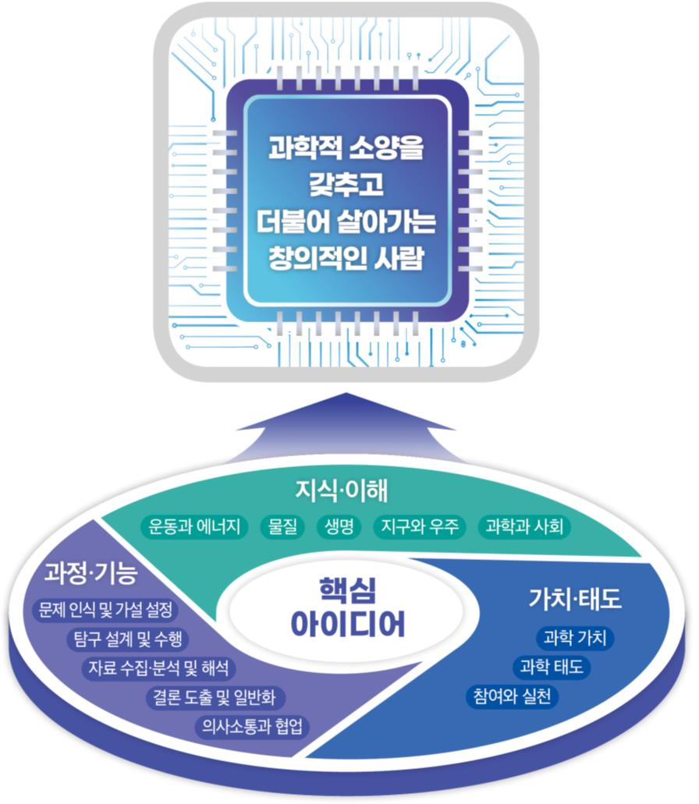

# 과학

# 과학

### 교육과정 설계의 개요

과학과 교육과정은 미래 사회를 살아갈 시민으로서 ‘과학적 소양을 갖추고 더불어 살아가는 창의적인 사람’을 육성하는 것을 목적으로 한다. 과학과 교육과정에서는 과학 지식⋅이해, 과정⋅기능, 가치⋅태도가 복합적으로 발현되어 나타나는 총체적인 능력인 역량을 함양하고자 한다.

과학과 교육과정에서는 자기관리, 지식정보처리, 창의적 사고, 심미적 감성, 협력적 소통, 공동체 역량 등과 같은 범교과적이고 일반적인 총론의 역량과 연계하여 과학적 탐구와 문제해결 능력, 과학적 의사결정 능력 등을 기르는 데 초점을 둔다. 이를 위해 과학과 교육과정은 생태 소양, 민주 시민의식, 디지털 소양을 갖추고, 첨단 과학기술을 기반으로 융복합 영역을 창출하는 미래 사회에 유연하게 대응할 수 있는 과학적 소양을 갖춘 사람을 양성하는 것을 목표로 한다.

과학과 교육과정의 영역은 운동과 에너지, 물질, 생명, 지구와 우주, 과학과 사회의 5개 영역으로 구성하였다. 운동과 에너지 영역은 자연과 사물 사이의 상호작용이나 법칙을, 물질 영역은 물질의 구조와 성질 및 화학적 변화를, 생명 영역은 인간을 포함한 생명 현상의 원리를, 지구와 우주 영역은 자연 현상의 변화와 지구시스템의 주요 원리를 다룬다. 과학과 사회 영역은 개인과 사회의 지속가능한 발전에서 과학의 역할을 강조하는 현실을 반영한 추가한 영역으로, 과학의 일반적 성격 및 사회적 역할을 중점적으로 다룬다.

과학과 핵심 아이디어는 과학 영역별로 주요 개념과 일반화된 지식을 중심으로 구성하였다. 운동과 에너지, 물질, 생명, 지구와 우주, 과학과 사회 등 과학의 영역별로 주요 과학 개념과 원리의 일상생활 적용과 통합⋅융합 교육을 체험할 수 있도록 과학의 지식⋅이해, 과정⋅기능, 가치⋅태도를 종합하여 핵심 아이디어를 도출하였다. 이러한 핵심 아이디어는 해당 영역의 학습을 통해 일반화할 수 있는 내용을 진술한 것으로, 과학과 관통개념을 공유하면서 과목별로 위계성과 연속성을 지닌다.

과학과 교육과정은 ‘성격 및 목표’, ‘내용 체계 및 성취기준’, ‘교수⋅학습 및 평가’로 구성된다. ‘성격 및 목표’에서는 각 과목의 고유한 특성과 주요 목표를 제시하였다. ‘내용 체계 및 성취기준’에서는 과목의 핵심 아이디어와 지식⋅이해, 과정⋅기능, 가치⋅태도별 주요 내용 요소 및 학생이 교과 학습을 통해 할 수 있기를 기대하는 도달점을 성취기준으로 제시하였다. 즉, 과학과 성취기준은 다양한 탐구 중심의 학습을 통해 ‘영역’별 지식⋅이해, 과정⋅기능, 가치⋅태도의 세 차원을 상호보완적으로 함양함으로써 영역별 핵심 아이디어에 도달할 수 있도록 제시하였다. 과학과 지식⋅이해는 과학과 영역별로 학생이 알고 이해해야 하는 내용을 학년군별로 제시하였다. 과학과 과정⋅기능은 학생들이 과학 학습을 통해 개발할 것으로 기대하는 과학과 탐구 기능과 과정에 해당하는 것으로, 문제 인식 및 가설 설정, 탐구 설계 및 수행, 자료 수집⋅분석 및 해석, 결론 도출 및 일반화, 의사소통과 협업을 근간으로 영역별 특성을 반영하였다. 과학과 가치⋅태도는 과학 가치(과학의 심미적 가치, 감수성 등), 과학 태도(과학 창의성, 유용성, 윤리성, 개방성 등), 참여와 실천(과학문화 향유, 안전⋅지속가능 사회에 기여 등)으로 구성하였다. ‘교수⋅학습 및 평가’에서는 교육과정에서 제시한 성취기준에 도달하는 데 필요한 교수⋅학습 및 평가의 주요 방향을 제시하였다. 과학과 교육과정에서는 학생이 지식⋅이해뿐만 아니라 과정⋅기능, 가치⋅태도를 균형 있게 발달시킬 수 있도록 지도하고, 학생이 행위 주체로서 자신의 역량 함양을 위해 교수⋅학습에 참여하도록 하는 방향, 그리고 교수⋅학습과 연계하여 학생의 학습과 성장을 도울 수 있는 평가 방향을 제시하였다. 특히, 미래 교육 환경에 적합한 다양한 교수⋅학습 활동을 통해 디지털⋅인공지능 기초 소양을 함양하도록 하였다.

### 1. 성격 및 목표

가. 성격

‘과학’은 ‘과학적 소양을 갖추고 더불어 살아가는 창의적인 사람’을 육성하기 위한 교과이다. ‘과학’ 교과에서는 모든 학생이 과학의 기본 개념을 익히고, 과학 탐구 능력과 태도를 길러, 자연과 일상생활에서 접하는 현상을 과학적으로 이해하고, 민주 시민으로서 개인과 사회 문제를 과학적으로 해결하고 참여⋅실천하는 역량 함양에 중점을 둔다.

‘과학’은 초등학교 1∼2학년에서 학습한 내용과 연계하여 미래 사회를 살아가기 위한 역량을 함양하고, 고등학교 과학 교과목 학습에 필요한 과학 기초 학력을 보장하기 위한 교과이다. ‘과학’은 초등학교 1∼2학년의 ‘슬기로운 생활’과 고등학교 1학년의 ‘통합과학1, 2’, ‘과학탐구실험1, 2’, 그리고 고등학교 일반선택, 융합선택 및 진로선택 과목과 긴밀하게 연계되어 있다.

‘과학’은 운동과 에너지, 물질, 생명, 지구와 우주 및 과학과 사회의 5개 영역으로 구성된다. 운동과 에너지 영역에서는 힘과 에너지, 전기와 자기, 열, 빛과 파동 등을 다루며, 물질 영역에서는 물질의 성질, 물질의 변화, 물질의 구조 등을 다룬다. 생명 영역에서는 생물의 구조와 에너지, 항상성과 몸의 조절, 생명의 연속성, 환경과 생태계, 생명과학과 인간의 생활 등을 다루며, 지구와 우주 영역에서는 고체 지구, 유체 지구, 천체 등을 다룬다. 과학과 사회 영역에서는 이들 4개 영역의 내용을 통합적으로 다루면서 과학과 안전, 과학과 지속가능한 사회, 과학과 진로 등을 다룬다.

미래 사회는 첨단 과학기술을 기반으로 혁신적인 융복합 영역이 창출되는 사회로, 과학적 문제해결력과 창의성을 발휘하는 전문가 집단과 과학적 소양을 갖춘 시민이 함께 이끄는 사회이다. ‘과학’에서는 다양한 탐구 중심의 학습을 통해 ‘과학’의 5개 영역과 관련된 지식⋅이해, 과정⋅기능, 가치⋅태도의 세 차원을 상호보완적으로 함양함으로써 영역별 핵심 아이디어를 습득하고, 행위 주체로서 갖추어야 할 과학적 소양을 기를 수 있을 것이다.

나. 목표

자연 현상과 일상생활에 대하여 흥미와 호기심을 가지고 과학적 탐구를 통해 주변의 현상을 이해하고, 개인과 사회의 문제를 과학적이고 창의적으로 해결하는 데 민주 시민으로서 참여하고 실천하는 과학적 소양을 기른다.

(1) 자연 현상과 일상생활에 대한 흥미와 호기심을 바탕으로, 개인과 사회의 문제를 인식하고 과학적으로 해결하려는 태도를 기른다.

(2) 과학의 탐구 방법을 이해하고 자연 현상과 일상생활의 문제를 과학적으로 탐구하는 능력을 기른다.

(3) 자연 현상과 일상생활을 과학적으로 탐구하여 과학의 핵심 개념을 이해한다.

(4) 과학과 기술 및 사회의 상호 관계를 이해하고, 개인과 사회의 문제해결에 민주 시민으로서 참여하고 실천하는 능력을 기른다.

### 2. 내용 체계 및 성취기준

가. 내용 체계

(1) 운동과 에너지

<table>
<tr><th colspan="2">핵심 아이디어</th><th colspan="3">⋅자연과 일상생활 속의 여러 가지 힘은 물체의 속력과 운동 방향을 변화시키고, 물체의 운동은 힘과 에너지를 통해 예측할 수 있으며, 이는 안전한 일상생활의 토대가 된다. ⋅전하와 전류는 다양한 전기와 자기 현상을 일으키고, 전기와 자기에 대한 성질은 전구, 전동기 등 여러 가지 전기 기구의 작동 원리로 유용하게 활용된다. ⋅열은 온도가 높은 곳에서 낮은 곳으로 이동하며, 일상생활에서는 단열 등 다양한 분야에 물질의 열적 성질이나 열의 이동 방식이 이용된다. ⋅빛과 소리는 반사, 굴절, 진동 등 파동의 특성을 가지며, 그 특성은 거울, 렌즈, 악기, 색의 구현 등 편리하고 심미적인 삶에 도움이 된다.</th></tr>
<tr><td colspan="2" rowspan="3">구분 범주</td><td colspan="3">학년(군)별 내용 요소</td></tr>
<tr><td colspan="2">초등학교</td><td>중학교</td></tr>
<tr><td>3~4학년군</td><td>5~6학년군</td><td>1~3학년</td></tr>
<tr><td rowspan="4">지식⋅이해</td><td>힘과 에너지</td><td>⋅밀기와 당기기 ⋅무게 ⋅수평잡기 ⋅도구의 이용</td><td>⋅위치의 변화 ⋅속력 ⋅속력과 안전</td><td>⋅힘 ⋅중력 ⋅마찰력 ⋅탄성력 ⋅부력 ⋅부력 ⋅등속 운동 ⋅자유 낙하 운동 ⋅일과 에너지 ⋅중력에 의한 위치 에너지 ⋅운동 에너지 ⋅역학적 에너지 보존</td></tr>
<tr><td>전기와 자기</td><td>⋅자석과 물체 사이의 힘 ⋅자석과 자석 사이의 힘 ⋅자석의 극 ⋅자석의 이용</td><td>⋅전기 회로 ⋅전지의 직렬연결 ⋅전자석 ⋅전기 안전</td><td>⋅전기력 ⋅대전 ⋅정전기 유도 ⋅전압 ⋅전류 ⋅옴의 법칙 ⋅전기 에너지 ⋅자기력 ⋅자기장</td></tr>
<tr><td>열</td><td></td><td>⋅온도 ⋅열의 이동 ⋅단열</td><td>⋅열평형 ⋅전도 ⋅대류 ⋅복사 ⋅비열 ⋅열팽창</td></tr>
<tr><td>빛과 파동</td><td>⋅소리의 발생 ⋅소리의 세기 ⋅소리의 높낮이 ⋅소리의 전달</td><td>⋅빛의 직진 ⋅평면거울에서 빛의 반사 ⋅빛의 굴절 ⋅렌즈의 이용</td><td>⋅시각과 상 ⋅반사와 굴절 ⋅거울과 렌즈 ⋅빛의 합성과 색 ⋅파동의 발생과 전달 ⋅파동의 요소와 소리의 특성</td></tr>
<tr><td colspan="2">과정⋅기능</td><td colspan="2">⋅자연과 일상생활에서 운동과 에너지 관련 문제 인식하기 ⋅문제를 해결하기 위한 탐구 설계하기 ⋅관찰, 측정, 분류, 예상, 추리 등을 통해 자료를 수집하고 비교⋅분석하기 ⋅수학적 사고와 컴퓨터 및 모형 활용하기 ⋅결론을 도출하고, 자연과 일상생활에서 운동과 에너지 관련 상황에 적용⋅설명하기 ⋅자신의 생각과 주장을 과학적 언어를 사용하여 다양한 방식으로 표현하고 공유하기</td><td>⋅자연과 일상생활에서 운동과 에너지와 관련된 현상을 관찰하고 문제를 찾아 정의하고 가설을 설정하기 ⋅적절한 변인을 포함하여 탐구 설계하기 ⋅운동과 에너지 사이의 관계를 이끌어내기 위해 자료를 수집하고 이를 그래프로 변환하여 해석하기 ⋅운동과 에너지와 관련된 다양한 현상을 관찰하여 규칙성을 추리하기 ⋅모형을 만들어 현상을 설명하거나 예측하기 ⋅과학적 증거에 기반하여 주장하기</td></tr>
<tr><td colspan="2">가치⋅태도</td><td colspan="3">⋅과학의 심미적 가치 ⋅과학 유용성 ⋅자연과 과학에 대한 감수성 ⋅과학 창의성 ⋅과학 활동의 윤리성 ⋅과학 문제 해결에 대한 개방성 ⋅안전⋅지속가능 사회에 기여 ⋅과학 문화 향유</td></tr>
</table>

(2) 물질

<table>
<tr><th colspan="2">핵심 아이디어</th><th colspan="3">⋅물질은 여러 가지 상태로 존재하며, 구성 입자의 운동에 따라 물질의 상태와 물리적 성질이 변한다. ⋅물질의 상태 변화 및 화학 반응에는 에너지 출입이 수반되며, 이는 일상생활에 유용하게 활용된다. ⋅물질은 서로 구분할 수 있는 고유한 특성을 가지며, 물질의 특성은 일상생활의 다양한 혼합물 분리에 이용된다. ⋅화학 반응을 통해 물질은 다른 물질로 변하며, 화학 반응의 규칙성은 새로운 물질의 생성 원리가 된다.</th></tr>
<tr><td colspan="2" rowspan="3">구분 범주</td><td colspan="3">학년(군)별 내용 요소</td></tr>
<tr><td colspan="2">초등학교</td><td>중학교</td></tr>
<tr><td>3~4학년군</td><td>5~6학년군</td><td>1~3학년</td></tr>
<tr><td rowspan="3">지식⋅이해</td><td>물질의 성질</td><td>⋅물체와 물질 ⋅물질의 세 가지 상태 ⋅기체의 무게 ⋅온도와 압력에 따른 기체의 부피 변화 ⋅물의 상태 변화</td><td>⋅용액, 용매, 용질 ⋅용해 ⋅용액의 진하기 ⋅혼합물의 분리</td><td>⋅입자 운동 ⋅기체의 압력 ⋅기체의 압력과 부피 관계 ⋅기체의 온도와 부피 관계 ⋅물질의 상태와 입자 모형 ⋅상태 변화와 열에너지 ⋅밀도, 용해도, 녹는점, 끓는점 ⋅순물질과 혼합물</td></tr>
<tr><td>물질의 변화</td><td></td><td>⋅지시약 ⋅산성 용액 ⋅염기성 용액 ⋅연소 조건 ⋅연소 생성물</td><td>⋅화학 변화 ⋅화학 반응식 ⋅질량 보존 법칙 ⋅일정 성분비 법칙 ⋅기체 반응 법칙 ⋅화학 반응에서 열에너지의 출입</td></tr>
<tr><td>물질의 구조</td><td></td><td></td><td>⋅원소 ⋅원자 ⋅분자 ⋅이온 ⋅화합물 ⋅화학식 ⋅주기율표</td></tr>
<tr><td colspan="2">과정⋅기능</td><td colspan="2">⋅자연과 일상생활에서 물질과 관련된 문제 인식하기 ⋅관찰, 측정, 분류, 예상, 추리 등을 통해 자료를 수집하고 비교⋅분석하기 ⋅탐구 결과를 해석하여 결론을 도출하기 ⋅물질과 관련된 일상생활의 문제를 해결하기 위한 탐구 설계하기 ⋅결론을 도출하고, 자연과 일상생활에서 물질 관련 상황에 적용⋅설명하기 ⋅자신의 생각과 주장을 과학적 언어를 사용하여 다양한 방식으로 표현하고 공유하기</td><td>⋅자연과 일상생활에서 물질과 관련된 현상을 관찰하여 문제를 인식하고 가설을 설정하기 ⋅관찰, 측정, 분류, 예상, 추리 등을 통해 자료를 수집하고 비교⋅분석하기 ⋅적절한 변인을 포함하여 탐구 설계하기 ⋅탐구 결과를 해석하여 결론을 도출하기 ⋅수학적 사고와 디지털 탐구 도구 활용하기 ⋅변인 간의 관계를 이끌어내기 위해 자료를 수집하고 이를 그래프로 변환하여 해석하기 ⋅모형을 이용하여 현상을 설명하거나 예측하기 ⋅과학적 증거에 기반하여 주장하기</td></tr>
<tr><td colspan="2">가치⋅태도</td><td colspan="3">⋅과학의 심미적 가치 ⋅과학 유용성 ⋅자연과 과학에 대한 감수성 ⋅과학 창의성 ⋅과학 활동의 윤리성 ⋅과학 문제 해결에 대한 개방성 ⋅안전⋅지속가능 사회에 기여 ⋅과학 문화 향유</td></tr>
</table>

(3) 생명

<table>
<tr><th colspan="2">핵심 아이디어</th><th colspan="3">⋅생물은 세포로 이루어져 있고, 여러 구성 단계가 유기적으로 연관되어 있으며, 조화로운 작용을 통해 건강한 몸을 유지한다. ⋅식물은 광합성으로 양분을 만들며, 생물은 호흡을 통해 생명 활동에 필요한 에너지를 얻는다. ⋅동물은 다양한 감각 기관을 통해 자극을 받아들이고, 신경계와 호르몬의 작용을 통해 반응한다. ⋅생물은 생식을 통해 자손을 생산하고, 생물의 형질은 유전자에 의해 자손에게 전달되며, 생물의 유전 현상은 사람의 가계에서도 관찰된다. ⋅우리 주변의 다양한 생물은 환경과 영향을 주고받으며 밀접한 관계를 맺고 있으며, 생물다양성은 생태계와 인간의 삶과도 밀접하게 관련되어 있다.</th></tr>
<tr><td colspan="2" rowspan="3">구분 범주</td><td colspan="3">학년(군)별 내용 요소</td></tr>
<tr><td colspan="2">초등학교</td><td>중학교</td></tr>
<tr><td>3~4학년군</td><td>5~6학년군</td><td>1~3학년</td></tr>
<tr><td rowspan="5">지식⋅이해</td><td>생물의 구조와 에너지</td><td>⋅동물의 생김새 ⋅식물의 생김새 ⋅균류, 원생생물, 세균의 특징</td><td>⋅세포의 구조 ⋅뼈와 근육의 구조와 기능 ⋅소화⋅순환⋅호흡⋅배설 기관의 구조와 기능 ⋅뿌리, 줄기, 잎, 꽃의 구조와 기능 ⋅증산 작용 ⋅광합성 산물</td><td>⋅세포와 생물 구성 단계 ⋅소화계, 순환계, 호흡계, 배설계의 구조와 기능 ⋅광합성 과정 ⋅광합성에 영향을 미치는 요인 ⋅식물의 호흡과 광합성의 관계</td></tr>
<tr><td>항상성과 몸의 조절</td><td></td><td></td><td>⋅감각 기관의 구조와 기능 ⋅뉴런과 신경계의 구조와 기능 ⋅자극에서 반응까지의 경로 ⋅호르몬에 의한 항상성 유지</td></tr>
<tr><td>생명의 연속성</td><td>⋅동물의 한살이 ⋅식물의 한살이 ⋅식물이 자라는 조건 ⋅다양한 환경에 사는 동물과 식물 ⋅특징에 따른 동물 분류 ⋅특징에 따른 식물 분류</td><td></td><td>⋅세포분열 ⋅동물의 발생 과정 ⋅유전 형질과 유전 원리 ⋅변이와 생물다양성 ⋅종의 개념과 분류 체계 ⋅생물다양성 보전의 중요성</td></tr>
<tr><td>환경과 생태계</td><td>⋅생물 요소와 비생물 요소 ⋅환경오염이 생물에 미치는 영향 ⋅먹이사슬과 먹이그물</td><td></td><td></td></tr>
<tr><td>생명과학과 인간의 생활</td><td>⋅생활 속에서 동물과 식물의 이용 ⋅균류, 원생생물, 세균의 이용 ⋅생명과학과 우리 생활</td><td></td><td></td></tr>
<tr><td colspan="2">과정⋅기능</td><td colspan="2">⋅자연과 일상생활에서 생명 현상 관련 문제 인식하기 ⋅문제를 해결하기 위한 탐구 설계하기 ⋅생물 관찰 및 분류하기 ⋅자료 조사 및 해석하기 ⋅모형으로 설명하기 ⋅자신의 생각과 주장을 과학적 언어를 사용하여 협력적 소통하기</td><td>⋅생물 특징과 생명 활동 관계 추론하기 ⋅생물 분류하기 ⋅생명 현상 관찰을 토대로 문제를 인식하고 가설 설정하기 ⋅관찰, 측정, 분류, 예상, 추리 등을 통해 자료를 수집하고 비교⋅분석하기 ⋅적절한 변인을 포함하여 탐구 설계하기 ⋅탐구 결과를 해석하여 결론을 도출하기 ⋅모형을 만들어 생명 현상을 설명하거나 예측하기 ⋅협력적 소통하기</td></tr>
<tr><td colspan="2">가치⋅태도</td><td colspan="3">⋅과학의 심미적 가치 ⋅과학 유용성 ⋅자연과 과학에 대한 감수성 ⋅과학 창의성 ⋅과학 활동의 윤리성 ⋅과학 문제 해결에 대한 개방성 ⋅안전⋅지속가능 사회에 기여 ⋅과학 문화 향유</td></tr>
</table>

(4) 지구와 우주

<table>
<tr><th colspan="2">핵심 아이디어</th><th colspan="3">⋅지구계는 지권, 수권, 기권, 생물권 등으로 구성되며, 이러한 지구계 구성 요소들이 상호작용을 통해 에너지와 물질을 교환하는 과정에서 다양한 자연 현상들이 발생한다. ⋅암석과 화석, 지구 내부를 탐구함으로써 지질시대 동안 지구 환경과 생물의 변천 과정을 밝혀낼 수 있다. ⋅물은 땅과 바다, 대기 등으로 끊임없이 순환하면서 지표의 특징을 변화시키고 지하구조를 만든다. ⋅지구의 기후시스템은 태양 복사와 지구 복사, 인간 활동 등의 영향을 받으며, 이러한 요인들이 복합적으로 상호작용하여 나타난 기상 현상과 기후변화는 우리 생활과 지속가능성에 영향을 미친다. ⋅태양계는 행성 및 소천체 등으로 구성되며, 생성 과정에 따라 태양계 천체의 표면은 다양하게 나타난다. ⋅별의 표면 온도, 크기, 질량, 거리 등을 결정하는 데 관측 자료와 증거 기반 해석 등이 활용된다.</th></tr>
<tr><td colspan="2" rowspan="3">구분 범주</td><td colspan="3">학년(군)별 내용 요소</td></tr>
<tr><td colspan="2">초등학교</td><td>중학교</td></tr>
<tr><td>3~4학년군</td><td>5~6학년군</td><td>1~3학년</td></tr>
<tr><td rowspan="3">지식⋅이해</td><td>고체 지구</td><td>⋅강 주변 지형 ⋅화산 활동 ⋅화성암 ⋅지진 대처 방법</td><td>⋅지층 ⋅퇴적암 ⋅화석의 생성 ⋅과거 생물과 환경</td><td>⋅지구계 ⋅광물과 암석 ⋅암석의 순환 ⋅풍화 작용 ⋅판과 대륙이동설 ⋅지진대와 화산대</td></tr>
<tr><td>유체 지구</td><td>⋅바다의 특징 ⋅밀물과 썰물 ⋅파도 ⋅바닷가 주변 지형 ⋅갯벌 보전 ⋅지구의 대기</td><td>⋅날씨와 기상 요소 ⋅이슬, 안개, 구름 ⋅고기압과 저기압</td><td>⋅대기와 해양의 층상 구조 ⋅수권과 수자원 ⋅염분과 해류 ⋅온실효과와 지구온난화 ⋅대기 대순환 ⋅강수 과정 ⋅중위도 저기압 ⋅일기도</td></tr>
<tr><td>천체</td><td>⋅달의 모양과 표면 ⋅달의 위상변화 ⋅태양계 행성 ⋅별과 별자리</td><td>⋅태양과 별의 위치 변화 ⋅지구의 자전과 공전 ⋅계절별 별자리 변화 ⋅태양 고도의 일변화 ⋅계절별 낮의 길이</td><td>⋅태양계 구성 천체 ⋅태양 표면과 태양 활동 ⋅달의 위상변화 ⋅일식과 월식 ⋅연주시차 ⋅별의 특성 ⋅우리은하 ⋅우주 팽창 ⋅우주탐사</td></tr>
<tr><td colspan="2">과정⋅기능</td><td colspan="2">⋅자연과 일상생활에서 지구와 우주 관련 문제 인식하기 ⋅문제를 해결하기 위한 탐구 설계하기 ⋅관찰, 측정, 분류, 예상, 추리 등을 통해 자료를 수집하고 비교⋅분석하기 ⋅수학적 사고, 컴퓨터 및 모형 활용하기 ⋅결론을 도출하고, 지구와 우주 관련 상황에 적용⋅설명하기 ⋅자신의 생각과 주장을 과학적 언어를 사용하여 다양한 방식으로 표현하고 공유하기</td><td>⋅지구와 우주 관련 현상 관찰을 토대로 문제를 인식하고 가설을 설정하기 ⋅관련 변인을 포함하여 탐구 설계하기 ⋅지구시스템 구성 요소들의 상호작용에 대한 자료를 조사⋅평가 및 변환하기 ⋅지구와 우주와 관련된 다양한 현상을 관찰하여 규칙성을 추리하기 ⋅모형을 만들어 현상을 설명하거나 예측하기 ⋅과학적 증거에 기반하여 주장하기</td></tr>
<tr><td colspan="2">가치⋅태도</td><td colspan="3">⋅과학의 심미적 가치 ⋅과학 유용성 ⋅자연과 과학에 대한 감수성 ⋅과학 창의성 ⋅과학 활동의 윤리성 ⋅과학 문제 해결에 대한 개방성 ⋅안전⋅지속가능 사회에 기여 ⋅과학 문화 향유</td></tr>
</table>

(5) 과학과 사회

<table>
<tr><th colspan="2">핵심 아이디어</th><th colspan="3">⋅과학 탐구를 통해 얻은 과학기술은 질병의 발생 원인 규명과 예방법 마련 등 인류 복지에 기여하고, 인류가 처한 여러 가지 재난 상황 극복에 활용된다. ⋅과학기술은 자원과 에너지 등의 효율적 이용 방안을 제공하여 지속가능한 사회에 기여한다. ⋅과학기술의 발달은 미래 사회의 모습과 직업에 영향을 미치며, 개인은 이러한 미래 사회의 모습과 새로운 진로를 탐색하며 자신의 삶을 준비한다.</th></tr>
<tr><td colspan="2" rowspan="3">구분 범주</td><td colspan="3">학년(군)별 내용 요소</td></tr>
<tr><td colspan="2">초등학교</td><td>중학교</td></tr>
<tr><td>3~4학년군</td><td>5~6학년군</td><td>1~3학년</td></tr>
<tr><td rowspan="3">지식⋅이해</td><td>과학과 안전</td><td>⋅질병과 예방 ⋅감염병과 건강한 생활</td><td></td><td>⋅재해⋅재난 ⋅재해⋅재난에 대한 과학적 대처 방안</td></tr>
<tr><td>과학과 지속가능한 사회</td><td>⋅기후변화 사례 ⋅기후위기 대응</td><td>⋅자원의 종류 ⋅자원의 효율적인 이용 ⋅지속가능한 에너지 이용</td><td>⋅과학적 탐구 방법 ⋅과학기술의 영향 ⋅과학과 지속가능한 사회</td></tr>
<tr><td>과학과 진로</td><td></td><td>⋅진로와 과학의 관련성 ⋅진로 계획</td><td>⋅과학 관련 진로와 직업 ⋅진로 계획 실천 방안</td></tr>
<tr><td colspan="2">과정⋅기능</td><td colspan="2">⋅자연과 일상생활에서 과학과 기술 및 사회의 상호작용과 관련된 문제 인식하기 ⋅문제를 해결하기 위한 탐구 설계하기 ⋅신뢰성 있는 출처를 활용하여 자료를 수집하고 정리하기 ⋅융합적 사고와 수학적 사고, 컴퓨터 및 모형 활용하기 ⋅결론을 도출하고, 과학⋅기술⋅사회의 문제 해결 상황에 적용⋅설명하기 ⋅자신의 생각과 주장을 과학적 언어를 사용하여 다양한 방식으로 표현하고 공유하기</td><td>⋅자연과 일상생활에서 과학과 기술 및 사회의 상호작용과 관련된 문제를 찾아 정의하고 가설 설정하기 ⋅문제를 해결하기 위해 변인이 포함된 탐구 설계하기 ⋅다양한 도구를 활용하여 자료를 수집하고 변환하기 ⋅융합적 사고, 수학적 사고와 컴퓨터 등을 활용해 자료를 분석⋅평가⋅추론하기 ⋅결론을 도출하고, 결론의 사회적 가치를 판단하여 과학⋅기술⋅사회의 문제 해결 상황에 적용⋅설명하기 ⋅타당한 근거에 기초하여 자신의 주장을 펼치고 실천적 대안 마련하기</td></tr>
<tr><td colspan="2">가치⋅태도</td><td colspan="3">⋅과학의 심미적 가치 ⋅과학의 사회적 가치 ⋅과학 유용성 ⋅자연과 과학에 대한 감수성 ⋅과학 창의성 ⋅과학 활동의 윤리성 ⋅과학 문제 해결에 대한 개방성 ⋅과학 문제 해결의 학문 간 융합적 접근 ⋅안전⋅지속가능 사회에 기여 ⋅과학 문화 향유</td></tr>
</table>

나. 성취기준

[중학교 1\~3학년]

(1) 과학과 인류의 지속가능한 삶

[9과01-01] 과학적 탐구 방법을 이해하고, 일상생활의 문제에 대한 과학적 해결 방안을 제안할 수 있다.
[9과01-02] 과학의 발전이 인류 문명에 미친 영향을 이해하고, 인공지능 등 첨단 과학기술이 가져올 미래 사회의 변화를 조사하여 발표할 수 있다.
[9과01-03] 인류의 지속가능한 삶을 위한 과학기술의 중요성과 역할에 대해 토의하고, 개인과 사회 차원의 활동 방안을 찾아 실천할 수 있다.
<탐구 활동>
• 주변에서 탐구할 문제를 발견하고 탐구 계획서 작성하기

(가) 성취기준 해설

• [9과01-01] 간단한 탐구 실험을 제시하여 탐구 절차 및 방법을 익히도록 하며, 학생이 스스로 발견한 문제를 일정 기간 동안 지속적으로 탐구하여 해결해 보는 기회를 제공할 수 있다.

• [9과01-02] 과학적 탐구 방법을 통해 얻은 과학 지식과 방법이 인류 문명과 문화 발달에 미친 영향을 중심으로 학습하고, 원리보다는 활용 측면에서 첨단 과학기술 사례를 함께 다룬다.

(나) 성취기준 적용 시 고려 사항

• 초등학교 3∼4학년군 ‘기후변화와 우리 생활’, 5∼6학년군 ‘자원과 에너지’와 연계된다.

• 인류 문명 발달 과정에서 과학적 원리 발견, 기술 발달, 기기 발명에 관한 자료를 수집하고 토의하도록 지도할 수 있다. 과학 개념과 원리가 기술, 공학, 예술, 수학 등 과학 외의 교과와 관련 있음을 사례를 통해 이해하도록 한다.

• 조사와 토의⋅토론 등의 교수⋅학습 방법을 활용하여 첨단 과학기술 사례를 찾고, 이 과정에서 과학이 사회에 미치는 영향을 알게 한다. 조사한 자료를 바탕으로 미래 생활의 모습을 예측하도록 하고, 이를 글이나 그림으로 표현하도록 하여 관련 내용을 평가할 수 있다.

• 인류가 직면한 에너지나 환경 문제와 같은 과학 관련 쟁점을 알고 이에 대한 자신의 의견을 과학적으로 제시하게 한다.

(2) 생물의 구성과 다양성

[9과02-01] 세포는 생명 활동이 일어나는 기본 단위임을 이해하고, 세포의 구조와 기능의 관계를 추론할 수 있다.
[9과02-02] 생물의 유기적 구성 단계를 이해하고, 동물과 식물을 비교하여 분석할 수 있다.
[9과02-03] 생물다양성을 이해하고, 변이와 생물다양성의 관계를 추론할 수 있다.
[9과02-04] 종의 개념과 분류 체계를 이해하고, 생물을 계 수준에서 분류할 수 있다.
[9과02-05] 생물다양성 보전의 필요성을 이해하고, 생물다양성 유지를 위한 방안을 조사하고 실천할 수 있다.
<탐구 활동>
• 세포 관찰하기
• 생물다양성 보전 놀이 활동하기

(가) 성취기준 해설

• [9과02-01] 세포의 구조는 세포벽, 세포막, 핵, 엽록체, 미토콘드리아를, 세포의 특징으로는 생명 활동을 유추할 수 있는 세포(적혈구, 신경세포, 상피세포 등)를 다룬다.

• [9과02-04] 종은 생물학적 종 개념만을, 생물 분류 체계는 5계만을 다루도록 한다.

(나) 성취기준 적용 시 고려 사항

• 초등학교 3∼4학년군 ‘다양한 생물과 우리 생활’, ‘생물과 환경’, 고등학교 ‘통합과학1’의 시스템과 상호작용, ‘통합과학2’의 변화와 다양성과 연계된다.

• 생물다양성 이해를 위해 우리 학교(마을)의 생물을 관찰하여, 우리 학교(마을) 생태 지도 만들기 및 생물 분류 활동을 할 수 있다.

• 생물다양성 보전 놀이 활동을 통해 생물다양성 보전의 필요성을 이해하도록 하고, 개인적, 사회적 차원에서 이루어질 수 있는 생물다양성 유지 방안을 조사하고 이를 실천하며, 이 과정에서 지속가능성을 고려한 생태전환교육이 이루어질 수 있도록 한다.

(3) 열

[9과03-01] 온도와 열평형 과정을 물질을 구성하는 입자들의 배치나 움직임 등으로 설명할 수 있다.
[9과03-02] 열은 전도, 대류, 복사로 전달됨을 알고, 열전달 과정을 모형 등을 사용하여 다양하게 표현할 수 있다.
[9과03-03] 물질에 따라 비열과 열팽창 정도가 다름을 알고, 이러한 성질이 일상생활에서 유용하게 활용됨을 인식할 수 있다.
<탐구 활동>
• 열화상 카메라를 이용하여 물체에서 열의 전도 비교하기
• 온도 센서를 이용하여 여러 가지 액체의 비열 비교하기

(가) 성취기준 해설

• [9과03-01] 온도가 다른 두 물체가 열평형에 도달하는 과정을 시간-온도 그래프 등을 활용하여 설명할 수 있도록 한다.

• [9과03-02] 열의 이동 방식을 주변 도구나 신체를 이용하여 비유적으로 다양하게 표현하고, 그 차이를 설명할 수 있도록 한다.

(나) 성취기준 적용 시 고려 사항

• 초등학교 5∼6학년군 ‘열과 우리 생활’, 고등학교 ‘역학과 에너지’의 열과 에너지와 연계된다.

• 온도를 측정하거나 열의 전도를 관찰하는 활동에서 온도 센서 등 디지털 탐구 도구를 활용하도록 한다.

• 비열과 열팽창 실험에서 가열 장치로 실험할 때 화상이나 화재 등 안전사고에 유의하도록 안전 교육을 실시하고, 안전장치나 안전 장구가 갖추어진 상태에서 실시하도록 한다.

(4) 물질의 상태 변화

[9과04-01] 확산 및 증발 현상을 관찰하여 물질을 구성하는 입자가 운동하고 있음을 추론할 수 있다.
[9과04-02] 물질의 세 가지 상태의 특징을 설명하고, 이를 입자 모형으로 표현할 수 있다.
[9과04-03] 여러 가지 물질의 상태 변화를 관찰하고, 이를 입자 모형으로 설명할 수 있다.
[9과04-04] 물질의 상태 변화와 열에너지 출입 관계를 이해하고, 이를 실생활에 적용하여 과학의 유용성을 인식할 수 있다.
<탐구 활동>
• 확산 현상 관찰하기
• 물질의 상태 변화 시 질량과 부피 변화 측정하기
• 상태 변화 실험에서 가열 곡선 또는 냉각 곡선 그리기

(가) 성취기준 해설

• [9과04-02] 물질의 상태를 나타내는 입자 모형은 입자 사이의 상대적 거리, 입자 배열의 불규칙한 정도, 입자의 운동성 등을 비교한 내용을 포함한다.

• [9과04-03] 여러 가지 물질의 상태 변화를 관찰하여 융해, 응고, 기화, 액화, 승화를 구분하고, 물질의 상태가 변할 때 부피는 변하고 질량과 물질의 성질은 변하지 않는 이유를 입자 모형으로 설명한다.

• [9과04-04] 물질의 상태 변화 시 온도가 일정한 이유를 상태 변화 과정에서 출입하는 열에너지와 관련지어 설명한다.

(나) 성취기준 적용 시 고려 사항

• 초등학교 3∼4학년군 ‘물의 상태 변화’, 고등학교 ‘물질과 에너지’의 물질의 세 가지 상태와 연계된다.

• 질량은 물질이 가지고 있는 고유한 양임을 설명한다. 질량은 무게를 측정하여 확인하고, 기체의 질량을 저울로 측정할 때는 부력이 측정값에 영향을 줄 수 있음을 유의한다.

• 상태 변화 시 열에너지의 출입으로 입자의 배열과 운동이 달라지는 실험 결과를 입자 모형을 사용하여 설명하도록 한다.

• 녹는점, 끓는점, 어는점의 정확한 개념은 중학교 1∼3학년군 ‘물질의 특성’에서 학습하므로 각 상태 변화가 일어나는 온도라는 측면에 주안점을 둔다.

(5) 힘의 작용

[9과05-01] 물체에 작용하는 힘을 화살표를 이용하여 나타내고, 힘의 평형을 이루는 조건을 설명할 수 있다.
[9과05-02] 중력, 탄성력, 마찰력, 부력을 이해하고, 각 힘의 특징을 크기와 방향으로 설명할 수 있다.
[9과05-03] 알짜힘이 0이 아닐 때 물체의 운동 상태가 변함을 알고, 그 예를 조사하여 분류할 수 있다.
[9과05-04] 다양한 사례에서 작용하는 힘과 힘의 평형 관계를 설명하고, 일상생활에서 힘의 특징을 이용한 기구나 장치를 설계할 수 있다.
<탐구 활동>
• 용수철의 탄성력 측정하기
• 물속에서 부력 측정하기
• 장난감이나 놀이 기구에서 힘의 작용 탐구하기

(가) 성취기준 해설

• [9과05-01] 힘의 정의를 알고 힘을 크기와 방향으로 나타낼 수 있도록 하며, 나란한 힘의 합력만을 다루도록 한다.

• [9과05-02] 중력을 지도할 때, 질량과 무게를 구별하도록 한다.

• [9과05-03] 물체가 힘을 받았을 때 물체의 운동을 속력이 변하거나 운동 방향이 바뀌거나 두 가지가 모두 변하는 사례로 분류하도록 한다.

• [9과05-04] 바닥에 놓인 물체에 작용하는 힘을 설명할 때, 중력과 함께 바닥이 물체를 떠받치는 힘을 도입한다.

(나) 성취기준 적용 시 고려 사항

• 초등학교 3∼4학년군 ‘힘과 우리 생활’, 고등학교 ‘통합과학1’의 시스템과 상호작용, ‘물리학’의 힘과 에너지와 연계된다.

• 학생들이 일상적으로 경험하는 힘의 개념을 글, 그림 등 다양한 형태로 표현하도록 하여 과학적인 힘의 개념이 형성되도록 지도한다.

• 힘의 작용에 대한 이해 정도를 평가하기 위해 일상생활에서 물체가 힘을 받았을 때 속력이 변하거나 운동 방향이 바뀌거나 두 가지가 모두 변하는 사례를 조사하고, 포스터 발표, 보고서 작성 등 다양한 형태의 산출물을 제작하도록 할 수 있다.

(6) 기체의 성질

[9과06-01] 압력의 의미를 알고, 기체의 압력을 입자의 운동으로 설명할 수 있다.
[9과06-02] 기체의 압력과 부피 관계를 실험 결과로부터 알아내고, 이를 입자 모형으로 해석할 수 있다.
[9과06-03] 기체의 온도와 부피 관계를 실험 결과로부터 알아내고, 이를 입자 모형으로 해석할 수 있다.
<탐구 활동>
• 기체의 압력과 부피 관계와 기체의 온도와 부피 관계를 실험으로 알아보기

(가) 성취기준 해설

• [9과06-01] 압력의 의미는 일상생활에서 경험할 수 있는 예시로 설명하고, 기체의 압력은 일정한 면적에 입자의 충돌로 가해지는 힘의 수준에서 다룬다.

• [9과06-02∼03] 기체의 압력과 부피, 기체의 온도와 부피를 측정한 각각의 실험 결과에서 두 변인 간 관계를 찾고 그 이유를 입자 모형으로 설명한다.

(나) 성취기준 적용 시 고려 사항

• 초등학교 3∼4학년군 ‘여러 가지 기체’, 고등학교 ‘물질과 에너지’의 물질의 세 가지 상태와 연계된다.

• 기체의 압력과 부피, 온도와 부피 관계를 확인할 수 있는 생활 속 현상을 찾아 발표하는 활동을 할 수 있다. 또한, 수식을 활용하여 변인 사이의 양적 관계를 계산하는 정량적 내용은 고등학교 '물질과 에너지'에서 다루므로 입자 모형을 이용한 정성적 설명에 주안점을 둔다.

• 탐구 활동 수행 시, 의사소통과 협업 능력을 키우기 위해 여러 모둠의 데이터를 공유하여 탐구 활동을 수행할 수 있으며, 데이터 공유 시 공유 플랫폼을 활용할 수 있다.

• 데이터를 수집하거나 시각화할 때 다양한 센서와 소프트웨어를 활용하여 디지털 소양을 함양하도록 지도한다.

(7) 태양계

[9과07-01] 태양계를 구성하는 천체의 특징을 알고, 행성을 목성형 행성과 지구형 행성으로 구분할 수 있다.
[9과07-02] 태양의 표면과 대기에서 일어나는 현상을 알고, 태양의 활동이 지구에 미치는 영향을 추론할 수 있다.
[9과07-03] 지구 자전에 의한 천체의 겉보기 운동과 지구 공전에 의한 별자리 변화를 이해하고, 밤하늘 천체에 호기심을 가진다.
[9과07-04] 달을 관측하여 달의 위상변화 원리를 이해하고, 일식과 월식을 설명할 수 있다.
<탐구 활동>
• 망원경을 이용하여 달, 행성 관측하기
• 태양계 천체 자료 수집 및 분석하기
• 모형을 이용하여 달의 위상변화 관찰하기

(가) 성취기준 해설

• [9과07-01] 태양계를 구성하는 천체인 태양, 행성, 왜소행성, 소행성, 위성, 혜성을 개괄적으로 학습하며, 자세한 특징은 다루지 않는다.

• [9과07-03] 관측자의 위치(고위도, 저위도, 중위도)에 따른 일주운동은 다루지 않는다. 지구의 자전과 공전을 우주에서 바라보는 관점으로 설명한다.

(나) 성취기준 적용 시 고려 사항

• 초등학교 3∼4학년군 ‘밤하늘 관찰’, 5∼6학년군 ‘지구의 운동’, ‘계절의 변화’, 고등학교 ‘통합과학1’의 물질과 규칙성, ‘지구과학’의 태양계 천체와 별과 우주의 진화, ‘행성우주과학’의 우주탐사와 행성계와 연계된다.

• 태양, 달, 행성을 천체 망원경으로 관측할 기회를 제공하도록 한다. 지역 천문대나 과학교육원 등을 활용할 수 있다.

• 야간에 별이나 행성 등을 관측할 때 안전 사항을 준수하도록 하고, 특히 태양의 흑점, 일식 등을 관찰할 때는 눈으로 직접 보지 않고 필터 등을 사용하도록 지도한다.

• 태양계 학습 시 디지털 탐구 도구, 최신 관측 자료, 천체 관측 프로그램, 앱 등을 적절하게 활용하도록 한다.

• 일식과 월식은 천체 관측 프로그램이나 모형 등으로 수업을 진행할 수 있으며, 작도 중심의 수업 활동은 지양한다.

(8) 물질의 특성

[9과08-01] 물질의 특성의 의미를 알고, 실험을 통해 밀도, 용해도, 녹는점, 끓는점 등을 설명할 수 있다.
[9과08-02] 물질의 특성을 근거로 우리 주변의 물질을 순물질과 혼합물로 분류할 수 있다.
[9과08-03] 물질의 특성을 이용하여 혼합물이 분리되는 원리를 이해하고, 이를 이용한 사례를 주변에서 찾을 수 있다.
<탐구 활동>
• 혼합물 분리 실험을 설계하고 수행하기

(가) 성취기준 해설

• [9과08-01] 물질의 특성은 특정한 조건에서 항상 일정한 값을 가지며 물질의 양에 따라 달라지지 않는 것으로 물질을 구분하는 중요한 정보가 됨을 이해하고, 그 사례로 밀도, 용해도, 녹는점, 끓는점 등이 있음을 다룬다.

(나) 성취기준 적용 시 고려 사항

• 초등학교 3∼4학년군 ‘물체와 물질’과 중학교 1∼3학년군 ‘화학 반응의 규칙성’과 연계된다.

• 순물질과 혼합물을 분류하는 활동 시, 순물질과 혼합물을 구별하는 기준에 대해 토의하고, 이 기준에 따라 여러 가지 물질을 순물질과 혼합물로 구별하는 활동을 할 수 있다.

• 탐구 활동 수행 시 여러 모둠의 실험 데이터를 공유하여 탐구할 수 있다.

• 혼합물의 분리 실험을 설계할 때 혼합물을 구성하는 순물질의 종류와 각 순물질의 특성에 관해 조사한 자료를 근거로 효과적인 분리 방법에 관해 논의하여 실험 계획을 공유할 수 있도록 한다.

• 혼합물의 분리 방법과 원리를 이해하는 수준에서 다루며, 혼합물의 분리 결과를 확인하는 활동을 할 수 있다.

(9) 지권의 변화

[9과09-01] 지구계의 구성 요소를 알고, 지권의 층상 구조와 그 특징을 조사⋅발표할 수 있다.
[9과09-02] 조암 광물의 주요 특성을 관찰하고, 암석과 광물의 활용 방안 및 자원으로서 가치에 대해 조사할 수 있다.
[9과09-03] 지각을 이루는 암석을 생성 과정에 따라 분류하고, 암석의 순환 과정을 설명할 수 있다.
[9과09-04] 풍화 과정을 이해하고, 토양 생성 과정을 풍화 작용의 예로 설명할 수 있다.
[9과09-05] 대륙이동설을 이해하고, 지진과 화산이 발생하는 지역의 분포를 판의 경계와 관련지어 설명할 수 있다.
<탐구 활동>
• 광물 특성 관찰하기
• 암석을 관찰하여 분류하기
• 빅데이터를 활용하여 화산대 및 지진대와 판의 경계와의 관련성 탐구하기

(가) 성취기준 해설

• [9과09-01] 지구계의 구성 요소 및 지권을 구성하는 각 층의 명칭과 상태만 다루며, 지구 내부구조 탐사에서 지진파의 특성은 다루지 않는다.

• [9과09-02] 광물의 특성은 색, 조흔색, 굳기, 염산 반응, 자성만 다루고, 굳기는 방해석과 석영 정도만 비교하여 제시한다.

• [9과09-03] 지각에 분포하는 다양한 암석 중, 화성암은 현무암, 유문암, 화강암, 반려암을, 퇴적암은 이암, 사암, 역암, 석회암을, 변성암은 편암, 편마암, 대리암, 규암만을 대표적으로 다룬다.

• [9과09-05] 화산대와 지진대의 분포가 판의 경계와 일치한다는 정도만 다루고, 판의 경계에서 나타나는 다양한 지질학적 특성은 고등학교 ‘지구과학’에서 다룬다.

(나) 성취기준 적용 시 고려 사항

• 초등학교 3∼4학년군 ‘땅의 변화’, 고등학교 ‘통합과학1’의 물질과 규칙성, ‘통합과학2’의 환경과 에너지, ‘지구과학’의 지구의 역사와 한반도의 암석, ‘지구시스템과학’의 지구 탄생과 생동하는 지구와 연계된다.

• 표준 샘플을 이용한 광물과 암석 관찰을 통해 이들의 대표적인 특징을 알게 한 후, 학교 주변이나 국가지질공원을 구성하는 광물과 암석을 수업의 소재로 활용할 수 있다.

• 광물과 암석이 다양하게 활용되는 예를 조사하고, 이를 통해 광물과 암석이 유한한 자원임을 인식시켜 그 가치에 대해 토의해볼 수 있다.

• 빅데이터 및 증강 현실을 활용하여 지진대와 화산대의 분포를 판의 경계와 관련지어 추론할 수 있으며, 최근 발생한 지진과 화산에 대해 조사⋅발표하도록 지도할 수 있다.

(10) 빛과 파동

[9과10-01] 빛의 반사와 굴절의 원리를 이해하고, 물체를 보는 과정을 빛의 경로를 이용하여 표현할 수 있다.
[9과10-02] 평면거울에서 상이 생기는 원리를 설명하고, 일상생활에서 사용되는 거울과 렌즈의 종류를 분류하고 상의 특징을 비교할 수 있다.
[9과10-03] 물체의 색을 빛의 반사와 관련지어 설명하고, 영상 장치에서 빛의 합성을 이용하여 다양한 색이 표현되는 원리를 이해할 수 있다.
[9과10-04] 파동의 발생과 전달 과정을 이해하고, 소리의 특성을 진폭, 진동수, 파형 등의 과학적 용어로 표현할 수 있다.
<탐구 활동>
• 거울과 렌즈에 의한 상의 특징 관찰하기
• 디지털 탐구 도구를 이용하여 소리의 진폭, 진동수, 파형 탐구하기

(가) 성취기준 해설

• [9과10-01] 실험을 통해 빛의 반사, 굴절의 특징을 확인하고, 굴절 법칙은 정량적으로 다루지 않는다.

• [9과10-02] 상이 생기는 원리는 평면거울에 의한 상만을 빛의 반사 법칙을 적용하여 이해하도록 한다. 다양한 거울과 렌즈에 의해 생기는 상의 위치나 크기를 정량적으로 계산하거나 실상과 허상을 구분하는 활동은 하지 않고, 정성적인 특징을 다양한 예를 통해 비교하도록 한다.

• [9과10-04] 소리는 파동의 일종으로 매질을 통해 전달됨을 설명하고, 다양한 소리의 파형을 비교하여 파동의 진폭, 진동수, 파장의 개념을 설명하도록 한다. 종파와 횡파를 구분하여 설명하지는 않는다.

(나) 성취기준 적용 시 고려 사항

• 초등학교 3∼4학년군 ‘소리의 성질’, 5∼6학년군 ‘빛의 성질’, 고등학교 ‘물리학’의 빛과 물질과 연계된다.

• 학생들의 이해와 흥미를 위해 빛과 파동의 성질을 이용한 다양한 기구나 악기를 활용할 수 있다.

• 파동을 이용한 에너지와 정보의 전달 사례를 조사하여 동영상, 포스터, 보고서 등 다양한 형태의 산출물을 제작하도록 하고 이를 평가할 수 있다.

• 음악, 미술 등 다른 교과와 주제 통합 수업으로 구성할 수 있다.

(11) 물질의 구성

[9과11-01] 원소와 화합물의 정의를 알고, 원소와 화합물을 화학식으로 표현할 수 있다.
[9과11-02] 원소를 구성하는 입자인 원자는 양성자, 중성자, 전자로 구성되며, 양성자의 수에 따라 원소의 종류가 달라짐을 입자 모형을 활용하여 설명할 수 있다.
[9과11-03] 원소는 양성자의 수에 따라 주기율표에 배치됨을 알고, 주기율표에서 성질이 유사한 원소를 찾을 수 있다.
[9과11-04] 물질을 이루는 입자는 원자, 분자, 이온 등으로 존재할 수 있음을 알고, 이온은 전하를 띠고 있음을 설명할 수 있다.
<탐구 활동>
• 같은 족 원소들의 유사성 탐구하기
• 전기력을 이용한 실험으로 이온의 이동 관찰하기

(가) 성취기준 해설

• [9과11-02] 질량수나 동위 원소는 다루지 않는다.

• [9과11-03] 동족 원소의 유사성은 1족 원소의 물과의 반응성, 18족 원소의 안정성 등 비슷한 성질을 지닌 원소들이 있음을 탐구를 통해 추론하고, 각 반응에 관한 구체적 설명이나 원리 및 원소의 주기성은 다루지 않는다.

• [9과11-04] 이온의 경우 원자가 전기적으로 중성임을 토대로 전자를 잃으면 양이온이 되고, 전자를 얻으면 음이온이 된다는 수준에서 다룬다.

(나) 성취기준 적용 시 고려 사항

• 초등학교 5∼6학년군 ‘용해와 용액’, 고등학교 ‘통합과학1’의 물질과 규칙성과 연계된다.

• 생태전환교육과 연계하여 우리 주변의 물질 중 지구 환경에 영향을 미치는 물질을 중심으로 화학식으로 표현하고, 이 물질을 원소 또는 화합물인지 구분하도록 한다.

(12) 식물과 에너지

[9과12-01] 광합성 과정을 이해하고, 환경 요인과 광합성의 관계를 탐구하는 실험을 설계할 수 있다.
[9과12-02] 식물의 호흡과 광합성의 관계를 이해하고, 호흡과 광합성 과정에서 출입하는 에너지와 물질의 변화를 분석할 수 있다.
[9과12-03] 광합성 산물의 저장과 이용 과정을 이해하고, 모형으로 설명할 수 있다.
<탐구 활동>
• 광합성에 필요한 물질과 산물 확인하는 실험하기

(가) 성취기준 해설

• [9과12-03] 광합성 결과 만들어진 산물은 생명 활동에 필요한 에너지원임을 강조하여 다룬다.

(나) 성취기준 적용 시 고려 사항

• 초등학교 3∼4학년군 ‘식물의 생활’, 5∼6학년군 ‘식물의 구조와 기능’, 고등학교 ‘생명과학’ 생명 시스템의 구성, ‘세포와 물질대사’의 세포호흡과 광합성과 연계된다.

• 광합성 실험은 디지털 탐구 도구를 이용하여 데이터를 얻고 이를 해석하여 문제를 해결하는 디지털 기반 탐구 활동을 할 수 있다.

• 광합성 산물의 저장, 이용 과정을 모형으로 표현하는 활동에서는 정보 그림 만들기 등을 통해 창의성을 발휘할 수 있도록 지도한다.

(13) 동물과 에너지

[9과13-01] 소화계의 구조와 기능을 이해하고, 소화 과정을 소화 효소의 작용과 관련지어 추론할 수 있다.
[9과13-02] 순환계의 구조와 기능을 이해하고, 혈액의 순환 경로를 종합하여 발표할 수 있다.
[9과13-03] 호흡계의 구조와 기능을 이해하고, 호흡 운동의 원리를 나타내는 모형을 만들 수 있다.
[9과13-04] 배설계의 구조와 기능을 이해하고, 노폐물이 배설되는 과정을 모식도로 표현할 수 있다.
[9과13-05] 동물이 세포호흡을 통해 에너지를 얻는 과정을 소화, 순환, 호흡, 배설과 관련지어 통합적으로 설명할 수 있다.
<탐구 활동>
• 음식물에 들어 있는 영양소 검출하기
• 침의 소화 작용 탐구하기

(가) 성취기준 해설

• [9과13-01] 소화 기관에서 일어나는 소화 과정은 아밀레이스, 펩신, 트립신, 라이페이스 등 대표적인 몇 가지 소화 효소 중심으로 간단하게 언급한다.

• [9과13-05] 각 기관계의 구조와 기능에 대한 자세한 언급보다는 에너지를 얻기 위한 통합적 관계에 중점을 두고 다룬다.

(나) 성취기준 적용 시 고려 사항

• 초등학교 3∼4학년군 ‘동물의 생활’, 5∼6학년군 ‘우리 몸의 구조와 기능’, 고등학교 ‘생명과학’의 생명 시스템의 구성과 연계된다.

• 기관계에 대한 탐구는 증강 현실, 가상 현실 등 실감형 자료를 활용하여 디지털 소양을 함양할 수 있으며, 모식도 작성, 모형 제작, 역할 놀이, 발표 활동 시 모둠원들이 협력적 소통을 통해 수행하도록 지도한다.

(14) 전기와 자기

[9과14-01] 마찰 전기, 정전기 유도 현상을 관찰하고, 이를 전기력과 원자 모형을 이용하여 설명할 수 있다.
[9과14-02] 전기 회로에서 전류를 모형으로 설명하고, 실험을 통해 저항, 전류, 전압 사이의 관계를 이끌어낼 수 있다.
[9과14-03] 저항의 직렬연결과 병렬연결의 특징을 비교하고, 일상생활에서 전기 에너지가 다양한 형태의 에너지로 전환됨을 소비 전력과 관련지어 설명할 수 있다.
[9과14-04] 자기장 안에 놓인 전류가 흐르는 코일이 받는 힘의 특성을 추리하고, 전동기 등 일상생활에서 활용한 예를 찾을 수 있다.
<탐구 활동>
• 저항, 전류, 전압 사이의 관계 탐구하기
• 전류가 흐르는 코일 주위의 자기장 관찰하기

(가) 성취기준 해설

• [9과14-02] 일상생활에 활용되는 다양한 물질의 저항이 다름을 도체와 부도체의 예를 들어 설명하고, 반도체를 소개한다.

• [9과14-03] 저항의 연결에 따른 합성 저항의 정량적인 계산과 혼합 연결은 다루지 않는다. 소비 전력은 정량적인 계산보다는 에너지 전환 관점에서 다루도록 하고, 효율적인 전기 사용의 중요성을 인식하도록 한다.

• [9과14-04] 코일을 이용하여 전류의 세기와 방향에 따른 자기장의 세기와 방향을 정성적으로 확인하고, 전류가 흐르는 코일과 자석의 상호작용 관점에서 전동기의 원리를 이해하도록 한다.

(나) 성취기준 적용 시 고려 사항

• 초등학교 3∼4학년군 ‘자석의 이용’, 5∼6학년군 ‘전기의 이용’, 고등학교 ‘통합과학1’의 물질과 규칙성, ‘통합과학2’의 환경과 에너지, ‘물리학’의 전기와 자기와 연계된다.

• 전기 회로 실험에서 디지털 탐구 도구나 가상 실험을 활용할 수 있다.

• 가정에서 전기 에너지가 전환되어 나타나는 다양한 형태의 에너지와 소비 전력에 대해 조사하여 보고서를 작성하게 하고, 이를 평가할 수 있다.

• 환경이나 기후변화의 관점에서 효율이 높은 전기 기구를 사용하는 것의 중요성을 이해하고 에너지의 효율적 사용을 실천하도록 지도한다.

(15) 별과 우주

[9과15-01] 연주시차를 이용하여 별까지의 거리를 구할 수 있고, 별의 등급과 밝기의 관계 및 표면 온도와 색의 관계를 설명할 수 있다.
[9과15-02] 우리은하의 구조와 크기를 이해하고, 성운과 성단의 특징을 비교할 수 있다.
[9과15-03] 모형을 이용하여 우주가 팽창하고 있음을 설명할 수 있다.
[9과15-04] 우주탐사의 의의와 인류에게 미치는 영향을 조사하여 과학의 유용성을 인식할 수 있다.
<탐구 활동>
• 디지털 탐구 도구를 활용하여 광원으로부터의 거리에 따른 빛의 세기 실험하기
• 천체 관측 프로그램을 활용하여 우리은하를 구성하는 천체 관측하기
• 우주탐사 계획 세우기

(가) 성취기준 해설

• [9과15-01] 별까지의 거리를 구하는 방법은 수식을 도입하지 않으며, 연주시차와 겉보기 등급과 절대등급의 개념을 중심으로 다룬다. 별의 표면 온도는 별의 색을 이용하여 비교하는 수준으로만 다룬다.

• [9과15-03] 우주 팽창과 관련된 심화 내용(적색 편이, 허블 법칙, 가속 팽창 등)은 다루지 않는다.

(나) 성취기준 적용 시 고려 사항

• 초등학교 3∼4학년군 ‘밤하늘 관찰’, 고등학교 ‘통합과학 2’의 환경과 에너지, ‘지구과학’의 태양계 천체와 별과 우주의 진화, ‘행성우주과학’의 우주탐사와 행성계, 태양과 별의 관측, 은하와 우주와 연계된다.

• 디지털 탐구 도구를 활용하여 우리은하를 구성하는 천체의 종류와 특징을 비교⋅분석하는 수업을 전개할 수 있다.

• 우주 팽창은 스티커를 붙인 풍선 모형을 이용하여 설명할 수 있다.

• 우주탐사 성과를 바탕으로 우주탐사 계획을 세우고, 토의 및 토론, 보고서 작성, 만화 그리기, 연극 활동 등 다양한 교수⋅학습 방법을 적용할 수 있다.

(16) 화학 반응의 규칙성

[9과16-01] 물리 변화와 화학 변화의 의미를 알고, 화학 변화에서 새로운 물질이 생성됨을 관찰할 수 있다.
[9과16-02] 간단한 화학 반응을 화학 반응식으로 표현하고, 화학 반응식에서 계수의 비를 입자 수의 비로 해석할 수 있다.
[9과16-03] 화학 반응에서 질량이 보존됨을 실험을 통해 추론할 수 있다.
[9과16-04] 화합물을 구성하는 성분 원소의 질량비가 일정함을 실험 자료를 해석하여 설명할 수 있다.
[9과16-05] 기체 반응에서 기체 부피 사이의 비가 일정함을 실험 자료를 해석하여 설명할 수 있다.
[9과16-06] 화학 반응에서 열에너지가 출입함을 알고, 생활 속 사례를 조사하여 발표할 수 있다.
<탐구 활동>
• 화학 반응 전후의 질량 변화 관찰하기
• 화학 반응을 이용한 간단한 냉각 장치 만들기

(가) 성취기준 해설

• [9과16-03] 화학 반응이 일어날 때 물질을 구성하는 원자의 배열만 변하고, 원자의 종류와 수는 변하지 않음을 강조하여 설명한다.

(나) 성취기준 적용 시 고려 사항

• 초등학교 3∼4학년군 ‘물체와 물질’, 5∼6학년군 ‘물질의 연소’, 고등학교 ‘통합과학2’의 변화와 다양성과 연계된다.

• 질량 보존 법칙을 확인하는 실험에서 기체의 질량을 측정할 때는 부력이 영향을 미칠 수 있음을 유의한다.

• 일정 성분비 법칙은 화합물을 구성하는 원소를 화학식으로 일정하게 표현할 수 있는 근거가 된다는 사실을 학생들이 이해하도록 지도한다.

• 탐구 활동 수행 시, 의사소통과 협업 능력을 키우기 위해 여러 모둠의 데이터를 공유할 수 있으며, 데이터 공유 시 공유 플랫폼 등을 활용하여 디지털 소양 교육과 연계하여 지도한다.

• 질량 보존 법칙, 일정 성분비 법칙, 기체 반응 법칙은 개념의 추상성이 높으므로, 시각적 접근이 가능하도록 모형, 소프트웨어, 앱 등을 활용하여 디지털 소양을 함양하도록 지도한다.

(17) 날씨와 기후변화

[9과17-01] 지구 대기권을 4개 권역으로 구분하며, 온실효과와 지구온난화를 복사 평형의 관점으로 설명할 수 있다.
[9과17-02] 대기 대순환에서 위도별 바람의 특성을 파악하고, 대기 대순환의 역할을 설명할 수 있다.
[9과17-03] 상대습도, 단열 팽창 및 응결 현상의 관계를 이해하고, 구름의 생성과 강수 과정을 설명할 수 있다.
[9과17-04] 기압, 기단, 전선의 개념을 이해하고, 일기도에서 저기압과 고기압의 분포에 따른 날씨를 해석할 수 있다.
<탐구 활동>
• 기후변화 관련 자료 검색 및 분석하기
• 디지털 탐구 도구를 이용하여 구름 생성 과정 실험하기
• 일기도, 레이더 및 위성 영상 등 실시간 데이터를 활용하여 날씨 해석하기

(가) 성취기준 해설

• [9과17-02] 위도별로 지상에서 부는 바람은 북반구를 기준으로 설명하고, 대기 대순환 설명 시 전향력이나 지구가 자전하지 않을 경우는 다루지 않는다.

• [9과17-03] 대기 중의 수증기량과 이슬점, 포화 수증기압, 상대습도 등의 관계를 파악하고, 구름의 생성은 모형실험으로 다룬다. 강수 과정은 빙정설과 병합설에 대해 정성적으로 간단하게 설명한다.

• [9과17-04] 기압의 개념과 크기 및 지표면의 차등 가열에 따른 온도 차이로 인해 기압의 변화가 생겨서 바람이 분다는 것을 다룬다. 등압선 그리기, 일기 예보의 과정, 일기도 작성은 다루지 않는다.

(나) 성취기준 적용 시 고려 사항

• 초등학교 5∼6학년군 ‘날씨와 우리 생활’, 고등학교 ‘통합과학 2’의 환경과 에너지, ‘지구과학’의 대기와 해양의 상호작용, ‘지구시스템과학’의 강수 과정과 대기의 운동, ‘기후변화와 환경생태’의 기후위기와 환경생태 변화, 기후위기에 대응하는 우리의 노력과 연계된다.

• 대기권의 높이에 따른 온도 분포 그래프를 그려보는 활동을 통해 대기권이 4개의 권역으로 이루어져 있음을 이해하도록 지도한다.

• 복사 평형, 단열 팽창, 바람의 생성, 전선의 형성은 모형이나 실험을 통해 이해할 수 있도록 한다.

• 온실 기체 농도 측정이 시작된 이래로 온실 기체량과 기후변화에 관한 자료를 검색하여 변화 경향성과 관련성을 분석한다.

• 기후변화와 환경 재난 등에 대한 심각성을 인식하고, 환경과 인간이 공존할 수 있는 다양한 방법을 모색하도록 지도한다.

(18) 수권과 해수의 순환

[9과18-01] 수권에서 해수, 담수, 빙하의 분포와 활용 사례를 조사하고, 자원으로서 물의 가치에 대해 토론할 수 있다.
[9과18-02] 해수의 수온과 염분의 분포 및 변화를 해석하여 해수의 특성을 설명할 수 있다.
[9과18-03] 대기 대순환과 해양 표층 순환과의 관계를 이해하고, 기후변화에 영향을 미치는 해류의 역할을 설명할 수 있다.
<탐구 활동>
• 디지털 탐구 도구를 이용하여 해수의 연직 수온 분포 실험하기
• 실시간 데이터를 활용하여 우리나라 주변 해양 정보(수온, 염분) 분석하기

(가) 성취기준 해설

• [9과18-01] 자원으로서의 물의 가치에서는 지하수의 가치와 활용 방안, 지속가능한 수자원 활용 방안 조사⋅실천 등을 포함하여 다룬다.

• [9과18-02] 위도에 따른 해수의 연직 수온 분포 차이보다는 우리나라 주변 해역의 계절별 연직 수온 분포를 위주로 다룬다.

• [9과18-03] 해류가 전 지구적인 에너지 재분배를 통하여 기후변화에 미치는 영향을 이해하게 하고, 북태평양의 아열대 순환을 구성하는 해류만을 다룬다.

(나) 성취기준 적용 시 고려 사항

• 초등학교 3∼4학년군 ‘지구와 바다’, 고등학교 ‘통합과학2’의 환경과 에너지, ‘지구과학’의 대기와 해양의 상호작용, ‘지구시스템과학’의 해수의 운동, ‘기후변화와 환경생태’의 기후위기와 환경생태 변화, 기후위기에 대응하는 우리의 노력과 연계된다.

• 자원으로서 물의 가치, 물 부족 실태에 대해 조사하고 토론하는 과정에서 수자원의 중요성을 인식하고, 물 절약 방안 등과 같은 지속가능한 삶을 위한 실천 방안을 찾아 행동하도록 지도한다.

• 모둠별로 다양한 조건을 설정하여 해수의 연직 수온 분포 실험을 수행한 후 결과를 다른 모둠과 비교하여 분석할 수 있다.

(19) 운동과 에너지

[9과19-01] 직선상에서 움직이는 물체의 운동을 그래프로 나타내고 해석할 수 있다.
[9과19-02] 자유 낙하하는 물체의 운동에서 시간에 따른 속력의 변화가 일정함을 분석할 수 있다.
[9과19-03] 일의 정의를 알고, 자유 낙하하는 물체의 운동에서 중력이 한 일을 위치 에너지와 운동 에너지로 표현할 수 있다.
[9과19-04] 물체의 운동에서 역학적 에너지의 전환과 보존을 이해하고, 이를 활용하여 일상생활 속 물체의 운동을 예측할 수 있다.
<탐구 활동>
• 여러 가지 물체의 자유 낙하 운동 분석하기
• 자유 낙하하는 물체의 역학적 에너지 보존 실험하기

(가) 성취기준 해설

• [9과19-01] 물체의 직선 운동에서 등속 운동과 속력이 일정하게 증가하거나 감소하는 운동을 다루며, 속력이 변하는 경우에는 시간-속력 그래프를 그려서 운동을 분석한다.

• [9과19-02] 자유 낙하하는 물체의 운동에서 물체의 종류나 질량에 상관없이 단위 시간당 속력 변화량이 9.8m/s로 일정함을 자료를 분석하여 이끌어내도록 한다.

• [9과19-03] 중력이 한 일은 운동 에너지, 중력에 대해서 한 일은 위치 에너지로 전환됨을 확인한다.

• [9과19-04] 단진자나 자유 낙하하는 물체 등의 사례에서 역학적 에너지 보존 법칙을 이용해 물체의 운동 상태를 예측할 수 있음을 설명한다.

(나) 성취기준 적용 시 고려 사항

• 초등학교 5∼6학년군 ‘물체의 운동’, 고등학교 ‘통합과학1’의 시스템과 상호작용, ‘물리학’의 힘과 에너지와 연계된다.

• 공기 등에 의한 마찰을 무시할 수 있는 물체의 운동을 기록한 실험이나 동영상 자료를 활용할 수 있다.

• 운동에 대한 기록과 자료의 해석⋅분석에 사진기나 운동 센서 등 다양한 디지털 탐구 도구를 활용할 수 있도록 한다.

(20) 자극과 반응

[9과20-01] 감각기관의 구조와 기능을 이해하고, 실험을 통해 자극이 뇌로 전달되는 과정을 추론할 수 있다.
[9과20-02] 뉴런과 신경계의 구조와 기능을 이해하고, 자극에서 반응이 일어나기까지의 과정을 모형으로 설명할 수 있다.
[9과20-03] 우리 몸의 기능 조절에 호르몬이 관여함을 알고, 관련 자료를 조사하여 발표할 수 있다.
<탐구 활동>
• 맹점 확인 실험하기
• 무조건 반사와 의식적 반응 실험하기

(가) 성취기준 해설

• [9과20-01] 감각 기관의 구조는 간단히 언급하고, 자극이 감각 기관에서 뇌로 전달되는 과정을 중점적으로 설명한다.

• [9과20-03] 호르몬의 종류는 성장호르몬, 인슐린, 글루카곤, 티록신 정도만 언급하고, 신경계와 호르몬의 작용으로 몸을 최적의 상태로 유지함을 강조하여 설명한다.

(나) 성취기준 적용 시 고려 사항

• 초등학교 5∼6학년군 ‘우리 몸의 구조와 기능’, 고등학교 ‘생명과학’의 항상성과 몸의 조절과 연계된다.

• 시각 관련 실험은 현상을 관찰하고, 관찰한 사실을 바탕으로 눈의 구조를 추론하는 사고력과 설명 능력을 향상할 수 있도록 지도한다.

• 실험을 통해 무조건 반사와 의식적 반응의 속도 차이를 측정하고, 데이터를 분석하는 활동을 통해 과학적 탐구 역량을 함양할 수 있도록 지도한다.

• 호르몬과 관련된 질병의 성별, 연령별 발병 비율을 누리망 자료 등을 활용하여 조사하고 분석하는 활동을 할 수 있다.

(21) 생식과 유전

[9과21-01] 개체의 생장에 세포분열이 필요한 이유를 세포의 표면적과 부피의 관계로 추론할 수 있다.
[9과21-02] 염색체와 유전자의 관계를 이해하고, 체세포분열과 생식세포 형성과정의 특징을 염색체 행동을 중심으로 해석할 수 있다.
[9과21-03] 수정란으로부터 개체가 발생하는 과정을 모형으로 표현할 수 있다.
[9과21-04] 멘델 유전 실험의 의의와 원리를 이해하고, 멘델 유전 원리가 적용되는 유전 현상을 조사하여 협력적으로 소통할 수 있다.
[9과21-05] 사람의 유전 형질과 유전 연구 방법을 알고, 가계도를 분석하여 사람의 유전 현상을 설명할 수 있다.
<탐구 활동>
• 세포분열 관찰하기
• 유전 현상 모의 활동하기

(가) 성취기준 해설

• [9과21-02] 체세포분열과 생식 세포 형성 과정은 염색체의 행동을 중심으로 간단하게 다루며, 분열 과정의 단순한 암기보다 분열의 생물학적 의미를 이해하는 데 중점을 둔다.

• [9과21-03] 발생 과정은 수정란의 초기 발생에서 난할만을 간단하게 다룬다.

(나) 성취기준 적용 시 고려 사항

• 초등학교 3∼4학년군 ‘동물의 생활’, ‘생물의 한살이’, 고등학교 ‘생명과학’의 생명의 연속성과 다양성과 연계된다.

• 체세포분열과 생식 세포 형성 과정 학습에서 증강 현실, 가상 현실 등 실감형 자료를 활용하여 세포분열 과정에 대한 이해를 높일 수 있도록 지도한다.

• 사람의 유전 형질 중 단일 유전자에 의해 나타난 형질이 아닌 표현형이 있음에 유의하며 과학적으로 입증된 내용만 다룬다.

• 가계도 분석 활동에서 학생과 학생 가족의 질병, 가족 관계 등 개인 정보 유출의 문제가 발생하지 않도록 한다.

(22) 재해⋅재난과 안전

[9과22-01] 재해⋅재난 사례와 관련된 자료를 조사하고, 그 발생 원인과 피해에 대해 과학적으로 분석할 수 있다.
[9과22-02] 과학적 원리를 이용하여 재해⋅재난에 대한 대비 및 대처 방안을 세울 수 있다.
<탐구 활동>
• 빅데이터를 이용하여 재해⋅재난 사례 분석하기
• 재해⋅재난의 피해를 줄이기 위한 홍보자료 제작하기

(가) 성취기준 해설

• [9과22-01] 재해⋅재난에 대한 사례 조사는 감염병 질병 확산, 화학물질 유출, 운송 수단 사고, 지진, 화산, 기상재해 등에서 선택하여 다룬다.

• [9과22-02] 재해⋅재난의 피해를 줄이기 위한 방안을 논의할 때는 사후 대처뿐만 아니라 사전 예방 및 대비를 다룬다.

(나) 성취기준 적용 시 고려 사항

• 초등학교 3∼4학년군 ‘기후변화와 우리 생활’, 5∼6학년군 ‘자원과 에너지’와 연계된다.

• 재해⋅재난에 대한 사례 조사는 누리망 검색이나 서적 등을 활용할 수 있으며, 재해⋅재난의 종류에 따라 보고서를 작성하여 발표할 수 있다. 이때 편향된 관점을 갖지 않도록 다양한 자료를 조사하여 비교하도록 한다.

• 교수⋅학습 방법으로 주로 조사와 토의⋅토론, 발표를 활용하고, 참여하려는 태도와 의사소통 및 협동성을 평가할 수 있다.

(23) 과학과 나의 미래

[9과23-01] 과학과 관련된 직업의 종류와 하는 일을 조사하고, 과학기술의 발달로 생기는 미래 사회의 직업 변화를 예상할 수 있다.
[9과23-02] 자신의 진로와 관련 있는 과학 분야를 조사하고, 진로 선택을 위하여 필요한 과학 학습을 계획할 수 있다.
<탐구 활동>
• 다양한 직업 속 과학 탐색하기
• 미래 사회에서 과학의 역할과 새로운 과학 직업 토의하기

(가) 성취기준 해설

• [9과23-02] 과학과 직접적으로 관련된 직업에서 과학의 역할 뿐만 아니라 기술, 공학, 사회, 예술, 문학 분야 등의 직업에서 필요한 과학 학문을 조사하여, 과학의 중요성과 유용성을 깨닫고 과학 학습 계획을 세우도록 한다.

(나) 성취기준 적용 시 고려 사항

• 초등학교 5∼6학년군 ‘과학과 나의 진로’와 연계된다.

• 과학 관련 직업군별 탐방 활동 보고서나 자료 조사 보고서를 바탕으로 직업군의 특성에 대해 발표하고 토론한다.

• 학생이 원하는 진로를 먼저 정하고, 비슷한 진로를 계획하는 학생들이 모둠을 만들어 함께 조사하고 발표한다.

### 3. 교수⋅학습 및 평가

가. 교수⋅학습

(1) 교수⋅학습의 방향

(가) ‘과학’ 관련 다양한 활동을 통해 ‘과학’ 교육과정에서 제시한 목표를 달성하고, ‘과학’ 관련 기초 소양 및 미래 사회에 필요한 역량을 함양하기 위한 교수⋅학습 계획을 수립하여 지도한다.

(나) ‘과학’ 교육과정의 내용 체계표에 제시된 핵심 개념인 지식⋅이해뿐만 아니라 과정⋅기능, 가치⋅태도를 균형 있게 발달시킬 수 있도록 지도한다.

(다) 역량 함양을 위한 깊이 있는 학습이 이루어지도록 적절하고 다양한 일상생활 소재나 실험⋅실습의 기회를 학생들에게 제공하여 실제적인 맥락에서 문제를 해결하는 경험을 할 수 있도록 한다.

(라) 학생의 발달과 성장을 지원할 수 있도록 학생의 능력 및 수준에 적합한 ‘과학’ 과목의 교수⋅학습 계획을 수립하고, 학생이 능동적인 학습자로서 수업에 참여할 수 있도록 한다.

(마) 디지털 교육 환경 변화에 따른 온⋅오프라인 연계 수업을 실시하고, 다양한 디지털 플랫폼과 기술 및 도구를 적극적으로 활용한다.

(2) 교수⋅학습 방법

(가) 학년이나 학기 초에 교과협의회를 열어 교육과정-교수⋅학습-평가가 일관되게 이루어질 수 있도록 ‘과학’ 과목의 교수⋅학습 계획을 수립한다.

• 교수⋅학습 계획 수립이나 학습 자료 개발 시 학교 여건, 지역 특성, 학습 내용의 특성과 난이도, 학생 수준, 자료의 준비 가능성 등을 고려하여 교육과정의 내용, 순서 등을 재구성할 수 있다.

• 학생이 과제 연구, 과학관 견학과 같은 여러 가지 과학 활동에 참여할 수 있도록 계획한다.

• 실험⋅실습에서 지속적인 관찰이 요구되는 내용을 지도할 때는 자료 준비, 관찰자, 관찰 내용 등에 관한 세부 계획을 미리 세운다.

• 학교급 전환에 따른 학교급 간 교육내용 연계 및 진로연계교육을 고려하여 지도계획을 수립한다.

• 융합적 사고와 과학적 창의성을 계발하기 위해 내용 연계성을 고려하여 과목 내 영역이나 수학, 기술, 공학, 예술 등 다른 교과와 통합 및 연계하여 지도할 수 있도록 계획한다.

(나) 강의, 실험, 토의⋅토론, 발표, 조사, 역할 놀이, 프로젝트, 과제 연구, 과학관 견학과 같은 학교 밖 과학 활동 등 다양한 교수⋅학습 방법을 적절히 활용하고, 학생이 능동적으로 수업에 참여할 수 있도록 한다.

• 학생의 지적 호기심과 학습 동기를 유발할 수 있도록 발문하고, 개방형 질문을 적극적으로 활용한다.

• 교사 중심의 실험보다 학생 중심의 탐구 활동을 설계하고, 동료들과의 협업을 통해 과제를 해결하는 과정에서 상호 협력이 중요함을 인식하도록 지도한다.

• 탐구 수행 과정에서 자신의 의견을 명확히 표현하고 다른 사람의 의견을 존중하는 태도를 가지며, 과학적인 근거에 기초하여 의사소통하도록 지도한다.

• 모형을 사용할 때는 모형과 실제 자연 현상 사이에 차이가 있음을 이해할 수 있도록 한다.

• 과학 및 과학과 관련된 사회적 쟁점을 주제로 과학 글쓰기와 토론을 실시하여 과학적 사고력, 과학적 의사소통 능력 등을 함양할 수 있도록 지도한다.

(다) 학생의 디지털 소양 함양과 교수⋅학습 환경의 변화를 고려하여 교수⋅학습을 지원하는 다양한 디지털 기기 및 환경을 적극적으로 활용한다.

• ‘과학’ 학습에 대한 학생의 이해를 돕고 흥미를 유발하며 구체적 조작 경험과 활동을 제공하기 위해 모형이나 시청각 자료, 가상 현실이나 증강 현실 자료, 소프트웨어, 컴퓨터 및 스마트 기기, 인터넷 등의 최신 정보 통신 기술과 기기 등을 실험과 탐구에 적절히 활용한다.

• 온라인 학습 지원 도구를 적극적으로 활용하여 대면 수업의 한계를 극복하고, 다양한 교수⋅학습 활동이 온라인 학습 환경에서도 이루어질 수 있도록 한다.

• 지능정보기술 등 첨단 과학기술 기반의 과학 교육이 이루어질 수 있도록 지능형 과학실을 활용한 탐구 실험⋅실습 중심의 교수⋅학습 활동 계획을 수립하여 실행한다.

• ‘과학’ 관련 탐구 활동에서 다양한 센서나 기기 등 디지털 탐구 도구를 활용하여 실시간으로 자료를 측정하거나 기상청 등 공공기관에서 제공한 자료를 활용하여 자료를 수집하고 처리하는 기회를 제공한다.

• 학교 및 학생의 디지털 활용 수준 등을 고려하여 디지털 격차가 발생하지 않도록 유의한다.

(라) 학생의 과학에 대한 흥미, 즐거움, 자신감 등 정의적 영역에 관한 성취를 높이고 과학 관련 진로를 탐색할 수 있는 교수⋅학습 방안을 강구한다.

• 과학 지식의 잠정성, 과학적 방법의 다양성, 과학 윤리, 과학⋅기술⋅사회의 상호 관련성, 과학적 모델의 특성, 과학의 본성과 관련된 내용을 적절한 소재를 활용하여 지도한다.

• 학습 내용과 관련된 첨단 과학기술을 다양한 형태의 자료로 제시함으로써 현대 생활에서 첨단 과학이 갖는 가치와 잠재력을 인식하도록 지도한다.

• 과학자 이야기, 과학사, 시사성 있는 과학 내용 등을 도입하여 과학에 대한 호기심과 흥미를 유발한다.

• 학교의 지역적 특성을 고려하여 지역의 자연 환경, 지역 명소, 박물관, 과학관 등 지역별 과학 교육 자원을 적극적으로 활용한다.

• ‘과학’ 관련 직업이나 다양한 활용 사례를 통해 학습과 진로에 대한 동기를 부여한다.

(마) 학생이 ‘과학’ 교육과정에 제시된 탐구 및 실험⋅실습 활동을 안전하게 진행할 수 있는 환경을 조성한다.

• 실험 기구의 사용 방법, 화학 약품을 다룰 때 주의할 점과 안전 사항을 사전에 지도하여 사고가 발생하지 않도록 유의한다.

• 야외 탐구 활동 및 현장 학습 시에는 사전 답사를 하거나 관련 자료를 조사하여 안전한 활동을 실행한다.

• 실험 기구나 재료는 수업 이전에 충분히 준비하되, 실험 후 발생하는 폐기물은 적법한 절차에 따라 처리하여 환경을 오염시키지 않도록 유의한다.

• 생물을 다룰 때는 생명을 아끼고 존중하는 태도를 가질 수 있도록 지도한다.

(바) 범교과 학습, 생태전환교육, 디지털⋅인공지능 기초 소양 함양과 관련한 교육내용 중 해당 주제와 연계하여 지도할 수 있는 내용을 선정하여 함께 학습할 수 있도록 지도한다.

(사) 학습 부진 학생, 특정 분야에서 탁월한 재능을 보이는 학생, 특수교육 대상 학생 등 모두를 위한 교육을 위해 학습자가 지닌 교육적 요구에 적합한 교수⋅학습 계획을 수립하여 지도한다.

• 학생의 능력과 흥미 등 개인차를 고려하여 학습 내용과 실험⋅실습 활동 등을 수정하거나 대체 활동을 마련하여 제공할 수 있다.

• 특수교육 대상 학생의 학습 참여도를 높이기 위해 학습자의 장애 및 발달 특성을 고려하여 교과 내용이나 실험⋅실습 활동을 보다 자세히 안내하거나 학생이 이해할 수 있도록 적합한 대안을 제시할 수 있다.

나. 평가

(1) 평가의 방향

(가) ‘과학’에서 평가는 교육과정 성취기준에 근거하여 실시하되, 평가 결과에 대한 환류를 통해 학생의 학습과 성장을 도울 수 있도록 계획하여 실시한다.

(나) ‘과학’ 교육과정상의 내용 체계와의 관련성을 고려하여 지식⋅이해, 과정⋅기능, 가치⋅태도를 균형 있게 평가하되, 지식⋅이해 중심의 평가를 지양한다.

(다) 학습 부진 학생, 특정 분야에서 탁월한 재능을 보이는 학생, 특수교육 대상 학생 등의 경우 적절한 평가 방법을 제공하여 교육적 요구에 맞는 평가가 이루어질 수 있도록 한다.

(라) ‘과학’ 학습 내용을 평가할 때, 온라인 학습 지원 도구 등 디지털 교육 환경을 활용한 평가 방안이나 평가 도구를 활용한다.

(2) 평가 방법

(가) ‘과학’ 과목의 평가는 평가 계획 수립, 평가 문항과 도구 개발, 평가의 시행, 평가 결과의 처리, 평가 결과의 활용 등의 절차를 거쳐 실시한다.

(나) 교수⋅학습 계획을 수립할 때, ‘과학’ 교육과정 성취기준을 고려하여 평가의 시기나 방법을 포함한 평가 계획을 함께 수립한다.

• 교수⋅학습과 평가를 유기적으로 연결하여, 학습 결과에 대한 평가뿐만 아니라 평가 과정이 학생 자신의 학습 과정이나 결과를 성찰할 기회가 되도록 한다.

• 평가의 시기와 목적에 맞게 진단 평가, 형성 평가, 총괄 평가 등을 계획하여 실시한다.

• 평가는 교수⋅학습의 목표와 성취기준에 근거하여 실시하고, 그 결과를 후속 학습 지도 계획 수립과 지도 방법 개선, 진로 지도 등에 활용한다.

• 평가 결과를 바탕으로 학생 개별 맞춤형 환류를 제공하여 학생 스스로 평가 결과를 해석하고 학습 계획을 세울 수 있도록 한다.

(다) 지식⋅이해, 과정⋅기능, 가치⋅태도를 고르게 평가함으로써 ‘과학’의 교수⋅학습 목표 도달 여부를 종합적으로 파악할 수 있도록 한다. 또한, 학습의 결과뿐만 아니라 학습의 과정도 함께 평가한다.

• ‘과학’의 핵심 개념을 이해하고 적용하는 능력을 평가한다.

• ‘과학’의 과학적 탐구에 필요한 문제 인식 및 가설 설정, 탐구 설계 및 수행, 자료 수집⋅분석 및 해석, 결론 도출 및 일반화, 의사소통과 협업 등과 관련된 과정⋅기능을 평가한다.

• ‘과학’에 대한 흥미와 가치 인식, 학습 참여의 적극성, 협동성, 과학적으로 문제를 해결하는 태도, 창의성 등을 평가한다.

(라) 학생의 학습 과정과 결과를 평가하기 위해 지필 평가(선택형, 서술형, 논술형 등), 관찰, 실험⋅실습, 보고서, 면담, 구술, 포트폴리오, 자기 평가, 동료 평가 등의 다양한 방법을 활용한다.

• 성취기준에 근거하여 평가 요소에 적합한 평가 상황을 설정하고, 타당한 평가 방법을 선정한다.

• 타당도와 신뢰도가 높은 평가를 위하여 가능하면 공동으로 평가 도구를 개발하여 활용한다.

• 평가 도구를 개발할 때는 창의융합적 문제해결력 및 인성과 감성 함양에 도움이 되는 소재나 상황들을 적극적으로 발굴하여 활용한다.

• 평가 요소에 따라 개별 평가와 모둠 평가를 실시하고, 자기 평가와 동료 평가도 활용할 수 있다.

• 디지털 교수⋅학습 환경을 고려하여 온라인 학습 지원 도구 등을 활용한 온라인 평가를 병행하여 활용할 수 있다.

