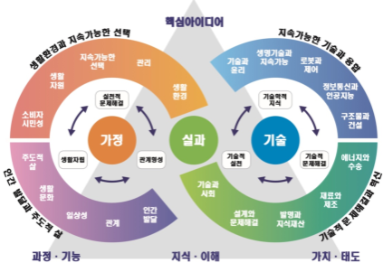

# 기술⋅가정

# 기술⋅가정

### 교육과정 설계의 개요

실과(기술⋅가정) 교육과정 설계는 교과 교육과정의 개정 방향인 ‘삶과 연계한 학습’, ‘학습 과정에 대한 성찰’을 지향하고 있다. 또한 ‘생태전환교육’, ‘민주시민교육’, ‘디지털⋅AI 소양 함양교육’이라는 주제가 실과(기술⋅가정)의 목표, 내용 체계, 성취기준의 각 내용에서 다루어지도록 하였다. 초⋅중학교 공통 교육과정으로서 실과(기술⋅가정)의 내용 영역은 ‘인간 발달과 주도적 삶’, ‘생활환경과 지속가능한 선택’, ‘기술적 문제해결과 혁신’, ‘지속가능한 기술과 융합’, ‘디지털 사회와 인공지능’으로 구성되어 있다.

실과(기술⋅가정) 교육과정의 내용 영역 중 ‘인간 발달과 주도적 삶’, ‘생활환경과 지속가능한 선택’은 ‘인간’과 ‘생활환경’이라는 교과 주제와 ‘자기주도성’과 ‘지속가능성’이라는 총론의 방향성을 고려하여 구성하였다. ‘인간 발달과 주도적 삶’ 영역에서는 나의 발달과 관계 형성을 목표로 자신과 타인을 이해하고 존중하면서 가정생활의 일상성을 인식하고 가족은 물론 생활문화공동체로서 함께 살아가기 위한 공동체 역량을 길러주고자 하였다. ‘생활환경과 지속가능한 선택’ 영역은 생활자원 관리와 환경과의 공존을 목표로 의식주 생활환경에서 발생할 수 있는 실천적인 문제를 정의하고, 문제 해결의 과정과 결과를 통찰하여 문제 해결 역량을 기르며, 자신의 생활환경 변화를 위해 요구되는 소비자 시민성과 자립역량을 기를 수 있도록 설계하였다. 즉 ‘인간 발달과 주도적 삶’ 영역은 ‘발달’과 ‘관계’라는 핵심 개념에, ‘생활환경과 지속가능한 선택’ 영역은 ‘관리’와 ‘선택’이라는 핵심 개념에 기반을 두었으며, 이를 근거로 하여 자신의 일상생활을 성찰하고 주도적 삶을 위한 행동 체계를 구축해 나갈 수 있도록 설계하였다.

실과(기술⋅가정) 교육과정의 내용 영역 중 ‘기술적 문제해결과 혁신’, ‘지속가능한 기술과 융합’에서는 기술학적 지식의 이해 능력, 기술적 문제해결능력, 기술적 실천 능력을 기술 교육과정 편성의 세 가지 교과 역량으로 설정하여 교과 본질적 특성이 반영되도록 하였다. ‘기술적 문제해결과 혁신’ 및 ‘지속 가능한 기술과 융합’ 영역은 기술적 소양과 문제해결이라는 교과 주제와 ‘창의 혁신’, ‘지속 가능’이라는 총론의 방향성을 고려하여 2개 영역으로 구성하였다. ‘기술적 문제해결과 혁신’ 영역에서는 기술에 대한 소양, 설계를 통한 문제 해결, 발명의 가치, 제조 및 수송기술을 핵심 개념으로 하였다. 이 영역에서는 기술의 본질에 대한 이해와 기술적 소양을 갖도록 하고, 제조와 수송기술 등의 문제를 창의적으로 해결하는 능력을 기르도록 하였다. ‘지속 가능한 기술과 융합’ 영역의 핵심 개념으로 구조물과 건설, 로봇과 제어, 정보통신과 인공지능, 지속가능한 생명기술, 기술과 윤리를 포함하였다. 이 영역에서는 건설, 정보통신, 생명기술 등의 문제를 융합적으로 해결하는 능력을 기르도록 설계하였다. 특히 초등학교 실과와 중학교 기술 영역 분야의 연계성을 강화하고, 최신의 미래 기술 동향을 지향하면서도 학습 내용이 적정하도록 교육과정을 설계하였다. [그림 1]은 실과(기술⋅가정) 교육과정과 총론과의 연관성, 교과 역량, 교과의 주요 개념 등을 도식으로 나타낸 것이다.

[그림 1] 실과(기술⋅가정) 교육과정의 영역별 핵심 개념 및 교과 역량

### 1. 성격 및 목표

가. 성격

실과(기술⋅가정)의 ‘인간 발달과 주도적 삶’, ‘생활환경과 지속가능한 선택’ 영역은 개인과 가족이 일상생활에서 가족은 물론 친구 및 이웃을 비롯한 다양한 수준의 생활환경과 건강한 관계를 형성하여 삶을 주도해 가는데 필요한 생활역량 함양을 지향한다. 최근의 예측 불가능한 사회 및 생태환경의 변화가 ‘좋은 삶’의 기초가 되는 일상생활을 위협하였지만, 오히려 자립적 생활인으로의 자기 관리와 매일의 일상을 공유하는 가족 및 생활환경과 건강한 관계 형성이 인간 삶의 행복의 기초임을 성찰하도록 했다. 이에 학습자가 자기와 타인에 대한 이해를 바탕으로 삶에서 발생하는 다양한 실천적 문제를 해결하며, 자립적 생활역량과 건강한 관계형성 역량을 함양하게 한다. 이를 위해 학습 과정에서 일상적인 의식주 생활 및 소비 생활을 통해 가족, 친구, 이웃과의 건강하고 친밀한 관계 형성, 실천적 문제해결 과정을 통한 건강한 발달 과정 경험 및 의식주 와 소비를 위한 생활자원을 관리하는데 필요한 실제 경험을 제공한다. 특히 매일의 일상생활에서 지속적인 선택을 통해 축적되는 삶을 영위하고, 그 결과가 학습자의 삶은 물론 가족과 친구, 이웃 및 공동체, 나아가 생태환경과의 관계에서 지속가능한 공존을 지향하도록 성찰할 수 있는 실천적 경험을 강조하여 제공한다.

또한 실과(기술⋅가정)의 ‘기술적 문제해결과 혁신’, ‘지속가능한 기술과 융합’ 영역은 인간의 혁신적인 활동과 관련된 기술에 대한 지식과 이해, 사고 과정과 기능, 추구하는 가치와 태도를 형성하여 기술적 소양을 갖추게 하고, 그 과정에서 기술적 문제해결에 대한 사고 발현 및 계발 역량 함량을 지향하고 있다. 또한, 기술학의 내용 요소에 해당하는 기술과 사회, 재료와 제조, 구조물과 건설, 에너지와 수송, 자동화와 정보통신, 생명과 의료 분야, 식량자원 등에 대한 지식을 설계, 생산, 유지, 평가하는 학습과정 및 기술적 문제해결과정의 경험을 제공한다. 기술 분야의 학습 경험은 학습 과정과 결과로 내재화하는 가치와 외현적으로 지향하고 성취하고자 하는 가치를 제공한다. 또한 ‘기술’은 학문 구조 측면에서 ‘기술학적 지식’, 교육 목표 측면에서 ‘기술적 소양’, 교육의 방법 측면에서 ‘기술적 문제해결’, 그리고 진로 교육의 측면에서 ‘기술 진로 탐색’의 성격을 가진다. 아울러 실과의 ‘디지털 사회와 인공지능’ 영역은 중학교 1\~3학년 정보 교과와 연계되어 변화하는 세상을 인식하고 컴퓨팅 사고를 바탕으로 인공지능을 활용한 실생활 문제 해결 역량 함양을 지향한다.

나. 목표

실과(기술⋅가정)에서는 교과 지식, 수행 역량, 가치 및 태도를 함양하여 생활 속 문제를 탐구하고 문제 해결의 결과가 개인과 사회에 미치는 영향을 인식하여, 가정생활, 기술 및 정보 소양을 바탕으로 주도적인 삶을 영위할 수 있도록 한다.

1. 자기 및 타인 이해의 건강한 발달과 상호 존중 및 돌봄의 태도를 바탕으로 긍정적인 자아 정체성과 대인 관계를 형성하며, 개인의 발달과 삶의 요구를 충족시킬 수 있는 건강한 의식주 생활을 주도적으로 영위하기 위해 필요한 자립적 생활역량을 함양한다.

2. 변화하는 생활환경에서 개인과 가족의 삶에 적용할 수 있는 지식, 수행 능력, 태도를 기르고, 생활 자원을 삶의 요구와 필요에 맞게 합리적으로 활용하며, 공동체와 생태환경을 고려한 책임 있는 행동을 통해 나와 가족, 공동체 삶의 질을 향상시키는 생활 역량을 기른다.

3. 기술의 개념과 특성, 기술적 문제 해결, 발명에 대한 이해를 통하여 기술에 대한 올바른 가치를 인식하고 협력적 태도를 바탕으로 창의적이고 혁신적인 기술적 실천을 통해 기술 소양을 기른다.

4. 재료와 제조, 구조물과 건설, 에너지와 수송, 로봇과 제어, 인공지능과 정보통신, 생명과 의료, 식량자원 분야와 관련된 기술적 문제 해결 능력을 기르며, 융합적 사고와 체험을 바탕으로 기술의 세계와 활동을 바르게 이해하고 진로를 탐색한다.

### 2. 내용 체계 및 성취기준

가. 내용 체계

(1) 인간 발달과 주도적 삶

<table>
<tr><th>핵심 아이디어</th><th colspan="2">⋅인간 발달에 대한 이해는 자립적인 삶을 이끌고 타인과의 건강한 관계를 형성하는 기초가 된다. ⋅일상에서 직면하는 문제에 대처할 수 있는 역량은 개인 및 가족의 긍정적 발달과 행복한 일상의 삶을 주도적으로 이끌 수 있게 한다. ⋅일상에서 직면하는 상호 존중과 협력적 소통에 기반한 관계맺음의 경험은 건강한 대인 관계를 확장하는 밑거름이 된다. ⋅가정일과 생활 습관은 변화하는 일상에서 개인 및 가족의 요구와 문제를 해결해 나갈 수 있게 하면서 생활방식과 진로를 스스로 개척하고 성장하기 위한 바탕이 된다.</th></tr>
<tr><td rowspan="3">구분 범주</td><td colspan="2">내용 요소</td></tr>
<tr><td>초등학교</td><td>중학교</td></tr>
<tr><td>5~6학년</td><td>1~3학년</td></tr>
<tr><td>지식⋅이해</td><td>⋅아동기 발달과 자기이해 ⋅자립적 일상생활 ⋅균형 잡힌 식사 ⋅옷의 기능과 옷차림 ⋅가정생활과 가정일 ⋅진로 발달과 직업</td><td>⋅청소년기 발달과 자아 정체성 ⋅영양과 청소년의 식생활 ⋅자기이미지와 표현 ⋅청소년 문제와 적응유연성 ⋅전환기 탐색 및 진로 설계 ⋅가족의 다양성과 변화 ⋅가족 간의 갈등과 소통 ⋅뉴노멀사회에서의 가족문화 ⋅또래와 세대 관계 ⋅상호 존중 관계의 형성과 역할수용</td></tr>
<tr><td>과정⋅기능</td><td>⋅건강한 발달을 위한 자기 관리 방법 탐색하기 ⋅자립적 일상생활에 필요한 조건 살펴보기 ⋅가족원의 다양한 요구 파악하기 ⋅바람직한 식습관 형성하기 ⋅건강하고 적절한 옷차림 파악하기 ⋅가정생활을 유지하는 가정일의 종류 살펴보기 ⋅가정일 수행에 참여하기</td><td>⋅주제에 대한 배경과 맥락 파악하기 ⋅문제 해결의 목표 설정하기 ⋅결과를 고려한 최선의 방안 선택하기 ⋅청소년기 발달 특징을 자신에게 적용하기 ⋅청소년기 건강한 자아 정체성 형성하기 ⋅발달의 특성에 따른 의생활과 식생활 실천하기 ⋅청소년의 문제 상황 대처하기 ⋅자기 이해에 기반한 진로 탐색과 설계하기 ⋅시민적 역량과 관련된 가족의 역할 탐색하기 ⋅역할 기대를 고려하여 문제 해결 방안 탐색하기 ⋅의사소통과 갈등관리의 방법 탐색하기 ⋅또래 및 가족과 친밀한 관계 형성하기</td></tr>
<tr><td>가치⋅태도</td><td>⋅아동기 발달에 대한 긍정적인 수용 ⋅일상생활 속 올바른 생활습관과 예절을 실천하는 태도 ⋅가족 간 배려와 돌봄의 가치 ⋅협력적 소통에 기반한 역할 분담의 가치 수용 ⋅일과 노동의 가치 ⋅진로를 주도적으로 탐색하는 태도</td><td>⋅청소년기 발달에 대한 긍정적인 수용 ⋅성적 의사 결정의 상호 존중과 성인지 감수성의 함양 ⋅성폭력과 가정폭력에 대한 인식 및 시민적 행동 내면화 ⋅다양한 생활 방식 및 타인에 대한 존중과 배려 ⋅가족원으로서 협력과 공감의 태도 ⋅가족 친화적 가치에 대한 존중 ⋅진로 설계의 중요성 내면화 ⋅다름을 존중하고 더불어 살아가는 공동체 가치 실현 ⋅일상생활에서 자기주도적 태도</td></tr>
</table>

(2) 생활환경과 지속가능한 선택

<table>
<tr><th>핵심 아이디어</th><th colspan="2">⋅삶의 욕구와 문제를 해결하는 과정에서 인간이 경험하는 생활자원의 제한성은 개인과 가족의 관리능력을 요구한다. ⋅생활의 기본 조건으로서 의식주 생활의 수행능력을 갖추는 일은 창의적이고 가치 있는 삶을 설계하고 영위할 수 있는 기초가 된다. ⋅변화하는 생활환경을 안전하고 건강하게 유지하고자 하는 개인과 가족의 책임 있는 행동을 통해 소비자 시민성을 함양할 수 있다. ⋅일상생활에서 지속가능한 선택을 지향하는 것은 현재 생활공동체와의 공존과 함께 미래 세대의 건강한 삶을 위한 책임 있는 행동이다.</th></tr>
<tr><td rowspan="3">구분 범주</td><td colspan="2">내용 요소</td></tr>
<tr><td>초등학교</td><td>중학교</td></tr>
<tr><td>5~6학년</td><td>1~3학년</td></tr>
<tr><td>지식⋅이해</td><td>⋅생활자원의 특징 ⋅생활자원의 보관과 활용 ⋅식재료의 생산과 선택 ⋅음식의 마련과 섭취 ⋅옷이나 생활용품의 구성 ⋅생활공간과 정리정돈 ⋅지속가능한 의식주생활</td><td>⋅생활자원의 순환과정 ⋅식품선택과 식생활 안전 ⋅식사계획과 조리원리 ⋅의복재료와 관리행동 ⋅의복 마련계획과 업사이클링 ⋅주거환경과 주거문화 ⋅주거 공간 구성과 계획 ⋅소비자 의사 결정과 책임 ⋅디지털 생활환경과 자원관리</td></tr>
<tr><td>과정⋅기능</td><td>⋅생활자원의 사용가치를 높이는 방법 탐색하기 ⋅합리적인 관리 방법 실천하기 ⋅자신의 선택이 공동체의 삶과 환경에 미치는 영향 설명하기 ⋅음식을 마련하는 과정 체험하기 ⋅생활용품을 만드는 과정 경험하기 ⋅생활 속 의생활 문제 해결하기 ⋅생활공간을 청결하게 하는 과정 경험하기 ⋅일상생활에서의 지속가능한 행동을 계획하여 실천하기</td><td>⋅생활 및 습관적 행동 관찰하기 ⋅기대하는 목표 설정하기 ⋅변화를 위한 기회 탐색하기 ⋅자신의 행동이 미치는 영향을 성찰하기 ⋅지속가능성을 고려하여 대안 결정하기 ⋅생활자원의 생산과 폐기 과정 탐색하기 ⋅다양한 변인을 고려하여 식사를 계획하고 조리하기 ⋅의생활에 업사이클링 활용하기 ⋅더불어 사는 주거문화 실천하기 ⋅소비자문제 탐색 및 해결방안 적용하기</td></tr>
<tr><td>가치⋅태도</td><td>⋅생활자원을 소중하게 여기는 태도 ⋅함께하는 식사의 즐거움 ⋅식사 예절을 실천하는 태도 ⋅직접 만들어 쓰기의 가치와 창의적 태도 ⋅제작 과정에서 절차적 사고를 중시하는 태도 ⋅안전한 생활을 실천하는 태도 ⋅쾌적한 생활공간 유지를 위한 노력 ⋅나눔의 봉사활동과 기부문화의 존중</td><td>⋅일상생활 속 선택에 대한 책임과 성찰 ⋅생태 지향적 삶의 태도 ⋅생활자원 관리에서 지속가능성을 고려하는 태도 ⋅의식주 생활에서 건강을 추구하는 태도 ⋅책임 있는 소비자로서의 신념 ⋅제작 과정에서 창의적이고 성취지향적인 태도 ⋅안전한 생활환경을 위한 예방적 태도 ⋅창의적인 의식주 소비생활을 실천하는 태도 ⋅변화와 혁신에 대한 개방적 태도</td></tr>
</table>

(3) 기술적 문제해결과 혁신

<table>
<tr><th>핵심 아이디어</th><th colspan="2">⋅기술은 인간의 필요와 욕구를 충족하기 위한 혁신적인 문제 해결 활동으로 인류 문명을 주도하고 사회⋅문화⋅경제 등에 바람직한 영향을 끼치도록 활용되어야 한다. ⋅인간은 기술적 문제 해결 과정을 통해 발명 문제를 창의적으로 해결하며, 지식재산에 대한 보호 및 발명과 혁신은 기술의 가치를 높인다. ⋅창의적인 제품의 개발은 기술적 문제 해결 과정을 통해 이루어지며, 제품을 생산하기 위해서는 설계 활동 및 다양한 재료와 도구의 활용이 필요하다. ⋅친환경 에너지를 활용한 수송 수단은 자원의 고갈과 환경 문제를 극복하는 대안이며, 혁신적 수송 수단과 물류 체제 구축은 제품의 효율적인 수송을 가능하게 한다.</th></tr>
<tr><td rowspan="3">구분 범주</td><td colspan="2">내용 요소</td></tr>
<tr><td>초등학교</td><td>중학교</td></tr>
<tr><td>5~6학년</td><td>1~3학년</td></tr>
<tr><td>지식⋅이해</td><td>⋅발명의 의미와 발명품 ⋅기술적 문제 해결과 발명사고기법 ⋅발명과 특허의 개념 ⋅지식재산권의 중요성 ⋅수송의 의미와 수송 수단의 발달 ⋅수송 수단의 구성 요소</td><td>⋅기술의 이해와 미래 사회 ⋅기술의 활용 ⋅기술적 문제 해결 ⋅발명과 지식재산 ⋅재료의 종류와 활용 ⋅제품의 설계와 제작 ⋅친환경 에너지 자원 ⋅수송 수단과 물류</td></tr>
<tr><td>과정⋅기능</td><td>⋅생활 속 기술적 문제 확인하기 ⋅창의적인 제품 구상하기 ⋅발명 제품의 설계와 제작하기 ⋅발명품의 특허 정보 검색하기 ⋅다양한 수송 수단 탐색하기 ⋅친환경 수송 수단의 설계와 제작하기</td><td>⋅기술의 역사 탐구와 미래 예측하기 ⋅기술적 문제 확인하기 ⋅기술적 문제해결을 위한 정보 수집하기 ⋅확산적 사고와 수렴적 사고하기 ⋅기술적 해결 방안 탐색 및 선정하기 ⋅아이디어 시각화하기 ⋅재료 및 도구의 선택과 활용하기 ⋅설계 및 도면 작성하기 ⋅시제품 또는 모형 제작하기 ⋅기술적 문제해결 평가 및 개선하기 ⋅기술 사례 조사하기 ⋅기술 영향 평가하기</td></tr>
<tr><td>가치⋅태도</td><td>⋅발명과 기술에 대한 관심과 흥미 ⋅기술에 대한 가치 인식 ⋅발명 아이디어 발상의 실천적 태도 ⋅지식재산보호에 대한 인식 ⋅미래 수송 수단에 대한 관심</td><td>⋅기술에 대한 가치와 중요성 인식 ⋅기술적 문제 해결과 실천적 태도 ⋅지식재산을 보호하는 태도 ⋅창조적 활동에 대한 자신감 ⋅기술적 문제를 해결하기 위한 협력, 공감, 의사소통 ⋅기술의 영향을 고려한 사회 참여 ⋅진로 탐색과 자아실현 ⋅기술 활동에 안전을 고려하는 태도</td></tr>
</table>

(4) 지속가능한 기술과 융합

<table>
<tr><th>핵심 아이디어</th><th colspan="2">⋅건설기술은 쾌적하고 편리하며 안전한 생활을 위한 다양한 설계와 시공 및 유지관리 방법을 적용하고 있으며, 다른 산업의 수행을 위한 기반 요소로서 가치를 가진다. ⋅로봇은 기계요소, 전기전자 등의 하드웨어와 이를 제어하는 소프트웨어로 구성되며, 여러 가지 기술과 지식이 적용된 첨단 융합기술의 산물로서 사회 각 분야에 활용된다. ⋅정보통신 기술의 발달은 시공간 극복을 통해 정보와 문화의 교류 및 세계화에 기여해왔으며, 다양한 기술과 융합하여 인간을 새로운 영역으로 이끈다. ⋅생명기술은 다양한 기술과 융합하여 발달하고 있으며, 식량자원의 활용과 농업의 순환체험은 지속가능한 미래생활을 위한 기초가 된다.</th></tr>
<tr><td rowspan="3">구분 범주</td><td colspan="2">내용 요소</td></tr>
<tr><td>초등학교</td><td>중학교</td></tr>
<tr><td>5~6학년</td><td>1~3학년</td></tr>
<tr><td>지식⋅이해</td><td>⋅건설기술의 개념과 친환경 구조물 ⋅디지털 기술의 특징과 디지털 콘텐츠의 종류 ⋅로봇의 개념과 작동 원리 ⋅로봇 융합기술의 이해 ⋅생활 속 동식물의 이해 ⋅동식물 자원의 분류 ⋅동식물 자원의 친환경 농업 ⋅미래생활과 연관된 농업활동 ⋅농업과 농촌의 다원적인 역할</td><td>⋅건축 구조물과 사회기반시설 ⋅구조물의 계획, 설계, 시공 및 유지관리 ⋅전기전자 부품과 회로 ⋅정보통신과 인공지능 기술 ⋅기계요소와 운동 ⋅로봇과 제어 ⋅생명기술과 지속가능 ⋅기술의 융합과 미래</td></tr>
<tr><td>과정⋅기능</td><td>⋅생활 속 건설 구조물 탐색과 체험하기 ⋅디지털 콘텐츠의 제작과 공유하기 ⋅간단한 로봇의 조립과 작동시키기 ⋅로봇의 동작에 코딩 프로그램 적용하기 ⋅융합적 사고하기 ⋅동식물과 관련된 생명기술 탐색하기 ⋅동식물을 기르고 가꾸기 ⋅생활 속 농업활동 체험하기</td><td>⋅시공 및 제작하기 ⋅도구의 선택과 이용하기 ⋅부품 활용과 회로 구성하기 ⋅기술적 문제 해결하기 ⋅기술 사례 조사 및 활용하기 ⋅융합적 사고하기 ⋅다양한 기술 비교 분석하기 ⋅미래 기술 예측하기</td></tr>
<tr><td>가치⋅태도</td><td>⋅건설기술에 대한 가치 인식 ⋅로봇에 대한 관심과 흥미 ⋅건전한 사이버 공간의 활용 태도 ⋅동식물에 대한 생태존중감을 갖는 태도 ⋅지속가능한 농업의 순환성과 중요성 인식 ⋅농업에 대한 관심과 흥미 ⋅농산업에 대한 올바른 진로관을 갖는 태도</td><td>⋅기술에 대한 가치와 중요성 인식 ⋅기술적 문제 해결에 대한 관심, 공감, 도전 ⋅창조적 활동에 대한 자신감 ⋅융합기술의 중요성과 가치 인식 ⋅진로 탐색과 자아실현 ⋅생명 존중과 윤리적 태도 ⋅기술 활동에 안전을 고려하는 태도</td></tr>
</table>

나. 성취기준

[중학교 기술⋅가정]

(1) 인간 발달과 주도적 삶

[9기가01-01] 자아 존중감을 향상시키고 긍정적인 자아 정체성을 형성하기 위해 청소년기의 발달 특징을 자신의 발달 특징과 연결 지어 자신을 총체적으로 이해한다.
[9기가01-02] 의생활, 식생활이 청소년기 성장과 건강에 미치는 영향을 탐색하고 성장과 건강을 위해 바람직한 의생활과 식생활의 실천 방안을 탐색하여 이를 실천한다.
[9기가01-03] 건강과 성장을 위한 청소년기 영양의 중요성을 이해하여 자신의 식생활을 평가하고, 식생활 문제를 개선하여 건강한 식생활을 실천한다.
[9기가01-04] 의복디자인 요소를 고려한 자기이미지에 맞는 옷차림으로 자신을 긍정적으로 표현한다.
[9기가01-05] 청소년기의 건강한 발달을 위협하는 스트레스, 분노, 우울 등의 여러 가지 행동 및 심리 문제의 원인을 분석하고, 적응 유연성을 기를 수 있는 다양한 예방 및 해결방안을 탐색하여 적용한다.
[9기가01-06] 사회변화로 증가하는 여러 가지 청소년 중독의 유형을 탐색하여 이를 예방하고 대응할 수 있는 방안을 제안한다.
[9기가01-07] 자기 이해를 기반으로 전 생애적 관점에서 진로 설계의 중요성을 인식하고, 자기 적성에 맞는 진로를 설계한다.
[9기가01-08] 성적 자기 결정권의 중요성을 이해하고, 성인지 감수성과 건강한 성 가치관을 함양하여 상호 존중의 관계를 실천할 수 있는 방안을 탐색한다.
[9기가01-09] 일상생활 및 가상공간에서 만나는 또래와 건강한 관계를 형성하고, 다양한 주변인들과 친밀한 세대 간 관계를 형성하는 방안을 탐색하여 실천한다.
[9기가01-10] 다양한 현대 가족에 내재된 가족생활의 보편성과 고유한 가치를 존중하는 동시에 가족에 대한 유연한 태도를 길러, 뉴노멀 사회에서의 새로운 가족문화를 탐색한다.
[9기가01-11] 대인 관계에서 발생하는 갈등의 원인과 배경을 분석하고, 효과적인 의사소통을 통해 갈등을 해결하는 방안을 탐색하여 이를 적용한다.
[9기가01-12] 성폭력과 가정폭력의 사회⋅구조적인 원인과 영향을 분석하고, 다양한 문제 상황을 중심으로 이를 대처하고 지원하는 방안을 탐색한다.

(가) 성취기준 해설

• [9기가01-02] 이 성취기준은 의생활과 식생활을 어떻게 영위하는지에 따라 청소년기 발달에 차이가 발생할 수 있음을 이해하고, 건강한 생활을 영위하고 청소년기의 긍정적인 발달을 이끄는 방안을 탐색하여 실천하도록 한다.

• [9기가01-04] 이 성취기준은 자기 이미지에 맞는 옷차림을 하는 것이 자아를 표현하는 효과적인 수단이 될 수 있음을 인식하고, 의복디자인 요소를 고려한 옷차림으로 자신을 긍정적으로 표현할 수 있도록 한다. 또한 한복에서 자신에게 맞는 디자인 요소를 찾아보는 활동을 추가하여 진행할 수 있다.

• [9기가01-06] 이 성취기준은 디지털 생활환경의 확산으로 나타나는 중독 문제(게임, 스마트폰, 도박 등)와 청소년 건강과 관련된 중독 문제(니코틴, 카페인, 약물 등)의 발생 원인과 영향을 분석하고, 이를 예방 및 해결하는 방안을 제안하도록 한다.

• [9기가01-08] 이 성취기준은 이차 성징의 변화를 경험하는 중학교 학습자들이 남성과 여성의 서로 다른 성에 대해 이해하여 부정확한 지식이나 편견을 갖지 않도록 하며, 성인지 감수성을 바탕으로 자신의 뜻을 분명히 하는 주체적이고 책임감 있는 태도를 길러 자기 자신과 상대방을 보호하며 존중할 수 있는 성적 자기 결정권에 대한 이해를 함양하도록 한다. 이 권리는 왜곡된 성 관련 정보와 위험한 환경으로부터 자신을 보호할 수 있는 근거가 될 수 있으며, 다른 의미로 해석되지 않도록 유의한다.

• [9기가01-09] 이 성취기준은 자신을 둘러싼 관계에는 횡적(또래) 관계뿐 아니라 종적(다양한 세대) 관계도 있음을 인식하고, 다양한 주변인들과 건강하고 친밀한 관계를 형성하는 방안을 실천하도록 한다. 이때, 현실 세계에서 교류하는 타인뿐만 아니라 확장된 생활환경(사회 관계망 서비스(SNS), 게임, 메타버스와 같은 가상세계)에서 교류하는 타인도 함께 다룬다. 인터넷상의 익명성을 올바르게 활용할 수 있는 방안과 인터넷 언어폭력, 사이버 폭력의 심각성을 알아보는 활동을 추가하여 진행할 수 있다.

• [9기가01-10] 이 성취기준은 사회 변화로 인해 가족 유형의 다양성이 증가하고 있지만, 이러한 다양성을 관통하는 가족이 지닌 고유의 가치를 인식하도록 한다. 또한 다양한 가족에 대한 유연한 태도와 더불어 살아가는 공동체의 가치에 대해 탐색하도록 한다. 나아가 테크놀로지와 미디어 발달로 인해 발생한 변화에 적합한 새로운 가족문화를 탐색하여 실천할 수 있도록 한다.

• [9기가01-11] 이 성취기준은 갈등을 원만하게 해결하기 위한 의사소통능력의 필요성을 인식하고, 효과적 의사소통 방법의 의미와 원리를 파악한다. 또한 객관적 관점에서 갈등을 조망하여 타인과의 갈등을 해결하고 원만한 대인 관계를 형성할 수 있도록 한다.

(나) 성취기준 적용 시 고려 사항

• 발달은 신체적 영역 외에도 인지적, 정서적, 사회적 영역이 있고, 이 영역들이 모두 균형 있게 발달해야 건강한 성장임을 인식하도록 하고, 발달의 개인차가 있음을 인식하게 하여 자신과 다른 친구들의 발달을 모두 존중하도록 지도한다.

• 의생활과 청소년의 발달 간의 상관관계를 다룰 때 학생들이 의복의 브랜드나 가격에 초점을 맞추지 않도록 주의하여 지도한다. 개성 표현 수단으로서 옷차림의 의미, 자신에게 어울리는 옷차림이 자아 개념에 미치는 긍정적 효과 등을 생각해 볼 수 있도록 수업을 진행한다.

• 청소년의 스트레스, 분노 및 우울과 같은 행동 심리 문제와 관련하여 스스로 경험한 사례를 중심으로 원인을 분석해 보고, 자신에게 효과적인 해결방안을 찾아 실천해보도록 지도한다. 이때, 자신이 찾은 원인과 해결책을 모둠 활동을 통해 공유하여 관점을 확장할 수 있는 기회를 제공하고, 이러한 문제는 누구나 겪을 수 있는 것이므로 적응 유연성을 길러 바람직한 방법으로 조절해 나가는 것이 중요함을 인식할 수 있도록 한다.

• 청소년 중독과 관련하여 체크리스트 등을 통해 현재 자신의 상황을 객관적으로 확인해보고, 각종 중독 문제가 청소년기에 특히 치명적인 이유를 스스로 성찰해볼 수 있게 한다. 개인적 해결책을 찾는 것뿐만 아니라 중독 문제를 해결하는 데 도움을 주는 외부 기관 등의 정보를 제시하여 필요한 경우 활용할 수 있도록 돕는다.

• 인터넷 등을 통해 얻을 수 있는 성과 관련한 부정확한 성 지식이나 편견에 대해 스스로 성찰할 기회를 제공하고, 자신과 타인의 몸을 아끼고 존중하는 태도의 중요성을 인식할 수 있게 한다. 더불어 미디어 및 광고 비판적으로 분석하기 등의 활동을 통해 디지털 감수성을 기르고 올바른 성인지 감수성과 건강한 성 가치관을 함양할 수 있도록 한다.

• 자신을 둘러싼 횡적 종적 관계에서 자주 발생하는 문제 상황을 선정한 후 토의⋅토론하여 비판적 사고력, 의사소통 능력, 관계 형성 능력, 문제 해결 능력 등을 함양하는 데 중점을 둔다.

• 성폭력, 가정폭력과 관련하여 모둠 활동을 통해 신문, 뉴스, 인터넷 등 미디어로 접할 수 있는 사례들을 분석하여 개인 및 사회 구조적인 원인을 파악하고, 최선의 대처방안을 제시하고 평가하도록 한다. 특히 이러한 활동을 통해 가족, 이웃에 도움을 주거나 도움을 요청하는 방안을 탐색할 뿐만 아니라 적극적, 자발적으로 행동하는 힘을 기르는 데 중점을 둔다.

(2) 생활환경과 지속가능한 선택

[9기가02-01] 생활자원의 종류와 특성 및 순환과정을 이해하고, 의식주 자원관리의 중요성을 인식한다.
[9기가02-02] 한국인 영양소 섭취기준과 식사구성안을 바탕으로 균형 잡힌 식사를 계획한다.
[9기가02-03] 건강과 환경을 고려한 식품의 선택, 관리, 보관 방법을 탐색하여 실생활에 적용한다.
[9기가02-04] 개인과 가족의 영양 요구와 지속가능성을 충족하는 식사를 계획하고 조리한다.
[9기가02-05] 의복 재료의 특성을 이해하고 건강과 환경을 고려한 의복의 세탁과 관리 방안을 탐색하여 실천한다.
[9기가02-06] 지속가능성을 고려하여 의복 마련 계획을 세우고, 이를 창의적이고 친환경적인 의생활에 적용한다.
[9기가02-07] 주거의 의미와 가치가 변화함에 따라 나타나는 다양한 생활 양식을 탐색하고, 더불어 살아가는 주거 문화를 실천한다.
[9기가02-08] 생활공간으로서 주거환경의 조건을 분석하고, 쾌적하고 안전한 주거 관리 방안을 탐색하여 실생활에 적용한다.
[9기가02-09] 효율적인 주거 공간 구성 방안을 탐색하여 자신의 생활에 적합한 주거 공간 구성에 활용한다.
[9기가02-10] 의식주 생활자원의 생산과 폐기과정을 탐색하고, 일상생활에서 의식주 생활자원을 선택한 과정과 그 결과를 성찰한다.
[9기가02-11] 급변하는 소비환경의 변화를 이해하고, 다양한 소비자 정보를 비판적으로 분석하여 자신의 소비생활에 활용한다.
[9기가02-12] 청소년 소비자의 특성을 이해하고 소비자 의사 결정 과정을 통한 합리적인 소비생활을 실천한다.
[9기가02-13] 책임 있는 소비자로서 소비자의 권리와 역할을 인식하고, 소비생활에서 발생하는 소비자 문제와 해결 방안을 탐색하여 소비생활에 적용한다.
[9기가02-14] 디지털 생활환경으로 나타난 일상생활의 혁신과 변화를 비판적으로 분석한 결과를 삶의 질 향상에 활용할 수 있는 방안을 탐색하여 제안한다.

(가) 성취기준 해설

• [9기가02-01] 이 성취기준은 생활자원을 인적⋅물적 자원으로 구분하고 일상생활을 영위하는데 필수적인 의식주 자원이 물적 자원에 포함됨을 이해한다. 점차 심각해지는 기후위기에 대응하여 인간과 자연이 공존하기 위해서는 순환 가능성을 고려한 의식주 자원관리가 중요함을 인식할 수 있게 한다.

• [9기가02-04] 이 성취기준은 식사 계획 시 개인과 가족의 영양 및 기호 등을 고려하는 것뿐만 아니라 제철 식품, 로컬 푸드, 대체식품, 탄소배출, 음식물 쓰레기 감량 등의 지속가능성을 고려하여 식품을 선택하고, 조리 시에도 건강 및 안전을 고려한 조리법을 적용하도록 한다.

• [9기가02-06] 이 성취기준은 패스트 패션과 같은 현대 사회의 의생활 문제를 분석하여 의복 구매 시 디자인, 가격 등의 개인적 요구뿐 아니라 자신의 선택이 사회, 환경에 미치는 영향까지도 고려해야 함을 성찰한다. 나아가 3R(Reduce, Reuse, Re(Up)cycle)을 일상생활에서 실천하는 방안을 탐색하여 실천하도록 한다.

• [9기가02-07] 이 성취기준은 주거의 의미와 기능을 살펴보고, 현대 사회 주거 가치와 인식 변화에 따른 다양한 주생활 양식을 탐색한다. 또한 대면 교류가 줄어들고 있는 현실에서 더불어 사는 주거 문화의 중요성을 인식하고 실천 방안을 탐색하여 공동체 가치 함양 및 역량이 강화되도록 한다.

• [9기가02-08] 이 성취기준은 열, 빛, 공기, 소음이 인간에게 미치는 영향을 이해하여 쾌적한 주거환경을 조성하기 위한 능력을 기른다. 특히 디지털 환경 확대에 따른 인공지능 기반 주거 서비스(안전성, 쾌적성, 편의성, 유지 및 관리 등)의 쾌적성과 안전성에 대해 분석해 보도록 한다. 또한 주생활에서 탄소중립을 실천하기 위해 가정생활에서의 탄소발자국 줄이기 활동 등을 진행할 수 있다.

• [9기가02-10] 이 성취기준은 의식주 생활자원의 순환과정에 초점을 두어 그 일생을 추론하고, 자신과 가족의 선택이 미치는 영향을 실천적 추론 등의 방법을 통해 성찰한다.

• [9기가02-11] 이 성취기준은 디지털 소비환경으로 변화함에 따라 무분별하게 쏟아지는 사회 관계망 광고, 추적 광고, 맞춤형 광고 등의 소비자 정보를 비판적으로 분석하여 문제점을 인식한다. 신유형 광고와 중립적 소비자 정보를 구분하는 활동을 통해 미디어 리터러시 역량을 함양하고, 유용한 소비자 정보를 선별하여 자신의 소비생활에 가치 있게 활용할 수 있도록 지도한다.

• [9기가02-13] 이 성취기준은 소비자 문제와 관련된 사회적 현안을 선정하여 소비자 문제의 발생 원인을 파악하고 적합한 문제 해결 방안을 선택하고 실천하여, 비판적 사고능력을 기르고 적극적인 소비자 시민으로서의 사회적 역할을 탐색해 보도록 한다.

• [9기가02-14] 이 성취기준은 디지털 생활환경으로 변화함에 따라 의식주 생활에 새롭게 등장한 변화를 찾아 이것이 우리 삶에 미친 긍정적 영향과 부작용을 모두 살펴보고, 이를 삶의 질 향상에 활용할 수 있는 방안을 탐색하여 제안하도록 한다.

(나) 성취기준 적용 시 고려 사항

• 생활자원 관리와 관련하여 기후위기 사례 탐구 활동을 통해 의식주 자원관리의 결과가 기후위기와 관련 있음을 분석할 수 있다. 일상생활 속 작은 선택들이 누적되어 현재의 결과를 초래하였음을 강조하여, 순환과정을 고려한 의식주 자원관리가 중요함을 인식할 수 있도록 한다.

• 식품의 선택, 관리, 보관과 관련하여 평소 자신이 즐겨 먹는 식품의 선택, 관리, 보관 방법을 조사하여 실생활에 적용해 보는 과정을 통해 교실 속 배움을 삶과 연결한다. 가공식품 속에 들어있는 원재료, 식품첨가물, 영양성분에 대한 정보 등을 제공하는 앱을 활용하면 광범위한 식품을 체계적으로 비교⋅분석할 수 있으며, 이러한 과정을 통해 ‘식품 문해력(food literacy)’을 함양하여 건강한 식생활을 영위할 수 있도록 한다.

• 지속가능성을 고려한 식사 계획 및 조리와 관련하여 과학, 사회, 도덕, 국어 등의 교과와 협업하여 융합 수업(주제 중심 프로젝트 수업)을 진행할 수 있다. 예를 들어, 채식을 주제로 하는 융합 수업에서 가정과는 원재료, 식품첨가물, 영양성분에 대한 분석 및 조리법 개발, 과학과는 육식과 기후의 관계 분석, 사회과는 육식과 관련된 세계 분쟁 조사, 도덕과는 음식에 대한 윤리적 성찰 활동, 국어과는 자신의 식생활을 돌아보는 글쓰기 등을 진행한다면 실제적 문제를 해결하는데 필요한 문제 해결력, 비판적 사고 능력, 창의적 사고력 함양에 도움이 될 것이다.

• 주생활 부분에서는 기술 영역과 협업하여 융합 수업을 진행할 수 있다. 예를 들어, 공간의 쾌적성이 향상될 수 있는 제품 개발 아이디어 제안하기, 메타버스를 활용한 친환경 주거단지 만들기 등의 주제통합 프로젝트를 진행하여 디지털 환경과 접목된 다양한 삶을 경험할 수 있도록 한다.

• 의생활 부분에서는 기술 영역 및 미술 등의 교과와 협업하여 3D 프린팅, 폐의류를 이용한 생활소품 디자인 등을 실습하여 지속가능한 의생활 실천 방안을 탐색할 수 있도록 한다.

• 의식주 생활자원의 생산 및 폐기과정 추론과 관련하여 학생 개개인별로 자신이 가장 관심 있는 주제를 하나 선택하여 그 일생을 추적 조사하는 프로젝트 수업을 진행할 수 있다. 이때 토의⋅토론, 보고서 발표, 논술 등 학생 중심 교수⋅학습 방법을 활용하도록 한다.

• 소비생활 부분은 실천적 문제해결 과정을 통해 문제점이 무엇인지 정의하고 대안을 모색한 후, 건강한 광고 만들기 디지털 캠페인을 진행하는 등의 실천으로 이어지게 지도할 수 있다.

(3) 기술적 문제해결과 혁신

[9기가03-01] 기술의 의미와 특성을 이해하고 기술의 발달에 따른 사회의 변화를 파악하며, 미래의 기술과 사회의 변화를 평가하고 예측함으로써 기술에 대한 가치를 인식한다.
[9기가03-02] 기술의 표준화, 적정 기술과 같은 기술 활용 사례를 탐구하고, 기술이 사회에 미치는 영향을 바르게 인식하여 기술 혁신과 사회 발전에 참여하는 태도를 갖는다.
[9기가03-03] 기술적 문제 해결 과정의 이해를 바탕으로 문제를 확인하고, 정보를 수집하며, 확산적 사고와 수렴적 사고를 통해 해결방안을 탐색하고 대안을 선정한다.
[9기가03-04] 기술적 문제 해결 방안을 시각화하고 도면을 작성하며, 올바른 도구를 선택하여 시제품 또는 모형을 제작 및 평가하는 과정에서 협업 능력, 공감 능력과 의사소통 능력을 기른다.
[9기가03-05] 발명의 개념을 이해하고, 발명 문제 해결 과정을 바탕으로 발명 활동을 체험하여 창조에 대한 자신감을 갖고 발명이 사회에 미친 영향과 가치를 인식한다.
[9기가03-06] 지식재산권의 종류와 특징을 이해하고, 지식재산과 관련한 다양한 사례 조사 및 체험을 통해 지식재산권의 창출, 보호, 활용을 이해하고 실천한다.
[9기가03-07] 재료의 종류와 특성을 이해하며, 목적에 맞는 재료를 선택하고, 안전한 가공 방법을 실천한다.
[9기가03-08] 설계의 가치와 필요성을 인식하고, 제도의 기본 통칙에 따라 도면을 작성한다.
[9기가03-09] 제품의 제작 순서를 이해하고 올바른 도구를 선택하여 제품을 안전하게 제작하고 평가한다.
[9기가03-10] 친환경 에너지 자원의 특성을 이해하고, 종류와 활용 사례를 조사하여 친환경 에너지 개발의 중요성을 인식한다.
[9기가03-11] 에너지와 관련된 문제를 발견하고 창의적인 해결방안을 탐색하여 실현하고 평가한다.
[9기가03-12] 다양한 수송 수단과 물류 체제를 이해하고 발달과정 및 특징과 혁신적인 활용 사례를 조사하여 수송 분야의 발달을 전망한다.
[9기가03-13] 수송 수단 및 물류 체제와 관련된 문제를 이해하고 해결방안을 탐색하여 실현하고 평가한다.

(가) 성취기준 해설

• [9기가03-03], [9기가03-04] 이 성취기준은 기술적 문제 해결 과정의 각 단계를 학생들이 이해하고, 각 단계에 맞는 실제적인 활동을 수행하여 기술적 문제해결 역량을 기르는데 주안점이 있다.

• [9기가03-04] 이 성취기준은 기술적 문제 해결 과정에서 아이디어 시각화가 중요한 수단이라는 것을 인지하고, 사투상법, 등각투상법, 투시투상법 등의 입체투상법과 스케치를 중심으로 아이디어의 산출 및 기록, 소통의 중요성을 이해하는데 주안점을 둔다. 다만 제도 통칙(KS)에 따라 도면을 작성하는 체험은 성취기준[9기가03-08]에서 다룰 수 있다.

• [9기가03-07] 이 성취기준은 기술적 활동에 사용되는 주요 재료인 목재, 금속, 플라스틱 등의 종류, 특성, 용도에 대해 이해하고 안전하고 바른 방법으로 재료를 가공 및 활용하는 능력을 기르는데 주안점이 있다.

• [9기가03-08] 이 성취기준은 기술적 산출물을 제작하거나 아이디어를 표현하고자 할 때 도면의 작성 방법, 도면의 기능과 필요성을 인식하는데 주안점을 둔다. 또한 정투상도, 도면의 크기, 척도, 선의 종류와 용도, 치수 기재 등 제도 통칙(KS)을 이해하고 도면 작성을 체험하도록 한다.

• [9기가03-09] 이 성취기준은 학생이 기술적 문제 해결 능력을 함양하기 위해 제품을 직접 제작하는 것은 중요한 학습 활동이므로 설정하였다. 따라서 문제 해결에 필요한 제품 가공 방법을 이해할 수 있도록 하는데 주안점을 둔다.

• [9기가03-10] 이 성취기준은 기후변화, 환경오염 및 에너지 자원 고갈 문제는 기술의 발달과 함께 지속적으로 제기되고 있는 문제이며, 친환경 에너지 자원은 지속가능한 기술의 발전을 위해 중요하기 때문에 친환경 에너지의 다양한 활용과 개발 사례를 조사함으로써 우리의 생활에서 친환경 에너지의 필요성을 인식하도록 하는데 주안점을 둔다.

• [9기가03-12] 이 성취기준은 현대 사회가 내연기관뿐 아니라 다양한 형태의 동력 발생 장치를 이용한 수송 수단을 활용하고 있으며, 자율주행 기술로 인해 물류가 자동화되면서 수송기술의 중요성이 더욱 강조되고 있으므로 육상, 해상, 항공우주 분야의 혁신적인 수송 장치와 물류 시스템을 이해하고 이를 활용하는 방안을 종합적으로 살펴봄으로써 미래 수송 분야의 발달을 예측할 수 있도록 하는데 주안점을 둔다.

(나) 성취기준 적용 시 고려 사항

• 문제 해결 및 혁신과 관련한 활동 시 교사는 학생들이 프로젝트를 주도적으로 진행할 수 있도록 배려하며, 과정 포트폴리오 등을 작성하게 하여 학생들이 기록과 공유의 중요성, 자기 성찰에 대한 가치를 인식할 수 있도록 한다.

• 지식과 정보 제공 위주의 학습에서 벗어나 학생들이 스스로 디지털 기기 및 미디어를 활용하여 정보를 탐구하고, 가공한 정보를 공유하면서 서로 발전할 기회를 제공하며, 미디어를 활용할 때 비판적 사고를 바탕으로 다양한 정보를 종합하여 타당한 결론을 도출할 수 있도록 한다.

• 다양한 재료에 대한 이해를 바탕으로 가공 방법에 대한 체험을 통해 학습이 이루어지도록 지도하며, 신소재의 종류와 활용 사례를 탐구하여 발표하는 학습이 이루어지도록 한다.

• 기술적 문제해결을 위한 설계 및 제작과 관련한 활동 시 올바른 도구를 선택하고 활용할 수 있도록 학습하며, 디지털 기반의 설계 소프트웨어를 사용하는 3D프린팅, 레이저 조각기 등을 안전하게 이용할 수 있도록 교육 환경을 조성한다.

(4) 지속가능한 기술과 융합

[9기가04-01] 건설기술의 개념 및 발달과정, 건설 구조물의 종류와 특성을 이해하고, 건설 구조물의 혁신사례를 탐구함으로써 건설기술의 중요성을 인식한다.
[9기가04-02] 건설 구조물의 종류에 따른 계획, 설계, 시공, 유지관리 방법을 탐구하고 건설과정의 중요성을 이해하며 건설 구조물의 가치를 인식한다.
[9기가04-03] 사용자 요구 및 주어진 환경과 조건을 충족하는 지속가능한 건설 구조물의 모형을 설계⋅제작 및 평가한다.
[9기가04-04] 전기⋅전자 부품의 종류와 기능을 이해하고 기능에 맞는 부품을 선택하여 문제를 해결하기 위한 간단한 회로를 구성하고 제작 및 평가한다.
[9기가04-05] 정보통신과 인공지능 기술의 활용 사례를 탐구하고, 정보통신과 인공지능 기술이 우리 삶에 미치는 영향을 다양한 관점에서 평가한다.
[9기가04-06] 정보통신과 인공지능 기술 관련 문제를 이해하고 해결 방안을 탐색, 실현, 평가함으로써 긍정적인 문제 해결 태도를 갖는다.
[9기가04-07] 기계의 구성 요소 및 동력 전달 장치의 종류와 특징을 이해하고, 작동 원리에 맞는 기계요소를 선택하여 평가한다.
[9기가04-08] 다양한 기계요소와 동력 전달 방법을 활용하여 주어진 문제를 해결할 수 있는 운동 물체를 안전하게 제작하고 평가한다.
[9기가04-09] 로봇에 활용되고 있는 제어 및 자동화 기술 등을 탐구하여 간단한 로봇을 제작하고 평가함으로써 창조에 대한 자신감을 갖는다.
[9기가04-10] 인간의 건강과 생명 연장을 위해 의료 분야에서 활용되는 생명기술 사례를 조사하고, 생명기술이 개인과 사회에 미친 영향을 평가한다.
[9기가04-11] 생명기술을 이해하며, 이와 관련된 문제의 해결 방안을 탐색, 실현, 평가하고, 생명 존중 및 윤리적 태도를 갖는다.
[9기가04-12] 기술적 문제에 대한 도전적 태도로 다양한 분야에 활용되고 있는 융합 기술의 사례를 탐구하고 미래의 기술 변화를 전망한다.
[9기가04-13] 긍정적이고 공감하는 문제 해결 태도를 바탕으로 지속가능한 발전과 혁신을 위해 융합 기술 문제를 해결하고 과정과 결과를 평가한다.

(가) 성취기준 해설

• [9기가04-03] 이 성취기준은 주어진 환경과 조건에 따른 건설 구조물의 종류와 형태, 설계 및 시공 방법의 이해를 바탕으로 건설 구조물의 설계와 시공 방법을 기술적 문제 해결 과정을 통해 학습하기 위해 설정하였다.

• [9기가04-04] 이 성취기준은 제어 및 자동화를 위해서는 전기⋅전자 부품을 이용한 회로 구성이 필수적인 요소이므로 주어진 문제를 해결할 수 있는 반도체를 포함한 전기⋅전자 부품들을 선택하고 이들의 회로 구성을 통해 액추에이터를 제어할 수 있는 학습이 되도록 하는 데 초점을 둔다.

• [9기가04-05] 이 성취기준은 현대 사회에서 정보통신 기술이 다른 기술 영역과 융합하여 기술적 문제 해결 능력을 기를 기회를 제공하기 때문에 설정한 것이다. 또한, 인공지능 기술 발달에 따른 사회 문화적 영향을 이해하고, 이와 관련된 윤리적인 이슈를 다양한 관점에서 바라볼 수 있도록 하는 데 초점을 둔다.

• [9기가04-06] 이 성취기준은 빅데이터, 사물인터넷, 인공지능 기술을 비롯한 정보통신 관련 프로젝트 활동을 기반으로 관련 분야의 문제를 탐색하고 이를 해결할 수 있는 최적의 방안을 도출하며, 제품을 제작 및 평가, 피드백 하는 과정을 통해 정보통신과 인공지능 기술을 활용하는 역량을 키우는 데 초점을 둔다.

• [9기가04-07] 이 성취기준은 기계요소와 동력 전달 장치가 다양한 영역의 기술에 기초가 되므로 기계요소와 동력 전달장치의 종류와 특징을 이해하도록 설정하였다. 특히 다양한 체험활동을 통해 기계요소 및 동력 전달 장치의 종류와 특징을 이해하고, 자동화 및 로봇 등에 활용되는 기계요소와 동력 전달 장치를 바르게 선택하여 활용할 수 있는 역량을 신장할 수 있는 학습이 이루어지도록 한다.

• [9기가04-09] 이 성취기준은 우리 생활 주변에는 다양한 형태의 로봇이 있으며, 로봇은 인간의 삶을 보다 편리하게 영위할 수 있도록 도와주므로 학습자가 기술적 체험을 통해 로봇에 대한 이해가 필요하기 때문에 설정하였다. 다양한 전기⋅전자 부품, 기계요소와 동력전달 장치 등을 활용하여 제한된 조건을 해결할 수 있는 간단한 로봇(자동화 장치)을 설계, 제작, 평가할 수 있는 문제 해결 기반 프로젝트 학습이 이루어지도록 한다.

• [9기가04-10] 이 성취기준은 생명기술이 인간의 건강과 생명 연장을 위해 의공학의 발전과 신약 개발에 힘써왔다는 것에 대한 이해를 바탕으로 생명기술과 생명 윤리의 중요성을 인식할 수 있도록 설정한 것이다. 여기서는 생명기술의 발달과 생명기술 사례를 다양한 관점에서 탐구하며 그 영향에 대한 평가가 이루어질 수 있도록 한다.

• [9기가04-13] 이 성취기준은 우리 생활에 실제 이용되고 있는 기술 대부분은 다양한 지식이 융합되어 이용되며, 기술의 발전이 가속화됨에 따라 기술의 융합도 더욱 가속화되고 있음을 이해하고, 융합적 사고와 사용자 중심의 공감 및 긍정적 문제 해결 태도를 바탕으로 융합 프로젝트를 수행하도록 한다.

(나) 성취기준 적용 시 고려 사항

• 교사는 ‘지속가능한 기술과 융합’ 영역에서 기술적 문제 해결 활동 시 학생들이 프로젝트를 주도적으로 진행할 수 있도록 배려하며, 과정 포트폴리오 등을 작성하게 하여 학생들이 기록과 공유의 중요성, 자기 성찰에 대한 가치를 인식할 수 있도록 한다.

• 학생들의 문제 해결 능력 신장을 위해서는 단순히 조립하여 완성할 수 있는 키트 활용을 지양하며, 아이디어를 구현할 수 있는 다양한 기자재 및 교육 환경이 조성되도록 한다.

• 내용 체계상 지식⋅이해에 해당하는 내용 요소들은 단순히 교사의 정보 전달보다는 학생들이 직접 다양한 매체를 통해 조사 및 수집⋅가공하여 비판적 사고 과정을 거쳐 스스로 지식을 구성할 수 있는 학습이 이루어지도록 한다.

• 정보통신 및 인공지능 기술 관련 내용은 정보 교과의 내용과 연계하여 지도하도록 하며, 기술의 활용에 초점을 둔 체험활동이 이루어지도록 한다.

• 로봇과 관련한 학습의 경우 센서와 액추에이터를 활용하여 중학교 수준에서 간단하게 제어할 수 있고 자동화의 형태를 갖고 있는 로봇을 제작 및 평가한다. 단, 로봇과 관련한 학습이 이루어질 때는 전기⋅전자 부품과 회로, 알고리즘, 인공지능 기술, 기계요소와 운동의 내용과 연계 등을 융합한 기술적 체험 활동이 될 수 있도록 한다.

• 융합 기술 문제 해결의 경우 중학교 수준의 전 영역의 성취기준을 융합하여 활용할 수 있으며, 일상생활에서 발생하는 문제를 해결하기 위한 기술적 산출물을 제작하는 문제해결 기반 프로젝트 학습이 이루어지도록 하고, 프로젝트 과정을 기록하고 공유할 수 있도록 한다.

### 3. 교수⋅학습 및 평가

가. 교수⋅학습

(1) 교수⋅학습의 방향

(가) 학생들이 모든 영역의 내용을 고르게 학습할 수 있도록 영역별로 균형 있게 계획하여 지도한다. 단, 학습자의 요구 및 학교와 지역사회의 여건 등을 고려하여 학습 내용 및 활동 순서와 과제 종류 등을 달리하여 지도할 수 있다.

(나) 교육과정에 설정된 교과 배당 시간을 반드시 확보하여 지도하며, 교과 내용의 특성상 실험⋅실습, 현장 조사 및 견학 등의 체험 활동을 위하여 창의적 체험활동 등과 연계하여 지도할 수 있다. 또한 다양한 체험 활동을 중심으로 수업을 계획할 경우, 교수⋅학습의 효율성을 위해 수업 시간을 연속적으로 편성⋅지도 운영할 수 있다.

(다) 발달 단계, 학습 수준, 관심, 흥미 등의 학습자 요구를 고려하여 다양한 교수⋅학습을 계획하고, ‘지식⋅이해’, ‘과정⋅기능’, ‘가치⋅태도’를 통합적으로 적용하여 교과 역량을 기를 수 있도록 지도한다. 또한 대면 수업 뿐만 아니라 원격수업에서도 학습 효과를 극대화할 수 있도록 수업을 계획한다.

(라) 탐구 및 체험활동이나 실험⋅실습을 위하여 학교 내 실과실(가정실⋅기술실) 및 실습 설비와 교구 등을 확보하고, 학습자의 삶과 연계하고 교과 학습의 효과를 높이는 데 필요한 경우, 지역사회 교육 자원을 연계하여 수업한다.

(마) 생태전환교육, 민주시민교육 등 범교과의 지식, 사례, 주제를 융합적으로 학습하고 문제를 해결하도록 하며, 이에 필요한 기초적인 언어 소양, 수리 소양, 디지털 정보 및 도구를 활용하는 소양을 함께 기를 수 있도록 한다.

(바) 초등 실과는 일상생활 속의 경험과 연계된 노작(勞作)활동을 중심으로 한다. 이는 자신의 힘과 노력으로 창조 및 창작 과정을 경험하는 것으로, 정서적인 성장, 사회적 덕성의 함양, 만드는 과정의 몰입 및 결과물에 따른 성취의 경험 등을 통합적으로 제공할 수 있도록 수업을 계획한다.

(사) 중학교 기술⋅가정과는 학문적 배경이 다른 가정과 교육과 기술과 교육이 병합되어 하나의 교과로서 운영됨에 따라 교과 교사의 전문성과 교수⋅학습의 효율성을 고려하여 가정 내용은 가정 전공 교사가, 기술 내용은 기술 전공 교사가 각각 지도하도록 한다.

(2) 교수⋅학습 방법

(가) 실생활과 관련된 조사, 탐구, 체험, 문제해결, 공유나 나눔 활동을 중시하고, 학습자의 삶과 밀접한 지역사회 연계 교육을 활용한다. 특히 지역의 인적 자원을 활용하거나 지역 내 관련 자원 및 기관(박물관, 과학관, 산업체, 연구소 등)을 연계하여 지도할 수 있다.

(나) 실물이나 모형, 사진 및 동영상 자료, 멀티미디어 자료, 가상현실(VR), 증강현실(AR), 빅데이터 자료 등과 같은 여러 가지 유형의 아날로그 및 디지털 자료를 교수⋅학습 자료로 활용하여 교수⋅학습의 실재감을 높일 수 있도록 한다.

(다) 실과의 활동 과제는 자신의 일상생활 속에서의 경험과 연결하도록 하며, 조리하기, 바느질하기, 식물 가꾸기, 동물 기르기, 물건 만들기 등의 활동 과정에서 의미와 즐거움을 느낄 수 있는 학습 방법을 적용한다. 이러한 활동은 실물을 다루는 것을 원칙으로 하되, 이 과정에서 활동의 효과를 더할 수 있도록 다양한 정보기기를 활용할 수 있다. 특히, 정보교육 관련 내용은 삶의 맥락에서 컴퓨팅사고를 통해 문제를 해결할 수 있는 학습 과제를 제시하고 놀이⋅체험 중심의 학습 방법을 적용하여 과제를 해결하는 과정에서 자연스럽게 인공지능 소양을 함양할 수 있도록 한다.

(라) 가정과 관련된 교수⋅학습은 개인과 가족이 다양한 삶의 문제들에 대응하며 삶의 질을 향상시키는 주도적 역할을 할 수 있는 역량을 기르기 위해 초학문적 접근, 다양한 교육 내용 영역을 융합하는 통합적인 접근을 추구한다. 여러 가지 생활환경의 상황과 맥락을 깊이 있게 관찰하고 분석, 해석, 탐구, 성찰하기 위한 실천적 문제해결과정, 창의적 및 비판적 사고, 협력적 의사소통, 성찰하는 가치⋅태도를 함양하도록 한다. 이를 위해서 프로젝트 학습, 실험⋅실습학습, 실천적 문제 중심 학습, 토의⋅토론 학습, 메이커 중심 학습, 협동학습, 봉사기반 학습 등 다양한 방법을 활용하고, 지역사회 연계 체험학습이 이루어질 수 있도록 한다.

(마) 기술과 관련된 교수⋅학습은 기술 및 공학과 관련된 문제 상황을 협력하여 해결하도록 한다. 또한 핵심 아이디어를 개념적으로 이해하고 탐구하며, 직접적인 체험을 통해 실천하도록 한다. 따라서 기술 관련 내용과 활동에 따라 학습자 주도의 문제해결 학습, 프로젝트 학습, 문제 중심 학습, 실험⋅실습, 토의⋅토론 학습, 협동 학습, 디자인 씽킹, 역할 놀이, 사례 연구 등 다양한 방법을 적절히 활용하되, 특히 학습자의 삶과 연계된 학습을 위해 활동이나 실제 사례에 초점을 두도록 한다.

(바) 실험⋅실습 활동은 학습자 주도의 문제해결에 초점을 두고 아래 사항을 유의하도록 한다. 특히 교과의 교육 내용을 분석하여 연간 또는 학기별 실험⋅실습 계획을 세우고, 실험⋅실습 활동에 필요한 재료, 설비, 기구 및 자재 등을 사전에 준비하고 점검하며, 학습자의 안전을 가장 고려한다.

① 안전한 실험⋅실습 활동을 위하여 도구, 기계, 설비 등을 사전에 점검 및 수리하고, 사용 방법을 정확하게 익히도록 한다. 또한 안전사고 예방을 위해 사전에 교육을 실시하고, 안전 관련 보호 장비를 착용하도록 한다.
② 간단한 응급 처치 요령을 익히도록 하고 사고 발생 시 응급 처치 요령에 따라 즉각적으로 치료받을 수 있도록 한다.
③ 실험⋅실습 재료나 도구를 지정된 장소에 보관하고, 안전⋅위생 등을 고려하여 취급한다.
④ 조리기구, 열원과 연료를 다룰 때의 주의점과 소화기 사용법 등을 지도하여 안전사고가 발생하지 않도록 주의한다.
⑤ 조리 실험⋅실습에서는 식품을 선택, 손질, 보관할 때 위생과 안전을 고려하여 식품 오염에 유의하여 지도한다.
⑥ 실험⋅실습 후에 남은 재료, 부산물, 폐기물 등을 재활용 및 분리배출 등에 관한 지침에 따라 처리하여 환경오염을 예방한다.
⑦ 유해 물질이나 분진, 가스가 발생하는 활동에는 환기 및 공기순환장치의 설치를 의무화하고 관련 장비의 활용에 따른 주의사항을 준수한다.
⑧ 안전한 실험⋅실습 활동을 위한 최소한의 실습 공간을 확보하고, 학습자의 발달을 고려하여 인체공학적 측면에서 실습환경을 조성한다.

나. 평가

(1) 평가의 방향

(가) 실과(기술⋅가정)의 평가는 연간 혹은 학기 기준으로 사전에 계획하여, ‘교육과정-교수⋅학습-평가-기록’의 모든 절차가 정합성을 갖도록 실시되어야 한다.

(나) 평가의 목적이나 내용을 고려하고 학습자의 지식, 기능, 태도의 다양한 측면을 종합적으로 파악하는 것이 중요하므로 평가 방법을 다양화하여 실시한다.

(다) 평가는 학습자 성취에 대한 판단의 근거 자료 수집은 물론이고 학습의 수행 과정 및 결과를 평가하는 과정을 중시하는 평가를 지향한다. 또한 평가 결과는 학생의 변화와 성장을 위한 자료로 활용하는 동시에 교사의 수업 개선에 도움이 되도록 한다.

(라) 단편적인 지식이나 사실보다는 개념, 사고 과정 및 기능, 가치 및 태도 등에 대한 평가 자료를 다양하게 수집하여 학습자의 교과 역량을 평가한다.

(마) 실과(기술⋅가정) 교과의 역량을 평가하기 위해, 단편적인 지식이나 사실보다는 개념, 사고 과정 및 기능, 가치 및 태도 등에 대한 평가 자료를 다양하게 수집하고 기록, 판단하여 학습자의 교과 역량을 종합적으로 평가하고 학습자의 지식, 기능, 태도가 통합적으로 발달하고 있는지 파악한다.

(2) 평가 방법

(가) 자기주도성을 바탕으로 한 학습자 중심 수업을 위해서는 다양한 평가 장면에서 주어지는 교사의 적절한 피드백이 학습의 목표 달성과 학습 촉진을 위한 관건이 되므로, 구체적인 정보를 담은 다양한 방법의 피드백을 계획하여 실시하되, 학생 상호간의 피드백도 적절히 활용한다.

(나) 실과(기술⋅가정)의 평가를 할 때 단순히 지식⋅이해의 평가뿐 아니라 과정⋅기능의 수행, 가치⋅태도의 내면화를 확인하고 이를 평가에 반영한다.

(다) 평가는 평가 목표와 평가 내용에 따라서, 학습자가 직접 답을 구성해가는 개념지도, 서술형 및 논술형 평가, 그래프나 표, 도안 만들기 등의 방법, 특정 산출물을 요구하는 방법(연구보고서, 실험⋅실습보고서, 학습 노트, 포트폴리오), 각종 디지털⋅AI 도구를 활용한 영상 및 제작물 만들기 등의 방법, 특정 활동을 요구하는 방법(구두발표, 시연 및 실습, 토의 및 토론), 과정을 밝히는 방법(관찰 및 면담, 학습일지, 회의) 등의 다양한 방법을 적절히 활용한다. 이 과정에서 학습자에게 과제 수행의 성취를 돕고, 신뢰도 높고 타당한 평가를 위하여 채점 기준(루브릭)을 개발하여 공개하고 채점에 활용한다.

(라) 평가 문항은 단순한 사실이나 지식의 측정 뿐만 아니라 학습자의 적용력, 분석력, 종합력, 평가력 등의 고등정신 기능까지 측정할 수 있도록 양질의 문항을 개발하여 활용한다.

(마) 평가에서 학습자들의 참여의식을 높이고 협력적 학습 공동체 구성원으로서 소통을 강화하기 위해 평가의 주체를 교사 외에 학습자 본인과 동료 학생 등으로 다양하게 실시한다. 이를 위해 평가 항목을 구체화한 채점 기준을 학생들과 함께 작성하여 동기유발은 물론 학습자가 평가에 성실히 참여할 수 있도록 한다.

(바) 학습 부진, 학습속도, 일시적 사고 등의 다양한 학습자 상황에서 발생하는 학습격차를 완화하기 위해 성취기준에 근거한 ‘평가기준’ 및 ‘채점 기준’을 마련하여 평가를 기획하고 수행한다.

(사) 평가 상황에서 학습자의 디지털 격차로 인한 영향이 발생하지 않도록 계획을 세워 실시하되, 학습자가 평가 장면에서 갖추어야 할 책임성도 강조하여 실시한다.

