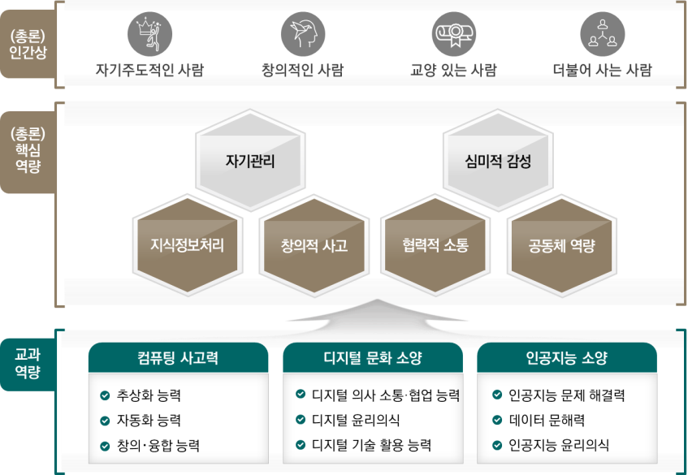

# 정보

# 정보

### 교육과정 설계의 개요

정보 교과 교육과정은 그 범위를 확장해 가고 있는 학문적 정체성과 디지털 대전환 시대의 국가⋅사회적 요구사항 반영, 미래 사회 변화에 적극적으로 대응할 수 있는 역량을 강화하기 위한 방향으로 설계하였다. 2022 개정 교육과정 총론 주요사항에서 제시된 핵심역량 중 ‘지식정보처리’, ‘창의적 사고’, ‘협력적 소통’, ‘공동체 역량’과 연계하여 ‘컴퓨팅 사고력’, ‘디지털 문화 소양’, ‘인공지능(AI) 소양’을 정보 교과의 역량으로 설정하였고, 하위 역량을 상위 역량이 포괄하는 형태로 구성하였다.

컴퓨팅을 활용한 문제 해결을 전제로 문제를 발견, 분석하여 실생활과 다양한 학문 분야의 문제를 해결하기 위한 새로운 방법론을 제시할 수 있는 능력인 ‘컴퓨팅 사고력’, 그리고 인간과 인공지능의 공존을 모색하는 사람 중심의 인공지능 윤리의식과 데이터에 대한 이해를 기반으로 인공지능을 통해 문제를 해결할 수 있는 능력인 ‘인공지능 소양’은 총론의 ‘지식정보처리’, ‘창의적 사고’ 역량과 연계된다. 디지털 사회의 구성원으로서의 윤리의식과 시민성을 갖추고 디지털 기술을 기반으로 의사 소통하고 협업할 수 있는 능력인 ‘디지털 문화 소양’은 ‘인공지능 소양’과 더불어 총론의 ‘협력적 소통’, ‘공동체 역량’과 직접 연계된 역량이다.

정보 교과의 구성 체계를 통해 정보 교과의 목표를 달성하고, 교과 역량을 함양하게 하는 선순환의 구조를 고려하였다. 즉, ‘디지털 세상의 데이터와 정보를 다루는 컴퓨팅 시스템에 대한 이해를 기반으로 데이터를 처리하는 능력을 기르는 것’, ‘컴퓨팅을 활용한 문제 해결을 위해 문제를 발견, 이해하여 다양한 해법을 설계하고 프로그램을 통해 구현해 가는 자동화의 중요성을 이해하고 실천하는 태도를 기르는 것’, 그리고 ‘디지털 세상을 살아가기 위한 윤리를 실천하며, 인공지능으로 인한 세상의 변화를 이해하고 인공지능을 통해 해결 가능한 문제를 탐색하고 해결하기 위한 능력과 태도를 갖추는 것’의 목표를 통해 교과의 역량이 발현될 수 있도록 구성 체계를 제시하였다.

성격 및 목표에서는 정보과의 필요성과 역할, 학문적 정체성을 바탕으로 과목에서 추구하는 목표를 구체화하였다. 내용 체계, 성취기준에서는 교과 목표를 달성하기 위한 주요 내용을 구성하였고, 교수⋅학습, 평가에서도 내용 체계에 기반한 성취기준을 달성하는 데 도움이 되는 교수⋅학습 및 평가의 원칙과 구체적 방법을 제시하였다.

정보 교과의 영역은 ‘컴퓨팅 시스템’, ‘데이터’, ‘알고리즘과 프로그래밍’, ‘인공지능’, ‘디지털 문화’로, 5개의 영역은 교과의 핵심역량과 목표를 달성하기 위한 형태로 제시되었다. 초등학교 5\~6학년 실과(정보)는 ‘디지털 사회와 인공지능’ 영역으로 구성되었고, 중학교 정보와 연계성을 갖도록 하였다. ‘컴퓨팅 시스템’을 구성하는 기본적인 요소에 대한 이해와 인공지능의 기초가 되는 ‘데이터’에 대한 문해력 형성을 기반으로 ‘알고리즘과 프로그래밍’, ‘인공지능’을 통해 문제를 해결하도록 한다. 그리고 이러한 전 과정에서 ‘디지털 문화’를 누리는 사회의 구성원으로서 갖추어야 할 지식⋅이해, 과정⋅기능, 가치⋅태도가 함양될 수 있도록 하였다. 즉, 영역들이 병렬적으로 연계되면서도 각 영역을 통해 추구하는 능력이나 목표 역량은 차별성을 두어 구성하였다.

정보 교과의 ‘핵심 아이디어’는 교과의 역량을 고려해서 구성한 영역의 목표를 달성하고, 학습자가 깊이 있는 학습을 통해 습득, 일반화하여 학습의 전이를 도모할 수 있는 내용을 선정하였다. 선정된 내용은 지식으로서의 중요성, 사회적인 가치 및 유용성 등을 판단하였다. 마지막으로 학습자가 습득한 지식이나 기능이 사회적으로 어떤 전이 효과를 발생시킬 수 있는지 등, 미래지향적인 관점을 포괄할 수 있도록 구성하였다.

정보 교과의 내용 체계 중 ‘지식⋅이해’는 교과 지식 중 핵심이 되는 내용을 선정하였고, ‘과정⋅기능’은 절차적 지식이 중요하게 고려되는 교과의 특성을 고려하였다. 즉, ‘지식⋅이해’와 더불어 깊이 있는 학습을 지원할 수 있는 탐구적 성향의 절차적 지식을 선정하였다. ‘가치⋅태도’는 디지털 사회의 핵심역량을 기르는 정보 교과의 전 과정을 통해 내면화되는 내용을 선정하였다. 세 범주는 서로 영향을 주는 만큼, 해당 영역을 통해 습득해야 할 목표가 성취기준을 통해 연결되고 완성될 수 있도록 구성하였다.

정보 교과의 역량 함양은 학습자가 설정된 성취기준을 충실히 달성할 때 가능한 것임을 교사는 이해해야 한다. 정보 교과는 교수⋅학습 과정에서 학습자의 디지털 역량 수준에 따라 학습 내용에 대한 이해가 달라질 수 있으므로 학습자의 디지털 역량을 파악하여 수업 설계에 반영하는 것이 중요하다. 학습의 결과가 실생활 및 여러 학문 분야로 전이될 수 있는 특성을 고려하여, 과목의 영역별 내용과 다른 교과 내용의 융합 등 연계를 통해 깊이 있는 학습이 가능하도록 독창적인 교육과정을 설계하도록 한다.

### 1. 성격 및 목표

가. 성격

‘정보(Informatics)’과는 인공지능으로 정의되는 사회에서 데이터와 정보로 인한 디지털 세상의 변화를 인식하고, 정보의 사회적 가치를 탐구하며, 정보를 처리하는 다양한 원리와 기술에 기반한 컴퓨팅 사고력을 바탕으로 실생활 및 다양한 학문 분야의 문제를 해결하는 능력과 태도를 기르는 교과이다. ‘정보’는 디지털 대전환 시대의 국가⋅사회적 요구에 부응하여, 컴퓨팅을 활용한 문제 해결을 위해 사회 구성원이 갖추어야 할 필수 역량을 제공한다. ‘정보’의 학문적 기저는 컴퓨터에서 처리되는 데이터와 정보의 원리, 컴퓨팅 시스템을 설계하고 구현하는 기술과 방법, 정보를 다루는 인간 사회에 대한 이해 등을 포괄하고 있다. 즉, ‘정보’는 컴퓨터과학뿐 아니라 데이터 과학, 인공지능, 정보기술, 정보시스템, 소프트웨어 공학 등의 분야를 포괄하는 정보학에 대한 기본 개념과 원리를 기반으로 다양한 학문 분야와 미래 사회의 문제를 해결하는 데 도움이 되는 지식과 기술을 함양한다. 교과의 이러한 특성은 사회 각 분야에서 요구되는 소프트웨어와 인공지능에 대한 기본 소양을 갖추고, 공학뿐만 아니라 자연과학, 인문⋅사회과학, 예술과 체육 등 다양한 학문 분야에서 문제를 창의적으로 해결하는 인재 양성에 도움을 준다.

모든 학생이 기초적으로 갖추어야 할 디지털 소양의 근본이 되는 ‘정보’는 학생들이 미래 사회가 요구하는 컴퓨팅, 디지털에 대한 역량과 자기주도성을 갖춘 인간으로 성장하게 한다. 컴퓨팅 사고력에 기반한 지식정보처리, 창의적 사고, 타인과 협업하고 공유하는 협력적 소통 역량과 공동체 역량 등을 갖춘 디지털 민주시민으로 성장하게 한다.

중학교 ‘정보’는 컴퓨팅과 인공지능 기술 및 디지털 문화에 대한 이해를 기반으로 미래 사회의 문제를 해결하는 데 필요한 기초적인 능력과 태도를 함양하도록 한다. 중학교 ‘정보’는 초등학교 실과 내의 디지털 사회와 인공지능 영역 및 고등학교 정보 교과의 모든 과목과 연계성을 갖는다. 또한, 다른 교과와의 융합을 통해 해당 분야의 문제를 새롭게 인식하게 하는 토대를 제공한다.

나. 목표

중학교 ‘정보’는 컴퓨팅 사고력을 기반으로 인공지능을 포함하는 컴퓨팅 기술을 활용하여 미래 사회에서 다양한 분야의 문제를 발견하고 해결할 수 있는 기초적인 능력을 함양하도록 하는 데 중점을 둔다.

(1) 디지털 세상의 데이터와 정보를 다루는 컴퓨팅 장치를 이해하고, 실생활에서 정보를 다루는 시스템에 의해 처리된 결과의 영향력을 판단하는 능력을 기른다.

(2) 컴퓨터로 처리되는 정보의 원리를 이해하고, 다양한 현상의 의미를 해석하는 데 도움이 되는 데이터의 중요성을 고려하여 데이터의 수집 및 분석, 처리를 위한 능력을 기른다.

(3) 컴퓨팅을 활용한 실생활의 문제 해결을 위해 문제를 발견, 분석, 추상화하여 해결책을 구상하고, 프로그램을 설계⋅구현하는 과정에서 자동화의 필요성과 중요성을 이해하고 실천하는 태도를 기른다.

(4) 인공지능으로 인한 세상의 변화를 이해하고, 기초 지식을 기반으로 인공지능을 활용한 문제 해결의 가능성을 탐색하는 태도와 능력을 기른다.

(5) 정보를 다루는 디지털 사회에 대한 특성을 이해하고, 미래 사회에서 디지털 기술의 영향력을 탐색하며, 디지털 사회를 살아가는데 필요한 디지털 윤리를 실천할 수 있는 태도를 기른다.

### 2. 내용 체계 및 성취기준

가. 내용 체계

(1) 컴퓨팅 시스템

<table>
<tr><th>핵심 아이디어</th><th>⋅하드웨어와 소프트웨어의 유기적 연결을 통해 동작하는 컴퓨팅 시스템은 사회적, 기술적 가치를 높이는 데 활용된다. ⋅컴퓨팅 시스템을 설계하는 것은 시스템에 대한 전체 흐름과 자원 할당의 가치를 이해하는 데 도움을 준다.</th></tr>
<tr><td rowspan="2">구분 범주</td><td>내용 요소</td></tr>
<tr><td>중학교</td></tr>
<tr><td>지식⋅이해</td><td>⋅컴퓨팅 시스템의 동작 원리 ⋅운영 체제의 기능 ⋅피지컬 컴퓨팅의 개념</td></tr>
<tr><td>과정⋅기능</td><td>⋅컴퓨팅 시스템의 구성요소를 파악하고, 동작 원리를 운영 체제와 관계짓기 ⋅생활 속에서 피지컬 컴퓨팅이 적용된 사례 조사하기 ⋅피지컬 컴퓨팅 시스템 구성하기</td></tr>
<tr><td>가치⋅태도</td><td>⋅컴퓨팅 시스템의 필요성과 가치를 판단하는 자세 ⋅피지컬 컴퓨팅 시스템의 구성요소를 목적에 맞게 선택하는 유연한 태도</td></tr>
</table>

(2) 데이터

<table>
<tr><th>핵심 아이디어</th><th>⋅데이터를 관리하기 위해서는 아날로그 데이터를 컴퓨터에서 처리할 수 있는 디지털 형태로 변환하는 과정이 필요하다. ⋅문제 해결을 위해서는 필요한 데이터를 수집하고, 분석하여 의미를 해석하는 것이 필요하다. ⋅수집된 데이터 간의 관계를 파악하고, 구조화하는 것은 데이터를 통해 새로운 지식을 찾는 데 도움을 준다.</th></tr>
<tr><td rowspan="2">구분 범주</td><td>내용 요소</td></tr>
<tr><td>중학교</td></tr>
<tr><td>지식⋅이해</td><td>⋅디지털 데이터 표현 방법 ⋅데이터 수집과 관리 ⋅데이터 구조화 및 해석</td></tr>
<tr><td>과정⋅기능</td><td>⋅다양한 데이터를 디지털 데이터로 표현하기 ⋅데이터를 목적에 맞게 수집⋅분류⋅저장하기 ⋅데이터를 구조화하고 의미 해석하기</td></tr>
<tr><td>가치⋅태도</td><td>⋅실생활의 많은 데이터가 디지털 형태로 변환되어 활용되는 긍정적 측면의 인식 ⋅데이터에 기반하여 현상을 바라보는 관점</td></tr>
</table>

(3) 알고리즘과 프로그래밍

<table>
<tr><th>핵심 아이디어</th><th>⋅알고리즘은 다양한 설계 전략을 통해 일상생활의 문제를 해결하는 데 활용된다. ⋅자동화를 고려해 설계된 알고리즘은 컴퓨터가 이해할 수 있는 언어로 구현되어 생활을 더욱 편리하게 하는 데 활용된다. ⋅프로그램 개발은 협력이 필요하며, 공유하는 문화를 통해 더 좋은 프로그램이 개발된다.</th></tr>
<tr><td rowspan="2">구분 범주</td><td>내용 요소</td></tr>
<tr><td>중학교</td></tr>
<tr><td>지식⋅이해</td><td>⋅문제 추상화 ⋅알고리즘 표현 방법 ⋅순차적인 데이터 저장 ⋅논리 연산 ⋅중첩 제어 구조 ⋅함수와 디버깅</td></tr>
<tr><td>과정⋅기능</td><td>⋅문제의 초기 상태, 현재 상태, 목표 상태를 정의하고 해결 가능한 형태로 구조화하기 ⋅문제 해결을 위한 다양한 알고리즘을 설계하고 적용하기 ⋅논리 연산, 중첩 제어 구조, 순차적인 데이터 저장을 활용하여 프로그램 작성하기 ⋅함수를 활용하여 프로그램을 모듈화하고, 프로그램의 오류를 발견하여 수정하기</td></tr>
<tr><td>가치⋅태도</td><td>⋅문제 분석을 통한 추상화의 중요성을 이해하고, 실생활 문제 해결을 실천하는 자세 ⋅문제 해결을 위한 다양한 해법을 탐색하고, 명확하게 알고리즘으로 표현하는 자세 ⋅소프트웨어를 통한 협력과 공유의 가치 ⋅프로그램의 효과성을 분석하고, 프로그램의 오류를 해결하려는 자세</td></tr>
</table>

(4) 인공지능

<table>
<tr><th>핵심 아이디어</th><th>⋅인공지능 기술로 구현된 에이전트는 외부와의 상호 작용을 통해 기존에 해결할 수 없었던 복잡하고 어려운 문제를 해결하는 데 활용된다. ⋅인공지능은 데이터를 기반으로 문제 해결을 가능하게 하므로, 인공지능에 사용되는 데이터는 윤리적 편향성이 없도록 하는 것이 중요하다.</th></tr>
<tr><td rowspan="2">구분 범주</td><td>내용 요소</td></tr>
<tr><td>중학교</td></tr>
<tr><td>지식⋅이해</td><td>⋅인공지능의 개념과 특성 ⋅인공지능 시스템</td></tr>
<tr><td>과정⋅기능</td><td>⋅인공지능 소프트웨어 구별하기 ⋅인공지능 학습에 필요한 데이터를 수집하여 활용하기 ⋅인공지능 시스템을 활용하여 해결할 수 있는 문제 발견하기 ⋅인공지능 시스템을 선택하여 문제 해결하기</td></tr>
<tr><td>가치⋅태도</td><td>⋅인공지능 시스템에서 적용 가능한 문제를 발견하는 자세 ⋅인공지능 학습에서 데이터로 인한 문제 가능성을 최소화하는 태도</td></tr>
</table>

(5) 디지털 문화

<table>
<tr><th>핵심 아이디어</th><th>⋅디지털 기술의 발전에 따라 디지털 사회에서 지켜야 할 규칙과 주의해야 할 위험 요소가 새롭게 등장한다. ⋅디지털 세상에서의 직업이나 진로는 기술의 발전에 따라 변화되므로, 기술과 사회 변화의 관계를 파악하는 것이 중요하다.</th></tr>
<tr><td rowspan="2">구분 범주</td><td>내용 요소</td></tr>
<tr><td>중학교</td></tr>
<tr><td>지식⋅이해</td><td>⋅디지털 사회와 직업 ⋅디지털 윤리 ⋅개인 정보와 저작권</td></tr>
<tr><td>과정⋅기능</td><td>⋅디지털 사회의 특성에 따른 직업의 변화 탐구하기 ⋅디지털 공간에서 지켜야 하는 윤리 토론하기 ⋅디지털 공간에서 나와 다른 사람을 보호하는 방법 탐구하기</td></tr>
<tr><td>가치⋅태도</td><td>⋅디지털 사회로의 변화가 나의 삶과 진로 결정에 미치는 영향력을 탐색하는 자세 ⋅디지털 공간에서 함께 살아가기 위한 윤리적인 태도</td></tr>
</table>

나. 성취기준

(1) 컴퓨팅 시스템

[9정01-01] 컴퓨팅 시스템의 구성요소와 동작 원리를 이해하고, 운영 체제의 기능을 분석한다.
[9정01-02] 피지컬 컴퓨팅의 개념을 이해하고, 생활 속에서 적용된 사례 조사를 통해 컴퓨팅 시스템의 필요성과 가치를 판단한다.
[9정01-03] 문제 해결 목적에 맞는 피지컬 컴퓨팅 구성요소를 선택하여 시스템을 구상한다.

(가) 성취기준 해설

• [9정01-01] 컴퓨팅 시스템은 컴퓨터라는 특정한 기기에서 더욱 큰 범위의 시스템으로 확장되었음을 인식하고, 현실 세계에서 볼 수 있는 다양한 컴퓨팅 시스템이 문제를 해결하는 방식을 설명할 수 있어야 한다. 컴퓨팅 시스템이 올바르게 동작하기 위해 운영 체제라는 특수한 형태의 소프트웨어가 필요함을 이해하고, 운영 체제가 컴퓨팅 시스템을 효율적으로 활용하기 위해 수행하는 작업을 설명할 수 있어야 한다.

• [9정01-02] 다양한 구성요소가 컴퓨팅 시스템에서 고유한 역할을 담당하고 있음을 이해하고, 목적에 맞는 물리적인 장치와 소프트웨어를 결합하여 피지컬 컴퓨팅 시스템을 구현하는 과정을 통해 사회의 다양한 영역에서 피지컬 컴퓨팅 시스템이 유용하게 사용될 수 있음을 판단할 수 있어야 한다.

(나) 성취기준 적용 시 고려 사항

• 실생활에서 관찰할 수 있는 구체적인 컴퓨팅 시스템의 예시를 적극적으로 활용하여 나의 삶과 컴퓨팅 시스템이 괴리되어 있지 않음을 인식하도록 유도하고, 컴퓨팅 시스템이 사회에서 담당하는 역할을 탐색하여 사회에 주는 영향력을 진술할 수 있는 구체적인 과제를 제공하는 방식으로 교수⋅학습을 구성하도록 한다.

• 피지컬 컴퓨팅 시스템을 구현하는 활동은 하드웨어 구성과 소프트웨어 제작을 함께 진행하게 되어 복잡해질 수 있으므로, 초등학교 실과에서 학습한 수준의 프로그래밍 활동으로 수행할 수 있도록 미리 구성되어 있는 피지컬 컴퓨팅 시스템을 동작하거나 간단한 피지컬 컴퓨팅 시스템을 구현하는 난이도로 교수⋅학습을 구성하여 하드웨어와 소프트웨어가 통합적으로 동작함을 인식하는 데 초점을 맞출 수 있도록 한다.

• 피지컬 컴퓨팅 시스템을 구현하기 위한 탐구 중심의 활동을 진행하고, 프로젝트 형태의 수업을 통해 학생이 피지컬 컴퓨팅 시스템을 구성하는 종합적인 활동 경험을 제공하도록 한다.

• 초등학교 수준에서 프로그래밍 학습이 충분히 이루어지지 않은 학생의 경우 피지컬 컴퓨팅 활동을 통해 물리적인 도구를 활용하여 기초적인 프로그래밍 역량을 충분히 함양할 수 있게 활동을 구성하도록 한다.

(2) 데이터

[9정02-01] 실생활의 데이터가 디지털 형태로 변환되어 활용되는 긍정적 가치를 탐색하고, 다양한 데이터를 디지털 형태로 표현한다.
[9정02-02] 문제 해결에 적합한 데이터를 수집하고, 목적에 맞게 구분하여 관리한다.
[9정02-03] 실생활의 데이터를 표, 다이어그램 등 다양한 형태로 구조화한다.
[9정02-04] 사례를 중심으로 데이터 간의 관계를 파악하고, 데이터에 기반하여 의미를 해석한다.
[9정02-05] 여러 학문 분야의 사례를 중심으로 데이터를 수집⋅분석하여 융합적으로 문제를 해결한다.

(가) 성취기준 해설

• [9정02-01] 디지털 형태의 데이터가 갖는 특징과 장점을 탐색하고, 문자, 이미지, 소리, 동영상 등의 데이터를 컴퓨팅 시스템에서 표현하기 위해 사용하는 기법을 활용하여 실제로 데이터를 디지털 형태로 표현할 수 있어야 한다.

• [9정02-02] 여러 가지 문제 상황을 해결하는 데 활용 가능한 데이터를 다양한 방식으로 수집하고 분류하여 활용도를 높일 수 있어야 한다. 데이터의 종류, 데이터의 의미, 공통점 등 데이터가 가지고 있는 의미나 형식에 따라 데이터를 구분하여 저장하고 활용할 수 있어야 한다.

• [9정02-04] 수집, 관리하는 데이터를 분석하기 용이한 형태로 나타내고, 이를 소프트웨어나 프로그래밍으로 분석하여 얻은 결과의 가치를 인식하고, 데이터를 기반으로 자신의 주장을 논리적으로 설명할 수 있어야 한다.

(나) 성취기준 적용 시 고려 사항

• 실습 환경에 따라 다양한 운영 체제와 파일 시스템을 운용할 수 있으므로 실습 환경에 비교적 독립적인 소프트웨어를 활용하여 디지털 데이터를 탐색하고 저장하여 활용하는 능력이 여러 기기로 전이될 수 있게 교수⋅학습을 구성하도록 한다.

• 학생의 수준에 따라 데이터를 다양한 시각적 형태로 나타내는 기초적인 활동부터 스프레드시트 등과 같은 소프트웨어를 활용하여 데이터의 의미를 분석하는 활동까지 단계적으로 교수⋅학습을 설계하도록 한다.

• 학생이 다양한 형태의 데이터를 경험하고, 분석할 수 있도록 활동 중심으로 교수⋅학습을 구성한다. 즉, 데이터 분석 활동의 전 과정이 프로젝트 기반의 문제 해결 활동, 혹은 문제기반 학습의 맥락에서 수행되어 데이터를 기반으로 문제를 해결하는 실제적인 경험을 제공하도록 한다.

(3) 알고리즘과 프로그래밍

[9정03-01] 문제의 상태를 정의하고 수행 가능한 형태로 구조화한다.
[9정03-02] 문제 해결을 위한 추상화의 중요성을 이해하고, 핵심요소를 중심으로 알고리즘을 표현한다.
[9정03-03] 알고리즘의 중요성을 이해하고, 문제를 해결하는 다양한 알고리즘을 비교⋅분석한다.
[9정03-04] 사례를 중심으로 문제 해결에 적합한 전략을 선택하여 알고리즘을 설계한다.
[9정03-05] 데이터를 순차적으로 저장할 수 있는 구조를 활용하여 문제 해결 프로그램을 작성한다.
[9정03-06] 논리 연산과 중첩 제어 구조를 활용하여 문제를 해결하는 프로그램을 작성한다.
[9정03-07] 프로그램 작성에서 함수를 활용하고, 프로그램 수행 결과를 디버거로 분석하여 오류를 수정한다.
[9정03-08] 실생활의 문제를 탐색하여 발견하고, 프로그래밍을 통해 해결한다.
[9정03-09] 다양한 학문 분야의 문제 해결을 위해 협력하여 소프트웨어를 개발한다.

(가) 성취기준 해설

• [9정03-03] 문제를 해결하는 알고리즘은 여러 가지 방식으로 나타날 수 있으나 정보 과목에서 추구하는 목표는 문제를 효과적이고 효율적으로 해결하는 알고리즘임을 인식하고, 하나의 문제를 해결하는 여러 알고리즘에 어떠한 장단점이 존재하는지를 비교⋅분석하여 논리적으로 설명할 수 있어야 한다.

• [9정03-04] 문제를 해결하기 위해 정보 분야에서 활용하는 문제 해결 전략을 이해하고, 문제 해결 과정에 적절한 전략을 활용하여 문제를 해결할 수 있어야 한다.

• [9정03-05] 입력된 데이터를 처리하여 결과 데이터를 도출하는 형태로 프로그램이 제작된다는 개념을 이해하고, 배열이나 리스트 등 데이터를 순차적으로 저장할 수 있는 구조를 활용하여 많은 양의 데이터를 효과적으로 처리할 수 있어야 한다.

(나) 성취기준 적용 시 고려 사항

• 문제를 해결하는 과정에서 문제 발견, 상태 정의, 핵심요소 추출 등의 추상화 단계를 거쳐 알고리즘을 설계하는 과정을 자연스럽게 경험할 수 있도록 교수⋅학습 절차를 설계하고, 문제 해결 과정 전반을 평가할 수 있도록 보고서나 포트폴리오 등을 활용하여 학생의 사고 과정을 누적하여 기록하도록 한다.

• 학생의 수준을 고려하여 적합한 프로그래밍 언어를 선정하고, 초등학교 실과 과목에서 학습한 기초적인 프로그래밍 기능을 바탕으로 데이터를 순차적으로 저장하는 구조, 논리 연산, 중첩 제어 구조를 활용할 수 있도록 프로젝트의 수준을 적절하게 설정하도록 한다.

• 프로젝트 활동에서는 실생활의 문제를 해결하기 위한 알고리즘을 설계하고 이를 적용한 소프트웨어를 개발하는 활동을 중점으로 교수⋅학습을 설계하도록 한다. 필요에 따라서는 ‘컴퓨팅 시스템’ 영역과 연계하여 피지컬 컴퓨팅 시스템을 설계, 제작하고 이를 동작하게 하는 소프트웨어를 결합하는 형태의 프로젝트도 제공할 수 있다.

• 효율적인 알고리즘 설계와 프로그램 작성은 시간, 에너지, 컴퓨팅 시스템 자원을 절약하는 방안임을 학생들이 인식할 수 있도록 안내한다.

(4) 인공지능

[9정04-01] 인공지능의 개념과 특성을 설명하고 인공지능 소프트웨어를 구별한다.
[9정04-02] 인공지능 학습에서 데이터의 중요성을 이해하고, 학습에 필요한 데이터를 수집하여 분류한다.
[9정04-03] 다양한 데이터를 활용하여 인공지능 시스템을 구성하고 적용한다.
[9정04-04] 인공지능 시스템으로 해결 가능한 문제를 발견하고, 문제 해결에 적합한 인공지능 시스템을 적용한다.
[9정04-05] 인공지능 학습에 필요한 데이터의 수집과 활용에서 발생하는 윤리적인 문제의 해결 방안을 구상한다.

(가) 성취기준 해설

• [9정04-01] 인공지능의 기초적인 개념을 이해하고 모델, 학습, 데이터 등 인공지능 시스템이 구성되는 원리와 문제를 해결하는 과정에 대해 설명할 수 있어야 한다. 이러한 이해를 기반으로 소프트웨어가 문제를 해결할 때 인공지능 시스템을 사용하는 부분을 구체적인 방식으로 설명할 수 있어야 한다.

• [9정04-03] 이미지, 소리, 글자 등의 데이터를 활용하여 인공지능 시스템을 학습시키고 학습한 시스템을 활용하여 문제를 해결하는 과정을 수행할 수 있어야 한다.

• [9정04-05] 인공지능 학습에 필요한 데이터의 수집과 활용에서 나타날 수 있는 여러 가지 현실적인 문제들에 대해 법적, 사회적, 윤리적으로 타당성을 가지는 해결 방안을 제시할 수 있어야 한다. 하나의 문제를 바라보는 여러 측면에 대해 고려하고 각각의 해결 방안이 가지는 장단점을 정리한 후 결론을 도출하는 과정을 경험하면서 인공지능의 사회적 역할과 가치를 판단할 수 있어야 한다.

(나) 성취기준 적용 시 고려 사항

• 인공지능 시스템 적용 시, 학생이 익숙하게 활용할 수 있는 프로그래밍 언어를 사용하여 학습에 인지적 부하가 적은 형태로 교수⋅학습 활동을 구성하도록 한다.

• 인공지능 윤리는 개인의 성향이나 문제에 대한 관점에 따라 서로 다른 주장을 펼칠 수 있다. 학생의 개별적인 의견을 최대한 존중하고 근거를 가지고 논리적으로 자신의 의견을 주장할 수 있도록 활동을 구성하도록 한다.

• 인공지능과 관련된 여러 사례를 경험하게 하고 활동을 통해 학습자의 인공지능에 대한 깊이 있는 이해가 내면화될 수 있도록 교수⋅학습을 구성한다.

(5) 디지털 문화

[9정05-01] 디지털 사회의 특성을 탐구하고, 사회 변화에 따른 직업의 변화를 탐구한다.
[9정05-02] 디지털 사회의 구성원으로서 편리하고 안전한 생활을 위한 규칙에 대해 민주적으로 논의하고 실천 방안을 수립한다.
[9정05-03] 사례를 중심으로 디지털 공간에서 함께 살아가기 위해 개인 정보 및 권리와 저작권을 보호하는 실천 방법을 탐구한다.

(가) 성취기준 해설

• [9정05-02] 디지털 사회를 안전하고 편리하게 살아가는 데 필요한 정보 윤리, 사이버 폭력 및 범죄 예방에 대한 기본적인 소양을 갖추고 스마트폰 중독, 인터넷 중독, 게임 과몰입 등의 구체적인 사례를 분석할 수 있어야 한다. 분석 내용을 기반으로 개인과 사회가 각각 수행해야 하는 실천 방안을 도출하여 자신의 삶에 적용하려는 태도를 갖출 수 있어야 한다.

(나) 성취기준 적용 시 고려 사항

• 정보 과목의 다른 내용 영역에서 자신이 실제로 학습한 내용을 바탕으로 디지털 사회를 이해하고 자신의 진로 계획을 수립할 수 있도록 진로 연계 교육을 고려한 교수⋅학습을 구성하도록 한다.

• 민주시민 교육의 일환으로 디지털 사회에서 발생하는 여러 문제에 대한 다양한 견해가 있을 수 있음을 인정하고, 다른 사람의 의견을 존중하는 논의 환경을 조성하도록 한다.

### 3. 교수⋅학습 및 평가

가. 교수⋅학습

(1) 교수⋅학습의 방향

(가) 실제적인 삶의 맥락에서 컴퓨팅을 통해 문제를 해결하도록 하는 학습 과제를 제시하여 학습자가 과제를 스스로 해결하는 과정에서 자연스럽게 컴퓨팅 사고력, 디지털 문화 소양, 인공지능 소양을 함양할 수 있도록 지도한다.

(나) 학습자의 흥미와 다양성을 고려하여 학습 소재, 학습 환경 및 학습 과정에 대한 선택의 기회를 제공하고, 교수⋅학습의 설계 과정에 학습자 참여 기회를 증진하는 등 학습자 맞춤형 교수⋅학습을 통해 역량 함양을 위한 깊이 있는 학습 지도 방안을 구성한다. 예를 들어, 영역별 교수⋅학습에 필요한 디지털 역량을 탐색하고 학생의 디지털 역량 수준을 파악하여 교수⋅학습을 진행하는 데 어려움이 없도록 추가적인 교육 기회를 제공한다.

(다) 정보 과목의 지식⋅이해, 과정⋅기능을 활용하여 민주시민교육, 생태전환 교육 등 현 시대가 당면한 여러 사회문제와 더불어 지속가능발전 등의 범교과 주제를 교수⋅학습 과제로 제시하여 주도성 있는 문제 해결 경험을 제공한다.

(라) ‘정보’ 과목 내의 영역, 다른 교과 및 비교과 활동과의 통합을 통해 정보 관련 역량의 확장을 꾀하고 학생의 역량이 다양한 분야에 전이되도록 한다.

(마) 내용 영역의 배열순서가 반드시 교수⋅학습의 순서를 의미하는 것은 아니므로, 교수⋅학습 계획을 수립하거나 평가를 준비할 때는 학생에게 제공할 문제 상황, 문제의 난이도, 학생의 준비 상태, 학습 환경 등을 고려하여 내용이나 순서 등을 재구성할 수 있다.

(바) 학습자의 선행 지식과 총체적인 과제 진행을 고려하여 하위 학년군과 상위 학년군의 성취기준을 적절히 활용할 수 있다.

(2) 교수⋅학습 방법

(가) 교과 역량을 함양하기 위해 문제기반학습, 프로젝트 기반학습, 디자인기반학습, 짝 프로그래밍, 탐구학습 등 각 영역의 핵심 아이디어를 습득하는 데 적절한 교수⋅학습 방법을 선택하여 활용한다.

(나) 디지털 교육 환경에 적응할 수 있도록 온오프라인 연계 수업, 다양한 디지털 도구의 활용 등을 통해 디지털 도구에 대한 인지적 부담은 최소화하고, 활용에 대한 경험은 높일 수 있도록 활동을 구성한다.

(다) 온라인 교실, 다양한 커뮤니티 서비스 등을 활용하여 학생이 수업 현장에 있지 않더라도 학습 결손이 발생하지 않도록 교수⋅학습을 제공한다.

(라) 내용 영역별로 프로그래밍을 통한 문제 해결 과정을 포함하도록 하여 컴퓨팅 시스템을 문제 해결에 적용하는 충분한 경험을 하도록 교수⋅학습을 구성한다.

(마) 학습 목표를 효과적으로 달성하기 위해 학급 내에서 개인차를 고려한 소집단을 구성하여 교수⋅학습을 전개할 수 있다.

나. 평가

(1) 평가의 방향

(가) 평가 항목은 컴퓨팅 사고력, 디지털 문화 소양, 인공지능 소양의 하위 요소를 기반으로 구체화한다.

(나) 평가 내용은 지식⋅이해뿐 아니라, 과정⋅기능, 가치⋅태도의 측면 등을 다면적으로 반영하고 과정을 중시하는 평가를 통해 학생의 성장과 발달을 돕는 평가를 실현한다.

(다) 구체적인 평가 루브릭을 학생과 함께 구성하는 과정을 통해 학생이 자신의 학습 수준을 파악하고 스스로 학습을 성찰할 수 있는 기회를 제공하여, 적극적이고 능동적인 학습이 이루어지도록 한다.

(라) 단순하고 지엽적인 지식의 평가보다는 문제를 해결하는 과정을 통합적으로 관찰하고 평가할 수 있는 계획을 수립한다.

(2) 평가 방법

(가) 성취기준을 분석하고 재구성하여 지필평가에 국한하지 않고, 학생의 성장에 기여할 수 있는 평가 포트폴리오를 계획한다. 예를 들어, 관찰 평가, 서술형평가, 수행평가 등을 활용하거나, 자기 평가, 동료 평가 등과 같은 다면적 평가를 실행한다.

(나) 평가 내용이나 방법에 따라 다양한 디지털 도구(프로그램 자동 평가시스템, 학습관리시스템(LMS) 등)를 활용할 수 있으며, 평가 이전에 학생이 디지털 도구를 다룰 수 있도록 교육하여 평가의 불이익이 없도록 계획한다.

(다) 개념적이거나 기능적으로 명확하게 파악할 수 있는 부분은 정량적 평가를, 결과물의 품질이나 심미적 부분을 평가할 때는 정성적 평가를 실시한다.

