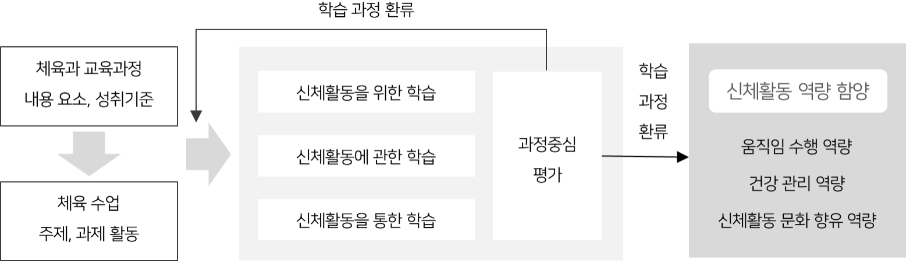
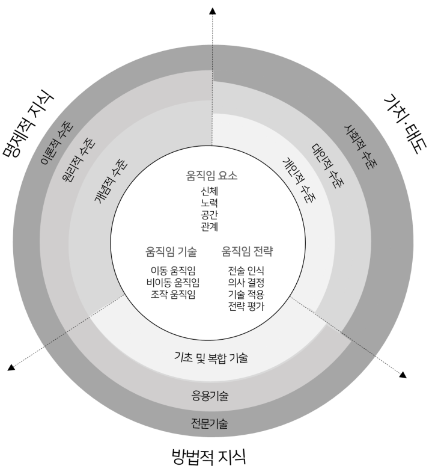
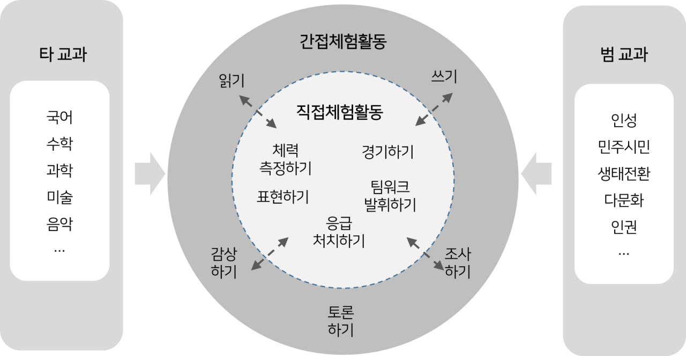

# 체육

# 체육

### 교육과정 설계의 개요

체육과는 활동적이고 창의적인 삶, 건강하고 주도적인 삶, 신체활동 문화를 향유하며 사회 속에서 바람직하고 더불어 사는 삶을 추구한다.

체육과가 추구하는 삶은 세 가지 신체활동 역량을 갖춤으로써 실현된다. 첫째, ‘움직임 수행 역량’은 신체활동 형식에 적합한 움직임의 기능과 방법을 효율적, 심미적으로 발휘할 수 있는 능력으로 운동, 스포츠, 표현 활동 과정에서 움직임에 필요한 지식, 기능, 태도를 다양한 상황에 적용하며 발달한다. 둘째, ‘건강 관리 역량’은 체력 및 신체적, 정신적, 사회적 건강을 유지하고 증진하는 능력으로 체육과 내용 영역에서 학습한 신체활동을 일상생활에서 실천하고, 개인과 사회적 측면에서 건강을 저해하는 요소에 적극적으로 대처하며 함양된다. 셋째, ‘신체활동 문화 향유 역량’은 다양한 신체활동 문화를 전 생애 동안 즐기며 타인과 상호작용할 수 있는 능력으로 각 신체활동 형식의 특성을 이해하고 인류가 축적한 문화적 소양을 내면화하여 공동체 속에서 실천하면서 길러진다.

신체활동 역량은 총론이 추구하는 인간상을 실현하는 기반이 된다. 자기 주도성은 건강한 삶을 위해 다양한 건강 관련 문제를 적극적, 주도적으로 해결하는 과정에서 학습되고, 창의적 사고는 신체적으로 활동적인 삶을 사는 데 필요한 움직임을 다양한 환경에서 수행하고 적용함으로써 길러지며, 포용성과 시민성은 신체활동에 참여하며 공동체의 가치 있는 규범과 문화를 인식하고 공유함으로써 함양된다.

체육과의 내용은 ‘운동’,‘ 스포츠’, ‘표현’의 세 가지 영역으로 구성되며, 이는 움직임 기술의 발달을 통해 조직화되고 제도화된 신체활동 형식이다. ‘운동’ 영역은 체력과 운동 기능 향상, 건강 증진을 목적으로 수행하는 신체활동 형식으로, 체력 운동과 건강 활동으로 구분된다. ‘스포츠’ 영역은 제도화되고 조직화된 신체활동과 다양한 환경과의 상호작용을 통해 생태적 결합을 추구하는 신체활동 형식으로, 기술의 수월성을 겨루는 ‘기술형 스포츠’, 전략에 따라 승패가 결정되는 ‘전략형 스포츠’, 다양한 환경 맥락에 따라 활동 특성이 나타나는 ‘생태형 스포츠’로 분류된다. ‘표현’ 영역은 생각과 감정을 연속된 움직임과 다양한 동작으로 표현하는 신체활동 형식이다.

영역별 핵심 아이디어는 ‘운동’, ‘스포츠’, ‘표현’이라는 신체활동 형식의 개인적, 사회적 가치, 활동의 원리와 맥락, 실천 및 활용 방식에 따라 설정되었다. 운동은 건강한 삶의 기반이 되고, 건강은 체력 및 건강 증진 운동과 다양한 건강 활동을 통해 증진되며, 운동을 통해 습득한 건강한 생활 습관은 주도적이고 행복한 삶을 견인한다. 스포츠는 인간이 제도화된 규범과 문화를 통해 타인과 소통하며 사회 속에서 더불어 사는 존재로 성장하도록 하며, 표현은 생각과 감정의 심미적이고 창의적인 움직임을 통해 자유롭고 주체적인 삶을 살아가도록 한다.

내용 요소는 영역별 핵심 아이디어에 따라 ‘지식⋅이해’, ‘과정⋅기능’, ‘가치⋅태도’의 세 가지 범주로 제시되었다. ‘지식⋅이해’ 요소는 체육과의 내용 지식을 구성하는 명제적 지식(각 내용 영역에서 이해해야 하는 개념이나 원리 등)과 방법적 지식(명제적 지식을 실제 상황에서 수행할 수 있는 기술이나 활동 방법 등)을 의미한다. ‘과정⋅기능’ 요소는 체육과의 ‘지식⋅이해’ 요소를 탐구하는 절차적 지식과 결과적으로 발휘할 수 있는 능력을 의미하며, ‘가치⋅태도’ 요소는 이러한 신체활동의 학습 과정에서 습득되는 바람직한 성품을 의미한다. 특히 체육과의 내용 요소에는 총론에서 강조하는 ‘핵심 역량’, ‘생태교육’, ‘민주시민교육’ 등의 가치와 언어, 수리, 디지털 소양 등의 ‘기초 소양’을 반영하여 총론의 목표를 체육과에서 구현할 수 있도록 하였다.

내용 요소는 <표 1>과 같이 학년군별 내용 요소의 선정 원리에 따라 계열화되었다. 첫째, ‘지식⋅이해’ 요소의 명제적 지식은 지식을 구성하는 내용 수준에 따라 개념과 원리로 구분되었고, 방법적 지식은 움직임 기술의 수준에 따라 신체활동 입문을 위한 기초 기술, 신체활동 참여를 위한 복합 기술, 제도화된 활동을 목표로 하는 응용 기술로 분류되었다. ‘가치⋅태도’ 요소는 주관적 수준으로 나타나는 개인적 태도, 타인과의 관계 속에서 나타나는 대인적 태도, 보편적인 사회적 규범 수준에서 요구되는 사회적 태도로 분류되었다. 또한 ‘과정⋅기능’ 요소는 ‘지식⋅이해’, ‘가치⋅태도’ 요소별로 학습 과정 및 결과에서 요구되는 행동을 학년군별 발달 수준에 맞게 제시하였다.

<표 1> 학년군별 내용 요소의 선정 원리

<table>
<tr><th rowspan="2">내용 학년군</th><th colspan="2">지식⋅이해</th><th rowspan="2">가치⋅태도</th><th rowspan="2">과정⋅기능</th></tr>
<tr><td>명제적 지식</td><td>방법적 지식</td></tr>
<tr><td>3~4학년군</td><td rowspan="4">개념적 수준 ↓ 원리적 수준 ↓ 이론적 수준</td><td rowspan="4">입문을 위한 기초 기술 ↓ 참여를 위한 복합 기술 ↓ 제도화된 활동을 위한 응용 기술 ↓ 정식 활동의 심화 및 전문 기술</td><td rowspan="4">개인 ↓ 대인 ↓ 사회</td><td rowspan="4">인지, 시도, 수용 ↓ 분석, 적용, 실천 ↓ 평가, 구성, 지속</td></tr>
<tr><td>5~6학년군</td></tr>
<tr><td>중학교 1~3학년군</td></tr>
<tr><td>고등학교</td></tr>
</table>

### 1. 성격 및 목표

가. 성격

체육과는 신체활동의 학습을 통해 활동적이고 창의적인 삶, 건강하고 주도적인 삶, 신체활동 문화를 향유하며 사회 속에서 바람직하고 더불어 사는 삶의 자질을 길러주는 교과이다. 신체활동은 놀이, 게임, 운동, 스포츠, 표현 등의 맥락에서 계획적, 의도적으로 수행되는 움직임으로, 신체 능력과 건강을 증진하고, 다양한 기술과 전략을 바탕으로 타인 및 환경과 상호작용하는 과정에서 형성된 삶의 양식이다.

인간은 움직임 기술을 바탕으로 운동, 스포츠, 표현 활동을 실천하며 일상생활과 여가활동에서 활동적인 삶을 영위할 수 있다. 운동 실천과 전략적 경기 수행, 심미적 표현과 같은 신체활동 체험을 통해 인간은 주변 세계와 적극적으로 상호작용하며 창의적으로 대응한다. 신체활동은 건강하고 주도적인 삶의 기초로 신체적, 정신적, 사회적 건강을 위한 필수적인 활동이다. 건강한 삶은 현대 사회의 기후 환경 위기, 좌식화된 생활 방식, 개인화된 사회 구조 등으로 인한 신체적, 정신적, 사회적 건강 문제를 적극적으로 대처하려는 주도적인 노력을 통해 실현된다. 또한 신체활동은 인간이 신체와 관련된 고유한 문화를 향유하고 사회의 다양한 구성원과 더불어 살도록 한다. 인류의 문명화 과정에서 신체활동 문화는 신체적 수월성을 겨루는 경기 문화, 인간의 삶을 풍요롭게 하는 놀이 및 여가 문화, 신체적 움직임이 미적으로 승화한 표현 문화, 제도화된 신체활동에 내재한 정신문화, 건강한 생활을 추구하는 과정에서 형성된 건강 문화 등 다양한 문화 양식으로 발전해 왔다. 이러한 신체활동 문화는 바람직한 인간관계의 기초가 되며 책임 있고 협력적인 태도, 공정하고 호혜적인 관계와 더불어 생태환경과의 조화로운 삶을 경험할 수 있는 기반이 된다.

이를 실현하기 위해 체육과에서는 첫째, 학습자가 기본 움직임 기술을 익히고, 신체활동 형식과 관련된 개념, 기술, 전략 등을 습득하며, 일상생활에서 신체활동을 계획하고 실천하도록 한다. 둘째, 연구와 실천을 통해 축적된 신체활동에 관한 이론적⋅경험적 지식을 이해하고 생활 속에서 적용하고 즐기며 다양한 안목을 기르도록 한다. 셋째, 다양한 신체활동 경험을 성찰하며 자신과 세계와의 관계를 인식함으로써 신체활동에 내재한 가치와 태도를 실천하도록 한다. 즉, 체육과 학습을 통해 학습자는 신체활동 문화에 입문하고, 운동, 스포츠, 표현 등의 신체활동 형식과 관련된 움직임 지식, 기술, 태도를 습득하며, 이를 기반으로 체육과가 추구하는 삶의 방식을 생애 전반에 걸쳐 실천할 수 있는 역량을 함양한다. 또한 이러한 신체활동 역량을 운동, 스포츠, 표현 맥락뿐만 아니라 일상생활과 직무, 여가활동 등에서 효과적이고 효율적으로 발휘할 수 있다.

따라서 체육과는 학습자가 전 생애에 걸쳐 체력과 건강, 움직임에 대한 기능과 지식, 다양한 신체활동에 참여하려는 의지와 태도를 길러 적극적으로 신체활동에 참여하며, 신체활동 문화를 깊이 이해하고 실천함으로써 건강하고 활기찬 삶을 생활화하고, 타인 및 세계와 소통하며 바람직한 민주 시민으로 성장할 수 있도록 한다.

나. 목표

체육과는 활동적이고 창의적인 삶, 건강하고 주도적인 삶, 신체활동 문화를 향유하며 사회 속에서 바람직하고 더불어 사는 삶을 영위할 수 있는 신체활동 역량을 기르는 것을 목표로 한다.

(1) 움직임 관련 지식을 이해하고, 움직임의 목적과 환경에 적합하게 움직임 기술을 수행하며, 움직임 수행에 필요한 가치와 태도를 실천한다.

(2) 건강 관련 지식을 이해하고, 생애 전반에 걸쳐 건강을 증진 및 관리하며, 건강의 증진과 관리에 필요한 가치와 태도를 실천한다.

(3) 신체활동의 고유한 문화 특성을 이해하고, 신체활동 문화를 일상생활에서 누리며, 다양한 문화 양식에 내재한 가치와 태도를 실천한다.

### 2. 내용 체계 및 성취기준

가. 내용 체계

(1) 운동

<table>
<tr><th>핵심 아이디어</th><th colspan="4">⋅운동은 체력과 건강을 관리하는 주요 방법으로, 생애 전반에 걸쳐 건강한 삶의 토대가 된다. ⋅체력은 건강의 기초가 되며, 건강은 신체적 특성에 맞는 운동과 생활 습관을 계획하고 관리함으로써 증진된다. ⋅인간은 생활 속에서 운동을 즐기고, 심신의 건강을 유지하며, 행복한 삶을 영위한다.</th></tr>
<tr><td rowspan="3">구분 범주</td><td colspan="4">내용 요소</td></tr>
<tr><td colspan="2">초등학교</td><td colspan="2">중학교</td></tr>
<tr><td>3~4학년</td><td>5~6학년</td><td colspan="2">1~3학년</td></tr>
<tr><td>지식⋅이해</td><td>⋅운동과 체력 ⋅기본 체력운동 방법 ⋅운동과 건강 ⋅건강한 생활 습관</td><td>⋅건강 체력과 운동 체력 ⋅체력 종류별 운동 방법 ⋅운동과 성장 발달 ⋅안전한 생활 습관</td><td>⋅체력 증진의 원리 ⋅체력 증진 운동 방법 ⋅체력 관리의 원리 ⋅체력 관리 운동 방법 ⋅운동 처방의 원리 ⋅운동 처방 방법</td><td>⋅신체 건강의 특성 ⋅신체 건강 활동 ⋅정신 건강의 특성 ⋅정신 건강 활동 ⋅사회적 건강의 특성 ⋅사회적 건강 활동</td></tr>
<tr><td>과정⋅기능</td><td>⋅운동과 체력의 관계 파악하기 ⋅기본 체력 운동 시도하기 ⋅운동과 건강의 관계 파악하기 ⋅건강한 생활 습관 시도하기 ⋅안전하게 활동하기</td><td>⋅건강 체력과 운동 체력의 의미와 요소 파악하기 ⋅체력을 측정하고 다양한 운동 시도하기 ⋅운동과 성장 발달의 관계 파악하기 ⋅운동과 생활 속 안전사고 예방 방법 탐색하며 대처하기 ⋅안전하게 활동하기</td><td colspan="2">⋅체력 운동 원리 분석하기 ⋅체력 요소별 운동 방법 적용하기 ⋅건강 활동 특성 분석하기 ⋅건강 활동 방법 실천하기 ⋅안전하게 활동하기</td></tr>
<tr><td>가치⋅태도</td><td>⋅긍정적 신체 인식 ⋅운동 및 건강에 관한 관심 ⋅운동 및 건강 습관 실천 의지</td><td>⋅체력 운동 참여의 근면성 ⋅체력 증진을 위한 끈기 ⋅성장 발달의 차이 공감 ⋅안전사고에서의 침착성</td><td colspan="2">⋅체력 문제 해결 의지 ⋅운동 실천의 자기 주도성 ⋅자율적인 건강 추구 ⋅자신과 공동체에 대한 안전의식</td></tr>
</table>

(2) 스포츠

<table>
<tr><th>핵심 아이디어</th><th colspan="3">⋅스포츠는 인간이 제도화된 규범과 움직임 기술을 바탕으로 타인 및 주변 세계와 소통하며 바람직한 구성원으로 성장하는 데 이바지한다. ⋅스포츠는 인간이 환경과 상호작용하고 다양한 기술과 창의적인 전략을 발휘하며 한계를 극복하는 과정에서 발달한다. ⋅인간은 스포츠를 다양한 방식으로 체험함으로써 움직임의 즐거움을 느끼고 활동적인 삶의 태도를 배운다.</th></tr>
<tr><td rowspan="3">구분 범주</td><td colspan="3">내용 요소</td></tr>
<tr><td colspan="2">초등학교</td><td>중학교</td></tr>
<tr><td>3~4학년</td><td>5~6학년</td><td>1~3학년</td></tr>
<tr><td>지식⋅이해</td><td>⋅스포츠와 움직임 기술 ⋅기본 움직임 기술의 종류와 수행 방법 ⋅스포츠에서의 기본 움직임 기술 수행 방법</td><td>⋅기술형⋅전략형⋅생태형 스포츠의 유형 ⋅기술형⋅전략형⋅생태형 스포츠의 유형별 움직임 기술 응용 방법 ⋅기술형⋅전략형⋅생태형 스포츠의 활동 방법과 기본 전략</td><td>⋅기술형⋅전략형⋅생태형 스포츠의 역사와 특성 ⋅기술형⋅전략형⋅생태형 스포츠의 경기 기능과 수행 원리 ⋅기술형⋅전략형⋅생태형 스포츠의 경기 방법과 전략</td></tr>
<tr><td>과정⋅기능</td><td>⋅스포츠의 의미와 유형 이해하기 ⋅기본 움직임 기술과 스포츠의 관계 파악하기 ⋅기본 움직임 기술의 종류 파악하고 시도하기 ⋅스포츠 유형별 움직임 기술 종류 파악하기 ⋅스포츠 유형별 움직임 기술 시도하기 ⋅안전하게 움직이기</td><td>⋅기술형⋅전략형⋅생태형 스포츠의 유형 파악하기 ⋅기술형⋅전략형⋅생태형 스포츠의 유형별 움직임 기술 응용 방법 활용하기 ⋅기술형⋅전략형⋅생태형 스포츠의 기본 전략 적용하기 ⋅안전하게 활동하기</td><td>⋅기술형⋅전략형⋅생태형 스포츠 유형별 역사와 특성 비교하기 ⋅기술형⋅전략형⋅생태형 스포츠 유형별 수행 원리를 경기 기능에 적용하기 ⋅기술형⋅전략형⋅생태형 스포츠 유형별 경기 방법과 전략을 경기에 활용하기 ⋅안전하게 경기하기</td></tr>
<tr><td>가치⋅태도</td><td>⋅움직임 수행의 자신감과 적극성 ⋅최선을 다하는 태도 ⋅게임 규칙 준수 ⋅스포츠 환경에 대한 개방성 ⋅스포츠 활동 참여의 적극성</td><td>⋅목표 달성 의지 ⋅상대 기술 인정 ⋅팀원과의 협력 ⋅구성원 배려 ⋅스포츠 환경을 아끼는 태도 ⋅스포츠 환경에 감사하는 태도</td><td>⋅경기 수련에 대한 인내심 ⋅도전적 경기 태도 ⋅팀워크와 신뢰 ⋅페어플레이 ⋅스포츠 환경 개선을 위한 공동체 의식 ⋅스포츠 환경에 친화적인 태도</td></tr>
</table>

(3) 표현

<table>
<tr><th>핵심 아이디어</th><th colspan="3">⋅표현 활동은 인간이 신체 움직임에 생각과 감정을 담아 심미적으로 표현하는 과정에서 창의적인 삶의 태도를 형성하고, 예술적 신체활동 문화를 향유할 수 있도록 한다. ⋅표현 활동은 기본 움직임에 표현 원리가 적용되어 다양한 유형으로 구현되며, 구성 및 창작의 과정을 통해 발달한다. ⋅인간은 다양한 표현 활동을 체험함으로써 움직임의 심미적 가치를 내면화하며 자유롭고 주체적으로 사는 방법을 터득한다.</th></tr>
<tr><td rowspan="3">구분 범주</td><td colspan="3">내용 요소</td></tr>
<tr><td colspan="2">초등학교</td><td>중학교</td></tr>
<tr><td>3~4학년</td><td>5~6학년</td><td>1~3학년</td></tr>
<tr><td>지식⋅이해</td><td>⋅표현 활동과 움직임 기술 ⋅기본 움직임 기술의 표현 방법</td><td>⋅표현 활동의 유형 ⋅표현 활동의 유형별 움직임 기술 응용 방법 ⋅표현 활동의 유형별 움직임 기술 구성</td><td>⋅표현 활동의 역사와 특성 ⋅표현 활동의 동작과 표현 원리 ⋅표현 활동의 창작과 감상</td></tr>
<tr><td>과정⋅기능</td><td>⋅표현 활동의 움직임 기술 파악하고 시도하기 ⋅다양한 방법으로 움직임 기술 표현하기</td><td>⋅표현 활동의 유형 파악하기 ⋅표현 활동의 유형별 움직임 기술 응용 방법 활용하기 ⋅표현 활동의 유형별 움직임 기술 구성하고 발표하기</td><td>⋅표현 활동의 유형별 역사와 특성 비교하기 ⋅표현 활동의 유형별 동작 표현하기 ⋅표현 활동의 유형별 원리 적용하기 ⋅표현 활동의 유형별 작품 창작하고 감상하기</td></tr>
<tr><td>가치⋅태도</td><td>⋅움직임 표현에 대한 호기심 ⋅움직임 표현에 대한 감수성</td><td>⋅다양한 표현 활동 유형에 대한 수용적 태도 ⋅움직임 표현의 심미성 추구</td><td>⋅표현의 독창성 ⋅다양한 표현 활동에 대한 개방성 ⋅예술적 표현에 대한 공감과 비평의식</td></tr>
</table>

나. 성취기준

[중학교 1∼3학년]

(1) 운동

[9체01-01] 체력 증진의 의미를 이해하고 원리를 분석한다.
[9체01-02] 자신의 체력 수준에 맞는 체력 증진 운동을 실천한다.
[9체01-03] 체력 관리의 의미를 이해하고 원리를 분석한다.
[9체01-04] 자신의 체력을 진단하고 적합한 체력 관리 방법을 실천한다.
[9체01-05] 운동 처방의 의미를 이해하고 원리를 분석한다.
[9체01-06] 자신의 신체 조건이나 체력에 맞게 운동 처방 계획을 수립하고 안전하게 실천한다.
[9체01-07] 신체 건강의 의미를 이해하고 신체 건강 활동의 종류와 특성을 분석한다.
[9체01-08] 자신에게 적합한 신체 건강 활동 방법을 실천한다.
[9체01-09] 정신 건강의 의미를 이해하고 정신 건강 활동의 종류와 특성을 분석한다.
[9체01-10] 자신에게 적합한 정신 건강 활동 방법을 실천한다.
[9체01-11] 사회적 건강의 의미를 이해하고 사회적 건강을 위한 활동의 종류와 특성을 분석한다.
[9체01-12] 사회적으로 적합한 건강 활동 방법을 실천한다.
[9체01-13] 체력 운동을 하며 실천 의지와 인내심을 보이고 자기 주도적으로 문제를 해결한다.
[9체01-14] 건강 활동을 자율적으로 실천하며 자신과 공동체에 대한 안전을 추구한다.

(가) 성취기준 해설

• [9체01-01]은 체력 증진의 의미와 원리를 이해함으로써 효과적으로 체력 운동을 계획하기 위해 설정하였다. 체력 증진에 작용하는 과부하의 원리, 개별성의 원리, 점진성의 원리 등의 개념을 이해하고 분석하도록 한다.

• [9체01-02]는 체력 증진 원리에 따라 체력 요소별 운동 방법을 자신의 체력 수준에 적합하게 실천하기 위해 설정하였다. 체력 요소별로 심화된 수준의 체력 운동 방법을 이해하고 실천하도록 한다.

• [9체01-03]은 체력 관리의 의미와 원리를 이해함으로써 효과적으로 자신의 체력 관리 방법을 계획하기 위해 설정하였다. 일상생활에서 체력을 유지하거나 증진하는데 필요한 주 단위의 유산소성 운동, 유연성 운동, 근력 및 근지구력 운동, 좌식 생활 최소화 등 체력 관리의 기본 원리를 이해하고 분석하도록 한다.

• [9체01-04]는 일상생활에서 체력 관리 원리에 따라 체력 운동을 실천하기 위해 설정하였다. 일상생활에서 스스로 체력을 진단한 후 계획, 실행, 평가의 절차에 따라 체력 관리에 필요한 운동을 습관화하도록 한다.

• [9체01-05]는 운동 처방의 의미와 구성 요소를 이해함으로써 체력 증진 목표와 수준에 따라 맞춤형 운동 처방을 계획하기 위해 설정하였다. 운동 빈도, 운동 강도, 운동 시간, 운동 형태 등의 요소를 이해하고 각 요소가 운동 처방에 어떻게 활용되는지를 이해하고 분석하도록 한다.

• [9체01-06]은 운동 처방 원리에 따라 자신의 신체 조건이나 체력에 맞는 맞춤형 운동 처방을 실천하기 위해 설정하였다. 자신의 체격과 체력 발달 수준 검사, 운동 처방 목적 등을 고려하여 내용 설계, 실행, 평가 단계에 맞춰 운동 처방 프로그램을 안전하게 실천하도록 한다.

• [9체01-07]은 신체 건강을 유지하기 위한 활동을 이해함으로써 신체적으로 건강한 생활을 계획하기 위해 설정하였다. 운동 습관, 식이 관리, 약물과 기호품 관리, 질병 예방 등 신체 건강에 영향을 미치는 다양한 활동과 실천 방법, 효과 등을 이해하고 분석하도록 한다.

• [9체01-08]은 자신에게 필요한 신체 건강 활동을 실천하기 위해 설정하였다. 걷기, 스트레칭 등의 운동, 바른 자세, 올바른 식생활 및 기호품 관리, 약물 오남용 예방, 질병 예방 활동 등의 건강 활동을 일상생활에서 지속해서 실천하도록 한다.

• [9체01-09]는 정신 건강을 유지하기 위한 활동을 이해함으로써 정서적, 심리적으로 건강한 생활을 계획하기 위해 설정하였다. 스트레스 및 감정 조절 등 정신 건강에 영향을 미치는 다양한 활동과 실천 방법 및 효과 등을 이해하고 분석하도록 한다.

• [9체01-10]은 자신에게 필요한 정신 건강 활동을 실천하기 위해 설정하였다. 호흡법, 근육 이완법, 요가, 필라테스 등의 건강 활동을 일상생활에서 지속해서 실천하도록 한다.

• [9체01-11]은 사회적 건강을 유지하기 위한 활동을 이해함으로써 사회 구성원으로서 건강하고 안전한 생활을 계획하기 위해 설정하였다. 양성평등 및 성 건강, 생활 안전 등 가정, 학교, 지역사회 공동체에서 자신과 타인, 집단의 건강한 생활에 필요한 방법을 이해하고 분석하도록 한다.

• [9체01-12]는 사회 구성원에게 필요한 건강 활동을 실천하기 위해 설정하였다. 양성평등 및 성 건강 관련 활동, 생활 안전 활동, 재난⋅재해 예방 및 대처 활동, 응급처치 활동 등을 일상생활에서 지속해서 실천하며 긍정적인 사회적 관계를 형성해 나가도록 한다.

• [9체01-13]은 체력 운동을 지속해서 실천하기 위해 설정하였다. 체력 운동 과정에서 발생할 수 있는 시간적, 공간적 제약과 개인의 의지 등의 문제를 이겨내고 목표와 활동 방법을 주어진 환경에 맞게 수정하여 자기 주도적으로 활동을 지속하도록 한다.

• [9체01-14]는 건강 활동을 자율적으로 실천하는 능력을 기르기 위해 설정하였다. 자신의 건강뿐만 아니라 타인과의 관계, 사회 전체의 건강한 환경 조성을 위한 바람직한 태도를 실천하도록 한다. 개인의 자율성과 주도성을 바탕으로 공동체의 건강을 위해 타인과 함께 건강하고 안전한 환경을 조성하는 일에 적극적으로 참여하도록 한다.

(나) 성취기준 적용 시 고려 사항

• 중학교 1\~3학년군 운동 영역에서는 초등학교에서 학습한 체력과 건강의 기본 지식, 운동 및 활동 방법, 태도를 심화하여 자신에게 적합한 운동을 체계적이고 자기 주도적으로 계획하고 실천할 수 있도록 교수⋅학습을 운영한다. 또한 신체적, 정신적, 사회적 건강 활동에 참여하며 건강한 생활 습관을 형성함으로써 개인의 심신 건강 및 사회적 건강 활동을 일상생활에서 꾸준하게 실천할 수 있도록 교수⋅학습을 운영한다.

• 체력 운동은 다양한 체력 증진과 관리의 원리를 충분히 이해하고 자신의 체력 수준을 파악하여 적합한 운동 방법을 개인 또는 모둠별로 탐색하고 실천할 수 있도록 교수⋅학습을 운영한다. 건강 활동에서는 개인의 신체적, 정신적 건강 증진과 더불어 사회적 건강 증진을 통해 민주시민으로서의 태도를 기르고 안전한 환경을 조성한다.

• 체력 운동의 원리와 건강 활동을 분석할 수 있도록 수업을 운영한다. 체력과 건강을 증진 및 관리하기 위한 운동과 활동 방법을 탐색하고 실천하는 과정에서 개별 체력 수준이나 신체 조건에 따라 자신에게 적합한 운동 방법을 선택하고 증진할 수 있도록 하며, 일상생활에서 쉽게 이용할 수 있는 용⋅기구, 시설을 활용한다. 또한 체력과 건강을 측정, 관리, 평가하는 과정에서 다양한 디지털 도구와 프로그램을 자기 주도적으로 활용하도록 한다. 체력과 건강의 중요성을 올바르게 인식하고 신체적, 정신적, 사회적 건강이 균형 있게 증진될 수 있도록 하며, 체력과 건강 수준의 차이로 인해 수업에서 소외되는 학습자가 없도록 한다.

• 개인의 건강과 공동체의 안전한 환경 조성에 관한 다양한 주제, 사회적 쟁점과 문제에 대해 자기 생각을 적극적으로 표현하고 토론하도록 유도하며 건강 관련 문제를 함께 이해하고 해결하는 태도를 학습하도록 한다.

• 중학교 1\~3학년군 운동 영역에서는 체력 운동의 원리와 방법, 건강의 의미와 종류 및 특성을 분석할 수 있는 이해력, 체력과 건강을 증진하고 관리하기 위하여 자신에게 적합한 운동을 계획하고 지속해서 실천할 수 있는 건강 관리 능력, 체력 운동과 건강 활동의 가치를 생활 속에서 실천할 수 있는 능력을 균형 있게 평가한다.

• 체력 운동에서는 체력 증진, 체력 관리, 운동 처방의 원리에 대한 올바른 이해와 적합한 운동 방법을 적용하여 실천하는 것에 중점을 두어 평가한다. 건강 활동에서는 건강의 의미에 대한 이해와 건강 증진에 필요한 활동을 규칙적으로 실천하는 데 중점을 두어 평가한다. 특히 체력과 건강 증진에 대한 실천 의지와 인내심을 가지고 자기 주도적으로 운동하는 태도를 평가한다.

• 중학교 1\~3학년군 운동 영역 지식에 관한 이해력은 탐구 보고서 등을 활용하여 실생활과 연계된 내용을 평가하고, 건강 관리 능력은 체력 및 건강 수준을 스스로 점검하고 확인할 수 있는 체크리스트나 운동 및 건강 실천 포트폴리오 등을 활용하여 과정을 중시하는 평가가 이루어지도록 한다. 영역별 가치⋅태도의 실천 능력은 활동 일지, 활동 영상 제작 등 학습자 수준에 적합하고 흥미 있는 평가 방법을 활용한다.

(2) 스포츠

[9체02-01] 동작형 스포츠의 역사와 특성을 탐색하고 비교한다.
[9체02-02] 동작형 스포츠의 수행 원리를 적용하여 경기 기능을 수련하고 향상한다.
[9체02-03] 동작형 스포츠의 경기 방법을 이해하고 경기 전략을 상황에 맞게 활용하며 안전하게 경기한다.
[9체02-04] 기록형 스포츠의 역사와 특성을 탐색하고 비교한다.
[9체02-05] 기록형 스포츠의 수행 원리를 적용하여 경기 기능을 수련하고 향상한다.
[9체02-06] 기록형 스포츠의 경기 방법을 이해하고 경기 전략을 상황에 맞게 활용하며 안전하게 경기한다.
[9체02-07] 투기형 스포츠의 역사와 특성을 탐색하고 비교한다.
[9체02-08] 투기형 스포츠의 수행 원리를 적용하여 경기 기능을 수련하고 향상한다.
[9체02-09] 투기형 스포츠의 경기 방법을 이해하고 경기 전략을 상황에 맞게 활용하며 안전하게 경기한다.
[9체02-10] 영역형 스포츠의 역사와 특성을 탐색하고 비교한다.
[9체02-11] 영역형 스포츠의 수행 원리를 적용하여 경기 기능을 수행하고 향상한다.
[9체02-12] 영역형 스포츠의 경기 방법을 이해하고 경기 전략을 활용하며 안전하게 경기한다.
[9체02-13] 필드형 스포츠의 역사와 특성을 탐색하고 비교한다.
[9체02-14] 필드형 스포츠의 수행 원리를 적용하여 경기 기능을 수행하고 향상한다.
[9체02-15] 필드형 스포츠의 경기 방법을 이해하고 경기 전략을 활용하며 안전하게 경기한다.
[9체02-16] 네트형 스포츠의 역사와 특성을 탐색하고 비교한다.
[9체02-17] 네트형 스포츠의 수행 원리를 적용하여 경기 기능을 수행하고 향상한다.
[9체02-18] 네트형 스포츠의 경기 방법을 이해하고 경기 전략을 활용하며 안전하게 경기한다.
[9체02-19] 생활환경형 스포츠의 역사와 특성을 탐색하고 비교한다.
[9체02-20] 생활환경형 스포츠의 수행 원리를 적용하여 기능을 수행하고 향상한다.
[9체02-21] 생활환경형 스포츠의 활동 방법을 이해하고 활동 전략을 활용하며 안전하게 경기한다.
[9체02-22] 자연환경형 스포츠의 역사와 특성을 탐색하고 비교한다.
[9체02-23] 자연환경형 스포츠의 수행 원리를 적용하여 기능을 수행하고 향상한다.
[9체02-24] 자연환경형 스포츠의 활동 방법을 이해하고 활동 전략을 활용하며 안전하게 경기한다.
[9체02-25] 스포츠의 연습과 경기 과정에서 인내심을 발휘하여 적극적으로 도전한다.
[9체02-26] 스포츠의 연습과 경기 과정에서 구성원 간에 서로 신뢰하며 팀 목표를 달성하기 위해 노력하고 경기 예절을 갖추며 정정당당하게 참여한다.
[9체02-27] 스포츠 환경에 대한 친화적 태도와 지속가능한 스포츠 환경을 만들기 위한 공동체 의식을 발휘한다.

(가) 성취기준 해설

• [9체02-01, 04, 07]은 기술형(동작형, 기록형, 투기형) 스포츠의 역사와 특성을 이해함으로써 유형별 스포츠를 분류하고 종목별 공통점과 차이점을 구분하기 위해 설정하였다. 유형별 스포츠 종목별로 유래와 변천 과정, 인물, 기록, 사건 등을 탐색하고, 경기 방법과 전략 등의 특성을 비교하고 분석하도록 한다.

• [9체02-02, 05, 08]은 기술형(동작형, 기록형, 투기형) 스포츠의 수행 원리를 적용하여 경기 기능을 효율적으로 수행하기 위해 설정하였다. 유형별 스포츠의 경기 기능을 단계적으로 연습하면서 안정적으로 경기 기능을 수행할 수 있도록 문제점을 발견하고 향상하도록 한다.

• [9체02-03]은 동작형 스포츠의 경기 방법을 이해하고, 자신과 팀의 경기 능력, 시설 및 용⋅기구 등을 파악하여 경기 상황에 맞게 경기 전략을 활용하기 위해 설정하였다. 동작형 스포츠 경기를 수행하며 동작의 완성도에 중점을 두고, 경기 과정에서 공중 동작, 착지 중 낙상 등 운동으로 인한 손상 없이 안전하게 경기하며 사고 발생 시 신속하게 대처하도록 한다.

• [9체02-06]은 기록형 스포츠의 경기 방법을 이해하고, 상대 선수와 팀의 경기 능력, 시설 및 용⋅기구, 기후 조건 등을 파악하여 경기 상황에 맞게 경기 전략을 활용하기 위해 설정하였다. 기록형 스포츠 경기를 수행하며 기록 향상에 중점을 두고, 경기 과정에서 질주나 착지 중 낙상, 특정 근육의 집중적인 사용 등으로 인한 운동 손상 없이 안전하게 경기하며 사고 발생 시 신속하게 대처하도록 한다.

• [9체02-09]는 투기형 스포츠의 경기 방법을 이해하고, 상대 선수와 팀의 경기 능력, 시설 및 용⋅기구 등을 파악하여 공격과 방어에 적합한 경기 전략을 활용하기 위해 설정하였다. 투기형 스포츠 경기를 수행하며 상대의 기술에 맞서 겨루는 데 중점을 두고, 경기 과정에서 신체 접촉이나 타격 등으로 인한 운동 손상 없이 안전하게 경기하며 사고 발생 시 신속하게 대처하도록 한다.

• [9체02-10, 13, 16]은 전략형(영역형, 필드형, 네트형) 스포츠의 역사와 특성을 이해함으로써 유형별 스포츠를 분류하고 종목별 공통점과 차이점을 구분하기 위해 설정하였다. 유형별 스포츠와 종목별로 유래와 변천 과정, 인물, 기록, 사건 등을 탐색하고, 경기 방법과 전략 등의 특성을 비교하고 분석하도록 한다.

• [9체02-11, 14, 17]은 전략형(영역형, 필드형, 네트형) 스포츠의 수행 원리를 적용하여 경기 기능을 효율적이고 안정적으로 수행하기 위해 설정하였다. 유형별 스포츠의 경기 기능을 다양하고 복합적으로 연계하여 연습하면서 효율적으로 경기 기능을 수행할 수 있도록 문제점을 발견하고 향상하도록 한다.

• [9체02-12]는 영역형 스포츠의 경기 방법을 이해하고, 공격 및 수비 전략을 선수와 팀의 특성에 맞게 선택하여 경기 상황에서 팀원과 상호작용하며 상대의 영역에 침범하여 득점할 수 있는 전략을 활용하기 위해 설정하였다. 영역형 스포츠 경기를 수행하며 팀의 전략을 구상하는 데 중점을 두며, 경기 과정에서 상대와의 신체 접촉이나 충돌 등으로 인한 운동 손상 없이 안전하게 경기하며 사고 발생 시 신속하게 대처하도록 한다.

• [9체02-15]는 필드형 스포츠의 경기 방법을 이해하고, 공격 및 수비 전략을 선수와 팀의 특성에 맞게 선택하여 실제 경기 상황에서 팀원과 상호작용하며 공을 던지고 받거나 타격하여 득점할 수 있는 전략을 활용하기 위해 설정하였다. 필드형 스포츠 경기를 수행하며 공격과 수비 역할 수행에 중점을 두며, 경기 과정에서 상대와의 신체 접촉이나 용⋅기구와의 충돌 등으로 인한 운동 손상 없이 안전하게 경기하며 사고 발생 시 신속하게 대처하도록 한다.

• [9체02-18]은 네트형 스포츠의 경기 방법을 이해하고, 단식과 복식, 공격 및 수비 전환 시기 등의 경기 전략을 상황에 맞게 선택하여, 경기 상황에서 상대가 공을 받아넘기지 못하는 경기 전략을 활용하기 위해 설정하였다. 네트형 스포츠 경기를 수행하며 팀원과 호흡하여 공격과 수비를 빠르게 전환하는 데 중점을 두며, 경기 과정에서 구성원이나 용⋅기구와의 충돌, 점프와 착지 등으로 인한 운동 손상 없이 안전하게 경기하며 사고 발생 시 신속하게 대처하도록 한다.

• [9체02-19, 22]는 생태형(생활환경형, 자연환경형) 스포츠의 역사와 특성을 이해함으로써 주변 생활과 환경에서 즐길 수 있는 다양한 스포츠의 종목별 공통점과 차이점을 구분하기 위해 설정하였다. 생태형 스포츠 유형과 종목별로 유래와 변천 과정, 인물, 기록, 사건 등을 탐색하고, 유형별 경기 방법과 전략 등의 특성을 비교하고 분석하도록 한다.

• [9체02-20, 23]은 생태형(생활환경형, 자연환경형) 스포츠의 수행 원리를 적용하여 활동 기능을 생활환경 및 자연환경 조건에 적합하게 수행하기 위해 설정하였다. 스포츠의 기능을 다양한 생활공간과 기구를 활용하거나(생활환경형), 다양한 자연과 기후를 고려하여(자연환경형) 연습하면서 효율적으로 기능을 수행할 수 있도록 환경에 적응하며 발전시키도록 한다.

• [9체02-21]은 생활환경형 스포츠의 활동 방법을 이해하고 활동 상황에서 생활환경 조건을 고려한 활동 전략을 활용하기 위해 설정하였다. 가정, 집 주변, 지역사회 등의 생활환경에서 활동하며 공간, 시설 등의 환경 조건을 파악하는 데 중점을 둔다. 생활환경형 스포츠 실천 과정에서 물리적 환경에 대한 부적응, 환경의 불안정성 등으로 인한 운동 손상 없이 안전하게 활동하며 사고 발생 시 신속하게 대처하도록 한다.

• [9체02-24]는 자연환경형 스포츠의 활동 방법을 이해하고 활동 상황에서 자연환경과 생태 문화를 고려한 활동 전략을 활용하기 위해 설정하였다. 산, 강이나 바다, 하늘 등의 자연환경에서 활동하며 날씨, 장비 등의 환경 조건을 파악하는 데 중점을 둔다. 자연환경형 스포츠 실천 과정에서 기후나 자연환경의 변화, 용⋅기구의 불안정성 등으로 인한 운동 손상 없이 안전하게 활동하며 사고 발생 시 신속하게 대처하도록 한다.

• [9체02-25]는 스포츠의 연습 및 경기 과정의 어려움을 극복함으로써 스포츠에 대한 도전 정신을 기르기 위해 설정하였다. 스포츠 유형별 기능의 연습 및 활동 과정에서 자신 혹은 공동으로 설정한 목표를 달성하기 위해 자기 주도적으로 참여하고 인내하며 한계를 극복하도록 한다.

• [9체02-26]은 스포츠의 연습 및 경기 과정에서 서로 믿고 정정당당하게 최선을 다하며 도전적인 태도를 기르기 위해 설정하였다. 구성원을 존중하고 팀의 공동 목표를 위해 끝까지 노력하며, 경기에 대한 열정을 갖고 상대와 심판, 관중 앞에서 공정하고 품위 있게 경기하도록 한다.

• [9체02-27]은 스포츠 환경에 대한 생태전환적 태도를 기르기 위해 설정하였다. 스포츠의 연습 및 활동 과정에서 여러 환경 문제를 인식하고 구성원과 함께 개선하려는 공동체 의식을 보이며, 스포츠 환경에 대한 친화적인 태도로 활동하도록 한다.

(나) 성취기준 적용 시 고려 사항

• 중학교 1\~3학년군 스포츠 영역에서는 초등학교에서 학습한 스포츠의 기본 지식과 기능, 태도를 바탕으로 기술형, 전략형, 생태형 스포츠 유형별로 역사와 특성, 경기 기능과 수행 원리, 경기 방법과 전략 수준으로 심화하여 학습하도록 한다. 특히 스포츠 활동 과정에서 타인 및 공동체와의 상호작용을 통해 민주시민 의식과 생태적 가치를 실천하고, 자기 주도적인 학습을 통해 움직임 및 기본 기능을 스포츠 유형별 경기 기능으로 발전시키며 일상생활에서 스포츠 활동을 꾸준히 실천할 수 있도록 교수⋅학습을 운영한다.

• 기술형 스포츠에서는 자신과 타인의 수준을 파악하여 체계적으로 목표를 계획하고 성취할 수 있도록 자기 주도적인 학습과 개인 또는 모둠별로 수준별, 맞춤형 교수⋅학습이 이루어지도록 한다. 전략형 스포츠에서는 팀의 공동 목표를 구성원과 협업하며 달성하기 위하여 협력 학습이 이루어지도록 한다. 생태형 스포츠에서는 지속가능한 환경을 위한 스포츠 활동을 위해 지역사회 스포츠 자원을 활용한 실생활 실천 중심의 학습을 강조하고 안전에 유의한다.

• 스포츠 유형 및 종목별 특성을 구분하고 다양한 측면에서 스포츠 문화를 분석할 수 있도록 수업을 운영한다. 스포츠의 경기 기능을 수행 원리에 맞게 연습하는 과정에서 자기 주도적으로 문제를 해결하고 학습자 중심의 교수⋅학습 방법을 활용하며, 스포츠 경기를 하며 모둠별 협력 학습을 통해 창의적인 전략을 적용한다. 학습 과정에서 학습자의 변형게임이나 뉴스포츠 경기를 활용하여 흥미와 성취의식을 높이고 경기 기능을 향상하도록 연계할 수 있다. 또한 디지털 도구를 활용하여 기능을 분석하고 체계적으로 개선할 수 있도록 하며, 가상현실이나 인공지능을 활용한 스포츠 게임 기술을 활용하여 스포츠 경기 수행 능력을 확장하도록 교수⋅학습을 운영할 수 있다.

• 스포츠 유형별 문화적(국가, 인종, 성별, 연령, 환경 등) 차이와 시대적 변화를 이해하고, 인간과 생태계가 상호 공존하는 환경 속에서 신체활동을 실천하며 더불어 살아가는 민주시민으로서의 태도를 학습하도록 한다. 또한 스포츠 영역에서는 교내외 체육 시설 이용에 따른 안전사고를 예방할 수 있도록 교수⋅학습을 운영한다.

• 중학교 1\~3학년군 스포츠 영역에서는 스포츠 유형별 역사와 특성, 경기 기능과 수행 원리, 경기 방법 및 전략, 스포츠 활동의 가치에 관한 이해력, 경기 기능과 전략을 정확하고 효율적으로 수행할 수 있는 경기 수행 능력, 연습과 경기 과정에서 바람직한 스포츠의 가치와 태도를 실천할 수 있는 능력을 균형 있게 평가한다.

• 기술형 스포츠에서는 목표 설정과 단계적 성장 과정을 종합적으로 평가하며, 체력, 신체 특성 등의 개인차와 수준을 고려하여 평가한다. 전략형 스포츠에서는 개인 및 팀의 경기 수행 능력을 실제 경기를 통해 평가하고, 공동체 활동에 필요한 바람직한 태도를 평가한다. 생태형 스포츠에서는 다양한 환경 특성에 적응하고 유연하게 대처할 수 있는 능력을 평가한다.

• 중학교 1\~3학년군 스포츠 영역 지식에 관한 이해력은 지필 검사뿐만 아니라 감상 및 분석 보고서, 포트폴리오 등을 활용하여 실생활과 연계된 이해력을 평가하고, 스포츠 경기 수행 능력은 개인별 경기 기능 검사와 함께 팀의 경기 수행 능력 검사 등을 활용하여 과정을 중시하는 평가가 이루어지도록 한다. 영역별 가치⋅태도 체크리스트나 개인 일지를 통해 스포츠의 가치를 내면화하고 성찰할 수 있도록 평가한다. 특히 디지털 도구를 활용하여 학습자의 학습 과정과 결과를 누적하여 기록함으로써 신체활동 역량을 종합적으로 평가한다.

(3) 표현

[9체03-01] 스포츠 표현의 역사와 특성을 탐색하고 비교한다.
[9체03-02] 스포츠 표현의 원리를 적용하여 동작을 심미적으로 표현한다.
[9체03-03] 스포츠 표현의 특성과 원리를 반영한 작품을 창작하고 표현 요소를 고려하여 감상한다.
[9체03-04] 전통 표현의 역사와 특성을 탐색하고 비교한다.
[9체03-05] 전통 표현의 원리를 적용하여 동작을 심미적으로 표현한다.
[9체03-06] 전통 표현의 특성과 원리를 반영한 작품을 창작하고 표현 요소를 고려하여 감상한다.
[9체03-07] 현대 표현의 역사와 특성을 탐색하고 비교한다.
[9체03-08] 현대 표현의 원리를 적용하여 동작을 심미적으로 표현한다.
[9체03-09] 현대 표현의 특성과 원리를 반영한 작품을 창작하고 표현 요소를 고려하여 감상한다.
[9체03-10] 움직임을 표현하고 창작하는 과정에서 독창적이고 개방적인 태도를 갖고 표현 활동 작품을 공감하고 비평한다.

(가) 성취기준 해설

• [9체03-01, 04, 07]은 표현(스포츠 표현, 전통 표현, 현대 표현)의 역사와 특성을 이해함으로써 표현 활동의 공통점과 차이점을 구분하기 위해 설정하였다. 표현 활동별 유래, 변천, 인물, 기록, 사건 등의 역사와 주제, 동작, 구성, 음악, 의상 등의 표현 요소별 특성을 비교하고 분석하도록 한다.

• [9체03-02] 스포츠 표현의 원리를 적용하여 역동적이고 아름답게 동작을 표현하고 향상하도록 한다.

• [9체03-03]은 스포츠 표현의 특성과 원리를 반영한 작품을 창작하고 체계적으로 감상하기 위해 설정하였다. 심미적 표현을 강조하는 스포츠 표현의 특성과 원리, 일련의 창작 과정을 고려하여 개인 또는 모둠별로 작품을 창작하고, 주제, 동작, 구성, 음악, 의상 등의 표현 요소를 고려하여 작품을 감상하도록 한다.

• [9체03-05]는 전통 표현의 원리를 적용하여 동작을 표현하기 위해 설정하였다. 전통 표현의 원리를 적용하여 자연스럽고 아름답게 동작을 표현하고 향상하도록 한다.

• [9체03-06]은 전통 표현의 특성과 원리를 반영한 작품을 창작하고 체계적으로 감상하기 위해 설정하였다. 전형적 표현을 강조하는 전통 표현의 특성과 원리, 일련의 창작 과정을 고려하여 개인 또는 모둠별로 작품을 창작하고, 주제, 동작, 구성, 음악, 의상 등의 표현 요소를 고려하여 작품을 감상하도록 한다.

• [9체03-08]은 현대 표현의 원리를 적용하여 동작을 표현하기 위해 설정하였다. 현대 표현의 원리를 적용하여 자유롭고 아름답게 동작을 표현하고 향상하도록 한다.

• [9체03-09]는 현대 표현의 특성과 원리를 반영한 작품을 창작하고 체계적으로 감상하기 위해 설정하였다. 창조적 표현을 강조하는 현대 표현의 특성과 원리, 일련의 창작 과정을 고려하여 개인 또는 모둠별로 작품을 창작하고, 주제, 동작, 구성, 음악, 의상 등의 표현 요소를 고려하여 작품을 감상하도록 한다.

• [9체03-10]은 표현의 동작 수행, 창작, 감상의 전 과정을 통해 창의성과 비판적 능력을 기르기 위해 설정하였다. 동작 수행 및 창작 과정에서 독창성을 추구하고, 다양한 표현 문화를 수용하여, 작품 감상을 통해 예술적 표현에 대해 공감하고 비판적으로 바라보려는 태도를 함양하도록 한다.

(나) 성취기준 적용 시 고려 사항

• 중학교 1\~3학년군 표현 영역에서는 초등학교에서 학습한 표현의 기본 지식과 기능, 태도를 바탕으로 스포츠 표현, 전통 표현, 현대 표현 유형별로 역사와 특성, 동작과 원리, 창작과 감상 수준으로 심화하여 학습할 수 있도록 한다. 특히 남녀 학습자 모두 흥미를 갖고 활동에 참여할 수 있도록 적절한 신체활동을 선정하고, 기존의 표현 동작을 토대로 자기 주도적인 학습을 통해 창의성을 발휘할 수 있도록 하며, 수행, 창작, 감상이 통합적으로 이루어질 수 있도록 교수⋅학습을 운영한다.

• 스포츠 표현에서는 동작 습득 자체에 초점을 두기보다는 독창적인 동작을 표현할 수 있도록 학습 과제를 구성하며, 용⋅기구 안전에 유의한다. 전통 표현에서는 여러 국가나 민족, 지역에서 전통을 존중하고 공감할 수 있도록 직접 체험 외에 보기, 읽기 등의 간접 체험이 이루어지도록 한다. 현대 표현에서는 정형화된 표현 방식에서 벗어나 다양하고 자유로운 움직임을 표현할 수 있도록 개인 또는 모둠별 창작 학습이 이루어지도록 하며, 표현 전반에 대한 직업군을 안내한다.

• 표현 유형 및 활동별 특성을 구분하고 다양한 관점에서 표현 활동을 분석할 수 있도록 수업을 운영한다. 표현의 동작을 표현 원리에 맞게 연습하는 과정에서 자기 주도적으로 문제를 해결하고 동작 수행 능력을 확장할 수 있는 교수⋅학습 방법을 활용하며, 디지털 도구를 활용하여 동작을 분석하고 체계적으로 개선할 수 있도록 한다. 창작 시 프로젝트식 수업을 통해 생태와 관련한 주제를 제시하거나 디지털 콘텐츠 형태로 작품을 제작할 수 있으며, 감상 시 모든 학습자가 자유롭게 발표하는 기회를 제공한다.

• 중학교 1\~3학년군 표현 영역에서는 활동별 역사와 특성, 동작과 원리 등에 관한 이해력, 표현 동작을 원리에 맞게 효과적이고 독창적으로 수행할 수 있는 동작 표현 능력, 창작과 감상의 과정에서 독창성, 개방성, 공감과 비평의식의 가치와 태도 실천 능력을 균형 있게 평가한다.

• 스포츠 표현에서는 스포츠와 표현 간의 관계, 도구의 특성 등을 고려하여 독창적으로 동작을 표현할 수 있는지를 평가한다. 전통 표현에서는 전통 표현의 특성과 원리가 반영된 작품을 창작하고, 다양한 표현 문화에 대해 열린 태도를 나타내는지를 평가한다. 현대 표현에서는 자기 생각과 감정을 동작과 작품으로 자유롭게 표현하고, 자신이나 타인의 작품을 비판적으로 감상할 수 있는지를 평가한다.

• 중학교 1\~3학년군 표현 영역 지식에 관한 이해력은 지필 검사뿐만 아니라 보고서, 감상문, 포트폴리오 등을 활용하여 실생활과 연계된 이해력을 평가하고, 동작 표현 능력을 객관적으로 판단하기 위해 개인 혹은 모둠별 표현 동작 평가, 창작 과제 평가, 실제 평가 등을 활용하되 체크리스트 등의 도구를 통합적으로 활용함으로써 평가의 신뢰도와 타당도를 확보한다. 또한 독창성, 개방성, 공감과 비평의식 등의 가치⋅태도를 평가하기 위해서는 활동 일지, 감상문, 창작보고서 등을 통해 표현의 가치를 내면화하고 성찰하도록 한다. 특히 디지털 도구를 활용하여 학습자의 학습 과정과 결과를 누적하여 기록함으로써 표현 능력을 종합적으로 평가한다.

<표 4> 중학교 1\~3학년군의 신체활동 예시

<table>
<tr><th>영역</th><th colspan="2">세부 영역</th><th>신체활동 예시</th></tr>
<tr><td rowspan="6">운동</td><td rowspan="3">체력 운동</td><td>체력 증진</td><td>∙ 유산소성 운동, 저항성 운동, 복합 운동, 순환 운동, 플라이오메트릭 운동 등</td></tr>
<tr><td>체력 관리</td><td>∙ 체력 측정, 체력 운동 프로그램 설계 및 실행, 체력 평가 등</td></tr>
<tr><td>운동 처방</td><td>∙ 체력 강화 처방 운동, 체중 조절 처방 운동, 자세 교정 처방 운동 등</td></tr>
<tr><td rowspan="3">건강 활동</td><td>신체 건강 활동</td><td>∙ 건강 운동, 식이 관리 활동, 약물과 기호품 관리 활동, 질병 예방 활동 등</td></tr>
<tr><td>정신 건강 활동</td><td>∙ 스트레스 및 감정 조절 활동(호흡법, 근육이완법, 요가, 필라테스 등)</td></tr>
<tr><td>사회적 건강 활동</td><td>∙ 양성평등 및 성 건강 관련 활동, 생활 안전 활동, 재난·재해 예방 및 대처 활동, 응급처치 활동 등</td></tr>
<tr><td rowspan="8">스포츠</td><td rowspan="3">기술형 스포츠</td><td>동작형 스포츠</td><td>∙ 마루, 평균대, 철봉, 도마 등</td></tr>
<tr><td>기록형 스포츠</td><td>∙ 육상, 경영, 스피드스케이팅, 국궁, 양궁 등</td></tr>
<tr><td>투기형 스포츠</td><td>∙ 태권도, 택견, 씨름, 레슬링, 유도 등</td></tr>
<tr><td rowspan="3">전략형 스포츠</td><td>영역형 스포츠</td><td>∙ 축구, 농구, 핸드볼, 럭비, 하키 등</td></tr>
<tr><td>필드형 스포츠</td><td>∙ 야구, 소프트볼 등</td></tr>
<tr><td>네트형 스포츠</td><td>∙ 배구, 배드민턴, 탁구, 테니스, 족구 등</td></tr>
<tr><td rowspan="2">생태형 스포츠</td><td>생활환경형 스포츠</td><td>∙ 볼링, 인라인스케이팅, 사이클링, 스포츠클라이밍, 플라잉디스크 등</td></tr>
<tr><td>자연환경형 스포츠</td><td>∙ 골프, 등반, 카약, 래프팅, 스키, 스노보드, 승마 등</td></tr>
<tr><td colspan="2" rowspan="3">표현</td><td>스포츠 표현</td><td>∙ 창작체조, 치어리딩, 리듬체조, 피겨스케이팅, 아티스틱스위밍 등</td></tr>
<tr><td>전통 표현</td><td>∙ 민속무용(탈춤, 농악무, 사자춤, 코로브시카, 플라멩코 등) ∙ 궁중무용(춘앵무, 향발무, 처용무, 발레 등)</td></tr>
<tr><td>현대 표현</td><td>∙ 현대무용, 댄스스포츠, 라인댄스, 스트리트댄스 등</td></tr>
</table>

### 3. 교수⋅학습 및 평가

가. 교수⋅학습

(1) 교수⋅학습의 방향

(가) 신체활동 역량 함양을 위한 교수⋅학습

신체활동 역량의 함양을 위해 영역별 내용 요소를 깊이 있게 경험할 수 있는 다양한 수업 주제와 교수⋅학습 활동을 선정하고 지도한다. 신체활동을 위한 학습을 통해 신체활동 형식의 움직임 기술, 방법 등을 습득하며 신체활동을 효율적, 심미적으로 수행하고, 신체활동에 관한 학습을 통해 신체활동에 관한 이론적, 경험적 지식을 이해하고 안목을 기르며, 신체활동을 통한 학습에서 자신의 신체활동 경험을 성찰하며 사회 속에서 자신과 타인의 관계를 인식함으로써 신체활동의 의미 있는 가치와 태도를 함양하도록 한다.

<그림 1> 신체활동 역량 함양을 위한 교수⋅학습

(나) 움직임의 체계적 발달을 위한 교수⋅학습

움직임 수행 역량은 신체활동 역량의 핵심으로, 움직임의 개념적 요소와 기술, 전략을 체계적으로 학습함으로써 발달한다. 이를 위해 움직임 요소를 이해하고, 움직임의 원리를 기술 수행에 적용하여, 다양한 신체활동 상황에서 효과적인 의사결정과 전략을 발휘할 수 있도록 지도한다. 특히 움직임의 지식⋅이해, 과정⋅기능, 가치⋅태도를 학년군에 따라 계열적으로 학습하도록 신체활동의 상황과 조건을 발달 단계에 적합하게 조직하고 지도한다.

<그림 2> 움직임의 체계적 발달을 위한 교수⋅학습

(다) 자기 주도적 학습을 위한 맞춤형 교수⋅학습

학습자의 자기 주도적 학습을 촉진하기 위해서는 교사에 의해 안내된 학습과 학습자가 직접 설계한 학습을 병행하여 맞춤형 교수⋅학습이 이루어지도록 한다. 이를 위해 학습자가 스스로 학습 내용을 파악하고, 주어진 과제를 적극적으로 해결할 수 있도록 교수⋅학습 환경을 조성하며, 학습자의 관심과 특성을 고려한 수준별 과제 제시, 자신감을 높여주는 동기 유발 전략 등을 마련한다. 학습자 스스로 문제를 해결하기 위한 탐구적 교수⋅학습 자료를 제공하고 신체활동의 적극적인 연습과 교정이 이루어질 수 있도록 학습 과제, 시설 및 기자재를 안전하고 효율적으로 조직한다. 또한 영역과 활동의 특성을 고려하여 적합한 수업 모형 및 전략을 선정하거나 이를 창의적으로 변형함으로써 교수⋅학습의 타당성을 높인다.

(라) 신체활동의 시간적⋅공간적 확장을 위한 교수⋅학습

체육과 학습을 통해 습득한 신체활동의 지식, 기능, 태도는 생애 전반에 걸쳐 건강하고 행복한 삶의 토대가 된다. 따라서 학습자가 학습한 내용을 학교뿐만 아니라 가정 및 집 주변, 지역사회에서 실천할 수 있도록 자율성과 실천력을 길러주고, 교⋅내외 체육대회, 학교스포츠클럽 활동, 자율 체육 활동에 적극적으로 참여할 수 있도록 지도한다. 또한 학습자가 해당 학년군뿐만 아니라 생애주기별로 지속해서 신체활동에 참여하며 다양한 문화적 삶을 향유할 수 있도록 안내한다.

(마) 디지털 기술을 활용한 효율적 교수⋅학습

체육수업에서 디지털 도구, 매체, 소프트웨어, 영상 자료 등의 기술은 교수⋅학습 및 평가에 긍정적으로 활용될 수 있다. 예를 들어, 신체활동 모니터 도구로 수집된 신체 활동 정보는 학습자가 자신의 신체활동 수준을 확인하고, 운동 계획을 수립하는 데 활용될 수 있으며, 신체활동 참여 동기를 높이는 데 도움을 줄 수 있다. 모바일 기기의 동작 인식 프로그램은 다양한 움직임과 기능 관련 피드백을 효과적으로 제공할 수 있다. 또한 엑서게이밍(exergaming)과 같이 가상현실, 증강현실, 인공지능 기반의 실감형 콘텐츠를 활용한 학습은 학교에서 학습하기 어려운 신체활동 체험을 가능하게 하거나 체험의 질을 확장시켜 줄 수 있다. 특히 디지털 기술은 체육수업 외의 신체활동 관리에 효과적으로 활용될 수 있다. 학습자는 디지털 매체로 전달된 과제를 시⋅공간의 제약에서 벗어나 확인할 수 있고, 교사는 학습자의 활동 결과를 실시간으로 모니터링하고 피드백할 수 있다. 따라서 학습 과정에서 온⋅오프라인을 연계하거나 디지털 기술을 활용함으로써 학습자의 신체활동 참여를 촉진하고 효율적인 학습 자료 관리가 이루어지도록 지도한다.

(바) 창의성과 인성 함양을 위한 통합적 교수⋅학습

체육과에서는 학습자의 창의성과 인성 함양을 위해 두 가지 측면으로 통합적 교수⋅학습 활동을 제공한다. 첫째, 학습자가 영역별 내용을 깊이 있게 학습할 수 있도록 직접 체험 활동과 함께 간접 체험 활동을 제공하도록 한다. 즉 신체활동의 직접 체험뿐만 아니라 신체활동과 관련된 다양한 문화 자원을 탐색함으로써 새롭고 창의적인 신체활동을 체험하고, 바람직한 삶의 가치를 느끼고 성찰할 수 있도록 한다. 둘째, 타 교과 및 범교과 학습 주제, 예를 들어 문학 및 예술적 감수성, 과학 및 수학적 분석력, 인성 및 민주시민 의식, 생태전환과 지속 가능한 발전 등의 주제를 체육과 학습 내용과 융합하여 학습함으로써 학습자가 체육과의 학습 내용을 다양한 분야와 연계하여 비판적으로 사고하고, 바람직한 가치 판단과 공동체의 삶의 방식을 폭넓게 수용하고 실천할 수 있도록 지도한다.

<그림 3> 창의성과 인성 함양을 위한 통합적 교수⋅학습

(2) 교수⋅학습 방법

(가) 교육과정의 운영

① 학년군 단위 교육과정의 운영

단위 학교에서는 해당 학년군의 교육과정에서 제시한 모든 영역을 성취기준에 맞게 반드시 지도한다. 체육과의 학습 내용은 학년군 단위로 계획하여 구성하되, 운동, 스포츠, 표현 영역별 학습 내용은 학년별 수준을 고려하여 단위 학교에서 자율적으로 재편성할 수 있다. 이를 위해 학년 또는 체육 교과 협의회를 통해 학년군 단위 지도 계획을 수립하고 매년 연계하여 운영한다. 해당 학년군에서 제시된 모든 성취기준이 학습될 수 있도록 해야 하며, 학년별로 영역의 중복 학습이 이루어지지 않도록 한다.

② 연간 교육과정 운영

학기 초 단위 학교의 연간 학사 일정을 바탕으로 교내⋅외 체육 대회, 현장 학습 등의 학교 행사를 사전에 확인하여 수업 가능 일수와 시간을 파악하고, 실제 수업 시수를 바탕으로 수업 활동을 계획한다. 다양한 신체활동 형식의 학습 기회를 보장하기 위해 특정 영역의 내용에 편중되지 않도록 연간 교육 계획을 수립하고 시수를 배정한다. 내용 영역을 통합하여 계획을 수립할 경우, 각 영역의 내용 요소를 누락하지 않아야 하며 영역 설정의 취지를 벗어나지 않는 범위 내에서 통합할 수 있다. 체력 운동 등 장기간의 학습 활동이 필요한 영역은 학기 초와 학기 말에 영역을 나누어 편성하거나 학기 중 주당 1시간을 해당 영역에 편성하는 등 융통성 있게 운영한다.

③ 온⋅오프라인 연계 교육과정의 운영

단위 학교에서는 교육환경의 변화에 적극적으로 대응하고 학교 안팎의 신체활동 학습 지원을 위해 온⋅오프라인을 연계한 교육과정 운영을 적극적으로 고려한다. 교사는 다양한 디지털 매체를 활용해 오프라인 학습의 시⋅공간적 한계를 넘어, 학습자의 흥미와 체력, 환경 특성 등을 고려한 온라인 과제 활동을 제공하고, 학습자 스스로 학습 과정을 모니터링하여 학습에 책임감 있게 참여하도록 지원한다. 오프라인 학습에서는 온라인 학습 내용과의 연계를 통해 학습 활동을 심화하고 교사와 학습자, 학습자와 학습자 간 상호작용이 충분히 이루어지도록 운영한다.

(나) 단원의 운영

① 영역의 특성을 고려한 단원 목표와 학습 활동의 선정

영역별 신체활동은 학년군별 내용 요소와 성취기준에 적합하게 선정한다. 단, 학교 여건 및 학습자 수준에 따라 다른 학년군의 신체활동을 선택할 수 있다. 예를 들어, 영역형 경쟁 단원에서 경기 시설 부재 또는 학생 수 부족 등으로 인해 정식 농구 수업이 어려운 경우, 농구형 게임(넷볼, 3대3 농구 등)을 선택하거나 경기를 변형하여 운영할 수 있다. 또한 같은 신체활동이라도 영역의 특성과 성취기준에 따라 학습 목표, 학습 내용 및 방법을 다르게 설정하도록 한다. 예를 들어, 기술형 스포츠 영역에서의 달리기는 건강 활동을 위한 달리기와는 다르게 기록 향상을 위한 트레이닝과 경기 수행을 위한 단계별 기능 및 기록 분석, 경기 전략이 강조되도록 한다.

② 학습자 수준을 고려한 교수⋅학습 활동의 다양화

학습자의 사전 학습 경험과 특성 등을 고려하여 학습자 수준에 맞는 교수⋅학습 활동을 계획하고 운영한다. 학습자의 사전 학습 경험은 수업 내용과 직⋅간접적으로 관련되는 신체활동의 경험뿐만 아니라 지적, 정서적 경험을 포함한다. 교사는 교수⋅학습 운영을 계획할 때 체력, 운동 기능, 신체 특성, 문화적 배경 등 학습자의 수준과 사전 학습 경험을 파악하여 평등한 학습 기회를 보장받도록 한다.

③ 체육 시설 및 교육환경을 고려한 교수⋅학습

수업에 필요한 시설과 용⋅기구의 수요를 파악하여 교수⋅학습 운영에 적합한 환경을 구축해야 한다. 시설 및 용⋅기구가 부족한 경우, 교육과정의 성취기준과 동일한 교육적 가치와 효과를 가져올 수 있는 용⋅기구로 대체 또는 보완할 수 있으며, 이를 위해 주변 학교, 지역사회 시설을 이용하는 등의 대안을 마련한다. 이때 교육적 효과와 안전을 충분히 고려하고 학교 및 지역사회 시설 환경에 대한 존중과 생태적 가치를 실천하도록 한다.

④ 차시별 수업 내용의 엄선과 위계적 조직

단원의 차시별 수업 내용은 영역별 내용 요소와 성취기준에 근거하여 선정하고, 해당 학년군 수준에 적합하게 조직한다. 이를 위해 신체활동의 유형과 종목(활동)이 영역의 성취기준 달성에 필요한 충분한 지식과 활동 내용을 제공할 수 있는지를 고려한다. 또한 차시별 수업 목표와 학습 내용을 교수⋅학습의 원리에 맞게 조직하기 위해 내용 요소와 학습 과제를 절차적, 위계적으로 분석하도록 한다.

(다) 수업의 운영

① 학습 활동의 재구성

영역의 특성과 성취기준을 준수하되, 단위 학교별 학습자의 특성 및 학습 환경을 고려하여 학습 활동을 재구성할 수 있다. 예를 들어, 경기장의 형태와 용⋅기구, 참여 인원과 조직, 경기 규칙 및 방법 등을 변형하여 학습 활동을 유연하게 조직할 수 있다. 학습 활동의 재구성 시 학습자의 의견을 적극적으로 수렴함으로써 참여 동기와 학습 활동에 대한 이해도를 높일 수 있다. 단, 목표 도달의 효과성과 안전성을 충분히 고려하여 학습 활동을 재구성한다.

② 학습 기회의 형평성 제고

모든 학습자에게 자기 수준에 맞는 평등한 학습 기회를 제공한다. 평등한 학습 기회는 모든 학습자에게 같은 학습 내용과 방법을 제공하는 것이 아니라, 학습자의 특성과 상황을 고려한 학습 과제를 제공함으로써 학습의 과정과 결과에서 모두 학습자가 목표를 성취하도록 지원하는 것이다. 특히, 체력, 운동 기능, 신체 특성, 문화적 차이로 인해 과제 참여가 제한되지 않도록 해야 한다. 예를 들어, 규칙과 방법을 변형하여 체력 및 운동 기능 수준별로 과제를 다양화하고 장애 유무, 문화의 특수성을 고려하여 시설 및 용⋅기구를 지원하는 등 개별 특성에 맞는 활동 과제와 환경을 제공한다. 또한 학습 활동에서 다양한 역할을 제시하여 활동에 적극적으로 참여할 수 있게 함으로써 수업에 소외되는 학습자가 없도록 한다.

③ 학습자의 효율적 관리와 안전한 수업 분위기 조성

학년 또는 학기 초에 수업 규칙을 수립하고 일관성 있게 적용함으로써 학습자를 효율적으로 관리하고 부적절한 행동을 예방한다. 또한 안전사고를 예방하기 위해 안전 수칙과 절차를 마련하고 이를 학습자가 숙지하도록 한다. 신체활동의 특성을 고려한 준비 운동 및 정리 운동을 하고, 수업 전⋅후 체육 시설 및 장비 점검을 통해 안전사고를 예방한다. 또한 과도한 성취 욕구와 경쟁심으로 인해 운동 손상이나 안전사고가 발생하지 않도록 하며, 수업 과정에서 구성원을 상호 존중하고, 긍정적인 관계를 형성할 수 있도록 한다.

나. 평가

(1) 평가의 방향

(가) 신체활동 역량 함양을 위한 종합적 평가

신체활동 역량은 지식, 기능, 태도를 포괄하는 총체적 능력이며, 일상생활과 여가활동 등 삶의 다양한 맥락과 밀접하게 관련되어 있다. 따라서 학습의 결과로서 습득한 지식과 기능 그리고 내면화된 가치와 더불어, 학습의 과정에서 나타나는 지식의 이해 양상과 수행 과정, 학습 태도에 관한 능력을 종합적으로 평가할 수 있도록 수행 중심의 평가를 활용한다. 이를 위해 첫째, 평가 내용 측면에서는 내용 영역(운동, 스포츠, 표현)과 범주(지식⋅이해, 과정⋅기능, 가치⋅태도)에 따라 분류된 내용 요소를 균형 있게 평가한다. 둘째, 평가 방법 측면에서는 학습의 결과와 과정을 평가할 수 있도록 실제 맥락에서의 수행 능력을 평가한다. 셋째, 평가 도구 측면에서는 신체활동 역량의 성취 정도를 직⋅간접적으로 파악하고, 특히 인지적, 정의적 영역의 경우 서술형, 논술형, 보고서 등의 평가 도구를 다양하게 활용한다.

(나) 학습자의 성장 과정을 반영한 다양한 평가

학습자는 신체활동을 통해 체형, 체력, 운동 기능, 인성, 개념 등 다양한 측면으로 성장할 수 있다. 따라서 교사는 학습자의 성장을 다면적으로 평가해야 한다. 첫째, 학습 경험을 수업 전, 중, 후로 평가하여 학습자의 학습 과정을 지원한다. 일회성 평가를 지양하고, 교육의 목표와 내용, 교수⋅학습 및 평가의 일관성을 고려하여 학습 과정을 지속해서 평가함으로써 학습 결과뿐만 아니라 학습 과정에서 나타나는 학습자의 변화를 학습 활동 및 개선 자료로 활용한다. 둘째, 학습자의 성취수준은 교사뿐만 아니라 동료 학습자, 학습자 자신 등 다양한 주체가 평가하도록 한다. 셋째, 체육수업은 인지적, 심동적, 정의적 학습 맥락에서 이루어지기 때문에, 각 학습 맥락에서 나타나는 학습자 경험을 다양한 평가 방법 및 도구를 활용하여 평가하도록 한다. 이때, 다양한 디지털 매체를 활용하여 학습자가 자신의 학습 경험을 기록하고, 체계적으로 관리하도록 한다.

(다) 학습자의 수준을 고려한 맞춤형 평가

학습자의 신체활동에 대한 흥미와 동기, 체력, 기능 등의 수준을 고려하여 교사는 단원이나 수업의 출발점 단계에서 학습자 수준을 파악하고 이를 학습의 과정과 결과에 반영함으로써 학습자 수준을 고려한 맞춤형 평가를 시행한다. 즉 학습자의 출발점 수준에 따라 학습 과정을 체계적으로 관찰하고, 개인별 수준을 고려하여 학습을 통해 도달해야 하는 성취기준을 융통성 있게 설정할 수 있다. 학습자는 맞춤형 평가를 통해 자기 수준에 적합한 다양하고 구체적인 피드백을 제공 받을 수 있으며, 자신의 성취수준을 파악함으로써 학습에 대한 흥미와 동기를 유지할 수 있다.

(2) 평가 방법

(가) 평가 내용 선정

① 평가 범위는 교수⋅ 학습 활동을 통해 지도된 전 영역을 대상으로 하되, 내용 영역에 따라 평가 비중을 달리할 수 있다. 단, 평가 내용의 균형성을 고려하여 특정 영역에 편중되지 않도록 한다.

② 평가 내용에는 수업 목표와 학습 내용에 제시된 지식⋅이해, 과정⋅기능, 가치⋅태도 요소를 균형 있게 포함한다.

③ 평가의 주체를 고려하여 평가 내용을 선정한다. 동료 또는 자기 평가와 같이 학습자가 주체가 된 평가를 할 경우, 평가의 목적에 부합하도록 평가 내용을 선별하고 구체적인 성취수준을 제공한다.

(나) 성취기준 및 성취수준 선정

① 평가를 위한 성취기준과 성취수준은 교육과정 성취기준, 단위 학교 수업 내용 등을 고려하여 선정한다.

② 평가를 위한 성취기준 선정 시 교수⋅학습의 내용과 방법 등을 고려하여 영역별 성취기준을 나누거나 통합할 수 있다. 단, 성취기준을 나누거나 통합할 경우, 내용 영역별 성취기준이 누락되지 않도록 한다.

③ 성취수준은 점수화 및 등급화를 위한 기능의 단순 분류나 기록의 명시보다는 영역별 내용 요소에 따른 기능의 도달 정도를 구체적인 행동 수준으로 진술하고, 평가 등급(단계) 또한 양적 요소와 질적 요소를 모두 포함하여 수준에 맞게 진술한다.

(다) 평가 방법 및 도구의 선정

① 학습 목표 및 평가 목적에 적합하게 평가 방법을 선정한다. 다양한 평가 방법의 특징과 장⋅단점을 파악한 후 학습자의 특성과 수준을 고려하고, 평가 목적(학습의 과정 또는 결과에 대한 평가, 학습자의 학습 성취도 파악, 교수⋅ 학습 과정의 개선 등)을 고려하여 가장 적합한 평가 방법을 선정한다.

② 체육과 평가에서 활용되는 기존 평가 도구를 사용하거나 평가 내용에 적합한 도구를 개발하여 사용할 수 있다. 평가 도구의 선정 또는 개발 시 평가의 목적이나 내용에 대한 타당도 및 신뢰도를 면밀하게 검토하며, 디지털 도구를 활용할 경우, 학습자의 도구 접근성이나 활용도 등을 고려한다. 또한 평가의 효용성을 높이기 위해 평가 대상, 평가 시기, 평가 장소, 채점 방식, 시설 및 장비, 평가 인원 등을 고려한다.

③ 모둠별 학습 활동의 경우, 개별 학습자의 역할이나 노력, 기여 정도를 평가할 수 있는 방안을 마련한다. 과제 수행의 계획 단계부터 구성원이 맡은 역할을 책임 있게 수행하도록 역할 분담과 참여 방법, 시기와 절차를 명확히 제시하며, 개인별 과제 기여도를 타당하게 평가할 수 있도록, 교사의 관찰 평가와 더불어 자기 평가와 동료 평가를 병행하여 실시한다.

(라) 평가 결과의 활용

① 평가 결과는 교수⋅ 학습을 수정하고 보완하는 데 활용한다. 개별 평가 자료는 학습 과제의 수준과 활동 방법을 수정하기 위한 기초 자료로 활용하며 전체 평가 결과의 특징을 분석하여 교수⋅학습 방법 전반을 개선하는 데 활용한다.

② 평가 결과의 활용성을 높이기 위해 학습자와 학부모가 쉽게 이해하도록 평가 결과를 재구성하여 안내한다. 이를 통해 학습자는 생활 속에서 학습 주제와 관련된 신체활동 수행 계획을 스스로 수립하고 지속해서 실천할 수 있다.

③ 디지털 기술은 평가 결과의 누가 기록 및 체계적인 관리, 결과 분석에 활용될 수 있다. 학습자 스스로 디지털 도구를 활용하여 개인별 학습 과정과 평가 결과를 누가 기록하고 이를 활용함으로써 자신의 건강 관리, 진로 진학, 여가 활용 등과 연계하여 체계적인 신체활동 계획을 수립하고 실천하기 위한 기초 자료로 활용할 수 있다.

## [체육과 교육과정 용어]

건강 체력: 건강을 증진하고 신체활동을 효율적으로 수행하는데 필요한 체력의 종류로 심폐지구력, 근력, 근지구력, 유연성, 신체 조성 등의 요소로 구성됨.

건강 활동: 신체적, 정신적, 사회적 건강을 증진하기 위한 활동으로 목적과 대상에 따른 운동(신체 건강 운동, 정신 건강 운동, 건강한 사회와 안전을 위한 운동 등)과 건강 관리 활동(생활 안전 관리, 질병 관리, 영양 관리, 약물 및 기호품 관리, 체형 및 체질 건강 관리)으로 구분됨.

경기 기능: 정식 스포츠 경기에서 요구되는 기능으로, 경기 규칙, 방법, 전략에 따라 발휘됨.

경기 수행 능력: 스포츠 게임 또는 경기에서 기능, 전술 및 전략 등을 상황에 맞게 수행할 수 있는 능력

경기(게임) 전략: 공격이나 수비 등의 다양한 전술을 비롯해 경기(게임) 목적을 달성하기 위해 수립하는 전반적인 경기(게임) 운영 방법

경기(게임) 전술: 경기(게임) 중 즉각적인 목표를 수행하거나 특정 상황을 해결하기 위해 개인 또는 팀이 내리는 대응 방법

기록형 스포츠: 속도(speed), 거리(distance), 정확성(accuracy)을 기준으로 수립한 기록에 도전하는 스포츠 활동

기본 기능: 스포츠 경기와 활동에 참여하기 위해 기본적으로 요구되는 기능으로 축구나 농구의 패스하기, 기계체조 마루 종목의 손 짚고 앞구르기 등이 해당함.

기본 움직임 기술(fundamental movement skills): 모든 신체활동의 바탕이 되는 움직임 기술로, 비이동 기술(뻗기, 굽히기, 균형 잡기 등), 이동 기술(걷기, 뛰기 등), 조작 기술(던지기, 치기, 차기 등)로 분류됨.

기술형 스포츠(skills-based sports): 참여자 개인의 기술 수행 능력에 따라 경기의 승패가 좌우되는 스포츠 활동으로, 기술 수행(혹은 도전)의 목표에 따라 동작형, 기록형, 투기형 스포츠 유형으로 구분됨.

네트형 스포츠: 네트를 사이에 두고 서로 공이나 콕을 주고받는 스포츠 활동으로, 상대 영역으로 보낸 공이나 콕을 받아넘기지 못할 때 득점이 됨. 상대(팀)와 신체적 접촉이 없다는 특성이 있으며, 배구, 탁구, 배드민턴, 테니스 등이 해당함.

도구 표현: 기본 움직임 기술을 도구의 종류(줄, 공, 천, 훌라후프 등)와 특성(모양, 움직임 등)에 맞게 표현하는 활동

동작형 스포츠: 맨몸 혹은 기구 등을 활용해 신체가 이루어낼 수 있는 최고의 동작을 추구하며 동작의 완성도를 겨루는 스포츠 활동으로, 대표적으로 기계체조(마루, 평균대, 철봉, 도마 등)가 해당함.

리듬 표현: 기본 움직임 기술을 리듬의 요소, 즉 박자(time), 강약(accent), 빠르기(tempo), 패턴(pattern)에 맞게 표현하는 활동

모방 표현: 기본 움직임 기술을 활용하여 사물, 인물, 자연 현상 등을 모방하여 표현하는 활동

변형 게임(활동)(modified game): 정식 경기의 경기장, 인원수 등의 물리적 환경, 전술적 상황, 경쟁적 요소 축소 등의 심리적 환경 등을 교육이나 훈련의 목적으로 변형한 게임(활동)

복합 기술(combination skills): 기초 기술이 결합된 기능으로, 드리블하며 패스하기, 방향 전환하여 구르기(앞구르기 후 물구나무서기) 등이 해당함.

생태형 스포츠(ecological sports): 생활 주변이나 자연환경 등 다양한 환경적 맥락 속에서 인간과 환경과의 상호작용 및 생태적 결합을 추구하는 스포츠 활동으로, 활동 공간에 따라 생활환경형, 자연환경형 스포츠 유형으로 구분됨.

생활환경형 스포츠: 공원, 공터, 도로, 주변 실내 공간 등과 같이 일상생활 공간에서 체험할 수 있는 스포츠 활동으로, 볼링, 인라인 스케이팅, 사이클링, 스포츠클라이밍, 플라잉디스크 등이 해당함.

수행 원리: 신체활동 종목별 기본 기능과 경기 기능을 효율적이고 효과적으로 수행하는 데 작용하는 원리로, 특정 기능 수행에 필요한 인지적, 심동적, 정의적 측면의 내용으로 구성됨. 예를 들어, 축구 패스하기의 수행 원리는 전술적 이해 등의 인지적 측면, 자세나 균형 유지, 공을 차는 발의 면과 임팩트 지점, 차는 발의 스윙 등의 심동적 측면, 자신감이나 협력 등의 정의적 측면으로 설정될 수 있으며, 기능의 특성에 따라 심미적 측면이 추가될 수 있음. 단, 기능이 심화하면서 수행 원리의 초점(기초 기술: 동작 수행 초점, 복합 기술: 기초 기술의 연결 초점, 응용 기술: 전술이나 전략 등의 상황적 맥락에 초점 등)이 달라질 수 있으며, 고등학교에서는 학문적으로 검증되어 통용되는 인문사회적, 자연과학적, 예술적 이론으로 원리를 구성함.

스포츠(sports): 기술, 규칙, 경쟁적 특성을 바탕으로 제도화되고 조직화된 신체활동과 다양한 환경과의 상호작용을 통해 생태적 결합을 추구하는 신체활동을 포괄하는 형식

스포츠 정신(sportsmanship 또는 sports-personship): 스포츠에 참여하는 사람이 지녀야 하는 올바르고 이상적인 덕목이자 마음가짐

스포츠 표현: 스포츠에서 예술적 아름다움을 추구하는 표현 활동으로, 스포츠에 존재하는 움직임의 원리와 예술성 등을 적용하고 창의적으로 표현하는 활동 유형이며, 창작체조, 리듬체조, 음악줄넘기, 피겨스케이팅 등이 해당함.

신체활동(physical activity): 놀이, 게임, 운동, 스포츠, 표현 등의 맥락에서 계획적, 의도적으로 수행되는 움직임으로, 신체 능력과 건강을 증진하고, 다양한 기술과 전략을 바탕으로 타인 및 환경과 상호작용하며 도전, 경쟁, 표현하는 과정에서 형성된 삶의 양식을 의미함.

신체활동 문화(physical activity culture): 제도화된 신체활동의 역사와 정신, 지식과 수행 방법 등 신체활동과 관련된 생활 양식을 총체적으로 일컫는 용어

신체활동 역량(physical activity competency): 신체활동과 관련된 지식, 기능, 태도의 총체로서, 신체활동에 참여할 수 있는 역량이자 신체활동 참여를 통해 길러질 수 있는 역량을 포괄함.

신체활동 형식(forms of physical activity): 신체활동을 참여 목적이나 방식 등에 따라 가장 상위 수준에서 분류한 개념으로, 기본 움직임(fundamental movements), 놀이(play), 운동(exercise), 스포츠(sport), 표현(dance), 무예(martial arts), 여가활동(leisure) 등으로 분류됨.

영역형 스포츠: 상대 영역으로 이동하여 정해진 지점에 공을 보내 득점하는 스포츠 활동으로, 상대 팀의 영역을 침범하기 위해 상호 경쟁하는 특성을 보이며, 축구, 농구, 핸드볼, 럭비, 하키 등이 해당함.

운동(exercise): 체력과 기능 향상, 건강 증진을 목적으로 행해지는 신체활동 형식

운동 처방(exercise prescription): 과학적인 검사를 통해서 개인의 건강 상태와 체력 수준에 맞는 운동을 선택하여 운동 시간, 운동 빈도, 운동 강도, 운동 기간 등을 적용하는 행위

운동 체력: 운동을 효율적으로 수행하는데 기초가 되는 체력의 종류로서, 순발력, 협응성, 민첩성 등의 요소로 구성됨.

움직임 요소(movement concepts): 인간의 움직임을 구성하는 신체(body), 공간(space), 노력(effort), 관계(relationship) 요소를 의미함. 인간의 모든 움직임은 어떤 신체 부위를 움직일 것인가(신체), 어디로 움직일 것인가(공간), 어떻게 움직일 것인가(노력), 환경이나 도구, 다른 사람과 어떤 관계를 맺고 움직일 것인가(관계)와 같은 요소의 결합으로 분화되고 다양해짐.

응용 기술(skills in contexts): 특정 신체활동 종목의 전술적 혹은 전략적 상황에 맞게 기초 및 복합 기술을 다양하게 적용할 수 있는 기능으로, 공격 기회를 만드는 공간 패스 혹은 드리블, 주자를 다음 누(base)에 보내기 위한 배팅 등이 해당함.

자연환경형 스포츠: 일상생활 공간을 벗어나 자연환경 속에서 체험할 수 있는 스포츠 활동으로, 골프, 등반, 카약, 래프팅, 스키, 승마 등이 해당함.

전략형 스포츠(strategies-based sports): 경기 기능뿐만 아니라 경기 전략이 승패에 주된 영향을 미치는 스포츠 활동으로, 전략적 특성에 따라 영역형, 필드형, 네트형 스포츠 유형으로 구분됨.

전문 기술(specialized skills): 정식 경기의 전술적 혹은 전략적 상황에 맞게 응용 기능을 수행할 수 있는 기능으로, 정식 축구 경기나 농구 경기 등에서 응용 기능을 수행할 수 있는 능력을 의미함.

전통 표현(traditional expression): 민족의 고유한 전통을 신체 움직임으로 표현하는 활동으로, 우리나라 또는 외국의 민속무용에서 나타나는 전형적이고 예술적인 표현 동작 또는 유형을 의미하며, 민속무용(탈춤, 부채춤, 플라멩코 등), 궁중무용(춘앵무, 향발무, 발레 등)이 해당함.

정식 경기(full game): 국내외 각 종목별 공인 기관에서 공식화한 경기 방법, 규칙 등을 따르는 경기

체력 운동: 신체적성(physical fitness)과 이를 통한 신체 수행(physical performance) 능력을 향상하기 위해 수행하는 운동

추상 표현: 기본 움직임 기술을 활용하여 느낌, 생각 등을 독창적으로 표현하는 활동

투기형 스포츠: 여러 가지 공격과 방어 기술들을 주고받으면서 상대방의 신체적 기량에 맞서는 스포츠 활동으로, 유술형, 타격형, 혼합형 스포츠 등으로 구분됨.

표현(expression): 생각과 감정을 다양한 동작으로 나타내는 신체활동 형식

표현 방법: 움직임의 기술, 요소를 바탕으로다양한 동작을 아름답게 나타내는 방법으로, 모방 표현, 추상 표현, 리듬 표현, 도구 표현 등이 포함됨.

표현 요소: 표현(활동) 작품에서 요구되는 주제, 동작, 구성, 음악, 의상 등의 표현적 특성을 드러내는 요소

표현(활동) 유형: 유사한 형태로 이루어진 표현 형식의 세부 활동을 묶은 것으로, 스포츠 표현, 전통 표현, 현대 표현으로 구분됨.

표현 원리: 움직임을 창의적이고 아름답게 표현하는 데 작용하는 원리로, 특정 표현 활동을 수행하는 데 필요한 인지적, 심동적, 정의적 측면의 내용으로 구성됨.

필드형 스포츠: 동일 공간에서 공격과 수비를 번갈아 하며 정해진 구역(혹은 누)을 돌아 점수를 얻는 스포츠 활동으로, 야구, 소프트볼 등이 해당함.

현대 표현: 전통적이고 형식적인 표현 방식에서 벗어나 자유롭고 개성 있는 신체 움직임으로 표현하는 활동으로, 현대무용, 댄스스포츠, 스트리트댄스 등이 해당함.

