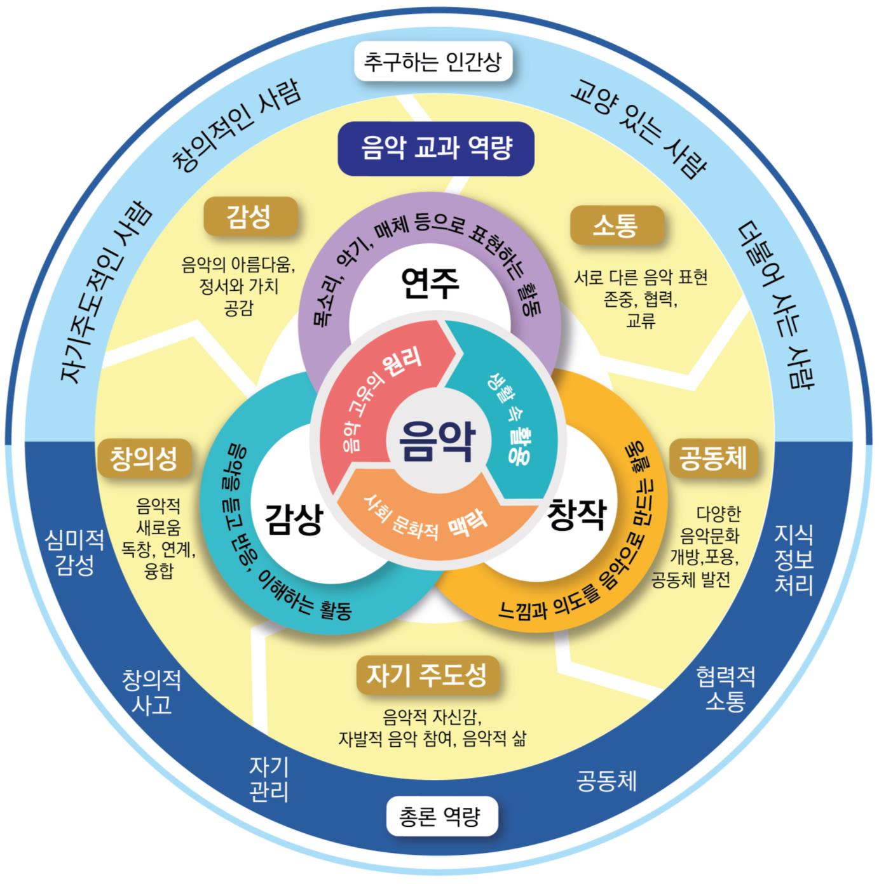
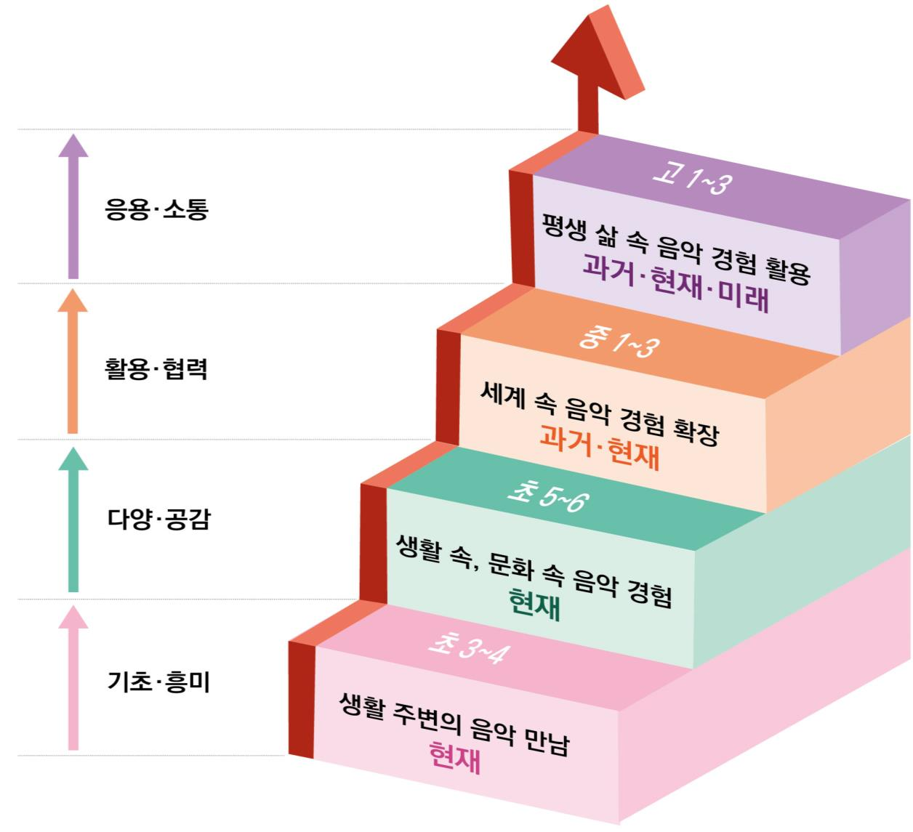

# 음악

# 음악

### 교육과정 설계의 개요

음악 교과 교육과정은 학생들이 감성, 창의성, 자기주도성을 발휘하여 음악 활동을 하며, 삶 속 공동체 내에서 음악적으로 소통할 수 있도록 하는 데 중점을 두고 설계되었다.

[그림 1] 음악 교과 교육과정의 설계 개요

이에 따라 음악과 교육과정은 총론의 인간상 및 핵심 역량과 연계하여 ‘감성 역량, 창의성 역량, 자기주도성 역량, 공동체 역량, 소통 역량’을 음악 교과 역량으로 설정하고, 영역 및 내용 체계를 구성함으로써 핵심 아이디어 기반 역량 함양 교육과정이 체계적으로 구현되도록 하였다. 음악 교과 역량은 총론의 핵심 역량 중 ‘심미적 감성 역량, 창의적 사고 역량, 자기관리 역량, 공동체 역량, 협력적 소통 역량’ 등 각 역량을 음악 교과의 특성에 맞게 재구성한 것이며, 총론의 ‘지식정보처리 역량’은 음악 교과의 영역 및 내용 체계 전반에 연계되도록 구성하였다.

영역은 삶 속 음악 활동의 특성을 근간으로 하여 목소리와 악기 등으로 연주하고, 음악을 감상하며, 생각한 것을 음악으로 창작하는 활동으로 구성된다. ‘연주-감상-창작’의 세 영역 활동은 생활 속 ‘맥락’에서 음악의 고유한 ‘원리나 특성’에 따라 이루어지고 다양하게 ‘활용’된다. 따라서 ‘영역별 핵심 아이디어’는 원리, 맥락, 활용이라는 세 가지 측면에서 문장으로 진술된다. 연주, 창작, 감상의 세 영역별 내용 체계는 다음과 같다.

<표 1> 음악 교과 내용 체계의 구성

<table>
<tr><th colspan="2">영역명</th><th>연주</th><th>감상</th><th>창작</th></tr>
<tr><td rowspan="3">핵 심 아 이 디어</td><td>진술문① 원리</td><td>음악은 고유한 방식과 원리에 따라 ... 표현한 것이다.</td><td>음악은 고유한 방식과 원리에 따라 ... 청각적 ... 것이다.</td><td>음악은 고유한 방식과 원리에 따라 ... 만들어낸 것이다.</td></tr>
<tr><td>진술문② 맥락</td><td>연주는 ... 사회문화적 배경에 따라 ...</td><td>수용과 반응은 ... 사회문화적 배경에 따라 ...</td><td>창작은 ... 사회문화적 배경에 따라 ...</td></tr>
<tr><td>진술문③ 활용</td><td>생활 속에서 ... 활용하여 함께 경험하며 소통한다.</td><td>생활 속에서 ... 발견하고 공감한다.</td><td>생활 속에서 ... 활용하여 ... 음악을 구성하며 기여한다.</td></tr>
<tr><td colspan="2">1) 지식⋅이해</td><td>① 음악 범위 ② 내용적⋅절차적 지식 ③ 학습 요소⋅관점</td><td colspan="2">연주, 감상, 창작할 대상으로서의 음악 범위 음악 요소/원리/개념 등 내용적 지식 + 연주/창작 방법 등 절차적 지식 연주, 감상, 창작 학습 시 초점을 두어야 할 포괄적 요소⋅관점</td></tr>
<tr><td colspan="2">2) 과정⋅기능</td><td colspan="3">신체적⋅실천적 기능(노래/연주 등), 인지적⋅연계적 기능(설명/활용 등)</td></tr>
<tr><td colspan="2">3) 가치⋅태도</td><td colspan="3">개인의 음악적 태도⋅가치(흥미 등), 사회적⋅문화적⋅정서적 가치(존중/협력 등)</td></tr>
</table>

영역별 내용 체계는 핵심 아이디어를 중심으로 ‘지식⋅이해’, ‘과정⋅기능’, ‘가치⋅태도’의 세 범주별 내용 요소로 구성되는데, 이는 성취기준의 근간이 된다. 즉 ‘지식⋅이해’, ‘과정⋅기능’, ‘가치⋅태도’에 제시된 내용을 다양하게 결합하여 진술하면 성취기준이 되는 것이다.

먼저 ‘지식⋅이해’는 각 영역에서 다루어야 할 ①음악 유형이나 장르를 포괄하는 음악 범위, ②내용적 지식과 더불어 음악 교과에서는 수행 자체가 주요 지식이고 절차가 중요하다는 점에서 절차적 지식, ③학습 시 초점을 두어야 할 핵심 요소나 관점으로 구성된다. ‘과정⋅기능’은 영역별 이해를 위한 방법, 과정, 전략으로서 신체적⋅실천적⋅인지적⋅연계적 기능으로, ‘가치⋅태도’는 개인적 및 사회적 측면에서 요구되는 음악적 태도와 가치화로 구성된다. 이렇게 구성된 영역별 내용 체계는 실제적 수행이 중요하다는 점에서 연주 영역을 먼저 제시하고, 새로운 음악을 만드는 창작 영역은 연주, 감상 등 다른 활동을 기반으로 보다 쉽게 수행할 수 있다는 점에서 마지막에 제시된다.

학년군 및 학교급별 내용 구성과 위계의 주요 사항은 다음과 같다. 학생의 자기주도성 뿐만 아니라 교사의 문서 활용 다양성 및 자율성도 보장하기 위해 음악 교과 목표 달성을 위한 포괄적⋅핵심적인 내용을 중심으로, 다양한 내용의 균형을 고려하여 설계하였다. 이러한 내용의 위계는 학습자를 중심으로 공간(생활-세계)과 시간(현재-과거-미래)적 관점에서 학습 영역을 확장해가며 추가 및 심화하는 방식으로 구성하였다.

[그림 2] 음악 교과 교육과정의 학년군별 내용 구성과 위계

### 1. 성격 및 목표

가. 성격

음악은 소리를 통해 인간의 다양한 감정과 생각을 표현하는 예술이면서 사회⋅문화적 양상과 변화하는 시대상을 반영하는 인간 활동의 산물이다. 인간은 노래를 부르고 악기를 연주하거나 음악을 듣고 만드는 활동을 통해 음악의 아름다움을 만끽하면서 다른 것으로 대체할 수 없는 경험을 한다. 또한 인간은 음악성을 계발하면서 새로운 음악적 아이디어를 떠올리거나 다양한 경험에 대한 느낌과 생각을 담은 음악 표현 활동을 통해 상상력과 창의성을 표출할 뿐만 아니라, 소리와 음악이 주는 즐거움이나 기쁨 등을 통해 정서적 안정감과 행복감을 느낀다.

음악 활동은 이처럼 개인의 음악적⋅정서적 발달뿐만 아니라 다양한 전인적 성장도 이끈다. 인간은 생활 속에서의 협력적 음악 경험을 통해 자존감⋅책임감⋅균형감 등의 인성을 함양하고, 지역⋅세대⋅계층 간 음악적 소통을 통해 공동체의 가치관을 이해하는 등 사회적으로 성장한다. 또한 인간의 음악적⋅정서적⋅사회적 성장을 근간으로 하는 공동체의 음악 문화는 인간, 문화, 사회를 통찰하고 공감할 수 있는 안목을 형성하는 데에 도움을 주며, 문화의 계승과 사회의 발전을 이끈다.

최근 변화하는 사회 속에서 음악의 가치와 영향력이 더욱 확대되고 있다. 전통적⋅현대적⋅예술적⋅실용적 가치를 모두 아우르는 우리 음악 문화는 우리나라의 위상을 세계적으로 드높이고, 음악에 대한 시각과 안목을 넓혀 다양한 문화 산업 발전을 선도한다. 또한 다양한 미디어를 활용하여 음악 활동을 함으로써 디지털 소양을 함양하고 미래 디지털 기반 사회의 발전을 도모한다. 나아가 음악을 통한 표현력과 공감력은 사회와 문화 속에서의 음악의 의미와 가치를 확장시켜 자연 환경이나 생태계의 지속가능한 발전에 공감하는 감수성으로 전이되어 학습자가 더불어 살아갈 미래 삶을 대비하는 데에도 기여한다.

음악 교과는 이처럼 인간⋅문화⋅사회⋅산업⋅과학⋅환경적 측면에서 다양한 의미와 가치를 지니는 음악을 포괄적이며 효율적으로 경험하도록 함으로써 학생의 음악적 발달을 이끌어 살아가는 데에 필요한 미래 역량을 길러주는 교과이다. 또한 음악 교과는 주도적인 음악 활동을 하며 음악을 생활화하고, 다양한 분야와 연계한 창의적인 음악 활동을 통해 다른 사람과 소통하는 전인적 성장을 촉진하는 교과이다.

이런 점에서 초등학교⋅중학교 <음악> 과목은 학생이 음악의 본질과 다양한 가치를 주도적으로 경험함으로써 생활 속에서 음악을 활용하여 사회⋅문화적 안목과 가치관을 주체적으로 형성해 가도록 기여해야 한다. 이를 위해 <음악> 과목의 얼개는 학생들로 하여금 감성, 창의성, 자기주도성을 가지고 연주, 감상, 창작 등의 음악 활동을 하며 민주적 공동체의 이해와 발전을 도모하고 문화적 소통을 촉진할 수 있도록 구성하였다.

초등학교에서는 생활 속 음악의 기초 지식, 기능, 태도를 바탕으로 음악을 학습하고 스스로 즐길 수 있는 능력을 개발하여 음악 학습자 겸 향유자로 성장하도록 하는 데에 중점을 둔다. 중학교에서는 사회나 문화 속 음악의 다양한 지식, 기능, 태도를 바탕으로 음악을 가치화하고 학생의 음악적 발달을 도모하여 미래지향적 음악 문화의 능동적 일원으로 성장하도록 하는 데에 중점을 둔다.

나. 목표

초등학교와 중학교의 <음악> 과목은 음악의 핵심적 지식⋅이해, 과정⋅기능, 가치⋅태도를 포괄하는 다양한 음악 활동을 통하여 감성, 창의성, 자기주도성을 기르고, 일상생활 속 다양한 공동체 안에서 소통할 수 있는 인간 육성을 목표로 한다.

가. 음악의 아름다움이나 가치를 인식하고 정서적 안정을 느낄 수 있는 감성을 기른다.

나. 음악의 의미를 탐색하고 새롭게 표현하며 만들어 갈 수 있는 창의성을 기른다.

다. 생활 속 다양한 음악 경험에 스스로 참여할 수 있는 자기주도성을 기른다.

라. 협력적 음악 활동을 통해 서로 다른 음악 표현을 존중하며 생활 속에서 소통한다.

마. 다양한 음악 문화와 음악의 역할을 인식하며 자신이 속한 공동체에 기여한다.

### 2. 내용 체계 및 성취기준

가. 내용 체계

(1) 연주

<table>
<tr><th>핵심 아이디어</th><th colspan="3">⋅음악은 고유한 방식과 원리에 따라 인간의 느낌, 생각, 경험을 다양한 소리의 어울림으로 표현한 것이다. ⋅개인적 혹은 협력적 음악 연주는 인간의 감수성과 사회⋅문화적 배경에 따라 다양한 행위 과정으로 나타난다. ⋅인간은 생활 속에서 다양한 음악 매체와 표현 방법을 활용하여 함께 경험하며 소통한다.</th></tr>
<tr><td rowspan="3">구분 범주</td><td colspan="3">내용 요소</td></tr>
<tr><td colspan="2">초등학교</td><td>중학교</td></tr>
<tr><td>3~4학년</td><td>5~6학년</td><td>1~3학년</td></tr>
<tr><td rowspan="3">[지식⋅이해]</td><td>⋅생활 속의 음악</td><td>⋅간단한 악곡의 연주 형태</td><td>⋅다양한 음악의 연주 형태</td></tr>
<tr><td>⋅기초적인 음악 요소 ⋅자세와 주법</td><td>⋅음악 요소 ⋅주법과 표현 기법</td><td>⋅음악 요소, 음악적 특징 ⋅다양한 주법과 표현 기법</td></tr>
<tr><td>⋅느낌, 여러 소리</td><td>⋅어울림, 여러 악기</td><td>⋅소리의 상호작용</td></tr>
<tr><td>[과정⋅기능]</td><td>⋅노래 부르거나 악기 연주하기 ⋅신체로 표현하고 놀이하기 ⋅발표하고 이야기하기</td><td>⋅노래 부르거나 악기 연주하기 ⋅다양한 방법으로 표현하기 ⋅발표하고 돌아보기</td><td>⋅노래와 악기 연주 향상하기 ⋅매체를 활용하여 표현하기 ⋅발표하고 평하기</td></tr>
<tr><td>[가치⋅태도]</td><td>⋅연주를 즐기는 태도 ⋅연주에 대한 관심</td><td>⋅음악으로 함께하는 태도 ⋅연주 준비와 참여</td><td>⋅음악으로 협력하는 태도 ⋅연주 문화 인식과 참여</td></tr>
</table>

(2) 감상

<table>
<tr><th>핵심 아이디어</th><th colspan="3">⋅ 음악은 고유한 방식과 원리에 따라 다양한 속성을 청각적 형태로 구현한 것이다. ⋅ 음악적 수용과 반응은 인간의 감수성과 사회⋅문화적 배경에 따라 다양하게 나타난다. ⋅ 인간은 생활 속에서 다양한 음악 경험을 통해 미적 가치와 의미를 발견하고 공감한다.</th></tr>
<tr><td rowspan="3">구분 범주</td><td colspan="3">내용 요소</td></tr>
<tr><td colspan="2">초등학교</td><td>중학교</td></tr>
<tr><td>3~4학년</td><td>5~6학년</td><td>1~3학년</td></tr>
<tr><td rowspan="3">[지식⋅이해]</td><td>⋅다양한 종류의 음악 ⋅지역의 음악 문화유산</td><td>⋅다양한 종류와 문화권의 음악 ⋅우리나라 음악 문화유산</td><td>⋅다양한 시대⋅사회⋅문화권의 음악 ⋅유네스코에 등재된 우리 음악문화유산</td></tr>
<tr><td>⋅기초적인 음악 요소 ⋅음악적 특징</td><td>⋅음악 요소 ⋅음악적 특징, 음악의 간단한 구성</td><td>⋅음악 요소 ⋅음악적 특징, 음악의 구성</td></tr>
<tr><td>⋅느낌, 분위기, 쓰임</td><td>⋅느낌, 배경, 활용</td><td>⋅감성, 다양성, 배경, 역할</td></tr>
<tr><td>[과정⋅기능]</td><td>⋅반응하며 듣기 ⋅탐색하고 발견하기 ⋅묘사하거나 이야기하기</td><td>⋅감지하며 듣기 ⋅인식하고 구별하기 ⋅설명하기</td><td>⋅집중하여 듣기 ⋅분석하고 파악하기 ⋅비교하고 평가하기</td></tr>
<tr><td>[가치⋅태도]</td><td>⋅소리와 음악을 즐기는 태도 ⋅음악에 대한 호기심</td><td>⋅음악의 아름다움에 대한 인식 ⋅음악에 대한 공감</td><td>⋅음악에 대한 존중 ⋅음악의 다양한 가치 인식</td></tr>
</table>

(3) 창작

<table>
<tr><th>핵심 아이디어</th><th colspan="3">⋅음악은 고유한 방식과 원리에 따라 인간의 무한한 상상과 가능성을 탐구하여 만들어낸 것이다. ⋅개인적 혹은 협력적 음악 창작은 인간의 감수성과 사회⋅문화적 배경에 따라 다양한 과정과 결과물로 나타난다. ⋅인간은 생활 속에서 다양한 매체와 방법을 활용하여 자기 주도적으로 음악을 구성하며 기여한다.</th></tr>
<tr><td rowspan="3">구분 범주</td><td colspan="3">내용 요소</td></tr>
<tr><td colspan="2">초등학교</td><td>중학교</td></tr>
<tr><td>3~4학년</td><td>5~6학년</td><td>1~3학년</td></tr>
<tr><td rowspan="3">[지식⋅이해]</td><td>⋅소리와 음악</td><td>⋅간단한 음악</td><td>⋅간단한 형식의 음악</td></tr>
<tr><td>⋅기초적인 음악 요소 ⋅간단한 악보</td><td>⋅음악 요소 ⋅기초적인 기보, 음악 매체</td><td>⋅음악 요소, 음악적 특징 ⋅기보법(오선보, 정간보 등), 음악 매체</td></tr>
<tr><td>⋅느낌, 상상</td><td>⋅느낌, 아이디어</td><td>⋅의도, 아이디어</td></tr>
<tr><td>[과정⋅기능]</td><td>⋅즉흥적으로 표현하기 ⋅부분적으로 바꾸기 ⋅모방하여 나타내기</td><td>⋅떠올리며 표현하기 ⋅간단한 조건에 따라 바꾸기 ⋅활용하여 만들기</td><td>⋅적용하여 창작하기 ⋅조건에 따라 바꾸기 ⋅연계하여 만들고 활용하기</td></tr>
<tr><td>[가치⋅태도]</td><td>⋅음악에 대한 흥미 ⋅음악의 새로움을 즐기는 태도</td><td>⋅음악에 대한 자신감 ⋅음악에 대한 열린 태도</td><td>⋅자기 주도적인 태도 ⋅저작권, 책임감 인식</td></tr>
</table>

나. 성취기준

[중학교 1∼3학년]

(1) 연주

[9음01-01] 다양한 주법과 표현 기법을 향상시켜 노래나 악기로 개성 있게 연주한다.
[9음01-02] 음악 요소와 음악적 특징을 살려 노래나 악기로 발표하고 평한다.
[9음01-03] 소리의 상호작용을 인식하고 매체를 활용하여 함께 표현한다.
[9음01-04] 생활 속 다양한 형태의 연주에 참여하고 전통과 현대의 연주 문화 다양성을 인식한다.

(가) 성취기준 해설

• [9음01-01] 이 성취기준은 노래 부르기와 악기 연주의 음악 표현 활동을 위한 기능을 보다 확장 및 향상시키기 위해 설정하였다. 목소리와 악기의 다양한 주법이나 국악, 서양음악, 대중음악, 세계음악 등 음악 고유의 표현 기법을 익히고 향상시켜 아름답고 풍부한 소리로 개성 있게 연주하도록 한다. 또한 자신의 연주 역량을 향상시키기 위하여 스스로 연습하고 그 과정을 주도적으로 관리하는 태도를 형성하는 데 중점을 둔다.

• [9음01-02] 이 성취기준은 악곡의 다양한 음악 요소와 음악적 특징을 파악하여 노래나 악기 연주 활동에 적용하도록 하기 위해 설정하였다. 악곡에서 드러나는 특성들을 살려 연주하고, 나아가 자신들의 연주 활동을 돌아보며 다양한 관점에서 서로 평해 봄으로써 공동체 속에서 음악으로 소통하는 데 중점을 둔다.

• [9음01-03] 이 성취기준은 다양한 양상으로 나타나는 소리의 상호작용을 이해하고 함께 하는 음악 표현의 즐거움을 경험하도록 하기 위해 설정하였다. 목소리, 악기, 신체, 물체, 가상 악기 등 연주에 사용되는 다양한 매체를 활용하여 여러 양상으로 나타나는 소리의 어울림을 이해하고, 이를 바탕으로 다른 사람과 함께 연주 활동을 해봄으로써 협력적 음악 표현을 경험할 수 있도록 하는 데 중점을 둔다.

• [9음01-04] 이 성취기준은 학생들이 생활 속 연주 활동에 주도적으로 참여하여 다양한 연주 문화를 인식하도록 하기 위하여 설정하였다. 학교, 마을, 지역의 행사나 축제에 온⋅오프라인 네트워크를 활용하여 다양한 형태의 연주를 계획하거나 참여할 수 있도록 한다. 이를 통해 국악, 서양음악, 대중음악, 세계음악 등 전통에서 현대까지 다양하게 변화⋅발전하는 연주 문화를 인식하고 생활 속에서 주도적으로 음악 활동에 참여하는 태도를 기르는 데 중점을 둔다.

(나) 성취기준 적용 시 고려 사항

• 음악 요소, 주법과 표현 기법 등 초등학교에서 학습한 내용을 포함하되, 중학교에서는 연주 기능 향상과 다양한 표현의 확장을 통해 느낌과 정서, 경험, 생각 등을 소리의 상호작용으로 풍부하게 표현하며 음악적 감성을 기르도록 한다.

• 연주 실력의 향상을 위하여 스스로 목표를 세워 연습하며 그 과정을 주도적으로 관리할 수 있도록 체크리스트, 연습 일지, 포트폴리오 등을 활용할 수 있다.

• 연주에 사용되는 다양한 매체를 활용하여 협력적으로 음악 표현 활동을 수행하도록 함으로써 공동체 속에서 음악으로 소통하고 함께하는 경험을 할 수 있도록 한다.

• 악곡에 대한 이해를 바탕으로 음악적 특징을 살려 노래나 악기 연주로 발표하고, 발표 과정에 대해 성찰하며 동료들과 함께 평가해 보도록 한다.

• 음악으로 협력하는 태도에 대한 성취기준은 수행 과정에 대한 관찰 기록표를 활용할 수 있으며, 교사의 평가뿐 아니라 상호 평가, 자기 평가 등 학생의 평가를 병행할 수 있다.

• 연주 문화 인식과 참여에 대한 성취기준은 다양한 연주 문화에 대해 조사 및 발표하기, 연주회나 콘서트를 관람하고 감상문 작성하기, 생활 속 축제나 행사 등에 연주로 참여할 수 있도록 연주 참여 계획서 작성하기, 연주 참여 후 소감문 작성하기 등의 다양한 활동으로 나타내도록 할 수 있다.

(2) 감상

[9음02-01] 음악을 듣고 다양한 음악 요소에 집중하여 분석한다.
[9음02-02] 다양한 시대와 문화권의 음악을 듣고 음악적 특징과 음악의 구성을 파악한다.
[9음02-03] 다양한 시대⋅사회⋅문화권의 음악을 듣고 음악의 배경과 역할을 비교한다.
[9음02-04] 생활 속에서 음악을 들으며 다양한 감성과 가치를 인식하고 존중한다.
[9음02-05] 유네스코에 등재된 우리나라의 음악 문화유산을 찾아 듣고, 세계 속 국악의 위상과 문화적 가치를 인식한다.

(가) 성취기준 해설

• [9음02-01] 이 성취기준은 감상곡에 포함된 다양한 음악 요소 분석을 통해 악곡을 이해하는 능력을 함양하도록 하기 위해 설정하였다. 악곡 감상을 통해 음악 요소들이 음악으로 구현된 양상을 찾아내고 이를 여러 가지 방법으로 설명하거나 표현하도록 하는 데 중점을 둔다.

• [9음02-02] 이 성취기준은 감상곡의 음악 내적 특징과 악곡의 전반적인 구성을 인식하고 파악하는 능력을 기르도록 하기 위해 설정하였다. 다양한 종류의 음악을 듣고 시대별⋅문화권별 음악의 특징과 전반적 구성을 설명하거나 표현하는 데 중점을 둔다.

• [9음02-03] 이 성취기준은 다양한 시대, 사회, 문화권을 기반으로 한 음악의 외적 배경과 역할을 이해하여 음악 감상 활동과 연계하는 능력을 기르도록 하기 위해 설정하였다. 음악의 다양한 활용이나 배경을 시대⋅사회⋅문화적 맥락에서 조사하여 비교함으로써, 사회⋅문화 속에서 음악이 갖는 다양한 의미와 역할 등을 파악하는 데 중점을 둔다.

• [9음02-04] 이 성취기준은 생활 속 다양한 음악 감상 활동을 통해 음악적 감수성을 기르고 이를 내면화⋅가치화하는 태도를 형성하도록 하기 위해 설정하였다. 여러 매체를 활용하여 생활 속에서 음악을 찾아 들으며 다양한 느낌과 정서를 경험하고 이를 공유함으로써 음악에 대한 서로 다른 감성과 가치를 인식하고 존중하는 데 중점을 둔다.

• [9음02-05] 이 성취기준은 유네스코에 등재된 음악 문화유산을 찾아 들어보고, 세계 속 국악의 문화적 가치를 인식하도록 하기 위해 설정하였다. 유네스코 무형문화유산으로 등재된 국악을 경험하고 우리 전통문화의 고유성을 이해하며, 국악이 지닌 문화적 가치와 세계 속의 국악의 위상을 인식하도록 하는 데 중점을 둔다.

(나) 성취기준 적용 시 고려 사항

• 음악 요소, 음악의 종류와 특징 등 초등학교에서 학습한 내용을 포함하되, 중학교에서는 음악의 내⋅외적 측면을 연결지어 더욱 다양한 범위와 수준의 음악을 구별, 분석, 비교, 평가 등의 사고 과정을 통해 이해하고 경험하도록 함으로써 음악적 감성을 기르도록 한다.

• 다양한 음악을 비교 감상하며 악곡별 음악 요소가 나타내는 음악 양상의 차이를 파악하고, 다양한 시대별⋅문화권별 음악의 공통점과 차이점 등을 설명하거나 표현함으로써 음악적 이해의 폭을 넓히도록 구성한다.

• 시대⋅사회⋅문화적 맥락 속에서 음악을 감상하고 자신이 속한 공동체의 음악과 연계하여 비교하는 활동을 통해, 산업, 경제, 생태환경 등에서 나타나는 음악의 다양한 역할을 이해하며 음악의 내적 측면과 외적 측면을 연결지어 볼 수 있도록 구성한다.

• 각 음악이 갖는 고유한 느낌과 정서, 서로 다른 감성과 가치 등을 존중하면서, 여러 매체를 활용하여 생활 속에서 주도적으로 음악을 찾아 들으며 음악적 경험을 확장할 수 있도록 구성한다.

• 감상에서 평가는 실음을 중심으로 악곡에 대한 이해뿐만 아니라 음악을 감상하는 태도나 가치를 포괄적으로 평가할 수 있도록 실음 지필 평가, 관찰 평가, 토의⋅토론 평가, 포트폴리오 및 보고서 등의 다양한 방법을 활용할 수 있다.

(3) 창작

[9음03-01] 음악적 의도나 아이디어를 여러 매체나 방법에 적용하여 자기 주도적으로 창작한다.
[9음03-02] 오선보, 정간보 등의 기보법을 활용하여 조건에 따라 악곡의 일부를 바꾼다.
[9음03-03] 음악의 요소와 특징을 활용하여 간단한 형식의 음악을 만든다.
[9음03-04] 생활 속의 영역과 연계하여 음악을 만들고 활용하며 책임감을 갖는다.

(가) 성취기준 해설

• [9음03-01] 이 성취기준은 음악적 의도나 아이디어를 독창적으로 사고하고 자유롭게 발산하는 능력을 기르도록 하기 위해 설정하였다. 음악의 소재나 주제에 따라 아이디어를 떠올려 보고, 창작에 사용되는 다양한 매체를 활용하여 노래나 연주, 신체표현 등 자신이 표현하고자 하는 방식으로 나타낼 수 있도록 주도적으로 계획하고 창작하도록 하는 데 중점을 둔다.

• [9음03-02] 이 성취기준은 다양한 기보법에 대한 이해를 바탕으로 음악 창작 능력을 기르도록 하기 위해 설정하였다. 음악 표현과 소통을 위한 기보의 필요성을 인식하고, 오선보나 정간보 등 기존의 기보법과 앱이나 프로그램 등 다양한 소프트웨어를 활용하여 음악 요소나 주제 등의 조건에 따라 악곡의 일부를 변형하며 새롭게 만들어보는 데 중점을 둔다.

• [9음03-03] 이 성취기준은 창작에 필요한 음악 요소를 활용하여 자신이 의도한 음악적 특징이 드러나도록 국악, 서양음악, 대중음악 등 간단한 형식의 음악으로 표현하는 능력을 기르도록 하기 위해 설정하였다. 혼자 또는 여럿이 창작 의도에 따라 음악 요소를 선택하고 구조화하여 간단한 형식의 음악을 만들어 공유함으로써 음악으로 소통하는 태도를 기르는 데 중점을 둔다.

• [9음03-04] 이 성취기준은 생활 속의 다양한 영역 및 타 교과와 연계하여 음악 산출물을 주체적으로 만들고 활용하며 창작과 관련된 윤리 의식과 책임감을 기르도록 하기 위해 설정하였다. 실생활과 관련된 음악 영상이나 음악극 등 여러 형태의 음악을 창작하고 활용하며 다양한 분야를 경험하도록 한다. 또한 음악 창작에서 저작권의 중요성과 필요성을 인식하여 자신과 타인의 음악 산출물에 대한 책임감 있는 태도를 형성함으로써 서로의 음악을 존중하고 소통하도록 하는 데 중점을 둔다.

(나) 성취기준 적용 시 고려 사항

• 음악 요소나 기보의 기초 등 초등학교에서의 학습한 내용을 포함하되, 중학교에서는 매체 등을 포함한 다양한 기보와 구성 방법을 익히고 자신의 의도와 아이디어를 적용하여 음악을 창작하도록 함으로써 음악적 창의성을 기르도록 한다.

• 창작에서 사용되는 다양한 매체를 활용하여 혼자 또는 여럿이 창작 의도에 따라 음악 요소를 선택하고 구조화하여 음악을 만드는 과정을 통해 디지털 소양을 함양하고, 그 결과를 공유하며 음악으로 소통하는 경험을 할 수 있도록 구성한다.

• 생활 속 음악의 쓰임과 효과를 이해하고, 안전, 건강, 인성, 환경, 생태전환 등을 포함한 다양한 주제에 따라 아이디어를 구상하여 주도적으로 음악을 만들거나 활용함으로써 창작의 주체로서 음악을 생활화할 수 있도록 구성한다.

• 타 교과나 생활 속에서 접할 수 있는 여러 영역을 활용 및 연계하여 음악 영상이나 음악극 등의 활동을 경험하도록 하고, 이를 통해 진로 탐색의 기회를 갖도록 한다.

• 자기 주도적인 태도와 관련된 성취기준은 학생의 수업 참여도를 평가 기준으로 삼아 아이디어 구상, 창작 과정, 결과물 산출에 대한 창작의 모든 과정에서 포트폴리오, 체크리스트, 창작 일지 등을 활용하여 평가할 수 있다.

• 책임감 인식과 관련된 성취기준은 저작권과 관련된 사례 조사하기, 저작권의 중요성과 필요성에 대해 토의⋅토론하기, 생활 속 저작권 존중 실천 방안 발표하기, 음악 산출물 의도 설명하기, 타인의 음악 산출물에 대해 평하기 등을 활용하여 평가할 수 있다.

※ 위 내용 체계 및 성취기준의 ‘음악 요소’는 아래 표와 같이 활용할 수 있다.

| [초등학교 3∼4학년] | [초등학교 5∼6학년] | [중학교 1∼3학년] |
| --- | --- | --- |
| ⋅박, 박자 ⋅장단, 장단의 세 ⋅음의 길고 짧음 ⋅간단한 리듬꼴 ⋅장단꼴 ⋅말붙임새 | ⋅박, 박자 ⋅장단, 장단의 세 ⋅여러 가지 리듬꼴 ⋅장단꼴 ⋅말붙임새 | ⋅여러 가지 박자 ⋅장단, 장단의 세 ⋅여러 가지 박자의 리듬꼴 ⋅여러 가지 장단의 장단꼴 ⋅말붙임새 |
| ⋅음의 높고 낮음 ⋅차례가기와 뛰어가기 ⋅시김새 | ⋅음이름, 계이름, 율명 ⋅장음계, 단음계 ⋅여러 지역의 토리 ⋅시김새 | ⋅여러 가지 음계 ⋅여러 지역의 토리 ⋅여러 가지 시김새 |
| ⋅소리의 어울림 | ⋅주요 3화음 ⋅다양한 소리의 어울림 | ⋅딸림7화음 ⋅다양한 소리의 어울림, 종지 |
| ⋅형식(메기고 받는 형식, ab 등) | ⋅형식(긴자진 형식, 시조 형식, aba, AB 등) | ⋅형식(연음 형식, 한배에 따른 형식, 론도, ABA, 변주곡 등) |
| ⋅셈여림 | ⋅셈여림의 변화 | ⋅셈여림의 변화 |
| ⋅빠르기/한배 | ⋅빠르기의 변화/한배의 변화 | ⋅빠르기의 변화/한배의 변화 |
| ⋅목소리, 물체 소리, 타악기의 음색 | ⋅관악기, 현악기의 음색 | ⋅여러 가지 음색 |

### 3. 교수⋅학습 및 평가

가. 교수⋅학습

(1) 교수⋅학습의 방향

(가) <음악> 과목의 교육과정에서 제시하는 성격과 목표, 내용 체계와 성취기준을 바탕으로 깊이 있는 학습이 유의미한 방식으로 경험될 수 있도록 하며, 학습자의 생활과 연계하여 감성 역량, 창의성 역량, 자기주도성 역량, 공동체 역량, 소통 역량을 함양할 수 있는 지도 방안을 수립하도록 한다.

(나) <음악> 과목의 교수⋅학습은 다양한 음악 활동을 통해 음악의 아름다움을 체험하고, 영역별 지식⋅이해, 과정⋅기능, 가치⋅태도가 통합적으로 실생활 맥락에서 수행되도록 한다. 또한 <음악> 수업에 능동적으로 참여하여 음악적 이해가 실제적 활용으로 이어질 수 있도록 지도 방안을 마련한다.

(다) <음악> 과목의 전체 구조와 맥락 속에서 핵심 아이디어를 중심으로 학습 내용 간 관계와 의미를 파악할 수 있도록 하고, 음악 학습 능력을 다양한 상황에 적용하여 주도적으로 문제를 해결할 수 있는 지도 방안을 고려하도록 한다.

[초등학교]

• 연주 영역에서는 교육적⋅예술적⋅문화적⋅실용적 가치를 고려한 다양한 악곡을 활용하여 학습자의 생활과 연계한 노래와 악기 연주에 즐겁게 참여하고 공동체와 소통할 수 있도록 구성한다.

• 감상 영역에서는 교육적⋅예술적⋅문화적⋅실용적 가치를 고려한 다양한 감상곡을 통해 음악을 듣고 반응함으로써 감성을 기를 수 있도록 구성한다.

• 창작 영역에서는 음악의 고유한 방식과 원리에 따라 자신의 느낌과 상상 등을 음악으로 새롭게 표현하고 음악에 대한 긍정적인 경험과 자신감을 가질 수 있도록 구성한다.

[중학교]

• 연주 영역에서는 교육적⋅예술적⋅실용적 가치뿐 아니라 역사적⋅문화적 가치를 함께 고려한 다양한 악곡을 활용하여 학습자의 생활과 연계한 노래와 악기 연주에 스스로 참여하고 공동체와 소통하며 연주하는 즐거움을 가질 수 있도록 구성한다.

• 감상 영역에서는 교육적⋅예술적⋅실용적 가치뿐 아니라 역사적⋅문화적 가치를 함께 고려한 다양한 감상곡을 통해 음악을 듣고 반응함으로써 음악의 다양한 특성을 알고 감성을 기를 수 있도록 구성한다.

• 창작 영역에서는 음악의 고유한 방식과 원리에 따라 자신의 느낌과 상상, 의도와 아이디어 등을 음악으로 새롭게 표현할 수 있음을 알고 음악에 대한 자기주도성과 창의성을 기를 수 있도록 구성한다.

(라) 학생들의 다양한 특성과 발달 수준을 고려하여 <음악> 과목에서의 학생 맞춤형 수업 혹은 개별화 수업 방안을 마련하며 수업 설계 과정이나 학습 자료와 학습 활동의 선택 과정 등에 학생들이 능동적으로 참여할 수 있는 기회를 제공한다. 또한 모든 음악 활동에서 서로 존중되는 분위기를 형성할 수 있도록 하며, 특히 배움이 느린 학습자, 다문화 학생, 특수 학생 등을 배려한다.

(마) 온⋅오프라인에서 음악 수업의 연속성을 감안하여 <음악> 과목의 교수⋅학습을 계획하도록 하며, 디지털 환경을 고려한 지도 전략을 세우고 디지털 기기와 미디어를 <음악> 교수⋅학습의 내용과 특성에 적합하게 활용하는 방안을 구성하도록 한다.

(바) 초등학교 1\~2학년 통합 교과와 3\~4학년 <음악> 과목의 연계, 초등학교와 중학교의 학교급 간 연계 등을 고려하여 지도 방안을 구성한다.

(사) 안전⋅건강, 인성, 진로, 민주 시민, 인권, 다문화, 통일, 독도, 경제⋅금융, 환경⋅지속가능발전 등의 범교과 학습 주제나 타 교과 및 영역과 연계하여 지도 방안을 구성할 때에는 음악과의 성격과 특성에 부합하도록 한다.

(아) 음악 관련 진로나 직업을 탐색하거나 체험할 수 있도록 연주, 감상, 창작 영역을 통합하여 진로연계교육 방안을 마련하도록 한다.

(자) 함께 참여하는 연주⋅감상 활동 시, 다수의 학생과 군중들이 밀집한 곳에서 질서를 유지하여 표현⋅관람 활동이 안전하게 진행될 수 있도록 안전 수칙 안내 등 지도⋅관리에 힘쓴다.

(2) 교수⋅학습 방법

(가) <음악> 과목의 교육과정 성격과 목표 및 역량 함양에 가장 적합한 최신 교수⋅학습 유형과 방법을 선정하며, 원칙과 중점에 따라 내용 체계의 지식⋅이해, 과정⋅기능, 가치⋅태도를 종합적으로 아우를 수 있도록 한다. 또한 학습자 상황과 교수⋅학습 환경 등의 맥락에 맞추어 성취기준을 재구성할 수 있다.

실기 수업, 토의⋅토론 학습, 협동⋅협력 수업, 탐구 학습, 발견 학습, 프로젝트 학습, 문제해결 학습, 스토리텔링 기반 학습, 사례 중심 학습, 역할놀이 학습, 블랜디드 학습, 거꾸로 학습, 이러닝, 스마트 러닝, 모바일 학습, 인공지능융합 학습 등

(나) 등교-원격 수업을 연계할 때 교수·학습 과정에서 음악적 소통과 협력 활동의 원활한 진행을 통해 음악 교사의 실재감을 충분히 느낄 수 있도록 하며, 디지털 플랫폼 활용 수업 전략 방안을 마련하고 온라인 환경에서의 음악 활동과 의견 공유로 학습의 폭이 확장될 수 있도록 한다.

(다) <음악> 과목의 교수⋅학습은 실음을 중심으로 질 높은 음향이 구현될 수 있도록 하며 최신의 디지털 음악실 환경을 구축하고, 인공지능, 가상악기, 메타버스 등을 활용한 실감형 음악 학습 콘텐츠와 자료를 바탕으로 다양한 교수⋅학습이 실현될 수 있도록 한다.

(라) 학교급별 교수·학습 방법은 학생의 생활과 연계한 다양한 음악 활동을 중심으로 하되, 발달 단계와 흥미, 교육적 요구 등에 알맞은 제재와 교수⋅학습 자료를 적절히 활용하도록 함으로써 학습자 중심의 교수⋅학습이 이루어질 수 있도록 한다.

• 초등학교에서는 기초적인 음악 지식을 이해하여 노래나 악기 연주, 감상, 창작 등의 다양한 음악 활동에 즐겁게 참여하며 학생들이 다양한 음악에 대한 긍정적 경험을 가질 수 있도록 한다. 이를 위하여 학생의 수준과 교수⋅학습 환경을 고려한 다양한 접근법과 교수⋅학습 자료 및 악기를 적절히 활용하도록 한다.

• 중학교에서는 다양한 음악 개념과 지식에 대한 이해를 바탕으로 노래나 악기 연주, 감상, 창작 등의 음악 활동에 스스로 참여하며 자신감과 성취감을 느끼고 서로의 음악 활동에 공감할 수 있도록 한다. 음악의 특징을 탐구하고 생활 속 다양한 영역과 융합하며 창의적인 사고를 발휘하도록 다양한 교수⋅학습 활동과 환경을 구성한다.

(마) 연주, 감상, 창작의 각 영역별 교수⋅학습 방법은 성취기준 및 해설, 적용 시 고려사항에서 제시하는 내용에 중점을 두며, 각 영역을 연계하여 포괄적으로 지도하도록 한다. 또한 음악적 지식을 바탕으로 다양한 맥락이나 생활 속에서 음악을 체험하고 그 역할과 가치를 폭넓게 이해하여 내면화할 수 있도록 한다. 더불어 다양한 유형의 음악을 균형 있게 다루며, 타 교과와 예술, 범교과 학습 주제 등과의 연계를 고려하고 공동체와의 협업 활동을 통해 음악에 대한 안목을 형성할 수 있도록 한다.

• 연주 영역에서는 악곡의 특징을 파악하고 악기의 주법 및 노래의 기법 등을 익혀 연주하는 과정에 적극적으로 참여하고, 자신의 음악적 표현을 성찰하며 서로의 연주를 존중하는 태도를 기르도록 한다. 국악곡은 되도록 국악기로 반주하여 시김새, 장단 등의 음악 요소를 살려 노래하거나 연주할 수 있도록 한다.

• 감상 영역에서는 다양한 학습 자료를 활용하여 감상과 적극적인 반응을 촉진하고, 비평 및 분석을 통해 음악의 원리와 배경, 미적 특징 등을 발견하며 다양한 감상 활동에 참여하고 적용할 수 있는 능력을 키우도록 한다. 국악곡은 감상을 통해 음악의 쓰임, 가치, 역사⋅문화적 배경 등을 충분히 이해할 수 있도록 한다.

• 창작 영역에서는 자유롭고 수용적인 분위기 속에서 음악적 상상력을 창의적으로 발휘하여 다양한 매체를 활용한 여러 형태의 창작물을 만들고 표현함으로써 음악적 자신감과 주도성을 높일 수 있도록 한다. 국악 창작 활동은 시김새, 장단 등의 음악 요소를 드러낼 수 있는 기보법(가락선 악보, 정간보, 구음보 등)을 활용하고, 그 결과를 국악의 창법을 살려 노래하거나 국악기로 표현할 수 있도록 한다.

(바) 다양한 음악 행사 참여와 관련된 교수⋅학습에서는 공연의 목적, 장소, 규모, 환경 등을 고려하여 질서 유지 및 안전 수칙을 사전에 지도할 수 있도록 한다.

나. 평가

(1) 평가의 방향

(가) <음악> 과목 교육과정에서 제시하는 성격과 특성에 기반하여 깊이 있는 학습을 통한 역량 함양 평가 방안을 마련하며, 목표⋅내용 체계⋅성취기준을 근거로 역량과 내용을 균형 있게 반영하여 학습자의 성취도와 학습의 수행 과정을 평가할 수 있도록 한다.

(나) <음악> 과목의 평가는 학습의 과정에 통합하여 실시하고 성취기준을 평가 준거로 하여 지속적인 평가가 이루어질 수 있도록 하며, 평가의 공정성, 타당성, 신뢰성을 확보할 수 있도록 수행 주체와 과정을 직접 관찰하고 확인한다.

(다) <음악> 과목 교육과정에서 제시하는 성취기준에 기반한 내용 체계와의 관련성을 고려하여 학생의 지식⋅이해, 과정⋅기능, 가치⋅태도를 통합적으로 평가하며 이를 통해 학생의 음악적 성장과 발달을 촉진하고 음악 역량의 향상을 추구하도록 한다.

(라) 학생을 평가 과정에 포함하여 평가의 주체로서 자신의 음악 학습을 성찰할 수 있는 기회를 제공하며, 학습 과정이나 상황을 면밀히 파악하고 적절한 피드백을 제공하여 학습한 내용의 의미를 재확인할 수 있도록 한다.

(마) 학생의 다양한 특성과 발달을 고려하여 음악적 수준을 진단하고 파악한 후 평가 문항 혹은 평가 과제를 개발한다. 특히 배움이 느린 학습자, 다문화 학생, 특수 학생 등을 배려하고 개별 맞춤형 피드백을 강화하며, 일정 기간 학습을 마친 후 이루어지는 평가에서는 음악 학습 내용을 새로운 상황과 맥락에 적용할 수 있는 수행 능력에 관한 평가를 실시하도록 한다.

(바) 온⋅오프라인을 연계한 교수⋅학습 과정에서는 디지털 교육 환경에서의 내용과 특성에 적합한 평가 계획을 세우고, 디지털 도구 활용, 온라인 평가 결과물 보관 등 다양한 평가 상황에 따른 방안을 마련하도록 한다.

(사) 평가 결과는 교수⋅학습에 환류하여 수업 계획과 방법, 자료 등 음악 수업을 개선하는 데 활용하며, 학생의 음악적 역량 함양을 도모하는 데 반영될 수 있도록 한다.

(2) 평가 방법

(가) <음악> 과목의 평가 목적에 따라 성취기준을 확인하고 연주, 감상, 창작 영역의 특성에 적합한 평가의 적용 방법을 구상하여 평가 방법을 선정하며 다양한 역량을 균형 있게 평가하도록 한다. 그리고 지식⋅이해, 과정⋅기능, 가치⋅태도의 내용 체계를 근거로 성취기준을 재구성하여 평가할 수 있다.

실기 평가, 관찰 평가, 실음 지필 평가, 서⋅논술형 평가, 보고서 평가, 구술 평가, 면담 평가, 자기 평가, 동료 평가, 포트폴리오 평가, 프로젝트 평가, 토의⋅토론 평가, 온라인 평가 등

(나) 학생의 음악적 성장과 발달을 지원할 수 있도록 적합한 평가 내용과 단계를 계획하며, 사전 진단을 포함하여 학습의 과정 및 결과를 평가할 수 있는 방법을 다양하게 활용하여 과정 중심 평가가 실행되도록 한다.

(다) 평가는 <음악> 과목에서 학습한 내용을 바탕으로 수업 과정이나 적절한 시기에 실시하며 학습 과정에서 관찰된 행동이나 태도의 변화 등도 반영하도록 한다.

(라) 원격 수업에서의 온라인 평가는 디지털 학습 환경을 고려하고 음악 공학적 도구 및 디지털 도구를 활용한 평가 전략을 구축하여 실시하며, 비대면 교수⋅학습 과정에서도 자기 평가와 동료 평가를 적절히 포함하여 학생 참여와 상호작용이 이루어질 수 있도록 한다.

(마) 연주, 감상, 창작의 각 영역별 평가 방법은 성취기준 및 해설, 적용 시 고려사항에서 제시하는 내용을 기반으로, 각 영역을 연계⋅통합하여 역량 함양 평가 방안이 마련될 수 있도록 한다.

• 연주 영역에서는 실기 평가, 관찰 평가, 포트폴리오 평가, 자기 평가, 동료 평가, 온라인 평가 등 다양한 유형의 방법을 적절히 활용하여 노래 부르기, 악기 연주하기 등의 활동에 지식⋅이해, 과정⋅기능, 가치⋅태도를 골고루 반영한 역량 함양 평가가 될 수 있도록 한다.

• 감상 영역에서는 실음 지필 평가, 보고서 평가, 포트폴리오 평가, 토의⋅토론 평가, 자기 평가, 동료 평가, 온라인 평가 등 다양한 유형의 방법을 적절히 활용하여 음악에 관한 포괄적 이해 정도와 반응 과정, 음악에 대한 내면화 등을 균형 있게 반영한 역량 함양 평가가 될 수 있도록 한다.

• 창작 영역에서는 실기 평가, 관찰 평가, 프로젝트 평가, 자기 평가, 동료 평가, 디지털 기반 평가 등 다양한 유형의 방법을 적절히 활용하여 음악 만들기, 매체 적용 창작 활동 등에 필수적인 지식⋅이해와 참여 과정, 주도적 소통의 정도를 종합적으로 반영한 역량 함양 평가가 될 수 있도록 한다.

(바) 학생이 잘하는 점과 보완해야 할 점을 세심하게 파악하여 학생과 학부모에게 목표 도달 여부와 유의미한 향상을 구체적으로 안내하도록 하며 이를 토대로 학습을 개선하고 음악적 성장의 기회로 삼을 수 있도록 한다.

