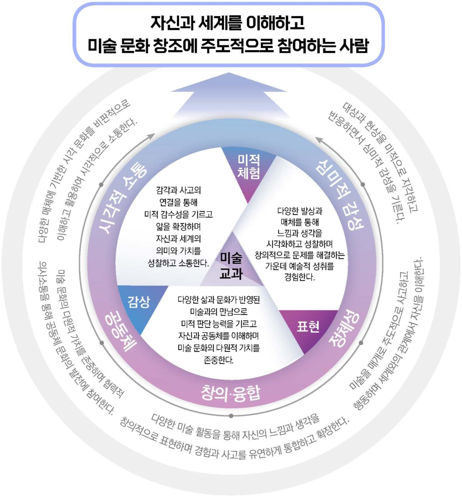

# 미술

# 미술

### 교육과정 설계의 개요

미술과 공통 교육과정은 총론에서 제시한 인간상 및 역량과 연계하여 심미적 감성 역량, 창의⋅융합 역량, 시각적 소통 역량, 정체성 역량, 공동체 역량을 미술과 학습을 통해 기를 수 있는 교과 역량으로 설정하였다. 이 교과 역량을 토대로 학생은 대상과 현상에 대한 미적 체험을 바탕으로 느낌과 생각을 표현하고 감상하는 활동을 통하여 자신과 세계를 이해하고 미술 문화 창조에 주도적으로 참여할 수 있다.

미술과 공통 교육과정은 성격 및 목표, 내용 체계 및 성취기준, 교수⋅학습 및 평가의 구성 체계를 갖는다. 성격은 미술의 정의와 역할, 미술 교과의 핵심 역할, 학생들이 얻는 교육적 성과, 미술과의 중요성과 의의를 다루고 미술과의 목표와 긴밀하게 연계하였다. 목표는 미술교육의 지향과 미술과 학습을 통해 길러야 하는 역량을 중심으로 제시하였다.

내용 체계는 영역, 영역별 핵심 아이디어, 내용 요소로 구성하였다. 교과의 내용을 구분하는 가장 큰 단위인 영역은 미적 체험, 표현, 감상으로 설정하였다. 미적 체험 영역은 감각과 사고의 연결을 통해 미적 감수성을 기르고 앎을 확장하며 자신과 세계의 의미와 가치를 성찰하고 소통하게 한다. 표현 영역은 다양한 발상과 매체를 통해 느낌과 생각을 시각화하고 성찰하며 창의적으로 문제를 해결하는 가운데 예술적 성취를 경험하게 한다. 감상 영역은 다양한 삶과 문화가 반영된 미술과의 만남으로 미적 판단 능력을 기르고 자신과 공동체를 이해하며 미술 문화의 다원적 가치를 존중하게 한다.

핵심 아이디어는 각 영역에서 학습을 통해 일반화할 수 있는 내용을 진술한 것으로, 영역의 정의와 의미, 역할 등을 포괄하여 세 문장으로 제시하였다. 내용 요소는 핵심 아이디어에 기초하여 학생들이 학습해야 할 필수 내용을 선정한 것으로, 지식⋅이해, 과정⋅기능, 가치⋅태도의 세 범주로 구분하여 학년군별, 학교급별로 위계화하였다. 지식⋅이해는 미술과 학습을 통해 반드시 알아야 할 구체적 지식과 그것에 대한 이해를 의미하며, 과정⋅기능은 미술 지식을 형성하는 데 활용되는 사고 및 탐구 과정과 미술 고유의 절차적 지식이다. 가치⋅태도는 미술 활동을 통해서 기를 수 있는 의미 있고 바람직한 가치 및 태도이다. 영역별 성취기준은 지식⋅이해, 과정⋅기능, 가치⋅태도 중 두 개 이상의 내용 요소를 연결하여 진술하였다. 교수⋅학습 및 평가는 미술과 목표 달성을 위한 교수⋅학습의 강조점을 확인하고 목표 도달을 촉진하기 위한 평가의 방향과 방법을 제시하였다.

[그림] 미술과 공통 교육과정 설계의 개요

### 1. 성격 및 목표

가. 성격

미술은 느낌과 생각을 시각적으로 표현함으로써 자신을 둘러싼 세계와 소통하며 자신과 세계와의 관계를 이해하고 그 의미와 가치를 창조하는 인류 보편의 언어이다. 미술은 조형적으로 문제를 해결해나가는 과정을 통해 자신의 내면을 통찰하고 상상력과 창의성을 발현시켜 개인과 공동체의 삶을 풍요롭게 한다. 또한 시대의 특징과 문화를 기록하고 반영하는 미술은 과거부터 동시대에 이르기까지 시공간을 가로질러 사유하게 함으로써 인간의 삶에 대한 이해와 새로운 미술 문화 창출을 이끌고 인류의 지속가능한 발전에 공헌한다.

학교 교육에서 미술 교과는 미술의 의미와 가치에 기초하여 심미적 감성을 함양하고 창의⋅융합적으로 사고하는 힘과 시각적으로 소통하는 능력을 길러주며 정체성과 공동체성을 확립하여 학생들의 전인적 성장을 이끄는 데 이바지하는 교과이다.

초등학교와 중학교 미술 교과에서 학생들은 주변 대상과 현상을 지각하고 반응하면서 미적 감각과 풍부한 감성을 기른다. 또한 표현 과정에서 아이디어를 떠올리고 매체를 활용하여 물성을 탐색하며, 새로운 시도를 모색하는 가운데 상상력을 발휘하는 등 창작의 역동성과 예술적 성취를 경험한다. 학생들은 다양한 시간과 장소를 배경으로 하는 미술 작품을 비판적으로 이해하고 활용하여 시각적으로 소통할 수 있다. 아울러, 미술을 매개로 사고하고 행동하며 자신과 세계와의 관계를 성찰하여 자신에 대한 이해를 확장할 수 있다. 나아가 인류의 정신적, 물질적 유산인 미술 문화를 존중하고 공동의 문제 해결에 참여하며 문화 발전에 기여할 수 있다. 이처럼 미술 교과는 학생들이 포용성과 창의성을 겸비한 주도적인 사람으로 성장하는 데 핵심적인 역할을 한다.

디지털 전환의 시대를 맞이하여 미래에 대한 예측이 불확실해질수록 삶의 주체로서 자신에 대한 이해가 더욱 중요해지고 있다. 미술의 경험을 통하여 학생들은 자신이 느끼고 생각한 것을 이해하고 성찰하며 확장함으로써 자신의 정체성을 형성해 갈 수 있다. 또한 타인, 환경, 세계와 상호 작용하는 가운데 자신의 위치를 확인하고 나아가 타인의 고유성을 존중하며 더불어 살아가는 힘과 협력적 문화를 형성하는 힘을 기를 수 있다. 특히 가상공간까지 미술의 범위를 확대하고, 표현과 소통의 도구로 디지털 매체를 적극적으로 활용함으로써 학생들은 신체와 사고, 시간과 공간의 경험을 확장하며 디지털 시대에 필요한 소양을 기를 수 있다. 이를 바탕으로 학생들은 개인의 문제를 넘어 주변과 세계에서 일어나고 있는 다양한 문제에 새로운 질문을 던지고 함께 해결하면서 사람과 환경의 공존을 위한 생태 전환적 가치를 함양하여 공동체의 발전에 참여하는 시민으로 성장할 수 있다.

나. 목표

대상과 현상에 대한 미적 체험을 바탕으로 느낌과 생각을 표현하고 감상하는 활동을 통하여 자신과 세계를 이해하고 미술 문화 창조에 주도적으로 참여할 수 있다.

(1) 대상과 현상을 감각적으로 지각하고 반응하면서 심미적 감성을 기른다.

(2) 미술 활동을 통해 자신의 느낌과 생각을 창의적으로 표현하며 경험과 사고를 유연하게 통합하고 확장한다.

(3) 다양한 매체에 기반한 시각 문화를 비판적으로 이해하고 활용하여 시각적으로 소통한다.

(4) 미술을 매개로 주도적으로 사고하고 행동하며 세계와의 관계에서 자신을 이해한다.

(5) 미술 문화의 다원적 가치를 존중하며 협력적 의사소통을 통해 공동체의 문화 발전에 참여한다.

### 2. 내용 체계 및 성취기준

가. 내용 체계

(1) 미적 체험

<table>
<tr><th>핵심 아이디어</th><th colspan="3">⋅미적 체험은 감각을 깨워 미적 감수성을 풍부하게 하며 미적 가치를 발견하도록 한다. ⋅대상과 현상을 관찰하고 지각하는 경험은 앎을 확장하고 자신을 성찰하게 한다. ⋅이미지에 대한 비판적 이해는 시각적 소통과 문화적 참여의 토대가 된다.</th></tr>
<tr><td rowspan="3">구분 범주</td><td colspan="3">내용 요소</td></tr>
<tr><td colspan="2">초등학교</td><td>중학교</td></tr>
<tr><td>3~4학년</td><td>5~6학년</td><td>1~3학년</td></tr>
<tr><td>[지식⋅이해]</td><td>⋅자신의 감각 ⋅대상의 특징 ⋅생활 속 미술</td><td>⋅감각과 매체의 역할 ⋅자신과 환경의 관계 ⋅이미지와 의미</td><td>⋅감각을 활용한 미적 인식 ⋅시각 문화의 의미와 역할 ⋅삶과 미술의 관계</td></tr>
<tr><td>[과정⋅기능]</td><td>⋅감각을 활용하여 탐색하기 ⋅대상에 반응하여 느낌과 생각을 나타내기 ⋅미술의 특징과 역할을 발견하기</td><td>⋅감각과 매체를 활용하여 탐색하기 ⋅대상과 상호 작용하며 의미 발견하기 ⋅이미지를 해석하고 활용하기</td><td>⋅이미지를 비판적으로 해석하기 ⋅이미지를 활용하여 소통하기 ⋅미술과 다양한 분야 연결하기</td></tr>
<tr><td>[가치⋅태도]</td><td>⋅미적 탐색에 대한 호기심 ⋅미술의 역할에 관한 관심</td><td>⋅주변 환경에 대한 민감성 ⋅비판적으로 이해하는 태도</td><td>⋅자신과 환경에 대한 감수성 ⋅다양한 문화 존중과 참여</td></tr>
</table>

(2) 표현

<table>
<tr><th>핵심 아이디어</th><th colspan="3">⋅표현은 자신의 느낌과 생각을 시각화하는 창의적 사고와 성찰의 순환 과정으로 이루어진다. ⋅다양한 발상은 아이디어와 주제를 발전시키고 표현의 토대가 된다. ⋅작품 제작은 표현 재료와 방법, 조형 요소와 원리 등을 선택하고 활용하여 창의적으로 문제를 해결하는 과정을 통해 예술적 성취를 경험하게 한다.</th></tr>
<tr><td rowspan="3">구분 범주</td><td colspan="3">내용 요소</td></tr>
<tr><td colspan="2">초등학교</td><td>중학교</td></tr>
<tr><td>3~4학년</td><td>5~6학년</td><td>1~3학년</td></tr>
<tr><td>[지식⋅이해]</td><td>⋅표현 주제 ⋅기본적인 표현 재료와 용구 ⋅조형 요소의 특징</td><td>⋅표현 주제와 발상 ⋅표현 재료와 용구, 디지털 매체 ⋅조형 요소와 원리의 관계</td><td>⋅표현 주제와 의도 ⋅다양한 표현 재료와 방법 ⋅조형 요소와 원리의 효과</td></tr>
<tr><td>[과정⋅기능]</td><td>⋅관찰과 상상으로 아이디어를 떠올리기 ⋅표현 방법을 익히기 ⋅의도를 가지고 작품을 제작하기 ⋅타 교과와 관련짓기</td><td>⋅다양한 방법으로 아이디어를 연결하기 ⋅표현 방법을 탐색하여 활용하기 ⋅과정을 돌아보며 작품을 발전시키기 ⋅타 교과와 융합하기</td><td>⋅주제에 적합한 표현 계획하기 ⋅새로운 표현을 실험하고 작품 제작하기 ⋅작품을 공유하고 소통하기 ⋅미술 표현 경험을 삶과 연결하기</td></tr>
<tr><td>[가치⋅태도]</td><td>⋅표현에 대한 흥미 ⋅자기 작품을 소중히 여기는 태도</td><td>⋅주제 표현의 의지 ⋅자유롭게 시도하는 태도</td><td>⋅표현 과정에서의 주도성과 성찰 ⋅자신과 타인의 작품 존중</td></tr>
</table>

(3) 감상

<table>
<tr><th>핵심 아이디어</th><th colspan="3">⋅감상은 다양한 삶과 문화가 반영된 미술과의 만남으로 자신과 공동체의 문화를 이해하게 한다. ⋅작품의 내용과 형식에 관한 맥락적 이해와 비평은 미적 판단 능력을 높인다. ⋅감상은 서로 다른 관점을 이해하여 삶에서 미술 문화의 다원적 가치를 존중하도록 한다.</th></tr>
<tr><td rowspan="3">구분 범주</td><td colspan="3">내용 요소</td></tr>
<tr><td colspan="2">초등학교</td><td>중학교</td></tr>
<tr><td>3~4학년</td><td>5~6학년</td><td>1~3학년</td></tr>
<tr><td>[지식⋅이해]</td><td>⋅미술 작품과 미술가 ⋅미술 작품의 특징 ⋅미술 전시</td><td>⋅미술 작품의 배경 ⋅미술 작품의 내용과 형식 ⋅공동체의 미술 문화</td><td>⋅미술의 시대적, 지역적, 사회적 맥락 ⋅미술 용어와 지식 ⋅다양한 감상 방법과 관점</td></tr>
<tr><td>[과정⋅기능]</td><td>⋅자세히 보고 질문하기 ⋅미술 작품에 관한 느낌과 생각을 설명하기 ⋅미술 전시 및 행사에 참여하기</td><td>⋅작품과 배경을 연결하기 ⋅다양한 방법으로 분석하기 ⋅미술 문화 활동을 경험하고 공유하기</td><td>⋅미술 작품의 내용과 형식 분석하고 설명하기 ⋅미술 작품을 해석하기 ⋅미술 감상 경험을 삶과 연결하기</td></tr>
<tr><td>[가치⋅태도]</td><td>⋅자신의 감상 관점 존중 ⋅미술 문화에 관한 관심</td><td>⋅서로 다른 관점의 존중 ⋅공동체 문화에 참여</td><td>⋅미술의 다원성 존중 ⋅공동체 문화에 기여</td></tr>
</table>

나. 성취기준

[중학교]

(1) 미적 체험

[9미01-01] 감각을 활용하여 대상과 현상을 탐색하고 자신과 환경에 대한 감수성을 확장할 수 있다.
[9미01-02] 시각 문화의 의미와 역할을 알고 이미지를 비판적으로 해석할 수 있다.
[9미01-03] 다양한 문화를 존중하며 이미지를 활용하여 소통할 수 있다.
[9미01-04] 삶과 미술의 관계를 이해하고 다양한 분야와의 연결 방안을 모색할 수 있다.

(가) 성취기준 해설

• [9미01-01] 성취기준은 다양한 감각을 활용하여 주변의 대상과 현상을 탐색하고 자신과 자신을 둘러싼 환경에 대한 미적 인식을 통해 감수성을 일깨우는 데 중점을 둔다. 감각을 활용하여 대상과 현상을 탐색하고 상호 작용하여 미적 인식에 이르는 경험을 통해 주변 환경을 포함하여 생태적, 문화적, 사회적 환경까지 새롭게 바라보고 의미를 부여하며 앎을 성찰할 수 있다.

• [9미01-04] 성취기준은 삶 속에서 미술이 어떻게 상호 작용하고 있는지 그 중요성을 인식하는 것으로 출발한다. 인문, 과학, 공학 등 타 분야와 사회 현상에 이르기까지 폭넓게 연결된 미술의 사례를 찾고 자신의 흥미에 맞는 진로나 직업 및 관심 분야와 관련하여 적용 방안을 탐색하는 데 중점을 둔다. 미술과 관련된 직업과 진로를 적극적으로 탐색하고, 자유학기제 진로 탐색 활동, 진로연계교육 등과 연계할 수 있다.

(나) 성취기준 적용 시 고려 사항

• 학생들이 자신을 둘러싼 환경과 세계를 섬세하게 지각하고 반응함으로 삶 속에서 감각과 인식을 새롭게 할 수 있도록 한다. 급격하게 변하는 세상 속에서 나를 인식하고 나와 타인, 자연, 생태, 사회, 현상까지 관계를 탐색하여 자신의 정체성을 발견할 수 있도록 한다.

• 주변에서 흔히 찾아볼 수 있는 기호, 사진, 광고, 영상, 가상현실에 이르기까지 학생들의 삶에서 쉽게 접할 수 있는 각종 시각 문화의 의미와 역할을 분석하고 비판적으로 판단하는 활동을 통해 시각적 문해력을 기를 수 있도록 한다.

• 자신과 환경과의 상호 작용을 통해 생태 감수성을 함양하여 지속가능한 삶을 실천하는 시민으로 성장할 수 있도록 한다.

• 국가, 인종, 성별, 세대, 사회 집단 등 타 문화의 고유한 가치를 존중하는 태도를 바탕으로 다양한 매체를 통해 이미지로 소통하는 방식을 이해하고 활용하며 나와 세계가 함께 공존할 수 있는 새로운 시각 문화 형성에 참여하도록 한다.

(2) 표현

[9미02-01] 주제를 탐구하고 의도를 반영하여 적합한 표현을 계획할 수 있다.
[9미02-02] 주도적이고 도전적인 태도로 다양한 미술 표현을 실험하고 작품에 적용할 수 있다.
[9미02-03] 조형 요소와 원리, 표현 재료와 방법, 디지털 매체를 포함한 다양한 매체를 활용하여 주제를 효과적으로 표현할 수 있다.
[9미02-04] 자신과 타인의 작품을 존중하며, 다양한 방법으로 공유하고 소통할 수 있다.
[9미02-05] 미술 표현 과정에서의 경험을 성찰하고 삶의 문제 해결에 활용할 수 있다.

(가) 성취기준 해설

• [9미02-02] 성취기준은 주제를 효과적으로 시각화하는 방법을 찾기 위해 도전하고 실험하는 태도를 기르는 데 중점을 둔다. 실패를 두려워하거나 익숙한 표현 방법에 안주하지 않고 작품에 적합한 표현 방법과 매체를 주도적으로 탐색하고 활용할 수 있다.

• [9미02-04] 성취기준은 자신의 작품을 소중히 여기고 타인의 작품을 존중하는 태도를 지니며, 효과적인 방법으로 작품을 공유하고 소통하는 과정을 통해 표현의 가능성을 확장하는 데 중점을 둔다. 미술 표현 과정과 결과물을 교실, 복도, 지역 사회 공간, 온라인 공간까지 확장하여 공유하고 발표하며 토론할 수 있다.

• [9미02-05] 성취기준은 미술 표현 과정에서 마주하는 크고 작은 질문과 답을 찾아 나가는 과정이 가지는 가치를 알고 그 경험을 삶의 다양한 문제에 활용하는 데 중점을 둔다. 표현 주제를 찾고, 계획하고, 실험하고, 제작하고, 타인과 상호 작용하는 전체 과정에서 경험한 지식⋅이해, 과정⋅기능, 가치⋅태도를 삶의 다양한 문제와 연결할 수 있다.

(나) 성취기준 적용 시 고려 사항

• 맞춤형 학습을 위하여 개별 학생들의 배경과 특성, 요구와 필요를 조사하고 관심과 진로⋅직업을 고려하여 표현 주제와 방법을 선택할 수 있다.

• 학생이 주도적으로 주제를 선택하고 선택한 주제를 다양한 교과, 분야와 연계하여 다각적으로 탐구하여 구체화하며 표현 과정과 결과를 글, 이미지, 영상 등을 활용하여 체계적으로 기록하고 관리할 수 있도록 한다.

• 다양한 정보를 탐색하고 주제를 구체화하는 발상 과정과 주제에 적합한 작품을 제작하는 표현 과정에서 디지털 도구를 사용하여 표현의 폭과 깊이를 확장할 수 있도록 한다.

• 인간과 자연의 공존과 지속가능한 환경에 대한 관심을 표현 주제로 삼으며, 표현 과정에서 발생하는 환경 문제에 대해서도 경각심을 가질 수 있도록 한다.

• 작품 제작 과정에서 공유하고 소통하는 활동을 통해 자신과 타인에 대해 더 깊이 이해하도록 하고, 공동 작품 제작, 단체전 기획 등의 활동을 통해 서로 협력하여 문제를 해결하며 공동체 의식을 기를 수 있다.

(3) 감상

[9미03-01] 미술의 시대적, 지역적, 사회적 맥락을 이해하고 설명할 수 있다.
[9미03-02] 작품의 내용과 형식을 분석하고 미술 용어와 지식을 활용하여 설명할 수 있다.
[9미03-03] 다양한 감상 방법과 관점을 활용하여 작품을 해석할 수 있다.
[9미03-04] 미술의 다원성에 대한 존중을 바탕으로 미술 감상 경험을 삶과 연결하고 공동체 문화에 기여할 수 있다.

(가) 성취기준 해설

• [9미03-04] 성취기준은 미술의 다원성을 존중하는 태도를 바탕으로 미술 감상 과정과 결과에서 얻은 지식과 경험을 자신의 삶과 연결하여 통찰을 얻고 자신이 속한 공동체가 더 나은 문화를 만들어 나가도록 하는 데 중점을 둔다. 미술 작품과 그에 얽힌 다양한 주제에 관해 의견을 나누는 가운데 미술의 가치와 역할을 인식하고 미술을 통해 나와 공동체의 문화를 새롭게 하는 데 기여할 수 있다.

(나) 성취기준 적용 시 고려 사항

• 감상 활동 시 학생들의 배경을 고려하여 작품을 신중하게 선택하고 균형 있는 시각으로 접근한다. 또한 학생이 주도적으로 감상 작품을 선정하고 자신의 삶과 연계하여 작품을 감상하며, 고유의 관점을 정립하여 작품을 비평할 수 있도록 개방적이고 포용적인 분위기를 조성한다.

• 미술 작품에 대한 자료 수집 과정에서 디지털 매체를 적극적으로 활용하되 신뢰할 수 있는 양질의 정보를 비판적으로 선택하여 적용할 수 있도록 한다. 또한 수집한 정보를 정리하고 설명하는 과정에서 디지털 매체를 활용하여 자신의 감상과 비평을 효과적으로 전달할 수 있도록 한다.

• 자연과의 공존, 지속가능성을 주제로 작업하는 미술가와 미술 작품을 적극적으로 수업에 도입하여 학생들의 생태 감수성 함양을 도모할 수 있다.

• 감상 작품 선택 시 공동체 및 사회 문제를 주제로 작업하는 미술가와 미술 작품을 적극적으로 도입하며, 작품 감상 과정에서 자신의 고유한 관점을 형성하고 다른 사람의 생각을 경청하고 수용함으로써 민주시민의 자세를 기를 수 있도록 한다.

### 3. 교수⋅학습 및 평가

가. 교수⋅학습

(1) 교수⋅학습의 방향

(가) 미술과 교육과정에서 제시한 성격, 목표, 내용 체계(영역, 핵심 아이디어, 지식⋅이해, 과정⋅기능, 가치⋅태도의 세 범주에 따른 학교급별, 학년군별 내용 요소), 성취기준을 고려하여 교수⋅학습을 계획하고 실행한다.

• 미술 교과의 역량인 심미적 감성 역량, 시각적 소통 역량, 창의⋅융합 역량, 정체성 역량, 공동체 역량을 반영하여 교수⋅학습을 계획하고 실행한다.

• 핵심 아이디어를 중심으로 학습 내용을 엄선하고 깊이 있는 미술 학습이 일어날 수 있도록 교수⋅학습을 계획하고 실행한다.

• 내용 체계의 영역별 지식⋅이해, 과정⋅기능, 가치⋅태도의 세 범주를 연계하여 교수⋅학습을 계획하고 실행한다.

(나) 학습자의 주도성을 바탕으로 삶과 긴밀하게 연관된 주제를 다루며 다양한 학습자를 고려한 맞춤형 교수⋅학습이 이루어질 수 있도록 계획하고 실행한다.

• 학교의 다양한 여건, 지역 간 차이, 수업 환경 등을 고려하여 학습의 내용과 양, 수준을 적정화한다.

• 학습자 스스로 자신이 무엇을 배우고 어떻게 문제를 해결하는지 학습 과정에 대해 성찰할 수 있도록 교수⋅학습을 계획하고 실행한다.

(다) 디지털 환경과 미술의 변화를 고려하여 교수⋅학습 과정에서 다양한 디지털 매체를 활용하고 온오프라인 연계가 가능한 교수⋅학습을 계획하고 실행한다.

• 디지털 매체를 활용하는 수업을 계획할 때는 미적 경험과 상상력, 표현의 가능성을 확장하는 데 중점을 두어 디지털 소양을 기를 수 있도록 한다.

• 비대면 원격교육 시, 학습자 간, 학습자와 교사 간 상호 작용을 촉진하고 참여에 어려움을 겪는 학생을 포함한 모든 학생의 능동적 참여를 강화하는 방안을 마련하여 교수⋅학습을 계획하고 실행한다.

(라) 학습자의 진로와 연계한 교수⋅학습을 계획하고 실행한다.

• 교수⋅학습 계획과 실행 단계에 학습자의 참여를 확대하여 학습자가 자신의 진로와 적성에 따라 무엇을 어떻게 배울지 주도적으로 선택할 수 있도록 한다.

• 진로연계교육 시, 학교급 전환을 고려하여 초등학교, 중학교, 고등학교 간 교육 내용이 자연스럽게 연계 및 심화되도록 교수⋅학습을 계획하고 실행한다.

(마) 범교과 교수⋅학습 주제를 미술 수업에 도입하고 적용한다.

• 인성, 인권, 다문화, 통일, 독도, 경제⋅금융, 디지털 소양 등 범교과 학습 주제를 교수⋅학습과 연계하여 민주시민의 태도와 자질을 함양할 수 있도록 한다.

• 생명 존중, 기후 위기 대응 등을 학습 내용에 포함하여 생태 감수성을 함양하고 환경과 인간의 안전과 건강한 공존을 추구하며 지속가능한 미래에 대해 상상하고 실천할 수 있도록 교수⋅학습을 계획하고 실행한다.

(바) 미술관, 박물관에서의 전시, 지역 사회 미술 축제 등에 참여할 때는 관람 예절과 공공장소에서의 안전 수칙을 준수하고 작품을 소중히 여기도록 한다. 환경적 여건이 어려울 때는 온라인 미술관 전시를 활용한다. 궁극적으로 학습자가 일상에서 미술을 향유할 수 있는 태도와 능력을 기르는 데 중점을 둔다.

(2) 교수⋅학습 방법

(가) 미술 수업을 통해 학습자의 삶과 긴밀하게 연관된 깊이 있는 학습 경험을 제공하기 위하여 다양한 교수⋅학습 방법을 활용할 수 있다.

• 삶을 둘러싼 다양한 실생활의 문제들을 수업 주제로 다룰 수 있으며, 귀납적 사고법, 창의적 문제 해결법, 직접 교수법, 반응 중심 학습법, 프로젝트 학습 방법, 토의⋅토론 학습 방법, 협동 학습 방법 등을 수업 목표에 따라 선택하여 활용할 수 있다.

• 프로젝트 학습 방법은 문제를 심층적으로 연구하며 해결 방안을 모색하고 실행하는 교수⋅학습 방법이다. 학습자가 관심 있는 주제를 중심으로 미술 영역 내, 타 교과 및 타 분야와 연계하여 수업을 실행할 수 있다. 문제를 해결하기 위해 충분한 기간과 단계적 수행 과정을 거치며 비판과 성찰, 상호 작용을 통한 깊이 있는 학습을 경험하고 문제를 창의적으로 해결하는 자기주도적 학습 태도를 함양할 수 있다.

• 토의⋅토론 학습 방법은 규칙과 단계에 따라 의견을 나누는 가운데 앎을 명료하게 하고 확장할 수 있는 교수⋅학습 방법이다. 의사결정이나 아이디어 정교화가 필요한 활동과 쟁점 중심의 활동에 활용할 수 있다. 다른 친구들과 생각과 의견을 나누며 다양한 관점을 존중하는 태도를 기를 수 있다.

• 협동 학습 방법은 공동의 학습 문제를 설정하고 상호 작용을 통해 해결하는 교수⋅학습 방법이다. 자료 수집, 아이디어 발상, 주제에 적합한 표현 방법을 찾는 과정에서 역할을 분담하고 집단의 힘을 발휘할 수 있으며 협력적 의사소통 능력을 기를 수 있다. 협동 작품 만들기, 벽화 그리기, 전시 기획하기처럼 다양한 아이디어와 역할이 요구되는 활동에 적용할 수 있다.

(나) 미술 수업에서 학습자의 주도성이 적극적으로 발현될 수 있도록 학습자의 특성을 고려한 개별화, 맞춤형 교수⋅학습 방법을 활용할 수 있다.

• 학습자의 흥미와 관심, 문화적 배경 등을 고려하여 주제를 선정하고 수업 방법을 정할 수 있다. 학습자의 개성, 사전 지식 등 개별 학생의 특성 분석을 토대로 한 맞춤형 교수⋅학습 설계, 실행, 지원을 통해 학생의 동기를 유발하고 적극적인 참여를 이끌 수 있다.

• 미술 활동 시, 충분한 시간을 확보하여 학습 부진 학생, 느린 학습자 등이 자신의 학습 속도에 맞추어 수업에 참여할 수 있도록 하고, 장애가 있는 학생을 고려하여 미술실 수업 환경, 수업 기자재와 도구 등을 사전에 점검하고 적합한 학습 환경을 구성한다. 학습의 주제와 작품 등을 선정할 때는 다문화 가정 학생을 비롯하여 소외될 수 있는 환경에 있거나, 배려가 필요한 학생들을 고려하여 신중하게 선택한다.

• 학생들이 자신의 경험, 생각과 느낌을 시각적으로 표현하는 과정은 외부 세계와의 상호 관계 속에서 내면을 성찰하게 한다. 삶과의 긴밀한 연결을 만들고 의미를 구성하며 학습자의 반성적 성찰을 돕기 위해 시각 요소를 담은 신문이나 잡지, 이미지를 포함한 일기 등을 활용한 서사 중심의 교수⋅학습 방법을 활용할 수 있다.

(다) 미술 학습 환경의 변화를 고려하여 온오프라인 연계가 가능한 디지털 기반 교수⋅학습 방법을 활용할 수 있다.

• 온오프라인 연계 학습은 학습의 목표 달성 및 효과를 극대화하기 위해 온라인 수업과 오프라인 수업 등을 다양한 방식으로 혼합한 교수⋅학습 방법이다. 학습 상황을 고려하고 온오프라인 수업의 특징을 분석하여 각 수업의 장점이 잘 연계되도록 한다.

• 미술과에서 활용 가능한 디지털 기반 교수⋅학습 방법에는 실감형 콘텐츠 활용 학습 방법, 메타버스 활용 학습 방법, 학습관리시스템(LMS : Learning Management System) 활용 학습 방법 등을 예로 들 수 있다. 실감형 콘텐츠를 활용한 활동은 실재감을 구현하여 학습에 몰입감을 높이고, 공감각적 상호 작용이 가능하다. 새로운 지각 경험을 통해 미적 체험, 표현, 감상의 영역을 확장할 수 있다. 메타버스를 활용한 활동으로 가상공간에서 전시회를 열고 감상하거나, 온라인 게시판 등을 활용하여 소통의 장을 넓힐 수 있다.

• 디지털 기술을 활용하여 학습자의 개별 특성과 학습 속도에 적합한 맞춤형 학습을 도울 수 있다. 학습관리시스템을 활용하면 실시간 온라인 협업을 통해 작품 및 결과물 공유, 전시가 가능하며 학습자의 관리와 분석, 피드백 제공 등 원격수업 상황에서도 학습자에게 적합한 지원으로 학습 효과를 높일 수 있다.

(라) 학습자의 진로와 연계한 수업을 실행할 때는 진로와 관련한 문제 해결과 이해에 중점을 두어 교수⋅학습 방법을 선택할 수 있다.

• 학습자의 관심 분야에서 실제 경험할 수 있는 문제를 미술과 연계하여 창의적으로 해결하는 활동을 할 수 있다.

• 미술 관련 관심 분야에 따라 모둠을 구성하여 진로를 조사하고 탐구하거나 미술 분야별 전문가 집단을 형성하여 공동의 과제를 수행하는 협동 학습을 할 수 있다.

• 미술 관련 인물에 대한 인터뷰, 감상문 작성, 온오프라인 현장 탐방 등의 활동을 통해 해당 분야에 대한 경험과 지식을 쌓고 구체적인 실행 전략을 배울 수 있다.

나. 평가

(1) 평가의 방향

(가) 미술과 교육과정의 목표와 성취기준을 근거로 성취기준 도달 정도를 정확하게 파악할 수 있도록 평가의 목표와 내용을 설정하되, 학습자의 성취수준을 고려하여 평가 계획을 수립한다.

• 평가 내용 및 방법, 평가 도구의 타당성, 신뢰성 등을 고려하여 평가 계획을 수립하고, 수립한 평가 계획과 기준을 학습자에게 미리 제시하여 평가의 신뢰성을 높인다.

• 각 영역의 성격과 내용을 충실하게 반영하되, 미적 체험, 표현, 감상 영역별 특성을 고려한 다양한 평가 방법을 구안하여 적용한다.

• 내용 체계와의 관련성을 고려하여 학습자의 태도, 학습 과정, 학습 결과를 고루 평가하며, 지식⋅이해, 과정⋅기능, 가치⋅태도 세 범주의 내용이 균형 있게 평가되도록 계획하고 실행한다.

• 교수⋅학습 방법과 평가 방법이 일관성을 가질 수 있도록 유의한다.

(나) 학습자가 성취기준에 도달하는 과정과 학습 결과를 고려하여 학습자의 성장과 발달을 지원할 수 있도록 과정을 중시하는 평가를 계획하여 실행한다.

• 학습 과정을 중시하는 평가를 통해 학습자가 자신의 학습 과정을 돌아보고 수행 과정을 스스로 성찰, 보완하도록 한다.

• 교수⋅학습 과정 전반에서 지식⋅이해, 과정⋅기능, 가치⋅태도 등을 포괄하여 피드백을 제공하도록 한다.

• 교수⋅학습 과정에서의 다양한 산출물(계획서, 아이디어 스케치, 보고서, 창작 작품, 발표 자료 등)과 학생의 변화와 성장에 대한 자료를 다각적으로 수집하여 학습자에게 구체적이고 명확한 맞춤형 피드백을 제공한다.

• 자기 평가 및 동료 평가를 통해 학습자가 스스로 성찰하며 반성적으로 사고할 수 있는 기회를 제공한다.

(다) 원격수업 상황을 고려하여 디지털 도구를 활용한 평가 방법을 계획하고 실행한다.

• 디지털 기반의 학습관리 시스템을 활용하여 온오프라인 연계 수업 상황에서 미적 체험, 표현, 감상 과정의 산출물을 기록 및 관리하고, 디지털 도구를 활용한 실시간 피드백과 학생 간 상호 평가가 이루어질 수 있도록 한다.

• 원격수업 상황에서도 학습자의 성취기준 도달 과정을 지속해서 점검하고 피드백한다.

(라) 학습자의 성장과 발달을 위해 평가 결과는 다음과 같이 활용한다.

• 학습 과정을 중시하는 평가를 통해 드러난 학습자의 현재 수준과 도달해야 할 수행 수준 간의 차이를 피드백함으로써 학습자의 학습과 성장을 지원한다.

• 과제 수행에 어려움을 겪는 학습자가 다른 학습자를 보고 배울 수 있도록 학습자 간 상호 피드백의 기회를 제공한다.

• 최종 수행 결과를 학습자에게 안내하고 의사소통함으로써 평가 결과와 학습을 연결한다. 교사는 학습자의 수행 과정을 점검하여 다음 수업의 교수⋅학습 계획을 조정할 수 있다.

• 학습자의 개인차를 고려하여 평가 결과를 해석하고 이를 활용하여 후속 학습과 성장을 돕는 방향으로 평가 결과를 제공하여 학습자의 학습 동기를 긍정적인 방향으로 촉진한다.

• 평가 결과를 바탕으로 교수⋅학습 및 평가 방법, 평가 도구 등을 보완하여 수업의 질을 개선하며, 학습자의 특성과 능력을 파악하여 진로 지도에 활용한다.

(2) 평가 방법

(가) 교수⋅학습과 연계하여 학생의 성장을 도울 수 있도록 학습 과정을 중시하는 평가를 시행한다.

• 성취기준에 도달하는 학습 과정을 평가할 때, 계획서 평가, 스케치 평가, 제작 또는 탐색 과정 보고서 평가, 발표, 체크리스트 등의 방법을 활용하여 교수⋅학습 과정 중 평가가 이루어질 수 있도록 한다.

• 결과 중심의 일회성 평가를 지양하고, 학습자가 성취기준에 도달해 가는 과정을 교사가 직접 관찰하고 기록하여 학습자에게 맞춤형 피드백을 제공할 수 있도록 한다.

• 서술형이나 논술형 평가에서 채점 기준에 따른 피드백을 제공한다.

(나) 평가 목표, 평가 내용, 평가 상황 등을 고려하여 적합한 서술형 및 논술형 평가, 관찰법, 발표 및 토의⋅토론법, 자기 평가 및 동료 평가, 연구보고서법, 감상문, 포트폴리오법, 실기 평가 등 다양한 평가 방법을 적절하게 활용한다.

• 서술형 및 논술형 평가와 발표 및 토의⋅토론법 등을 활용하여 미술 지식을 바탕으로 자기의 관점, 의견, 주장을 논리적이고 설득력 있게 말과 글로 다른 사람과 소통하는 능력을 파악할 수 있다.

• 포트폴리오법과 프로세스폴리오법을 활용하여 미술 활동 과정에서의 성찰과 변화를 파악하고 학습자의 성장 정도를 평가할 수 있다.

• 관찰법, 자기 평가 및 동료 평가는 학습자의 태도, 학습 과정, 학습 결과를 평가하는 데 활용할 수 있으며, 특히 학습 단계와 성취를 다면적으로 점검하고 평가하는 데 도움을 줄 수 있다.

• 실기 평가, 감상문, 연구보고서법 등을 활용하여 수업 목표와 성취기준에 근거하여 학습의 결과를 평가하고 다음 학습 목표 설정의 자료로 활용할 수 있다.

• 협동 학습에서 개인 평가와 모둠 평가를 적절하게 활용하고 개인의 역할과 비중을 고려하여 공정한 평가를 도모한다.

(다) 교수⋅학습 활동에 따라 미적 체험, 표현, 감상 영역을 고루 평가하되, 각 영역에서는 다음과 같은 방법을 주로 활용하여 평가한다.

• 미적 체험 영역에서는 감각을 활용하여 자신과 대상, 환경을 탐색하는 능력, 시각 문화와 이미지를 활용하여 소통하는 능력을 평가하기 위해 관찰법, 발표 및 토의⋅토론법, 연구보고서법 등을 활용할 수 있다.

• 표현 영역에서는 작품 제작 과정 및 작품을 평가하기 위해 실기 평가, 포트폴리오법, 프로세스폴리오법을 활용하고, 작품 발상과 학생의 주도적 표현 과정을 평가하기 위해 작품 계획서, 제작 과정 점검 체크리스트, 자기 평가 및 동료 평가 등의 방법을 활용할 수 있다.

• 감상 영역에서는 자신과 다른 학생의 작품, 작가들의 작품을 맥락적으로 이해하고 감상하는 능력을 평가하기 위해 감상문, 연구보고서법, 서술형 및 논술형 평가, 발표 및 토의⋅토론법 등을 활용할 수 있다.

(라) 다양한 학습 플랫폼과 디지털 도구를 활용하여 평가할 수 있다.

• 다양한 디지털 도구를 활용하여 아이디어 스케치, 제작 과정, 과제 수행 태도 등을 관찰하고 평가할 수 있다.

• 디지털 평가 도구를 활용하여 학습자의 누적된 학습 데이터를 분석 및 활용하여 학습자에게 맞춤형 피드백을 제공할 수 있다.

(마) 교사 주도의 평가 외에도 학습자가 평가에 참여하는 학생 참여 중심 평가 방법을 운영한다.

• 학생 참여 중심 평가에서 교사는 학습자가 평가를 기획하고 실행하는 평가의 주체가 될 수 있도록 평가 조력자의 역할을 수행한다.

• 학습자가 수행 계획과 방법에 대해서 교사와 협의한 후 자기 평가 기준을 마련하고, 이를 근거로 학습자가 평가를 수행할 수 있도록 한다.

• 학습자가 관심 있는 수행 주제와 방법을 스스로 결정하고 자신의 표현 능력이나 탐색 과정을 평가하는 기회를 제공한다.

(바) 다양한 학습 격차 문제를 해결하기 위한 평가 방법을 마련한다.

• 장애 학생, 다문화 학생, 탈북 학생 등을 위해 성취기준을 재구조화하여 별도의 평가 방법과 기준을 마련한다.

• 학습에서 소외되거나 학습이 느려서 성취기준 미도달이 예상되는 학생들을 사전에 파악하여 지속적인 관찰과 보충 과제를 부여하는 등 최소 성취수준에 도달할 수 있도록 지원한다.

