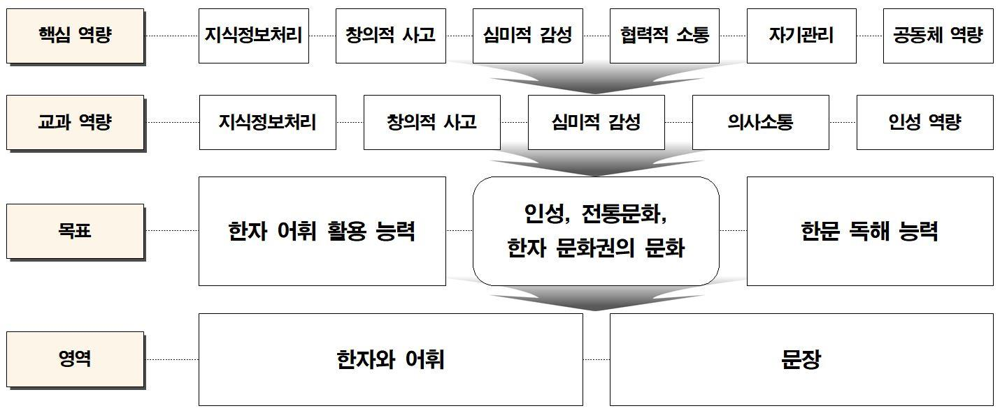

# 한문

### 교육과정 설계의 개요

2022 개정 한문과 교육과정은 총론에서 제시한 인간상 및 핵심역량을 한문 교과 차원에서 구현할 수 있도록 설계하였다. 즉, 한문과 교육과정은 총론의 핵심역량과 연계하여 미래 사회에서 자기 삶의 주체로서 자아를 실현하고 창의적인 삶을 영위하는 데 요구되는 ‘지식정보처리’, ‘창의적 사고’, ‘심미적 감성’, ‘의사소통’, ‘인성 역량’을 교과 역량으로 설정하고, 이러한 역량을 효과적으로 함양할 수 있는 방향으로 교육과정 전반을 구성하였다. 또한 2022 개정 교육과정 총론에서 강조하고 있는 기초 소양 및 다양한 국가⋅사회적 요구 등을 교육과정 문서에 반영하려고 하였다.

중학교 선택 과목 ‘한문’은 한자 및 한문에 대한 기초적인 지식을 익혀 한자 어휘 활용 능력 및 한문 독해 능력을 종합적으로 신장하는 데 초점을 두고 있다. 이에 따라 중학교 ‘한문’ 교육과정은 ‘한자와 어휘’, ‘문장’을 두 개의 하위 영역으로 설정하고, 한자 및 한자 어휘 관련 내용은 ‘한자와 어휘’ 영역에, 한문 관련 내용은 ‘문장’ 영역에서 다루도록 하였다. 전통문화 및 한자 문화권의 문화 등 한문과에서 다루어지는 문화 관련 내용과 인성 관련 내용의 경우는 별도의 영역을 설정하지 않고, ‘한자와 어휘’, ‘문장’ 두 영역 내에서 학습할 수 있도록 교육과정을 구성하였다. 또한 이번 교육과정에서는 학교 현장의 의견을 적극 반영하여 각 영역에서 다루어지는 문법적 내용을 최소화하려고 하였다.

<중학교 한문과 교육과정 구성 원리>

2022 개정 한문과 교육과정의 체계는 성격, 목표, 내용 체계, 성취기준, 교수⋅학습 및 평가의 방향으로 구성되어 있다.

먼저 성격은 중⋅고등학교 한문과 전반을 관통하는 일반적 성격과 각 과목의 특성을 규정하는 과목 고유의 성격을 구분하여 제시하였고, 목표 역시 핵심역량 및 교과 역량과 연계하여 각 과목에서 추구하고 있는 학습의 지향점을 총괄 목표와 세부 목표로 나누어 제시하였다.

내용 체계는 각 영역에서 다루는 내용 전체를 관통하는 핵심적인 내용을 선정하고, 이를 일반화된 문장 형태로 진술한 ‘핵심 아이디어’를 바탕으로, 영역에서 학습해야 할 내용을 ‘지식⋅이해’, ‘과정⋅기능’, ‘가치⋅태도’의 3가지로 범주를 구분하여 제시하였다. 즉, 해당 영역 학습에서 반드시 알아야 할 구체적 지식과 그것에 대한 이해는 ‘지식⋅이해’, 지식을 습득하는 데 활용되는 사고 및 탐구 과정, 영역 고유의 절차적 과정과 기능은 ‘과정⋅기능’, 학습 활동으로 기를 수 있는 의미 있고 바람직한 가치 및 태도는 ‘가치⋅태도’로 구분한 것이다. 이러한 특성에 맞춰 한문과 교육과정의 내용 체계 역시 한자, 한자 어휘, 문장 학습에 필요한 지식과 이해 관련 내용 요소는 ‘지식⋅이해’에 배치하고, ‘지식⋅이해’에 제시된 내용 요소를 효과적으로 학습하고 활용할 수 있는 방법은 ‘과정⋅기능’에 제시하였으며, ‘지식⋅이해’ 및 ‘과정⋅기능’을 통해 학습자가 도달하기를 기대하는 정의적 특성은 ‘가치⋅태도’에 배치하였다.

성취기준은 내용 체계에서 제시한 학습 요소를 구체화한 것으로서, 내용 요소의 3가지 범주 중 2가지 이상의 범주를 정합하는 방식으로 진술하고자 하였다. 다만 ‘과정⋅기능’이 ‘지식⋅이해’의 내용 요소를 포괄하고 있거나 영역 또는 과목 전반의 내용 요소와 관련되어 ‘지식⋅이해’나 ‘과정⋅기능’의 내용 요소를 특정할 수 없는 ‘가치⋅태도’의 경우는 부득이 한 가지 범주를 활용하여 성취기준을 작성하였다. 또한 이번 교육과정에서 새롭게 설정된 성취기준과 교육과정에 규정해야 할 문법적 사항이 있는 경우, 성취기준에 대한 이해를 제고하기 위해 성취기준 설정 취지와 그 의미를 상세히 설명한 ‘성취기준 해설’과 ‘성취기준 적용 시 고려 사항’을 제시하였다.

끝으로 교수⋅학습 및 평가의 방향은 일선 학교의 교사들이 교육과정을 바탕으로 수업을 설계⋅운영하고 평가하는 데 필요한 교수⋅학습 및 평가의 중점 사항을 비롯하여 구체적인 교수⋅학습 방법과 평가 방법을 제시하였다. 교수⋅학습 방법과 평가 방법을 상세히 제시한 것은 학교 현장에서 활용할 수 있는 한문과 교수⋅학습 및 평가의 지침을 교육과정에서 제공해 주기 위함이다.

### 1. 성격 및 목표

가. 성격

한문과는 한문에 대한 기초적인 지식을 익혀 언어생활과 한문 독해에 활용하며, 한문 자료를 비판적으로 이해하고 심미적으로 향유할 수 있는 능력을 기르는 교과이다. 또한 선인들의 삶과 지혜, 사상과 감정을 이해하여 자아 정체성과 공동체의 가치를 바탕으로 미래 사회에 필요한 인성을 함양하고 전통문화를 창조적으로 계승⋅발전시킬 수 있는 능력을 기르는 교과이다. 아울러 한자 문화권의 문화를 이해하여 교류 증진에 참여할 수 있는 능력을 기르는 교과이다.

중학교 ‘한문’은 중학교 한문 교육용 기초 한자를 중심으로 언어생활에서 한자 어휘의 뜻을 정확하게 이해하고 맥락에 맞게 활용할 수 있는 한자 어휘 활용 능력과 기초적인 한문 독해 능력을 기르는 과목이다. 일상생활에 쓰는 어휘의 상당수는 한자 어휘이므로, 한자 어휘 활용 능력을 길러 원활한 언어생활을 영위하도록 한다. 그리고 한문 기록 속에는 귀감이 되거나 경계로 삼을 수 있는 자료가 많으므로, 기초적인 한문 독해 능력을 길러 선인들의 삶과 지혜를 이해하고 미래 사회에 필요한 인성을 함양하도록 한다. 또한 전통문화는 한문을 주된 기록 수단으로 보존⋅전승되고 있으므로, 한문을 학습하여 시대의 흐름에 맞게 전통문화를 계승⋅발전시킬 수 있는 역량을 기르도록 한다. 한편 한자 문화권의 문화는 한자를 공통 표기 수단으로 전파⋅공유되었으므로, 한문을 학습하여 한자 문화권의 문화에 대한 기초적인 지식을 익혀 교류 증진에 참여하려는 태도를 기르도록 한다.

나. 목표

중학교 ‘한문’은 한문에 대한 기초적인 지식을 익혀 언어생활과 한문 독해에 활용하며, 한문 기록에 담긴 선인들의 삶과 지혜, 전통문화와 한자 문화권에 대한 이해를 기반으로 미래 사회에 필요한 능력과 인성을 기르는 데 중점을 둔다.

중학교 ‘한문’ 과목의 목표는 다음과 같다.

(1) 중학교 한문 교육용 기초 한자를 익혀 활용하는 능력을 기른다.

(2) 중학교 한문 교육용 기초 한자로 이루어진 어휘를 익혀 언어생활에 활용하는 능력을 기른다.

(3) 한문에 대한 기초적인 지식을 익혀 한문 독해에 활용하는 능력을 기른다.

(4) 선인들의 삶과 지혜를 이해하여 미래 사회에 필요한 인성을 함양한다.

(5) 전통문화를 소중히 여기며 창조적으로 계승⋅발전시키려는 태도를 기른다.

(6) 한자 문화권의 문화에 대한 지식을 익혀 한자 문화권 내에서의 이해와 교류 증진에 참여하려는 태도를 기른다.

### 2. 내용 체계 및 성취기준

가. 내용 체계

(1) 한자와 어휘

| 핵심 아이디어 | ∙ 한자는 모양⋅음⋅뜻을 지니고 있다. ∙ 단어를 구성하는 의미 요소들 사이에는 일정한 결합 관계가 있다. ∙ 성어는 삶의 태도와 가치를 내포하고 있다. |
| --- | --- |
| 구분 범주 | 내용 요소 |
| 지식⋅이해 | ∙ 한자의 모양⋅음⋅뜻 ∙ 한자가 만들어진 원리 ∙ 단어의 짜임 ∙ 단어와 성어의 음과 뜻 ∙ 한자 문화권의 문화 |
| 과정⋅기능 | ∙ 한자의 모양⋅음⋅뜻 파악하기 ∙ 한자가 만들어진 원리 파악하기 ∙ 단어의 짜임 파악하기 ∙ 단어와 성어 읽기 ∙ 단어와 성어 풀이하기 ∙ 단어와 성어 활용하기 |
| 가치⋅태도 | ∙ 어휘를 활용하여 소통하는 태도 ∙ 한자 문화권의 문화에 대한 이해와 교류 증진에 참여하려는 태도 |

(2) 문장

| 핵심 아이디어 | ∙ 문장을 구성하는 성분들 사이에는 일정한 결합 방식이 있다. ∙ 한문 기록에는 선인들의 삶과 지혜가 담겨 있다. |
| --- | --- |
| 구분 범주 | 내용 요소 |
| 지식⋅이해 | ∙ 문장의 구조 ∙ 내용과 주제 |
| 과정⋅기능 | ∙ 문장의 구조 파악하기 ∙ 글을 의미에 맞게 읽기 ∙ 글을 풀이하기 ∙ 글의 내용과 주제 파악하기 |
| 가치⋅태도 | ∙ 선인들의 지혜를 이해하여 인성 함양하기 ∙ 전통문화를 계승⋅발전시키려는 태도 |

나. 성취기준

(1) 한자와 어휘

[9한01-01] 한자의 모양⋅음⋅뜻을 구별한다.
[9한01-02] 한자가 만들어진 원리를 구별한다.
[9한01-03] 단어의 짜임을 구별한다.
[9한01-04] 단어와 성어를 읽고 풀이한다.
[9한01-05] 단어와 성어를 맥락에 맞게 활용하여 소통하는 태도를 기른다.
[9한01-06] 한자 문화권의 문화에 대한 지식을 익혀 이해와 교류 증진에 참여하려는 태도를 기른다.

(가) 성취기준 해설

• [9한01-02] 이 성취기준은 한자가 만들어진 원리를 이해하여 한자의 모양과 음과 뜻을 익힐 수 있는 능력을 기르기 위해 설정하였다. ‘한자가 만들어진 원리’는 상형(象形), 지사(指事), 회의(會意), 형성(形聲)으로 나눌 수 있다.

• [9한01-03] 이 성취기준은 단어의 짜임을 이해하여 한자 어휘의 뜻을 정확하게 파악하고 맥락에 맞게 활용할 수 있는 능력을 기르기 위해 설정하였다. ‘단어의 짜임’은 단어를 형성하는 의미 요소들 사이의 결합 관계를 말한다. 단어의 짜임은 문법적 기능에 따라 주술(主述) 관계, 술목(述目) 관계, 술보(述補) 관계, 수식(修飾) 관계, 병렬(竝列) 관계로 분류할 수 있다. 주술 관계는 주어와 서술어의 관계로 이루어진 단어이다. 주어는 서술어의 진술을 받는 대상이 되고, 서술어는 주어에 대해 진술하는 내용을 나타낸다. 술목 관계는 서술어와 목적어의 관계로 이루어진 단어이다. 서술어는 동작이나 행위 또는 소유(예: 有, 無)를 나타내고, 목적어는 그 대상이 된다. 술보 관계는 서술어와 보어의 관계로 이루어진 단어이다. 서술어는 동작, 행위, 상태 등을 나타내고, 보어는 서술어를 보충하여 부족한 뜻을 완전하게 해 준다. 수식 관계는 수식어와 피수식어의 관계로 이루어진 단어이다. 병렬 관계는 성분이 같은 말들이 나란히 놓여 이루어진 단어이다.

• [9한01-06] 이 성취기준은 한자 문화권의 문화를 이해하여 공감대를 형성하고 교류 증진에 참여하려는 태도를 기르기 위해 설정하였다. ‘한자 문화권의 문화에 대한 지식’은 한자 문화권이 공유하고 있는 한자를 매개로 형성된 보편적 문화에 대한 지식으로 간지(干支), 절기(節氣) 등이 있다.

(나) 성취기준 적용 시 고려 사항

• 한자의 모양⋅음⋅뜻을 구별하기 위해서는 실생활에서 접하는 한자를 알아맞히거나 어휘나 문장을 구성하는 한자의 뜻을 유추할 수 있도록 다양한 방법을 활용하여 지도하되, 디지털 도구 등 다양한 자료를 활용하여 한자 관련 정보를 스스로 검색할 수 있도록 하는 데 중점을 둔다.

• 한자가 만들어진 원리를 구별하기 위해서는 다양한 방법을 활용하여 한자 학습의 흥미와 효과를 높이도록 하되, 학습 성과를 높일 수 있는 한자를 중심으로 지도한다.

• 단어의 짜임을 구별하기 위해서는 학습자가 흥미를 잃지 않도록 문법적인 내용에 지나치게 치중하지 않도록 한다. 또한 한자 어휘의 조어(造語) 방법을 이해하고 단어와 성어의 풀이, 한문 독해에 활용할 수 있도록 지도한다.

• 단어를 읽고 풀이하기 위해서는 단어에 사용된 한자의 뜻, 단어의 짜임 등을 고려하도록 지도한다. 또한 성어를 읽고 풀이하기 위해서는 성어에 사용된 한자의 뜻, 유래 등을 고려하도록 지도한다.

• 단어와 성어를 맥락에 맞게 활용하여 소통하는 태도를 기르기 위해서는 단순한 암기보다는 그 지시적⋅문맥적⋅비유적 의미를 이해하고 표현하는 능력에 중점을 두어 지도한다. 또한 단어와 성어는 그림이나 사진, 신문, 방송 등 실생활 관련 자료를 활용하여 학습자의 흥미를 유발할 수 있도록 지도한다.

• 한자 문화권의 문화에 대한 지식을 알고 이해와 교류 증진에 참여하려는 태도를 기르기 위해서는 한자를 매개로 형성된 고전적⋅보편적 문화를 중심으로 지도한다.

(2) 문장

[9한02-01] 문장의 구조를 구별한다.
[9한02-02] 글을 의미에 맞게 읽는다.
[9한02-03] 글을 바르게 풀이한다.
[9한02-04] 글의 내용을 이해하고 주제를 파악한다.
[9한02-05] 글에 담긴 선인들의 지혜를 이해하여 미래 사회에 필요한 인성을 함양한다.
[9한02-06] 글에 담긴 전통문화의 의미와 가치를 알고 소중하게 여기는 태도를 기른다.

(가) 성취기준 해설

• [9한02-01] 이 성취기준은 문장의 구조를 이해하여 기초적인 한문 독해 능력을 기르기 위해 설정하였다. ‘문장의 구조’에는 주술 구조, 주술목 구조, 주술보 구조, 주술목보 구조가 있다.

• [9한02-02] 이 성취기준은 글을 의미와 맥락에 맞도록 정확하게 읽을 수 있는 능력을 기르기 위해 설정하였다. 여기에서 ‘의미에 맞게 읽기’는 음운 법칙에 맞게 읽기, 여러 가지 음을 지닌 한자는 문맥에 맞게 읽기, 띄어 읽기를 말한다.

• [9한02-05] 이 성취기준은 글에 담긴 선인들의 지혜를 본보기 삼아 인성을 함양하기 위해 설정하였다. ‘미래 사회에 필요한 인성’은 타인⋅공동체⋅자연과 더불어 살아가는 데 필요한 인간다운 성품을 말한다.

(나) 성취기준 적용 시 고려 사항

• 글은 한문을 처음 학습하는 중학생의 수준을 고려하여 한역 속담 및 격언, 명언⋅명구 등 짧은 글 위주로 지도한다.

• 문장의 구조를 구별하기 위해서는 문장의 구조를 지나치게 분석하기보다는 문장에는 여러 가지 구조가 있음을 이해할 수 있도록 한다. 그리고 문법적 내용보다는 바르게 풀이하는 데 중점을 두어 평가한다.

• 글을 의미가 잘 드러나도록 바르게 읽기 위해서는 글의 내용을 떠올리고 음미하며 의미 맥락에 따라 바르게 띄어 읽을 수 있도록 한다. 또한 한자는 여러 가지 음이 있어서, 글에서 사용된 한자의 뜻을 고려하여 글을 정확하게 읽을 수 있도록 하는 것이 중요하다.

• 글을 바르게 풀이하기 위해서는 글에 사용된 단어나 구절의 뜻, 문장의 구조 등을 고려하여 풀이하는 것이 중요하다.

• 글의 내용을 이해하고 주제를 파악하기 위해서는 글의 내용 가운데 중심이 되는 내용을 파악할 수 있도록 하는 것이 중요하다.

• 글에 담긴 선인들의 지혜를 이해하고 미래 사회에 필요한 인성을 함양하기 위해서는 삶의 의미를 탐색하며 민주시민의 태도와 자질을 함양하고 사회적 현안과 비교할 수 있는 자료, 생태⋅환경 감수성을 기르고 생태와 인간의 관계를 탐구할 수 있는 자료 등 다양한 텍스트를 활용하는 것이 바람직하다.

• 글에 담긴 전통문화의 가치를 알고 계승⋅발전시키려는 태도를 기르기 위해서는 한문을 주된 기록 수단으로 전승된 전통문화를 중심으로 지도하되, 교과 간에 연계할 수 있는 내용, 민주시민으로서 인문학적 소양을 내실화할 수 있는 내용 등 학습자의 삶과 연계한 학습 내용으로 구성하는 것이 중요하다.

### 3. 교수⋅학습 및 평가

가. 교수⋅학습

(1) 교수⋅학습의 방향

(가) ‘한문’ 교육과정에서 제시한 목표와 성취기준을 고려하여 깊이 있는 학습으로 학습자가 미래 사회에 필요한 능력과 인성을 기를 수 있도록 교수⋅학습을 계획하고 운용한다.

• ‘한문’의 교수⋅학습은 의사소통, 지식정보처리, 창의적 사고 능력을 기르고, 심미적 감성 및 인성을 함양하는 데 중점을 둔다.

• ‘한문’ 학습 내용이 실생활에 쉽게 전이되어 학습자가 지식을 실제로 적용⋅활용하고 문제를 해결할 수 있도록 교수⋅학습을 계획한다.

• ‘한자’, ‘어휘’, ‘문장’을 대상, 목적, 맥락에 맞게 이해하고 활용하여 문제를 해결하고, 공동체의 구성원과 소통하고 참여하는 언어 소양을 기를 수 있도록 교수⋅학습을 운용한다.

(나) 학습자가 주체적이고 능동적으로 수업에 참여하여 학습 활동 과정에서 의미 있는 배움이 일어날 수 있도록 교수⋅학습을 계획하고 운용한다.

• 학습자가 ‘한문’에 관한 지식뿐만 아니라 과정과 기능을 익혀 문제 상황에 대해 주체적으로 사고하고 탐구할 수 있도록 하는 데 중점을 둔다.

• 학습자가 수업 설계 과정에 참여할 기회를 제공하여 학습 동기와 흥미를 높일 수 있도록 교수⋅학습을 계획한다.

• ‘한문’ 학습 과정에서 학습자가 학습 소재, 학습 과정과 환경을 조정하거나 스스로 선택할 수 있도록 교수⋅학습을 운용한다.

(다) 학습 현장과 학습자를 고려하여 개별화된 맞춤형 교수⋅학습을 계획하고 운용한다.

• ‘한문’에 대한 학습자의 선경험과 오개념 등을 파악하여 학생 맞춤형 수업 또는 개별화된 수업이 이루어질 수 있도록 하는 데 중점을 둔다.

• 학습자의 개별 특성을 고려하여 교수⋅학습의 수준과 범위를 적정화함으로써 개인차를 해소할 수 있도록 교수⋅학습을 계획한다.

• ‘한문’ 학습 과정에서 학습자 개개인의 발달과 성장을 지원할 수 있도록 학습 내용과 활동을 구조화하여 교수⋅학습을 운용한다.

(라) 디지털 교육 환경을 고려하여 온오프라인 수업을 적절하게 구안하고, 다양한 디지털 도구를 적극적으로 활용할 수 있도록 교수⋅학습을 계획하고 운용한다.

• 디지털 도구를 적절하게 활용하여 온오프라인 수업 중 학습자와 교사, 학습자와 학습자 간의 상호 작용을 촉진하는 데 중점을 둔다.

• 디지털 교육 환경에서 ‘한문’ 학습에 적합한 문자 자료뿐만 아니라 다양한 디지털 기반의 매체를 활용하여 학습의 효율을 높일 수 있도록 교수⋅학습을 계획한다.

• 학습자가 ‘한문’ 학습에 디지털 도구를 주도적으로 활용하되 아울러 디지털 윤리 의식을 함양할 수 있도록 교수⋅학습을 운용한다.

(마) 학교급 간, 과목 간, 영역 간 연계성을 바탕으로 학습자의 사고와 경험이 통합될 수 있도록 교수⋅학습을 계획하고 운용한다.

• 한문은 일반적으로 중학교와 고등학교급 간의 교과 내용이 반복⋅심화⋅확장된다는 점을 고려하여 고등학교급 학습과 연계할 수 있도록 하는 데 중점을 둔다.

• 학교급 간 전환 시기의 진로 연계 활동 운영 시 학교급 간 교과 내용을 연계하되, 학습 경로, 학습 방법, 진로 이수 경로 등의 내용을 포함하여 학습자가 스스로 진로를 설계할 수 있도록 교수⋅학습을 계획한다.

• 범교과 학습 주제 적용 시 타 교과 또는 비교과와 연계할 수 있는 ‘한문’ 자료를 중심으로 수업을 설계하되, 교과 성취기준과 연계하여 교수⋅학습을 운용한다.

(2) 교수⋅학습 방법

(가) 학습자가 주체적이며 능동적으로 학습 활동에 참여하여 실생활 문제를 해결할 수 있도록 프로젝트 학습, 협동⋅협력 학습 등을 활용할 수 있다.

• 예를 들어, 한자 문화권 언어⋅문화 사전 만들기, 문화유산 답사하기 등이 있다.

(나) 학습자의 수준과 요구를 고려한 개별화된 맞춤형 활동으로 의미 있는 배움이 일어날 수 있도록 실기⋅체험 학습, 프로젝트 학습 등을 활용할 수 있다.

• 예를 들어, 필순대로 따라 쓰기, 문자도 그리기, 명언⋅명구 암송하기 등이 있다.

(다) 학습자가 다양한 정보를 분석 및 평가하고 종합하여 대안을 제시하는 문제 해결 능력을 신장할 수 있도록 토의⋅토론 학습, 협동⋅협력 학습 등을 활용할 수 있다.

• 예를 들어, 단어의 짜임 비교⋅분석하기, 성어의 유래 조사하여 발표하기, 전통문화 계승⋅발전 방법 토론하기 등이 있다.

(라) 온오프라인 수업 중 학습자와 교사, 학습자와 학습자 간의 상호 작용을 촉진할 수 있도록 디지털 도구 및 매체를 이용한 토의⋅토론 학습, 실기⋅체험 학습 등을 활용할 수 있다.

• 예를 들어, 자전(사전, 옥편) 활용하기, 부수(部首) 활용하기, 신문이나 방송 영상 활용하기, 그림⋅만화 활용하기, 다른 창작물과 비교하기 등이 있다.

나. 평가

(1) 평가의 방향

(가) 성취기준별로 적합한 평가 방법을 모색하여 학습자의 학습 성취 정도를 타당하고 객관적이며 신뢰성 있게 평가할 수 있도록 계획을 수립하고 운용한다.

• 평가의 목적, 주체, 대상, 기준, 시기, 상황 등을 종합적으로 고려하여 지필평가와 수행평가, 양적 평가와 질적 평가를 적절하게 활용할 수 있도록 계획을 수립한다.

• ‘한자와 어휘’, ‘문장’에 관한 평가가 특정 영역에 편중되지 않도록 유의하며 평가를 운용한다.

(나) 평가를 학습의 과정에 통합하여 학습 과정에서 학습자가 보인 여러 가지 변화를 평가할 수 있도록 계획을 수립하고 운용한다.

• ‘한문’ 학습의 결과로 측정할 수 있는 지식이나 행동의 변화에 대한 평가뿐 아니라, 학습의 과정에서 나타나는 다양한 기능과 태도 측면을 함께 평가할 수 있도록 계획을 수립한다.

• 영역별 특성 및 학습자의 수준을 고려하여 학습자의 성취기준 도달 여부를 확인하고 다양한 맞춤형 평가 방안을 활용할 수 있도록 평가를 운용한다.

(다) 학습자가 학습한 내용을 새로운 상황과 맥락에 적용하는 데 중점을 두어 평가 계획을 수립하고 운용한다.

• 학습한 내용의 영역 간 연계성을 바탕으로 학습자의 사고와 경험이 통합될 수 있도록 평가 계획을 수립한다.

• 학습자가 ‘한문’의 학습 결과를 실생활에 적용하고 문제를 해결할 수 있도록 평가를 운용한다.

(라) 학습자가 평가 과정에 적극적으로 참여하여 자신의 수행 과정과 결과를 평가할 기회를 가질 수 있도록 계획을 수립하고 운용한다.

• 교사 중심의 평가 이외에 학습자의 자기 평가, 동료 평가 방법을 적극적으로 활용할 수 있도록 평가 계획을 수립한다.

• 디지털 교육 환경에서의 평가 및 디지털 도구를 활용한 평가가 적절하게 이루어질 수 있도록 평가를 운용한다.

(마) 평가 결과를 교수⋅학습에 환류하여 학습자의 학습과 성장을 돕되, 학습자의 수준을 진단하고 파악하여 적시에 피드백 할 수 있도록 계획을 수립하고 운용한다.

• 지필평가 이외에도 수행평가 및 상시 형성평가, 질문, 개별 상담 등을 활용하여 학습자의 어려움을 확인하고 개선할 수 있도록 평가 계획을 수립한다.

• ‘한문’ 학습 과정에서 학습자가 모르는 지점을 파악하여 그중 핵심적인 내용을 즉각적⋅구체적⋅지속적으로 피드백 할 수 있도록 평가를 운용한다.

(2) 평가 방법

(가) 출발점이 다른 학습자의 선경험과 오개념을 파악하기 위해 진단평가를 활용하고, 수업 과정에서 학습 목표 도달 정도를 파악하여 즉각적으로 피드백 하기 위해 형성평가를 활용한다.

• 예를 들어, 중학교에서 한문을 처음 배우는 학습자의 수준을 파악하기 위해 수업 전 진단평가를 실시하여 개인별 학습 수준의 차이를 확인하고 그 결과를 개별 맞춤 수업 설계에 활용할 수 있다.

(나) ‘한문’의 내용 요소 및 학습자의 성취수준과 요구를 반영하여 선택형, 서답형 등의 지필평가와 토의⋅토론, 관찰⋅면담⋅구술, 서⋅논술, 포트폴리오, 프로젝트 등의 수행평가를 적절히 활용한다.

• 예를 들어, ‘전통문화를 계승⋅발전시키려는 태도 기르기’를 평가하는 경우, 한문으로 기록된 전통문화에 대한 이해 정도를 파악하기 위해 지필평가를 활용할 수 있고, 쟁점이 분명한 논제를 두고 찬반 토론을 진행하거나 지역 문화유산 답사 프로젝트 등의 수행평가를 활용할 수 있다.

(다) 학습자가 자신의 학습 과정과 결과를 스스로 평가할 기회를 제공하기 위해 자기 평가를 활용하고, 평가 결과의 객관성과 신뢰성을 높이기 위해 동료 평가를 활용한다.

• 예를 들어, 자기 평가 및 동료 평가를 활용하여 ‘성어를 읽고 풀이하기’를 평가하는 경우, 성어의 유래 조사하여 발표하기 활동 후 자기 평가 보고서나 동료 평가 보고서를 작성하게 하여 평가 자료로 활용할 수 있다.

(라) 학습자의 인지적 능력과 정의적 능력에 대한 평가가 균형 있게 이루어질 수 있도록 하되, 정의적 능력에 대한 평가는 학습자의 성장과 변화를 지속적으로 관찰하기 위해 관찰이나 면담을 활용한다.

• 예를 들어, ‘어휘를 활용하여 소통하는 태도 기르기’를 평가하는 경우, 학습자가 어휘를 맥락에 맞게 활용하는지 지속적⋅장기적으로 관찰하고 기록하여 평가 자료로 활용할 수 있다.

(마) 학습자의 사고와 경험이 통합될 기회를 제공하고 언어생활에서 한자 어휘 활용 능력과 한문 독해 능력을 효과적으로 기르기 위해 구술이나 서⋅논술 평가를 활용한다.

• 예를 들어, ‘한자가 만들어진 원리 파악하기’를 평가하는 경우, 적당한 논제를 제시하고 논술하게 하여 학습자의 고등 사고력과 문제 해결 능력을 측정할 수 있다. 이때 평가와 수업을 연계하여 학습자가 한자 어휘 활용 능력과 한문 독해 능력을 기를 수 있도록 평가 결과를 수업에 환류한다.

(바) 학습자가 ‘한문’ 학습 결과를 실생활에 적용하고 문제를 해결할 수 있는 능력을 종합적으로 측정하기 위해 포트폴리오나 프로젝트 평가를 활용한다.

• 예를 들어, ‘한자의 모양⋅음⋅뜻 파악하기’를 평가하는 경우, 한자의 모양을 파악하며 필순대로 따라 쓰는지 주기적으로 피드백 하고, 쓰기 결과를 모은 포트폴리오를 평가 자료로 활용할 수 있다.

(사) 학습자의 다양한 특성을 고려한 학생 맞춤형 또는 개별화된 평가를 위해 빅데이터 분석, 인공지능 등의 정보기술과 디지털 도구를 활용한다.

• 예를 들어, ‘한자 문화권의 문화에 대한 이해’를 평가하는 경우, 학습자가 디지털 도구를 활용하여 한자 문화권의 문화를 조사하는 과정에 대해 개별적으로 피드백 해줄 수 있고 조사 결과를 평가할 수 있다.

