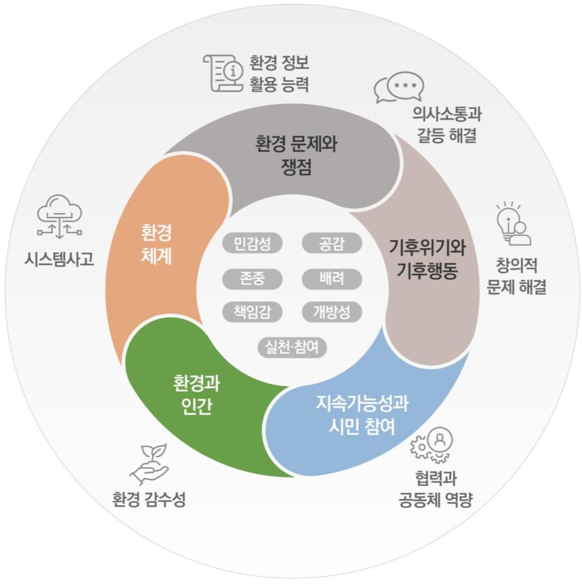

# 환경

### 교육과정 설계의 개요

2022 개정 환경과 교육과정은 교육과정 총론에서 제시하고 있는 개정의 중점 중 미래 사회가 요구하는 역량 함양이 가능한 교육과정, 학습자의 삶과 성장을 지원하는 교육과정, 지역⋅학교 교육과정 자율성 확대 및 책임 교육 구현 등과 긴밀히 연계된다. 환경과에서는 전 영역에 걸쳐 생태전환 교육을 체계적이고 심도 있게 통합하고 있으며, 교수⋅학습의 과정에서 민주시민 교육과 디지털 기초 소양을 적극적으로 반영하도록 하였다. 기후변화 등 환경 문제와 쟁점을 탐구하는 과정에서 학습자의 삶과 성장을 지원할 수 있도록 학습자가 행위 주체성을 가지고 탐구하고 참여 및 실천할 수 있게 하였으며, 지역과 학교의 연계를 통해 학습이 가능할 수 있도록 내용을 구성하였다. 2022 개정 교육과정에서 추구하는 인간상을 고루 반영하되, 특히 ‘더불어 사는 사람’과 관련해서는 더불어 사는 대상에 인간뿐만 아니라 인간 이외의 생물이나 자연도 적극적으로 포함할 수 있도록 설계하였다.

환경과 교육과정에서는 총론의 개정 중점과 핵심역량 등을 반영하여, 교과의 목표와 역량을 설정하였다. 환경과의 역량은 환경 감수성, 시스템사고, 협력과 공동체 역량, 의사소통 및 갈등 해결 역량, 창의적 문제 해결 역량, 환경 정보 활용 능력 등으로 설정하였다. 총론의 자기 관리, 지식정보처리, 창의적 사고 등의 역량은 ‘창의적 문제 해결 역량’에 포함하였으며, 심미적 감성은 ‘환경 감수성’에, 협력적 소통과 공동체 역량은 ‘협력과 공동체 역량’, ‘의사소통 및 갈등 해결 역량’으로 환경과의 특성에 맞게 설정하였다. 이에 더해 ‘시스템사고’, ‘환경 정보 활용 능력’ 등도 포함하였다.

환경과의 역량은 환경과의 성격에 대한 설명과 목표에 반영되어 있다. ‘환경 감수성’은 환경의 아름다움과 변화를 민감하게 인식하고, 환경의 아름다움이나 고통에 대해 감정을 이입하거나 공감하는 능력이다. ‘시스템사고’는 환경을 복잡한 단위 시스템으로 인식하고, 구성 요소의 상호 작용을 통해 전체 시스템을 이해하는 사고의 틀이며, 환경 체계의 역동성과 변화를 구조적⋅통합적으로 이해할 수 있도록 한다. ‘협력과 공동체 역량’은 지구 공동체의 구성원으로서 요구되는 환경적 가치와 태도를 함양하고, 다른 구성원들과 바람직한 관계를 형성⋅유지하며 자신의 역할과 책임을 다하는 능력이다. ‘의사소통 및 갈등 해결 능력’은 언어, 상징, 텍스트, 매체를 활용하여 자신의 생각과 감정을 타인과 효율적으로 소통하고, 갈등 상황을 둘러싼 이해관계자들의 요구를 고려하여 의견을 조정하는 능력이다. ‘창의적 문제 해결 역량’은 다양한 지식과 정보를 바탕으로 환경 문제에 대해 다양한 효과적 대안을 제시하고, 최선의 대안을 선택⋅적용할 수 있는 능력이다. ‘환경 정보 활용 능력’은 환경 문제 해결을 위해 디지털 정보를 포함한 다양한 정보와 자료를 수집⋅분석⋅평가하고 도구나 매체를 효과적으로 활용하는 능력이다.

환경과 교육과정은 성격, 목표, 내용 체계, 성취기준, 교수⋅학습 및 평가의 방향으로 구성된다. 성격에서는 환경과의 성격과 목적, 학습 영역, 접근 방식, 다른 학교급과의 연계 등을 제시하였고, 목표에서는 총괄 목표와 이들 목표를 구성하는 하위 목표를 제시하였다. 총괄 목표에서는 환경과의 지식⋅이해, 과정⋅기능, 가치⋅태도가 고루 포함되고, 교과 역량 중 환경 감수성과 시스템사고에 기반한 통합적 탐구, 문제 해결 등을 강조하고 있다. 세부 목표에서는 환경 감수성, 시스템사고, 창의적 문제 해결력, 의사소통 및 갈등 해결 역량 등을 강조하고 있다. 환경 정보 활용 능력은 교수⋅학습 및 평가의 방향에 제시되어 있다.

환경과에서는 세상과의 ‘연결’, ‘탐구’, ‘참여’의 원리에 기반하여 영역을 설정하였다. 학습 영역은 ‘환경과 인간’, ‘환경 체계’, ‘환경 문제와 쟁점’, ‘기후위기와 기후행동’, ‘지속가능성과 시민 참여’로 구성되어 있다. ‘환경과 인간’에서는 환경과 인간이 서로 연결되어 있음을 알고 느낄 수 있도록 하였으며, ‘환경 체계’, ‘환경 문제와 쟁점’, ‘기후위기와 기후행동’에서는 환경 및 환경 문제와 쟁점, 기후변화 등에 관한 탐구를 수행할 수 있도록 하였다. ‘지속가능성과 시민 참여’에서는 지속가능한 사회와 미래를 위해 실천하고 참여할 수 있는 시민 양성을 지향하고 있다. 각 영역 내에서도 연결, 탐구, 참여의 원리가 고루 구현될 수 있도록 하였다. 따라서 학습자는 각 영역을 학습하면서, 환경과 인간과의 연결을 인식한 후 환경 및 환경 문제와 쟁점, 기후위기 등을 탐구하고, 이를 토대로 지속가능한 지구 생태계를 위한 기후행동과 시민 참여를 실천할 수 있도록 하였다.

‘환경과 인간’에서는 환경이 인간과 다른 생물의 생존 및 활동의 기반이 되며, 인간과 환경은 연결되어 있다는 사실에 대한 이해를 바탕으로 장소감과 환경 감수성을 기를 수 있도록 하였다. ‘환경 체계’에서는 환경이 자연 생태계와 사회 체계가 상호 작용하여 형성⋅변화되는 하나의 체계라는 통합적 관점을 강조하고, 이를 시스템적으로 사고하고 접근할 수 있도록 하였다. ‘환경 문제와 쟁점’에서는 환경 문제가 다양한 요소와 유기적으로 연결되어 있음을 이해하고, 다양한 관점에서 통합적이고 심층적으로 환경 문제를 탐구하되, 환경 정의를 고려하여 해결 방안과 의사 결정에 참여할 수 있도록 하였다. 특히 2022 개정 교육과정에서 새로 추가된 ‘기후위기와 기후행동’ 영역에서는 기후위기, 생물다양성, 기후정의, 탄소 중립, 기후행동 등과 관련된 쟁점과 문제에 대한 이해, 해결 방안 탐색, 기후행동에의 참여와 실천 등이 가능할 수 있도록 하였다. ‘지속가능성과 시민 참여’에서는 건강하고 행복한 삶의 질을 위해서는 일상생활에서 지속가능한 삶의 양식을 추구해야 하며, 생태시민으로서의 역할을 알고 지속가능한 미래를 위한 개인적⋅사회적 노력에 참여할 것을 촉구하였다.

각 영역의 내용 체계에서는 학습자가 각 영역을 학습한 후 핵심적으로 체득하게 되는 핵심 아이디어를 2\~3개 선정하였으며, 이를 토대로 ‘지식⋅이해’, ‘과정⋅기능’, ‘태도⋅가치’ 등으로 구분하여 요소를 추출하였다. ‘지식⋅이해’에서는 각 영역의 주요 개념이나 원리 등을 포함하였으며, ‘과정⋅기능’에서는 경험, 성찰, 조사, 비교, 분석, 추론, 전망, 탐색, 탐구, 토론, 토의, 공유, 계획, 수행, 적용, 참여 및 실천 등 구체적인 과정이나 기능과 연계하여 환경과의 핵심역량을 선정하고 제시하였다. ‘태도⋅가치’에서는 ‘과정⋅기능’을 통해 학습하게 된 ‘지식⋅이해’와 함께 갖추게 될 감수성, 공감 등의 가치와 포용적 태도, 존중과 배려, 책임감, 지속가능성과 형평성을 추구하는 태도 및 참여와 실천 의지 등을 포함하였다(그림 1 참조). 성취기준은 내용 체계에 제시된 ‘지식⋅이해’, ‘과정⋅기능’, ‘태도⋅가치’들을 2가지 이상 결합하여 설정하였으며, 너무 많은 내용 요소가 포함되어 학습량이 증가하지 않도록 유의하였다.

[그림1] 2022 개정 환경과 교육과정의 구성

환경과의 학습 영역은 서로 연관되어 있어 필요에 따라 순서와 흐름을 조정하여 적용할 수 있다. 또한 이 과목의 학습 영역 중 일부는 사회나 과학, 윤리, 기술⋅가정 등 다른 교과의 학습 내용과도 관련이 있으므로 해당 내용을 자연과학적, 인문학적, 사회과학적, 예술적 관점 등을 포함한 환경 교육의 관점에서 해석하는 통합적 접근을 권장한다.

### 1. 성격 및 목표

가. 성격

중학교 ‘환경’은 학습자들이 환경의 중요성과 가치를 인식하고, 다른 사람들과 더불어 지구 생태계 내에서 조화로운 삶을 살아가는 데 요구되는 의지와 역량을 갖추어, 기후변화와 생물다양성 감소 등 인류가 직면한 환경 문제를 해결하고 지속가능한 사회를 만드는 데 기여할 수 있게 하는 과목이다.

이 과목은 학습자들이 각자가 처한 삶의 맥락에서 환경 및 환경 문제를 다루고, 그 과정에서 학교와 사회, 이론과 실천, 지성과 감성 등을 연계하며, 개인의 행복한 삶과 인간 사회 및 환경과의 관계에 대해 통찰함으로써, 지구 생태계와 인간 사회의 지속가능성을 위해 적극적으로 실천하고 참여할 수 있도록 하는 데 목적이 있다.

‘환경’ 과목에서는 세상과의 연결, 탐구, 참여의 원리에 기반하여 영역을 설정하였다. '환경' 과목의 학습 영역 중 ‘환경과 인간’에서는 인간과 환경과의 연결을, ‘환경 체계’, ‘환경 문제와 쟁점’, ‘기후위기와 기후행동’에서는 탐구를 지향하며, ‘지속가능성과 시민 참여’에서는 실천과 참여를 강조한다. 각 영역 내에서도 연결, 탐구, 참여의 원리가 고루 구현될 수 있도록 하였다.

각 학습 영역은 서로 연관되어 있어 필요에 따라 순서와 흐름을 조정하여 적용할 수 있다. 또한 이 과목의 학습 영역 중 일부는 사회나 과학 등 다른 교과의 학습 내용과도 관련이 있으므로 해당 내용을 자연과학적, 인문학적, 사회과학적, 예술적 관점 등을 포함한 통합적 관점에서 접근하는 것을 권장한다.

중학교 ‘환경’은 초등학교의 여러 교과에서의 환경 교육, 고등학교의 ‘생태와 환경’ 과목과 연계되어 있는 중학교 선택 과목의 하나로, 학교나 지역사회의 여건에 따라 내용과 수준을 조정할 수 있다.

나. 목표

자연 현상과 환경 변화에 대한 관심과 감수성을 가지고, 통합적 탐구를 통하여 인간과 환경과의 관계를 이해하며, 다른 사람들과 더불어 환경 문제를 해결하고, 지속가능한 사회 속에서 조화로운 삶을 살아가는 데 필요한 환경 소양과 실천 역량을 기른다.

(1) 인간과 환경 간의 상호 의존 관계를 인식하고, 환경, 경제, 사회 시스템이 서로 밀접하게 연관되어 있음을 이해한다.

(2) 환경을 탐구하고 환경 문제의 통합적 해결책을 찾는 데 필요한 시스템사고, 창의적 문제 해결력, 의사소통 및 갈등 해결 역량 등을 기른다.

(3) 환경에 대한 다양한 경험과 성찰을 통해 환경 감수성과 환경친화적 태도를 기른다.

(4) 건강하고 쾌적한 환경을 보전하고 지속가능한 삶을 실천하는 다양한 수준의 활동에 적극적으로 참여한다.

### 2. 내용 체계 및 성취기준

가. 내용 체계

(1) 환경과 인간

| 핵심 아이디어 | ∙ 인간은 환경 안에서 살아가며, 환경과 인간의 삶은 서로 연결되어 있어 영향을 주고받는다. ∙ 환경을 바라보는 관점은 다양하며, 개인과 사회의 환경관에 따라 환경에 대한 태도와 의사 결정이 달라진다. ∙ 인간은 경험을 통해 환경의 아름다움과 변화, 훼손 등을 민감하게 느끼고, 환경에 의미를 부여하며 관계를 맺는다. |
| --- | --- |
| 구분 범주 | 내용 요소 |
| 지식⋅이해 | ∙ 환경과 인간의 관계 ∙ 다양한 환경관: 인간중심주의와 생태중심주의 ∙ 자연의 아름다움 ∙ 지역 환경과 나의 관계: 지역 환경 탐사 |
| 과정⋅기능 | ∙ 환경과 인간의 관계 조사하기 ∙ 환경에 대한 다양한 관점 비교하기 ∙ 환경과 인간의 바람직한 관계 토론하기 ∙ 자연에 대한 자신의 느낌과 경험 표현하기 ∙ 지역 환경 탐사 계획하고 수행하기 |
| 가치⋅태도 | ∙ 환경의 아름다움과 변화에 대한 감수성 ∙ 자신과 다른 관점에 대한 포용적 태도 ∙ 생명과 환경에 대한 존중과 배려 ∙ 자신이 사는 지역과 장소에 대한 관심과 참여 의지 ∙ 환경에 대한 책임감 |

(2) 환경 체계

| 핵심 아이디어 | ∙ 지구 생태계는 물, 대기, 토양, 인간을 포함한 생물 등으로 구성되며 이들은 서로 영향을 주고받는다. ∙ 환경은 지구 생태계와 인간 사회로 구성된 복잡한 시스템이다. ∙ 환경 체계의 변화와 역동성을 이해하기 위해서는 환류적⋅통합적 사고가 필요하다. |
| --- | --- |
| 구분 범주 | 내용 요소 |
| 지식⋅이해 | ∙ 물, 대기, 토양, 생물 등 지구 생태계 구성 요소의 특징과 역할 ∙ 물, 대기, 토양, 생물 등 지구 생태계와 인간 사회의 상호 작용 ∙ 환경 변화와 시스템사고 ∙ 환경 체계의 의미와 복잡성 |
| 과정⋅기능 | ∙ 환경 체계 구성 요소의 특징 조사하기 ∙ 환경 체계 구성 요소 간 상호 작용 분석하기 ∙ 지역적⋅지구적 수준에서 환경 체계의 변화 추론하기 |
| 가치⋅태도 | ∙ 환경 체계 내 자연과 문화 다양성의 가치 인식 ∙ 부분에서 나아가 전체를 바라보는 인식과 태도 |

(3) 환경 문제와 쟁점

| 핵심 아이디어 | ∙ 환경 문제와 쟁점은 지구 생태계 및 사회 체계와 유기적으로 연결되어 있다. ∙ 환경 문제와 쟁점의 탐구는 환경적⋅사회적⋅경제적 관점에서 통합적⋅심층적으로 접근될 필요가 있다. ∙ 환경 문제와 쟁점을 분석하고 해결 방안을 제시할 때는 지속가능성과 형평성에 대한 고려가 필요하다. |
| --- | --- |
| 구분 범주 | 내용 요소 |
| 지식⋅이해 | ∙ 환경 문제와 지구 생태계 및 사회 체계의 연결성 ∙ 에너지 이용과 자원 순환의 문제 및 쟁점 ∙ 지역 환경 문제와 지구 환경 문제 ∙ 지속가능성과 형평성을 고려한 환경 문제 해결 방안 |
| 과정⋅기능 | ∙ 환경 문제와 환경 체계 내 상호 작용 연결하기 ∙ 환경 문제의 원인과 영향 조사하고 추론하기 ∙ 환경 문제에 관한 탐구 계획 및 수행하기 ∙ 환경 문제 해결을 위한 참여와 실천하기 |
| 가치⋅태도 | ∙ 환경 문제의 복잡성과 통합성 인식 ∙ 환경 문제에 대한 인간의 책임 인식 ∙ 환경 문제 이해 및 해결 과정에서 지속가능성과 형평성 추구 ∙ 환경 문제 해결을 위한 주체적 환경 행동 의지 |

(4) 기후위기와 기후행동

| 핵심 아이디어 | ∙ 기후변화는 전 지구적으로 발생하고 있으며, 지구 생태계와 인간 사회에 중대한 영향을 끼친다. ∙ 기후위기는 인간 활동이 초래하였으며, 그 영향과 피해는 지역과 집단에 따라 다르게 나타난다. ∙ 기후위기 극복을 위해 사회 전 분야에서 기후행동의 계획과 실천이 필요하다. |
| --- | --- |
| 구분 범주 | 내용 요소 |
| 지식⋅이해 | ∙ 기후변화와 기후위기 ∙ 기후변화의 영향과 피해 ∙ 기후위기와 생물다양성의 관계 ∙ 온실가스 배출과 기후위기 ∙ 기후행동 |
| 과정⋅기능 | ∙ 기후변화의 영향과 불평등 사례 조사하기 ∙ 일상생활 속 온실가스 배출 조사하고 비교하기 ∙ 기후위기 대응 원칙에 대해 토의하기 ∙ 기후행동을 계획하고 실천하기 |
| 가치⋅태도 | ∙ 기후변화 피해에 대한 공감 ∙ 기후위기에 대한 인간의 책임감 ∙ 기후행동 참여와 실천 의지 |

(5) 지속가능성과 시민 참여

| 핵심 아이디어 | ∙ 지속가능한 미래를 위해서는 지구 시스템의 한계를 고려한 삶의 양식 추구 및 개인과 사회의 변화 모색이 필요하다. ∙ 지속가능한 미래를 위해서는 비인간 존재와 미래 세대에 대한 배려와 책임감, 자신이 살아가는 세계에 대한 주체적 행동이 필요하다. |
| --- | --- |
| 구분 범주 | 내용 요소 |
| 지식⋅이해 | ∙ 지속가능성의 의미와 필요성 ∙ 지속가능한 사회와 환경 정의 ∙ 생태시민의 의미와 역할 |
| 과정⋅기능 | ∙ 지속가능성의 복합적 의미 탐색하기 ∙ 지속가능한 미래를 꿈꾸고 상호 소통하기 ∙ 배려의 대상과 범위 토의하기 ∙ 개인적⋅사회적 환경 실천에 참여하고 평가하기 |
| 가치⋅태도 | ∙ 미래 세대와 비인간 존재에 대한 배려 ∙ 지속가능한 사회를 위한 책임감과 실천 의지 ∙ 지속가능한 미래를 위한 창의성⋅개방성 |

나. 성취기준

(1) 환경과 인간

[9환01-01] 일상생활이 환경에 미치는 영향과 환경이 일상생활에 미치는 영향을 조사하여 인간과 환경의 관계를 탐색하고, 환경에 대한 우리의 역할과 책임을 인식한다.
[9환01-02] 환경 갈등 상황에서 환경에 대한 자신의 관점과 의견을 제시하고, 환경을 바라보는 다양한 관점을 비교하여 환경과 인간의 관계를 탐색한다.
[9환01-03] 오감을 활용해 자연을 체험하고, 자연의 아름다움이나 변화, 훼손 등에 대한 생각과 감정을 다양한 방법으로 표현한다.
[9환01-04] 학교나 지역 환경 탐사를 통해 지역과 나의 관계를 이해하고, 탐사 결과를 다양한 매체와 방법으로 제시한다.

(가) 성취기준 해설

• [[9환01-01] 지역의 숲, 하천, 공원이나 기후, 식생 등의 환경이 일상생활에 미치는 영향과 일상생활이 환경에 미치는 영향 등을 조사하여 인간 삶의 질과 환경이 서로 연결되어 영향을 주고받음을 이해하고, 환경에 대한 인간의 역할과 책임을 탐색하여 공유하도록 한다.

• [9환01-02] 환경 개발과 보존 간의 갈등 등 서로 다른 환경관이 상충하는 갈등 상황에서 근거를 들어 자신의 의견을 제시하고 타인의 의견을 경청하며 토의⋅토론을 진행하고, 이를 통해 나타나는 인간중심주의와 생태중심주의 관점을 비교하며 인간과 환경의 바람직한 관계를 탐색한다. 이와 관련하여 지속가능성의 의미와 사례에 관한 성취기준 [9환05-01]을 같이 다룰 수 있다.

• [9환01-04] 학교나 지역의 환경 관련 시설과 장소를 탐사 및 탐구하는 환경 프로젝트를 수행하여 사진, 글, 그림, 지도, 보고서 등의 결과물로 표현하고 여러 매체를 통해 공유하는 활동을 할 수 있다. 주변 환경과 자신의 관계 및 환경이 자신에게 어떤 의미가 있는지 탐색할 수 있도록 한다.

(나) 성취기준 적용 시 고려 사항

• 인간이 환경 안에서 살아가며, 환경과 인간의 삶이 서로 연결되어 있음을 이해하도록 한다. 환경에 대한 관점을 구분하여 이해하고, 생명과 환경을 존중하며 살아가려는 태도를 갖추도록 강조한다.

• 우리 생활이 환경에 미치는 영향을 조사할 때 환경에 미치는 부정적 영향에만 치우치지 않도록 유의한다. 플라스틱 덜 쓰기, 제로 웨이스트, 친환경 소비 등과 같이 환경에 부담을 줄이며 긍정적 변화를 이끄는 행동과 영향을 함께 조사하여 인간과 환경의 관계에 대한 여러 측면을 탐색하도록 한다. 우리 생활과 환경의 상호 영향은 학교와 지역의 환경 관련 장소를 탐사하며 조사할 수 있으며, 지역 환경 탐사([9환01-04])와 연계하여 수행할 수 있다.

• 지역 환경 탐사 활동은 일상생활과 밀접한 주제를 선정하여 학교 안과 학교 주변, 동네와 같이 자신이 주로 생활하는 장소를 중심으로 수행할 수 있도록 하며, 체험 및 탐사 과정에서 다른 생명이나 환경에 부정적 영향을 미치지 않게 주의한다. 사전 준비와 안전 교육 등을 통해 체험과 탐사 과정에서 발생할 수 있는 안전사고를 예방한다.

• 구체적인 사례나 환경 갈등 상황을 통해 인간중심주의와 생태중심주의 환경관을 이해하고, 환경과 인간의 바람직한 관계를 탐색하는 데 중점을 둔다. 이 때 자신의 환경관을 확인하고, 환경에 대한 서로 다른 생각들이 존중될 수 있도록 허용적인 분위기와 민주적인 의사소통 자세를 강조한다. 특정 환경관을 지향해야 할 것 같은 분위기가 조성되지 않도록 유의한다.

• 오감을 활용한 환경 체험 활동을 통해 환경의 아름다움이나 변화, 훼손 등을 직접 경험하고 자신의 생각과 감정을 여러 방법으로 표현하며 인터넷과 사회 관계망 서비스(SNS) 등 다양한 디지털 매체를 통해 소통할 수 있도록 한다.

(2) 환경 체계

[9환02-01] 생태계 구성 요소인 물, 대기, 토양, 생물이 지구 생태계의 유지에 기여하는 역할과 특징을 살펴보고, 이를 통해 지구 생태계 구성 요소의 상호 작용을 파악한다.
[9환02-02] 지구 생태계 구성 요소와 인간 사회의 상호 작용 사례를 지역적, 지구적 차원에서 찾아보고, 환경의 다양한 수준에 미치는 영향과 시간의 흐름에 따른 변화를 추론한다.
[9환02-03] 환경은 물, 대기, 토양, 생물로 구성된 지구 생태계와 정치⋅경제⋅문화⋅법과 제도 등 인간 사회의 상호 작용을 기반으로 다양성과 복잡성을 가진 시스템임을 탐구한다.

(가) 성취기준 해설

• [9환02-01] 지구 생태계의 구성 요소가 서로 연결되어 작동하는 것을 물과 대기의 순환, 토양 침식, 식물의 성장 등 둘 이상의 요소가 상호 작용하는 사례를 통해 파악하도록 한다.

• [9환02-02] 물, 대기, 토양, 생물 등으로 구성된 지구 생태계와 인간 사회가 서로 영향을 주고받는 사례로 기후변화, 생물다양성 감소, 오존층 파괴와 같은 지구적 차원뿐 아니라 미세 먼지, 도시화, 생태 복원 같은 지역 차원의 사례를 분석하여 시간의 흐름에 따른 변화가 전체 시스템에 미치는 영향을 추론하여 제시할 수 있도록 한다.

(나) 성취기준 적용 시 고려 사항

• 환경이 지구 생태계와 인간 사회가 상호 작용하면서 작동되는 하나의 체계, 즉 시스템이라는 것을 인식할 수 있도록 한다. 환경과 인간이 연결되어 있다는 인식을 바탕으로 지구 생태계와 인간 사회의 관계를 개별적 관점이 아닌 전체적 관점에서 탐구할 수 있도록 시스템사고를 활용한다.

• 지구 생태계를 구성하는 물, 대기, 토양, 생물 등과 연관된 환경학의 내용을 중심으로 다루며 학년 및 학교급별 수준과 다른 교과와의 연계 속에서 깊이와 범위를 조절할 수 있다.

• 지구 생태계의 구성 요소가 서로 연결되어 작동하고 있음을 순환 고리, 흐름도, 인과 지도 등 시각적 자료를 활용하여 인식하도록 한다. 요소 간 상호 작용의 결과는 표, 그래프, 다이어그램, 사진 등 변화의 추세를 파악할 수 있는 자료를 이용하여 탐색하도록 한다.

• 생물 자원, 자연 문화유산, 중요 농업 유산 등 국내외 사례를 활용하여 (유전자, 생물종, 생태계 등) 여러 수준의 다양성이 서로 연결되어 작동함을 이해하며, 환경 체계 내 자연과 문화의 다양성이 가지는 가치를 발견하도록 한다.

• 디지털 도구 등을 활용한 데이터 수집, 분석, 해석 등의 활동에 참여하는 과정에서 환경 체계를 구성하는 요소들의 역할 및 상호 작용을 통합적으로 분석하고 해석할 수 있는지 평가한다.

(3) 환경 문제와 쟁점

[9환03-01] 지구 생태계의 구성 요소와 관련된 환경 문제를 조사하여 그 문제의 특성을 파악하고, 환경 문제의 발생 원인과 영향을 사회, 문화, 경제 등 여러 측면을 고려하여 분석하고 추론한다.
[9환03-02] 신⋅재생 에너지, 핵발전, 자원 재활용과 쓰레기 처리 등 에너지 이용 및 자원 순환과 관련된 문제를 탐구하는 과정을 계획하여 수행하고, 관련된 요소 간의 상호 작용을 분석한다.
[9환03-03] 환경 문제의 원인과 영향을 데이터를 기반으로 조사하고, 관련 쟁점과 해결 방안을 탐구 한다.
[9환03-04] 지역 환경 문제가 지구 환경 문제와 어떻게 연결되어 있으며, 지구 생태계의 구성 요소 중 어떤 것과 관련이 있는지 파악하고, 지속가능성과 형평성을 고려하여 해결 방안을 제시 한다.

(가) 성취기준 해설

• [9환03-01] 지구 생태계의 구성 요소인 물, 대기, 토양, 생물로 구분하여 관련된 환경 문제를 조사하되, 최근 발생한 문제뿐만 아니라 과거부터 자주 발생했거나 해결된 사례도 다루어 시사점을 얻을 수 있도록 한다. 또한 환경 문제는 한번 발생하면 이전 상태로 되돌리기 어렵고, 그 영향이 좁은 지역에 국한되지 않고 넓은 범위에 걸쳐 나타나며, 문제 발생 시점과 영향이 드러나는 시기 간에 차이가 있음을 이해할 수 있도록 한다. 환경 문제의 발생 원인과 영향을 분석하고 추론할 때는 환경 문제의 특성뿐만 아니라 사회, 문화, 경제 등 여러 측면을 고려한다. 이와 관련하여 지속가능성의 의미와 사례에 관한 성취기준 [9환05-01]을 같이 다룰 수 있다.

• [9환03-03] 환경 문제는 그 영향과 피해를 입는 집단이나 지역이 다를 수 있으며 문제의 원인이나 해법에 대해 다양한 의견이 존재할 수 있다는 것을 사례를 통해서 파악하게 한다. 또한 충분한 정보 공유와 합리적 의사소통 등 환경 문제 해결을 위해 필요한 원칙과 방법을 모색해 볼 수 있도록 한다.

(나) 성취기준 적용 시 고려 사항

• 환경 문제는 여러 요소가 복잡하게 얽혀 작동한 결과로 발생할 수 있다는 점에 주목하여 환경 문제를 탐구하고, 해결 방안을 제시할 때 지구 생태계 구성 요소와 사회 체계 구성 요소 등 관련 요소를 통합적으로 접근하여 탐색할 수 있도록 한다.

• 환경 문제와 쟁점에 관한 탐구는 환경, 사회, 문화, 경제 등을 고려한 의사 결정 과정을 바탕으로 탐구를 계획하고 수행한다.

• 환경 문제 탐구는 문제 인식, 주제 선정, 탐구 계획, 조사 활동, 수행 결과물 발표, 사후 연계 활동 등의 단계를 거쳐 수행하도록 한다.

• 지역 환경 문제 탐구는 자신이 사는 지역 또는 일상생활과 밀접하게 관련된 주제를 선정하여 수행하고, 지구 환경 문제 탐구는 열대 우림 파괴, 사막화 등 여러 나라 또는 지구 전체에 걸쳐 발생하는 주제를 다루도록 한다.

• 가능한 한 최신의 데이터를 활용하며, 학습자의 흥미와 관심을 고려하여 학습자의 삶이나 진로와 연관성이 깊은 주제와 사례를 다루도록 한다.

• 환경 문제의 해결 방안을 제시할 때 과학적 측면과 사회⋅문화⋅경제적 측면 등을 통합적으로 고려하면서 개인, 지역, 국가 등 다양한 주체의 역할과 실천 전략을 구체적이고 창의적으로 제시하는지 평가한다.

(4) 기후위기와 기후행동

[9환04-01] 지구 역사와 함께 기후가 어떻게 변화해 왔고 전망되는지 이해하고 현재의 기후위기 상황을 인식한다.
[9환04-02] 생물다양성 감소 등 기후변화의 영향과 피해, 갈등과 불평등에 관한 사례를 탐구하고, 사람과 자연이 겪는 고통에 공감하며 지구 공동체의 관점에서 기후변화 피해를 줄이는 방법을 토의한다.
[9환04-03] 온실가스의 종류와 특성을 알아보고, 온실가스 배출원과 배출량을 비교하여 인간 활동이 기후변화에 끼친 영향을 파악한다.
[9환04-04] 지속가능한 미래를 위한 기후위기 대응 방향을 토의하고, 개인적⋅지역적⋅국가적 차원의 기후행동 사례를 탐구한다.
[9환04-05] 학교와 지역에서 실천할 수 있는 기후행동을 계획하고 참여하며 그 결과를 성찰한다.

(가) 성취기준 해설

• [9환04-03] 교통⋅생산⋅소비⋅주거⋅음식 등 일상생활에서 어떤 종류의 온실가스가 배출될 수 있는지 탐구하고, 주요 온실가스의 종류와 배출원, 기여도 및 부문별 배출량을 파악하여 기후변화와 인간 활동 방식이 밀접한 관계를 맺고 있음을 이해하도록 한다.

• [9환04-04] 희망하는 미래를 상상해 보고, 지속가능성 등 기후대응 방법을 결정할 때 고려해야 할 주요 원칙을 토의하도록 한다. 에너지 효율 향상과 에너지 전환 기술, 온실가스 저감 기술과 행동, 지역의 탄소 중립 정책 등 구체적인 기후행동 사례를 탐구하여 학교와 지역을 위한 기후행동 계획에 참고가 되도록 한다. 이와 관련하여 지속가능성의 의미와 사례에 관한 성취기준 [9환05-01]을 같이 다룰 수 있다.

(나) 성취기준 적용 시 고려 사항

• 기후변화 현상의 심각성과 영향을 파악하고 그로 인한 피해에 공감하며, 기후위기의 원인을 일상생활과 연결 지어 구체적으로 탐구하여, 기후위기의 피해를 줄이고 온실가스를 감축하는 기후행동을 계획하고 실천하도록 한다.

• 기후변화는 자연적 요인과 인위적 요인에 의해서 일어날 수 있다는 점을 고려하되, 최근의 기후변화를 기후위기라고 부르는 이유에 초점을 맞추어 살펴보도록 한다. 지구 표면 온도 상승 속도, 자연재해의 발생 빈도와 강도 증가, 생물다양성 감소, 건강과 생계 위협, 사회 갈등 등이 서로 연결되어 있음에 주목하고 기후변화는 미래의 문제가 아니라 긴급하게 대응해야 할 당장의 문제라는 점을 인식할 수 있도록 한다.

• 기후위기의 원인인 인간의 삶의 방식과 자원 및 에너지의 사용 등을 탐구함으로써 어떤 방향으로 어느 정도의 변화가 필요한지를 모색하며 미래의 모습은 현재의 선택에 따라 달라질 수 있음을 강조하도록 한다.

• 우리나라와 지역의 기후변화 현황과 전망에 관한 구체적이고 실제적인 자료를 바탕으로 상황을 파악하고, 기후변화 대응에 주체적 참여와 실천 의지를 갖출 수 있도록 한다.

• 학교 또는 마을의 기후행동 계획과 이행 과정에서 관련 정보와 자료를 직접 검색, 수집, 분석 및 시각화하고, 이를 바탕으로 동료들과 토의를 통하여 결정하여 이행할 수 있도록 한다.

(5) 지속가능성과 시민 참여

[9환05-01] 지속가능성의 의미를 이해하여 주거, 교통, 먹거리, 소비 등 일상생활에서 지속가능발전의 사례를 찾아보고, 창의적⋅개방적 태도로 지속가능한 미래 모습을 구상해 보며 자신의 견해를 제시한다.
[9환05-02] 생태시민의 의미와 역할을 이해하여 미래 세대와 비인간 존재에 대한 배려와 존중이 필요함을 인식하고 배려의 대상과 범위에 대해 토의한다.
[9환05-03] 환경 정의 측면에서 자신이 살고 있는 마을이나 지역에 적용할 수 있는 지속가능한 사회를 위한 개인적⋅사회적 실천 방안을 조사하여 참여해 보고, 실천 방안을 평가한다.

(가) 성취기준 해설

• [9환05-01] 지속가능성은 환경⋅경제⋅사회 등이 서로 복합적으로 연계되어 있음을 이해하고, 일상생활에서 접하는 주거, 교통, 먹거리, 소비 등을 대상으로 사례를 조사하고, 창의적이고 개방적인 태도로 지속가능한 미래 사회의 모습에 대해 동료들과 함께 논의하는 과정을 경험하도록 한다. 이 성취기준은 필요시 1영역 [9환01-02], 3영역 [9환03-01], 4영역 [9환04-04] 성취기준과 같이 다룰 수 있도록 한다.

• [9환05-03] 현 세대 내의 형평성, 현 세대와 미래 세대 간의 형평성, 인간과 비인간 존재 간의 형평성 등 환경 정의 측면을 고려하여 자신이 살고 있는 마을이나 지역에서 지속가능한 사회를 위해 실천할 수 있는 방안을 조사하도록 한다. 지속가능한 사회를 위한 개인적⋅사회적 차원의 실천을 학습자 스스로 선택해 참여해 보고, 실천 전략과 실천 방안 등을 동료와 평가하고 개선점을 모색할 수 있도록 한다.

(나) 성취기준 적용 시 고려 사항

• 지속가능성은 환경⋅경제⋅사회 등 다양한 측면이 복합적⋅통합적으로 연계되어 있음을 이해하도록 하며, 지속가능한 미래를 위한 방안에 대해 자신의 견해를 제시할 수 있도록 한다. 이때 지속가능한 미래를 위해서는 지구시스템의 한계를 고려한 삶의 양식 추구 및 개인과 사회의 변화 모색이 필요함을 인식할 수 있도록 한다.

• 시나리오법 등을 활용해 지속가능한 미래 사회의 모습을 예측하고, 학습자가 성인이 되었을 때 마주할 수 있는 지속가능한 미래를 이미지나 글 등으로 표현하여 구체적으로 명료화할 수 있도록 한다. 또한 현실적으로 실현 가능한 미래를 고민하기보다는 많은 아이디어와 가능성을 찾을 수 있는 기회를 제공하고, 창의적인 아이디어를 제시할 수 있도록 허용적인 분위기를 형성한다.

• 배려해야 할 대상과 책임의 범위는 교사가 정해주는 것이 아니라 학습자들 스스로 성찰⋅통찰할 수 있도록 한다.

• 개인적⋅사회적 실천에 참여할 때, 자신의 삶과 관련된 주제를 선정해 프로젝트 활동으로 수행하여 학습자의 역량 개발을 돕고, 계획 및 실행 단계에서부터 토의를 장려하며 결과물은 다양한 형태로 나타낼 수 있도록 지도한다.

• 배려해야 할 대상과 책임의 범위를 논의하는 토론 학습, 생태시민의 역할을 고민하는 토의 학습은 교사의 관찰 평가와 토의⋅토론 활동에 참여한 학습자들 간 동료 평가가 함께 진행될 수 있도록 한다.

• 개인적⋅사회적 실천에 대한 평가는 주제 선정, 계획, 실행, 발표로 진행되는 수행의 전 과정을 평가하기 위해 자기 평가와 동료 평가, 관찰 평가 등을 활용한다.

### 3. 교수⋅학습 및 평가

가. 교수⋅학습

(1) 교수⋅학습의 방향

(가) 중학교 ‘환경’에서는 환경 감수성, 시스템사고, 협력과 공동체 역량, 의사소통 및 갈등 해결 역량, 창의적 문제 해결 역량, 환경 정보 활용 능력 등을 기르는 데 초점을 두고 있으며, 학습자 주도의 지역 환경 탐구와 환경 체험, 프로젝트 접근법 등 다양한 교수⋅학습 방법을 활용할 수 있다.

(나) 교육과정의 내용 체계표 및 성취기준 등에서 제시된 내용을 고려하되, 학교 여건, 지역 특성, 학습자의 요구 등을 고려하여 교육과정을 재구성하여 학습자의 배움과 삶이 연계될 수 있도록 한다.

(다) 환경 문제에 대한 이해는 환경 자체 및 환경의 변화에 대한 충분한 이해를 바탕으로 이루어지는 것이 바람직하므로, 교수⋅학습의 과정에서 물, 대기, 토양, 생물, 생태계 등에 관한 환경과학적 기본 지식이 제공될 수 있도록 한다.

(라) 자신이 살고 있는 지역의 환경 문제를 인식하여 이를 개선하거나 해결하기 위한 과정에 적극적으로 참여할 수 있도록 창의적 체험활동, 지역사회 환경 교육 프로그램 등과 연계하여 학습 활동을 구성할 수 있다.

(마) 상호 관련성과 시⋅공간적 광범위성 등 환경 문제가 갖는 일반적인 속성을 총체적 시각에서 파악하고 환경 문제를 예방하고 해결하는 데 참여할 수 있도록 한다.

(바) 간학문적인 성격이 강한 주제를 다룰 때, 과학, 사회, 도덕 등 인접 교과와의 관련성을 파악하여 내용 중복을 피하고 서로 연계할 수 있도록 한다. 이때 인접 교과의 유사 내용을 융합한 프로젝트 등을 설계하여 수행하는 것도 가능하다.

(2) 교수⋅학습 방법

(가) 환경과 관련한 다양한 주제에 대해 의미 있는 학습이 이루어지도록 강의, 문헌 조사, 토의⋅토론, 의사 결정, 가치 탐구, 사례 연구, 실험⋅실습, 현장 답사 및 조사, 역할극, 프로젝트 학습, 협력 학습 등 여러 가지 교수⋅학습 방법을 적절히 활용한다.

(나) 지역 환경 탐사 및 탐구 활동은 학습자의 삶이나 일상생활과 밀접한 주제를 선정하여 학교 안과 학교 주변, 동네와 같이 자신이 주로 생활하는 장소를 중심으로 수행할 수 있도록 하며, 충분한 토의를 통해 계획, 조사 활동, 결과물 정리, 발표를 단계적으로 수행할 수 있도록 한다.

(다) 탐구의 과정에서는 신문, 방송, 다큐멘터리, 영화, 인터넷, 도서, 각종 홍보물 등 다양한 매체를 통해 탐색하여 가능한 한 최신의 데이터를 활용하고, 탐구 결과는 포트폴리오, 보고서, 동영상, 사회 관계망 서비스(SNS), 홍보물, 캠페인, 연극 연출 등 여러 가지 방식으로 구현하며, 이를 학교 구성원 및 공동체와 공유할 수 있도록 한다.

(라) 학교 환경 개선 활동과 학교 숲, 생태 연못, 텃밭 가꾸기 등 학교 환경을 활용한 체험을 통하여 환경 감수성을 증진시키며, 환경을 보전하고 자연과 생명의 소중함을 인식하는 동시에 가시적인 변화를 만드는 경험을 할 수 있도록 지도한다.

(마) 개인적⋅사회적 환경 실천을 계획 및 실행할 때 학교 내외의 인적 자원을 활용하고, 다양한 환경 실천에 참여하고 있는 단체와 사람을 접할 수 있는 기회를 제공하여, 변화의 가능성에 대한 학습에 더해 학습자의 진로 탐색에 도움을 줄 수 있도록 한다.

나. 평가

(1) 평가의 방향

(가) 중학교 ‘환경’ 과목의 평가는 목표, 핵심 아이디어, 내용, 교수⋅학습 등이 일관성을 유지하도록 한다.

(나) 환경에 대한 지식⋅이해뿐만 아니라, 과정⋅기능, 가치⋅태도 영역을 균형 있게 평가하되 영역의 내용과 활동의 성격에 따라 강조점을 달리할 수 있다.

(다) 지역 환경 탐구, 지속가능한 사회를 만들기 위한 실천 등과 같은 모둠 단위의 활동은 주제 선정, 계획, 실행, 결과 발표로 진행되는 수행의 전 과정을 평가하며, 자기 평가와 동료 평가, 교사 관찰 평가 등과 개인별 평가와 모둠별 평가를 고루 적용할 수 있도록 한다.

(라) 탐구 과정 및 평가, 사후 활동 과정에서 특정 학습자가 주도하거나 소외되지 않도록 유의하고, 계획서, 보고서, 수행 횟수 등과 같은 정량적인 평가 지표뿐만 아니라 갈등 해결 노력, 공감, 관심도 등 정성적인 평가도 반영하도록 한다.

(2) 평가 방법

(가) 관찰, 면담, 점검표, 논술, 포트폴리오 등 여러 방법으로 평가하고, 교사 평가에 더하여 자기 평가, 동료 평가 등 다면적인 평가를 활용한다.

(나) 교수⋅학습의 결과뿐만 아니라 활동 과정 중의 수시 평가, 모둠 단위의 활동에 대한 평가 등 과정에 대한 평가가 이루어질 수 있도록 한다.

(다) 환경 체험과 환경 탐사, 환경 탐구 및 토의⋅토론 등 교수⋅학습 과정의 다양한 결과물과 참여 과정을 종합하여 평가 자료로 활용하고, 결과 평가에서는 글, 그림, 사진, 지도, 포트폴리오, 동영상, 사회관계망 서비스(SNS), 홍보물, 캠페인, 연극 연출 등의 다양한 결과물을 활용한다.

(라) 모둠 활동 과정과 사례 연구 보고서, 발표, 개념 지도 등 결과물에 대한 평가 항목이 골고루 포함될 수 있도록 하며, 평가기준을 학습자들에게 사전 안내한다.

(마) 모둠 활동은 활동 과정에 진지하게 참여하여 다른 사람의 의견을 경청하고, 비판적으로 수용하며 다양성을 존중하는 태도로 임하는지, 자기 평가, 동료 평가, 교사 관찰 평가 등을 통해 평가한다.

