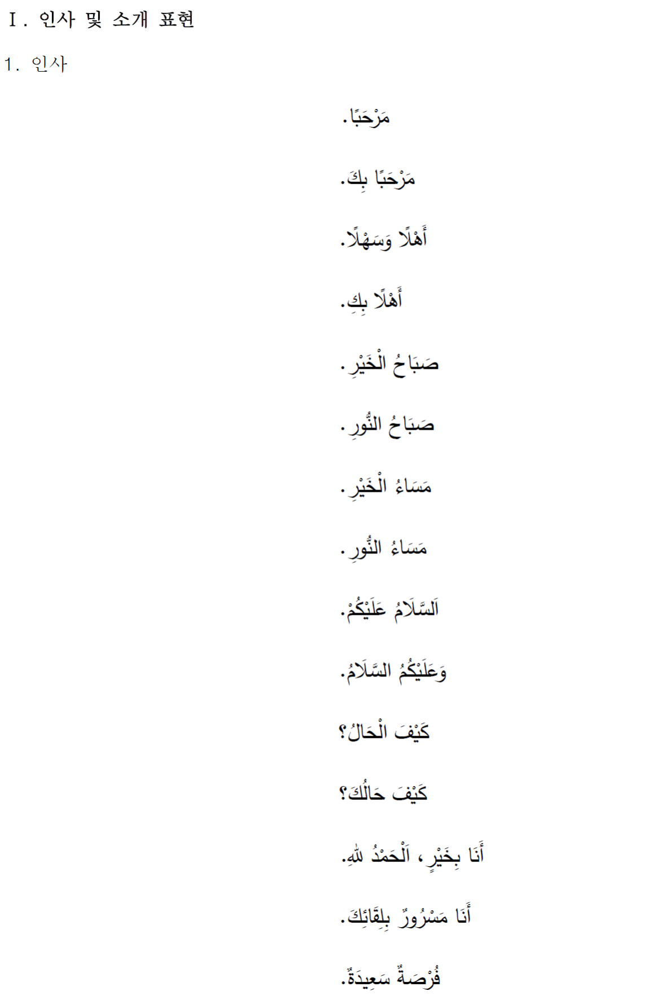
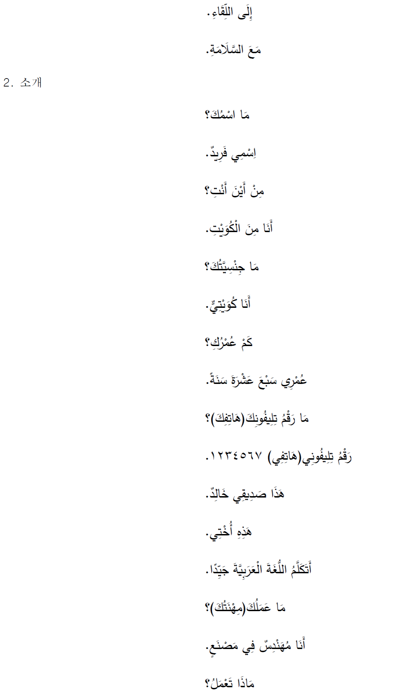
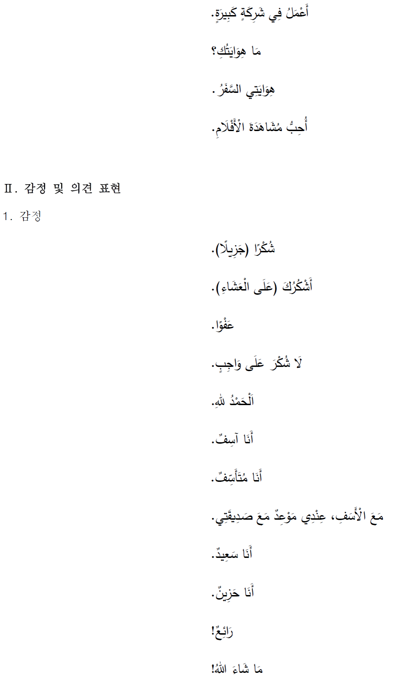
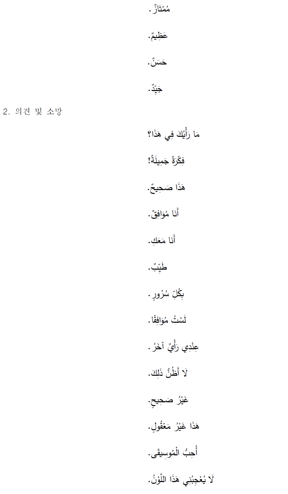
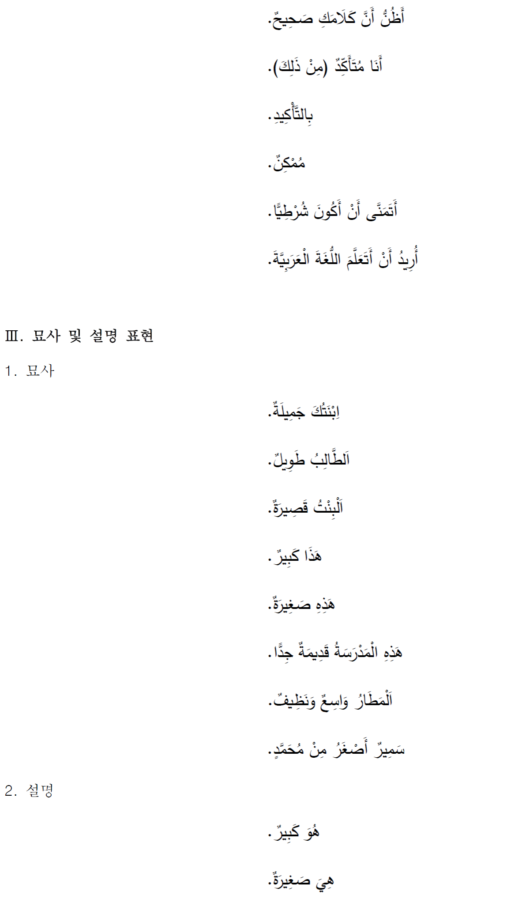
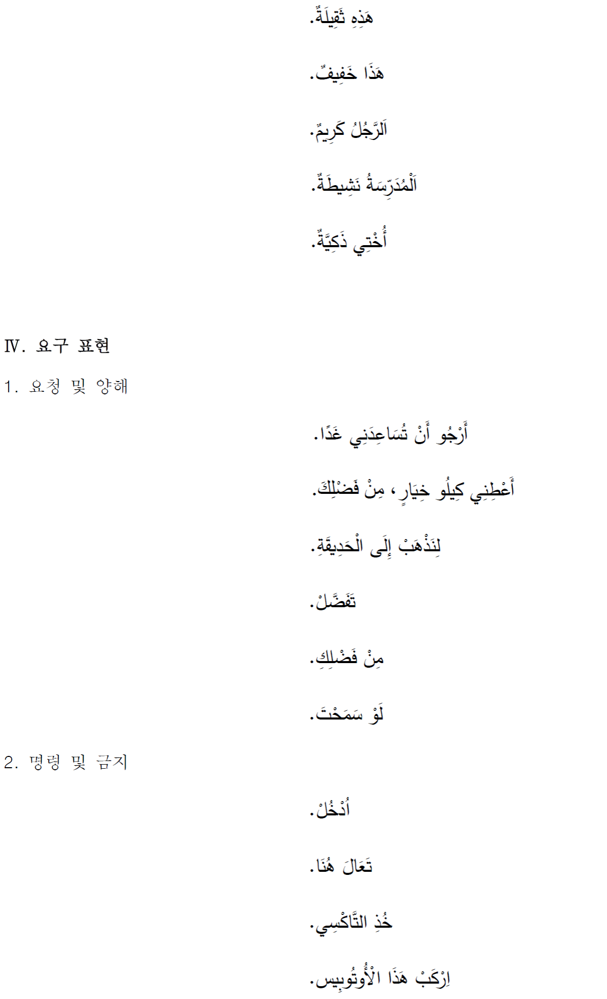
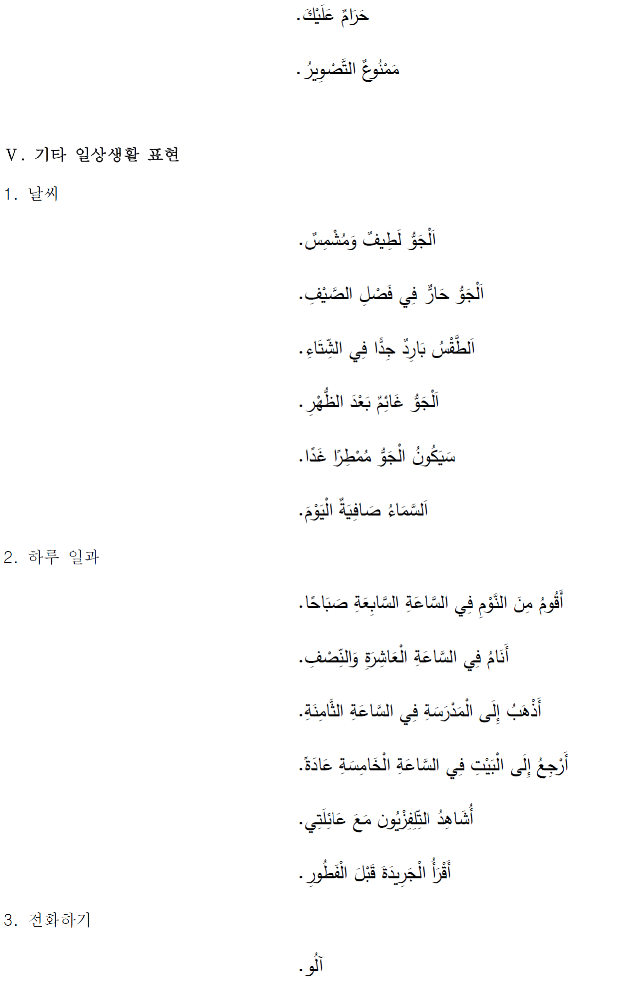
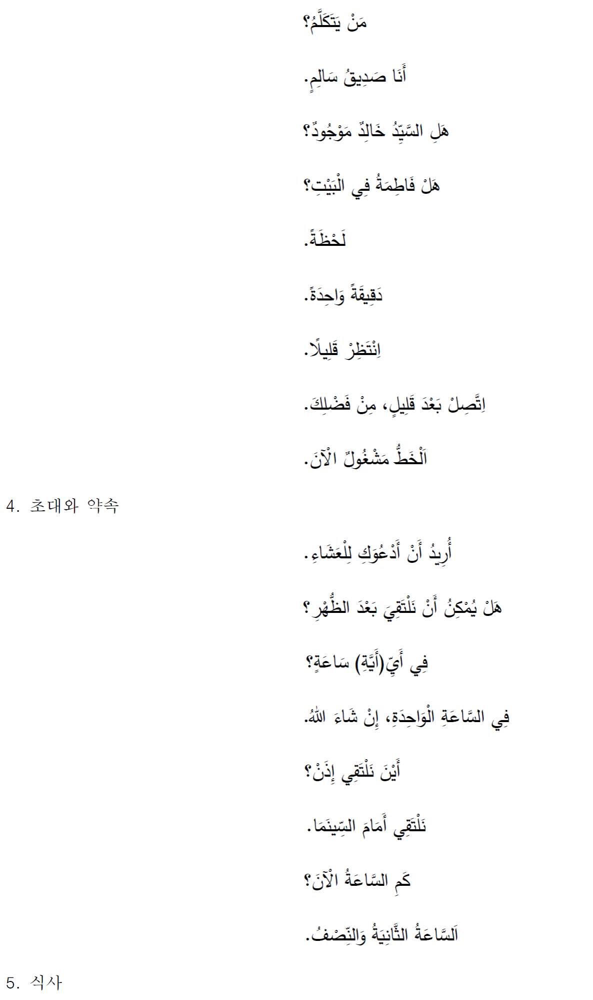
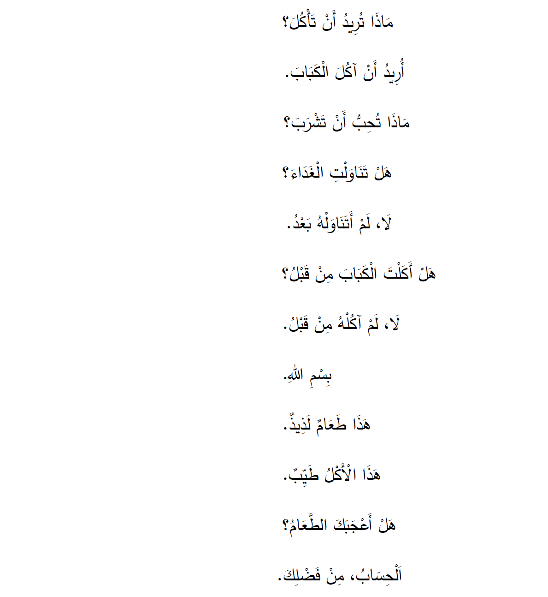

# 생활외국어

### 교과 교육과정 설계의 개요

제2외국어과 교육과정에서는 2022 개정 교육과정 총론에서 제시한 6개의 핵심역량인 ‘자기 관리, 지식정보처리, 창의적 사고, 심미적 감성, 협력적 소통, 공동체 역량’을 반영하여, ‘의사소통 역량, 상호문화 이해 역량, 디지털 기반 정보 활용 역량’을 제2외국어과 교과 역량으로 설정하였다. 각 과목의 총괄 목표는 세계 각 지역의 다양한 언어와 문화를 상호문화적 관점에서 이해하고, 실생활에서 접하는 다양한 주제에 대해 협력적으로 의사소통할 수 있는 능력을 함양하는 것이다. 이러한 제2외국어 교과 본연의 성격과 기능을 바탕으로, 학생들이 관심과 흥미를 가지는 주제에 대하여 다양한 매체와 자료를 통해 깊이 있게 탐구하여 학습자의 자기주도적 학습을 촉진시킬 수 있도록 세부 목표를 설정하였다. 또한, 환경⋅지속가능발전 교육 및 생태전환 교육 등 범교과 학습 주제와 타 문화에 대한 포용적 시각과 협력적 공동체 의식을 교과 내용 체계에 담아, 제2외국어 학습을 통해 전 지구적 문제를 협력적으로 소통하며 해결해 가는 공동체 역량을 기를 수 있도록 내용을 구성함으로써 총론의 주요 방향을 구체적으로 실현하는 데 기여하도록 하였다.

제2외국어과 교육과정 문서 체제는 ‘성격, 목표, 내용 체계, 성취기준, 성취기준 해설, 영역 성취기준 적용 시 고려 사항, 교수⋅학습 및 평가의 방향’ 순으로 구성되었다. ‘성격’에서는 디지털 혁신을 바탕으로 한 21세기의 특징적인 상황을 기술하고, 미래 사회에서의 외국어 교육의 중요성 및 8개 언어별 외국어 교육의 필요성과 중요성, 그리고 해당 과목의 특성을 제시하였다. ‘목표’에서는 제2외국어 학습을 통해 함양하고자 하는 능력이 무엇인지를 총괄 목표와 세부 목표로 구분하여 제시하였다. ‘내용 체계’에서는 우선 각 영역별 내용 체계 표 제시에 앞서 도입부에 내용 체계의 기반이 되는 언어 재료, 즉 발음 및 철자, 어휘, 문법, 의사소통 표현에 대한 규정 및 수준의 정도를 총괄적으로 제시하였다.

‘생활 외국어’, ‘외국어’, ‘심화 외국어’ 과목의 ‘내용 체계’는, 듣기, 말하기, 읽기, 쓰기의 언어 4기능과 문화로, 총 5개 영역으로 구성하였다. 외국어 교육은 언어 기능을 구분하여 이루어지기도 하지만 듣기-말하기, 듣기-쓰기, 읽기-말하기, 읽기-쓰기, 말하기-쓰기 등 기능의 다양한 조합으로 이루어지기 마련이므로, 실제 교수⋅학습 시 상황에 따라 언어 4기능을 자유롭게 조합하여 활용할 수 있을 것이다. 문화 영역에서는 제2외국어 교과 역량인 ‘상호문화 이해 역량’을 강조하고 원어뿐 아니라 우리말도 활용할 수 있게 하여 공동체 의식 및 포용적으로 소통하는 태도를 기르는 데 용이하도록 하였다. ‘외국어 회화’와 ‘외국(어권) 문화’ 과목의 경우 ‘내용 체계’가 곧 과목의 내용으로서, 단일 영역으로 구성하였다. ‘외국어 회화’ 과목은 듣기와 말하기 능력을 초점화하여 구성하였고, ‘외국(어권) 문화’ 과목은 해당 언어(권) 문화를 상호문화적 관점에서 폭넓게 이해할 수 있도록 문화 내용을 다양하고 심도 있게 다루도록 하였다. ‘성취기준’은 영역 학습을 통해서 학생들이 할 수 있어야 하거나 할 수 있기를 기대하는 결과나 도달점으로 진술하였다. ‘내용 체계’의 내용 요소와 연계성을 고려하여 세 가지 범주 중 두 가지 이상의 범주를 결합하여 영역 성취기준을 마련하였다. ‘성취기준 해설’과 ‘영역 성취기준 적용 시 고려 사항’을 통해서 학교 현장에서 성취기준이 잘 구현될 수 있도록 하였으며, ‘교수⋅학습 및 평가의 방향’에서 교과 역량을 달성하기 위한 구체적인 방향과 방법을 제시하였다.

제2외국어과 핵심 아이디어는 해당 영역의 학습을 통해서 일반화할 수 있는 내용을 핵심적으로 진술한 것으로, 내용 체계 표에 제시된 구체적인 내용을 학습해야 하는 이유 및 학습의 근거나 방향성을 지시해 준다. 제2외국어 교과의 역량과 과목 목표를 고려하여 내용 체계의 세 가지 범주, 지식⋅이해, 과정⋅기능, 가치⋅태도의 측면을 포괄하는 수준에서 영역별로 2\~3개 내외의 문장으로 기술하였다.

2022 개정 제2외국어과 교육과정의 내용 체계를 구성하는 세 가지 범주 중, 지식⋅이해는 세 층위, 즉 음성⋅음운 측면, 문장 단위를 고려한 통사적인 측면, 포괄적인 의사소통 단위를 고려한 의사소통 측면으로 구분하였다. 학교급이나 과목 간 위계 설정을 고려하여, 통사적인 측면의 구나 문장에 대해서는 ‘간단하고 쉬운’, ‘간단한’, ‘짧고 쉬운’, ‘다소 긴’과 같이 외국어 교수⋅학습에서 일반적으로 사용되는 형용사를 이용하여 어려움 및 길이의 정도를 표현하는 것으로 위계를 나타내고자 하였다. 의사소통 측면에서는 [별표 II]에서 제시하는 [의사소통 기본 표현]의 범주화된 항목을 가감하는 방식으로, 문화 영역에서는 다룰 수 있는 주제를 다양화하거나 심화하는 방식으로 그 위계를 제시하였다. 과정⋅기능, 가치⋅태도의 범주에서는 인식의 차이나 사고의 깊이 등으로 수준 차이를 두었다. 과정⋅기능에서는 외국어 학습을 위한 지식의 이해와 적용을 가능하게 하며, 외국어 학습의 결과로 학생들이 교과 내용으로 수행할 수 있는 구체적인 능력을 포함하여 제시하였다. 가치⋅태도의 범주에서는 언어 4기능과 문화를 학습 과정에서 습득되는 교과 내용과 관련된 태도나 해당 영역의 학습을 통해 학생들이 내면화할 수 있는 가치나 태도를 기술하였다.

### 1. 성격 및 목표

가. 성격

인공지능이 주도하는 4차 산업혁명 시대가 본격적으로 시작되었다. 향후 우리의 삶이 어떤 모습으로 바뀔지 정확히 가늠할 수는 없지만, 21세기 들어 가속화된 세계화의 흐름은 앞으로도 계속될 가능성이 높아 보인다. 정보 통신 분야의 혁신과 발상의 전환으로 인해 지구촌 구성원들 간의 교류가 이전과는 다른 차원으로 활성화되고, 다양한 미디어를 활용한 서로 간 소통의 기회도 나날이 증가하고 있기 때문이다. 기술의 발전에 따라 물리적으로 하나가 되어 가는 미래 사회에서도 상호 간의 진정한 소통을 위해서는 서로 다른 언어와 문화권에 대한 폭넓은 이해가 중요하며, 그 출발점이자 구심점이 바로 외국어 교육이라 할 수 있다.

외국어는 학생들이 더 넓은 세계를 경험하고 세계 시민으로 성장하도록 도와주는 핵심적인 요소이다. 학생들은 외국어를 습득함으로써 해당 언어권 사람들과 능동적으로 소통하고 교류할 수 있는 수단을 갖게 된다. 또한 외국어 학습을 통해 자신과는 다른 이들의 가치관과 사고방식, 생활 습관 등을 접하면서 학생들이 타 문화에 대한 존중과 이해의 필요성을 체득하고 나아가 공동체 구성원으로서의 기본적인 태도와 자질을 함양할 수 있다.

중학교 「생활 외국어」는 ‘독일어’, ‘프랑스어’, ‘스페인어’, ‘중국어’, ‘일본어’, ‘러시아어’, ‘아랍어’, ‘베트남어’ 등 8개 외국어로 구성되어 있다. 학생들은 생활 외국어 학습을 통해 해당 언어권의 다양한 문화 내용을 이해하고, 기본적인 언어 재료를 바탕으로 의사소통 능력의 기초를 닦을 수 있다. 이 과정에서 우리와 다른 문화권 사람들에 대한 이해력과 포용적 자세를 갖춘 역량 있는 인재로 성장할 것이다.

나. 목표

해당 외국어 의사소통 능력의 기초를 마련하고 외국어권 문화를 상호문화적 관점에서 이해함으로써 세계 시민으로 성장하는 데 필요한 기본 능력을 기른다. 구체적 목표는 다음과 같다.

(1) 해당 외국어 의사소통 능력의 기초를 마련한다.

(2) 해당 외국어권 문화를 상호문화적 관점에서 이해한다.

(3) 다양한 매체와 자료를 통해 해당 외국어권에 대한 정보를 조사⋅정리하고 상호 협력적인 태도로 정보와 의견을 교환한다.

# 생활 독일어

### 2. 내용 체계 및 성취기준

가. 내용 체계

※ 내용 체계는 아래 제시된 ‘언어 재료’를 기반으로 한다.
• 발음 및 철자: 현대 독일어 표준 발음과 정서법을 따른다.
• 어휘: 고등학교 보통 교과 독일어과 교육과정의 [별표 Ⅰ]에 제시된 기본 어휘를 중심으로 200개 내외의 낱말을 사용하도록 권장한다.
• 문법: 「생활 독일어」 교육과정에 제시된 [의사소통 기본 표현]을 참고한다.
• 의사소통 표현: 「생활 독일어」 교육과정에 제시된 [의사소통 기본 표현]을 중심으로 다룬다.

(1) 듣기

<table>
<tr><th>핵심 아이디어</th><th>• 발음 규칙에 유의하여 소리와 낱말을 식별하거나 의미를 파악하는 것이 듣기의 기본이다. • 상대방의 말을 경청하고 공감하는 자세가 원활한 의사소통의 바탕이 된다.</th></tr>
<tr><td>구분 범주</td><td>내용 요소</td></tr>
<tr><td rowspan="3">지식⋅이해</td><td>• 자음과 모음 • 소리와 철자 • 강세와 억양</td></tr>
<tr><td>• 낱말 • 간단한 구 • 간단하고 쉬운 문장</td></tr>
<tr><td>• 인사와 소개(인사, 소개 등) • 묘사 및 견해(인물 및 사물, 생각 및 입장 등) • 감정 및 의사(선호 및 호감, 감사 등) • 정보 요구 및 제공(위치 및 교통, 시간, 환경과 기후 등) • 일상생활(취미와 여가 활동, 음식 주문과 계산, 상품 구매, 미디어 활용 등)</td></tr>
<tr><td>과정⋅기능</td><td>• 발음을 듣고 철자와 낱말 식별하기 • 듣고 내용과 의도 파악하기 • 듣고 상황에 맞게 반응하기</td></tr>
<tr><td>가치⋅태도</td><td>• 내용에 대한 흥미와 적극적인 참여 자세 • 상대방의 말에 대한 존중과 경청 • 다양한 관점과 의견에 대한 공감과 수용</td></tr>
</table>

(2) 말하기

<table>
<tr><th>핵심 아이디어</th><th>• 명확한 의사 전달을 위해서는 발음 규칙에 유의하여 말하는 것이 중요하다. • 기초적인 표현을 상황에 맞게 말하는 것이 원활한 의사소통을 가능하게 한다.</th></tr>
<tr><td>구분 범주</td><td>내용 요소</td></tr>
<tr><td rowspan="3">지식⋅이해</td><td>• 자음과 모음 • 소리와 철자 • 강세와 억양</td></tr>
<tr><td>• 낱말 • 간단한 구 • 간단하고 쉬운 문장</td></tr>
<tr><td>• 인사와 소개(인사, 소개 등) • 묘사 및 견해(인물 및 사물, 생각 및 입장 등) • 감정 및 의사(선호 및 호감, 감사 등) • 정보 요구 및 제공(위치 및 교통, 시간, 환경과 기후 등) • 일상생활(취미와 여가 활동, 음식 주문과 계산, 상품 구매, 미디어 활용 등)</td></tr>
<tr><td>과정⋅기능</td><td>• 발음 규칙을 이해하고 올바르게 발음하기 • 자신의 생각과 의견 말하기 • 상황과 맥락에 맞게 표현하기 • 묘사 및 설명하기</td></tr>
<tr><td>가치⋅태도</td><td>• 상대방에 대한 존중 • 적극적으로 말하는 태도 • 상대방과 협력적으로 소통하는 자세</td></tr>
</table>

(3) 읽기

<table>
<tr><th>핵심 아이디어</th><th>• 발음 규칙에 유의하여 소리 내어 읽는 것이 정확한 내용 이해에 도움이 된다. • 간단하고 쉬운 자료를 읽고 주제나 의미를 파악하는 것이 문해력의 기본이다.</th></tr>
<tr><td>구분 범주</td><td>내용 요소</td></tr>
<tr><td rowspan="3">지식⋅이해</td><td>• 자음과 모음 • 소리와 철자 • 강세와 억양</td></tr>
<tr><td>• 낱말 • 간단한 구 • 간단하고 쉬운 문장</td></tr>
<tr><td>• 간단하고 쉬운 대화문 • 간단하고 쉬운 텍스트(문자 메시지, 이메일, 사회 관계망 서비스(SNS), 초대장, 메모, 일기, 안내문, 광고문, 서식 등)</td></tr>
<tr><td>과정⋅기능</td><td>• 발음 규칙에 유의하여 소리 내어 읽기 • 낱말⋅구⋅문장의 의미 이해하기 • 읽고 내용 파악하기</td></tr>
<tr><td>가치⋅태도</td><td>• 읽기 자료에 대한 흥미와 집중 • 다양한 관점과 의견에 대한 공감과 수용 • 타인의 경험과 견해에 대한 존중</td></tr>
</table>

(4) 쓰기

<table>
<tr><th>핵심 아이디어</th><th>• 어법에 맞게 낱말, 구, 문장을 쓰는 것이 작문의 기본이다. • 상황과 목적에 맞는 글을 쓰는 것이 정확한 의사소통을 위해 필요하다.</th></tr>
<tr><td>구분 범주</td><td>내용 요소</td></tr>
<tr><td rowspan="3">지식⋅이해</td><td>• 정서법</td></tr>
<tr><td>• 낱말 • 간단한 구 • 간단하고 쉬운 문장</td></tr>
<tr><td>• 간단하고 쉬운 대화문 • 간단하고 쉬운 텍스트(문자 메시지, 이메일, 사회 관계망 서비스(SNS), 초대장, 메모, 일기, 안내문, 광고문, 서식 등)</td></tr>
<tr><td>과정⋅기능</td><td>• 어법에 맞게 쓰기 • 상황과 목적에 맞게 쓰기</td></tr>
<tr><td>가치⋅태도</td><td>• 글쓰기에 대한 흥미와 자신감 • 다양한 관점이나 의견에 대한 존중과 배려 • 자신의 생각을 명확하게 표현하는 자세</td></tr>
</table>

(5) 문화

| 핵심 아이디어 | • 독일어권 문화에 대한 이해는 원활한 의사소통의 근간이 되며 문화적 감수성을 키우는 데 도움이 된다. • 독일어권 문화를 상호문화적 관점에서 이해하고 소통하는 것은 공존의 가치를 존중하고 포용하는 태도를 갖추는 데 도움이 된다. |
| --- | --- |
| 구분 범주 | 내용 요소 |
| 지식⋅이해 | • 주요 언어문화(인사말, 속담과 격언 등) • 주요 생활 문화(의식주, 여가 활동, 취미, 기념일 등) • 주요 사회 문화(인물, 예술, 지리, 명절과 축제 등) |
| 과정⋅기능 | • 문화 내용 조사⋅정리하기 • 조사⋅정리한 내용 설명하기 • 의사소통에 문화 내용 활용하기 |
| 가치⋅태도 | • 타 문화에 대한 호기심 • 타 문화에 대한 적극적인 탐구 자세 • 문화적 다양성에 대한 이해와 타 문화에 대한 포용적 태도 |

나. 성취기준

(1) 듣기

[9생독01-01] 낱말이나 간단한 구를 듣고 소리와 낱말을 식별한다.
[9생독01-02] 낱말이나 간단한 구, 간단하고 쉬운 문장, 간단하고 쉬운 대화를 듣고 의미를 이해한다.
[9생독01-03] 상대방의 말을 경청하며 적극적으로 호응한다.

(가) 성취기준 해설

• [9생독01-03] 이 성취기준은 상대방의 말에 대한 존중과 경청을 바탕으로 몸짓이나 표정, 감탄사 등을 활용하여 학습자가 대화에 적극적으로 참여하는 태도를 갖추게 하고자 설정하였다.

(나) 성취기준 적용 시 고려 사항

• 듣고 이해하는 것에 대해 부담을 낮추고 듣기에 흥미를 가질 수 있도록 간단한 문장이나 표현을 들려주고 몸짓이나 표정, 행동을 포함하여 다양한 방식으로 이해한 것을 표현할 수 있도록 한다.

• 독일어를 처음 접하는 「생활 독일어」 학습자가 일상생활에서 빈번하게 접하는 주제에 대한 낱말이나 간단한 구, 간단하고 쉬운 문장이나 대화로 듣기 활동을 구성하여 효과적으로 학습할 수 있도록 한다.

• 듣기 태도 평가 시 해당 성취기준을 독립적으로 평가하기보다는 다른 성취기준과 조합 및 재구성하여 통합적으로 평가하는 것을 권장한다.

• 학생의 일상생활과 관련된 사례를 활용하되 일상생활에서 흔히 접할 수 있는 온라인 매체 영상 자료, 창작물 등을 자료로 삼아 평가할 수 있으며, 이때 개인 정보가 노출되거나 사생활이 침해되지 않도록 주의한다.

(2) 말하기

[9생독02-01] 낱말이나 간단한 구, 간단하고 쉬운 문장을 발음 규칙에 유의하여 말한다.
[9생독02-02] 간단하고 쉬운 의사소통 표현을 사용하여 상황에 맞게 말한다.
[9생독02-03] 상대방을 존중하며 말하기 활동에 적극적으로 참여한다.

(가) 성취기준 해설

• [9생독02-03] 이 성취기준은 상대방에 대한 존중을 바탕으로 타인과 상호 작용할 때 협력적으로 소통하는 자세와 적극적으로 말하는 태도를 갖추기 위해 설정하였다.

(나) 성취기준 적용 시 고려 사항

• 낱말이나 문장을 듣고 강세와 억양에 유의하여 따라서 말하는 연습을 우선 실시하고 인사말이나 간단한 정보에 대해 강세와 억양에 유의하여 묻거나 답할 수 있도록 한다.

• 독일어 학습에 대한 흥미와 자신감을 가질 수 있도록 역할 놀이, 짝 활동이나 모둠 활동, 게임, 영상 등 다양한 매체와 학습 방법을 통해 관련 표현을 자연스럽게 반복적으로 학습할 수 있도록 한다.

• 말하기 능력에 대한 평가는 가급적 수행평가를 통해 실시하며 역할극, 묻고 답하기, 퀴즈 등의 과제를 활용하여 (학습)과정을 중시하는 평가로 진행한다.

(3) 읽기

[9생독03-01] 말이나 간단한 구, 간단하고 쉬운 문장을 발음 규칙에 유의하여 소리 내어 읽는다.
[9생독03-02] 낱말이나 간단한 구, 간단하고 쉬운 문장을 읽고 의미와 내용을 파악한다.
[9생독03-03] 간단하고 쉬운 대화문이나 텍스트를 읽고 정보를 파악한다.

(가) 성취기준 해설

<없음>

(나) 성취기준 적용 시 고려 사항

• 소리 내어 읽을 때에는, 혼자 읽기, 반 전체 함께 읽기, 짝과 번갈아 가며 읽기, 모둠원들에게 읽어 주기 등 다양한 방법을 활용한다. 낱말이나 구, 문장을 정확하게 소리 내어 읽게 하며 글의 전체 내용을 이해하는지 질문을 통하여 확인한다.

• 구나 문장을 학습할 때 개별 낱말의 의미에만 초점을 두지 않고 문장 전체의 의미를 이해하고 활용할 수 있도록 한다.

• 읽기 자료는 시각 자료 및 다양한 종류의 멀티미디어 자료, 인공지능 기반 애플리케이션 등을 활용하여 학습자의 흥미를 높일 수 있도록 한다.

• 학습자의 관심 주제를 반영한 읽기 자료를 제공할 수 있도록 한다.

• 읽기에 대한 평가는 지필평가 및 다양한 활동의 수행평가, 문장을 읽고 이해한 내용을 행동으로 표현하기, 문장을 읽고 일치하는 그림 찾기 등 학습 과정 중심으로 평가한다.

(4) 쓰기

[9생독04-01] 낱말이나 간단한 구, 간단하고 쉬운 문장을 어법에 맞게 쓴다.
[9생독04-02] 간단하고 쉬운 대화문이나 텍스트를 상황과 목적에 맞게 작성한다.
[9생독04-03] 글쓰기에 흥미를 갖고 쓰기 활동에 적극적으로 참여한다.

(가) 성취기준 해설

<없음>

(나) 성취기준 적용 시 고려 사항

• 개별 학습자들의 어학 수준과 학습 속도를 고려하여 낱말을 쓰는 단순한 활동부터 어법에 맞는 쉬운 수준의 문장을 완성하는 활동까지 수준별 과제를 제공하도록 한다. 이때 간단하고 쉬운 텍스트 형태에서 어휘와 문법을 자연스럽게 학습하도록 한다.

• 낱말과 구, 문장 베껴 쓰기, 지시에 따라 문장 바꿔 쓰기 등 통제된 글쓰기를 단계별로 적용하되 점차 통제 정도를 줄여가면서 쓰기 학습을 할 수 있도록 한다.

• 간단하고 쉬운 대화문, 간단하고 쉬운 텍스트(문자 메시지, 이메일, 사회 관계망 서비스(SNS), 초대장, 메모, 일기, 안내문, 광고문, 서식 등) 등 일상생활에서 친숙한 글을 쓸 수 있도록 한다.

• 글을 완성하는 활동을 할 때 협력적 글쓰기 등의 다양한 형태의 쓰기 학습 방법을 활용하여 글쓰기에 대한 부담감을 완화하고 성취감을 느낄 수 있도록 한다.

• 쓰기 활동에 어려움을 느끼는 학습자에게는 필요한 어휘를 일부 제공하거나 사전이나 번역기 등을 활용하도록 허용한다.

(5) 문화

[9생독05-01] 독일어권 주요 문화 내용을 이해한다.
[9생독05-02] 독일어권 주요 문화 내용을 조사하여 설명한다.
[9생독05-03] 독일어권 주요 문화 내용을 이해하여 독일어 의사소통 상황에 활용한다.
[9생독05-04] 독일어권 문화에 대해 호기심을 갖고 탐구 활동에 적극적으로 참여한다.

(가) 성취기준 해설

• [9생독05-03] 이 성취기준은 학습을 통해 습득한 독일어권의 주요 문화 내용에 대한 지식을 독일어로 이루어지는 대화 상황에서 질문이나 대답 등에 적절히 활용하도록 설정하였다. 예를 들어 「생활 독일어」의 [의사소통 기본 표현]에서 ‘인사’ 표현을 상황에 맞게 활용할 수 있도록 한다.

(나) 성취기준 적용 시 고려 사항

• [9생독05-03]의 성취기준을 제외한 그 외 성취기준은 학습자의 수준을 고려하여 우리말로 수행할 것을 권장한다. 독일어권 문화 내용을 조사할 때 학습자의 학업 경험과 독일어 학습 수준을 고려하여 우리말로 된 자료를 활용하고 우리말로 설명할 수 있도록 한다.

• 독일어권 문화 내용을 다양한 매체를 활용하여 조사하고 그 결과를 발표할 때는 학습자의 비교, 분석, 비판 능력을 함께 평가할 수 있다.

• 학습자들이 다양한 매체를 활용하여 독일어권 문화 내용을 조사하여 설명할 때는 공신력 있는 기관의 자료를 활용할 수 있도록 안내하며 정보에 대한 출처를 바르게 남길 수 있도록 지도한다.

• 학습자 스스로 관심 있는 주제를 선정하여 조사할 수 있도록 하여 흥미를 유발한다.

• 음식, 춤, 노래 등 학습자가 실제로 경험해 볼 수 있는 활동을 구상하여 생동감 있는 수업이 되도록 한다.

### 3. 교수⋅학습 및 평가

가. 교수⋅학습

(1) 교수⋅학습의 방향

(가) 듣기-말하기, 듣기-쓰기, 읽기-말하기, 읽기-쓰기, 말하기-쓰기 등 언어의 네 가지 기능을 다양하게 조합하여 의사소통 활동이 이루어지도록 교수⋅학습 방법을 수립한다.

(나) 학습자의 수준을 고려하여 일상생활에서 빈번하게 접하는 주제에 대한 기초적인 독일어 의사소통 능력을 신장하고, 상호문화적 관점에서 독일어권 문화를 이해할 수 있도록 학습 내용을 구성한다.

(다) 다양한 매체를 수업에 활용하여 학습자의 학습 동기와 흥미도를 제고하고 학습의 효율성을 극대화하며, 다양한 디지털 자료 검색을 통해 지식정보처리 역량을 향상할 수 있도록 교수⋅학습 방법을 구안한다.

(라) 학습자의 사전 학습 내용 및 경험과 연계하여 점진적으로 새로운 내용을 학습할 수 있도록 수업을 설계함으로써 학습 동기를 유발하고 자신감을 기를 수 있도록 한다.

(마) 학습자들의 독일어 사용 능력, 학습 유형 및 전략 등을 고려하여 과제 및 체험 활동 등 자기주도 학습이 이루어지도록 다양한 교수⋅학습 방법을 선정한다.

(2) 교수⋅학습 방법

(가) 주제 및 상황별 학습 활동을 통해 의사소통 기본 표현을 이해하고 활용할 수 있도록 교수⋅학습 내용을 구성한다.

(나) 수업 도입 단계에서는 이전 학습 활동에서의 학업 성취 결과를 퀴즈 등을 통해 확인하고 학습자의 수준을 파악하여 보완 및 보충이 이루어지도록 한다. 수업 전개 단계에서는 학습 단계별 이해 정도를 점검하고 지도하여 학습자가 학습 내용을 점진적으로 이해하도록 한다.

(다) 학습 활동 및 결과에 대한 학습자 자신의 자기 진단을 토대로, 학습 과제를 재구성하여 학습자 스스로 계획, 활동, 성찰을 통해 학습 목표를 달성하도록 한다.

(라) 학습 효과를 높일 수 있도록 상황과 목적에 맞게 인터넷, 사회 관계망 서비스(SNS), 휴대폰, 멀티미디어 등 ICT(정보 통신 기술)를 적극적으로 활용하여, 학습 내용 및 감정과 견해 등을 공유하거나 학습자 간 쌍방향으로 소통하도록 한다.

(마) 다양한 형태로 제작된 디지털 자료를 토대로 학습 주제와 관련된 정보를 수집하고 모둠별로 발표⋅토론하여 비판적으로 해석 및 수용하는 정보 해독 능력을 기르도록 한다.

(바) 학습할 수 있는 충분한 기회와 시간을 제공하여 프로젝트 학습, 문제 기반 학습 등을 통해 협동 학습 능력을 키우도록 한다.

(사) 학습자의 동기와 흥미를 유발하고 자신감을 기를 수 있도록 역할극이나 노래, 그림 그리기, 게임, 퀴즈 등 창의적으로 표현할 수 있는 기회를 제공한다.

(아) 최소 성취수준을 보장하기 위하여 학습자에게 맞는 명료한 질문을 하여 내용이해 여부를 확인하고, 상황에 따라 적절한 피드백을 제공함으로써 교사나 학습 자료의 도움을 통해 학습자가 오류를 수정할 수 있게 한다.

(자) 최소 성취수준을 보장하기 위하여 학습자가 소외되지 않도록 학습자 간 활발한 상호 작용을 유도할 수 있는 문제 기반 학습 및 과제 중심 활동 등을 적절히 활용한다. 또한 개별 학습자가 자신이 성취 가능한 학습 내용을 중심으로 자기주도적 학습을 할 수 있도록 한다.

나. 평가

(1) 평가의 방향

(가) 학습자의 통합적인 독일어 능력을 신장시킬 수 있도록 듣기, 말하기, 읽기, 쓰기의 개별 언어 기능에 대한 평가뿐만 아니라 통합 언어 기능에 대한 평가도 시행한다.

(나) 일상생활에서 빈번하게 접하는 주제에 대한 기초적인 독일어 의사소통 능력 및 상호문화적 관점에서 독일어권 일상 문화를 이해하는지 평가한다. 문화적 지식뿐만 아니라 문화의 상호 비교를 통해 문화의 다양성을 인정하고 존중하는 태도를 포함하여 평가한다.

(다) 다양한 ICT(정보 통신 기술)를 목적에 맞게 활용하여 평가를 실시한다. 학습자의 삶과 연관된 실제적인 평가 맥락을 제공하고 다양한 형태의 평가를 실시하여 이를 토대로 다각적인 평가 결과를 도출한다.

(라) 학습 성과에 대한 평가는 학습한 내용을 새로운 상황과 맥락에 적용할 수 있는지에 초점을 둔다. 학습한 내용에 대한 단순 이해 확인 차원을 넘어서 새로운 상황에 적용하고 활용할 수 있는 역량을 갖추었는지를 평가한다. 이를 위하여 성취기준을 기반으로 학습 내용을 적용하여 사용할 수 있는 실제적이고 새로운 맥락과 상황을 제시하여 학습자의 독일어 수행 능력을 평가해야 한다.

(마) 학습자의 학업 능력, 학습 성향 및 독일어 수준을 고려하여 다양한 평가 방식을 마련하여 맞춤형 평가를 시행한다. 평가 결과를 바탕으로 개별 맞춤형 피드백을 제공하여 학습자의 학습 성장을 돕는다.

(바) (학습)과정을 중시하는 평가를 통해 단계별 성취를 이룰 수 있도록 한다. 교사는 평가 결과를 지속적으로 모니터링하여 교수⋅학습에 환류한다.

(2) 평가 방법

(가) 기본 어휘와 의사소통 기본 표현을 중심으로 일상생활과 관련된 기초적인 독일어 표현을 이해하고 활용하는 언어 활동 능력을 평가한다.

(나) 원격 회의 시스템, 메타버스 등 실시간 쌍방향 플랫폼을 활용하여 인터뷰, 면접 형태의 평가 유형을 적용할 수 있다.

(다) 언어 기능에 대한 평가는 교수⋅학습 과정에서 통합적 과제를 수행하도록 하면서 교사 관찰 평가, 자기 평가, 학습자 상호 평가 등 다양한 방법으로 협동 학습 과정과 학습자 중심의 자기주도적 학습 역량을 포함하여 평가한다.

(라) 매체를 활용한 제작 활동은 수행평가를 활용하되, 학습자의 수준을 고려하여 번역기를 사용하거나 우리말로 발표⋅토의 활동을 하는 등 수준에 따라 실시한다.

(마) 다양한 형태의 형성평가 및 수행평가에서 교사와 학습자가 익숙하게 사용할 수 있는 온라인 플랫폼이나 영상 및 오디오 자료, 이미지, 학습용 애플리케이션 등을 활용하여 보다 효과적이고 효율적인 평가를 할 수 있도록 설계한다.

(바) 최소 성취수준을 보장하기 위하여 모둠 학습, 멘토 활동 등에 대한 형성평가를 수시로 실시하고 협동 학습 과정과 자기주도적 학습 역량을 평가하여 평가가 교수⋅학습의 일환이 되도록 한다.

[의사소통 기본 표현 - 생활 독일어]

｢생활 독일어｣에서 다루어야 할 [의사소통 기본 표현]을 제시한 것으로, 문장 구조, 문장 종류, 문법 사항 등의 선별에도 참고할 것을 권장한다.

1. 인사와 소개

가. 인사

| 1) 만날 때 | Guten Morgen / Tag / Abend! Hallo! Herzlich willkommen! |
| --- | --- |
| 2) 헤어질 때 | Auf Wiedersehen! Tschüs! |
| 3) 잠자리에 들 때 | Gute Nacht! |
| 4) 안부 묻고 답하기 | Wie geht′s? ╺ Danke, gut. |
| 5) 전화 인사 | Guten Tag! Hier spricht / ist Tobias. Auf Wiederhören! |
| 6) 편지 인사 | Liebe Anna, / Lieber Ben, Liebe / Viele / Herzliche Grüße |
| 7) 축하 및 기원 인사 | Ich gratuliere dir / Ihnen zum Geburtstag. Alles Gute! Viel Spaß! Guten Appetit! Gute Besserung! Frohe Weihnachten / Ostern! |

나. 소개

| 1) 이름 묻고 답하기 | Wie heißt du? / Wie heißen Sie? ╺ Ich heiße / bin Martin. Wie ist dein / Ihr Name? ╺ Mein Name ist Julia Fischer. |
| --- | --- |
| 2) 자기 소개하기 | Hallo. Mein Name ist / Ich heiße Nora. ╺ Hallo, Nora. ╺ Freut mich! |
| 3) 타인 소개하기 | Wer ist das? ╺ Das ist Frau / Herr Fischer. ╺ Das ist mein Bruder Tobias. |
| 4) 인적사항 묻고 답하기 | Woher kommen Sie? ╺ Ich komme aus Berlin. Wie alt sind Sie? ╺ Ich bin 16 Jahre alt. Wo wohnen Sie? ╺ Ich wohne in Köln. Wie ist Ihre Adresse? ╺ Kantstraße 5, 22089 Hamburg. |

2. 묘사 및 견해 표명

가. 인물 및 사물

| 1) 인물 특성 묘사하기 | Wie ist sie / er? ╺ Sie / Er ist nett / freundlich / fleißig. ╺ Sie / Er ist schön / klein / groß. |
| --- | --- |
| 2) 사물 명칭 묻고 답하기 | Was ist das? ╺ Das ist ein Stuhl. Wie heißt das auf Deutsch? ╺ Das heißt Tafel. / Das ist eine Tafel. |
| 3) 사물 특성 묘사하기 | Ist der Tisch rund? ╺ Ja, er ist rund. Ist die Uhr neu? ╺ Nein, sie ist alt. |

나. 생각 및 입장

| 1) 긍정, 부정하기 | Ja. / Nein. / Doch. |
| --- | --- |
| 2) 견해 표명하기 | Was denkst / glaubst / meinst du? ╺ Ich denke / glaube / meine, das ist richtig / falsch. |

3. 감정 및 의사 표명

가. 선호 및 호감

| 1) 선호 및 호감 표명하기 | Ich habe sie gern. Ich liebe meine Eltern. |
| --- | --- |

나. 감사⋅실례⋅사과⋅유감

| 1) 감사 표명하기 | Danke! Vielen Dank! Danke schön / sehr! ╺ Bitte schön / sehr! |
| --- | --- |
| 2) 실례, 사과, 유감 표명하기 | Entschuldigung! Entschuldigen Sie, bitte! Schade! Tut mir leid! |

4. 정보 요구 및 제공

가. 위치 및 교통

| 1) 위치 묻고 답하기 | Wo ist die Toilette? ╺ Gehen Sie geradeaus / nach links / nach rechts! |
| --- | --- |
| 2) 교통수단 묻고 답하기 | Wie kommst du zur Schule? ╺ Ich gehe zu Fuß. ╺ Ich fahre mit dem Fahrrad. |

나. 시간

| 1) 시간 묻고 답하기 | Wie spät / Wie viel Uhr ist es jetzt? ╺ Es ist 9 Uhr. Wann treffen wir uns? ╺ Am Freitagabend um 7 Uhr. |
| --- | --- |

다. 환경과 기후

| 1) 환경 문제 묻고 답하기 | Was können wir für die Umwelt tun? ╺ Wir können Wasser und Strom sparen. |
| --- | --- |
| 2) 날씨와 기온 묻고 답하기 | Wie ist das Wetter heute? ╺ Schön / Schlecht. ╺ Es ist warm / kalt. ╺ Es regnet. |

5. 일상생활

가. 취미와 여가 활동

| 1) 취미 묻고 답하기 | Was ist dein Hobby? ╺ Mein Hobby ist Gitarre spielen. |
| --- | --- |
| 2) 여가 활동 묻고 답하기 | Was machst du in deiner Freizeit? ╺ Ich höre gern Musik. ╺ Ich spiele gern Fußball. |

나. 음식 주문과 계산

| 1) 선호 음식 표현하기 | Ich trinke gern Milch. Ich esse gern Kuchen. |
| --- | --- |
| 2) 주문하기 | Kann ich bitte die Speisekarte haben? ╺ Sehr gern. Was möchten Sie? ╺ Ich nehme Menü eins. ╺ Ich hätte gern ein Schnitzel. Zum Mitnehmen? ╺ Nein, ich esse hier. |
| 3) 음식 맛 묻고 답하기 | Wie schmeckt das? ╺ Das schmeckt gut / nicht gut. Schmeckt es Ihnen? ╺ Ja, es schmeckt mir sehr gut. ╺ Es geht. Es ist etwas salzig / scharf. |
| 4) 계산서 요구하기 | Entschuldigung, wir möchten zahlen. Die Rechnung, bitte. ╺ Gern. Kommt sofort. |
| 5) 봉사료 제공하기 | Machen Sie 20 Euro. Stimmt so. ╺ Vielen Dank. |

다. 상품 구매

| 1) 상품 문의하기 | Kann ich Ihnen helfen? ╺ Ja, ich suche Sportschuhe. |
| --- | --- |
| 2) 가격 묻고 답하기 | Was / Wie viel kostet das? ╺ Das kostet 10 Euro. ╺ Das ist teuer / billig. |

라. 미디어 활용

| 1) 컴퓨터와 인터넷 활용하기 | Was machst du am Computer? ╺ Ich schreibe eine E-Mail. Was machst du im Internet? ╺ Ich surfe im Internet. |
| --- | --- |
| 2) 휴대폰 활용하기 | Was machst du mit deinem Handy? ╺ Ich chatte oft mit meinen Freunden. Warum ist dein Handy aus? ╺ Der Akku von meinem Handy ist leer. |

# 생활 프랑스어

### 2. 내용 체계 및 성취기준

가. 내용 체계

※ 내용 체계는 아래 제시된 ‘언어 재료’를 기반으로 한다.
※ ‘언어 재료’는 프랑스국립학술원(Académie française) 규정에 따른다.
• 발음 및 철자: 현대 프랑스어의 발음과 정서법을 따른다.
• 어휘: 고등학교 보통 교과 프랑스어과 교육과정 [별표 Ⅰ]에 제시된 기본 어휘를 중심으로 200개 내외의 낱말을 사용하도록 권장한다.
• 문법: 「생활 프랑스어」 교육과정에 제시된 [의사소통 기본 표현 – 생활 프랑스어]의 문법 내용을 참고한다.
• 의사소통 표현: 「생활 프랑스어」 교육과정에 제시된 [의사소통 기본 표현 – 생활 프랑스어]를 중심으로 다룬다.

(1) 듣기

<table>
<tr><th>핵심 아이디어</th><th>• 발음 규칙에 유의하여 낱말을 식별하고 의미를 파악하는 것이 듣기의 기본이다. • 상대방의 말을 경청하고 공감하는 자세는 원활한 의사소통으로 연결된다.</th></tr>
<tr><td>구분 범주</td><td>내용 요소</td></tr>
<tr><td rowspan="3">지식⋅이해</td><td>• 자음과 모음 • 소리와 철자 • 억양과 필수적 연음</td></tr>
<tr><td>• 낱말 • 간단하고 쉬운 구 • 간단하고 쉬운 문장</td></tr>
<tr><td>• 인사⋅소개 표현(인사, 안부, 소개 등) • 감정 및 의사 표현(기호, 감탄, 감사, 사과, 부탁, 승낙과 거절, 초대와 제안, 축하와 기원 등) • 정보 교환 표현(사람과 사물, 구매, 식사, 약속, 미디어 의사소통, 환경과 기후, 시간, 날짜, 위치 등)</td></tr>
<tr><td>과정⋅기능</td><td>• 발음을 듣고 철자, 낱말을 식별하기 • 주요 내용을 파악하기 • 상황에 맞게 반응하기</td></tr>
<tr><td>가치⋅태도</td><td>• 듣기 활동에 흥미를 가지고 적극적으로 참여하는 자세 • 상대방의 말에 대한 존중과 경청</td></tr>
</table>

(2) 말하기

<table>
<tr><th>핵심 아이디어</th><th>• 명확한 의사 전달을 위해서는 발음 규칙에 유의하여 말하는 것이 중요하다. • 기초적인 표현을 상황에 맞게 말하는 것이 원활한 의사소통으로 연결된다.</th></tr>
<tr><td>구분 범주</td><td>내용 요소</td></tr>
<tr><td rowspan="3">지식⋅이해</td><td>• 자음과 모음 • 소리와 철자 • 억양과 필수적 연음</td></tr>
<tr><td>• 낱말 • 간단하고 쉬운 구 • 간단하고 쉬운 문장</td></tr>
<tr><td>• 인사⋅소개 표현(인사, 안부, 소개 등) • 감정 및 의사 표현(기호, 감탄, 감사, 사과, 부탁, 승낙과 거절, 초대와 제안, 축하와 기원 등) • 정보 교환 표현(사람과 사물, 구매, 식사, 약속, 미디어 의사소통, 환경과 기후, 시간, 날짜, 위치 등)</td></tr>
<tr><td>과정⋅기능</td><td>• 표현을 듣고 모방하기 • 주요 내용을 파악하기 • 상황에 맞게 대화하기</td></tr>
<tr><td>가치⋅태도</td><td>• 상대방을 존중하며 적극적으로 말하는 태도 • 상황에 따른 적절한 반응</td></tr>
</table>

(3) 읽기

<table>
<tr><th>핵심 아이디어</th><th>• 발음 규칙에 유의하여 소리 내어 읽는 것이 자연스러운 발화에 도움이 된다. • 간단하고 쉬운 자료를 읽고 주제나 의미를 파악하는 것은 문해력과 연결된다.</th></tr>
<tr><td>구분 범주</td><td>내용 요소</td></tr>
<tr><td rowspan="3">지식⋅이해</td><td>• 자음과 모음 • 소리와 철자 • 억양과 필수적 연음</td></tr>
<tr><td>• 낱말 • 간단하고 쉬운 구 • 간단하고 쉬운 문장</td></tr>
<tr><td>• 간단하고 쉬운 대화문 • 간단하고 쉬운 텍스트(문자 메시지, 이메일, 사회 관계망 서비스(SNS), 초대장, 메모, 안내문, 광고문 등) • 간단하고 쉬운 서식 등</td></tr>
<tr><td>과정⋅기능</td><td>• 발음 규칙에 따라 소리 내어 읽기 • 주요 내용 파악하기 • 상황에 맞게 반응하기</td></tr>
<tr><td>가치⋅태도</td><td>• 다양한 관점과 의견에 대한 공감과 수용 • 타인의 경험과 견해 존중</td></tr>
</table>

(4) 쓰기

<table>
<tr><th>핵심 아이디어</th><th>• 어법에 맞게 낱말, 구, 문장을 쓰는 것이 작문의 기본이다. • 글쓰기에 흥미와 자신감을 갖는 것이 쓰기 활동에서 중요하다.</th></tr>
<tr><td>구분 범주</td><td>내용 요소</td></tr>
<tr><td rowspan="3">지식⋅이해</td><td>• 철자 • 철자 기호</td></tr>
<tr><td>• 낱말 • 간단하고 쉬운 구 • 간단하고 쉬운 문장</td></tr>
<tr><td>• 간단하고 쉬운 대화문 • 간단하고 쉬운 텍스트(문자 메시지, 이메일, 사회 관계망 서비스(SNS), 초대장, 메모, 안내문, 광고문 등) • 간단하고 쉬운 서식 등</td></tr>
<tr><td>과정⋅기능</td><td>• 어법에 맞게 쓰기 • 목적에 맞는 글 작성하기</td></tr>
<tr><td>가치⋅태도</td><td>• 글쓰기에 대한 흥미와 자신감 • 글쓰기 학습에 대한 계획과 실천</td></tr>
</table>

(5) 문화

| 핵심 아이디어 | • 프랑스어권 문화에 대한 이해는 원활한 의사소통의 근간이 되며 문화적 감수성을 키우는 데 도움이 된다. • 상호문화적 관점에서 프랑스어권 문화를 이해하는 것이 타인과 소통하고 공존하는 기반이 된다. |
| --- | --- |
| 구분 범주 | 내용 요소 |
| 지식⋅이해 | • 생활 문화(의식주, 일상생활 등) • 사회 문화(사회제도, 교육 등) • 전통문화(축제, 기념일 등) • 언어/비언어 문화(인사법, 호칭, 속담, 격언, 관용적 표현. 손짓이나 몸짓 등) • 예술 문화(음악, 미술, 건축, 문학 등) • 지리 문화(자연, 지리, 관광 등) • 역사 문화(역사, 유적 등) |
| 과정⋅기능 | • 다양한 매체와 자료를 활용하여 프랑스어권의 문화 내용을 경험하기 • 프랑스어권의 문화 내용을 의사소통에 활용하기 • 프랑스어권의 문화 내용을 조사하고 정리하기 • 프랑스어권 문화를 상호문화적 관점에서 접근하기 |
| 가치⋅태도 | • 타문화에 대한 호기심 • 문화적 다양성에 대한 이해와 포용 • 문화 차이에 대한 인식과 정체성 형성 |

나. 성취기준

(1) 듣기

[9생프01-01] 발음 규칙에 유의하여 철자, 낱말을 식별한다.
[9생프01-02] 간단하고 쉬운 의사소통 표현을 듣고 의미를 파악하거나 상황에 맞게 반응한다.
[9생프01-03] 듣기 자료나 상대방의 말을 경청하고 호응한다.

(가) 성취기준 해설

• [9생프01-01] 이 성취기준은 프랑스어 철자와 발음의 상관관계 및 필수적 연음에 기초하여 낱말을 구별하는 것을 의미한다.

• [9생프01-03] 이 성취기준은 일상생활에서 사용하는 간단하고 쉬운 의사소통 표현을 듣고 상황에 맞게 행동이나 말 또는 글로 표현하여 반응하는 것을 의미한다.

(나) 성취기준 적용 시 고려 사항

• 우리 주변에서 쉽게 접할 수 있는 프랑스어 낱말이나 표현을 듣기 자료로 활용하여 철자와 발음의 상관관계를 익히게 하고, 일상적인 대화를 듣고 대화에 사용된 의사소통 기본 표현의 의미를 이해하도록 한다.

• 듣기 자료와 함께 그림, 사진 등의 시각 자료를 제시하여 단서를 찾거나 중심 내용을 파악하도록 한다.

(2) 말하기

[9생프02-01] 낱말이나 간단하고 쉬운 구⋅문장을 발음 규칙에 유의하며 따라 말한다.
[9생프02-02] 간단하고 쉬운 의사소통 기본 표현을 사용하여 상황에 맞게 대화한다.
[9생프02-03] 상대방을 존중하며 적극적으로 대화에 참여한다.

(가) 성취기준 해설

<없음>

(나) 성취기준 적용 시 고려 사항

• 일상생활과 관련된 의사소통 표현을 사용하여 대화를 만들고 충분한 말하기 활동을 통해 프랑스어에 대한 흥미와 자신감을 갖도록 한다.

• 완전한 문장이 아니라 낱말이나 간단한 표현만으로도 의사소통이 가능하다는 점을 주지시켜 적극적으로 표현하도록 한다.

• 학생들의 흥미를 높일 수 있는 친숙한 주제를 선정하여 말하기를 권장하고 학생들이 실수를 두려워하지 않도록 격려하고 지도한다.

(3) 읽기

[9생프03-01] 발음 규칙을 이해하고 낱말이나 간단하고 쉬운 구⋅문장을 소리 내어 읽는다.
[9생프03-02] 간단하고 쉬운 시각 자료나 서식을 읽고 정보를 파악한다.
[9생프03-03] 간단하고 쉬운 대화문이나 자료를 읽고 내용을 이해하거나 상황에 맞게 반응한다.

(가) 성취기준 해설

• [9생프03-02] 이 성취기준은 포스터, 광고문, 간판, 등록카드 등을 읽고 전체적인 내용을 파악하는 것을 의미한다.

(나) 성취기준 적용 시 고려 사항

• 간단한 자료를 읽고 주제와 작성자의 의도 등을 파악한 후 상황에 맞게 반응하게 한다.

• 다양한 시각 자료를 보고 필요한 정보를 파악하거나 적절하게 반응하게 한다.

(4) 쓰기

[9생프04-01] 낱말이나 간단하고 쉬운 구⋅문장을 어법에 맞게 쓴다.
[9생프04-02] 간단하고 쉬운 글을 목적에 맞게 작성한다.
[9생프04-03] 글쓰기에 흥미를 갖고 쓰기 활동에 적극적으로 참여한다.

(가) 성취기준 해설

• [9생프04-02] 이 성취기준은 짧고 간단한 문장으로 메모, 문자메시지, 초대장 등을 쓰는 것을 의미한다.

(나) 성취기준 적용 시 고려 사항

• 학습 목표와 학생들의 수준을 고려하여 피드백을 제공함으로써 효과적인 쓰기 학습이 이루어지도록 한다.

• 의사소통 표현을 활용한 다양한 글쓰기 활동을 설계한다.

(5) 문화

[9생프05-01] 프랑스어권의 주요 문화 내용을 파악하여 의사소통 상황에 활용한다.
[9생프05-02] 프랑스어권의 주요 문화 내용을 조사⋅정리한다.
[9생프05-03] 프랑스어권 문화를 상호문화적 관점에서 이해한다.
[9생프05-04] 프랑스어권 문화에 관심을 갖고 탐구 활동에 적극적으로 참여한다.

(가) 성취기준 해설

• [9생프05-01] 이 성취기준은 학습을 통해 습득한 프랑스어권 문화 내용을 간단하고 쉬운 프랑스어 대화 상황에서 적절히 활용하는 것을 의미한다.

예) A : Tu veux aller où en France cet été?
B : À Paris, capitale de la France.

(나) 성취기준 적용 시 고려 사항

• 학생들이 다양한 매체를 활용하여 프랑스어권 문화 내용을 조사⋅정리할 때 공신력 있는 기관의 자료를 활용할 수 있도록 한다.

• 다양한 매체(인터넷, 영화, 광고 등)를 활용하여 생생한 프랑스어권 문화를 소개하고 모둠별로 의견을 나누거나 공유하도록 한다.

• 프랑스어권 문화와 우리 문화를 비교하고 유사점과 차이점을 밝히도록 한다.

• 유용한 정보를 검색할 수 있는 경로(사이트나 참고 자료)를 제시하여 정보를 수집⋅활용할 수 있는 능력을 기르게 한다.

### 3. 교수⋅학습 및 평가

가. 교수⋅학습

(1) 교수⋅학습의 방향

(가) 학습을 통해 기초적인 프랑스어 의사소통 능력을 함양하도록 지도한다. 듣기, 말하기, 읽기, 쓰기의 기능이 유기적으로 연결된 의사소통 활동을 다루도록 수업을 계획한다.

(나) 학습자가 능동적인 사고 과정을 거치도록 지도한다. 교수⋅학습 활동 설계 시 과업 목표 달성을 위한 문제 인식과 상황 이해, 의사 결정, 문제 해결 등의 인지 과정을 포함하고, 이때 학습자가 필요로 하는 과정과 기능을 전략적으로 취사선택하여 스스로 학습할 수 있도록 지도한다.

(다) 학습자의 특성과 성취 단계를 고려하여 각자의 수준과 요구에 부합하는 자료, 활동, 과제를 선택하게 하는 등 개별화된 수업 환경을 제공한다. 또한 학습 과정에 대한 맞춤형 평가와 피드백을 제공함으로써 개별 학습자의 학습 성취를 돕는다.

(라) 다양한 디지털 교수⋅학습 도구를 적극적으로 활용하여 지도한다. 수업 중 학습자의 능동적 참여와 상호작용, 동기 부여 등을 촉진하기 위해 각종 교수⋅학습 도구를 효과적으로 사용하게 하고, 학습자가 개별화 학습을 위한 각종 언어 보조 학습 도구를 활용해 볼 수 있는 과제를 부여함으로써 생동감 있고 풍부한 프랑스어 학습을 경험하는 동시에 디지털 소양을 기르게 한다.

(마) 학생들이 일상생활에서 흔히 접할 수 있는 영상 자료나 창작물 등을 자료로 활용할 경우 개인 정보가 노출되거나 사생활이 침해되지 않도록 주의한다.

(바) 프랑스어권의 다양한 문화적 산물을 체험하면서 문화적 다양성과 보편성을 이해할 기회를 제공한다. 프랑스어를 사용한 개인 간의 대화, 느낌을 표현한 글, 프랑스어권의 삶과 문화를 표현한 일화 등을 예시 자료로 제시하여 학습자 스스로가 다양한 가치를 존중하고 우리 문화의 정체성을 재발견할 수 있도록 지도한다.

(사) 자신의 생각이나 아이디어를 표현할 수 있는 창의적인 활동을 제공한다. 학습자의 연령이나 수준에 맞추어 단어, 구, 문장 등을 사용하여 자신의 느낌, 생각, 경험, 상상력, 새로운 아이디어 등을 표현할 수 있는 다양한 활동을 제시한다.

(2) 교수⋅학습 방법

(가) 프랑스어 학습에 대한 학습자의 동기를 유발하고 학습자가 흥미와 자신감을 가지고 학습을 지속할 수 있도록 하며 학습자의 삶과 밀접한 주제를 다루는 교수⋅학습 자료를 활용한다.

(나) 학습자가 구체적인 상황을 통하여 프랑스어 사용을 직접 경험할 수 있도록 실제적인 의사소통 과업을 수행할 수 있는 수업 활동을 설계한다.

(다) 언어 기능의 통합, 다른 교과나 비교과 활동과의 통합 등 다양한 통합적 교수⋅학습 활동을 계획하고 운용함으로써 의사소통 능력을 기반으로 한 다양한 역량을 기를 수 있도록 한다.

(라) 교사와 학습자, 학습자 간의 활발한 상호작용을 유도할 수 있는 협동⋅협력 학습, 문제 해결 학습, 소그룹 활동, 과업 중심 및 프로젝트 활동 등을 적절히 활용한다.

(마) 표현 활동에서 발생하는 오류를 즉각적으로 수정하기보다는 개별적인 피드백을 적절한 상황에서 제공함으로써 학습자 스스로 자신의 오류를 점검하고 수정할 수 있도록 한다.

(바) 다양한 멀티미디어 자료나 온라인 학습 도구 등을 수업에 활용하여 학습자의 흥미와 참여를 촉진하고 학습 목표를 효율적으로 성취할 수 있도록 한다.

(사) 우리 문화와 프랑스어권 문화에 대한 이해를 높이고 서로 다른 문화 간의 차이를 포용적인 태도로 수용할 수 있도록 하며, 프랑스어권 문화에 대한 배경지식을 확장할 수 있는 교수⋅학습 활동을 설계한다.

(아) 학습자의 수준에 맞는 다양한 디지털 자료를 수업의 목표에 맞게 재구성하여 제시한다.

(자) 방대한 디지털 정보 중 교육적으로 중요한 가치를 지닌 것을 교수⋅학습 자료로 선정하고, 편견이나 선입견, 일방적 측면에서 진술한 내용이 없는지 세심히 살핀 후 제시한다.

나. 평가

(1) 평가의 방향

(가) 프랑스어 의사소통 능력뿐만 아니라, 디지털 소양 능력, 협력적 소통 능력, 세계 시민 의식 배양 등에 기반을 두고 평가 방향을 정한다.

(나) 프랑스어 교수⋅학습 과정 중에 이루어지는 모든 평가(수행평가, 형성평가 등)는 유기적으로 연관되도록 평가 계획을 수립하여 실시한다.

(다) 기본 어휘와 의사소통 기본 표현을 중심으로 일상생활과 관련된 기초적인 프랑스어를 이해하고 표현할 수 있는 능력을 평가한다.

(라) 문화에 대한 평가는 문화적 지식뿐만 아니라, 의사소통 시 문화적 지식의 활용 능력 및 문화의 다양성을 존중하는 태도, 정보의 조사⋅정리 능력까지 평가 대상으로 삼는다.

(마) 학습자의 다양한 특성(학습 부진, 느린 학생 등)을 고려하여 개별화된 평가가 이루어지도록 한다.

(바) 평가를 교수⋅학습 과정에 통합하여 과정 중심의 평가가 되도록 계획한다.

(2) 평가 방법

(가) 평가의 목적과 상황에 따라 학습자의 언어 수준에 적절한 평가 방법을 설계하여 학습자가 언어 사용 능력을 충분히 발휘할 수 있도록 한다.

(나) 성취기준을 기반으로 평가하되 내용 체계와의 연관성을 고려하여 학습자의 이해와 사고를 통합적으로 평가한다.

(다) 프랑스어 이해와 표현 능력을 균형 있게 평가하도록 하고, 개별 언어 기능에 대한 평가뿐 아니라, 듣고 말하기, 읽고 쓰기 등 통합 언어 기능에 대한 평가도 적절히 시행한다.

(라) 지필 평가에서는 다양한 인지 수준의 문항을 골고루 출제하고, 수행평가에서는 학습자의 수행 능력이나 언어 수준을 고려하여 주어진 시간 내에 수행할 수 있는 평가 항목을 제시한다.

(마) 형성평가, 수행평가(관찰, 구술, 면접, 시연, 포트폴리오 평가, 학생 상호 평가, 자기 평가 등)와 같은 과정 중심의 평가를 설계하여 지식보다는 역량을 중심으로 평가한다.

(바) 평가 절차는 평가 계획서에 제시된 방법과 절차에 따르며 학습자가 평가의 세부 절차와 유의 사항 및 평가 기준을 분명히 알 수 있도록 사전에 명확하게 안내한다.

(사) 평가 결과는 차후 평가 계획에 반영하고, 교사의 교수⋅학습 방법 개선 및 학습자 개별 지도에 활용한다.

(아) 다양한 형태의 형성평가 및 수행평가에서 교사와 학습자가 익숙하게 사용할 수 있는 온라인 플랫폼이나 앱 등을 활용함으로써 효율적인 평가를 할 수 있도록 설계한다.

(자) 학습 과정을 중시하는 평가의 목적에 맞게 학생들의 수업 중 결과물이나 창작물 등을 개인별 온라인 포트폴리오로 저장하게 하고, 내용이나 표현 및 어법의 정확성 등에 대해 스스로 점검할 수 있는 다양한 웹사이트나 앱을 활용할 수 있도록 안내함으로써 첨삭과 수정을 통해 질적으로 향상된 산출물을 평가하는 방안을 모색한다.

[의사소통 기본 표현 - 생활 프랑스어]

1. 인사⋅소개 표현

가. 인사

| 1) 만났을 때 | Bonjour! Bonsoir! Salut! Enchanté(e)! |
| --- | --- |
| 2) 헤어질 때 | Bonsoir! Salut! Au revoir! À demain! |
| 나. 안부 | Ça va ? / Comment ça va? - Ça va (bien, très bien). - Pas mal. |

다. 소개

<table>
<tr><th rowspan="4">1) 인적 사항</th><th>Tu t’appelles comment? - Je m’appelle Pascal Duval. Et toi? - Moi, Julie Rapin.</th></tr>
<tr><td>Tu es français(e)? Tu es d’où? - Je suis coréen(ne). / Je suis de Séoul.</td></tr>
<tr><td>Tu as quel âge? - J’ai 16 ans.</td></tr>
<tr><td>Tu habites où? - J’habite 15 rue de Metz, à Paris.</td></tr>
<tr><td>2) 소개하기</td><td>Voilà madame Boulanger. C’est ma sœur.</td></tr>
</table>

2. 감정 및 의사 표현

<table>
<tr><th rowspan="2">가. 기호</th><th>J’aime la musique. Je préfère ce film.</th></tr>
<tr><td>Je n’aime pas le sport.</td></tr>
<tr><td>나. 감탄</td><td>Super! C’est magnifique! Je suis content(e) de te revoir! C’est bon!</td></tr>
<tr><td>다. 감사</td><td>Merci! - Je vous en prie. / De rien.</td></tr>
<tr><td>라. 사과</td><td>(Je suis) désolé(e). Pardon, monsieur. Excusez-moi. - Ce n’est rien.</td></tr>
<tr><td>마. 부탁</td><td>Pouvez-vous m’aider, s’il vous plaît? Encore une fois, s’il vous plaît.</td></tr>
<tr><td>바. 승낙과 거절</td><td>D’accord. C’est une bonne idée. Non merci. C’est gentil mais je suis déjà pris(e).</td></tr>
<tr><td>사. 초대와 제안</td><td>Je t’invite. Tu peux venir chez moi samedi soir? On va au cinéma?</td></tr>
<tr><td>아. 축하와 기원</td><td>Bon anniversaire! Félicitations! Bonne année! Bonnes vacances!</td></tr>
</table>

3. 정보 교환 표현

가. 사람과 사물

| 1) 사람 | Il est comment? - Il est grand et blond. |
| --- | --- |
| 2) 사물 | C’est quoi ça? - C’est une clé USB. |

나. 구매

| 1) 물건 요청 | Qu’est-ce que vous voulez? - Je voudrais une baguette, s’il vous plaît. |
| --- | --- |
| 2) 가격 묻기 | C’est combien? / Ça fait combien? - 10euros. |
| 다. 식사 | Vous désirez? - Un steak-frites, s’il vous plaît. Bon appétit! |
| 라. 약속 | Vous êtes libre ce soir? À six heures au café de la Paix, ça te va? |

마. 미디어와 의사소통

| 1) 컴퓨터와 인터넷 | Qu’est-ce que tu fais sur internet? - Je surfe sur Internet. / Je chatte avec mes amis. / Je cherche des informations. |
| --- | --- |
| 2) 휴대폰 | Donne-moi ton numéro. Je n’ai plus de batterie. Envoie-moi un texto. |

바. 환경과 기후

| 1) 환경 | Qu’est-ce que tu fais pour l’environnement? - Je trie des déchets. - Je prends mon vélo pour aller au travail. |
| --- | --- |
| 2) 날씨 | Quel temps fait-il aujourd’hui? - Il pleut. - Il fait beau. - Il y a du soleil. |
| 사. 시간 | Quelle heure est-il? - Il est six heures. |
| 아. 날짜 | On est quel jour aujourd’hui? - On est vendredi. On est le combien? - On est le 20. |
| 자. 위치 | Où est la pharmacie, s’il vous plaît? - Elle est à côté de la banque. - Allez tout droit et tournez à gauche. Où allez-vous cet été? - Je vais à Nice. |

# 생활 스페인어

### 2. 내용 체계 및 성취기준

가. 내용 체계

※ 내용 체계는 아래 제시된 ‘언어 재료’를 기반으로 한다.
※ ‘언어 재료’는 스페인왕립학술원(Real Academia Española) 규정에 따른다.
• 발음 및 철자: 현대 표준 스페인어의 발음과 정서법을 적용한다.
• 어휘: 고등학교 보통 교과 스페인어과 교육과정의 [별표 Ⅰ]에 제시된 기본 어휘를 중심으로 200개 내외의 낱말을 사용하도록 권장한다.
• 문법: 「생활 스페인어」 교육과정에 제시된 [의사소통 기본 표현 – 생활 스페인어]의 문법 내용을 참고한다.
• 의사소통 표현: 「생활 스페인어」 교육과정에 제시된 [의사소통 기본 표현 – 생활 스페인어]를 중심으로 다룬다.

(1) 듣기

<table>
<tr><th>핵심 아이디어</th><th>• 발음 규칙에 유의하여 낱말을 식별하는 것이 듣기의 기본이다. • 기초적인 표현을 듣고 이해하는 것은 의사소통의 바탕이 된다.</th></tr>
<tr><td>구분 범주</td><td>내용 요소</td></tr>
<tr><td rowspan="3">지식⋅이해</td><td>• 자음과 모음 • 발음과 철자 • 강세와 억양</td></tr>
<tr><td>• 낱말 • 간단하고 쉬운 구 • 간단하고 쉬운 문장</td></tr>
<tr><td>• 사회적 관계 표현(인사, 소개, 감사, 사과, 환영, 축하 등) • 정보 제공⋅요구 표현(인적 사항, 사물, 위치, 구매, 시간, 일과, 날씨 등) • 묘사⋅견해 표현(사람, 사물, 상황, 의견, 의무, 확신 등) • 취향⋅감정 표현(취향, 기분, 상태, 감탄, 희망 등) • 제안⋅요청 표현(주문, 명령, 계획, 제안, 수락, 거절, 주의 등)</td></tr>
<tr><td>과정⋅기능</td><td>• 발음을 듣고 낱말 식별하기 • 낱말⋅구⋅문장의 의미 이해하기 • 상황에 맞게 반응하기 • 내용 이해하기</td></tr>
<tr><td>가치⋅태도</td><td>• 듣기 활동에 대한 흥미와 적극적인 참여 • 상대방의 말을 경청하는 태도</td></tr>
</table>

(2) 말하기

<table>
<tr><th>핵심 아이디어</th><th>• 명확한 의사 전달을 위해서는 발음 규칙에 유의하여 말하는 것이 중요하다. • 기초적인 표현을 상황에 맞게 말하는 것은 의사소통의 바탕이 된다.</th></tr>
<tr><td>구분 범주</td><td>내용 요소</td></tr>
<tr><td rowspan="3">지식⋅이해</td><td>• 자음과 모음 • 발음과 철자 • 강세와 억양</td></tr>
<tr><td>• 낱말 • 간단하고 쉬운 구 • 간단하고 쉬운 문장</td></tr>
<tr><td>• 사회적 관계 표현(인사, 소개, 감사, 사과, 환영, 축하 등) • 정보 제공⋅요구 표현(인적 사항, 사물, 위치, 구매, 시간, 일과, 날씨 등) • 묘사⋅견해 표현(사람, 사물, 상황, 의견, 의무, 확신 등) • 취향⋅감정 표현(취향, 기분, 상태, 감탄, 희망 등) • 제안⋅요청 표현(주문, 명령, 계획, 제안, 수락, 거절, 주의 등)</td></tr>
<tr><td>과정⋅기능</td><td>• 발화와 표현 모방하기 • 상황에 맞게 표현하기 • 묘사하거나 설명하기</td></tr>
<tr><td>가치⋅태도</td><td>• 상대방을 존중하는 자세 • 타인과 협력적으로 소통하는 태도 • 적극적으로 말하는 태도</td></tr>
</table>

(3) 읽기

<table>
<tr><th>핵심 아이디어</th><th>• 발음 규칙에 유의하여 소리 내어 읽는 것이 자연스러운 발화에 도움이 된다. • 간단하고 쉬운 자료를 읽고 주제나 의미를 파악하는 것은 문해력의 기초가 된다.</th></tr>
<tr><td>구분 범주</td><td>내용 요소</td></tr>
<tr><td rowspan="3">지식⋅이해</td><td>• 자음과 모음 • 발음과 철자 • 강세와 억양</td></tr>
<tr><td>• 낱말 • 간단하고 쉬운 구 • 간단하고 쉬운 문장</td></tr>
<tr><td>• 간단하고 쉬운 대화문 • 간단하고 쉬운 텍스트(이메일, 사회 관계망 서비스(SNS), 초대장, 메모, 광고문, 포스터, 안내문, 설명문, 묘사문, 소개문 등)</td></tr>
<tr><td>과정⋅기능</td><td>• 소리 내어 읽기 • 낱말⋅구⋅문장의 의미 이해하기 • 내용 이해하기</td></tr>
<tr><td>가치⋅태도</td><td>• 읽기 활동에 대한 흥미</td></tr>
</table>

(4) 쓰기

<table>
<tr><th>핵심 아이디어</th><th>• 어법에 맞게 낱말⋅구⋅문장을 쓰는 것이 글쓰기의 기본이다. • 대화문이나 글을 상황과 목적에 맞게 작성하는 것은 정확한 의사소통을 위해 필요하다.</th></tr>
<tr><td>구분 범주</td><td>내용 요소</td></tr>
<tr><td rowspan="3">지식⋅이해</td><td>• 정서법</td></tr>
<tr><td>• 낱말 • 간단하고 쉬운 구 • 간단하고 쉬운 문장</td></tr>
<tr><td>• 간단하고 쉬운 대화문 • 간단하고 쉬운 텍스트(이메일, 사회 관계망 서비스(SNS), 초대장, 메모, 광고문, 포스터, 안내문, 설명문, 묘사문, 소개문 등)</td></tr>
<tr><td>과정⋅기능</td><td>• 어법에 맞게 쓰기 • 기초적인 글을 작성하기</td></tr>
<tr><td>가치⋅태도</td><td>• 쓰기 활동에 대한 흥미와 자신감</td></tr>
</table>

(5) 문화

| 핵심 아이디어 | • 스페인어권 문화에 대한 이해는 원활한 의사소통의 바탕이 된다. • 스페인어권 문화에 대해 상호문화적 관점에서 이해하는 것은 타인과 소통하고 공존하는 기반이 된다. |
| --- | --- |
| 구분 범주 | 내용 요소 |
| 지식⋅이해 | • 주요 생활 문화(의식주, 여가, 환경 등) • 주요 전통문화(축제, 유적 등) • 주요 예술 문화(음악, 미술, 춤 등) • 주요 언어문화(언어 습관 등) \* 지리, 관광, 스포츠, 건축, 인물 등도 추가로 다룰 수 있다. |
| 과정⋅기능 | • 문화 내용 이해하기 • 문화 내용을 의사소통에 활용하기 • 문화 내용을 조사하고 정리하기 • 매체를 활용하여 문화 내용이나 정보 전달하기 |
| 가치⋅태도 | • 타 문화에 대한 호기심 • 문화의 다양성에 대한 인식과 포용 |

나. 성취기준

(1) 듣기

[9생스01-01] 발음 규칙에 유의하여 낱말을 식별한다.
[9생스01-02] 낱말이나 간단하고 쉬운 구⋅문장을 듣고 의미를 이해한다.
[9생스01-03] 간단하고 쉬운 의사소통 표현을 듣고 상황에 맞게 반응한다.
[9생스01-04] 간단하고 쉬운 말이나 대화를 듣고 내용을 이해한다.

(가) 성취기준 해설

• [9생스01-01] 이 성취기준은 스페인어의 자음과 모음의 특성, 음절 구조 및 강세의 특성에 기초하여 낱말을 구별하는 것을 의미한다.

• [9생스01-03] 이 성취기준은 일상생활에서 접하게 되는 간단하고 쉬운 의사소통 표현을 듣고 상황에 맞게 말, 몸짓, 글 등으로 표현하여 반응하는 것을 의미한다.

(나) 성취기준 적용 시 고려 사항

• 음소나 음절보다는 낱말을 위주로 발음을 듣고 의미를 구별할 수 있도록 한다.

• 청각 자료를 들려줄 경우에는 우선 대략의 의미를 파악하는 데 중점을 두고 이어서 세부 내용을 파악하게 한다.

• 일상생활과 학습에 필요한 기본적인 듣기 능력과 태도를 갖출 수 있도록 학습자에게 친숙한 주제를 바탕으로 듣기 활동을 구성한다.

(2) 말하기

[9생스02-01] 낱말이나 간단하고 쉬운 구, 문장을 발음⋅강세⋅억양에 유의하여 말한다.
[9생스02-02] 간단하고 쉬운 의사소통 표현을 상황에 맞게 말한다.
[9생스02-03] 일상생활에서 접하는 친숙한 대상이나 상황에 대해 간단히 묘사하거나 설명한다.
[9생스02-04] 상대방을 존중하며 말하기 활동에 적극적으로 참여한다.

(가) 성취기준 해설

• [9생스02-03] 이 성취기준은 일상생활 중에 자기 주변에서 자주 접하는 사람, 사물, 상황에 대한 외면적 특징, 성격, 위치, 상태, 원인, 결과 등을 간단히 말로 표현하는 것을 의미한다.

(나) 성취기준 적용 시 고려 사항

• 낱말이나 문장의 발음을 듣고 모방해서 말하는 연습을 우선적으로 실시한다.

• 말하기 활동을 위한 예시 담화나 주제를 선택할 때는 인권 침해 우려가 없는지 검토하고, 다양한 사회⋅문화적 배경의 학습자들이 소외되지 않고 말하기 활동에 적극적으로 참여할 수 있는 상황 맥락을 설정한다.

• 의미 전달에 큰 지장이 없는 정도의 오류에 대해서는 즉각적인 수정을 하지 않는다.

(3) 읽기

[9생스03-01] 낱말이나 간단하고 쉬운 구, 문장을 발음⋅강세⋅억양에 유의하여 소리 내어 읽는다.
[9생스03-02] 낱말이나 간단하고 쉬운 구, 문장을 읽고 의미를 이해한다.
[9생스03-03] 간단하고 쉬운 글이나 자료, 대화문을 읽고 내용을 이해한다.

(가) 성취기준 해설

• [9생스03-03] 이 성취기준은 일상생활에서 자주 접할 수 있고 활용도가 높은 간단한 글이나 대화문, 이메일, 사회 관계망 서비스(SNS), 초대장, 메모, 설명문, 묘사문, 소개문뿐만 아니라 스페인어가 포함된 광고문, 포스터, 안내문 등 시각적 요소가 강조된 사실 자료를 읽고 내용을 이해하는 것을 의미한다.

(나) 성취기준 적용 시 고려 사항

<없음>

(4) 쓰기

[9생스04-01] 낱말이나 간단하고 쉬운 구, 문장을 받아쓴다.
[9생스04-02] 낱말이나 간단하고 쉬운 구, 문장을 어법에 맞게 쓴다.
[9생스04-03] 간단하고 쉬운 글이나 대화문을 상황과 목적에 맞게 작성한다.

(가) 성취기준 해설

<없음>

(나) 성취기준 적용 시 고려 사항

• 작문은 가급적 낱말, 구, 문장, 텍스트의 순으로 진행하고 통제 작문, 유도 작문, 자유 작문을 다양하게 활용하도록 한다.

(5) 문화

[9생스05-01] 스페인어권의 주요 문화 내용을 이해한다.
[9생스05-02] 스페인어권의 주요 문화 내용을 스페인어 의사소통 상황에 활용한다.
[9생스05-03] 스페인어권의 주요 문화 내용을 조사⋅정리한다.
[9생스05-04] 매체를 활용하여 스페인어권의 주요 문화 내용을 설명한다.

(가) 성취기준 해설

• [9생스05-02] 이 성취기준은 학습을 통해 습득한 스페인어권의 주요 문화 내용에 대한 지식을 스페인어로 이루어지는 대화 등의 상황에서 질문이나 대답, 설명에 적절히 활용하는 것을 의미한다.

(나) 성취기준 적용 시 고려 사항

• [9생스05-02]를 제외한 그 외의 성취기준은 학습자의 수준을 고려하여 우리말로 수행할 것을 권장한다.

### 3. 교수⋅학습 및 평가

가. 교수⋅학습

(1) 교수⋅학습의 방향

(가) 학교급 및 전체 교육과정을 고려하여 내용 관련 배경지식과 맥락을 풍부하게 제시하고, 사회적인 목적과 실생활의 전이 가능성이 잘 드러나는 의미 중심 의사소통 과업을 제공하여 학습 몰입감과 흥미를 높인다.

(나) 학습자가 능동적으로 참여하도록 지도한다. 단원의 소주제나 관련 자료, 토론 내용, 활동 방법 등의 선정 과정에 학습자를 적극적으로 참여시켜 자신의 관심사와 연결함으로써 배움을 확장하도록 지도한다.

(다) 학습 내용을 현실에 적용할 기회를 제공한다. 학습 목적에 부합하는 실생활의 스페인어 의사소통 환경에 대한 노출과 참여를 유도하여 실제 맥락에서 학습한 언어⋅문화 지식을 적용하고 체험해 보도록 지도한다.

(라) 다양한 디지털 교수⋅학습 도구를 적극적으로 활용하여 지도한다. 능동적인 수업 참여와 상호작용, 동기 부여 등을 촉진하기 위한 각종 교수⋅학습 도구를 효과적으로 사용하고, 개별화 학습을 위한 각종 언어 보조 학습 도구를 활용해 볼 수 있는 과제를 부여함으로써 생동감 있고 풍부한 스페인어 학습을 경험하게 하고 아울러 디지털 소양도 기르게 한다.

(2) 교수⋅학습 방법

(가) 언어 4기능(듣기, 말하기, 읽기, 쓰기)을 유기적으로 통합하여 교수⋅학습할 것을 권장한다.

(나) 낱말보다는 표현 중심으로 교수⋅학습 활동이 이루어지도록 한다.

(다) 의사소통 기본 표현을 이해하고 주제 및 상황별 학습 활동을 전개할 수 있도록 한다.

(라) 디지털 매체를 활용하여 의사소통 중심으로 학습한 내용을 반복 학습함으로써 다양한 일상적 상황에 맞게 활용할 수 있도록 한다.

(마) 디지털 기반의 학습자 중심 수업을 설계하고 이를 확대하여, 학생들이 디지털 데이터를 이해하고 활용하는 능력을 함양하게 한다.

(바) 그림이나 사진, 영상, 사회 관계망 서비스(SNS), 댓글 등 다양한 매체를 활용하여 새로운 텍스트를 생산하고 공유하게 하거나, 이에 대해 학습자 간 발표⋅토론하며 소통할 수 있게 한다.

(사) 학습 동기를 유발하고 흥미와 자신감을 기를 수 있도록 역할 놀이, 퀴즈, 게임, 노래 등을 활용한다.

(아) 학습한 내용을 다양한 스페인어 상황에 적극적으로 활용할 수 있도록 수업을 전개한다.

(자) 다양한 시각적⋅청각적 자료를 제공함으로써 학습자가 실생활에 사용되는 스페인어에 친숙해지게 하고 동시에 생동감 있는 문화 체험을 할 수 있도록 지원한다.

(차) 문화 내용의 경우 유용한 정보를 검색할 수 있는 다양한 경로를 제시하고, 검색된 정보를 정리⋅발표할 수 있도록 모둠형 수업을 권장한다.

(카) 스페인어권의 다양한 문화를 직간접적으로 경험하고 이해할 수 있는 교수⋅학습 방법을 구안한다.

(타) 상호 소통과 협력으로 과제를 해결하는 경험을 하도록 하고, 이를 통해 타인에 대한 배려, 공동체적 가치관과 더불어 개인의 창의성을 기르도록 한다.

나. 평가

(1) 평가의 방향

(가) 학습자가 평가를 학습 과정의 일부로 인식하고 자신의 학습 과정과 성과를 성찰하도록 평가를 구안한다. 평가는 학습의 최종 단계에서 성과를 측정하는 행위를 넘어 학습자가 자신의 학습 전 과정을 되돌아보고 개인적인 의미를 발견하며 학습 계획을 자기주도적으로 수정⋅보완할 수 있는 계기가 되도록 하여야 한다.

(나) 학습자의 다양한 특성 및 스페인어 수준을 고려한 맞춤형 평가를 시행한다. 학습자의 학습 스타일, 정의적 특성, 스페인어 수준 등을 고려한 다양한 평가 방식을 마련하여 학습자 맞춤형 평가가 이루어지도록 한다. 특히, 학습 부진을 겪고 있거나 성장 속도가 느린 학습자가 단일 평가 방식으로 인해 학습 의욕 저하 및 이탈을 경험하지 않도록 다양한 유형의 평가 방안을 마련한다.

(다) 다양한 디지털 평가 도구를 적극적으로 활용한다. 디지털 분석⋅평가 도구를 활용하여 실제적인 평가 맥락을 제공하고 다양한 학습자 데이터를 체계적으로 구축한다.

(2) 평가 방법

(가) 학습자의 통합적인 스페인어 능력을 신장시킬 수 있도록 듣기, 말하기, 읽기, 쓰기의 개별 언어 기능에 대한 평가뿐 아니라 통합 언어 기능에 대한 평가도 적절히 시행한다.

(나) 통합 언어 기능에 대한 평가는 교수⋅학습 과정에서 통합적 과제를 수행하도록 하면서 관찰 평가, 자기 평가, 학생 상호 평가 등 다양한 방법으로 협동 학습 과정과 학생 중심의 자기주도적 학습 능력을 포함하여 평가한다.

(다) 기본 어휘와 의사소통 기본 표현을 중심으로 일상생활과 관련된 기초적인 스페인어를 이해하고 표현하는 언어 활동 능력을 평가한다.

(라) 기계적 암기 능력 평가를 지양하고 유의미한 담화 구성 능력을 중심으로 평가한다.

(마) 실제와 비슷한 상황과 맥락을 제공하고 학습한 의사소통 표현을 활용하고 응용할 수 있는지 평가한다.

(바) 수시 형성평가를 통하여 협동 학습 과정과 자기주도적 학습 능력을 평가하여 평가가 교수⋅학습의 일환이 되도록 한다.

(사) 수행평가는 가급적 수업 활동과 연계하여 실시하고 사전에 학생들에게 평가의 목표, 내용, 채점 기준 등을 공지한다.

(아) 다양한 형태의 형성평가 및 수행평가에서 교사와 학습자가 익숙하게 사용할 수 있는 온라인 플랫폼이나 학습 기능 앱 등을 활용하여 보다 효과적이고 효율적인 평가를 할 수 있도록 설계한다.

(자) 과정 중심 평가의 목적에 맞게 학생들의 수업 중 결과물이나 창작물 등을 개인별 온라인 포트폴리오로 저장하게 하고, 내용이나 표현 및 어법의 정확성 등에 대해 스스로 점검할 수 있는 다양한 웹사이트나 앱을 활용할 수 있도록 안내한다.

(차) 평가 결과를 바탕으로 개별 맞춤형 피드백을 제공한다. 교사는 평가 결과를 지속적으로 모니터링하고 이를 교수⋅학습에 환류하여 수업 개선에 활용한다.

[의사소통 기본 표현 - 생활 스페인어]

1. 사회적 관계 표현

<table>
<tr><th rowspan="8">가. 인사</th><th>¡Hola!</th></tr>
<tr><td>¡Buenos días! / ¡Buenas tardes! / ¡Buenas noches!</td></tr>
<tr><td>¡Buenas!</td></tr>
<tr><td>¡Adiós! / ¡Hasta mañana! / ¡Hasta luego!</td></tr>
<tr><td>¿Qué tal? / ¿Cómo estás? / ¿Cómo te va?</td></tr>
<tr><td>Muy bien. / Regular. / Así así.</td></tr>
<tr><td>¿Cómo estás? Muy bien. Y tú, ¿qué tal? Bien.</td></tr>
<tr><td>¿Cómo te va? Bien. ¿Y a ti? Todo bien, gracias.</td></tr>
<tr><td rowspan="4">나. 소개</td><td>¿Cómo te llamas? Me llamo Boram. ¿Y tú? Soy Manuel.</td></tr>
<tr><td>¿Cómo se llama tu hermana? Se llama Isabel.</td></tr>
<tr><td>Este es mi amigo Miguel. ¡Encantada! / ¡Encantado! / ¡Mucho gusto!</td></tr>
<tr><td>Te presento a mi compañera Carmen. ¡Encantado! / ¡Mucho gusto! Igualmente. / ¡Encantada! / ¡Mucho gusto!</td></tr>
<tr><td>다. 감사</td><td>Muchas gracias. De nada. / ¡No hay de qué!</td></tr>
<tr><td rowspan="4">라. 사과</td><td>Lo siento mucho. / Perdón. No pasa nada. / Está bien.</td></tr>
<tr><td>No importa.</td></tr>
<tr><td>No hay problema.</td></tr>
<tr><td>No te preocupes.</td></tr>
<tr><td rowspan="2">마. 환영</td><td>¡Bienvenida! / ¡Bienvenido! / ¡Bienvenidos!</td></tr>
<tr><td>Estás en tu casa.</td></tr>
<tr><td rowspan="8">바. 축하, 기원, 격려</td><td>¡Felicidades!</td></tr>
<tr><td>¡Feliz cumpleaños!</td></tr>
<tr><td>¡Feliz Navidad! / ¡Feliz Año Nuevo!</td></tr>
<tr><td>¡Buena suerte! / ¡Buen viaje!</td></tr>
<tr><td>¡Buen fin de semana!</td></tr>
<tr><td>¡Buen provecho!</td></tr>
<tr><td>¡No te preocupes!</td></tr>
<tr><td>¡Ánimo!</td></tr>
</table>

2. 정보 제공⋅요구 표현

<table>
<tr><th rowspan="10">가. 인적 사항</th><th>¿De dónde eres? Soy de Corea. / Soy coreana. / Soy coreano.</th></tr>
<tr><td>¿Cuál es su nacionalidad? / ¿Su nacionalidad, por favor? Coreana. Soy coreano.</td></tr>
<tr><td>Su nombre y apellidos, por favor. Manuel Ramírez González.</td></tr>
<tr><td>¿Cuántos años tienes? Quince.</td></tr>
<tr><td>¿Cuándo es tu cumpleaños? El doce de octubre.</td></tr>
<tr><td>¿Dónde vives? Vivo en Seúl.</td></tr>
<tr><td>¿Cuál es tu dirección de email?</td></tr>
<tr><td>¿En qué trabajas? / ¿Cuál es tu profesión? / ¿Qué haces? Soy estudiante. / Soy arquitecta. / Soy profesora de francés.</td></tr>
<tr><td>¿Cuántos son en tu familia? Somos cuatro: mi padre, mi madre, mi hermana y yo.</td></tr>
<tr><td>Mi hermana es dos años mayor que yo.</td></tr>
<tr><td rowspan="5">나. 사물</td><td>¿Qué es esto? Es una comida tradicional.</td></tr>
<tr><td>¿Para qué sirve esto? Sirve para cortar el jamón.</td></tr>
<tr><td>¿Qué hay en el frigorífico? Hay frutas, huevos y cebollas.</td></tr>
<tr><td>¿De quién es esta mochila? Es de Juan.</td></tr>
<tr><td>¿Cómo se dice esto en español? Se dice «queso».</td></tr>
<tr><td rowspan="4">다. 위치, 이동</td><td>¿Dónde está mi móvil? Está sobre el escritorio. / Está dentro de la caja. / Está junto al ordenador. / Está debajo de la silla.</td></tr>
<tr><td>¿Dónde está el metro? Está delante del museo.</td></tr>
<tr><td>¿La Plaza Mayor, por favor? Está al final de esta calle.</td></tr>
<tr><td>¿Cómo puedo llegar allí? En autobús. / Tiene que tomar un taxi. / Puede llegar a pie.</td></tr>
<tr><td rowspan="6">라. 구매</td><td>¿Cuánto cuesta este bolso? / ¿Cuánto vale este bolso? / ¿Qué precio tiene este bolso? Cien euros.</td></tr>
<tr><td>¿Cómo le queda la camiseta? Me queda bien. Me la llevo. / Me queda un poco estrecha.</td></tr>
<tr><td>¿Qué talla busca? / ¿Cuál es su talla? La 44.</td></tr>
<tr><td>¿Necesita algo más? No, es todo.</td></tr>
<tr><td>¿Cuánto es? Son cincuenta y nueve euros.</td></tr>
<tr><td>¿Cómo va a pagar? ¿En efectivo o con tarjeta? En efectivo.</td></tr>
<tr><td rowspan="22">마. 시간, 일과</td><td>¿Qué hora es? Son las seis y media.</td></tr>
<tr><td>¿A qué hora cierra el museo? A las seis de la tarde.</td></tr>
<tr><td>¿Cuándo llega Juan? Pasado mañana. A las diez en punto.</td></tr>
<tr><td>¿Qué día es hoy? Es martes.</td></tr>
<tr><td>¿Qué fecha es hoy? Es once de febrero.</td></tr>
<tr><td>¿Cuándo vas a volver a tu país? El quince de septiembre.</td></tr>
<tr><td>Mañana no hay clase.</td></tr>
<tr><td>Este sábado voy a visitar a mis abuelos.</td></tr>
<tr><td>Juego al fútbol los domingos.</td></tr>
<tr><td>Esta mañana voy a la piscina.</td></tr>
<tr><td>Voy al médico por la tarde.</td></tr>
<tr><td>Veo la televisión a veces.</td></tr>
<tr><td>Me levanto a las seis.</td></tr>
<tr><td>Desayuno un café con churros.</td></tr>
<tr><td>Me lavo los dientes después de comer.</td></tr>
<tr><td>La clase termina a las cuatro de la tarde.</td></tr>
<tr><td>Voy a la biblioteca después de clase.</td></tr>
<tr><td>Vuelvo a casa a las seis.</td></tr>
<tr><td>Juego al baloncesto con mis amigos.</td></tr>
<tr><td>Paseo por el parque.</td></tr>
<tr><td>Ceno a las ocho en general.</td></tr>
<tr><td>Me acuesto temprano.</td></tr>
<tr><td rowspan="3">바. 날씨</td><td>Hace buen tiempo. / Hace mal tiempo.</td></tr>
<tr><td>Hace mucho sol. / Hace mucho frío. / Hace mucho calor.</td></tr>
<tr><td>Está nublado. / Nieva. / Llueve.</td></tr>
</table>

3. 묘사⋅견해 표현

<table>
<tr><th rowspan="5">가. 사람</th><th>¿Cómo es Fernando? Es simpático. / Es alto. Tiene el pelo negro y lleva gafas.</th></tr>
<tr><td>Lleva una camisa blanca.</td></tr>
<tr><td>Tiene los ojos marrones.</td></tr>
<tr><td>Fernando está preparando la cena.</td></tr>
<tr><td>Mi hermana está tocando el piano.</td></tr>
<tr><td rowspan="6">나. 사물</td><td>¿Cómo es tu nueva casa? Es bonita y moderna. Tiene tres habitaciones.</td></tr>
<tr><td>¿Cómo es la Sierra Nevada? Es muy alta y está cubierta de nieve.</td></tr>
<tr><td>Este edificio es más alto que aquel.</td></tr>
<tr><td>Esta casa tiene menos habitaciones que aquella.</td></tr>
<tr><td>Es el más caro de todos. / Esta es la mejor cámara de nuestra tienda.</td></tr>
<tr><td>Todas las puertas están abiertas.</td></tr>
<tr><td rowspan="2">다. 상황</td><td>¿Cómo está el tráfico en el centro? Hay mucho tráfico.</td></tr>
<tr><td>¿Qué tal la fiesta? Estupenda. Hay comidas ricas con buena música.</td></tr>
<tr><td rowspan="8">라. 의견</td><td>¿Qué tal la película? Me gusta. Está muy buena.</td></tr>
<tr><td>¿Qué te parece esta chaqueta? Me parece muy bonita.</td></tr>
<tr><td>¿Qué opinas de la nueva profesora? Creo que es muy alegre.</td></tr>
<tr><td>Buena idea. / Tienes razón. / ¡De acuerdo!</td></tr>
<tr><td>¡Por supuesto! / ¡Cómo no! / ¡Con mucho gusto! / ¡Claro que sí!</td></tr>
<tr><td>Correcto. / Perfecto.</td></tr>
<tr><td>No lo creo. / No estoy de acuerdo.</td></tr>
<tr><td>¡Claro que no!</td></tr>
<tr><td rowspan="3">마. 의무</td><td>Tienes que limpiar el cuarto.</td></tr>
<tr><td>Debes preparar la tarea.</td></tr>
<tr><td>Hay que lavarse las manos antes de comer.</td></tr>
<tr><td rowspan="4">바. 확신</td><td>Es cierto. / Es imposible.</td></tr>
<tr><td>Quizá(s). / Tal vez.</td></tr>
<tr><td>¿De verdad? / ¿En serio?</td></tr>
<tr><td>Estoy seguro.</td></tr>
</table>

4. 취향⋅감정 표현

<table>
<tr><th rowspan="5">가. 취향</th><th>¿Qué te gusta hacer? Me gusta viajar. / Me gusta jugar al tenis.</th></tr>
<tr><td>¿Cuál te gusta más, este o aquel? Me gusta más el pequeño.</td></tr>
<tr><td>¿Te gusta hacer deporte? Sí, me gusta mucho.</td></tr>
<tr><td>¿Cuál es tu color favorito? Es azul.</td></tr>
<tr><td>Bailar es mi afición favorita.</td></tr>
<tr><td rowspan="4">나. 기분, 상태</td><td>¿Qué te pasa? Tengo dolor de cabeza. / Nada. Solo tengo sueño.</td></tr>
<tr><td>Estoy contento. / Estás cansada. / Estamos resfriados.</td></tr>
<tr><td>Me duele el estómago.</td></tr>
<tr><td>Tengo frío. / Tengo sed. / Tengo mucha hambre.</td></tr>
<tr><td rowspan="5">다. 감탄</td><td>¡Qué bien! / ¡Bravo! / ¡Viva!</td></tr>
<tr><td>¡Qué guapo! / ¡Qué amable eres! / ¡Qué casa tan bonita!</td></tr>
<tr><td>¡Cómo me gusta!</td></tr>
<tr><td>¡Dios mío!</td></tr>
<tr><td>¡Qué lástima! /¡Qué pena!</td></tr>
<tr><td rowspan="5">라. 희망</td><td>Quiero ir a España.</td></tr>
<tr><td>Quiero hacer un viaje al extranjero.</td></tr>
<tr><td>Deseo viajar por todo el mundo.</td></tr>
<tr><td>Quiero ser periodista.</td></tr>
<tr><td>Espero ir algún día a Machu Picchu.</td></tr>
</table>

5. 제안⋅요청 표현

<table>
<tr><th rowspan="9">가. 주문</th><th>¿Qué quiere tomar? De primero, sopa de verduras. De segundo, pescado.</th></tr>
<tr><td>¿Qué va a beber? Un zumo de naranja, por favor.</td></tr>
<tr><td>¿Qué quiere de postre? Helado, por favor.</td></tr>
<tr><td>La cuenta, por favor. Sí, enseguida.</td></tr>
<tr><td>¿Qué le pongo? Póngame un kilo de naranjas.</td></tr>
<tr><td>¿Qué le doy? Deme una sandía y dos kilos de patatas.</td></tr>
<tr><td>¿De qué color quiere la camisa? La quiero amarilla.</td></tr>
<tr><td>Quiero un café. / Un café, por favor.</td></tr>
<tr><td>Me da un bolígrafo, por favor. / Quiero comprar un paraguas. / Necesito un sombrero.</td></tr>
<tr><td rowspan="11">나. 명령, 부탁</td><td>¡Silencio! / ¡Adelante!</td></tr>
<tr><td>Pase, por favor. / Entre, por favor. / Espere, por favor. / Repita, por favor. / Otra vez, por favor.</td></tr>
<tr><td>Siéntate, por favor. / Levántate, por favor.</td></tr>
<tr><td>Vamos a comer.</td></tr>
<tr><td>No pisar.</td></tr>
<tr><td>¿Puedes ayudarme? / Necesito tu ayuda.</td></tr>
<tr><td>¿Me pasas la sal, por favor?</td></tr>
<tr><td>¿Me traes una botella de agua, por favor?</td></tr>
<tr><td>¿Puedes traerme un refresco?</td></tr>
<tr><td>¿Puedo reservar una mesa para esta noche?</td></tr>
<tr><td>Dos billetes de ida y vuelta para Córdoba, por favor.</td></tr>
<tr><td rowspan="11">다. 계획, 제안</td><td>¿Qué vas a hacer esta tarde? Voy a nadar en la piscina.</td></tr>
<tr><td>¿Estás libre este fin de semana? Sí. ¿Por qué? / ¿Tienes algún plan?</td></tr>
<tr><td>¿Tienes tiempo mañana por la mañana? No, estoy ocupado.</td></tr>
<tr><td>¿Qué planes tienes para las vacaciones? Voy a ir a la playa.</td></tr>
<tr><td>¿Quieres venir a mi casa a cenar? Sí, con mucho gusto.</td></tr>
<tr><td>Te invito a (tomar) un café. Gracias.</td></tr>
<tr><td>¿Qué tal si vamos al gimnasio? Lo siento, pero no puedo.</td></tr>
<tr><td>¡Vamos a probar el cebiche! Muy bien.</td></tr>
<tr><td>¿Te ayudo? / ¿Puedo ayudarte? / ¿Necesitas ayuda?</td></tr>
<tr><td>¿Por qué no vas al médico?</td></tr>
<tr><td>Debes descansar.</td></tr>
<tr><td rowspan="3">라. 수락, 거절</td><td>¿Me dejas tu bolígrafo? Sí, claro.</td></tr>
<tr><td>¿Me puedo probar aquella falda? Por supuesto, aquí está.</td></tr>
<tr><td>¿Puedo salir? Claro.</td></tr>
<tr><td rowspan="4">마. 주의</td><td>¡Cuidado!</td></tr>
<tr><td>¡Ten cuidado!</td></tr>
<tr><td>¡Cuidado con el coche!</td></tr>
<tr><td>¡Ojo! / ¡Atención!</td></tr>
</table>

# 생활 중국어

### 2. 내용 체계 및 성취기준

가. 내용 체계

※ 내용 체계는 아래 제시된 ‘언어 재료’를 기반으로 한다.
※ ‘언어 재료’는 중국 국가언어문자위원회(国家语言文字工作委员会) 규정에 따른다.
• 발음 및 문자: 현대 중국어의 표준 발음과 한어병음방안 및 한자를 따른다.
\* 한자는 중국 국가언어문자위원회에서 국가통용문자로 규정한 ‘규범한자’를 의미함
• 어휘: 고등학교 보통 교과 중국어과 교육과정의 [별표Ⅰ]에 제시된 기본 어휘를 중심으로 200개 내외의 낱말을 사용하도록 권장한다.
• 문법: 「생활 중국어」 교육과정에 제시된 [의사소통 기본 표현]을 참고한다.
• 의사소통 표현: 「생활 중국어」 교육과정에 제시된 [의사소통 기본 표현]을 중심으로 다룬다.

(1) 듣기

<table>
<tr><th>핵심 아이디어</th><th>• 발음 규칙에 유의하여 낱말을 식별하고 의미를 파악하는 것이 듣기의 기본이다. • 상대방의 말을 경청하고 공감하는 자세는 원활한 의사소통의 바탕이 된다.</th></tr>
<tr><td>구분 범주</td><td>내용 요소</td></tr>
<tr><td rowspan="3">지식⋅이해</td><td>• 현대 중국어의 표준 발음 및 한어병음 • 한자(간화자 포함)</td></tr>
<tr><td>• 기본 어휘의 용법 • 중국어의 기본 어순 • 기초적인 낱말, 구, 간단하고 쉬운 문장</td></tr>
<tr><td>• 인사와 소개(만남, 인적 사항, 축하/기원, 헤어짐) • 감정 및 의사 표현(감사, 사과, 기쁨/즐거움, 만족/불만, 동의/반대, 칭찬/감탄, 격려/걱정, 놀람/의외) • 사실 및 정보 전달(묘사, 설명, 경험, 비교, 선택, 추측, 조건) • 요구 및 승낙 표현(명령/금지, 부탁, 제안/약속, 승낙/거절) • 일상생활 표현(시간, 날짜/요일, 날씨, 구매, 식사, 건강, 통신, 취미, 장소/교통, 학교생활, 디지털 매체, 환경)</td></tr>
<tr><td>과정⋅기능</td><td>• 발음을 듣고 성모, 운모, 성조 변별하기 • 낱말, 구, 문장을 듣고 의미 식별하기 • 상대방의 말을 듣고 말의 의도를 추측하거나 그에 상응하는 반응 보이기 • 들은 내용을 바탕으로 다양한 매체를 활용하여 필요한 정보와 자료 찾기</td></tr>
<tr><td>가치⋅태도</td><td>• 타인의 말을 경청하는 태도 • 중국어로 듣고 이해할 수 있다는 자신감 • 듣기 자료에 대한 집중과 관심</td></tr>
</table>

(2) 말하기

<table>
<tr><th>핵심 아이디어</th><th>• 발음 규칙에 유의하여 말하는 것은 명확한 의사 전달을 위해 중요하다. • 기본적인 표현을 상황에 맞게 말하는 것은 원활한 의사소통으로 연결된다.</th></tr>
<tr><td>구분 범주</td><td>내용 요소</td></tr>
<tr><td rowspan="3">지식⋅이해</td><td>• 현대 중국어의 표준 발음 및 한어병음 • 한자(간화자 포함)</td></tr>
<tr><td>• 기본 어휘의 용법 • 중국어의 기본 어순 • 기초적인 낱말, 구, 간단하고 쉬운 문장</td></tr>
<tr><td>• 인사와 소개(만남, 인적 사항, 축하/기원, 헤어짐) • 감정 및 의사 표현(감사, 사과, 기쁨/즐거움, 만족/불만, 동의/반대, 칭찬/감탄, 격려/걱정, 놀람/의외) • 사실 및 정보 전달(묘사, 설명, 경험, 비교, 선택, 추측, 조건) • 요구 및 승낙 표현(명령/금지, 부탁, 제안/약속, 승낙/거절) • 일상생활 표현 (시간, 날짜/요일, 날씨, 구매, 식사, 건강, 통신, 취미, 장소/교통, 학교생활, 디지털 매체, 환경)</td></tr>
<tr><td>과정⋅기능</td><td>• 낱말, 구, 문장 등을 듣고 발음 모방하기 • 필요한 질문을 하거나, 질문을 듣고 간단하게 대답하기 • 기초적인 의사소통 표현을 활용하여 대화하기 • 필요에 따라 상황에 적절한 신체 언어 활용하여 말하기 • 디지털 매체를 활용하여 자신의 생각과 느낌 말하기</td></tr>
<tr><td>가치⋅태도</td><td>• 타인을 배려하며 말하는 태도 • 자신감을 가지고 적극적으로 말하려는 태도</td></tr>
</table>

(3) 읽기

<table>
<tr><th>핵심 아이디어</th><th>• 발음 규칙에 유의하여 소리 내어 읽는 것은 자연스러운 발화에 도움이 된다. • 간단하고 쉬운 자료를 읽고 주제나 의미를 파악하는 것은 문해력 향상에 도움이 된다.</th></tr>
<tr><td>구분 범주</td><td>내용 요소</td></tr>
<tr><td rowspan="3">지식⋅이해</td><td>• 현대 중국어의 표준 발음 및 한어병음 • 한자(간화자 포함)</td></tr>
<tr><td>• 기본 어휘의 용법 • 중국어의 기본 어순 • 기초적인 낱말, 구, 간단하고 쉬운 문장</td></tr>
<tr><td>• 간단하고 쉬운 대화문 • 간단하고 쉬운 텍스트(문자메시지, 이메일, 사회 관계망 서비스(SNS), 초대장, 메모, 일기, 안내문, 광고문 등)</td></tr>
<tr><td>과정⋅기능</td><td>• 한어병음과 기초적인 한자 식별하기 • 사전에서 한어병음 이용하여 한자 찾기 • 한어병음과 기초적인 한자, 구, 짧고 쉬운 문장 소리 내어 읽기 • 간단하고 쉬운 중국어 자료를 읽고 핵심어나 주요 의미 파악하기 • 디지털 매체상의 중국 관련 정보 검색하기</td></tr>
<tr><td>가치⋅태도</td><td>• 읽기 자료에 대한 흥미 • 다양한 관점과 견해에 대한 공감과 존중</td></tr>
</table>

(4) 쓰기

<table>
<tr><th>핵심 아이디어</th><th>• 한어병음이나 기초적인 한자를 바르게 쓰는 것이 쓰기의 기본이다. • 어법에 맞게 한어병음이나 기초적인 한자로 낱말, 구, 문장을 입력하거나 작성하는 것이 쓰기 활동의 핵심이다.</th></tr>
<tr><td>구분 범주</td><td>내용 요소</td></tr>
<tr><td rowspan="3">지식⋅이해</td><td>• 현대 중국어의 표준 발음 및 한어병음 • 한자(간화자 포함)</td></tr>
<tr><td>• 기본 어휘의 용법 • 중국어의 기본 어순 • 기초적인 낱말, 구, 간단하고 쉬운 문장</td></tr>
<tr><td>• 간단하고 쉬운 대화문 • 간단하고 쉬운 텍스트(문자메시지, 이메일, 사회 관계망 서비스(SNS), 초대장, 메모, 일기, 안내문, 광고문 등) • 간단하고 쉬운 서식 등</td></tr>
<tr><td>과정⋅기능</td><td>• 낱말, 구, 간단하고 쉬운 문장을 한어병음이나 한자로 쓰기 • 다양한 유형의 텍스트에서 요구되는 간단한 정보 채워 넣기 • 상황과 목적에 맞게 짧고 간단한 글 작성하기</td></tr>
<tr><td>가치⋅태도</td><td>• 글쓰기에 대한 관심과 흥미 • 다양한 관점과 의견에 대한 공감과 수용 • 다양한 매체 정보를 활용하여 글을 쓸 때 지녀야 할 책임감 있는 태도</td></tr>
</table>

(5) 문화

| 핵심 아이디어 | • 중국인과 적절한 의사소통을 위해서는 중국 문화에 대한 이해가 필요하다. • 한중 문화 비교의 경험은 다름에 대한 포용력을 기르는 데 도움이 된다. |
| --- | --- |
| 구분 범주 | 내용 요소 |
| 지식⋅이해 | • 중국 개관(국기, 언어, 소수민족, 인구, 행정구역 등) • 언어문화(인사, 호칭, 숫자, 언어 예절, 해음(谐音) 등) • 생활 문화(하루 일과, 학교생활, 디지털 매체, 애플리케이션, 식사, 취미, 교통수단, 여행 등) • 대중문화(음악, 미술, 영화, 한류, 스포츠 등) • 전통문화(명절, 경극, 전통적인 의식주⋅공예⋅예술 등) • 기타(인물, 지리, 문화유산, 환경, 기후, 과학기술 등) |
| 과정⋅기능 | • 학습한 내용을 기초적인 의사소통 상황에 적용하기 • 다양한 매체를 활용하여 간단한 문화 자료 조사하고 정리하기 • 중국 문화를 직간접적으로 경험해 보기 • 일상생활 등 쉬운 주제에 관해 한중 문화 비교하기 |
| 가치⋅태도 | • 중국 문화에 대한 호기심과 배움을 위한 적극적인 자세 • 포용성과 문화적 감수성 • 나와 우리의 범위를 확장하여 다양성을 존중하는 태도 |

나. 성취기준

(1) 듣기

[9생중01-01] 발음을 듣고 성모, 운모, 성조를 변별한다.
[9생중01-02] 기초적인 낱말이나 구, 간단하고 쉬운 문장을 듣고 의미를 파악한다.
[9생중01-03] 일상생활과 관련된 짧고 쉬운 의사소통 표현을 듣고 의미를 파악한다.
[9생중01-04] 간단하고 쉬운 글이나 대화를 듣고 말의 의도를 추측하거나 그에 상응하는 반응을 보인다.

(가) 성취기준 해설

• [9생중01-04] 이 성취기준은 인사, 소개와 같은 관용적인 표현, 교실에서 사용되는 간단한 중국어 표현, 일상생활에 관한 기초적인 표현 등을 듣고 그에 상응하는 적절한 행동이나 말로 반응하거나 글로 표현하여 반응하는 것을 의미한다. 가령 명령문을 듣고 명령을 수행하는 것 등을 말한다.

(나) 성취기준 적용 시 고려 사항

• 발음 듣기 연습은 낱말을 기본 단위로 하여 표현, 문장 단위로 확장한다.

• 발음을 듣고 그에 해당하는 성조, 성모, 운모를 고르게 한다.

• 간단한 글이나 대화를 듣고 핵심 내용과 화자의 의도를 파악하게 한다.

• 억양에 따라서 평서문, 의문문, 명령문을 구별하고 그에 따라 적절히 반응하게 한다.

• 기초적인 의사소통 표현이 활용된 짧고 쉬운 영상을 보고 의미를 유추하게 한다.

• 낱말이나 어구의 발음을 듣고 성조, 성모, 운모를 구분할 수 있는지를 평가할 수 있다.

• 낱말이나 기초적인 의사소통 표현, 짧고 간단한 대화를 듣고 상황이나 의미를 파악할 수 있는지 글, 그림, 동작, 자료 등을 이용하여 평가할 수 있다.

• 교실 내 여러 가지 실물을 이용하여 다양한 지시를 하거나, 낱말이나 간단한 문장을 반복하여 들려주고, 학습자가 듣고 이해한 것을 글이나 그림, 표정, 자세, 동작 등을 이용하여 표현할 수 있도록 지도한다.

• 중국어 학습에 대한 흥미와 자신감을 가질 수 있도록 듣고 행동으로 반응하기, 듣고 지시대로 행동하기 등 듣고 이해한 정도를 여러 가지 과업 수행으로 나타낼 수 있도록 지도한다.

(2) 말하기

[9생중02-01] 발음을 듣고 따라 말하거나 기초적인 의사소통 표현을 발음에 유의하여 말한다.
[9생중02-02] 기초적인 낱말이나 구, 간단하고 쉬운 문장을 활용하여 질문하거나 대답한다.
[9생중02-03] 간단한 의사소통 표현을 상황에 맞게 자신감을 가지고 적극적으로 말한다.

(가) 성취기준 해설

• [9생중02-01] 이 성취기준에 따라 특히 성조에 유의하여 중국어를 발음하면 좀 더 유창하게 말할 수 있다.

(나) 성취기준 적용 시 고려 사항

• 한어병음이나 한자로 제시된 낱말이나 표현을 정확하게 발음하게 한다.

• 기본 표현과 관련된 질문을 듣고 적절하게 대답하게 한다.

• 다양한 주제를 활용하여 묻고 답하는 연습을 하게 한다.

• 초기에는 발음의 정확성에 초점을 맞추도록 하고, 점진적으로 유창성을 높이도록 지도한다.

• 낱말이나 간단한 문장을 비교적 정확한 발음으로 말할 수 있는지를 평가할 수 있다.

• 기초적인 의사소통 표현을 듣고 내용과 관련된 간단한 질문에 답할 수 있는지를 평가할 수 있다.

• 간단하고 기초적인 의사소통, 학습한 쉬운 대화에 관한 질문에 적절하게 답할 수 있는지를 평가할 수 있다.

(3) 읽기

[9생중03-01] 한어병음이나 기초적인 한자를 식별하고 소리 내어 읽는다.
[9생중03-02] 기초적인 낱말, 구, 간단하고 쉬운 문장을 발음에 유의하여 읽고 의미를 파악한다.
[9생중03-03] 간단하고 쉬운 글, 대화문, 디지털 매체상의 자료 등을 읽고 정보 또는 대의를 파악한다.

(가) 성취기준 해설

• [9생중03-01] 이 성취기준은 한어병음이나 한자를 보고 소리 내어 정확하게 읽는 것을 의미하며, 한어병음과 한자를 바르게 연결하여 읽는 것도 중요하다.

• [9생중03-03] 이 성취기준은 초대장, 메모, 일기, 안내문, 광고문 등의 간단하고 쉬운 중국어 자료를 읽고 해당 텍스트의 핵심어와 주요 의미를 파악하는 수준을 의미하며, 디지털 매체상의 자료는 이메일, 사회 관계망 서비스(SNS), 메신저 등의 텍스트를 의미한다.

(나) 성취기준 적용 시 고려 사항

• 성모, 운모, 성조 및 성조 변화에 유의하여 정확하게 읽게 한다.

• 끊어 읽기에 유의하여 간단한 문장을 자연스럽게 낭독하게 한다.

• 간단하고 쉬운 대화문이나 텍스트를 읽고 핵심어나 대의를 파악하게 하는 데 중점을 둔다.

• 간단한 글이나 자료 등을 보여 주고 해당하는 그림(카드, PPT, 멀티미디어 등 활용)을 고르게 한다.

• 간단하고 쉬운 자료나 정보를 보여 주고 주요 내용을 우리말로 설명하게 한다.

• 한어병음이나 한자로 표기된 낱말이나 간단한 문장을 정확하게 소리 내어 읽을 수 있는지를 평가할 수 있다.

• 간단하고 쉬운 글을 읽고 핵심어나 주제를 파악할 수 있는지를 평가할 수 있다.

• 낱말이나 문장의 의미나 내용을 이해하였는지를 평가할 때 한어병음이나 한자뿐만 아니라 설명이나 그림, 자료 등을 제시할 수도 있다.

• 간단하고 쉬운 텍스트를 읽고 중심 내용을 우리말이나 중국어로 설명할 수 있는지를 평가할 수 있다.

(4) 쓰기

[9생중04-01] 기초적인 낱말이나 구, 간단하고 쉬운 문장을 한어병음이나 한자로 쓴다.
[9생중04-02] 이름이나 숫자 등 간단한 정보를 한어병음이나 한자로 기입한다.
[9생중04-03] 낱말의 용법과 기본 어순에 유의하여 상황이나 목적에 맞게 짧고 쉬운 문장을 작성한다.

(가) 성취기준 해설

• [9생중04-02] 이 성취기준은 다양한 유형의 텍스트에서 요구되는 이름, 나이, 학년, 날짜 등과 같은 간단한 정보를 한어병음이나 한자로 쓰거나, 디지털 기기를 활용해 입력하는 것을 의미한다.

(나) 성취기준 적용 시 고려 사항

• 학습 수준에 따라 기본 어휘를 한어병음 또는 한자로 쓸 수 있도록 한다. 온라인 사전 검색이나 디지털 기기 활용 시 주로 한어병음으로 중국어를 입력하기 때문에 한어병음을 잘 알아야 한다.

• 간단하고 쉬운 대화문이나 텍스트를 기본 어순과 낱말의 용법에 유의하여 쓸 수 있도록 한다.

• 빈칸에 낱말이나 간단한 표현을 넣어 문장을 완성하게 한다.

• 간단하고 쉬운 질문에 대한 대답을 쓰게 하거나 대답에 어울리는 질문을 쓰게 한다.

• 간단한 상황을 정해 주고 상황에 맞는 짧은 글이나 대화문을 작성하게 한다.

• 일상생활과 관련된 간단한 서식에 필요한 정보를 기입하게 한다.

• 학습자 스스로 자신의 수준에 따라 한어병음이나 한자로 중국어 낱말, 구, 문장 쓰기 등 쓰기 연습을 할 수 있도록 한다.

• 디지털 기기에서 한어병음으로 중국어를 입력하는 방법을 학습하고 활용하게 한다. 이는 쓰기 활동에 대한 부담을 줄이고, 한자의 발음을 익히는 데도 도움이 될 수 있다.

• 녹음 자료나 음성으로 낱말이나 간단하고 쉬운 문장을 듣고 받아쓸 수 있는지를 평가할 수 있다.

• 간단하고 쉬운 문장을 읽고, 내용을 유추하여 빈칸에 들어갈 알맞은 낱말을 고르거나 기입할 수 있는지를 평가할 수 있다.

• 간단하고 쉬운 질문에 대한 대답을 쓰거나 대답에 어울리는 질문을 쓸 수 있는지를 평가할 수 있다.

• 한어병음과 한자 쓰기 평가 시 정확성을 평가하되 학생들의 수준에 맞추어 조절함으로써 학생들이 중국어 학습에 대한 흥미와 동기를 잃지 않도록 한다.

(5) 문화

[9생중05-01] 기본적인 중국 문화 내용을 이해하여 중국어 의사소통 상황에 활용한다.
[9생중05-02] 기본적인 중국 문화 내용을 조사하고 한중 문화를 비교하여 문화적 다양성을 이해한다.
[9생중05-03] 중국 문화를 직간접적으로 체험하고, 다양한 매체를 활용하여 정보를 공유한다.
[9생중05-04] 중국 문화에 대해 호기심을 갖고 수업이나 과제 활동에 적극적으로 참여한다.

(가) 성취기준 해설

• [9생중05-01] 이 성취기준은 학습을 통해 습득한 문화 내용을 간단한 대화 상황에서 적절히 활용하는 것을 의미한다. 예를 들어 [의사소통 기본 표현]의 ‘일상생활 표현’을 중국의 생활 문화를 체험하는 상황에 활용할 수 있다.

(나) 성취기준 적용 시 고려 사항

• [9생중05-01]을 제외한 성취기준은 학습자의 수준을 고려하여 우리말로 수행할 것을 권장한다.

• 생일, 가족, 음식 등 중국인의 일상생활과 관련된 문화를 이해하고 이와 관련된 간단한 표현을 연습하게 한다.

• 중국인의 전통문화와 관련된 다양한 활동을 통하여 중국 문화를 직간접적으로 체험하게 한다.

• 디지털 매체를 이용해 중국 문화와 관련된 다양한 자료를 조사해 보고 이를 모둠별로 발표하게 한다.

• 중국 문화를 소개하는 간단한 안내 자료를 PPT, 카드 뉴스 등 다양한 전자파일 형식으로 만들어 공유하게 한다.

• 중국 영화나 드라마, 가요 등 학생들의 흥미를 유발할 수 있는 자료들을 소개하고, 영화 감상문을 작성하게 하거나 노래를 따라 부르게 한다.

• 중국 문화와 우리 문화와의 차이점 및 유사점을 비교하게 한다.

• 의사소통 상황과 관련된 일상생활 문화를 이해하는지를 평가할 수 있다.

• 한⋅중 문화 비교를 통해, 양국 문화의 공통점과 차이점을 이해하는지를 평가할 수 있다.

• 중국 문화에 대한 이해 정도, 중국 문화와 우리 문화의 비교를 통한 문화의 다양성을 존중하는 태도 등을 한국어로 기술하게 하여 평가할 수 있다.

• 수행평가 중 하나로 중국 문화를 조사하게 하거나 체험 후 발표하게 하는 모둠 활동 등을 실시할 수 있다.

• 모둠별로 협력하여 매체를 활용한 창의적인 중국 문화 소개 자료를 만들 수 있는지 평가할 수 있다.

• 문화와 관련된 학습 요소는 선택적으로 다룰 수 있다.

• 문화 관련 내용 설명 시 우리말을 적극적으로 사용하여 중국 문화에 대한 내용 이해를 돕도록 한다.

• 중국어 어휘의 우리말 표기는 표준국어대사전 또는 외래어표기법을 기준으로 한다.

• 문화 관련 내용은 객관적이고 공신력 있는 최신 자료 위주로 구성한다.

### 3. 교수⋅학습 및 평가

가. 교수⋅학습

(1) 교수⋅학습의 방향

(가) 언어 4기능(듣기, 말하기, 읽기, 쓰기)을 통합한 교수⋅학습을 계획하여 중국어 사용 능력을 신장하도록 한다.

(나) 언어 기능과 문화 이해의 통합적 교수⋅학습이 이루어지도록 한다.

(다) 의사소통 기본 표현을 이해하고 주제 및 상황별 학습 활동을 전개할 수 있도록 한다.

(라) 중국 문화와 우리 문화를 상호문화적 관점에서 비교하여 살펴봄으로써 우리 문화의 정체성을 이해하도록 하고, 중국 문화 학습을 통해 문화의 보편성과 다양성을 이해하고, 중국 문화에 대한 올바른 이해와 포용적 태도를 통해 세계 시민 의식을 갖도록 한다.

(마) 상호 소통과 협력으로 과제를 해결하는 경험을 하도록 하고, 이를 통해 타인에 대한 배려, 공동체적 가치관과 더불어 개인의 창의성을 기르도록 한다.

(바) 협력적 소통과 정보 교류를 위해 다양한 디지털 매체를 적극적으로 수업에 활용할 수 있도록 한다.

(사) 디지털 기반의 다양한 매체를 활용하여 학습자 맞춤형 학습 환경을 제공하고, 필요에 따라 온⋅오프라인을 연계한 수업이 이루어지도록 한다.

(아) 디지털 기반의 학습자 중심 수업을 설계하고 이를 확대하여 학생들이 디지털 데이터를 읽고 분석하고 활용할 줄 아는 역량을 함양하도록 한다.

(자) 학생들의 중국어 사용 능력, 학습 유형 및 전략 등을 고려하여 학생 중심의 수업 활동이 이루어지도록 다양한 교수⋅학습 방법을 선정하고, 수업의 설계와 학습 과정 전반에 학생들이 주체적이고 능동적으로 참여함으로써 학생 중심의 자기주도적 학습이 이루어지도록 한다.

(차) 학습자의 사전 학습 내용과 경험을 바탕으로 새로운 학습을 하도록 구성함으로써 학습자에게 학습 동기와 흥미를 유발하고 깊이 있는 학습이 될 수 있도록 한다.

(카) 다양한 주제에 맞는 교수⋅학습 설계를 통해 학생의 삶과 연계한 교육, 생태전환 교육이 이루어질 수 있도록 한다.

(2) 교수⋅학습 방법

(가) 언어 4기능으로 구분하여 성취기준을 제시하였지만, 학교 현장에서는 언어 기능을 유기적으로 통합하여 교수⋅학습할 것을 권장한다.

(나) 내용 체계에 제시한 언어 재료 중 의사소통 기본 표현은 선택적으로 다룰 수 있다.

(다) 짝 활동, 모둠 활동, 멘토 활동 등의 상호작용을 활용하여 학생들이 적극적으로 학습 활동에 참여하도록 함으로써 자발적인 학습 상황을 전개하도록 계획한다.

(라) 교사가 교실 중국어로 지시하거나 요청하는 말을 자주 들려줌으로써 이러한 표현에 자주 노출된 학습자들이 교실에서 일어나는 활동이나 필요한 행동에 관하여 자연스럽게 말할 수 있도록 한다.

(마) 학습 동기를 유발하고 흥미와 자신감을 가질 수 있도록 다양한 학습 활동(역할 놀이, 퀴즈, 게임, 노래 등)을 활용한다.

(바) 쉽고 친숙한 표현을 상황과 함께 제시하여 이해를 돕고, 필요한 경우 다양한 멀티미디어 자료를 활용하여 자연스럽고 흥미로운 학습이 이루어지도록 한다.

• 인터넷으로 다양한 정보를 검색하여 과제를 수행할 수 있도록 한다.

• 그림이나 사진, 영상, 문자메시지, 사회 관계망 서비스(SNS), 댓글 등 다양한 매체를 활용하여 새로운 텍스트를 생산⋅공유하거나 학습자 간 발표⋅토론하며 소통할 수 있도록 한다.

(사) 원격 수업 시 쌍방향 온라인 플랫폼을 활용하여 개인별 또는 모둠별 과제를 제공한 후 과제 해결 과정과 결과를 공유하도록 한다.

나. 평가

(1) 평가의 방향

(가) 교수⋅학습 방법의 기본 방향인 의사소통 능력, 상호문화적 이해 능력, 디지털 기반 정보 활용 능력, 학생 중심의 자기주도적 학습 능력 배양에 기반을 두고 평가 방향을 정한다.

(나) 평가는 변별이 아닌 학생의 성장에 주요 목적을 두고 성장의 계기가 되는 평가를 진행하도록 한다.

(다) 학습자의 통합적인 중국어 능력을 신장시킬 수 있도록 듣기, 말하기, 읽기, 쓰기의 개별 언어 기능에 대한 평가뿐 아니라 통합 언어 기능에 대한 평가도 적절히 시행한다.

(라) 통합 언어 기능에 대한 평가는 교과목 수준과 학생 수준에 따라서 기능 통합의 정도를 조절하여 실시한다.

(마) 상호문화적 이해 능력 함양에 도움이 되도록 문화적 지식뿐만 아니라 문화의 상호 비교를 통해 문화의 다양성을 인정하고 존중하는 태도를 가지도록 평가한다.

(바) 평가의 목적을 달성하고 객관성을 유지하기 위해 평가 기준을 사전에 설정하고, 평가 결과는 개별 지도에 활용하는 한편, 향후 교수⋅학습 계획에도 반영한다.

(사) 학생의 다양한 특성(학습 부진 학생, 느린 학습자, 장애 학생, 다문화 가정 학생 등)을 고려하여 개별화된 평가가 이루어지도록 한다.

(아) 원격 수업 시 수업 환경에 맞는 평가 방법을 사용한다.

(자) 평가 목적, 대상 및 방법에 따라 낱말, 어구, 문장 등 적절한 수준의 문자 언어 재료를 활용하여 평가하고, 평가 문항은 되도록 성취기준에 근거하여 개발함으로써 평가를 통해 학생들의 성취기준 도달 여부를 알 수 있도록 한다.

(차) 지엽적이고 예외적인 사항보다는 기본적이고 중요한 사항을 중심으로 역량에 대한 평가, 학생의 삶과 연결된 평가가 될 수 있도록 한다.

(카) 평가 항목에 따라 개별 평가와 통합 평가를 적절하게 실시하되, 통합 평가의 비중을 서서히 높여 간다.

(타) 학교 여건이나 학생 수준, 특성 등을 감안하여 평가 방법을 선택적으로 활용할 수 있다.

(2) 평가 방법

(가) 기본 어휘와 의사소통 기본 표현을 중심으로 일상생활과 관련된 기초적인 중국어를 이해하고 표현하는 언어활동 능력을 평가한다.

(나) 문화의 이해에 대한 평가는 기초적인 지식뿐만 아니라 의사소통과 관련된 일상생활 문화를 잘 이해하고 있는지 중점적으로 평가한다.

(다) 구성원의 협력과 노력으로 과제 수행이 이루어지는 협동 학습을 통해 학습자들의 참여 정도와 의욕, 소집단 활동에서의 배려와 관용 등의 대인 관계 능력 등 학습자들의 정의적인 영역에 대한 평가도 고려한다.

• 적극적인 수업 참여를 유도하기 위해 학습자의 참여도를 평가에 반영한다.

(라) 통합 언어 기능에 대한 평가는 교수⋅학습 과정에서 통합적 과제를 수행하도록 하면서 관찰 평가, 자기 평가, 학생 상호 평가(동료 평가) 등 다양한 방법으로 학생 중심의 자기주도적 학습 역량을 포함하여 평가한다.

(마) 성취기준 도달 여부를 확인하기 위한 모둠 학습, 멘토 활동 등에 대해 형성평가를 수시로 실시함으로써 자기주도적 학습 역량을 평가하여 평가가 교수⋅학습 활동의 일환이 되도록 한다.

(바) 다양한 디지털 매체를 목적에 맞게 활용하여 평가를 실시하도록 한다.

• 디지털 매체 등을 활용한 제작 활동은 수행평가를 활용하되, 학습자의 수준을 고려하여 번역기를 사용하거나 우리말로 발표⋅토의 활동을 하는 등 수준에 따라 실시하도록 한다.

• 중국 문화 관련 정보 및 기타 학습 자료 탐색과 활용 능력은 수행평가를 통해 가급적 직접 평가 방법을 활용한다.

(사) 교수⋅학습 과정 중에 적절한 평가를 활용한다. 질문에 대한 학습자의 응답, 소집단 활동과 짝 활동을 통한 과업 수행 정도에 대한 관찰 평가 등을 통해서 교수⋅학습 방법이 적절한지 확인하고 교수⋅학습 방법 개선에 활용한다.

(아) 수행평가는 수업 활동과 연계하여 실시하되 평가의 목표, 내용, 채점 기준 등을 명확히 공지하고 실시한다.

• 수행평가를 실시할 때는 의사소통 기본 표현을 상황에 맞게 활용할 수 있는지를 평가한다.

• 학습 포트폴리오를 활용하여 학습 과정에 대한 기록을 남기고 자기 평가 자료로 활용한다.

[의사소통 기본 표현 - 생활 중국어]

1. 인사와 소개

| 가. 만남 | 你好！ 早上好！ |
| --- | --- |
| 나. 인적 사항 | 你叫什么名字？ / 我叫◯◯◯。 你今年多大? / 我今年十五岁。 你是哪国人？/ 我是韩国人。 他是谁?/ 他是我朋友。 我上初中三年级。 我有一个妹妹。 |
| 다. 축하, 기원 | 祝你生日快乐！ 新年快乐！ |
| 라. 헤어짐 | 再见！ 我走了。 |

2. 감정 및 의사 표현

| 가. 감사 | 谢谢！ 不用谢！ 不客气！ |
| --- | --- |
| 나. 사과 | 对不起。 不好意思。 没关系。/ 没事儿。 |
| 다. 기쁨, 즐거움 | 太高兴了！ 很有意思! 今天真开心! |
| 라. 만족, 불만 | 我觉得不错。 还行。 不太好。 有点儿难。 |
| 마. 동의, 반대 | 我也这么想。 可不是嘛！ 我不太同意这个意见。 |
| 바. 칭찬, 감탄 | 你汉语说得不错！/ 哪儿啊。 真棒！ 好厉害! |
| 사. 격려, 걱정 | 加油！ 别担心。 |
| 아. 놀람, 의외 | 真的啊! 怎么回事？ 真没想到！ |

3. 사실 및 정보 전달

| 가. 묘사 | 他人很好。 教室很干净。 她在看书呢。 |
| --- | --- |
| 나. 설명 | 我们班有二十个学生。 我昨天见了一个朋友。 我在家上网。 |
| 다. 경험 | 你去过中国吗？ 这部电影我看过两遍。 我没吃过北京烤鸭。 |
| 라. 비교 | 我的跟你的一样。 哪个更好？ 今天比昨天冷。 我没有他那么高。 |
| 마. 선택 | 在这儿吃还是带走？ 今天或者明天都可以。 |
| 바. 추측 | 他会来的。 他没来，可能病了。 看起来，要下雪了。 |
| 사. 조건 | 有时间，我就去。 有问题的话，就来找我。 |

4. 요구 및 승낙 표현

| 가. 명령, 금지 | 站起来！ 你得好好儿听课。 不要迟到。 |
| --- | --- |
| 나. 부탁 | 请等一下。 请把门关好。 借我用用，行不行？ 你能教我汉语吗? |
| 다. 제안, 약속 | 你来我家玩儿吧。 明天去，怎么样? 我们一起去看电影，好吗? 咱们什么时候见面？ 明天下午两点见。 |
| 라. 승낙, 거절 | 好吧。 没问题。 不行。 |

5. 일상생활 표현

| 가. 시간 | 现在几点？/ 八点二十分。 你几点回家? 我早上六点起床。 你学汉语学了多长时间了？ |
| --- | --- |
| 나. 날짜, 요일 | 今天星期几？ 你的生日是几月几号？ |
| 다. 날씨 | 明天天气怎么样? / 明天是晴天。 外面下雨了。 今天天气真好! |
| 라. 구매 | 这个多少钱？ 我要买一双鞋。 有没有大一点儿的? 有黑色的吗? 太贵了，能便宜一点儿吗? 我可以试试吗? 你看，这件怎么样? 一共一百八。 |
| 마. 식사 | 想吃什么? 你来点吧。 咱们叫外卖吧。 来一碗牛肉面。 多吃点儿吧。 尝尝这个菜，味道怎么样？ 有点儿辣，不过很好吃。 |
| 바. 건강 | 你哪儿不舒服？ 有点儿头疼。 别忘了吃药。 你得去医院看看。 小心感冒。 请戴上口罩。 |
| 사. 통신 | 喂! 小王，你干什么呢? 我给你发短信。 |
| 아. 취미 | 你有什么爱好？ 你喜欢看电影吗? 你会打乒乓球吗? |
| 자. 장소, 교통 | 请问，首尔站怎么走？ 洗手间在哪儿？ 餐厅在银行旁边。 一直走，到了十字路口往右拐。 离这儿远吗? 你怎么去? / 我坐地铁去。 |
| 차. 학교생활 | 下星期就要考试了。 她去图书馆借书。 谁教你们汉语？ 我忘带作业了。 今天进行小组活动。 |
| 카. 디지털 매체 | 你上网查查。 扫一下二维码。 我爱看各种视频。 明天要上网课。 |
| 타. 환경 | 请不要乱扔垃圾! 我们都要保护环境。 节约用水，从我做起。 |

# 생활 일본어

### 2. 내용 체계 및 성취기준

가. 내용 체계

※ 내용 체계는 아래 제시된 ‘언어 재료’를 기반으로 한다.
※ 문법은 일본에서 간행된 ‘日本語文法事典(日本語文法学会編)’, ‘新版日本語教育事典(日本語教育学会編)’, ‘現代日本語文法(日本語記述文法研究会編)’ 등의 내용을 참고한다.
• 발음 및 문자: 일본어 표준 발음과 일본의 현대가나표기법(現代かなづかい) 등을 따른다.
• 어휘: 고등학교 보통 교과 일본어과 교육과정의 [별표 Ⅰ]에 제시된 기본 어휘를 중심으로 200개 내외의 낱말을 사용하도록 권장한다.
• 문법: ｢생활 일본어｣ 교육과정에 제시된 [의사소통 기본 표현]의 문법 내용을 참고한다.
• 의사소통 표현: ｢생활 일본어｣ 교육과정에 제시된 [의사소통 기본 표현]을 중심으로 다룬다.

(1) 듣기

<table>
<tr><th>핵심 아이디어</th><th>• 음성적 특징에 유의하여 문장을 듣고 낱말을 식별하거나 의미를 파악하는 것이 듣기의 기본이다. • 상대방의 말을 경청하고 공감하는 자세는 원활한 의사소통의 바탕이 된다.</th></tr>
<tr><td>구분 범주</td><td>내용 요소</td></tr>
<tr><td rowspan="3">지식⋅이해</td><td>• 음성적 특징(청⋅탁음, 장⋅단음, 요음, 박 등)</td></tr>
<tr><td>• 낱말(기본 의미) • 간단하고 쉬운 구(낱말의 결합 관계) • 간단하고 쉬운 문장</td></tr>
<tr><td>• 인사⋅소개(만남⋅헤어짐, 외출⋅귀가, 방문, 식사, 축하, 자기소개, 타인 소개, 가족 소개 등) • 배려⋅의사 전달(감사, 사과, 칭찬, 격려⋅위로, 거절⋅사양, 겸손, 유감, 승낙⋅동의 등) • 정보 교환(존재⋅장소, 시간⋅때, 선택, 취미⋅관심, 확인 등) • 행위 요구(권유, 경고 등) • 대화 진행(머뭇거림, 맞장구, 감탄, 말 걸기 등)</td></tr>
<tr><td>과정⋅기능</td><td>• 발음을 듣고 문자나 낱말 식별하기 • 낱말⋅구⋅문장을 듣고 의미 이해하기 • 적절하게 반응하기 • 핵심어나 대의 파악하기</td></tr>
<tr><td>가치⋅태도</td><td>• 내용에 흥미를 갖고 적극적으로 참여하는 자세 • 상대방 말에 대한 존중과 경청 • 다양한 관점과 의견에 대한 공감과 수용</td></tr>
</table>

(2) 말하기

<table>
<tr><th>핵심 아이디어</th><th>• 명확한 의사 전달을 위해서는 음성적인 특징에 유의하여 말하는 것이 중요하다. • 기초적인 표현을 상황에 맞게 말하는 것은 원활한 의사소통으로 연결된다.</th></tr>
<tr><td>구분 범주</td><td>내용 요소</td></tr>
<tr><td rowspan="3">지식⋅이해</td><td>• 음성적 특징(청⋅탁음, 장⋅단음, 요음, 박 등)</td></tr>
<tr><td>• 낱말(기본 의미) • 간단하고 쉬운 구(낱말의 결합 관계) • 간단하고 쉬운 문장</td></tr>
<tr><td>• 인사⋅소개(만남⋅헤어짐, 외출⋅귀가, 방문, 식사, 축하, 자기소개, 타인 소개, 가족 소개 등) • 배려⋅의사 전달(감사, 사과, 칭찬, 격려⋅위로, 거절⋅사양, 겸손, 유감, 승낙⋅동의 등) • 정보 교환(존재⋅장소, 시간⋅때, 선택, 취미⋅관심, 확인 등) • 행위 요구(권유, 경고 등) • 대화 진행(머뭇거림, 맞장구, 감탄, 말 걸기 등)</td></tr>
<tr><td>과정⋅기능</td><td>• 음성적 특징에 유의하여 말하기 • 묘사하거나 설명하기 • 상황에 맞게 말하기</td></tr>
<tr><td>가치⋅태도</td><td>• 상대방 배려 및 존중 • 타인과 상호 작용 시 협력적 소통 • 적극적으로 말하는 태도</td></tr>
</table>

(3) 읽기

<table>
<tr><th>핵심 아이디어</th><th>• 간단하고 쉬운 자료를 음성적 특징에 유의하여 소리 내어 읽는 것은 자연스러운 발화에 도움이 된다. • 간단하고 쉬운 자료를 읽고 핵심어나 내용을 파악하는 것은 문해력 함양의 바탕이 된다.</th></tr>
<tr><td>구분 범주</td><td>내용 요소</td></tr>
<tr><td rowspan="3">지식⋅이해</td><td>• 히라가나, 가타카나 • 음성적 특징(청⋅탁음, 장⋅단음, 요음, 박 등)</td></tr>
<tr><td>• 낱말(기본 의미) • 간단하고 쉬운 구(낱말의 결합 관계) • 간단하고 쉬운 문장</td></tr>
<tr><td>• 간단하고 쉬운 대화문 • 간단하고 쉬운 텍스트(문자 메시지, 메일, 사회 관계망 서비스(SNS), 초대장, 메모, 포스터, 간판, 표지판, 만화, 일기, 안내문, 광고문 등)</td></tr>
<tr><td>과정⋅기능</td><td>• 소리 내어 읽기 • 낱말⋅구⋅문장의 의미 이해하기 • 대화문, 글, 디지털 텍스트의 정보 파악하기</td></tr>
<tr><td>가치⋅태도</td><td>• 읽기 자료에 대한 흥미 • 다양한 관점과 의견에 대한 공감과 수용</td></tr>
</table>

(4) 쓰기

<table>
<tr><th>핵심 아이디어</th><th>• 어법에 맞게 낱말⋅구⋅문장을 쓰는 것이 글쓰기의 기본이다. • 상황과 목적에 맞게 글을 쓰는 것은 정확한 의사소통을 위해 필요하다.</th></tr>
<tr><td>구분 범주</td><td>내용 요소</td></tr>
<tr><td rowspan="3">지식⋅이해</td><td>• 히라가나, 가타카나 • 현대가나표기법 • 현대 일본어 문법</td></tr>
<tr><td>• 낱말(기본 의미) • 간단하고 쉬운 구(낱말의 결합 관계) • 간단하고 쉬운 문장</td></tr>
<tr><td>• 간단하고 쉬운 대화문 • 간단하고 쉬운 텍스트(문자 메시지, 메일, 사회 관계망 서비스(SNS), 초대장, 메모, 포스터, 간판, 표지판, 만화, 일기, 안내문, 광고문 등)</td></tr>
<tr><td>과정⋅기능</td><td>• 표기법에 맞게 쓰기 • 어법에 맞게 쓰기 • 상황과 목적에 맞게 쓰기</td></tr>
<tr><td>가치⋅태도</td><td>• 글쓰기에 대한 흥미와 자신감</td></tr>
</table>

(5) 문화

| 핵심 아이디어 | • 일본 문화에 대한 이해는 원활한 의사소통의 근간으로, 문화적 감수성을 키우는 바탕이 된다. • 상호문화적 관점에서 일본 문화를 이해하는 것은 일본을 이해하고 일본과 교류하는 데 도움이 된다. |
| --- | --- |
| 구분 범주 | 내용 요소 |
| 지식⋅이해 | • 언어문화(호칭 방법, 표현적 특징 등) • 비언어 문화(손짓, 몸짓 등) • 일본의 간략한 개관(행정 구역, 지리, 인구 등) • 일상생활 문화(가정생활, 학교생활, 교통, 의식주, 연중행사, 마쓰리, 스포츠, 행운⋅기원, 환경 등) • 대중문화(노래, 만화, 애니메이션, 드라마, 영화 등) |
| 과정⋅기능 | • 문화 내용 이해하기 • 문화 내용을 조사⋅정리하고 보고서 작성하기 • 문화 내용을 의사소통 상황에 활용하기 • 한일 문화의 공통점과 차이점에 대해 온오프라인으로 의견 공유하기 |
| 가치⋅태도 | • 일본 문화에 대한 호기심 • 일본 문화의 다양성에 대한 인식과 포용 • 상호문화적 관점 인지 |

나. 성취기준

(1) 듣기

[9생일01-01] 음성적 특징에 유의하여 듣고 문자와 낱말을 식별한다.
[9생일01-02] 낱말, 간단하고 쉬운 구와 문장을 듣고 의미를 이해한다.
[9생일01-03] 일상생활과 관련된 간단하고 쉬운 글이나 대화를 듣고 내용을 파악한다.

(가) 성취기준 해설

• [9생일01-01] 이 성취기준은 청⋅탁음, 장⋅단음, 요음, 촉음, 발음(撥音), 박(拍), 억양 등 발음상의 특징에 유의하여 듣고 문자와 낱말을 식별하는 것을 의미한다.

(나) 성취기준 적용 시 고려 사항

• 촉음과 발음(撥音)은 세세하게 지도하기보다는 박(拍)의 수를 구별하여 들을 수 있도록 한다.

• 일상생활과 학습에 필요한 기본적인 듣기 능력과 태도를 갖출 수 있도록 하고, 학습자의 생활 주변의 친숙한 주제를 바탕으로 듣기 활동이 이루어지도록 한다.

(2) 말하기

[9생일02-01] 음성적 특징에 유의하여 낱말, 간단하고 쉬운 구나 문장을 말한다.
[9생일02-02] 간단하고 쉬운 구나 문장으로 상황을 묘사하거나 설명한다.
[9생일02-03] 간단하고 쉬운 의사소통 기본 표현을 활용하여 상황에 맞게 말한다.
[9생일02-04] 상대방의 말을 존중하며 대화에 적극적으로 참여한다.

(가) 성취기준 해설

• [9생일02-01] 이 성취기준은 청⋅탁음, 장⋅단음, 요음, 촉음, 발음(撥音), 박(拍), 억양 등의 발음상의 특징에 유의하여 낱말, 간단하고 쉬운 구나 문장을 말하는 것을 의미한다.

(나) 성취기준 적용 시 고려 사항

• 촉음이나 발음(撥音)은 세세하게 지도하기보다는 박(拍)의 수를 구별하여 말할 수 있도록 한다.

• 학습자의 말하기 활동에서 나타나는 오류는 의사소통에 지장을 주는 경우가 아니라면 즉각적인 교정은 피하고 자신감 있게 말할 수 있도록 한다.

• 일본인의 언어문화 습관에 맞게 지도하도록 한다. 예를 들어 매일 만나는 친구들끼리는 ‘こんにちは’나 ‘さようなら’라고 하지 않는 등 일본인의 언어문화 습관을 반영하여 지도한다.

• 학습자 간 의사소통 시 기본적인 대화 예절을 준수하도록 지도한다. 상대방을 배려하여 경청하고 적극적으로 대화에 참여하는 태도를 갖도록 한다.

(3) 읽기

[9생일03-01] 음성적 특징에 유의하여 낱말, 간단하고 쉬운 구나 문장을 소리 내어 읽는다.
[9생일03-02] 낱말, 간단하고 쉬운 구나 문장을 읽고 의미를 이해한다.
[9생일03-03] 간단하고 쉬운 대화문이나 글, 디지털 텍스트를 읽고 정보를 파악한다.

(가) 성취기준 해설

• [9생일03-01] 이 성취기준은 청⋅탁음, 장⋅단음, 요음, 촉음, 발음(撥音), 박(拍), 억양 등 발음상의 특징에 유의하여 낱말, 간단하고 쉬운 구나 문장을 소리 내어 읽는 것을 의미한다.

• [9생일03-03] 이 성취기준에서 디지털 텍스트는 스마트폰, 컴퓨터 등의 디지털 매체를 기반으로 생산된 간단하고 쉬운 문자 메시지, 메일, 블로그, 사회 관계망 서비스(SNS), 웹 문서 등을 의미한다.

(나) 성취기준 적용 시 고려 사항

• 촉음이나 발음(撥音)은 세세하게 지도하기보다는 박(拍)의 수를 구별하여 읽을 수 있도록 한다.

• 학습자의 인지적 수준이나 언어 사용 능력을 고려하여 읽기 자료의 종류를 다양화하고, 학습자들이 일상에서 접할 수 있는 매체를 두루 활용하여 읽기 활동에 흥미를 갖도록 한다.

(4) 쓰기

[9생일04-01] 가나와 낱말을 바르게 쓴다.
[9생일04-02] 간단하고 쉬운 구나 문장을 표기법과 어법에 맞게 쓴다.
[9생일04-03] 간단하고 쉬운 대화문이나 글을 상황과 목적에 맞게 작성한다.

(가) 성취기준 해설

• [9생일04-02] 이 성취기준은 일본의 ‘현대가나표기법(現代かなづかい)’ 등의 표기법 규정과 ‘일본어문법사전(日本語文法事典), 신판일본어교육사전(新版日本語教育事典), 현대일본어문법(現代日本語文法)’ 등의 어법 규정에 맞게 쓰는 것을 의미한다.

(나) 성취기준 적용 시 고려 사항

• 학습자의 개별 학습 수준과 속도를 고려하여 낱말을 쓰는 단순한 활동부터 어법에 맞는 문장을 완성하는 활동까지 수준별 과제를 제공하도록 한다.

• 학습자의 직접적 경험이나 일상에서 가깝게 접한 이슈 등 학습자의 일상생활과 관련된 내용을 소재로 활용하여 글쓰기에 대한 흥미를 갖고 쓰기 활동에 적극적으로 참여하도록 한다.

• 학습자의 성취수준을 고려하여 사전이나 번역기 등 보조 도구를 활용하여 학습자가 자신감을 가지고 쓸 수 있도록 한다.

(5) 문화

[9생일05-01] 일본 문화 내용을 이해한다.
[9생일05-02] 일본 문화 내용을 조사⋅정리하여 보고서를 작성한다.
[9생일05-03] 한일 문화의 공통점과 차이점에 대해 상호문화적 관점에서 온오프라인으로 의견을 공유한다.
[9생일05-04] 언어문화⋅비언어 문화를 포함한 일본 문화 내용을 의사소통 상황에 활용한다.
[9생일05-05] 일본 문화에 대해 호기심을 가지고 수업이나 과제 활동에 적극적으로 참여한다.

(가) 성취기준 해설

• [9생일05-01/02/04] 이 성취기준에 나오는 ‘일본 문화 내용’은 ‘가. 내용 체계’에서 제시한 ‘(5) 문화’ 영역의 ‘지식⋅이해’ 범주에 속해 있는 ‘내용 요소’를 말한다.

• [9생일05-03] 이 성취기준은 문화의 다양성과 차이점을 인정하고, 한국인과 일본인이 지향하는 가치들을 서로 이해하고 존중하면서 한일 문화의 공통점과 차이점에 대해 조사⋅정리한 내용을 온오프라인으로 발표⋅토론하고, 자료나 의견을 공유하는 것을 말한다.

• [9생일05-04] 이 성취기준은 의사소통 상황에서 일본인의 언어문화⋅비언어 문화를 활용하고 일상생활 문화 내용을 소재로 다루는 것을 말한다. 일본어의 언어문화 특징으로는 의뢰 방법, 승낙⋅거절 방법, 호칭 방법, 칭찬 방법, 표현적 특징 등을 들 수 있다. 표현적 특징의 예로는 병원에서 삼가는 말(おげんきですか, さようなら 등), 헤어질 때 사용하는 다양한 표현(さようなら, おきを つけて, おげんきで 등) 등이 있다. 비언어 문화의 특징으로는 자신을 가리킬 때 검지로 자신의 코를 가리킨다거나 식사 전후 두 손을 모으는 행위 등을 들 수 있다.

(나) 성취기준 적용 시 고려 사항

• 학습자의 수준을 고려하여 우리말로 수행할 수 있다.

• 발표나 토론의 내용을 구성하는 과정에서 다양한 매체를 통해 주제와 목적에 맞는 자료를 검색⋅수집하여 정리하는 활동을 경험할 수 있도록 하고, 한일 문화의 공통점과 차이점을 이해하고 발표할 수 있도록 한다.

• 학습자가 다양한 매체를 활용하여 일본 문화 내용을 조사하여 설명할 때는 공신력 있는 기관의 자료를 활용할 수 있도록 안내하며, 정보에 대한 출처를 남길 수 있도록 지도한다.

• 자료를 온라인으로 공유할 때는 저작권이 침해되지 않도록 유의한다.

### 3. 교수⋅학습 및 평가

가. 교수⋅학습

(1) 교수⋅학습의 방향

(가) 언어 4기능(듣기, 말하기, 읽기, 쓰기)을 유기적으로 통합하여 교수⋅학습하도록 한다.

(나) 학습자의 능동적인 학습 활동이 이루어지도록 한다. 교수⋅학습 활동 설계 시 학습자의 일본어 사용 능력, 학습 유형 등을 고려하여 학습자 중심 수업 활동을 구성하고, 학습자가 과업 목표 달성을 위해 필요한 학습 과정을 취사⋅선택할 수 있게 하여 자기주도적 학습이 이루어지도록 한다.

(다) 학습자의 특성과 성취 단계를 고려하여 개별화 수업이 이루어지도록 한다. 개별 학습자의 일본어 능력 수준 및 다양한 학습자 요소를 파악할 수 있는 자료를 수집하고, 각자의 수준과 요구에 맞는 자료, 활동, 과제를 선택하게 하는 등 개별화된 수업 환경을 제공한다.

(라) 다양한 디지털 교수⋅학습 도구를 적극적으로 활용하여 지도한다. 각종 언어 보조 학습 도구를 활용할 수 있는 과제를 부여하여 학습자의 능동적인 참여와 상호 작용을 촉진하고, 학습자들이 생동감 있는 일본어 학습을 경험할 수 있도록 한다.

(마) 수업 환경이나 일본어 학습 내용에 따라 다양한 온오프라인 연계 학습을 설계한다. 온라인 회의 시스템, 메타버스 등 실시간 쌍방향 플랫폼을 활용하여 학습자들이 적극적으로 참여하도록 한다.

(바) 의사소통 기본 표현을 활용하여 주제 및 상황별로 실생활과 친숙한 일본어 의사소통 환경을 조성하고, 학습한 언어⋅문화적 지식을 실제 맥락에서 적용하고 체험해 보도록 지도한다.

(사) 상호 소통과 협력으로 과제를 해결하는 경험을 하도록 하고, 이를 통해 타인에 대한 배려, 공동체적 가치관과 더불어 자기주도성, 문제 해결 역량, 창의성을 기르도록 한다.

(아) 일본 문화 학습을 통해 문화의 보편성 및 다양성을 이해하고, 상호문화적 관점에서 한일 문화를 비교하여 발표⋅토론하게 함으로써 다양한 가치를 존중하는 포용적 민주시민으로서의 자세를 갖출 수 있도록 지도한다.

(2) 교수⋅학습 방법

(가) 글자나 낱말보다는 표현 중심으로 교수⋅학습 활동이 이루어지도록 한다.

(나) 의사소통 기본 표현을 이해하고 주제 및 상황별 학습 활동을 전개할 수 있도록 한다. 일과, 여행 계획, 설문지 등의 다양한 주제와 상황별 내용을 듣고 체크리스트 완성, 빈칸 완성, 인터뷰, 역할 놀이, 중심 내용 파악하기 등 학습자 수준에 맞는 활동을 하도록 한다.

(다) 음성 소프트웨어 등을 이용하여 억양에 맞게 말하도록 한다. 원어민과 자신의 억양을 비교하고 반복적으로 말하는 연습을 통해 자연스러운 억양에 익숙해지도록 한다.

(라) 그림, 사진, 메뉴판, 도표, 표지판, 약도, 노선도 등을 이용하여 간단하고 쉬운 글이나 대화를 듣고 정보를 찾거나 상황을 설명하도록 한다.

(마) 일상생활에서 친숙한 간단하고 쉬운 안내 방송, 광고, 포스터 등을 읽고 중심 내용을 이해하고 대화하거나 쓸 수 있도록 한다.

(바) 간단하고 쉬운 문자 메시지, 메일, 블로그, 사회 관계망 서비스(SNS), 웹 문서 등의 디지털 텍스트의 주요 정보를 이해하고, 중심 내용을 말하거나 일본어로 입력할 수 있도록 한다.

(사) 디지털 매체, 가나 연상 카드, 영상 교본 자료 등을 이용하여 청⋅탁음, 장⋅단음, 요음, 촉음, 발음(撥音), 박(拍), 억양 등을 구별하여 가나를 바르게 읽고 쓰도록 한다.

(아) 디지털 자료, 온라인 검색 등을 이용하여 감사, 거절, 의뢰, 호칭 등 일본인의 언어문화와 손짓, 몸짓 등의 비언어 문화를 이해하고, 언어문화⋅비언어 문화의 특징에 맞게 표현하도록 한다.

(자) 다양한 실물⋅시각⋅디지털 자료를 제공함으로써 일본 문화 내용을 이해하고 생동감 있는 직간접적인 문화 체험을 할 수 있도록 한다.

(차) 일본어 학습에 대한 지속적인 동기 부여 및 흥미 유발을 위하여 역할 놀이, 퀴즈, 게임, 노래 등을 활용하여 학습자 중심의 교수⋅학습 활동이 이루어지도록 한다.

(카) 교사와 학습자, 학습자와 학습자 간 활발한 상호 작용을 유도하는 협동⋅협력 학습, 문제 해결 학습 및 소그룹 활동(짝⋅모둠⋅멘토 활동 등), 과업 중심 활동 등의 교수⋅학습 방법을 적절히 활용한다.

(타) 그림, 사진, 영상 등을 활용한 창작물을 만들고, 이를 블로그나 사회 관계망 서비스(SNS)를 활용하여 공유하거나 학습자 간 발표⋅토론하게 하여 소통할 수 있도록 한다.

(파) 디지털 기반의 학습자 중심 수업을 설계하고 이를 확대하여 학습자의 디지털 문해력을 키우고 일본어 학습을 위한 올바른 매체 활용법을 익히도록 한다.

(하) 교육 정보 기술을 활용한 온오프라인 연계 수업 모형을 개발하고, 학생별 학습 데이터를 이용하여 학습자 수준에 맞는 단계별 과제를 제시하고 피드백을 통해 효율적인 학습이 이루어지도록 한다.

(거) 스마트폰, 태블릿, 컴퓨터 등의 디지털 매체를 활용하여 학습자의 수준, 특성, 상황 등에 따라 활동이나 과제를 수행하도록 함으로써 자기주도적 학습이 이루어지도록 한다.

(너) 최소 성취수준 보장을 위해 일본어 학습 수준과 개인별 특성을 고려한 맞춤형 학습 활동과 협력형 모둠 활동을 지원한다. 이를 통해 학습자들의 일본어 학습 흥미와 동기를 높여 학습자들이 자기주도적으로 학습할 수 있도록 한다.

나. 평가

(1) 평가 방향

(가) 일상생활과 관련된 일본어 활용 능력과 역량 중심 평가가 이루어지도록 한다. 의사소통 표현을 중심으로 단편적이고 지엽적인 지식의 평가를 지양하고 사고 계발을 촉진하여 궁극적으로 일본어 활용 능력이 함양되었는지에 초점을 두고 평가한다.

(나) 학습자의 통합적인 일본어 능력을 신장시킬 수 있도록 듣기, 말하기, 읽기, 쓰기의 개별 언어 기능에 대한 평가뿐 아니라 두 가지 이상의 기능을 통합한 평가에 초점을 둔다.

(다) 일상생활 속 실제와 비슷한 상황과 맥락을 제공하고 학습한 의사소통 표현을 활용 및 응용할 수 있는지를 평가하되, 학습 활동의 성격에 따라 유창성과 정확성의 비중을 탄력적으로 조절하도록 한다.

(라) 학습자가 평가를 학습 과정의 일부로 인식하고 자신의 학습 과정과 성과를 성찰하도록 평가를 계획한다. 평가는 학습의 최종 단계에서 성과를 측정하는 행위를 넘어 학습자가 자신의 학습 전 과정을 되돌아보고 학습 계획을 자기주도적으로 수정⋅보완할 수 있도록 한다.

(마) 학습자의 다양한 특성 및 일본어 수준을 고려한 맞춤형 평가를 시행한다. 학습자의 학습 스타일, 정의적 특성, 일본어 수준 등을 고려한 다양한 평가 방식을 마련하여 학습자 맞춤형 평가가 이루어지도록 한다. 특히, 학습 부진을 겪고 있거나 성장 속도가 느린 학습자가 단일 평가 방식으로 인해 학습 의욕이 저하되지 않도록 다양한 유형의 평가 방안을 마련한다.

(바) 다양한 디지털 평가 도구를 적극적으로 활용한다. 디지털 분석⋅평가 도구를 활용하여 실제적인 평가 맥락을 제공하고 다양한 학습자 데이터를 체계적으로 구축한다.

(사) 교사는 평가 결과를 지속적으로 모니터링하고 이를 교수⋅학습에 환류하여 수업 개선에 활용한다. 학습자에게는 평가 결과를 바탕으로 개별 맞춤형 피드백을 제공한다.

(2) 평가 방법

(가) 통합 언어 기능에 대한 평가는 교수⋅학습 과정에서 통합적 과제를 수행하도록 하면서 협동학습 과정과 학습자 중심의 자기주도적 학습 능력을 포함하여 평가한다.

(나) 역할 놀이, 퀴즈, 인터뷰 등을 활용하여 기본 어휘와 의사소통 기본 표현을 중심으로 일상생활과 관련된 기초적인 일본어를 이해하고 표현하는 언어 활동 능력을 평가한다.

(다) 그림, 사진, 메뉴판, 도표, 표지판, 약도, 노선도 등을 이용한 일상생활 속 실제와 비슷한 상황과 맥락을 제공하여 의사소통 표현을 응용하여 대화하거나 상황을 설명할 수 있는지를 평가한다.

(라) 일과, 여행 계획, 설문지 등의 다양한 주제와 상황별 내용을 듣고 체크리스트 완성, 빈칸 완성, 중심 내용 확인하기 등의 활동을 통해 의사소통 기본 표현을 이해하는지 평가한다.

(마) 일상생활에서 친숙한 간단하고 쉬운 안내 방송, 광고, 포스터 등을 읽고 중심 내용을 이해하고 대화하거나 쓸 수 있는지를 평가한다.

(바) 간단하고 쉬운 문자 메시지, 메일, 블로그, 사회 관계망 서비스(SNS), 웹 문서 등의 디지털 텍스트의 주요 정보를 이해하고, 중심 내용을 말하거나 일본어로 입력할 수 있는지를 평가한다.

(사) 과정을 중시하는 평가 목적에 맞게 수업 중 디지털 매체를 활용한 제작 활동은 수행평가에 활용하되, 내용이나 표현의 정확성 등을 스스로 점검할 수 있는 다양한 웹사이트나 애플리케이션을 활용할 수 있도록 안내하거나 우리말로 발표⋅토론하도록 하는 등 학습자 수준에 따라 평가한다.

(아) 일본 문화를 조사하여 그림이나 사진, 영상을 활용한 창작물을 만들어 블로그, 사회 관계망 서비스(SNS) 등의 매체를 활용하여 공유하거나 발표⋅토론할 수 있는지 평가한다.

(자) 다양한 형태의 형성평가 및 수행평가에서 교사와 학습자가 익숙하게 사용할 수 있는 온라인 플랫폼이나 학습 기능 애플리케이션 등 디지털 평가 도구를 활용하여 효과적이고 효율적으로 평가한다.

(차) 평가 계획 작성 시 성취기준에 따른 최소 성취수준을 설정하고 교수⋅학습 활동과 연계하여 최소 성취수준을 보장하기 위한 지도와 평가가 이루어질 수 있도록 한다.

(카) 학습자의 일본어 학습 수준과 개인별 특성에 맞게 수준별 학습 과제를 부여하여 최소 성취수준을 보장하고, 이에 대한 자기주도적 학습 역량 및 협력형 모둠 활동에서의 수행 역할, 협업 능력, 기여도 등을 교사 관찰 평가, 자기 평가, 학생 상호 평가 등 다양한 방법으로 평가한다.

[의사소통 기본 표현 - 생활 일본어]

◦ 중학교 ｢생활 일본어｣에서 다루도록 권장하는 의사소통 기본 표현이다.

◦ 예시 표현은 문장의 구조, 문법 사항 등을 참고할 수 있도록 제시하였다.

◦ 예시 표현은 지위나 친밀도 등을 고려하여 상황에 맞게 사용하도록 한다.

◦ 정중체 중심으로 제시하였으나, 교수⋅학습 상황에 따라 보통체도 사용할 수 있다.

◦ 필요에 따라 예시로 제시되지 않은 상황이나 주제를 설정할 수 있으며, 축약 표현 등 제시되지 않은 표현도 사용할 수 있다.

◦ 응답 표현은 일부 ‘-’으로 제시하였으며, 상황에 따라 제시되지 않은 표현도 사용할 수 있다.

1. 인사⋅소개

| 가. 만남⋅헤어짐 | おはよう。/ おはようございます。 こんにちは。 こんばんは。 ひさしぶり。/ おひさしぶりです。 げんき？/ げんきですか。/ おげんきですか。 - うん、げんき。/ はい、おかげさまで。 バイバイ。 じゃあね。/ またね。 じゃあ、また。/ では、また。/ では、また あした。 きを つけてね。/ おきを つけて。 さよ(う)なら。 げんきでね。/ おげんきで。 おやすみ。/ おやすみなさい。 |
| --- | --- |
| 나. 외출⋅귀가 | いってきます。 - きを つけてね。/ いってらっしゃい。 ただいま。 - おかえり。/ おかえりなさい。 |
| 다. 방문 | ごめんください。 いらっしゃい。 ようこそ。 どうぞ あがって ください。 おじゃまします。 しつれいします。 |
| 라. 식사 | いただきます。 ごちそうさま。/ ごちそうさまでした。 |
| 마. 축하 | おめでとう。/ おめでとうございます。 |
| 바. 자기소개 | こんにちは。 はじめまして。 キム⋅スジです。 かんこくから きました。 (どうぞ) よろしく おねがいします。 こちらこそ (どうぞ) よろしく おねがいします。 |
| 사. 타인 소개 | ともだちの すずきさんです。 こちらは さとうさんです。 |
| 아. 가족 소개 | (わたしの) ははです。 よにん かぞくです。 |

2. 배려⋅의사 전달

| 가. 감사 | (どうも) ありがとう。/ (どうも) ありがとうございます。 - どういたしまして。 (どうも) ありがとうございました。 |
| --- | --- |
| 나. 사과 | ごめん。/ ごめんなさい。 (どうも) すみません。 - いえいえ。 (どうも) すみませんでした。 |
| 다. 칭찬 | にほんご、じょうずですね。 すごいですね。 |
| 라. 격려⋅위로 | がんばれ。/ がんばってね。/ がんばって ください。 だいじょうぶですよ。 それは たいへんですね。/ それは たいへんでしたね。 |
| 마. 거절⋅사양 | それは ちょっと……。 すみませんが、あしたは ちょっと……。 もう けっこうです。 ありがとうございます。(もう) だいじょうぶです。/ (もう) じゅうぶんです。 |
| 바. 겸손 | いいえ、まだまだです。 いいえ、そんな こと ありません。 |
| 사. 유감 | ざんねんですね。/ ざんねんでしたね。 |
| 아. 승낙⋅동의 | ええ、いいですよ。 はい、どうぞ。 はい、わかりました。 |

3. 정보 교환

| 가. 존재⋅장소 | たなかさん、いますか。 コンビニは ほんやの となりに あります。 |
| --- | --- |
| 나. 시간⋅때 | いま、なんじですか。 ひるやすみは 12じからです。 |
| 다. 선택 | なにに する？ / なにに しますか。 - カツどんに する。/ ジュースに します。 なにが いいですか。 - ぼくは コーラが いいです。 |
| 라. 취미⋅관심 | しゅみは なんですか。 - ゲームです。 どんな スポーツが すきですか。 |
| 마. 확인 | これで いいですか。 わかりました。しゅくだいは あしたまでですね。 |

4. 행위 요구

| 가. 권유 | よかったら、これ どうぞ。 おちゃでも どう？ / どうですか。 |
| --- | --- |
| 나. 경고 | あぶない！ きを つけて！ |

5. 대화 진행

| 가. 머뭇거림 | ええと、…… あのう、…… うーん、…… そうですね(え)。 |
| --- | --- |
| 나. 맞장구 | うん。/ うん うん。 へえ。 そう そう。 そうですか。 |
| 다. 감탄 | すごい！ わあ！ よかった！ えー！ ほんとう？ |
| 라. 말 걸기 | あのう、すみません。 ちょっと いいですか。/ ちょっと よろしいですか。 |

# 생활 러시아어

### 2. 내용 체계 및 성취기준

가. 내용 체계

※ 내용 체계는 아래 제시된 ‘언어 재료’를 기반으로 한다.
※ ‘언어 재료’는 러시아 과학 아카데미(Академия Наук РФ) 규정에 따른다.
• 발음 및 철자: 현대 러시아어 표준 발음과 정서법을 따른다.
• 어휘: 고등학교 보통 교과 러시아어과 교육과정의 [별표 I]에 제시된 기본 어휘를 중심으로 200개 내외의 낱말을 사용하도록 권장한다.
• 문법: 「생활 러시아어」 교육과정에 제시된 [의사소통 기본 표현]의 문법 내용을 참고한다.
• 의사소통 표현: 「생활 러시아어」 교육과정에 제시된 [의사소통 기본 표현]을 중심으로 다룬다.

(1) 듣기

<table>
<tr><th>핵심 아이디어</th><th>• 발음 규칙에 유의하여 소리와 낱말을 식별하고 의미를 파악하는 것은 듣기의 기본이다. • 타인의 말을 경청하고 공감하는 자세는 원활한 의사소통의 바탕이 된다.</th></tr>
<tr><td>구분 범주</td><td>내용 요소</td></tr>
<tr><td rowspan="3">지식⋅이해</td><td>• 소리와 철자, 발음 규칙, 강세와 억양</td></tr>
<tr><td>• 낱말, 간단한 구, 간단하고 쉬운 문장</td></tr>
<tr><td>• 인사와 소개 표현(인사, 안부, 소개 등) • 의사 표현(초대, 축하, 기원, 칭찬 등) • 생각과 감정 표현(좋거나 싫은 것, 기쁨, 감탄, 유감 등) • 일상생활 표현(시간, 일과, 약속, 물건 사기 등) • 설명과 묘사(장소, 행선지, 길 찾기 등)</td></tr>
<tr><td>과정⋅기능</td><td>• 발음 규칙을 이해하고 소리와 낱말을 식별하기 • 듣고 내용과 의도를 파악하기 • 듣고 상황에 맞게 반응하기</td></tr>
<tr><td>가치⋅태도</td><td>• 내용에 대한 흥미와 적극적인 참여 • 타인의 말에 대한 존중과 경청</td></tr>
</table>

(2) 말하기

<table>
<tr><th>핵심 아이디어</th><th>• 명확한 의사 전달을 위해서는 발음 규칙에 유의하여 말하는 것은 중요하다. • 타인을 존중하며 말하는 것은 원활한 의사소통의 바탕이 된다.</th></tr>
<tr><td>구분 범주</td><td>내용 요소</td></tr>
<tr><td rowspan="3">지식⋅이해</td><td>• 소리와 철자, 발음 규칙, 강세와 억양</td></tr>
<tr><td>• 낱말, 간단한 구, 간단하고 쉬운 문장</td></tr>
<tr><td>• 인사와 소개 표현(인사, 안부, 소개 등) • 의사 표현(초대, 축하, 기원, 칭찬 등) • 생각과 감정 표현(좋거나 싫은 것, 기쁨, 감탄, 유감 등) • 일상생활 표현(시간, 일과, 약속, 물건 사기 등) • 설명과 묘사(장소, 행선지, 길 찾기 등)</td></tr>
<tr><td>과정⋅기능</td><td>• 발음 규칙 이해하고 올바르게 발음하기 • 상황과 맥락에 맞게 표현하기 • 자신의 생각과 의견 말하기</td></tr>
<tr><td>가치⋅태도</td><td>• 적극적으로 말하는 태도 • 타인을 존중하고 배려하는 자세</td></tr>
</table>

(3) 읽기

<table>
<tr><th>핵심 아이디어</th><th>• 발음 규칙에 유의하여 소리 내어 읽는 것은 내용 이해에 도움이 된다. • 간단하고 쉬운 자료를 자기주도적으로 읽고 의미를 파악하는 것은 문해력의 바탕이 된다.</th></tr>
<tr><td>구분 범주</td><td>내용 요소</td></tr>
<tr><td rowspan="3">지식⋅이해</td><td>• 소리와 철자, 발음 규칙, 강세와 억양</td></tr>
<tr><td>• 낱말, 간단한 구, 간단한 문장</td></tr>
<tr><td>• 간단하고 쉬운 대화문 • 간단한 텍스트(사회 관계망 서비스(SNS), 초대장, 메모, 설명, 표지판, 광고문 등)</td></tr>
<tr><td>과정⋅기능</td><td>• 소리 내어 읽기 • 낱말⋅간단한 구⋅문장의 의미 이해하기 • 읽고 내용 파악하기</td></tr>
<tr><td>가치⋅태도</td><td>• 읽기 자료에 대한 관심과 흥미 • 다양한 의견에 대해 존중하는 태도 • 자기주도적 읽기 태도</td></tr>
</table>

(4) 쓰기

<table>
<tr><th>핵심 아이디어</th><th>• 어법에 맞게 낱말, 구, 문장을 쓰는 것은 작문의 기본이다. • 상황에 맞는 글을 창의적으로 작성하는 것은 의사소통을 위해 필요하다.</th></tr>
<tr><td>구분 범주</td><td>내용 요소</td></tr>
<tr><td rowspan="3">지식⋅이해</td><td>• 정서법</td></tr>
<tr><td>• 낱말, 간단한 구, 간단하고 쉬운 문장</td></tr>
<tr><td>• 간단하고 쉬운 대화문 • 간단한 텍스트(사회 관계망 서비스(SNS), 초대장, 메모, 설명, 표지판, 광고문 등)</td></tr>
<tr><td>과정⋅기능</td><td>• 어법에 맞게 쓰기 • 상황과 목적에 맞게 쓰기</td></tr>
<tr><td>가치⋅태도</td><td>• 쓰기에 대한 흥미와 자신감 • 자신의 생각을 적극적으로 표현하려는 자세 • 자기주도적 쓰기 태도</td></tr>
</table>

(5) 문화

| 핵심 아이디어 | • 러시아 문화에 대한 이해는 원활한 의사소통과 문화적 감수성 배양에 도움이 된다. • 러시아 문화를 상호문화적 관점에서 이해하는 것은 공존의 가치를 인식하고 포용적 태도를 함양하는 데 도움이 된다. |
| --- | --- |
| 구분 범주 | 내용 요소 |
| 지식⋅이해 | • 언어문화(부칭, 애칭 등) • 생활 문화(음식, 축제, 기념일, 기념품, 화폐 등) • 예술 문화(문학, 음악, 미술, 공연 예술 등) • 전통문화(의식주, 종교 등) • 기타(지리, 자연, 스포츠, 환경과 기후, 우주과학 등) |
| 과정⋅기능 | • 러시아 문화 간접적으로 경험하고 이해하기 • 학습한 문화 관련 내용을 간단한 의사소통 상황에 적용하기 |
| 가치⋅태도 | • 타 문화에 대한 호기심과 배우려는 적극적인 자세 • 문화적 다양성에 대해 이해하고 타 문화에 대한 포용적 태도 |

나. 성취기준

(1) 듣기

[9생러01-01] 발음 규칙에 유의하여 철자, 낱말을 식별한다.
[9생러01-02] 간단하고 쉬운 대화나 독백을 듣고 내용을 파악한다.
[9생러01-03] 듣기 자료나 타인의 말을 듣고 그 의도를 파악하고 적절히 반응한다.

(가) 성취기준 해설

• [9생러01-01] 이 성취기준은 러시아어의 자음과 모음의 발음, 음절 구조 및 강세의 특성에 기초하여 낱말을 구별하는 것을 의미한다.

• [9생러01-02] 이 성취기준은 일상생활에서 흔히 접할 수 있는 간단하고 쉬운 대화를 듣고 핵심어와 주요 정보 등의 내용을 파악하는 것을 의미한다.

(나) 성취기준 적용 시 고려 사항

• 학생의 일상생활에서 흔히 접할 수 있는 온라인 매체 영상 자료, 창작물 등을 활용하여 평가할 수 있으며, 이때 개인 정보가 노출되거나 사생활이 침해되지 않도록 주의한다.

• 듣기 활동을 위한 주제를 선택할 때는 인권 침해 우려가 없는지 검토하되, 특히 다문화, 특수 학생 등 다양한 학생들의 입장에서 적절한지 검토가 필요하다.

• 원격 수업 시 듣기 영역의 평가는 원격 회의 시스템, 메타버스 등 실시간 쌍방향 플랫폼을 활용한 인터뷰, 면접, 토론 형태의 평가 유형을 고려할 수 있으며, 이때 평가의 공정성과 신뢰성이 확보되도록 유의한다.

(2) 말하기

[9생러02-01] 낱말이나 간단하고 쉬운 구, 문장을 강세와 억양에 유의하여 말한다.
[9생러02-02] 간단하고 쉬운 의사소통 표현을 사용하여 상황에 맞게 대화한다.
[9생러02-03] 타인을 존중하며 말하기 활동에 적극적으로 참여한다.

(가) 성취기준 해설

• [9생러02-02] 이 성취기준은 일상생활 속 상황에 맞는 간단하고 쉬운 의사소통 표현을 사용하여 대화하는 것을 의미한다.

(나) 성취기준 적용 시 고려 사항

• 말하기 활동 주제를 선택할 때는 인권 침해 우려가 없는지 검토하되, 특히 다문화, 특수 학생 등 다양한 학생들의 입장에서도 적절한지에 대한 검토가 필요하다.

• 원격 수업 시 말하기 영역의 평가는 원격 회의 시스템, 메타버스 등 실시간 쌍방향 플랫폼을 활용한 인터뷰, 면접, 토론 형태의 평가 유형을 고려할 수 있으며, 이때 평가의 공정성과 신뢰성이 확보되도록 유의한다.

(3) 읽기

[9생러03-01] 낱말이나 간단하고 쉬운 구, 문장을 강세와 억양에 유의하여 소리 내어 읽는다.
[9생러03-02] 낱말이나 간단하고 쉬운 구, 문장을 읽고 의미와 내용을 이해한다.
[9생러03-03] 다양한 관점과 의견을 존중하며 읽기 활동에 자기주도적으로 참여한다.

(가) 성취기준 해설

<없음>

(나) 성취기준 적용 시 고려 사항

<없음>

(4) 쓰기

[9생러04-01] 낱말, 간단하고 쉬운 구, 문장을 정서법과 어법에 맞게 쓴다.
[9생러04-02] 간단하고 쉬운 글을 상황과 목적에 맞게 작성한다.
[9생러04-03] 글쓰기에 흥미를 갖고 쓰기 활동에 자기주도적으로 참여한다.

(가) 성취기준 해설

<없음>

(나) 성취기준 적용 시 고려 사항

<없음>

(5) 문화

[9생러05-01] 러시아의 주요 문화 내용을 이해한다.
[9생러05-02] 러시아의 주요 문화 내용을 러시아어 의사소통 상황에 활용한다.
[9생러05-03] 러시아 문화에 관심을 가지고 수업이나 과제 활동에 자기주도적으로 참여한다.

(가) 성취기준 해설

• [9생러05-02] 이 성취기준은 학습을 통해 습득한 문화 내용을 간단한 대화 상황에서 적절히 활용하는 것을 의미한다. 예를 들어 [의사소통 기본 표현]의 ‘축하 및 기원 표현’을 러시아 기념일을 축하하는 상황에 맞게 활용할 수 있다.

(나) 성취기준 적용 시 고려 사항

• [9생러05-02]를 제외한 성취기준은 학습자의 수준을 고려하여 우리말로 수행할 것을 권장한다.

• 러시아 주요 문화 내용을 다양한 매체를 활용하여 조사한 결과물의 발표 시 학생의 비교, 분석, 비판 능력을 함께 평가할 수 있다.

### 3. 교수⋅학습 및 평가

가. 교수⋅학습

(1) 교수⋅학습의 방향

(가) 듣기, 말하기, 읽기, 쓰기의 언어 기능이 유기적으로 연결된 의사소통 활동을 다루도록 수업을 계획한다.

(나) 기초적인 의사소통 표현의 반복 연습을 통하여 학습한 내용을 일상적인 의사소통 상황에 활용할 수 있도록 한다.

(다) 러시아어 의사소통에 러시아 문화 내용을 활용할 수 있도록 한다.

(라) 다양한 매체와 자료를 활용하여 러시아에 대한 정보를 조사하고 공유할 수 있도록 한다.

(마) 상호문화적인 관점에서 러시아 문화를 이해함으로써 문화의 다양성과 보편성을 이해하도록 한다.

(바) 러시아 문화에 대한 이해를 통하여 다양한 가치를 존중하는 포용적 민주시민으로서의 자세를 갖도록 한다.

(사) 유용한 정보를 검색할 수 있는 경로를 제시하여 정보를 검색하고 활용할 수 있는 능력을 기르도록 한다.

(아) 인터넷, 사회 관계망 서비스(SNS) 등 다양한 매체를 활용하여 습득한 정보와 자료를 공유하고 쌍방향으로 소통하도록 한다.

(자) 디지털 도구를 적극적으로 활용하여 온오프라인 연계 활동을 진행한다.

(차) 정보(데이터)를 읽고 그 의미를 파악하는 해독 능력을 기르도록 한다.

(카) 교수⋅학습의 계획 단계부터 학생들이 능동적으로 참여할 수 있도록 수업을 설계한다.

(타) 학생 중심의 과제 및 체험 활동 수업을 통해 자기주도적 학습이 이루어지도록 한다.

(파) 학생들의 다양한 특성(성취수준, 학습 동기 등)을 고려하여 학습 소재, 자료, 활동 등을 다양하게 마련함으로써 학생 맞춤형 수업이 이루어지도록 한다.

(하) 학생 스스로 학습 과정을 돌아보고 성찰할 수 있도록 유도한다.

(2) 교수⋅학습 방법

(가) 언어 기능 통합이나 다른 교과와의 통합, 또는 비교과 활동과의 통합 등 다양한 통합적 교수⋅학습 활동을 계획하고 운용하여 의사소통 역량을 기본으로 한 다양한 역량을 기를 수 있도록 하되 기본적인 문해력을 최소한 갖추도록 한다.

(나) 학습자의 사전 학습 내용과 경험을 바탕으로 새로운 학습을 할 수 있도록 학습 활동과 내용을 연계하여 학습자 스스로 계획, 활동, 성찰을 통해 학습 목표를 달성하도록 학습 과제를 재구성한다.

(다) 주제 및 상황별 학습 활동을 통해 의사소통 기본 표현을 이해하고 활용할 수 있도록 교수⋅학습 방법을 수립한다.

(라) 교사와 학습자, 학습자와 학습자 간 활발한 상호 작용을 유도하는 교수⋅학습 방법을 통해 타인에 대한 배려, 공동체적 가치관을 함양시킬 수 있도록 한다.

(마) 학습자의 창의적이고 융합적인 사고 능력을 배양할 수 있도록 다양한 매체(온라인 플랫폼, 사회 관계망 서비스(SNS) 등)를 활용한 교수⋅학습 방법을 구안한다.

(바) 학습자가 구체적인 상황을 통하여 언어 사용을 직접 경험할 수 있도록 실제적인 의사소통 과업을 수행할 수 있는 수업 활동을 설계한다.

(사) 학습 동기를 유발하고 흥미와 자신감을 가질 수 있도록 역할 놀이, 퀴즈, 게임, 노래, 다양한 멀티미디어 자료를 활용하여 학습의 효율성이 극대화되도록 교수⋅학습 방법을 구안한다.

(아) 다양한 시각적⋅청각적 자료를 제공함으로써 학습자가 실제로 통용되는 러시아어에 친숙해지고 생동감 있는 문화 체험을 할 수 있도록 지원한다.

(자) 문화 내용의 경우 유용한 정보를 검색할 수 있는 다양한 경로를 제시하고, 검색된 정보를 정리⋅발표할 수 있는 모둠형 수업을 권장한다.

(차) 우리 문화와 러시아 문화에 대한 이해를 높이고 문화 간 차이를 포용적인 태도로 수용할 수 있도록 하며, 언어 이해의 기반이 되는 문화적 배경지식을 확장할 수 있는 교수⋅학습 활동을 설계한다.

(카) 최소 성취수준에 도달하지 못할 것으로 예상되는 학습자가 소외되지 않도록 학습자 간 활발한 상호 작용을 유도할 수 있는 협동⋅협력 학습, 문제 해결 학습 및 소그룹, 과업 중심 활동 등을 적절히 활용한다. 또한 스스로 성취하거나 찾아낼 수 있는 학습 내용 구성을 통해 자기주도적 학습이 이루어지도록 한다.

(타) 최소 성취수준에 도달하지 못할 것으로 예상되는 학습자가 자발적이고 적극적으로 수업에 참여할 수 있도록 다양한 수업 전략을 사용하고, 시각적, 언어적, 운동적 감각(인지 스타일)을 통한 게임, 다양한 멀티미디어 자료, 정보통신기술 도구 등을 수업에 활용하여 학습의 효율성을 높인다.

나. 평가

(1) 평가의 방향

(가) 교수⋅학습 방법의 기본 방향인 바람직한 인성 함양, 의사소통 능력 신장, 세계시민 의식 배양에 기반을 두고 평가 방향을 정한다.

(나) 학습자의 통합적인 러시아어 능력을 신장시킬 수 있도록 듣기, 말하기, 읽기, 쓰기의 개별 언어 기능에 대한 평가뿐 아니라 통합 언어 기능에 대한 평가도 적절히 시행한다.

(다) 학습자가 평가를 학습 과정의 일부로 인식하고 자신의 학습 과정과 성과를 성찰하도록 평가를 구안한다. 평가는 학습의 최종 단계에서 성과를 측정하는 행위를 넘어 학습자가 학습 계획을 자기주도적으로 수정⋅보완할 수 있는 계기가 될 수 있도록 학습 과정과 결과를 종합적으로 평가해야 한다.

(라) 학습자의 학습 스타일, 정의적 특성, 학업 수준 등을 고려한 다양한 평가 방식을 마련하여 학습자 맞춤형 평가가 이루어지도록 한다. 특히, 학습 부진을 겪고 있거나 성장 속도가 느린 학습자가 단일 평가 방식으로 인해 학습 의욕 저하 및 이탈을 경험하지 않도록 다양한 유형의 평가 방안을 마련한다.

(마) 다양한 디지털 평가 도구를 적극적으로 활용한다. 디지털 분석⋅평가 도구를 활용하여 실제적인 평가 맥락을 제공하고 다양한 학습자 데이터를 체계적으로 구축한다. 이를 토대로 다각적이고 신뢰할만한 평가 결과를 도출한다.

(바) 평가 결과를 바탕으로 개별 맞춤형 피드백을 제공한다. 교사는 평가 결과를 지속적으로 모니터하며 이를 교수⋅학습에 환류하여 수업을 개선한다. 또한 학습자에게 상세한 맞춤형 피드백을 제공하여 학습 성장을 돕는다.

(2) 평가 방법

(가) 「생활 러시아어」 교육과정의 성격과 목표에 맞게 평가 계획을 수립한다.

(나) 교수⋅학습 활동과 평가를 연계하여 학습 과정과 성취기준 도달 여부를 평가한다.

(다) 평가의 목적과 종류, 학습자의 수준에 따라 적절한 평가 방법을 사용한다.

(라) 평가 목표, 평가 내용, 과제 유형, 채점 기준 등을 명확히 한다.

(마) 평가 문항 제작, 평가의 시행과 채점에서 적정한 신뢰도를 유지하도록 한다.

(바) 평가 문항은 성취기준에 근거하여 개발함으로써 평가를 통해 학생들의 성취기준 도달 여부를 알 수 있도록 한다.

(사) 학습자의 통합적인 러시아어 능력을 신장시킬 수 있도록 듣기, 말하기, 읽기, 쓰기의 개별 언어 기능에 대한 평가뿐 아니라 통합 언어 기능에 대한 평가를 적절히 시행한다.

(아) 기본 어휘와 의사소통 기본 표현을 중심으로 일상생활과 관련된 기초적인 러시아어 표현을 이해하고 활용하는 언어 활동 능력을 평가한다.

(자) 통합 언어 기능에 대한 평가는 교수⋅학습 과정에서 통합적 과제를 수행하도록 하면서 교사 관찰 평가, 자기 평가, 학생 상호 평가 등 다양한 방법으로 협동 학습 과정과 학생 중심의 자기주도적 학습 역량을 포함하여 평가한다.

(차) 학습자의 창의성, 문제 해결력, 의사소통 전략 등을 활용할 수 있는 평가가 되도록 한다.

(카) 상호문화적 역량 함양에 도움이 되도록 문화적 지식뿐만 아니라 문화의 상호 비교를 통해 문화의 다양성을 인정하고 존중하는 태도를 포함하여 평가한다.

(타) 성취기준 도달 여부를 확인하기 위한 모둠 학습, 멘토 활동 등에 대한 형성평가를 수시로 실시하여 협동 학습 과정과 자기주도적 학습 역량을 평가하여 평가가 교수⋅학습의 일환이 되도록 한다.

(파) 수행평가는 가급적 수업 활동과 연계하여 실시하고 평가의 목표, 내용, 채점 기준 등을 명확히 하여 학생들에게 공지한 후 실시한다.

(하) 매체를 활용한 제작 활동은 수행평가를 활용하되, 학습자의 수준을 고려하여 번역기를 사용하거나 우리말로 발표⋅토의 활동을 하는 등 수준에 따라 실시하도록 한다.

(거) 다양한 ICT(정보통신기술)를 목적에 맞게 활용하여 평가한다.

(너) 학습자가 최소 성취수준에 준하는 학습 목표에 이르지 못하더라도 과정을 중시하는 평가를 통해 단계별 성취를 이룰 수 있도록 돕는다. 정확하지 않더라도 이해 가능한 정도의 수준에서 말하고 쓸 것을 강조하고, 학습자가 적절한 내용을 자신감을 가지고 말하거나 쓸 수 있는지에 중점을 두어 평가한다.

[의사소통 기본 표현 - 생활 러시아어]

1. 인사, 소개

| 가. 인사 |  |
| --- | --- |
| (1) 만났을 때 | Привет! Здравствуй(те)! Доброе утро! Добрый день! Добрый вечер! |
| (2) 환영 | С приездом! |
| (3) 오랜만에 만났을 때 | Какая встреча! Давно не виделись! |
| (4) 안부 묻고 답하기 | ① А：Как (у тебя/твои) дела?  Б：Хорошо. А у тебя (твои)? А：Всё в порядке. ② А：Как вы живёте? Как вы поживаете?  Б：Спасибо, нормально. А вы? А：Отлично. Спасибо. |
| (5) 헤어질 때 | Пока! До свидания! |
| 나. 소개 |  |
| (1) 자기소개 | Давай(те) познакомимся. Я хочу с вами познакомиться. |
| (2) 타인 소개 | Познакомься!(Познакомьтесь!) Это моя сестра Таня. |
| (3) 소개에 대한 응답 | Очень приятно. Рад с вами познакомиться. |
| (4) 기본 정보 |  |
| ① 이름 | ① А：Как тебя зовут?  Б：Меня зовут Света. |
| ② 출신/국적 | ① А：Откуда ты? Б：Я из России. А ты откуда? А：Я кореец. |
| ③ 나이 | А：Сколько тебе лет? Б：Мне 14 лет. |
| ④ 거주지 | А：Где ты живёшь? Б：Я живу в Москве. |
| ⑤ 가족 관계 | ① А：У тебя есть брат?  Б：Да, у меня есть два брата. |
| ⑥ 직업 | ① А：Кто он (по профессии)?  Б：Он учитель. ② А：Кем ты хочешь стать (быть)?  Б：Я хочу стать (быть) дипломатом. |
| (5) 취미 | ① А：Чем ты занимаешься в свободное время?  Б：Я занимаюсь спортом. ② А：Какое у тебя хобби? Б：Моё хобби - баскетбол. В свободное время я хожу в парк. В свободное время я люблю слушать музыку. |

2. 의사 표현

| 가. 초대 | Приходи(те) к нам (в гости). Приглашаю тебя на мой день рождения. |
| --- | --- |
| 나. 축하 | А：Поздравляю тебя с днём рождения! Б：Спасибо. А：Поздравляю вас с Новым годом! с праздником! Б：Спасибо. И вас тоже. |
| 다. 기원, 바람 | Всего доброго! Всего хорошего! Спокойной ночи! Будьте здоровы! Желаю тебе счастья и здоровья! |
| 라. 칭찬, 격려 | Отлично! Молодец! Прекрасно! Хорошая идея! |
| 마. 부탁, 요청 | У меня к вам просьба. Скажите, пожалуйста, ... Откройте, пожалуйста, окно. Можно войти? Передай(те) привет Наташе. |
| 바. 승낙, 허용 | Хорошо! Давай(те)! С удовольствием! Да, пожалуйста. |
| 사. 거절 | Спасибо, не надо. К сожалению, не могу. Извините, но не хочу. |
| 아. 주의, 금지 | Осторожно! Нельзя! |
| 자. 권고, 제안 | Пойдём в театр! Давай(те) пойдём вместе в библиотеку. Вам надо отдохнуть. Тебе надо идти к врачу. |
| 차. 동의, 반대 | Я (не) согласен(согласна). Я тоже так думаю. Нет, ты не прав(права). |
| 카. 감사와 응답 | ① А：(Большое) Спасибо!  Б：Пожалуйста. ② А：Благодарю вас!  Б：Не за что. |
| 타. 사과와 응답 | ① А：Извините, пожалуйста.  Б：Ничего. ② А：Простите. Б：Пожалуйста. |

3. 생각과 감정 표현

| 가. 좋거나 싫은 것 | Я (не) люблю играть в футбол. |
| --- | --- |
| 나. 기쁨, 감탄 | Я (очень) рад(а)! Как хорошо! Какой прекрасный день! |
| 다. 유감, 불만 | Как жаль! (Очень) Жаль! |
| 라. 소망, 기대 | Мне хочется спать. Я хочу поехать в Санкт-Петербург. |
| 마. 추측 | (Мне) Кажется, что он спит. По-моему, сегодня будет дождь. Наверное, она приедет. Может быть, он уже был в России. |
| 바. 확신 | Я уверен, что он прав. |

4. 일상생활 표현

| 가. 시간 표현 |  |
| --- | --- |
| (1) 시각 | ① А：Который час?  Б：Три часа. ② А：Сколько сейчас времени? Б：Сейчас три часа сорок минут. ③ А：Во сколько начинается урок? Б：В девять часов утра. |
| (2) 날짜 | ① А：Какое сегодня число? Б：Второе мая. ② А：Когда у вас день рождения? Б：Первого августа. |
| (3) 요일 | ① А：Какой сегодня день?  Б：Сегодня четверг. ② А：В какой день не работает этот музей?  Б：В понедельник. |
| 나. 일과 |  |
| (1) 기상 | Я обычно встаю в 7 часов утра, но сегодня встал в 8. |
| (2) 취침 | Я ложусь спать в 11 часов вечера, но вчера лёг спать в 12. |
| (3) 등교 | Каждый день я прихожу в школу в 8 часов. |
| (4) 귀가 | Я возвращаюсь домой в 7 часов. |
| (5) 학교생활 | Урок начинается в 9 часов. Урок кончается в 5 часов. Завтра у нас будет экзамен по корейскому(русскому) языку. |
| 다. 약속 | А：Когда и где мы встретимся? Б：Давай встретимся у входа в театр в 3 часа. А：Договорились! |
| 라. 물건 사기 |  |
| (1) 상점에서 | ① А：Сколько с меня?  Б：200 рублей. ② А：Какой у вас размер? Б：Мне нужна рубашка 50-ого размера. Дайте, пожалуйста, эту юбку. Покажите, пожалуйста, эти брюки. Сколько это стоит? |
| (2) 식당에서 | А：Что вы будете заказывать? Б：Мне овощной салат и борщ. Меню, пожалуйста. Приятного аппетита! У нас вкусно готовят рыбные блюда. Я рекомендую это блюдо. |
| (3) 예약 | Я хочу заказать столик. Я уже заказал билеты по телефону. У вас есть свободные номера? |
| 마. 전화 대화 |  |
| (1) 전화 걸 때 | Алло. Это говорит Петя. |
| (2) 전화 받을 때 | Алло. Слушаю вас. Кто это говорит? Минуточку. Одну минуту. Вы ошиблись (номером). Повторите, пожалуйста. |
| (3) 전화번호 묻기 | Какой у тебя номер телефона? Можешь дать свой номер телефона? |
| 바. 편지 쓰기 | Дорогой Иван! Уважаемая Людмила Сергеевна! Жду ответа. С уважением, Ваш ученик Антон. |

5. 설명과 묘사

| 가. 장소 | А：Где ты отдыхал летом? Б：На даче. |
| --- | --- |
| 나. 행선지 | ① А：Куда ты идёшь?  Б：Я иду в школу. ② А: Откуда ты идёшь? Б: Я иду из школы. |
| 다. 길 찾기 | ① А：Где находится книжный магазин?  Б：Идите прямо до угла, потом налево. ② А：Скажите, пожалуйста, как доехать до Эрмитажа?  Б：(Можно) На троллейбусе № 7. |
| 라. 교통수단 | ① А：Как ты ездишь на работу?  Б：На автобусе.(Автобусом) |
| 마. 날씨 | А：Какая сегодня погода? Б：Сегодня очень холодно. Сегодня идёт дождь. Завтра будет жарко. На улице светит солнце. Весной тёплая погода. |
| 바. 건강 |  |
| (1) 기분, 상태 | ① А：Как вы себя чувствуете?  Б：Спасибо, хорошо. ② А：Я плохо себя чувствую.  Б：Что с вами? |
| (2) 증상 말하기 | Я простудился. У меня болит голова. У меня высокая температура. |
| 사. 이유 묻고 답하기 | А：Почему ты сегодня дома? Б：Потому что я болен. |
| 아. 의견 묻고 답하기 | А：Как ты думаешь? Б：Я думаю, что это неправильно. Вам чай или кофе? Что вы думаете об этом? Вам понравился балет «Лебединое озеро»? |
| 자. 인물 묘사 | А：На кого похож твой брат? Б：Он похож на своего отца. Он высокого роста. Он носит очки. Она в синей юбке. У неё длинные волосы. |
| 차. 대상의 상태와 특징 | Эта улица широкая. Берёза - один из символов России. Мой брат выше, чем мой отец. Байкал - это самое глубокое озеро в мире. |

# 생활 아랍어

### 2. 내용 체계 및 성취기준

가. 내용 체계

※ 내용 체계는 아래 제시된 ‘언어 재료’를 기반으로 한다.
• 발음 및 철자: 현대 표준 아랍어의 표준 발음과 정서법을 따른다.
• 어휘: 고등학교 보통 교과 아랍어과 교육과정의 [별표 Ⅰ]에 제시된 기본 어휘를 중심으로 200개 내외의 낱말을 사용하도록 권장한다.
• 문법: 「생활 아랍어」 교육과정에 제시된 [의사소통 기본 표현]의 문법 내용을 참고한다.
• 의사소통 표현: 「생활 아랍어」 교육과정에 제시된 [의사소통 기본 표현]을 중심으로 다룬다.

(1) 듣기

<table>
<tr><th>핵심 아이디어</th><th>• 발음 규칙에 유의하여 소리와 낱말을 식별하는 것이 듣기의 기본이다. • 간단하고 쉬운 문장이나 의사소통 표현을 듣는 것은 청해력 향상에 도움이 된다.</th></tr>
<tr><td>구분 범주</td><td>내용 요소</td></tr>
<tr><td rowspan="3">지식⋅이해</td><td>• 자음과 모음 • 소리(발음기호, 강세, 억양, 장단, 연음, 보조모음)와 철자</td></tr>
<tr><td>• 낱말 • 간단하고 쉬운 구 • 간단하고 쉬운 문장</td></tr>
<tr><td>• 간단하고 쉬운 인사 및 소개 표현(인사, 소개) • 간단하고 쉬운 감정 및 의견 표현(감정, 의견 및 소망) • 간단하고 쉬운 묘사 및 설명 표현(묘사, 설명) • 간단하고 쉬운 요구 표현(요청 및 양해, 명령 및 금지) • 간단하고 쉬운 기타 일상생활 표현(날씨, 하루 일과, 전화하기, 초대와 약속, 식사 등)</td></tr>
<tr><td>과정⋅기능</td><td>• 발음 규칙을 이해하고 자음과 모음, 소리와 철자 식별하기 • 듣고 의미 이해하기 • 듣고 상황에 맞게 반응하기</td></tr>
<tr><td>가치⋅태도</td><td>• 내용에 흥미를 가지고 적극적으로 참여하는 자세 • 상대방의 말을 존중하고 경청하는 태도 • 다양한 관점과 의견에 대한 공감과 수용</td></tr>
</table>

(2) 말하기

<table>
<tr><th>핵심 아이디어</th><th>• 명확한 의사 전달을 위해서는 발음 규칙에 유의하여 말하는 것이 중요하다. • 간단하고 쉬운 표현을 상황에 맞게 말하는 것이 의사소통의 바탕이 된다.</th></tr>
<tr><td>구분 범주</td><td>내용 요소</td></tr>
<tr><td rowspan="3">지식⋅이해</td><td>• 자음과 모음 • 소리(발음기호, 강세, 억양, 장단, 연음, 보조모음)와 철자</td></tr>
<tr><td>• 낱말 • 간단하고 쉬운 구 • 간단하고 쉬운 문장</td></tr>
<tr><td>• 간단하고 쉬운 인사 및 소개 표현(인사, 소개) • 간단하고 쉬운 감정 및 의견 표현(감정, 의견 및 소망) • 간단하고 쉬운 묘사 및 설명 표현(묘사, 설명) • 간단하고 쉬운 요구 표현(요청 및 양해, 명령 및 금지) • 간단하고 쉬운 기타 일상생활 표현(날씨, 하루 일과, 전화하기, 초대와 약속, 식사 등)</td></tr>
<tr><td>과정⋅기능</td><td>• 발음 규칙을 이해하고 올바르게 발음하기 • 상황과 맥락에 맞게 표현하기 • 묘사하거나 설명하기</td></tr>
<tr><td>가치⋅태도</td><td>• 생각의 차이를 인정하고 상대방의 말을 존중하는 자세 • 타인과 상호 작용 시 협력적인 소통 태도 • 적극적으로 말하는 태도</td></tr>
</table>

(3) 읽기

<table>
<tr><th>핵심 아이디어</th><th>• 간단하고 쉬운 글이나 대화문을 발음 규칙에 유의하여 소리 내어 읽는 것은 자연스러운 발화에 도움이 된다. • 간단하고 쉬운 자료를 읽고 주제나 의미를 파악하는 것이 문해력의 기본이다.</th></tr>
<tr><td>구분 범주</td><td>내용 요소</td></tr>
<tr><td rowspan="3">지식⋅이해</td><td>• 자음과 모음 • 소리(발음기호, 강세, 억양, 장단, 연음, 보조모음)와 철자</td></tr>
<tr><td>• 낱말 • 간단하고 쉬운 구 • 간단하고 쉬운 문장</td></tr>
<tr><td>• 간단하고 쉬운 글이나 대화문, 시청각 자료</td></tr>
<tr><td>과정⋅기능</td><td>• 아랍어 발음 규칙을 이해하고 소리 내어 정확하게 읽기 • 간단하고 쉬운 글을 읽고 중심 내용 파악하기 • 간단하고 쉬운 글을 읽고 상황에 맞게 반응하기 • 간단하고 쉬운 글을 읽고 내용 및 맥락 이해하기</td></tr>
<tr><td>가치⋅태도</td><td>• 읽기 자료에 대한 흥미 • 다양한 관점과 의견에 대한 공감과 수용 • 상대방의 경험과 견해를 존중하는 자세</td></tr>
</table>

(4) 쓰기

<table>
<tr><th>핵심 아이디어</th><th>• 낱말, 간단하고 쉬운 구나 문장을 어법에 맞게 쓰는 것이 글쓰기의 기본이다. • 간단하고 쉬운 글이나 대화문을 상황과 목적에 맞게 쓰는 것이 의사소통을 위해 필요하다.</th></tr>
<tr><td>구분 범주</td><td>내용 요소</td></tr>
<tr><td rowspan="3">지식⋅이해</td><td>• 자음과 모음 • 소리(발음기호, 강세, 억양, 장단, 연음, 보조모음)와 철자 • 접속사</td></tr>
<tr><td>• 낱말 • 간단하고 쉬운 구 • 간단하고 쉬운 문장</td></tr>
<tr><td>• 간단하고 쉬운 대화문이나 글, 서식⋅정보</td></tr>
<tr><td>과정⋅기능</td><td>• 아랍어의 자음과 모음, 소리와 철자를 구별하여 쓰기 • 아랍어 낱말, 간단하고 쉬운 구나 문장의 의미를 활용하여 상황에 맞게 쓰기 • 주어진 서식의 빈칸에 필요한 정보 채워 넣기 • 학습한 낱말이나 문장을 듣고 받아쓰기</td></tr>
<tr><td>가치⋅태도</td><td>• 쓰기에 대한 흥미와 자신감 • 글을 읽는 상대방에 대한 배려 • 자신의 생각을 명확하게 글로 표현하려는 자세</td></tr>
</table>

(5) 문화

| 핵심 아이디어 | • 아랍 문화에 대한 이해는 원활한 의사소통의 바탕이 된다. • 아랍 문화를 상호문화적 관점에서 이해하는 것은 타인과의 소통과 공존을 위해 필요하다. |
| --- | --- |
| 구분 범주 | 내용 요소 |
| 지식⋅이해 | • 언어문화(인사 등) • 생활 문화(의복, 음식, 주거 등) • 지역(국가) 문화(지리, 역사 등) • 전통문화(명절, 축제 등) • 종교 문화(5주 6신, 종파 등) • 예술 문화(춤, 노래, 문학 등) |
| 과정⋅기능 | • 아랍 문화 내용 이해하기 • 아랍 문화 내용을 의사소통에 활용하기 • 아랍 문화 내용을 조사하고 정리하기 • 아랍 문화와 한국 문화의 차이점과 공통점 이해하고 표현하기 |
| 가치⋅태도 | • 타 문화에 대한 호기심 • 타 문화에 대하여 적극적으로 탐구하는 자세 • 문화 다양성에 대한 인식과 포용 |

나. 성취기준

(1) 듣기

[9생아01-01] 발음 규칙에 유의하여 듣고 자음과 모음, 소리와 철자를 식별한다.
[9생아01-02] 낱말, 간단하고 쉬운 구, 문장, 대화를 듣고 의미를 이해한다.
[9생아01-03] 일상생활과 관련된 간단하고 쉬운 문장이나 의사소통 표현을 경청하고 적절하게 반응한다.

(가) 성취기준 해설

• [9생아01-01] 이 성취기준은 아랍어의 자음과 모음, 발음기호, 강세, 억양, 장단, 연음, 보조모음의 특성에 유의하여 소리와 철자를 구별하는 것을 의미한다.

• [9생아01-03] 이 성취기준은 일상생활에서 기본적으로 수행하는 의사소통 표현을 경청하고 상황에 맞게 몸짓이나 말로 반응하거나 글로 표현하여 반응하는 것을 의미한다.

(나) 성취기준 적용 시 고려 사항

• 아랍어 자음 28개 각각의 발음을 듣고 음가를 구별하도록 지도한다.

• 낱말을 듣고 단모음, 장모음, 이중모음을 구별하도록 지도한다.

• 낱말을 듣고 빈칸 채우기, 글자 카드 배열하기 등을 통해 소리와 글자와의 대응 관계를 이해하도록 지도한다.

• 낱말과 낱말 연결 시 연음으로 인한 음의 변화를 인지하도록 관련 예시를 반복해서 들려준다.

• 시청각 자료를 활용하여 낱말, 간단하고 쉬운 구나 문장을 듣고 의미를 파악하도록 지도한다.

(2) 말하기

[9생아02-01] 발음 규칙에 유의하여 낱말, 간단하고 쉬운 구나 문장을 말한다.
[9생아02-02] 간단하고 쉬운 의사소통 표현을 사용하여 상황에 맞게 말한다.
[9생아02-03] 간단하고 쉬운 구나 문장으로 주변의 대상이나 상황을 묘사하거나 설명한다.

(가) 성취기준 해설

• [9생아02-01] 이 성취기준은 아랍어의 자음과 모음, 발음기호, 강세, 억양, 장단, 연음, 보조모음의 특성에 유의하여 간단하고 쉬운 구나 문장을 말하는 것을 의미한다.

(나) 성취기준 적용 시 고려 사항

• 유사한 음가를 가진 자음을 그룹으로 묶고 발음의 차이를 정확히 구분하도록 지도한다.

• 어근은 동일하지만 모음의 장단에 따라 의미가 달라지는 낱말을 제시하여 올바르게 발음하도록 지도한다.

• 자신의 의사나 정보를 표현하는 데 필요한 핵심 낱말이나 표현을 말할 수 있도록 지도한다.

• 낱말이나 간단하고 쉬운 표현을 듣고 상대방에게 이어 전달하여 말하는 모둠 활동을 통해 반복하여 연습하도록 지도한다.

(3) 읽기

[9생아03-01] 낱말, 간단하고 쉬운 구나 문장을 발음 규칙에 유의하여 소리 내어 읽는다.
[9생아03-02] 낱말, 간단하고 쉬운 구나 문장을 읽고 의미를 이해한다.
[9생아03-03] 간단하고 쉬운 글이나 대화문을 읽고 핵심어나 대의를 파악한다.

(가) 성취기준 해설

• [9생아03-01] 이 성취기준은 아랍어의 자음과 모음, 발음기호, 강세, 억양, 장단, 연음, 보조모음의 특성에 유의하여 간단하고 쉬운 구나 문장을 소리 내어 정확하게 읽는 것을 의미한다.

(나) 성취기준 적용 시 고려 사항

• 아랍어 자음 28개 각각의 발음을 이해하고 낱말, 간단하고 쉬운 구나 문장을 정확한 발음으로 소리 내어 읽을 수 있도록 지도한다.

• 아랍어 모음(단모음, 장모음, 이중모음)을 이해하고 낱말, 간단하고 쉬운 구나 문장을 정확한 발음으로 소리 내어 읽을 수 있도록 지도한다.

• 카드, PPT, 멀티미디어 등의 자료를 활용하여 낱말, 간단하고 쉬운 구나 문장, 대화문을 읽고 관련 있는 그림을 고를 수 있도록 지도한다.

(4) 쓰기

[9생아04-01] 자음과 모음, 소리와 철자를 식별하여 바르게 쓴다.
[9생아04-02] 낱말, 간단하고 쉬운 구나 문장을 어법에 맞게 쓴다.
[9생아04-03] 간단하고 쉬운 문장을 상황과 목적에 맞게 작성한다.

(가) 성취기준 해설

• [9생아04-01] 이 성취기준은 유사한 형태의 자음과 모음에 유의하여 정확하게 표기하는 것을 의미한다.

(나) 성취기준 적용 시 고려 사항

• 철자, 발음기호, 문장부호 등에 유의하여 낱말, 간단하고 쉬운 구나 문장을 바르게 받아쓰도록 지도한다.

• 낱말과 낱말의 연결 시 연음되는 발음의 철자에 유의하여 받아쓰도록 지도한다.

• 일상생활에서 자주 접하는 간단한 서식에 필요한 정보를 채워 넣을 수 있도록 지도한다.

• 주어진 낱말을 어순에 맞게 배열하여 간단하고 쉬운 문장이나 글을 완성할 수 있도록 지도한다.

• 의사소통 기본 표현(인사 및 소개 표현, 감정 및 의견 표현, 묘사 및 설명 표현, 요구 표현, 기타 일상생활 표현)을 이해하고, 간단하고 쉬운 글이나 대화문으로 쓰는 연습을 할 수 있도록 지도한다.

(5) 문화

[9생아05-01] 간략한 아랍 문화 내용을 이해한다.
[9생아05-02] 간략한 아랍 문화 내용을 조사하고 정리한다.
[9생아05-03] 간략한 아랍 문화 내용을 의사소통 상황에 활용한다.
[9생아05-04] 상호문화적 관점에서 한국 문화와 아랍 문화의 공통점과 차이점을 이해하고 표현한다.

(가) 성취기준 해설

• [9생아05-04] 이 성취기준은 상호문화적 관점에서 한 사회의 문화를 그 사회가 처한 특수한 환경과 역사적 맥락 속에서 이해하고 평가하며 한국 문화와 상호 비교하는 데 필요한 능력과 발표 능력을 기르기 위해 설정하였다. 교과 학습 과정에서 한국과 아랍 문화의 공통점과 차이점을 이해하고 발표하는 기초 능력을 함양하기 위해 아랍 문화 조사 및 정리하기, 상호문화적 관점에서 한국 문화와 상호 비교하기, 조리 있게 표현하기 등을 학습한다.

(나) 성취기준 적용 시 고려 사항

• 간략한 아랍 문화 내용을 이해하여 의사소통 상황에 활용할 수 있도록 지도한다.

• 간략한 아랍 문화 내용에 대해 이해하고 체험할 수 있도록 지도한다.

• 간략한 아랍 문화의 주요 내용을 조사하고 정리하여 개인별, 모둠별로 발표할 수 있도록 지도한다.

• 아랍 문화와 우리 문화와의 차이를 이해하고 이를 바탕으로 다양한 가치를 존중하는 세계 시민으로서의 기본자세를 가질 수 있도록 지도한다.

• 문화에 대한 유용한 정보를 검색할 수 있는 다양한 경로를 제시하고, 검색된 정보를 활용하여 발표, 토의, 요약 등 학생 활동형(그룹별) 수업을 하도록 권장한다.

• [9생아05-03]을 제외한 성취기준은 학습자의 수준을 고려하여 우리말로 수행할 것을 권장한다.

### 3. 교수⋅학습 및 평가

가. 교수⋅학습

(1) 교수⋅학습의 방향

(가) 듣기, 말하기, 읽기, 쓰기의 언어 기능을 통합한 교수⋅학습을 계획하여 외국어 사용 능력을 신장하도록 한다.

(나) 글자나 낱말보다는 표현 중심으로 교수⋅학습 활동이 이루어지도록 한다.

(다) 아랍의 언어⋅비언어 문화와 언어 기능을 통합하여 의사소통 상황에 활용하도록 한다.

(라) 언어 기능과 아랍 문화를 통합한 교수⋅학습이 이루어지도록 한다.

(마) 의사소통 기본 표현을 이해하고 주제 및 상황별 학습 활동을 전개할 수 있도록 한다.

(바) 디지털 매체를 활용하여 의사소통 중심으로 학습한 내용을 반복 학습함으로써 다양한 일상적 상황에 맞게 활용할 수 있도록 한다.

(사) 아랍 문화와 우리 문화를 상호문화적 관점에서 비교⋅토론함으로써 우리 문화의 정체성을 이해하도록 한다.

(아) 아랍 문화 학습을 통해 문화의 보편성 및 다양성을 이해하도록 한다.

(자) 아랍 문화에 대한 올바른 이해와 포용적 태도를 통해 세계 시민 의식을 갖도록 한다.

(차) 그림이나 사진, 영상, 문자메시지, 사회 관계망 서비스, 댓글 등 다양한 매체를 활용하여 새로운 텍스트를 생산하고 공유하게 허거나, 이에 대해 학습자 간 발표⋅토론하며 소통할 수 있도록 한다.

(카) 디지털 기반의 다양한 매체를 활용하여 학습자 맞춤형 학습 환경을 제공하고, 온⋅오프라인을 연계한 수업이 이루어지도록 한다.

(타) 협력적 소통과 정보 교류를 위해 다양한 디지털 매체를 적극적으로 수업에 활용할 수 있도록 한다.

(파) 학생들의 아랍어 사용 능력, 학습 유형 및 전략 등을 고려하여 학생 중심의 수업 활동이 이루어지도록 다양한 교수⋅학습 방법을 선정한다.

(하) 수업의 설계와 학습 과정 전반에 학생들이 주체적이고 능동적으로 참여함으로써 학생 중심의 자기주도적 학습이 이루어지도록 한다.

(거) 학습 동기를 유발하고 흥미와 자신감을 가질 수 있도록 다양한 학습 활동(역할 놀이, 퀴즈, 게임, 노래 등)을 활용한다.

(너) 짝 활동, 모둠 활동, 멘토 활동 등의 상호작용을 활용하여 학생들이 적극적으로 학습 활동에 참여하도록 함으로써 자발적인 학습 상황을 전개하도록 계획한다.

(2) 교수⋅학습 방법

(가) 언어 4기능(듣기, 말하기, 읽기, 쓰기)으로 성취기준을 제시하였지만, 학교 현장에서 교수⋅학습 활동 시 언어 4기능을 통합하여 활용할 것을 권장한다.

(나) 시청각 자료를 활용하여 낱말이나 간단하고 쉬운 구나 문장을 듣고 의미를 파악하도록 지도한다.

(다) 의사소통 기본 표현을 듣고 이해할 수 있도록 지도한다.

(라) 자신의 의사나 정보를 표현하는 데 필요한 핵심 낱말이나 표현을 말할 수 있도록 지도한다.

(마) 의사소통 기본 표현을 듣고 상대방에게 이어 전달하여 말하는 모둠 활동을 통해 반복 연습하도록 지도한다.

(바) 의사소통 기본 표현의 의미를 이해하고 짝, 모둠별로 상황을 만들어 역할 놀이를 하도록 지도한다.

(사) 카드, PPT, 멀티미디어 등의 자료를 활용하여 낱말이나 간단하고 쉬운 구, 문장을 읽고 관련 있는 그림을 고를 수 있도록 지도한다.

(아) 의사소통 기본 표현을 이해하고, 간단하고 쉬운 문장으로 쓰는 연습을 할 수 있도록 지도한다.

(자) 간략한 아랍 문화 내용을 이해하여 의사소통 상황에 활용할 수 있도록 지도한다.

(차) 간략한 아랍 문화 내용에 대해 이해하고 체험할 수 있도록 지도한다.

(카) 간략한 아랍 문화에 대해 주요 내용을 조사하고 정리하여 개인별, 모둠별로 발표할 수 있도록 지도한다.

(타) 아랍 문화와 우리 문화와의 차이를 이해하고 이를 바탕으로 다양한 가치를 존중하는 세계 시민으로서의 기본자세를 가질 수 있도록 지도한다.

(파) 문화에 대한 유용한 정보를 검색할 수 있는 다양한 경로를 제시하고, 검색된 정보를 활용한 발표, 토의, 요약 등 학생 활동형(그룹별) 수업을 권장한다.

(하) [9생아05-03]을 제외한 성취기준은 학습자의 수준을 고려하여 우리말로 수행할 것을 권장한다.

나. 평가

(1) 평가의 방향

(가) 학습한 내용을 중심으로 듣기, 말하기, 읽기, 쓰기 능력을 고르게 평가한다.

(나) 기본 어휘와 의사소통 기본 표현을 중심으로 일상생활과 관련된 기초적인 아랍어를 이해하고 표현하는 언어 활용 능력을 평가한다.

(다) 기본적이고 중요한 사항을 중심으로 평가한다.

(라) 개별 언어 기능에 대한 평가와 더불어 통합 언어 기능에 대한 평가도 적절히 시행한다.

(마) 통합 언어 기능에 대한 평가는 교과목 수준과 학생 수준에 따라서 기능 통합의 정도를 조절하여 실시한다.

(바) 문화의 이해에 대한 평가는 기초적인 지식뿐만 아니라 의사소통과 관련된 문화 내용을 이해하고 있는지 여부도 함께 평가한다.

(사) 평가 항목에 따라 개별 언어 기능에 대한 평가와 통합 언어 기능에 대한 평가를 적절하게 실시하되, 통합 언어 기능에 대한 평가의 비중을 서서히 높여 간다.

(아) 평가 문항은 성취기준에 근거하여 개발함으로써 평가를 통해 학생들의 성취기준 도달 여부를 알 수 있도록 한다.

(자) 성취기준 도달 여부를 확인하기 위한 형성평가를 수시로 실시하여 평가가 교수⋅학습의 일환이 되도록 한다.

(차) 적극적인 수업 참여를 유도하기 위해 학습자의 의사소통 활동 참여도를 평가에 반영한다.

(카) 통합 언어 기능에 대한 평가는 교수⋅학습 과정에서 통합적 과제를 수행하도록 하면서 관찰 평가, 자기 평가, 학생 상호 평가 등 다양한 방법으로 실시한다.

(타) 해당 외국어권 문화 관련 정보 통신 및 기타 교수⋅학습 자료 탐색과 활용 능력 평가는 수행평가를 활용한다.

(파) 수행평가는 수업 활동과 연계하여 실시하고, 수업 중에 수행평가가 어떻게 시행될 것인지 구체적으로 계획하여 학생들에게 공지하며, 채점 기준을 구체적으로 마련하여 공정하게 평가한다.

(하) 교수⋅학습이 진행 중 형성평가를 실시함으로써 학생이 목표로 한 성취기준을 제대로 익혔는지 점검하고, 학습상의 문제점을 파악하여 도움을 주며 학생의 추후 학습 방향을 제시한다.

(갸) 교수⋅학습 방법의 기본 방향인 바람직한 인성 함양, 의사소통 능력 신장, 세계 시민 의식 배양에 기반을 두고 평가 방향을 정한다.

(냐) 평가의 객관성을 유지하기 위해 명확한 평가 기준을 사전에 설정하여 평가한다.

(댜) 평가 결과는 개별 지도에 활용하는 한편, 향후 교수⋅학습 계획에도 반영한다.

(랴) 포트폴리오를 활용하여 학습 과정에 대한 기록을 남기고 자기 평가 자료로 활용한다.

(먀) 학습 활동의 성격에 따라 유창성과 정확성의 비중을 탄력적으로 조절하여 평가한다.

(뱌) 학교 여건, 수준, 특성 등을 감안하여 평가 방향을 선택적으로 활용할 수 있다.

(샤) 학생 수준, 특성 등을 감안하여 학습자의 최소 성취수준이 보장되도록 평가 방법을 선택적으로 활용할 수 있다.

(2) 평가 방법

(가) 낱말, 간단하고 쉬운 구나 문장, 의사소통 기본 표현을 듣고 내용을 이해하였는지를 평가한다.

(나) 시청각 자료를 활용하여 낱말이나 간단하고 쉬운 구, 문장, 의사소통 기본 표현을 듣고 의미를 파악할 수 있는지를 평가한다.

(다) 자신의 의사나 정보를 표현하는 데 필요한 핵심 낱말이나 표현을 말할 수 있는지를 평가한다.

(라) 낱말, 간단하고 쉬운 구, 문장 및 의사소통 기본 표현을 듣고 상대방에게 올바르게 전달하는지를 평가한다.

(마) 의사소통 기본 표현의 의미를 이해하고 짝 활동, 모둠별 역할 놀이, 모둠별 토의에 적극적으로 참여하여 자신의 의견을 피력하는지를 평가한다.

(바) 낱말, 간단하고 쉬운 구나 문장을 읽고 관련 있는 그림을 고를 수 있는지를 평가한다.

(사) 간단하고 쉬운 글이나 대화문을 읽고 그림을 시간순으로 배열할 수 있는지를 평가한다.

(아) 낱말, 간단하고 쉬운 구나 문장을 받아쓸 수 있는지를 평가한다.

(자) 일상생활에서 자주 접하는 간단한 서식에 필요한 정보를 채워 넣을 수 있는지를 평가한다.

(차) 주어진 낱말을 어순에 맞게 배열하여 간단하고 쉬운 문장을 완성할 수 있는지를 평가한다.

(카) 의사소통 기본 표현을 이해하고, 간단하고 쉬운 문장으로 쓸 수 있는지를 평가한다.

(타) 아랍의 일상에서 자주 사용되는 낱말 및 표현에 함축된 문화적 의미를 이해하고 이를 간단하고 쉬운 의사소통 상황에 적용하는지를 평가한다.

(파) 간략한 아랍 문화 내용을 이해하고 간단하고 쉬운 의사소통 상황에 적용할 수 있는지를 평가한다.

(하) 간략한 아랍 문화 내용에 대해 이해하고 다양한 체험 활동에 적극적으로 참여하는지를 평가한다.

(갸) 간략한 아랍 문화에 대해 주요 내용을 조사하고 정리하여 개인별, 모둠별로 발표하게 하여 능동적으로 참여하는지를 평가한다.

(냐) 아랍 문화와 우리 문화와의 차이를 이해하고 문화적 다양성을 존중하는 태도를 가지고 있는지를 평가한다.

[의사소통 기본 표현 - 생활 아랍어]

# 생활 베트남어

### 2. 내용 체계 및 성취기준

가. 내용 체계

※ 내용 체계는 아래 제시된 ‘언어 재료’를 기반으로 한다.
• 발음 및 철자: 베트남어 철자에 따른 발음과 정서법을 따른다.
• 어휘: 고등학교 보통 교과 베트남어과 교육과정의 [별표 Ⅰ]에 제시된 기본 어휘를 중심으로 200개 내외의 낱말을 사용하도록 권장한다.
• 문법: 「생활 베트남어」교육과정에 제시된 [의사소통 기본 표현]을 참고한다.
• 의사소통 표현: 「생활 베트남어」교육과정에 제시된 [의사소통 기본 표현]을 중심으로 다룬다.

(1) 듣기

<table>
<tr><th>핵심 아이디어</th><th>• 발음과 성조에 유의하여 낱말을 식별하거나 의미를 파악하는 것이 듣기의 기본이다. • 상대방의 말을 경청하고 존중하는 자세가 원활한 의사소통의 바탕이 된다.</th></tr>
<tr><td>구분 범주</td><td>내용 요소</td></tr>
<tr><td rowspan="3">지식⋅이해</td><td>• 자음과 모음 • 소리와 철자 • 성조</td></tr>
<tr><td>• 낱말 • 간단하고 쉬운 구 • 간단하고 쉬운 문장</td></tr>
<tr><td>• 인사와 소개 표현(인사, 안부, 소개, 인적 사항 등) • 정보 요구⋅제공 표현(인물, 사물, 시간/날짜/요일/일과, 취미, 날씨 등) • 감정 및 의사 표현(감사, 사과, 제안/승낙/거절, 축하 등) • 일상생활 표현(구매, 식사, 건강, 이동, 학습, 여행, 통신 등)</td></tr>
<tr><td>과정⋅기능</td><td>• 발음 및 성조 식별하기 • 의미 파악하기 • 주요 정보 파악하기</td></tr>
<tr><td>가치⋅태도</td><td>• 상대방의 말에 대한 경청과 존중 • 듣기 자료에 대한 집중과 흥미</td></tr>
</table>

(2) 말하기

<table>
<tr><th>핵심 아이디어</th><th>• 명확한 의사 전달을 위해서는 발음과 성조에 유의하여 말하는 것이 중요하다. • 기초적인 표현을 상황에 맞게 말하는 것이 원활한 의사소통으로 연결된다.</th></tr>
<tr><td>구분 범주</td><td>내용 요소</td></tr>
<tr><td rowspan="3">지식⋅이해</td><td>• 자음과 모음 • 소리와 철자 • 성조</td></tr>
<tr><td>• 낱말 • 간단하고 쉬운 구 • 간단하고 쉬운 문장</td></tr>
<tr><td>• 인사와 소개 표현(인사, 안부, 소개, 인적 사항 등) • 정보 요구⋅제공 표현(인물, 사물, 시간/날짜/요일/일과, 취미, 날씨 등) • 감정 및 의사 표현(감사, 사과, 제안/승낙/거절, 축하 등) • 일상생활 표현(구매, 식사, 건강, 이동, 학습, 여행, 통신 등)</td></tr>
<tr><td>과정⋅기능</td><td>• 발음법에 따라 발음하기 • 생각이나 감정 표현하기 • 묘사하기</td></tr>
<tr><td>가치⋅태도</td><td>• 다름을 배려하며 상대를 존중하는 태도 • 타인과 협력적으로 소통하는 자세</td></tr>
</table>

(3) 읽기

<table>
<tr><th>핵심 아이디어</th><th>• 발음과 성조에 유의하여 소리 내어 읽는 것이 자연스러운 발화에 도움이 된다. • 간단하고 쉬운 자료를 읽고 주제나 의미를 파악하는 것은 문해력의 기초가 된다.</th></tr>
<tr><td>구분 범주</td><td>내용 요소</td></tr>
<tr><td rowspan="3">지식⋅이해</td><td>• 자음과 모음 • 소리와 철자 • 성조</td></tr>
<tr><td>• 낱말 • 간단하고 쉬운 구 • 간단하고 쉬운 문장</td></tr>
<tr><td>• 대화문 • 텍스트(사회관계망 서비스(SNS), 초대장, 메모, 설명, 묘사, 간판, 광고문 등)</td></tr>
<tr><td>과정⋅기능</td><td>• 소리 내어 읽기 • 의미 파악하기 • 주요 정보나 주제 파악하기</td></tr>
<tr><td>가치⋅태도</td><td>• 글 읽기에 대한 흥미 • 다양한 관점에 대한 이해와 공감</td></tr>
</table>

(4) 쓰기

<table>
<tr><th>핵심 아이디어</th><th>• 철자와 성조, 어법에 맞게 낱말, 구, 문장을 쓰는 것이 작문의 기본이다. • 상황과 목적에 맞는 글을 쓰는 것이 정확한 의사소통을 위해 필요하다.</th></tr>
<tr><td>구분 범주</td><td>내용 요소</td></tr>
<tr><td rowspan="3">지식⋅이해</td><td>• 정서법 • 성조</td></tr>
<tr><td>• 낱말 • 간단하고 쉬운 구 • 간단하고 쉬운 문장</td></tr>
<tr><td>• 대화문 • 텍스트(사회관계망 서비스(SNS), 초대장, 메모, 설명, 묘사, 간판, 광고문 등)</td></tr>
<tr><td>과정⋅기능</td><td>• 어법에 맞게 쓰기 • 상황과 목적에 맞게 쓰기</td></tr>
<tr><td>가치⋅태도</td><td>• 글쓰기에 대한 흥미와 자신감</td></tr>
</table>

(5) 문화

| 핵심 아이디어 | • 베트남 문화에 대한 이해는 원활한 의사소통의 바탕이 된다. • 상호문화적 관점에서 베트남 문화를 이해하는 것은 다름에 대한 포용력을 기르는 데 도움이 된다. |
| --- | --- |
| 구분 범주 | 내용 요소 |
| 지식⋅이해 | • 베트남 개관(민족, 언어, 인구, 기후, 주요 도시 등) • 생활 문화(학교⋅가정⋅사회생활, 의식주, 교통수단, 디지털 미디어, 여가 활동 등) • 언어문화(호칭, 언어 습관 등) • 전통문화(풍속, 명절 등) • 예술 문화(미술, 영화, 음악, 공연, 문학 등) • 기타(인물, 자연, 지리 등) |
| 과정⋅기능 | • 문화 내용 조사하고 정리하기 • 정보를 전달하거나 설명하기 • 문화 내용을 의사소통 상황에 활용하기 |
| 가치⋅태도 | • 문화의 다양성을 존중하는 자세 • 타 문화에 대한 호기심과 포용적 태도 |

나. 성취기준

(1) 듣기

[9생베01-01] 낱말이나 간단하고 쉬운 구, 문장을 듣고 발음 및 성조를 식별한다.
[9생베01-02] 낱말이나 간단하고 쉬운 구, 문장을 듣고 의미를 파악한다.
[9생베01-03] 일상생활과 관련된 간단하고 쉬운 글이나 대화를 듣고 주요 정보를 파악한다.
[9생베01-04] 간단하고 쉬운 듣기 자료나 상대방의 말을 경청하고 적절하게 반응한다.

(가) 성취기준 해설

• [9생베01-04] 이 성취기준은 다양한 듣기 자료나 일상생활에서 기본적으로 수행하는 의사소통 표현을 중심으로 한 상대방의 말을 듣고 상황에 맞게 몸짓이나 말로 반응하거나 글로 표현하여 반응하는 것을 의미한다.

(나) 성취기준 적용 시 고려 사항

• 베트남의 수도 하노이 지역의 발음과 성조를 기준으로 현장 수업을 진행할 것을 권장한다.

• 일상생활과 학습에 필요한 기본적인 듣기 능력과 태도를 갖출 수 있도록, 생활 주변의 친숙한 주제를 바탕으로 듣기 활동이 이루어지도록 한다.

• 일상생활에서 쉽게 접할 수 있는 낱말이나 표현을 활용하여 철자와 발음의 상관관계를 파악하게 하고, 간단하고 쉬운 글이나 대화를 듣고 대화에 사용된 의사소통 표현의 의미를 파악하도록 지도한다.

• 다양한 디지털 매체를 적극적으로 활용하고, 게임, 퀴즈, 노래, 역할 놀이 등을 활용하여 학생 중심 수업으로 진행한다.

(2) 말하기

[9생베02-01] 낱말이나 간단하고 쉬운 구, 문장을 발음과 성조에 유의하여 말한다.
[9생베02-02] 낱말이나 간단하고 쉬운 의사소통 표현을 상황에 맞게 말한다.
[9생베02-03] 상대방을 존중하는 태도로 말하기 활동에 적극적으로 참여한다.

(가) 성취기준 해설

• [9생베02-03] 이 성취기준은 학습자가 상대방의 입장과 감정을 고려하고 존중하는 자세로 소통의 즐거움을 깨닫고 적극적으로 말하기 활동에 참여하는 것을 의미한다. 이 과정에서 실수를 두려워하지 않고 자신감 있게 생각이나 감정을 표현하며 상대방을 존중⋅배려하는 태도를 기를 수 있어야 한다.

(나) 성취기준 적용 시 고려 사항

• 베트남의 수도 하노이 지역의 발음과 성조를 기준으로 현장 수업을 진행할 것을 권장한다.

• 일상생활과 관련된 기본적이고 중요한 의사소통 표현을 습득하여 단순 암기에 그치는 것이 아니라 상황에 맞게 활용할 수 있도록 지도한다.

• 말하기 활동 시 의미 전달에 지장을 주지 않는다면 즉각적인 오류 수정을 지양하고, 학습자 스스로 오류를 발견하고 수정할 수 있도록 피드백을 제공한다.

• 말하기 활동을 위한 주제나 예시 담화를 선택할 때는 인권 침해 우려가 없는지 검토하고, 다양한 사회⋅문화적 배경의 학습자가 소외되지 않고 활동에 적극적으로 참여할 수 있도록 지도한다.

(3) 읽기

[9생베03-01] 낱말이나 간단하고 쉬운 구, 문장을 발음과 성조에 유의하여 소리 내어 읽는다.
[9생베03-02] 낱말이나 간단하고 쉬운 구, 문장을 읽고 의미를 파악한다.
[9생베03-03] 간단하고 쉬운 글이나 대화문을 읽고 주요 정보나 주제를 파악한다.

(가) 성취기준 해설

• [9생베03-01] 이 성취기준은 낱말이나 간단하고 쉬운 구, 문장을 6개의 성조를 구분하여 정확한 발음으로 소리 내어 읽는 것을 의미한다.

• [9생베03-03] 이 성취기준은 일상생활을 주제로 한 글이나 대화문의 내용을 파악하기 위해 구체적이고 명시적인 정보를 찾는 것을 의미한다. 여기에서 ‘글’은 스마트폰, 컴퓨터 등의 디지털 기기를 기반으로 생산되는 문자, 이미지, 영상이 결합된 텍스트 등도 포함한다.

(나) 성취기준 적용 시 고려 사항

• 다양한 읽기 지문을 활용하여 스토리텔링, 소리 내어 읽기, 읽고 말하기, 읽고 쓰기 등 다른 언어 영역과 자연스럽게 통합이 되도록 구성하여, 읽기가 단순한 의미 이해로 끝나지 않도록 설계한다.

• 일상생활 관련 친숙한 주제 중 학습자 수준에 적절한 글을 선정하여 읽기와 듣기 활동이 동시에 가능하도록 수업을 설계하여 학습자의 내용 이해를 돕는다.

• 내용을 요약하거나 중심 내용을 파악하는 방법 등을 지도할 때는 일상에서 접할 수 있는 다양한 매체 자료를 두루 활용하여 매체 자료를 정확하게 이해하는 능력을 기르도록 한다.

(4) 쓰기

[9생베04-01] 낱말이나 간단하고 쉬운 구, 문장을 철자와 성조에 유의하여 쓴다.
[9생베04-02] 간단하고 쉬운 글이나 대화문을 상황과 어법에 맞게 쓴다.
[9생베04-03] 글쓰기에 흥미를 갖고 쓰기 활동에 적극적으로 참여한다.

(가) 성취기준 해설

<없음>

(나) 성취기준 적용 시 고려 사항

• 학습자의 수준을 고려하여 개별화된 수준별 학습 자료, 시청각 자료 및 다양한 디지털 매체를 활용한 학습 자료를 제공하도록 한다.

• 학습자의 개별 학습 수준과 속도를 고려하여 낱말을 쓰는 단순한 활동부터 어법에 맞는 문장을 완성하는 활동까지 단계별 학습이 가능하도록 지도한다.

• 쓰기 활동 시 의미 전달에 지장을 주지 않는다면 교사는 즉각적으로 오류를 수정하기보다, 학습자 스스로 오류를 발견하고 스스로 수정할 수 있도록 피드백을 제공한다.

• 쓰기 활동을 위한 주제나 예시 담화를 선택할 때는 인권 침해 우려가 없는지 검토하고, 다양한 사회⋅문화적 배경의 학습자가 소외되지 않고 활동에 적극적으로 참여할 수 있도록 지도한다.

(5) 문화

[9생베05-01] 베트남의 개관 및 생활 문화, 언어문화, 전통문화, 예술 문화 등에 대해 이해한다.
[9생베05-02] 베트남 문화 내용을 베트남어 의사소통 상황에 활용한다.
[9생베05-03] 베트남 문화에 대해 조사하고 정리한다.
[9생베05-04] 베트남 문화에 대해 조사⋅정리한 내용을 설명한다.
[9생베05-05] 상호문화적 관점에서 한국 문화와 베트남 문화의 공통점과 차이점을 이해한다.

(가) 성취기준 해설

• [9생베05-02] 이 성취기준은 학습을 통해 습득한 베트남 문화 내용에 대한 지식을 베트남어로 이루어지는 대화 상황에서 적절히 활용하는 것을 의미한다.

• [9생베05-05] 이 성취기준은 문화의 다양성과 차이점을 인정하고 서로의 관계와 소통을 중시하는 문화적 접근 방식으로서의 ‘상호문화적 관점’에서 한국 문화와 베트남 문화를 비교하고, 그 공통점과 차이점을 이해하는 것을 의미한다.

(나) 성취기준 적용 시 고려 사항

• [9생베05-02]를 제외한 성취기준은 학습자의 수준을 고려하여 우리말로 수행할 것을 권장한다.

• 출판물, 영상물, 인터넷 자료 등 다양한 실제적 자료를 활용하여 베트남 문화 관련 배경지식을 습득할 수 있는 기회를 제공하고, 이해한 바를 정리할 수 있도록 지도한다.

• 학습자 스스로가 자신과 관련이 있거나 관심이 있는 분야의 베트남 문화 내용을 조사하고 우리 문화와 비교하여 공통점과 차이점을 발견하도록 함으로써 지속적인 관심과 흥미를 가질 수 있도록 한다.

• 발표나 토의 내용을 구성하는 과정에서 다양한 디지털 매체를 활용하여 주제와 목적에 맞는 자료를 검색⋅수집하고 정리하는 활동을 경험할 수 있도록 한다.

### 3. 교수⋅학습 및 평가

가. 교수⋅학습

(1) 교수⋅학습의 방향

(가) 베트남어 의사소통 능력 함양을 위해 듣기, 말하기, 읽기, 쓰기의 언어 기능을 유기적으로 통합한 교수⋅학습을 계획한다.

(나) 학습자의 수준을 고려하여 일상생활에서 빈번하게 접하는 주제에 대한 기초적인 베트남어 의사소통 능력을 신장하고, 상호문화적 관점에서 베트남 문화를 이해할 수 있도록 학습 내용을 구성한다.

(다) 다양한 디지털 교수⋅학습 도구를 수업에 적극적으로 활용하여 지도한다. 디지털 기반의 다양한 매체를 활용하여 학습자 맞춤형 학습 환경을 제공하고, 온오프라인을 연계한 수업을 구성함으로써 학습 동기 부여, 능동적인 수업 참여 및 학습자 간의 협력적 소통을 촉진한다. 나아가 다양한 매체를 활용한 정보 검색 및 정보 교류 등의 활동을 유도하여 디지털 소양을 기르게 한다.

(라) 수업의 설계와 학습 과정 전반에 학생들이 주체적이고 능동적으로 참여하게 함으로써 학생 중심의 자기주도적 학습이 이루어지도록 한다. 학습자의 사전 학습 내용과 경험을 바탕으로 새로운 학습이 가능하도록 구성함으로써 학습 동기와 흥미를 유발하고 자신감을 기를 수 있도록 한다.

(마) 자신의 생각이나 아이디어를 표현할 수 있는 창의적인 활동을 제공한다. 학습자의 연령이나 베트남어 수준에 맞추어 낱말, 구, 문장 등을 사용하여 자신의 느낌, 생각, 경험, 상상력, 새로운 아이디어 등을 표현할 수 있는 다양한 활동을 제시한다. 이를 위해 사전 예시를 제공하고, 디지털 자료와 도구를 활용하여 학습자가 자신의 언어적인 제한을 극복하고 창의적인 발상을 공유하도록 지원한다.

(바) 교과목 간 내용 연계를 통해 융합적 사고를 촉진한다. 베트남어과 주제와 타 교과를 연결, 확장하는 기회를 마련함으로써 학습자의 사고와 경험이 융합되도록 한다.

(사) 학습자의 베트남어 사용 능력, 학습 동기 및 성취 단계 등을 고려하여 개별화된 수업 환경을 제공한다. 학습자의 수준과 요구에 부합하는 자료, 활동, 과제 등을 선택하게 하고, 학습 과정에 대한 맞춤형 평가와 적절한 피드백을 제공함으로써 개별 학습자의 성취를 돕는다.

(2) 교수⋅학습 방법

(가) 듣기-말하기, 듣기-쓰기, 읽기-말하기, 읽기-쓰기, 말하기-쓰기 등 언어의 네 가지 기능을 다양하게 조합하여 의사소통 활동이 이루어지도록 교수⋅학습 방법을 수립한다.

(나) 일상생활에서의 구체적 상황을 통해 낱말이나 의사소통 표현 등의 언어 사용을 경험할 수 있도록 수업 활동을 설계한다.

(다) 언어 이해의 기반이 되는 베트남 문화에 대한 배경적 지식을 확장할 수 있도록 교수⋅학습 활동을 설계하여 베트남 문화에 대한 이해를 높이고 타 문화를 포용하는 태도를 기를 수 있도록 한다.

(라) 학습자가 기초적인 베트남어를 습득할 수 있도록 학습량을 적정화하고, 학습 동기를 유발하고 흥미와 자신감을 지속적으로 가질 수 있도록 학습자의 삶과 밀접하게 관련된 주제를 다루는 교수⋅학습 자료를 활용한다.

(마) 언어 기능의 통합과 더불어 다른 교과나 비교과 활동과의 통합 등 다양한 통합적 교수⋅학습 활동을 계획하고 운용함으로써 의사소통 능력을 기반으로 한 다양한 역량을 기를 수 있도록 한다.

(바) 학습 효과를 높일 수 있도록 상황과 목적에 맞게 인터넷, 사회관계망 서비스(SNS), 휴대폰, 멀티미디어 등 ICT(정보통신기술)를 적극적으로 활용하여, 학습 내용 및 감정과 견해 등을 공유하거나 학습자 간 쌍방향으로 소통하도록 한다.

(사) 다양한 디지털 매체를 적극적으로 활용하고, 베트남어 학습에 대한 지속적인 동기 부여 및 흥미 유발을 위하여 역할 놀이, 퀴즈, 게임, 노래 등을 활용한 학생 중심 교수⋅학습 방법을 설계하여 운영하도록 한다.

(아) 원격 수업 시 쌍방향 온라인 플랫폼을 활용하여 개인별 또는 모둠별 과제를 제공한 후 과제 해결 과정과 결과를 공유하도록 한다.

(자) 학습자 간 활발한 상호 작용이 일어날 수 있도록 협력 학습, 모둠 활동, 프로젝트 활동 등을 활용하고 이를 통해 협력적 소통 능력을 기를 수 있도록 한다.

(차) 학습자의 요구나 개별 관심사에 따라 주제, 관련 자료, 토론 내용, 활동 방법 등의 선정 과정에 학습자의 의견을 적극 반영함으로써 학습 동기를 부여하고 배움을 확장하도록 한다.

(카) 학습자가 언어 활동 중 오류를 범할 경우 이에 대해 즉각적인 수정을 제시하기보다 개별적인 피드백을 적절한 상황에서 제공함으로써 가급적 학습자 스스로 자신의 오류를 점검하고 수정할 수 있도록 한다.

(타) 학습자의 수준을 고려하여 개별화된 수준별 학습 자료를 제공하고, 수준을 고려한 단계적 지도와 단계별로 적합한 피드백을 통하여 학습자가 학습 목표를 성취해 나갈 수 있도록 돕는다.

나. 평가

(1) 평가의 방향

(가) 교수⋅학습 활동과 평가를 연계하여 학생의 학습 과정과 성장, 성취기준 도달 여부를 평가하며, 평가 목적을 달성하고 객관성을 유지하기 위해 평가기준을 사전에 계획하고 공지한다.

(나) 교수⋅학습 방법의 기본 방향인 의사소통 능력, 상호문화적 이해 능력, 디지털 기반 정보 활용 능력, 학생 중심의 자기주도적 학습 능력 배양에 기반을 두고 평가 방향을 정한다.

(다) 학습자가 평가를 학습 과정의 일부로 인식하고 자신의 학습 과정과 결과를 하나의 맥락으로 성찰할 수 있도록, 학습 과정과 결과에 대한 종합적인 평가를 구안한다.

(라) 학습 성과에 대한 평가는 학습 내용의 단순 확인을 지양하고, 새로운 상황과 맥락에 활용할 수 있는지에 초점을 둔다. 이를 위하여 교육과정 범위 내에서 개별 학습자의 수준을 고려한 다양한 상황과 맥락을 제시하여 교수학습 과정에서 배양한 역량을 통해 베트남어 지식이 수행되는지를 평가한다.

(마) 학습자의 다양한 특성(학습 부진 학생, 느린 학습자, 장애 학생, 다문화 가정 학생 등)을 고려하여 개별화된 평가가 이루어지도록 한다. 특히, 학습 부진을 겪고 있거나 성장 속도가 느린 학습자가 단일 평가 방식으로 인해 학습 의욕 저하 및 이탈을 경험하지 않도록 다양한 유형의 평가 방안을 마련한다.

(바) 다양한 디지털 평가 도구를 적극적으로 활용한다. 디지털 분석⋅평가 도구를 활용하여 실제적인 평가 맥락을 제공하고 다양한 학습자 데이터를 체계적으로 구축한다.

(사) 교사는 평가의 전 과정을 지속적으로 모니터하고 그 결과를 교수⋅학습에 환류하여 수업을 개선하는 한편, 학습자에게도 피드백을 제공하여 학습자가 자신을 성찰하고 스스로 학습 활동을 개선할 수 있도록 한다.

(2) 평가 방법

(가) 「생활 베트남어」 교육과정의 성격과 목표에 부합하는 평가의 목적과 종류, 계획을 수립한다. 이때 학습자 간 수준 차이가 있을 수 있음을 고려하여 다양한 평가 방법을 사용한다.

(나) 평가 계획 수립과 시행, 채점 등 전 과정과 함께 평가 도구 선정, 준비, 문항 제작 등의 부분까지 적정한 신뢰도를 유지할 수 있도록 한다.

(다) 지엽적이고 예외적인 사항보다는 기본적이고 중요한 사항을 중심으로 평가하며, 평가 문항은 성취기준에 근거하여 개발함으로써 평가를 통해 성취기준 도달 여부를 판단할 수 있도록 한다.

(라) 학습자의 통합적인 베트남어 능력을 신장시킬 수 있도록 듣기, 말하기, 읽기, 쓰기의 개별 언어 기능에 대한 평가뿐 아니라 통합 언어 기능에 대한 평가도 적절히 시행한다.

(마) 기본 어휘와 의사소통 기본 표현을 중심으로 일상생활과 관련된 기초적인 베트남어를 이해하고 표현할 수 있는 능력을 평가한다.

(바) 문화의 이해에 대한 평가는 문화적 지식뿐만 아니라 의사소통 시 문화적 지식의 활용 능력 및 문화의 다양성을 존중하는 태도, 정보 조사⋅정리 능력까지 평가 대상으로 삼는다.

(사) 수행평가는 가급적 수업 활동과 연계하여 실시하되 학습자에게 평가의 목표, 내용, 채점 기준 등을 명확히 공지하고 실시한다.

(아) 평가 결과는 차후 평가 계획에 반영하고, 교사의 교수⋅학습 방법 개선 및 학습자 개별 지도에 활용할 수 있도록 한다.

(자) 다양한 형태의 형성평가 및 수행평가에서 교사와 학습자가 익숙하게 사용할 수 있는 온라인 플랫폼이나 학습용 애플리케이션 등을 활용하여 보다 효과적이고 효율적인 평가를 할 수 있도록 설계한다.

(차) 학습자의 수준을 고려하여 평가 계획 작성 시 성취기준에 따른 수준을 설정하고 교수⋅학습 활동과 연계하여 지도와 평가가 이루어질 수 있도록 한다. 학습자가 최종 수행에 이르지 못하더라도 (학습)과정을 중시하는 평가를 통해 자신이 어느 단계까지 성취를 이룰 수 있는지 판단할 수 있도록 한다.

[의사소통 기본 표현 - 생활 베트남어]

1. 인사와 소개 표현

| 가. 인사 | ⋅Chào anh/chị. ⋅Rất vui được gặp anh/chị. ⋅Tạm biệt anh/chị! ⋅Hẹn gặp lại! |
| --- | --- |
| 나. 안부 | ⋅Anh/Chị có khoẻ không? ⋅Anh/Chị khoẻ. Còn em? ⋅Em bình thường. ⋅Em không khoẻ lắm. |
| 다. 소개 | ⋅Xin giới thiệu, đây là anh Tuấn. ⋅Còn đây là So-min. |
| 라. 인적 사항 | ⋅Tên bạn là gì? ⋅Mình tên là Min-ho. ⋅Bạn là người nước nào? ⋅Mình là người Hàn Quốc. ⋅Anh/Chị làm nghề gì? ⋅Tôi là kĩ sư/y tá/bác sĩ/ca sĩ/giáo viên. ⋅Anh/Chị làm việc ở đâu? ⋅Tôi làm việc ở công ti Vinatex. ⋅Em sống ở Seoul, phải không? ⋅Vâng, em sống ở Seoul. ⋅Anh/Chị bao nhiêu tuổi? ⋅Tôi hai mươi lăm tuổi. ⋅Gia đình em có mấy người? ⋅Gia đình em có bốn người: bố mẹ, anh trai và em. |

2. 정보 요구⋅제공 표현

| 가. 인물 | ⋅Chị Kim vui tính và tốt bụng. ⋅Anh Lee cao hơn tôi. ⋅Trong lớp, em ấy học giỏi nhất. |
| --- | --- |
| 나. 사물 | ⋅Dưới bàn có một con mèo. ⋅Trong phòng có bàn, ghế và máy vi tính. |
| 다. 시간, 날짜,  요일, 일과 | ⋅Bây giờ là mấy giờ? ⋅Bây giờ là 3 giờ 15 phút. ⋅Hôm nay là ngày bao nhiêu? ⋅Hôm nay là ngày 20 tháng 7. ⋅Năm nay là năm bao nhiêu? ⋅Năm nay là năm 2027. ⋅Hôm nay là thứ mấy? ⋅Hôm nay là thứ 7. ⋅Anh/Chị thường dậy lúc mấy giờ? ⋅Tôi thường ngủ dậy lúc 6 giờ. ⋅Em học từ mấy giờ đến mấy giờ? ⋅Em học từ 8 giờ rưỡi sáng đến 4 giờ rưỡi chiều. |
| 라. 취미 | ⋅Sở thích của em là gì? ⋅Sở thích của em là xem phim và nghe nhạc. ⋅Khi rảnh rỗi/có thời gian, anh/chị thường làm gì? ⋅Em thường đọc sách và chơi bóng đá. |
| 마. 날씨 | ⋅Hôm nay, thời tiết thế nào? ⋅Hôm nay, trời đẹp/nóng/ấm/mát/lạnh quá! ⋅Ngày mai, trời sẽ mưa/nắng. |

3. 감정 및 의사 표현

| 가. 감사 | ⋅Cảm ơn anh/chị. ⋅Không có gì. / Có gì đâu. |
| --- | --- |
| 나. 사과 | ⋅(Em) Xin lỗi anh/chị. ⋅Không sao (đâu). |
| 다. 제안, 승낙,  거절 | ⋅Thứ 7 này, cậu có hẹn gì không? ⋅Tớ không có hẹn gì cả. ⋅Ngày sinh nhật tớ, cậu đến nhà tớ chơi, được không? ⋅Được chứ. ⋅Xin lỗi, tôi có hẹn khác rồi. ⋅Không được, vì tôi có nhiều bài tập phải làm. |
| 라. 축하 | ⋅Chúc mừng năm mới! ⋅Chúc mừng sinh nhật em! |

4. 일상생활 표현

| 가. 구매 | ⋅Anh/Chị muốn mua gì? ⋅Tôi muốn mua một cái áo sơ mi. ⋅Tôi mặc thử, được không? ⋅Cái áo sơ mi này bao nhiêu tiền? ⋅Cái áo này giá 200 nghìn/ngàn đồng. ⋅Cam này bán thế nào? ⋅100 nghìn/ngàn (đồng) một cân. |
| --- | --- |
| 나. 식사 | ⋅Cho tôi (xem) thực đơn. ⋅Anh/Chị dùng gì ạ? ⋅Cho tôi một bát/tô phở bò. ⋅Anh/Chị có uống gì không ạ? ⋅Có, cho tôi một cốc/li nước cam. |
| 다. 건강 | ⋅Cháu bị (làm) sao? / Cháu bị đau ở đâu? ⋅Cháu nhức đầu và đau họng quá. ⋅Để tôi khám xem. |
| 라. 이동 | ⋅Em đến trường bằng gì? ⋅Em đi bộ đến trường ạ. / Em đến trường bằng xe đạp ạ. ⋅Từ đây đến đó có xa không? ⋅Không, không xa lắm. Chỉ khoảng 200 mét thôi. ⋅Anh/Chị đi bằng xe buýt thì mất bao lâu? ⋅Mất khoảng 1 tiếng. |
| 마. 학습 | ⋅Em đã hiểu hết bài này chưa? ⋅Dạ, em hiểu rồi ạ. / Chưa, em chưa hiểu ạ. ⋅Nhớ làm bài tập nhé! ⋅Nghe và đọc theo thầy/cô. ⋅Môn Toán không khó. ⋅Hôm nay, bạn thi mấy môn? ⋅Mình thi 2 môn là Lịch sử và Vật lí. ⋅Cô đề nghị các em giữ trật tự khi học trực tuyến. |
| 바. 여행 | ⋅Bao giờ anh/chị sẽ đi Huế? ⋅Thứ 7 tuần sau tôi sẽ đi Huế. |
| 사. 통신 | ⋅Alô! Tuấn đấy à? ⋅Ha-na đây. ⋅Số điện thoại của em là (số) bao nhiêu? ⋅Số điện thoại của em là 0912345678. ⋅Tôi muốn gửi thư đi Hàn Quốc. ⋅Anh/Chị cho tôi gửi bưu kiện này đi Hàn Quốc. |

