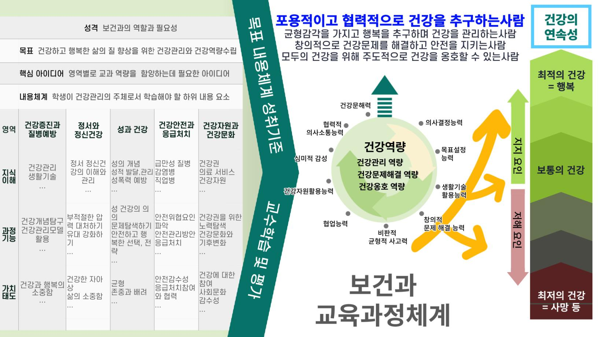

# 보건

### 교육과정 설계의 개요

보건과 교육과정은 보건과의 성격 및 정체성에 기초하여 2022 개정 교육과정 총론을 반영함으로써, 학생들이 건강역량을 함양하여 생활 속에서 건강을 실천하며 건강하고 행복한 시민으로 성장하는 데 필요한 자질을 갖추도록 설계하였다. 이를 위해 건강과 질병, 보건의료에 대한 지식을 바탕으로 자유와 평등, 공동체, 성인지, 문화 다양성, 기후위기 대응, 지속 가능한 발전, 디지털 소양 등 건강한 시민성을 함양하도록 하였다.

건강역량은 일상의 건강을 관리할 수 있는 건강관리 역량, 건강문제가 있을 때 이를 해결할 수 있는 건강문제해결 역량, 자신만이 아니라 공동체의 건강을 함께 옹호하며 사회적 환경을 개선할 수 있는 건강옹호 역량을 통합한 것으로 설정하였다. 하위 소양 및 능력으로는 인문학적 소양, 공동체, 디지털 미디어 문해력을 포함한 건강 문해력, 비판적⋅균형적인 사고력, 심미적 감성, 협력적 의사소통 능력을 포함한 건강생활기술 활용 능력, 건강정보와 자원의 활용 능력, 협업능력, 창의적 문제 해결 능력으로 설정하였다.

보건과의 교육과정 체계는 성격, 목표, 내용 체계, 성취기준, 성취기준 해설, 영역 성취기준 적용 시 고려 사항, 교수⋅학습 및 평가의 방향으로 구성하였다. 보건과의 성격은 보건과에서 추구하는 건강하고 행복한 삶의 질 향상과 이를 위한 건강관리, 건강역량 수립을 위한 내용 구성에 중점을 두고 있으며, 이는 보건과의 목표와 연계되어 있다. 보건과의 내용 체계는 영역별로 교과 역량을 함양하는 데 필요한 핵심 아이디어를 도출하고, 그에 기초하여 학생이 건강관리의 주체로서 학습해야 할 하위 내용 요소를 ‘지식⋅이해’, ‘과정⋅기능’, ‘가치⋅태도’의 3 범주로 구분하여 학교급별로 제시하였다. 성취기준은 학습 요소를 구체화하여 학생들이 일정 차시의 보건과 학습을 통해 할 수 있기를 기대하는 결과 또는 도달점 형태로 진술하였다. 내용 체계는 이 성취기준의 근간이 되며, 성취기준의 진술은 대체로 이 내용 범주 중 2가지 이상의 내용 요소를 정합하는 방식으로 진술하였다. 또한, 성취기준 해설, 영역 성취기준 적용 시 고려 사항, 교수⋅학습 및 평가의 방향에 과목의 교육 실천을 위한 참고사항을 제시하였다. 특히 교수⋅학습 및 평가의 방향은 보건과의 역량을 함양하기 위해 교사들이 학생들과의 교수⋅학습 활동의 경험을 반영하여 교육과정을 설계하고, 수업을 생활과 연계하여 운영하고 평가하는 데 필요한 교과 수준의 교수⋅학습 및 평가 중점 사항에 초점을 두고 진술되어 있다.

보건과는 ‘건강증진과 질병예방, 정서와 정신건강, 성과 건강, 건강안전과 응급처치, 건강자원과 건강문화’ 영역을 중심으로 구성되었다. 이 5개의 영역은 건강의 가치와 개념, 영향요인, 몸과 마음의 이해, 다양한 건강정보와 자원을 비판적으로 탐색하고 활용하여 생활 속에서 개인과 공동체의 건강을 관리하고 건강문제를 해결하며 건강을 옹호하는 건강역량 향상에 기여한다.

[그림1] 보건과 교육과정 설계의 개요

‘건강증진과 질병예방’ 영역의 핵심 아이디어는 건강을 중시하고, 건강의 연속성과 항상성, 몸과 마음에 대한 이해를 토대로 자신과 공동체의 건강증진을 추구할 수 있도록 구성하였다. ‘정서와 정신건강’ 영역의 핵심 아이디어는 정서와 정신건강을 이루는 요소, 관계의 유대 및 지지 강화로 행복과 안전을 지향하며 약물, 중독, 정서와 정신건강 문제를 예방하고 대처할 수 있도록 구성하였다. ‘성과 건강’영역의 핵심 아이디어는 성 건강이 개인과 가족의 행복, 국가 발전의 기본임을 인식하고 사회적 맥락을 고려한 균형 있는 시각으로 성을 이해하며 성 건강을 관리할 수 있도록 구성하였다. ‘건강안전과 응급처치’ 영역의 핵심 아이디어는 안전에 대한 감수성을 기르고, 사고와 질병에 개인과 공동체가 함께 협력하여 대처할 수 있도록 구성하였다. ‘건강자원과 건강문화’ 영역의 핵심 아이디어는 건강문화와 건강의 상호작용을 이해하고 건강정보와 건강자원을 효과적으로 활용하고 환경을 개선하며 개인과 공동체의 건강을 옹호할 수 있도록 구성하였다.

보건과의 지식⋅이해는 건강과 환경, 사회의 상호작용을 이해하고 건강역량을 함양하여 개인과 공동체의 건강을 유지 증진하는 데 필요한 지식으로 구성되었다. 과정⋅기능은 이러한 지식을 습득하는 과정과 기능을 제시하되, 단순히 지식을 아는 데 그치지 않고 생활 속에서 개인과 공동체의 실천으로 이어질 수 있도록 건강영향요인을 분석하고 건강생활기술, 건강정보와 자원을 탐구하고 활용하여 일상의 건강관리, 건강문제해결, 건강옹호 등이 가능하도록 구성되었다. 가치⋅태도는 건강과 행복의 가치와 삶의 소중함, 사회문화적 다양성을 존중하고 균형을 유지하려는 태도, 심미적 감성, 건강과 안전 및 성인지 감수성, 건강정보와 자원에 대한 사회적 책임과 권리의식, 생태 감수성, 환경과 인간의 공존 추구 등으로 구성되었다. 이와 같은 보건과 교육과정 설계의 개요를 도식으로 제시하면 [그림 1]과 같다.

### 1. 성격 및 목표

가. 성격

보건과는 몸과 마음에 대한 이해를 높이고 건강생활을 실천하며 서로 협력하여 개인과 공동체의 건강과 삶의 질을 향상하기 위한 과목이다. 이를 위해 건강은 단순히 질병이 없는 상태가 아니라, 삶의 질의 연속선상에서 최적의 안녕 상태이며, 신체⋅정신⋅사회적으로 다양한 차원과 측면에서 항상성이 유지되는 상태라는 것을 이해하도록 한다. 또한, 건강에 영향을 미치는 요인들을 파악하여 매 단계에서 유익한 선택과 관리를 함으로써, 건강증진으로 더 행복한 삶을 누릴 수 있도록 한다.

중학교 보건 과목에서는 초등학교에서 습득한 건강생활습관을 강화하는 한편, 몸과 마음에 대한 이해와 존중을 배우고, 건강 지식과 기술, 정보, 자원을 토대로 건강생활을 실천할 수 있도록 한다. 나아가 약물과 성, 정서에 대한 조절 능력을 기르고 협력적으로 건강문제와 질병의 위험에 대처하며 자신과 주변의 건강을 옹호하도록 한다. 개인과 공동체의 건강역량을 발전시킴으로써 지금보다 더 높은 상태의 건강, 즉 행복을 추구하도록 한다.

청소년기는 신체 발달과 함께 성적 성숙을 수반하며 아동기에서 성인기로 이행하는 과도기로 신체적, 정신적, 사회적으로 급격한 발달을 경험하는 시기이다. 이 시기에 형성된 건강에 대한 가치와 태도, 생활습관은 건강한 성장 발달과 평생의 삶의 질을 좌우할 수 있다. 그러므로 건강을 중시하고 건강한 생활습관을 강화하며, 건강을 관리하고 질병을 예방할 수 있는 태도와 기술, 역량을 길러야 한다.

그런데 이 시기의 청소년은 친구, 가족, 매체 등 주변의 영향에 민감하며, 흡연⋅음주, 마약 등의 약물, 성 문제, 디지털 기기 과의존, 스트레스 등 다양한 건강 위험요인에 노출되어 있다. 점차 각종 급⋅만성 질병, 사고, 기후변화로 인한 건강문제도 심각해지고 있다.

그러므로 이러한 주변의 영향을 인식하고 건강생활기술을 단련하여 자아 존중감과 성, 정서 등의 조절 능력을 높이는 한편 다양한 건강 위험요인과 사회⋅문화적 환경에 대해 주도적으로 대처하며 건강문제를 해결할 수 있도록 해야 한다.

또한, 인간의 기본권인 건강권과 건강정보 및 건강자원에 대해 알아보고, 자신과 공동체의 건강문화에 대한 심미적 감성과 소통 능력, 정보 및 건강자원 활용 능력, 비판적⋅창조적 사고와 주도적 대안 탐색 능력 등을 발전시켜 공동체의 건강을 증진하는 옹호역량을 발전시킬 수 있도록 해야 한다.

보건 과목에서는 건강에 대한 지식, 태도를 바탕으로 일상의 건강관리 능력을 높이는 한편, 다양한 건강 위험요인과 사회 환경에 주도적으로 대처하며 건강문제를 해결하는 능력을 기를 수 있다. 또한, 건강권과 건강자원에 대한 이해를 토대로 자신과 공동체의 건강증진에 필요한 소양 및 건강옹호 역량을 발전시킬 수 있다. 이렇게 습득된 가치와 지식, 태도 및 각각의 능력이 통합된 건강역량은 자신과 공동체의 건강하고 행복한 삶을 영위하는 데 도움을 줄 수 있다.

나. 목표

건강의 가치와 개념, 지식을 바탕으로 몸과 마음에 대한 이해와 건강관리 능력을 높여 일상생활에서 건강생활을 실천할 수 있다. 이를 토대로 건강문제 상황에서 건강정보와 자원을 활용하여 건강문제를 해결하고 질병 상태에서도 친구와 가족, 공동체와 함께 위험을 관리하며 행복하고 안전하게 살아갈 수 있다. 나아가 서로의 건강을 옹호하며 개인과 공동체의 건강증진에 기여하고 급변하는 환경에 창의적으로 대응하며 건강역량을 함양하고 건강 지향적 환경을 추구하여 삶의 질을 높인다.

(1) 건강을 중시하고 건강 개념 및 몸과 마음의 신호를 이해하며 건강생활을 실천하고 삶의 질 향상과 행복을 추구하며 건강을 관리할 수 있다.

(2) 건강생활기술을 단련하여 약물, 성, 정서에 대한 조절 능력을 기르고, 건강문제 상황에서 행복하고 건강한 선택을 지지하는 한편, 창의적이고 협력적으로 문제를 해결할 수 있다.

(3) 건강 안전을 위협하는 각종 질병과 위험요인을 사전에 파악하고 대비하며, 질병이 있어도 함께 건강하게 살아가며 응급상황에 안전하게 대처할 수 있다.

(4) 건강권에 대한 이해를 바탕으로 다양한 건강정보와 건강자원을 탐색하고 건강 문해력과 디지털 문해력을 배양하며, 개인과 공동체의 건강증진과 환경 개선을 위한 건강옹호를 할 수 있다.

(5) 기후변화, 감염병 등 사회⋅문화적 환경 변화가 건강에 미치는 영향과 건강문제들을 탐색하고 건강에 유익하지 못한 관행 등 건강문화의 변화를 도모하며, 국제적이고 통합적인 건강역량을 기른다.

### 2. 내용 체계 및 성취기준

가. 내용 체계

(1) 건강증진과 질병예방

<table>
<tr><th colspan="2">핵심 아이디어</th><th>∙ 우리 삶의 질에 중요한 건강을 유지, 증진하기 위해서는 건강의 연속성과 항상성 및 다양한 영향요인을 고려한 건강관리가 중요하다. ∙ 건강관리의 생활화를 위해서는 몸과 마음의 신호를 알아차리고, 건강관리 모델과 전략, 건강생활기술, 정보, 자원을 활용할 수 있는 건강관리 역량과 사회적 지지가 중요하다.</th></tr>
<tr><td colspan="2">범주</td><td>내용 요소</td></tr>
<tr><td rowspan="3">지식⋅이해</td><td>건강과 건강증진</td><td>∙ 건강 개념과 영향요인 ∙ 건강관리모델 ∙ 건강에 대한 사회적 지지</td></tr>
<tr><td>건강신호와 생활주기</td><td>∙ 몸과 마음의 신호와 건강지표 ∙ 생활주기와 건강생활습관</td></tr>
<tr><td>질병예방과 건강생활 기술</td><td>∙ 건강문제 및 질병 예방과 건강관리 ∙ 건강생활기술 ∙ 건강옹호와 협력</td></tr>
<tr><td rowspan="3">과정⋅기능</td><td>건강이해</td><td>∙ 건강 개념 및 가치와 영향요인 탐색하기 ∙ 몸과 마음의 신호 이해하기</td></tr>
<tr><td>건강탐구</td><td>∙ 건강상태를 확인하고 건강관리 방안 제시하기 ∙ 건강관리 모델을 알아보고 생활에 적용하기 ∙ 건강관리 목표와 전략을 세우고 평가하기</td></tr>
<tr><td>실천적용</td><td>∙ 건강문제와 건강생활기술을 탐색하여 건강관리 실천하기 ∙ 건강옹호활동을 이해하여 사례에 적용하기</td></tr>
<tr><td colspan="2">가치⋅태도</td><td>∙ 건강과 행복의 소중함 ∙ 건강의 가치 내면화 및 건강을 관리하려는 태도 ∙ 몸과 마음의 신호에 대한 민감성 ∙ 건강생활기술 활용 및 옹호와 협력에 대한 적극성</td></tr>
</table>

(2) 정서와 정신건강

<table>
<tr><th colspan="2">핵심 아이디어</th><th>∙ 자신과 삶의 소중함에 대한 인식, 다양성 존중, 적절한 유대와 지지적 환경은 청소년기와 성인기의 건강하고 행복한 삶의 기초가 된다. ∙ 흡연⋅음주 및 의약품의 오⋅남용은 개인과 사회의 건강 및 사회문제와 관련이 있으므로 내적인 힘과 생활기술 및 지지체계가 중요하다.</th></tr>
<tr><td colspan="2">범주</td><td>내용 요소</td></tr>
<tr><td rowspan="2">지식⋅이해</td><td>중독과 건강</td><td>∙ 흡연⋅음주⋅약물 오⋅남용 ∙ 행위 중독</td></tr>
<tr><td>정서⋅ 정신건강</td><td>∙ 감정⋅공감 및 지지 ∙ 자아 존중감 ∙ 스트레스 관리 ∙ 삶⋅죽음⋅상실의 의미</td></tr>
<tr><td>과정⋅기능</td><td>건강이해 건강탐구 실천적용</td><td>∙ 정서와 정신건강 및 영향요인 알아보기 ∙ 약물과 중독의 기전을 이해하고 조절하기 ∙ 건강하고 안전한 선택 지지하기 ∙ 감정을 이해하고 적절하게 표현하여 행복한 관계 맺기 ∙ 유혹과 압력 등에 대처 및 옹호하기 ∙ 다양성을 존중하며 유대 강화 및 환경 개선하기</td></tr>
<tr><td colspan="2">가치⋅태도</td><td>∙ 자신과 타인의 삶을 소중히 여기고 존중하는 태도 ∙ 건강한 자아상⋅유대와 행복 추구 ∙ 위험요인 감수성과 중독에 대한 비판적 태도</td></tr>
</table>

(3) 성과 건강

<table>
<tr><th colspan="2">핵심 아이디어</th><th>∙ 성 건강은 개인과 가족의 행복, 국가 발전에 기본이 된다. ∙ 성 건강관리는 성인지 관점 및 서로 다른 입장에 대한 균형 있는 접근과 이해를 필요로 한다.</th></tr>
<tr><td colspan="2">범주</td><td>내용 요소</td></tr>
<tr><td rowspan="3">지식⋅이해</td><td>성과 성 발달</td><td>∙ 성의 개념 ∙ 성적 발달과 신체상</td></tr>
<tr><td>사랑, 권리와 책임</td><td>∙ 성적자기결정권 ∙ 이성교제와 경계 존중 ∙ 성역할 및 임신과 피임</td></tr>
<tr><td>성문화와 위험관리</td><td>∙ 성폭력⋅성매개감염병 등 성 건강위험 ∙ 성 건강문제와 관리⋅옹호 ∙ 성문화</td></tr>
<tr><td>과정⋅기능</td><td>건강이해 건강탐구 실천적용</td><td>∙ 성 건강에 관련된 생리와 주제, 제도, 권리 탐색하기 ∙ 성적 발달과 관계에 대해 알아보고 건강하게 관리하기 ∙ 디지털 미디어와 성문화를 탐색하여 개선하기 ∙ 안전하고 행복한 선택을 위한 균형 있는 관점으로 대처전략 세우기 ∙ 청소년 성 건강문제를 알아보고 예방⋅관리하기 ∙ 성과 관련된 차별과 고정 관념, 평등과 존중에 대해 알아보고 평가하기</td></tr>
<tr><td colspan="2">가치⋅태도</td><td>∙ 안전하고 행복한 성의식과 성문화 함양 ∙ 성인지 감수성 및 차이를 존중하고 공감⋅배려하는 자세 ∙ 성 건강을 근거를 가지고 관리하는 태도 ∙ 성 미디어 문해력 함양</td></tr>
</table>

(4) 건강안전과 응급처치

<table>
<tr><th colspan="2">핵심 아이디어</th><th>∙ 생활 속에는 늘 위험이 있을 수 있고, 다양한 건강위험은 문제가 되기 전 대체로 신호가 있으며, 도미노처럼 주변의 건강문제로 이어질 수 있으므로, 개인과 공동체의 안전 감수성 및 참여와 협력에 기반한 예방과 관리가 중요하다. ∙ 위급 상황에서 공동체의 준비된 안전수칙 및 응급처치의 적용과 협력은 개인과 공동체의 사망 및 손상 악화 방지와 질병 회복의 결정 요인으로 작용한다.</th></tr>
<tr><td colspan="2">범주</td><td>내용 요소</td></tr>
<tr><td rowspan="2">지식⋅이해</td><td>건강 안전</td><td>∙ 건강 안전의 의미와 위험요인 ∙ 급⋅만성 질병 및 관리 ∙ 면역과 감염병 예방 및 관리</td></tr>
<tr><td>사고예방 응급처치</td><td>∙ 공동체의 문화와 건강 안전 및 관리 ∙ 건강수칙⋅응급처치⋅협력</td></tr>
<tr><td>과정⋅기능</td><td>건강이해 건강탐구 실천적용</td><td>∙ 건강 안전의 개념 및 위험요인을 탐구하여 예방⋅대처방안 탐색하기 ∙ 질병과 면역의 원리를 이해하고 건강수칙 탐색하기 ∙ 위급 상황에서 협력적 건강 안전 관리 방안을 탐색하고 실천하기 ∙ 질병과 함께 건강하게 살아갈 방안을 탐색하여 생활에 적용하기 ∙ 다양한 응급상황에서 협력적 응급처치와 심폐소생술⋅자동심장충격기 사용 방법을 익히고 실천하기</td></tr>
<tr><td colspan="2">가치⋅태도</td><td>∙ 건강과 안전에 대한 감수성 내면화 ∙ 건강안전 관리 방안에 대한 탐색적 태도 ∙ 질병 예방과 응급처치에 대한 관심과 참여</td></tr>
</table>

(5) 건강자원과 건강문화

<table>
<tr><th colspan="2">핵심 아이디어</th><th>∙ 건강 수준은 가정환경, 성, 경제 수준 등에 따라 차이가 있으므로 건강을 옹호하고 지지하는 건강지향적인 사회 환경이 필요하다. ∙ 디지털 기술과 미디어, 인공지능 시대의 보건의료 환경 및 의료서비스의 변화는 사람들의 건강정보와 건강자원의 선택 및 활용에 영향을 미친다. ∙ 인류의 건강을 위협하는 기후변화는 지속가능한 사회를 위한 건강문화 조성 및 공동체의 책임감과 연대를 필요로 한다.</th></tr>
<tr><td colspan="2">범주</td><td>내용 요소</td></tr>
<tr><td rowspan="2">지식⋅이해</td><td>건강권과 건강자원</td><td>∙ 건강권 ∙ 건강정보와 보건의료서비스건강자원 ∙ 디지털⋅인공지능 시대 건강자원의 변화⋅위험</td></tr>
<tr><td>건강문화</td><td>∙ 건강 문해력과 디지털 문해력 ∙ 기후변화와 사회적 건강문제 ∙ 건강 신념과 규범⋅관행 등 건강문화와 지속가능한 환경</td></tr>
<tr><td rowspan="2">과정⋅기능</td><td>건강이해 건강탐구</td><td>∙ 건강권을 위한 노력과 자원 탐색하기 ∙ 디지털⋅인공지능 건강정보와 보건의료서비스 및 건강자원의 변화와 활용 탐색하기 ∙ 문화와 기후변화가 건강에 미치는 영향 탐색하기</td></tr>
<tr><td>실천적용</td><td>∙ 건강옹호활동 주도하기 ∙ 건강지향적 문화와 환경 지지⋅옹호하기</td></tr>
<tr><td colspan="2">가치⋅태도</td><td>∙ 건강에 대한 권리와 책임 인식 ∙ 건강한 문화와 환경 변화를 위한 참여 의식 내면화 ∙ 건강의 가치화와 다양성 존중</td></tr>
</table>

나. 성취기준

(1) 건강증진과 질병예방

[9보01-01] 건강의 개념과 영향요인, 건강관리 모델을 탐구하여 건강을 관리하는 태도를 갖는다.
[9보01-02] 몸과 마음의 신호와 건강지표를 통해 건강상태를 평가하여 건강관리에 적용한다.
[9보01-03] 건강한 수면, 식습관, 신체활동에 대해 알아보고 건강생활습관을 계획하고 실천한다.
[9보01-04] 건강문제와 건강생활기술을 탐색하여 질병을 예방할 수 있도록 건강을 관리한다.
[9보01-05] 건강에 대한 사회적 지지의 중요성을 인식하고 개인과 공동체의 건강옹호활동을 협력적으로 탐색한다.

(가) 성취기준 해설

• [9보01-01] 건강의 개념을 제대로 이해하고 자기주도적으로 건강을 관리하는 태도를 갖는 것이 중요하다. 건강과 질병은 연속선상에 있고 항상성을 추구하며, 여기에는 친구, 가족, 미디어 등 다양한 영향요인이 작용하고 있다. 이에 대한 이해를 토대로 건강관리를 위해 건강관리모델을 활용할 수 있다. 건강관리모델은 건강목표를 설정하고 실천전략을 수립하여 시행하고 평가한 후 다시 피드백을 통해 새로운 건강목표를 수행하는 일련의 과정을 말한다.

• [9보01-02] 몸과 마음의 신호는 활력징후나 이상 증상, 통증 등을 들 수 있다. 혈압, 맥박, 호흡, 체온 등의 활력징후(Vital Sign)는 몸과 마음이 보내는 신호이자 기초적인 건강 지표로 그 의미와 측정법을 알고, 건강관리에 활용할 수 있어야 한다. 건강상태 평가는 건강조사, 건강검사, 건강통계 등 다양한 지표를 활용하도록 한다.

• [9보01-03] 수면, 식습관, 신체 활동 등 전반적인 생활습관을 관리하는 역량을 기르는 것은 건강관리의 초석이다. 사람마다 환경과 상호 작용하며 생활의 규칙성을 갖는 것을 생활주기라고 하는데, 생체리듬과 건강영향요인을 고려한 건강한 생활주기와 이를 고려하지 못하는 건강하지 못한 생활주기가 있다. 그러므로 생체리듬과 생활 속의 영향요인에 대해 알아보고, 생활습관 및 건강상태를 비교⋅점검하여, 건강한 생활주기를 갖도록 건강관리의 목표와 전략을 세우도록 한다.

• [9보01-04] 생활 속의 건강문제는 학생들이 흔히 경험하는 건강 이상 문제들로 예방 및 관리를 위한 방안을 구체적으로 탐색하고 실천하는 것이 중요하다. 건강생활기술은 건강에 관련된 의사소통 기술, 의사 결정 기술, 목표설정 기술 등을 말하며, 건강생활을 실천하고자 할 때 청소년기에 흔히 있을 수 있는 또래 압력, 어른들과의 갈등, 미디어의 영향 등에 대처할 수 있도록 하기 위한 것이다.

• [9보01-05] 건강은 개인적 차원의 생활습관관리를 넘어서서 사회적 지지가 중요하므로 지지요인을 강화하고 장애요인을 개선할 필요가 있다. 건강옹호활동을 계획하고 협력적인 의사소통 및 의사 결정 등을 연습하면서 지지요인을 강화하고 장애요인을 개선할 수 있다. 예를 들어 신체적 건강이 취약하고 장애가 있어도 정신적, 사회적 지지를 강화하면 건강할 수 있다.

(나) 성취기준 적용 시 고려 사항

• 학습자가 자신의 생활과 연계하여 건강과 관련된 경험을 성찰하고 나아가 가정, 학교 등 생활공간에서 주도적으로 건강생활을 실천하도록 한다.

• 학습자가 건강의 개념을 이해하고 다양한 지표를 활용하여 건강을 관리하는 기본 능력과 안목을 함양하는 것은 개인적 측면에 국한되는 것이 아니라 지역사회, 국가 그리고 세계시민으로서 필요한 소양과 능력이라는 것을 알도록 한다.

• 건강관련 정보를 이해하고 활용함에 있어 학습자들이 일상에서 접할 수 있는 다양한 매체 자료를 제시한다. 학생들이 디지털 미디어를 활용하여 언론 보도 자료, 다양한 의학 정보, 각종 건강 실태 조사 자료, 건강 관련 도서 등을 탐색하고, 개인과 공동체의 건강증진 방안을 모색하고 공유하는 학습을 진행하여 건강 문해력 및 디지털 활용 능력을 기르도록 한다.

• 건강에 대한 이해와 실천으로 건강과 관련된 다양한 진로 방향을 스스로 탐색하고 계획할 수 있는 계기를 마련한다.

• 건강은 개인적 특성뿐만 아니라 성별, 인종, 빈곤, 기후, 문화 등 다양한 사회적 요인이 영향을 미치고 있으므로 자신과 타인, 개인과 집단, 가족, 사회와의 관계 속에서 차이와 다양성을 인정하고, 존중할 수 있도록 한다.

• 일상생활에서 흔히 접하는 건강문제들을 찾아내고, 건강자원을 적절하게 활용할 수 있으며, 대처 기술(의사 결정 기술, 의사소통 기술, 거부기술 등)을 익힐 수 있도록 한다.

(2) 정서와 정신건강

[9보02-01] 약물 오⋅남용과 흡연, 음주의 유혹과 압력에 대해 안전하게 선택하고 대처⋅옹호한다.
[9보02-02] 행위 중독이 건강에 미치는 영향과 위험요인 및 대처방안을 탐색하여 예방하고 관리하려는 태도를 갖는다.
[9보02-03] 자아 존중감에 대해 이해하고 생활 속에서 자아 존중감을 높이는 상황과 저하시키는 상황을 탐색하여 대처하고 지지하여 건강한 자아상을 추구한다.
[9보02-04] 감정과 스트레스의 적절한 인식과 표현, 지지와 공감 및 다양성 존중을 통해 관계 속에서 행복함과 건강한 관계 맺기를 보여준다.
[9보02-05] 삶과 죽음, 상실의 의미에 대한 성찰을 바탕으로, 삶의 소중함을 깨닫고 죽음⋅상실에 건강하게 대처하는 자세를 지지한다.

(가) 성취기준 해설

• [9보02-01] [9보01-04]에서 학습한 생활기술을 적용하고 건강자원 등을 활용하도록 한다.

• [9보02-04] 자신과 타인의 감정과 스트레스의 적절한 인식과 표현, 조절과 지지를 통해 관계 속에서 행복한 상태를 경험하고 유대를 강화하도록 한다.

• [9보02-05] 죽음⋅상실과 관련된 여러 측면을 탐색하도록 한다. 사랑하는 사람의 죽음과 관계의 상실로 인해 발생하는 감정과 영향에 대해 이해하고 표현하며, 삶의 소중함을 돌아보고 자살 등의 유혹에 대해 대처할 수 있도록 한다. 나아가 품위 있는 죽음과 상실에 대해 생각해 보고, 죽음과 상실에 건강하게 대처하는 자세를 알아보고 지지하여, 이와 관련된 개인적, 사회적 건강문제 해결의 단서를 찾도록 한다.

(나) 성취기준 적용 시 고려 사항

• 건강 연속성과 항상성에 대한 이해를 바탕으로 지지와 유대의 중요성을 인식하도록 한다. 예를 들어 질병이나 힘든 문제가 있는 상황에서 편견을 가진 차별적 태도와 지지하고 배려하는 태도를 비교하여 건강에 미치는 유익성과 인간에 대한 예의를 생각해 보도록 한다. 또한 질병이 있는 경우, 그 영향으로 변화된 삶의 방식을 존중하는 태도를 형성할 수 있도록 한다.

• 학습자가 자신의 삶과 경험을 바탕으로 정서⋅정신영역의 학습 활동 결과를 창작할 수 있도록 지도한다. 또한, 학습 활동 결과의 수용과 재생산을 교실 안 활동으로 그치지 않고 학교 행사, 마을 축제, 지역 문화 행사 등 교실 밖 활동으로 확장하도록 격려함으로써 학습자가 학습 경험을 공유하고 강화하며, 건강을 기를 수 있도록 한다.

• 가족과 친구 등 주변의 다양한 유형의 타인을 공감하고 배려하며 관계 형성 능력을 기를 수 있도록 한다. 학습 목표를 달성하는 과정에서 다른 관점을 가진 타인을 이해하고 배려하도록 한다.

• 학습자의 정서에 영향을 미치는 타인과의 관계를 탐구하는 과정에서 현실 세계에서 교류하는 타인뿐만 아니라 메타버스와 같은 확장된 가상 세계의 생활환경에서 교류하는 타인과의 관계도 함께 다루도록 한다.

• 다문화 학생들이 겪는 어려움을 공유하고, 그들의 정서적 특성을 한국 문화에 흡수시키려는 동화주의적 관점보다는 서로의 차이를 인정하고 존중하는 통합주의적 관점을 가지도록 한다.

(3) 성과 건강

[9보03-01] 성의 개념과 성역할 및 영향요인에 대해 성인지적 관점에서 탐색하여 안전하고 행복한 성문화와 성의식의 필요성을 이해한다.
[9보03-02] 청소년기 성적 발달과 관계, 신체상에 대해 알아보고 사회적 조건을 이해하며 건강하게 관리한다.
[9보03-03] 성적자기결정권을 균형 있게 탐색하여 안전하고 행복한 대처전략을 세우고 이성 교제 시 경계를 존중하고 배려하는 자세를 갖는다.
[9보03-04] 성폭력⋅성매개감염병 등 성 건강 위험요소를 미디어 문해력 및 성문화와 관련지어 탐색하고 건강하게 관리⋅옹호한다.
[9보03-05] 임신, 피임에 대한 이해를 바탕으로 십대의 임신과 미혼 부모 문제가 개인과 사회에 미치는 영향을 분석하고 건강에 유익한 선택과 자원을 지지한다.
[9보03-06] 청소년의 성 건강과 관련하여 사회적 쟁점이 있는 이슈들에 대해 다양한 입장의 근거와 맥락, 고정 관념, 차별, 불평등한 상황을 파악하여 균형 있고 평등한 성문화를 조성하려는 자세를 갖는다.

(가) 성취기준 해설

• [9보03-01], [9보03-02] 성 개념, 월경, 몽정, 성 욕구와 관심 등 성적 발달 및 성역할에 대해 자신과 관계에 미치는 영향, 가족, 친구, 미디어의 영향 등 사회적 맥락 속에서 균형 있게 인식하여 삶의 질을 높이는 방향으로 성 건강관리를 탐색하도록 한다.

• [9보03-03] 성적자기결정권은 성에 관련된 의사 표현 및 행동을 안전한 환경에서 자신과 타인을 보호하며 책임 있게 결정할 권리를 말한다. 이 권리는 본인의 동의가 없는 성적 강압에 대처하고, 왜곡된 성 관련 정보와 위험한 환경으로부터 자신을 보호할 수 있는 근거가 될 수 있으며, 다른 의미로 해석되지 않도록 유의한다. 청소년의 성적자기결정권을 다룰 때에는 청소년이 직면하게 될 위험이나 보호되지 않는 성적 행동의 부정적인 결과와 그 취약성, 책임을 함께 고려하여 학생들이 이를 인식할 수 있도록 한다. 서로 다른 입장에 대해서는 근거를 비교하여, 현실적이고 균형 있는 관점을 갖도록 한다. 여기서 보호는 WHO에서 제시한 원치 않는 조기 임신, HIV/AIDS 등 성매개감염병(STI), 성적 학대, 성폭력 등으로부터의 보호를 의미한다. 경계는 존중받아야 할 개인적 영역에 대한 구분을 의미하며, 관계의 신뢰도나 친밀도 등에 따라 차이가 있을 수 있으나 함부로 경계를 침해하지 말고, 경계를 넘을 때는 동의를 구하는 등 소통하고 존중하는 방법을 배우도록 한다.

• [9보03-04] 성 건강위험요소들은 상황에 따라 음란물⋅성 상품화 등을 포함할 수 있으며 성폭력은 디지털 성폭력을 포함하고, 성매개 감염병은 에이즈를 포함한다. 친밀한 관계에서 발생하는 인권 침해나 폭력에 대해서도 다루도록 한다. 또한 미디어 문해력을 통해 디지털 공간에서 올바른 성문화를 형성해 나가는 방안을 모색하도록 한다. 성문화는 균형 있는 시각으로 성윤리를 포함하여 다룰 수 있다.

• [9보03-06] 청소년의 성 건강과 관련하여 사회적으로 널리 공론화된 이슈들을 다루며, 사회문화적 배경을 토대로 사건을 보는 시각을 여러 각도에서 접근하여 안전하고 행복한 선택과 환경을 지지할 수 있도록 한다.

(나) 성취기준 적용 시 고려 사항

• 성적 발달에 대해 학습할 때 개인차를 존중하고 성의 긍정적 측면과 부정적 측면을 균형 있게 탐색하도록 한다.

• 디지털 매체에서의 성에 대한 표현과 해석은 주관적이거나 다양한 목적들이 있을 수 있음을 이해하고 콘텐츠들을 활용함에 있어 성인지적, 공동체적 관점에서 객관적이고 비판적으로 탐색하여 안전하게 선택하도록 한다.

• 미혼모, 성폭력 피해자 등을 배려한 상황과 맥락을 설정하며, 성 인권에 대한 이해를 바탕으로 해결방안을 모색하고 실천하도록 한다.

• 성폭력, 성 건강위험, 불평등 개선에 대해 경계 존중과 동의, 인권, 사회적 소수자 및 약자에 대한 이해와 공감을 토대로 사회적 맥락을 고려하여 균형 있게 접근하도록 한다.

(4) 건강안전과 응급처치

[9보04-01] 건강안전의 의미와 위험요인을 탐구하여 질병과 사고를 예방하고 관리하며 건강안전 지향적 환경 개선에 적극적인 태도를 갖는다.
[9보04-02] 급⋅만성 질병의 위험요인과 건강에 미치는 영향을 탐색하여, 질병과 함께 건강하게 살아가기 위한 방안을 세우고 실천한다.
[9보04-03] 감염병과 면역의 원리를 이해하고 개인과 공동체가 지켜야 할 건강수칙을 탐색하여 근거와 함께 제안하고 실천한다.
[9보04-04] 상황에 따른 응급처치의 원리와 방법을 이해하고, 다양한 위기 및 응급상황에서 적절한 응급처치와 협력적 대응 방안을 탐색하여 적용한다.
[9보04-05] 응급의료체계의 활용 방안을 탐색하고 심폐소생술과 자동심장충격기의 원리와 사용법을 익혀 협력적으로 바르게 적용한다.

(가) 성취기준 해설

• [9보04-01] 개인과 공동체 측면에서 건강 안전의 위험요인을 파악하여, 사전에 질병과 사고의 위험을 대비하고 관리하며, 위험 발생 시 적극적으로 대처할 수 있도록 한다. 예를 들어 다중이 밀집된 곳에서의 위험요인을 파악하고 안전 방안을 세우며, 위험 발생 시 상황에 적절한 생활기술과 자원 등을 활용한 대처전략을 적용할 수 있도록 한다. 안전 방안에는 사고 예방 및 안전 수칙, 구조 활동에 대한 협력 등을 포함할 수 있다.

• [9보04-02] 혼자 대처하기에 위험한 건강문제나 질병을 알아보고 발생할 수 있는 위험에 대해 탐색하여, 유사시 함께 대비할 방안을 세우고 실제로 적용해 보도록 한다. 이러한 과정을 통해 질병이 있다 하더라도 이해와 공감, 지지를 바탕으로 공동체와 함께 건강하게 살아가는 것을 배울 수 있도록 한다. 예를 들어, 사회적 상황이나 학교의 사정에 따라 제1형 당뇨(소아 당뇨), 아나필락시스 쇼크의 위험이 있는 알레르기, 심장병 등을 다양하게 다룰 수 있다.

• [9보04-03] 감염병의 전파 기전과 면역의 원리를 탐색하고 건강수칙을 제안하도록 한다. 이 때 건강수칙을 수동적으로 학습하는 수준에 머물지 않고 능동적으로 탐구하고 제안하도록 하여 감염병을 예방하고 관리하는 태도를 기르도록 한다. 나아가는 공동체적 관점에서 감염병과 면역의 개념 및 관계를 이해하고, 개인과 지역사회의 감염병 예방대책을 토론하고 평가하며 상황에 적절한 건강수칙과 대안을 탐색하는 등 감염병 예방⋅관리에 주도적으로 참여하도록 한다.

• [9보04-04][9보04-05] 응급처치는 개인이 할 수도 있으나 위기 상황의 정도에 따라 미리 대응 방안을 모색하여 협력적으로 대처해야 효과적일 수 있다. 그러므로 응급처치 방법을 익힐 뿐 아니라 협력하여 대응하는 태도로 대응 방안을 세우는 것이 중요하다. 협력적 대응 방안은 개인과 공동체의 특성 및 위기의 정도, 자원을 고려하여 세우고, 시범을 보이고 평가하여 개선한다. 심폐소생술은 CPR, 자동심장충격기는 AED로 표기할 수 있다.

(나) 성취기준 적용 시 고려 사항

• 감염병과 질병, 사고와 기후변화의 연계성을 분석하고 최근 발생하는 변화나 사례를 통해 환경과 인간의 상호작용에 대해 탐색하고 안전과 환경에 대한 감수성을 지니도록 한다.

• 지역사회에서 발생하는 건강문제에 대한 대처 혹은 해결 사례를 제시하여 보건과와 관련된 공동체 소양을 발전시키도록 한다. 건강한 공동체를 유지하기 위한 의견 수렴, 방안 협의, 계획 수립과 실천 및 평가 등의 과정을 살펴보고, 다른 대안을 세워보도록 한다.

• 디지털⋅인공지능 기술의 발달을 활용하여 질병과 사고에 대처한 사례를 통하여 달라진 삶의 변화를 탐색하고 적절하게 활용하도록 한다.

• 질병과 사고에 미치는 사회적 요인을 분석하는 경험을 통해 학습자가 접하는 삶과 위험의 사회문화적 맥락을 인식하고 건강관리에 반영하도록 한다.

• 진로연계교육을 활용해, 건강안전과 응급처치 영역에 관련된 직업세계를 탐색할 수 있도록 경로를 안내한다. 진로를 설계해볼 수 있는 활동으로 자신의 진로에 관한 목표를 세우고 관련된 정보 탐색을 할 수 있도록 한다.

• 학습주제를 선택할 때는 인권 침해 우려가 없는지, 문화적으로 배타적이지는 않은지 검토하고, 다양한 학습자-특히 특수교육 대상 학생, 다문화 가정 학생 등 소수자-의 입장에서 적절한지에 대한 검토가 필요하다. 나아가 학습자들의 다양한 사회문화적 배경을 수업 자원으로 활용하여 다양성을 경험하고 문화감수성을 함양할 수 있도록 한다.

• 건강문제를 해결하는데 필요한 윤리적 태도를 함양하도록 한다. 건강안전 및 응급처치와 관련된 딜레마 상황을 통하여 윤리적 쟁점에는 무엇이 있는지 어떠한 선택이 적절한지 탐구하도록 한다. 이를 통해 공동체의 일원으로서 윤리적 책임을 강조하도록 한다.

(5) 건강자원과 건강문화

[9보05-01] 건강권 발전을 위한 노력과 건강자원을 탐색하여 공동체의 건강권 향상을 위한 활동에 관심을 가지고 참여한다.
[9보05-02] 디지털⋅인공지능 시대에 따른 보건의료서비스와 건강정보를 포함한 건강자원의 변화를 알아보고 건강에 유익하게 활용하며 개선방안을 탐색한다.
[9보05-03] 기후변화와 건강의 관계를 탐색하고, 지속가능한 사회를 위한 개인과 공동체의 건강옹호활동을 탐구하고 실천한다.
[9보05-04] 건강 신념과 규범⋅관행 및 미디어 등이 건강에 미치는 영향을 탐색하고 건강하게 개선하려는 태도를 발전시켜 건강관리와 건강문제 해결에 적용한다.
[9보05-05] 다양성 존중과 사회적 소수자 배려를 포함하여 건강지향적 문화와 환경을 지지⋅옹호한다.

(가) 성취기준 해설

• [9보05-01] 학생들은 건강권 발전을 위해 노력한 사례를 탐구하고, 관련 법률, 유엔 아동권리 협약, 건강자원과 정보 등을 조사하여 공동체의 건강증진을 위해 노력하도록 한다.

• [9보05-02] 디지털⋅인공지능 기반으로 제공되는 보건의료서비스와 건강정보, 건강자원의 장⋅단점에 대해 알아보고, 올바른 선택과 실천 방안 및 대안적 방향을 탐색한다.

• [9보05-03] 기후변화는 인간의 건강한 삶과 질병에 영향을 주는 중요한 요인으로 작용하므로 인간과 환경의 공존을 추구하며 지속가능한 건강한 삶을 살아가는 데 필요한 건강역량을 기르도록 한다. 학생들은 신종 감염병(코로나19 감염병 등)과 기후변화로 나타나는 건강문제와 질병들을 조사하여 개인적 차원, 국가나 지구촌의 협력적 차원에서 건강문제를 해결하고 질병을 예방할 수 있는 방안을 토의하고 건강옹호활동을 실천하도록 한다.

• [9보05-04] [9보05-05] 건강과 문화적 다양성 간의 연관성을 이해하며 건강에 유익한 문화를 형성해 나가도록 한다. 예를 들어 학생들은 자신과 다른 다문화 가정 학생이나 이혼가정, 질병 상태에 있는 사람에 대한 태도, 특히 정신과 치료에 대한 편견이나 거부감 등과 같은 다양한 사례를 통해 건강에 대한 신념, 건강 행위와 관련된 관행, 건강정보를 전달하는 미디어 등이 건강문화에 미치는 영향 요인을 비교⋅분석하여 건강에 유익한 문화를 지지하고 옹호하는 방안을 찾고 실천할 수 있어야 한다.

(나) 성취기준 적용 시 고려 사항

• 삶과 연계한 학습과 탐구를 통하여 지속 가능한 발전을 위한 공동체적 가치를 함양하고, 건강권을 발전시키기 위해 노력하는 한편 건강 취약계층 및 다문화 가정 학생 등 모두의 건강을 위한 건강자원과 건강문화를 생각하도록 한다.

• 건강권에 관한 통계 및 논문, 뉴스, 연구보고서, 인터넷 자료 등을 활용하여 관련 이슈의 쟁점을 탐색하고 적절한 근거를 가지고 설명하거나 주장할 수 있는 능력을 함양하도록 한다. 건강권 보장에 관련된 인적, 물적 자원을 제시하고, 다양한 상황에 따른 올바른 선택 전략을 실천하도록 상황극, 토의 토론 등의 교수⋅학습 활동을 적절한 매체를 활용한다.

• 자발적이고 능동적인 참여를 위한 수업을 설계하고 미래형 교수⋅학습 방법과 평가 체제를 구축함으로써 학생 맞춤형 학습지원 및 평가를 강화한다. 이와 더불어 교사의 디지털 교육 기술 역량을 함양하여 학습자들이 디지털⋅인공지능 시대의 보건의료 서비스에 대해 이해하고 건강권과 환경⋅기후변화에 대한 비판적이고 통찰력 있는 시각을 갖고 삶과 연계한 적용을 통해 실천할 수 있도록 한다.

• 보건의료서비스와 건강자원의 변화가 가져올 미래 사회의 모습에 맞춰 새로운 진로의 탐색이나 미래의 나를 위한 준비의 필요성을 느낄 수 있도록 한다.

### 3. 교수⋅학습 및 평가

가. 교수⋅학습

(1) 교수⋅학습의 방향
보건과의 교수⋅학습 방향은 건강이 신체와 정신, 개인과 사회의 역동적 상호작용 과정임을 이해하고, 건강에 대한 지식, 태도, 가치를 발전시키는 한편 생활 속의 다양한 영향요인을 고려하여 건강생활기술 등 건강역량을 발전시켜 개인과 사회의 건강증진을 도모할 수 있도록 하는데 둔다.

(가) 일상생활과 연계하여 자기주도적으로 건강을 탐구하고 건강문제를 파악하여 건강관리 계획 및 전략을 수립하고 건강에 유익한 선택을 생활화하도록 한다. 건강지식은 과학적 근거를 토대로 몸과 마음의 신호 및 건강평가와 연계하여 이해하고, 건강생활기술은 사회적 맥락 속에서 자신과 주변의 대처 능력과 활용 가능한 자원을 파악하여 현실적으로 기능할 수 있도록 한다. 건강생활습관은 가정과 연계하여 지도 방안을 모색한다.

(나) 다양한 상황에서 발생하는 유혹과 압력, 편견과 고정 관념에 대해 지지요인을 강화하며 대처하도록 한다. 건강과 관련된 잘못된 고정 관념과 편견, 차별 등을 올바로 인식하되 서로 다른 입장에 대해 근거를 공유하고 균형 있는 관점을 유지하도록 한다. 건강을 추구하려는 바람직한 태도에도 불구하고 관계 속에서 오히려 건강을 저해하는 일이 발생하지 않도록 유의한다.

(다) 건강과 관련된 사회문화적 요인들을 다양한 맥락 속에서 탐구하고 건강에 유익한 변화를 도모할 수 있도록 한다. 또한, 건강에 영향을 미치는 사회적 요인과 불평등한 환경을 고려하도록 한다. 그리하여 건강을 단순한 생활습관의 문제로 보면서 개인에게만 건강에 대한 책임을 지게 하거나 낙인을 찍지 않도록 유의한다.

(라) 개인, 가족, 공동체의 건강을 옹호하며 삶의 질 향상 및 행복을 추구하도록 한다. 개인, 가족, 공동체와의 관계 속에서 차이와 다양성을 인정하고 존중하며, 개인과 공동체가 마주한 건강문제에 감수성을 높여 협력과 소통, 연대를 통해 함께 건강한 삶을 유지하는 방안을 모색하도록 한다. 특히 최근 빠른 속도로 발전하는 디지털 기술과 기후변화 등 사회 환경의 변화로 생기는 신종 감염병, 디지털 건강문제에 대해서는 새로운 인식과 소양, 연대, 옹호활동이 가능하도록 다양한 활동 사례와 네트워크를 활용하도록 한다.

(2) 교수⋅학습 방법
디지털 지식정보사회의 특성을 살려 원격 수업, 가상공간을 활용한 수업, 학습자에 대한 다양한 고려를 바탕으로 한 학생 맞춤형 수업을 도모하고, 서로를 배려하며 유익한 건강 지식과 정보⋅자원을 선택⋅적용할 수 있도록 디지털 문해력 소양을 향상하여, 급변하는 환경과 미래 세대에 주도적으로 대처할 수 있는 능력을 기르도록 한다. 일반적인 보건과 교수⋅학습 방법은 다음과 같다.

(가) 학습자가 자신의 삶과 연계하여 주도적으로 탐구하고 또래 학습자들의 경험과 탐구 결과를 나누고 종합하는 과정에서 배움이 일어나도록 한다.

(나) 수업의 결과가 지식 습득에 그치지 않고 건강에 유익한 태도와 건강생활습관 형성, 건강생활 실천과 연계되도록 한다.

(다) 건강생활기술과 협력적 의사소통 단련, 건강관리와 건강문제 해결, 옹호활동이 가능한 상황과 기회를 마련하여 학습 과정에서의 반복적인 연습과 생활화로 평생 건강과 공동체 건강을 도모할 수 있는 기본을 다지도록 한다.

(라) 토의와 토론, 주제 발표, 소집단 협력 수업, 다양한 디지털 기기 활용, 학생 중심의 쌍방향 의사소통, 게임 활용, 지역사회 전문가 협력, 견학, 시범 등 체험 중심의 다양한 학습 방법을 도입하고 활용한다.

(마) 교수⋅학습 자료는 다양하면서도 생활과 연계성이 높은 구체적인 것을 사용하고, 디지털 기술의 발달로 급속하게 변화하는 교수 매체의 특성을 살려 효과적인 온오프라인 연계 학습 방식을 도입한다. 학습 집단은 상황에 따라 전체 학습, 소집단 학습, 개별 학습 등을 융통성 있게 운용한다.

(바) 디지털 기기⋅학습 프로그램 등은 학생들의 요구와 활용 능력, 학습 내용의 차이를 고려하여 활용하고 온오프라인 연계 학습 등으로 학습자들의 적극적인 참여를 유도한다. 학습의 과정에서 쌍방향 상호작용과 종합화, 시각화 등을 통해 학업성취를 높이고 보건교육의 특성과 다양한 변인 및 학생들의 수준과 흥미를 고려하여 적절한 교육매체를 선택, 적용하도록 한다.

(사) 체계적인 교수⋅학습 과정의 중요성을 인식하고 영역 간, 학교급 간 및 타교과와의 연계를 도모하며, 교수⋅학습 과정에 영향을 미치는 요인을 분석하여 학습자의 수준과 진로, 참여 등을 적절하게 고려한다.

나. 평가

(1) 평가의 방향
보건과의 평가는 실천이 중요한 생활교육의 성격과 특성을 반영한다. 건강에 대한 가치 및 태도, 건강의 여러 측면과 영향요인에 대한 이해, 과학적으로 올바른 건강 지식과 건강역량, 하위소양 등을 평가한다. 건강관리 역량은 건강문제해결 역량, 건강옹호 역량 등 3대 역량을 평가하며, 하위소양은 건강생활기술 및 건강정보와 건강자원의 활용 능력, 공감적 이해력과 협력적 의사소통능력, 옹호능력 등을 평가한다. 기후변화, 디지털 기술 발달 등 급변하는 사회 환경 변화에 따른 새로운 건강문제에 창의적이고 주도적으로 대응하는 태도와 건강관리 역량에 대한 평가를 포함한다. 평가는 주로 과정을 중심으로 한 평가에 두고, 학습자의 주도성, 존중과 지지, 의사소통 등 학습자 간의 상호작용 및 맥락의 적절성을 중시한다. 보건과 평가의 기본 방향은 다음과 같다.

(가) 학습 과정에서 자신의 지식, 태도, 건강역량을 성찰하고 평가하는 기회가 되도록 하며, 일정 기간의 학습 후에는 학습한 내용과 그 과정에서 습득된 지식, 태도, 건강역량을 새로운 맥락과 상황에서 적용할 수 있는지 평가한다.

(나) 최근 급변하는 디지털 교육 환경에서의 평가 및 디지털 도구를 활용한 평가 방안을 마련한다.

(다) 개인적 평가만이 아니라 학생 상호 간의 평가 및 소집단⋅공동체 활동에 대한 평가, 이를 종합하고 성찰하는 다양한 형태의 평가를 적절하게 배치하도록 한다.

(라) 교사는 평가 결과를 교수⋅학습에 환류하여 교사의 수업 개선 및 학습자의 수준을 고려한 피드백을 제공하여 학생의 학습과 성장을 도울 수 있도록 한다.

(마) 학습 부진, 학습 속도가 느린 학습자 등 다양한 학습자에 대한 맞춤형 평가 방안을 마련하고, 학습 과정에서 건강한 상호작용을 평가하여 강화로 이어지도록 한다.

(2) 평가 방법
평가는 주로 과정을 중심으로 한 평가에 둔다. 수행 평가, 서술형 및 논술형 평가, 활동 평가, 학생 간 평가, 개별 맞춤형 피드백 강화 등의 평가를 적절하게 혼합하고, 일회적인 평가가 아니라 학습 과정 및 생활 속의 건강관리에 대한 지속적인 성찰과 개선을 도모하며, 대면 수업과 원격 수업에서의 평가, 서로 다른 환경을 고려한 평가, 다양한 학습자를 위한 평가도 고려한다.

(가) 평가 목표와 내용은 교육과정의 내용 체계와 영역별 내용을 근거로 설정하되, 학습자의 성취수준을 고려하여 학습 전후 내용을 분석하여 평가하도록 한다. 다만 개인과 공동체의 주요한 건강문제가 발생할 경우 이와 연관하여 평가할 수 있도록 한다.

(나) 영역별 각 과정을 평가하기 위한 문항이나 과제, 수행 평가 방안을 개발하고 학생의 수준을 진단, 파악할 수 있는 준거를 마련하여 평가한다.

(다) 개인과 공동체의 건강역량을 구성하는 다양한 능력과 소양을 평가할 수 있도록 여러 가지 사례를 제시하고 그에 따른 활동을 평가하여 그 결과가 건강에 유익한 방향으로 강화되도록 한다.

(라) 다양한 평가 방법을 활용하여 건강의 인지적, 정의적, 행동적 측면을 고려한 ‘지식⋅기능⋅태도’를 아우르는 종합적이고 균형 있는 평가가 이루어지도록 한다. 모둠 내 토론 내용 관찰, 개별 면담, 전체 활동을 통한 직접 평가 등을 통해 평가를 시행하고 평가 결과를 학습자에게 통보하여 학습자 스스로 학습 전과 학습 후 변화과정을 비교하여 어느 정도의 성장이나 변화가 있었는가를 객관적으로 볼 수 있는 기회를 제공한다. 성취기준에 도달하지 못한 학생들을 위한 보충 학습 및 평가 대체 방법 자료를 제시하도록 한다.

(마) 온라인 수업의 경우에는 수업 환경이나 수업 매체에 적합한 평가가 이루어질 수 있도록 평가 방법의 다양화를 모색하고, 다양한 디지털 도구 등을 활용하도록 한다.

