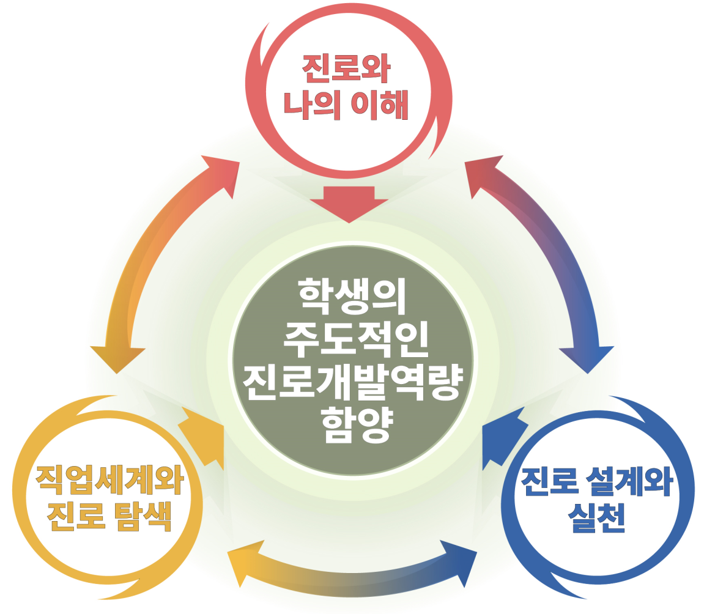

# 진로와 직업

### 교육과정 설계의 개요

‘진로와 직업’ 교육과정은 폭넓은 진로 탐색을 통해 한 개인이 자신을 이해하고 일과 직업에서 전문성을 개발하기 위해 스스로 진로 목표와 계획을 수립 및 실천할 수 있는 진로 개발 역량을 함양하는 데 중점을 둔다. ‘진로와 직업’의 핵심적인 내용 요소는 총론에서 미래 변화에 대응하는 교육 방향으로 제시한 학습자 주도성 함양, 인공지능⋅디지털 소양 교육 강화, 민주 시민 교육, 생태 전환 교육과 연계하여 구성하였다. 생태 전환 교육과 AI⋅디지털 소양 교육은 ‘진로와 직업’의 주요 내용 요소인 직업 세계와 사회 변화, 지구 환경 변화와 ‘직업세계와 진로 탐색’을 연계하였고, 민주 시민 교육은 직업의 개인 및 사회적 가치, 직업인의 태도 등을 다루는 ‘진로와 나의 이해’에 연계함으로써 총론의 교육 방향을 반영하였다.

‘진로와 직업’ 교육과정은 교육과정 설계의 개요, 성격 및 목표, 내용 체계 및 성취기준, 교수⋅학습 및 평가로 구성되어 있다. 교육과정 설계의 개요는 ‘진로와 직업’ 교육과정 구성에 있어 전체적인 구조와 요소를 소개하였으며, 성격은 ‘진로와 직업’에서 핵심적으로 다루는 학생들의 주도적인 진로 개발 역량 함양을 위한 교과의 특성 및 내용 구성의 중점 사항을 소개하였고, 목표는 이러한 교과의 성격을 기반으로 학교급별 학생의 발달 상황을 고려하여 제시하였다.

‘진로와 직업’ 교육과정의 내용 체계는 학생의 주도적인 진로 개발 역량을 함양하는 데 필요한 영역별 핵심 아이디어, 지식⋅이해, 과정⋅기능, 가치⋅태도를 추출하여 제시하였다. 이러한 내용 체계는 성취기준의 주요 구성 요소이자 근간이 되었으며, 성취기준은 내용 체계의 요소 중 2가지 이상을 결합하는 방식으로 진술될 수 있도록 하였다. 그러나 내용 체계의 모든 요소와 성취기준이 반드시 일대일로 대응되는 구조는 아니며 학생, 교사, 학교의 맥락적 특성을 고려하여 내용 요소의 하위 구성 요소를 활용함으로써 내용 체계의 요소를 상세화하거나 이해하기 쉬운 용어로 대체하여 제시하였다.

‘진로와 직업’ 교육과정의 교수⋅학습 및 평가는 학생의 진로 개발 역량 함양에 초점을 둔 수업을 진행하기 위해 고려해야 할 교수⋅학습 및 평가의 주요 원리를 제시하였다.

‘진로와 직업’ 교육과정의 영역은 ‘진로와 나의 이해’, ‘직업 세계와 진로 탐색’, ‘진로 설계와 실천’의 총 3가지로 구성되어 있다. ‘진로와 나의 이해’ 영역은 직업인의 삶의 모습에서 드러나는 진로 특성에 비추어 학생의 진로 특성에 대한 이해, 긍정적인 자아 개념의 형성, 함께 일하고 싶은 직업인의 긍정적인 특성과 태도를 기를 수 있도록 설계되었다. ‘직업 세계와 진로 탐색’ 영역은 국내외 사회 환경 및 일과 직업 세계의 변화에 대한 이해를 바탕으로 자신의 진로와 관련된 정보를 주도적으로 탐색할 수 있도록 하는 데 강조점을 두었다. ‘진로 설계와 실천’ 영역은 진로의사결정의 방법과 고려 사항을 충분히 이해하고 진로 목표 달성을 위한 장단기적인 학습 계획 및 진로 계획을 수립하고 실행해 볼 수 있도록 구성되었다.

‘진로와 나의 이해’ 영역의 핵심 아이디어는 직업인의 삶에서 드러나는 진로 특성과 학생 개인의 진로 특성 사이의 관련성, 긍정적인 자아 개념의 형성, 함께 일하고 싶은 직업인의 자세와 태도 함양을 중심으로 설계되었다. 특히 이 영역에서는 나의 이해를 진로심리검사 중심의 나의 특성에서부터 출발하기보다 학생의 삶, 학생이 미래에 만나게 될 직업인의 삶에서 나타나는 진로 특성을 탐색하고 이를 근거로 학생 개인의 진로 특성을 이해하는 접근방법을 제시하였다. 또한, 고등학교의 ‘진로와 나의 이해’ 영역은 학생의 관심 분야로 초점화하여 개별성과 심층성을 부각하였고, 중학교의 ‘진로와 나의 이해’ 영역은 다양한 직업 및 직업인의 삶과 진로 특성을 통해 포괄성과 다양성을 부각하였다.

‘직업 세계와 진로 탐색’ 영역의 핵심 아이디어는 사회 환경 변화, 폭넓은 진로 정보의 주도적인 수집, 다양한 진로 활동과 진로 탐색의 주도성, 창업가 정신의 의미를 중심으로 구성되었다. 특히 고등학교 선택 중심 교육과정의 본격적인 시행을 앞두고 학생의 진로 및 흥미와 적성 등을 촉진하는 다양한 학습 경험과 이를 통한 학습의 중요성을 이해함으로써 고등학교 시기의 학업을 긍정적인 태도로 준비할 수 있도록 하였다.

‘진로 설계와 실천’ 영역의 핵심 아이디어는 진로의사결정의 개념과 특징, 진로 목표와 학습, 진로 준비를 위한 실천을 중심으로 설계되었다. 이 영역에서는 학생의 진로 특성, 개인적 상황, 환경과 맥락을 고려하여 진로의사결정을 연습해 봄으로써 의사 결정과 관계되는 다양한 고려 요소를 이해하는 데 강조점을 두었다. 또한, 고등학교 진학을 앞두고 학생에게 진로 목표와 계획을 체계적으로 수립해 보고 이를 내면화하여 학생의 상황과 수준에 맞게 실천해 보도록 하였다

영역별 내용 체계의 구성 요소는 학생의 진로 개발 역량 함양을 위해 핵심 아이디어를 이해하는 데 요구되는 심층적인 내용지식을 선별하여 지식⋅이해로 제시하였고, 이를 인식하는 사고의 과정과 절차를 과정⋅기능으로 나열하였으며, 지식 및 과정⋅기능을 배워가는 절차 속에서 추구할 필요가 있는 정의적 차원의 능력을 가치와 태도로 명시하였다.

[그림1] 2022 개정 ‘진로와 직업’ 교육과정의 구성

### 1. 성격 및 목표

가. 성격

‘진로와 직업’은 학생이 자신의 삶에 대한 의미와 사회적 기여의 중요성을 이해하고 일생에 걸쳐서 이루어지는 진로 인식과 진로 탐색, 진로 설계, 진로 관리에 이르는 일련의 진로 개발 과정에 필요한 역량을 함양하는 과목이다.

중학교 ‘진로와 직업’은 진로와 직업의 중요성을 인식하고 다양한 진로 탐색을 통해 자신의 삶을 주도적으로 계획하고 준비함으로써 태도와 자질을 함양하며, 일과 노동의 가치를 발견하여 개인의 자아실현과 함께 사회적 기여를 추구한다. 또한 ‘진로와 직업’은 학생의 개별성과 다양한 관심사를 존중하여 개인의 지속적인 성장의 토대를 마련하는 특징을 지닌다.

중학교는 초등학교에서 익힌 삶의 다양성, 일의 중요성, 긍정적 자아상을 토대로 다양하고 폭넓은 진로 탐색을 통해 자신의 진로 특성을 발견하고 견고히 하며, 잠정적인 진로 목표 설정을 준비하는 시기이다. 고등학교 진학을 앞둔 학생들은 폭넓은 진로 탐색을 통해 자신의 관심사를 발견하고 확장해 나가며, 중학교 졸업 후 가능한 진로 선택을 이해하고 이에 대한 의사 결정 과정에서 이용할 수 있는 정보, 조언과 지원 등에 접근할 수 있는 방법을 학습함으로써 주도적으로 자신의 진로 방향성을 설정하고 준비해 나갈 수 있어야 한다.

‘진로와 직업’은 학생 스스로 자신의 가능성과 성장의 기회를 발견하고, 삶과 진로의 의미를 성찰하며 일상생활 및 학습에서 자신에게 의미 있는 목표를 설정하고 실천할 수 있도록 한다. 이러한 목표 설정은 개인적 성취와 함께 사회적 기여가 균형 있게 고려될 수 있어야 하며, 이 과정에서 학생은 지역 사회와 학교의 구성원으로 공동체의 참여 기회를 제공받아 책임감과 민주 시민성, 환경에 대한 감수성을 길러 나갈 수 있어야 한다. 또한, 다양한 상호 작용과 경험의 재구성을 통해 학생이 학습에서 의미와 가치를 발견하고 학습 전략을 개발할 수 있도록 학생의 삶과 연계된 학습이 이루어지게 함으로써 스스로 자기주도적 역량을 기를 수 있도록 해야 한다.

‘진로와 직업’은 중학생을 위한 진로 교육의 핵심적인 목표와 성취기준을 제시하고 있으므로 진로 교육의 범교과적인 특성을 고려해 창의적 체험활동 및 다른 교과 등과 연계하여 학교 교육 전반에서 다루어질 수 있다.

나. 목표

‘진로와 직업’은 삶과 진로, 직업의 중요성을 이해하고 다양한 진로 탐색을 바탕으로 자신의 진로 특성과 성장 가능성, 도전의 기회를 발견하며 학교와 일상생활에서 자기 주도적으로 진로를 이끌어 나가는 진로 개발 역량을 함양한다.

(1) 진로의 다양성을 수용하고 자신의 삶의 가치를 발견하여 자신에 대한 긍정성을 향상하며 지속 가능한 사회에 기여할 수 있는 방법을 탐색한다.

(2) 직업 세계의 특성과 변화 가능성을 이해하고 다양한 진로 활동에 참여함으로써 주도적으로 진로를 탐색하며 진로 정보에 접근하고 활용할 수 있는 소양을 기른다.

(3) 진로의사결정에 진로와 관련된 조언과 지원을 받을 수 있음을 인식하고 잠정적인 진로 목표와 그에 따른 진로 및 학업 계획을 수립하고 실천한다.

### 2. 내용 체계 및 성취기준

가. 내용 체계

(1) 진로와 나의 이해

| 핵심 아이디어 | ∙ 직업군에 따라 직업인에게 요구되는 진로 특성이 있고, 진로 특성은 경험과 학습을 통해 계발된다. ∙ 자신의 진로 특성에 대한 이해와 긍정적 자아 개념 형성은 미래 진로를 탐색하는 데 기초가 된다. ∙ 함께 일하고 싶은 직업인은 긍정적인 특성과 태도를 갖추고 있다. |
| --- | --- |
| 범주 | 내용 요소 |
| 지식⋅이해 | ∙ 진로와 직업의 의미와 중요성 ∙ 다양한 직업인의 진로 특성과 삶의 모습 ∙ 나의 진로 특성 및 긍정적 자아 개념 ∙ 바람직한 직업인의 기본자세 ∙ 일과 여가의 개인적⋅사회적 의미 |
| 과정⋅기능 | ∙ 다양한 직업인의 삶과 진로 특성 조사하기 ∙ 다양한 방법으로 자신의 진로 특성 분석하기 ∙ 함께 일하고 싶은 바람직한 직업인의 특성과 자세 분석하기 |
| 가치⋅태도 | ∙ 자신과 타인의 진로 특성 존중 ∙ 진로에 대한 자기 주도적 태도와 자신감 ∙ 삶에서 일과 여가의 가치와 행복 |

(2) 직업 세계와 진로 탐색

| 핵심 아이디어 | ∙ 직업 세계는 사회 환경 변화를 반영한다. ∙ 자신에게 적합한 진로 기회를 발견하기 위해서는 폭넓은 진로 정보와 학습이 필요하다. ∙ 다양한 경험과 진로 활동 참여는 진로 탐색의 주도성을 높인다. ∙ 창업가 정신은 진로 탐색에 있어 새로운 기회와 다양한 도전의 기반이 된다. |
| --- | --- |
| 범주 | 내용 요소 |
| 지식⋅이해 | ∙ 직업 세계의 다양성과 가변성 ∙ 직업 및 학과 정보 ∙ 진로 경로와 교육 기회 ∙ 창업과 창업가 정신 |
| 과정⋅기능 | ∙ 직업 세계와 진로 정보 탐색하기 ∙ 다양한 진로 활동 참여하기 ∙ 창업가 사례 조사하기 |
| 가치⋅태도 | ∙ 직업 세계 변화에 대한 적응성 ∙ 진로 탐색의 자기 주도적인 태도 ∙ 창의적 발상과 도전 정신 |

(3) 진로 설계와 실천

| 핵심 아이디어 | ∙ 진로의사결정은 개인적, 환경적 특성과 요인과 관련된다. ∙ 진로에서 학습의 중요성에 대한 인식과 긍정적 태도는 진로 목표 달성에 도움을 준다. ∙ 진로 준비는 자기 주도적인 진로 설계와 실천이 수반된다. |
| --- | --- |
| 범주 | 내용 요소 |
| 지식⋅이해 | ∙ 진로의사결정의 개념, 방법 및 고려사항 ∙ 진로 경로와 학습 계획 ∙ 진로 목표 달성을 위한 자기 관리 |
| 과정⋅기능 | ∙ 잠정적 진로의사결정하기 ∙ 진로 목표 달성을 위한 학습 방법 수립하기 ∙ 진로 계획 및 단계별 실천 방법을 수립하고 실행하기 |
| 가치⋅태도 | ∙ 진로의사결정의 주도성 ∙ 학습에 대한 긍정적 태도와 의지 ∙ 자기 주도적인 학습 실천 태도 ∙ 진로 계획 실천의 중요성 내면화 |

나. 성취기준

(1) 진로와 나의 이해

[9진로01-01] 진로와 직업의 의미를 이해하고 다양한 직업인의 진로 특성과 삶의 모습을 탐색한다.
[9진로01-02] 다양한 방법으로 자신의 진로 특성을 파악하고 긍정적 자아 개념을 갖는다.
[9진로01-03] 함께 일하고 싶은 직업인의 특성을 알아보고 바람직한 직업인의 자세를 갖는다.
[9진로01-04] 일과 여가의 의미와 상호 관계를 이해하고 조화롭고 행복한 삶을 생각한다.

(가) 성취기준 해설

• [9진로01-01] 인간의 삶에 있어서 진로와 직업의 의미를 이해한다. 다양한 직업들은 직업군에 따라 유사한 진로 특성을 요구하며, 그 직업 특성에 맞는 요구 조건은 변하기도 한다. 따라서 나의 진로 특성을 이해하기 위해 다양한 직업인의 흥미, 적성, 가치관 등의 진로 특성과 그에 따른 삶의 모습을 학습함으로써 직업 세계에서 요구하는 자신의 진로 특성에 대한 인식의 폭을 넓히도록 한다.

• [9진로01-02] 자신의 진로 특성을 탐색할 수 있는 다양한 방법을 습득하고 자신의 흥미, 적성, 가치관 등의 진로 특성을 주도적으로 파악한다. 이를 바탕으로 자신이 고유한 진로 특성을 지닌 소중하고 가치 있는 존재임을 내재화하고, 일, 학습 등 삶의 전반에 대한 성취동기, 주도성, 자신감 등을 갖춘 긍정적인 자아 개념을 형성하도록 한다.

• [9진로01-03] 직업 세계에서 자신과 타인의 특성을 존중하는 태도는 중요하다. 따라서 협업, 신뢰성, 창의성, 도전 정신, 의사소통 능력 등 함께 일하고 싶은 직업인의 긍정적 특성과 태도를 알아보고 이를 본보기로 삼아 바람직한 직업인의 자세를 성찰하고 기르도록 한다.

• [9진로01-04] 일과 여가의 개인적⋅사회적 의미와 상호 관계를 이해하도록 한다. 자신의 삶에서 일과 여가의 가치에 대한 조화로운 모습을 생각해 보고 행복한 삶을 위해 자신과 타인 및 사회와의 관계를 성찰한다. 이때 여가의 의미는 개인의 쉼과 놀이의 시간이면서 소질과 재능이 계발되고 배움을 얻는 시간임을 인식하도록 하고, 직업 세계와도 연결될 수 있음을 이해하도록 한다.

(나) 성취기준 적용 시 고려사항

• 다양한 직업인의 생동감 있는 삶의 모습에서 나타나는 진로 특성을 살펴봄으로써 삶과 직업 현장에서 나타나는 진로와 직업의 실제적인 의미와 특성을 생각할 수 있도록 한다. 또한 직업군에 따라 요구되는 직업인의 진로 특성을 탐색하게 하여 학생이 자신의 진로 특성에 대해 관심을 갖고 다양한 관점에서 진로 특성을 이해하도록 한다.

• 변화하는 직업 세계에서 요구되는 진로 특성은 다양하고 변할 수 있으므로 개인이 주변에서 접하는 직업을 넘어 다양한 직업인의 진로 특성과 삶의 모습을 파악하도록 한다. 또한 현재의 직업뿐만 아니라 미래 직업이 요구하는 진로 특성을 예상해 봄으로써 희망하는 직업과 진로 특성을 계발하려는 포부가 제한을 받지 않도록 한다.

• 개인의 진로 특성은 흥미, 적성, 가치관 등 다양한 측면이 종합적으로 고려되어야 하고, 고정된 속성이 아니라 학생 개인의 경험과 학습을 통해 계발되고 변화하며 사회적 관계 속에서 발휘될 수 있음을 인식할 수 있도록 한다.

• 자신의 진로 특성을 탐색하는 과정에서 일, 학습 등 삶의 전반에 대한 성취동기, 주도성, 자신감 등의 긍정적인 자아 개념을 높일 수 있도록 한다.

• 자신과 타인의 진로 특성을 존중하고 함께 일하고 싶은 직업인의 긍정적인 특성과 태도를 이해함으로써 자신의 삶에서 직업을 통한 가치 실현이라는 개인적 의의뿐만 아니라 사회적 기여와 참여라는 사회적 의의를 균형 있게 인식하도록 한다.

(2) 직업 세계와 진로 탐색

[9진로02-01] 사회 변화에 따른 직업 세계의 변화를 이해한다.
[9진로02-02] 진로 경로의 다양성과 가변성을 이해하고, 유연한 진로 탐색 태도를 함양한다.
[9진로02-03] 진로 정보를 탐색하는 다양한 방법을 알아보고 관심 분야의 진로 정보를 탐색하고 활용한다.
[9진로02-04] 다양한 경험과 진로 활동을 자신의 진로와 연계하며 주도적인 진로 탐색 태도를 함양한다.
[9진로02-05] 고등학교의 유형, 특성, 교육과정에 대한 정보를 통해 교육 기회를 탐색한다.
[9진로02-06] 창업의 특성과 창업가 정신을 이해하고 그 중요성을 인식한다.

(가) 성취기준 해설

• [9진로02-01] 직업 세계는 다양한 사회 변화 요인에 영향을 받아 변화하는 특성을 지니고 있다는 점을 이해하고, 미래 직업 세계를 탐색하며 진로를 준비한다. 저출산과 고령화, 과학기술의 발전, 기후 변화 등의 국내외 사회 환경적 요인이 직업, 일자리, 노동 시장에 가져올 변화를 다각적으로 탐색한다.

• [9진로02-02] 직업 세계의 변화는 기존의 정형화된 직업과 단선적인 진로의 모습을 넘어 다양한 진로 경로로 나타난다. 중학교 시기의 진로 탐색은 다변화된 직업 세계에 대해 개방적인 자세와 태도, 직업 세계 전반에 대한 폭넓은 탐색을 통해 미래 직업 세계에 대한 적응성을 높이도록 한다.

• [9진로02-04] 학교에서 이루어지는 여러 교육 활동과 다양한 경험은 학생의 성장에 주요한 영향을 미친다. 자신의 배움과 경험이 진로와 연계될 수 있음을 인식하고 배움에 대한 주도적이며 적극적인 참여를 높이도록 한다.

• [9진로02-05] 고등학교 유형별 설립 목적과 특성을 이해하며 고등학교의 유형, 전공 학과, 취업 정보 등 진학과 취업 정보를 찾아보고 자신에게 맞는 고등학교를 탐색한다.

• [9진로02-06] 환경 변화에 대응하며 자신의 진로를 창의적으로 개척하기 위해서는 도전, 열정, 창의와 혁신을 기반으로 한 창업가 정신을 함양하는 것이 필요하다. 새로운 진로를 개척한 창업가, 기술을 통해 사회 문제를 해결한 창업가 등의 사례를 통해 창업가 정신을 학습한다.

(나) 성취기준 적용 시 고려사항

• 산업과 직업 세계는 사회⋅경제적 상황과 제도적 여건, 기술 발전 등이 복합적으로 작용하여 변화하며 직업이 새롭게 생겨나기도 한다는 것을 이해할 수 있도록 하는 데 중점을 두어 지도한다. 또한 다문화, 고령화, 세계화 등 국내외의 사회, 제도, 구조적인 변화에 따라 직업 세계가 계속 변화함을 이해할 수 있도록 하는 데 중점을 두어 지도한다.

• 다양한 진로 활동 참여를 통한 구체적인 정보 습득 및 자신의 소질과 적성 발견의 기회 등을 제공하여 주도적인 진로 탐색이 이루어질 수 있도록 한다.

• 창업가 정신은 전통적인 진로 경로와 직업 세계에서 나아가 혁신적이며 창의적인 사고와 실패를 두려워하지 않는 자세로 문제 해결과 가치 창출을 추구하는 도전적 정신으로서, 취업의 대안으로 창업을 이해하기보다 창업가 정신을 이해하고 함양할 수 있는 기회를 접할 수 있도록 한다.

• 학생 선택 중심 교육과정 시행으로 학생들이 자신의 적성과 진로에 따라 다양한 과목을 선택하여 이수할 수 있으므로, 희망하는 고등학교의 교육과정과 관련된 정보 탐색이 이루어져야 한다. 교육과정 관련 정보를 탐색할 때는 자신의 희망하는 진로와 교육 기회가 연계될 수 있도록 안내한다.

(3) 진로 설계와 실천

[9진로03-01] 진로의사결정의 방법과 고려 사항을 이해하고 진로를 잠정적으로 결정한다.
[9진로03-02] 관심 진로 분야의 다양한 진로 경로를 탐색하고 자신의 진로 경로를 설정한다.
[9진로03-03] 진로 목표 성취를 위해 학습의 필요성을 이해하고, 학습 계획을 자기 주도적으로 수립하여 실천한다.
[9진로03-04] 졸업 이후의 진로 계획을 수립하고 자기 관리 및 진로 준비 방법을 알아보고 실천한다.

(가) 성취기준 해설

• [9진로03-01] 진로의사결정의 개념, 특성, 다양한 방법에 대해 이해하고 의사 결정 시 재능, 신체적 조건, 학업 능력 등 현실적으로 고려해야 할 사항을 파악하여 자신의 진로의사를 결정한다.

• [9진로03-02] 진로 경로의 다양성에 대한 이해를 바탕으로 보다 더 관심 있는 진로 분야를 선정하고 여러 진로 경로를 확인한다. 자신의 흥미, 적성, 관심, 가치관, 진로 성숙의 수준 등을 고려하여 중장기적 차원에서의 우선적인 진로 경로와 대안적인 진로 경로를 설정하고 이를 고등학교 선택의 기초로 삼는다.

• [9진로03-03] 진로 목표 성취를 위해서 자기 주도적인 학습의 중요성을 인식하도록 한다. 학교의 모든 교과 수업과 창의적 체험활동 등을 통한 학습이 진로 목표를 성취하는 데 중요한 토대가 된다는 점을 인식하고 자신에게 맞는 학습 방법을 찾아 주도적으로 학습 계획을 수립하고 실천할 수 있도록 한다.

• [9진로03-04] 졸업 이후 고등학교 입학, 희망 대학 진학, 취업 등에서 요구될 수 있는 교육 계획을 설정한다. 이후 교육 계획을 성취하는 데 도움이 되는 신체적⋅정서적 관리, 시간 관리, 용돈 관리, 대인관계 관리 등의 생활 습관을 세우고 실천해본다.

(나) 성취기준 적용 시 고려사항

• 진로의사결정은 의사 결정의 결과를 즉각적으로 확인하기 어렵고 진로의사결정 과정에서 고려해야 할 요소가 다양하므로 필요한 정보를 충분히 수집하고 부모, 교사, 친구, 전문가 등과 소통하여 진로의사결정의 과정을 경험하도록 한다.

• 진로의사결정은 자신이 처한 내적⋅외적으로 복합적인 상황 등 고려해야 할 다양한 요인을 이해하고 점검하는 것에서부터 시작된다. 결과보다는 결정 과정에서 내려야 하는 판단이 무엇이고 그 절차가 어떤 것인지 파악함으로써 진로의사결정의 의미와 특성을 알게 한다. 또한 진로의사결정의 방법은 개인의 상황과 맥락에 따라 선택될 수 있음을 인식하도록 한다.

• 미래를 적극적이며 능동적으로 준비하는 첫걸음이 학습임을 이해하고, 자신이 희망하는 진로 목표를 이루기 위한 학습 동기를 발견하고 그에 맞는 학습 계획을 수립하며 적합한 학습 방법을 실천하도록 한다.

• 진로 목표와 이를 달성하기 위한 실행 절차에 대한 기록의 누적 및 관리가 디지털 기기를 통해 가능하다는 점을 인식하고 디지털 기술을 적극적으로 활용하도록 한다.

• 중학생 시기는 다양하고 자유롭게 진로를 탐색해 나가는 시기로서 학생들이 진로 수업, 진로 심리 검사, 진로 상담, 진로 체험, 진로 동아리 활동 등 다양한 진로 교육에 참여하도록 한다. 이러한 활동 속에서 자신의 관심 분야를 주도적으로 찾고 희망하는 진로의 방향과 목표를 설정하도록 한다.

• 고등학교의 유형이 다양하며, 특수 목적 고등학교와 특성화 고등학교의 전공 선택, 입학 요건 등이 일반 고등학교와 다르므로 고등학교 유형별로 교육과정이나 입학 요건 등을 이해하고 희망하는 고등학교 진학에 필요한 요건을 갖추기 위한 교육 계획을 세우고 실천한다. 또한 희망하는 고등학교 진학에 필요한 요건을 갖추기 위해 준비하고 자신의 진로와 연계하여 고등학교의 선택 중심 교육과정을 설계하는 연습을 하도록 한다.

• 진로 목표 달성을 위한 자기 관리에 기초적인 생활 습관뿐만 아니라 평소에 해 보지 않았던 새로운 경험에 대한 도전과 시도 등도 포함하여 다양한 자기 관리 방법이 있음을 알고 이를 실천할 수 있도록 한다.

### 3. 교수⋅학습 및 평가

가. 교수⋅학습

(1) 교수⋅학습의 방향

(가) 통합성

• ‘진로와 직업’은 선택과목으로서 진로 설계와 진로 개발 역량 함양을 목적으로 한다. 학생의 진로 목표를 달성하기 위해 중학교 교육과정에서 배우는 타 교과나 창의적 체험활동 등과 연계하여 교수⋅학습을 설계할 수 있다.

• ‘진로와 직업’은 타 교과에서 학습한 지식⋅이해, 과정⋅기술, 가치⋅태도를 연계하여 자신의 진로를 설계할 수 있도록 최소 한 학년 또는 그 이상으로 편성⋅운영하도록 한다.

• ‘진로와 직업’은 ‘진로와 나의 이해’, ‘직업 세계와 진로 탐색’, ‘진로 설계와 실천’ 영역과 내용 요소의 순환성을 지향하는 과목으로서 각 영역을 순차적으로 지도할 수도 있고, 영역별 내용 요소를 동시에 가르치거나 통합해 재구조화하여 지도할 수 있다.

• ‘진로와 직업’의 교육 내용은 환경⋅생태 교육, 세계 시민 교육, 지속 가능 발전 목표의 내용 요소 및 가치를 연계⋅통합하여 지도할 수 있다.

• 학생이 자신의 진로 설계를 위해 중학교 교육과정 전반에서 학습한 객관적 자료 정리하기, 자료 해석 및 분석하기, 자료화하기, 내용 평가하기, 성찰하기를 종합적으로 활용할 수 있도록 지도한다.

(나) 계속성

• ‘진로와 직업’에서의 학습은 인지적 학습과 더불어 정의적 능력뿐만 아니라 이를 실행하는 것까지 포함하도록 한다.

• 학습 내용 및 방법에 대한 학생의 선택, 활동, 결과 확인 및 성찰을 촉진하고, 이를 바탕으로 학생의 지속적인 진로 탐색이 이루어질 수 있도록 지도한다.

• ‘진로와 직업’ 수업에서 배운 내용이 학생의 삶 속에서 구현될 수 있도록 교수⋅학습을 설계한다.

• 학생이 행복한 삶을 영위하고 자신이 원하는 것을 이루기 위해 스스로 계획을 수립하고 실천하며, 실천 내용을 지속적으로 성찰할 수 있도록 지도한다.

(다) 개별화

• ‘진로와 직업’의 학습 활동을 통해 자기 삶의 의미와 진로에 대한 자신만의 생각을 만들어 갈 수 있도록 학생 개인의 주도적인 활동을 촉진하고 총체적으로 바라볼 수 있도록 지원한다.

• 학생의 흥미와 지적 호기심을 촉진하여 자신의 관심 분야를 발견하고 탐색하며 자신의 진로 특성에 관한 자료를 축적하여 자신을 객관적으로 바라보고 분석할 수 있는 힘을 기를 수 있도록 한다.

• 타인의 관심과 가치를 수용할 수 있는 열린 자세와 협력적 의사소통을 기반으로 자신만의 가치관 및 관심을 인지하고 진로를 탐구할 수 있도록 지도한다.

• 학생이 진학하고자 하는 상급 학교의 교육과정을 이해하고 준비할 수 있도록 지도하며, 이런 과정에서 필요시 개별 상담을 실시하고 관심 분야의 직업 또는 학과 체험 등 다양한 인적⋅물적 환경을 활용하도록 지도할 수 있다.

(라) 자기 주도성

• 학생들이 자기 삶의 주체로서 삶을 성찰하고 계획하며 이를 주도적으로 실천하도록 지도한다.

• 학생이 목표 달성의 의지를 가질 수 있도록 지속적으로 동기를 부여하고 다양한 진로 활동에 참여할 수 있도록 지도한다.

• 학생이 객관적인 자료를 통해 자신의 특성을 판단하고, 잠정적 진로 목표를 설정하여 주도적으로 진로 목표 달성 계획을 수립하고 실천할 수 있도록 지도한다.

(마) 미래 지향성

• ‘진로와 직업’은 디지털 문해력과 논리적 사고 능력 등을 교수⋅학습에 반영하고 디지털 기기 및 소프트웨어를 교수⋅학습에 적극 활용한다.

• 교육 환경의 디지털화에 대응하여 다양한 디지털 기술 기반 수업을 설계함으로써 학생들의 자기 주도적 학습 활동 참여를 촉진하고 동료 및 교사의 개별화된 피드백을 적극 활용할 수 있도록 지도한다.

• 디지털 기술을 적극적으로 활용해 학습을 개별화할 수 있는 환경을 마련하고 활동 기록의 누적을 통해 성장 과정을 확인할 수 있도록 지도한다.

• 학생이 활용 가능한 디지털 기술을 적용하여 주체적이고 창의적으로 교수⋅학습 과정에 참여하고 진로 개발 역량을 함양할 수 있도록 지도한다.

(2) 교수⋅학습 방법

• ‘진로와 직업’의 수업은 학생이 자신의 관심사를 탐구하고 희망 진로와 관련된 역량 및 교육 세계를 탐색하는 데 중점을 두도록 하며, 모든 영역에서 학생이 주도적으로 계획하고 참여할 수 있는 학생 활동 중심의 다양한 교수⋅학습 방법을 적용한다.

• 대면 수업과 원격 수업이 가능하도록 다양한 형태의 수업을 설계하여 지도한다.

• 진로 탐색, 진로 목표 설정, 진로 설계 등 진로 활동에서 어려움을 겪는 학생이 교수⋅학습 과정에 참여할 수 있도록 개별화된 활동을 제공할 수 있다.

• ‘진로와 직업’은 개념 학습의 바탕 위에 실제 생활에서 활용할 수 있어야 하므로, 학생들이 주변에서 만나고 체험하며 느끼는 활동에서 배움이 일어나도록 지역 사회의 인적⋅물적 자원을 적극 활용한다. 예를 들어 고교 탐방, 지역 사회의 안전한 직업 현장 체험, 지역 사회 소속 직업인 인터뷰, 진로체험지원센터 등 학생의 일상생활에서 접하는 다양한 지역의 자원을 적극 활용하고 연계한다.

• 학생의 관심에 따라 다양한 정보를 찾아보고 실시간으로 업데이트되는 정보에 접근하기 위해 디지털 기반으로 학습할 수 있도록 하며, 이를 위해 학교에서는 디지털 기반 학습을 구축하도록 한다.

• 학교의 여건과 교사의 전문성, 교육 내용에 따라 다양하고 창의적인 교수⋅학습 방법을 활용할 수 있다. 예를 들면 강의법, 토의⋅토론 학습, 스토리텔링, 프로젝트 학습, 주제 탐구 학습 등 다양한 교수⋅학습 방법을 개별 또는 모둠 활동으로 진행할 수 있다.

• 개별 학습과 더불어 학습 과정에서 학생 상호 간 배움이 일어나도록 토의⋅토론 학습, 문제 해결 학습, 프로젝트 학습 등 다양한 협력 학습을 활용한다.

나. 평가

(1) 평가의 방향

(가) 평가의 계획

• 평가 계획 면에서 교사는 학생이 달성해야 하는 성취기준을 명확하게 이해하도록 제시하며 그에 적합한 학습 내용과 교수⋅학습 방법을 선정하여 가르치고 명확한 평가 기준에 따라 평가하여야 한다.

• ‘진로와 직업’의 핵심 아이디어와 성취기준을 반영하여 평가 내용 및 평가 도구에 대한 계획을 수립한다.

• ‘진로와 직업’은 선택 과목으로서의 성격뿐만 아니라 학교 교육과정 전반의 교과와 창의적 체험활동을 포함한 다양한 교육 활동의 연계가 가능한 과목이므로 다양한 교육 활동과 연계한 평가 계획을 수립할 수 있다.

• ‘진로와 직업’은 ‘진로와 나의 이해’, ‘직업 세계와 진로 탐색’, ‘진로 설계와 실천’이라는 내용 체계가 유기적으로 연계되어 있다. 그러므로 이전 평가 결과가 후속 학습이나 평가에 반영되어 심화, 확장될 수 있도록 평가 계획을 수립한다.

• 잠정적인 진로 목표 달성에 필요한 개별화된 진로 설계와 구체적인 실천 전략을 세울 수 있도록 평가 계획을 수립한다.

• 급변하는 사회 변화에 선제적으로 대응하고, ‘진로와 직업’의 특성인 미래 핵심 역량을 키울 수 있도록 디지털 교육 환경에 적합한 디지털 도구를 활용한 평가 계획을 수립할 수 있다.

• 학생의 자발적 배움이 일어나는 배움 중심 수업과 학습의 과정과 결과에 대한 피드백을 통해 학생의 성장과 발달을 돕는 성장 중심 평가를 내실화한다.

(나) 평가의 과정

• ‘진로와 직업’은 학생의 개별성, 자기 주도성, 성장 가능성에 기반한 평가를 진행한다.

• 사전 진단 평가를 통해 학습자의 진로의사결정 상태를 확인하고 개인 맞춤형 피드백이 가능하도록 구성한다.

• 학습 결과만을 중심으로 일회성 평가를 하는 것이 아니라 학습 과정 중에 학생 간의 상호 작용, 사고 및 행동의 변화 등을 지속적으로 누가기록하고 관찰하여 학생의 성장과 발달을 돕는 과정 지향적 평가를 진행한다.

• 평가 기준이나 방향을 학습자에게 미리 안내하고 평가 목적, 내용, 상황을 고려하여 자기 평가와 동료 평가를 적극적으로 활용한다.

• 디지털 기술 및 도구를 활용한 평가의 경우, 도구 활용 자체보다는 디지털 도구 활용을 통해 다양한 진로 관련 정보가 통합, 누적, 확장, 심화될 수 있도록 한다.

(다) 평가의 활용

• 평가를 통해 학습자의 자기 이해, 진로 탐색, 진로 결정 및 진로 실천 상태를 확인하고, 자기 성찰 및 교사와 동료의 피드백을 통해 장단기적인 진로 목표 달성을 위한 보다 적절한 방법을 찾는 데 도움이 되도록 활용한다.

• 평가 결과는 교수⋅학습 방법이나 평가 방법, 평가 도구를 개선하기 위한 자료로 활용한다.

• 평가 결과에서 확인할 수 있는 학생의 의도와 경험 구조를 긍정적으로 분석하고 학생이 이미 가지고 있는 필요한 자원을 충분히 활용할 수 있도록 돕는다.

• 평가 결과는 학생의 잠정적 진로 결정과 진로 목표 달성에 도움을 주는 상담에 활용한다.

• 평가 결과는 필요한 경우 담임 교사 등과 공유하여 학생의 진로 결정과 성취에 도움이 될 수 있도록 한다.

(2) 평가의 방법

• 평가는 시기에 따라 사전 진단 평가, 형성 평가, 총괄 평가로 나눌 수 있으며 평가 방식으로는 포트폴리오 평가, 서술형⋅논술형 평가, 말하기 평가, 프로젝트 평가 등의 수행평가 방식을 활용하고 평가자에 따라서 자기평가, 동료평가, 교사평가 등을 적절히 사용한다.

• 사전 진단 평가는 자기 이해, 진로 탐색, 진로 결정 및 진로 실천에 어려움을 겪는 학생을 확인하고 교수⋅학습의 목표, 방향, 방법, 평가 계획을 수립하기 위해 실시한다. 또한 지속적인 관찰을 통해 개별화된 활동을 제공하기 위해 실시한다.

• 포트폴리오 평가는 ‘진로와 직업’ 과목에서 진행하는 것으로만 한정하지 않고 범교과 학습, 창의적 체험활동을 포함할 수 있다. 평가 내용에는 학생의 흥미, 태도, 자아 개념 등 학생의 정의적 요인도 포함할 수 있다.

